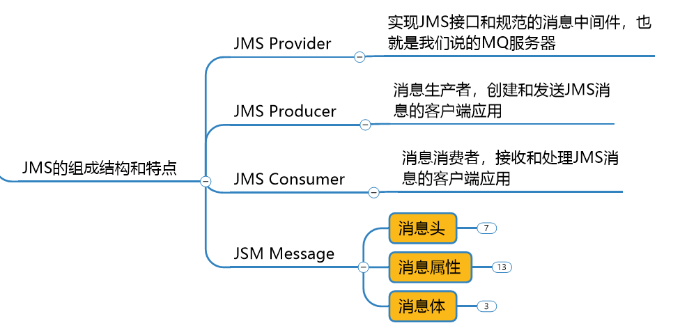

# 入门概述

## MQ的产品种类和对比


- Kafka：scala编程语言，大数据领域的主流MQ
- rabbitmq：erlang编程语言，不好修改底层
- rocketmq：java编程语言，适用于大型项目，适用于集群
- activemq：java编程语言，适用于中小型项目

## 产生背景

系统间之间调用的问题？

微服务架构后，链式调用是我们在写程序时候的一般流程，为了完成一个整体功能会将其拆分成多个函数（或子模块），比如模块A调用模块B，模块B调用模块C，模块C调用模块D。但在大型分布式应用中，系统间的RPC交互繁杂，一个功能背后要调用上百个接口并非不可能，从单机架构过渡到分布式微服务架构的通例。这些架构会有哪些问题？

（1）系统之间接口耦合比较严重

每新增一个下游功能，都要对上游的相关几口进行改造

举个例子：如果系统A要发送数据给系统B和系统C，发送给每个系统的数据可能有差异，因此系统A对要发送给每个系统的数据进行了组装，然后逐一发送。

当代吗上线后又新增了一个需求：把数据也发送给D，新上了一个D系统也要接受A系统的数据，此时就需要修改A系统，让他感知到D系统的存在，同时把数据处理好再给D。在这个过程你会看到，每接入一个下游系统，都要对系统A进行代码改造，开发联调的效率很低。其整体架构如下图：


（2）面对大流量并发时，容易被冲垮

每个接口模块的吞吐能力是有限的，这个上限能力如果是堤坝，当大流量（洪水）来临时，容易被冲垮。举个例子秒杀业务：上游系统发起下单购买操作，就是下单一个操作，很快就完成。然而，下游系统要完成秒杀业务后面的所有逻辑（读取订单，库存检查，库存冻结，余额检查，余额冻结，订单生产，余额扣减，库存减少，生成流水，余额解冻，库存解冻）。

（3）等待同步存在性能问题

RPC接口上基本都是同步调用，整体的服务性能遵循“木桶理论”，即整体系统的耗时取决于链路中最慢的那个接口。


根据上述的问题，在设计系统时可以明确要达到的目标：

1、要做到系统解耦，当新的模块接进来时，可以做到代码改动最小。能够解耦

2、设置流量缓冲池，可以让后端系统按照自身吞吐能力进行消费，不被冲垮。能削峰

3、强弱依赖梳理能将非关键调用链路的操作异步化并提升整体系统的吞吐能力。能异步

## MQ的主要作用

- 异步。调用者无需等待。
- 解耦。解决系统间耦合调用的问题。
- 削峰。抵御洪峰流量，保护了主业务。

## MQ的定义

面向消息的中间件（message-oriented middleware）MOM能够很好的解决以上问题。是指利用高效可靠的消息传递机制与平台无关的数据交流，并基于数据通信来进行分布式系统的集成。通过提供消息传递和消息排队模型在分布式环境下提供应用解耦，弹性伸缩，冗余存储、流量削峰，异步通信，数据同步等功能。

大致的过程是这样的：发送者把消息发送给消息服务器，消息服务器将消息存放在若干队列/主题topic中，在合适的时候，消息服务器回将消息转发给接受者。在这个过程中，发送和接收是异步的，也就是发送无需等待，而且发送者和接受者的生命周期也没有必然的关系；尤其在发布pub/订阅sub模式下，也可以完成一对多的通信，即让一个消息有多个接受者。


## MQ的特点

（1）采用异步处理模式

消息发送者可以发送一个消息而无须等待响应。消息发送者将消息发送到一条虚拟的通道（主题或者队列）上；

消息接收者则订阅或者监听该爱通道。一条消息可能最终转发给一个或者多个消息接收者，这些消息接收者都无需对消息发送者做出同步回应。整个过程都是异步的。

案例：

也就是说，一个系统跟另一个系统之间进行通信的时候，假如系统A希望发送一个消息给系统B，让他去处理。但是系统A不关注系统B到底怎么处理或者有没有处理好，所以系统A把消息发送给MQ，然后就不管这条消息的“死活了”，接着系统B从MQ里面消费出来处理即可。至于怎么处理，是否处理完毕，什么时候处理，都是系统B的事儿，与系统A无关。

（2）应用系统之间解耦合

发送者和接受者不必了解对方，只需要确认消息。

发送者和接受者不必同时在线。

（3）整体架构


（4）MQ的缺点

两个系统之间不能同步调用，不能实时回复，不能响应某个调用的回复。

# ActiveMQ安装和控制台

## ActiveMQ安装

（1）官网下载

官网地址：https://activemq.apache.org/

                                                 

（2）安装

```shell
[root@Administrator src]# tar -zxvf apache-activemq-5.16.0-bin.tar.gz
[root@Administrator src]# ll
总用量 238288
drwxr-xr-x. 10 root root       193 6月  25 14:07 apache-activemq-5.16.0
-rw-r--r--.  1 root root  62763232 7月  30 14:07 apache-activemq-5.16.0-bin.tar.gz
drwxr-xr-x.  8   10  143       255 8月   5 2015 jdk1.8.0_60
-rw-r--r--.  1 root root 181238643 3月  15 2019 jdk-8u60-linux-x64.tar.gz
[root@Administrator src]# pwd
/usr/local/src
# 启动命令
[root@Administrator bin]# ./activemq start
# 停止命令
[root@Administrator bin]# ./activemq stop
```

（3）启动指定日志输出文件

activemq日志默认的位置是在：%activemq安装目录%/data/activemq.log

```shell
[root@Administrator myactiveMQ]# cd apache-activemq-5.16.0/
[root@Administrator apache-activemq-5.16.0]# cd bin/
[root@Administrator bin]# ./activemq start > /usr/local/src/myactiveMQ/activeMQ_log.log
[root@Administrator bin]# cat /usr/local/src/myactiveMQ/activeMQ_log.log 
INFO: Loading '/usr/local/src/myactiveMQ/apache-activemq-5.16.0//bin/env'
INFO: Using java '/usr/local/src/jdk1.8.0_60/bin/java'
INFO: Starting - inspect logfiles specified in logging.properties and log4j.properties to get details
INFO: pidfile created : '/usr/local/src/myactiveMQ/apache-activemq-5.16.0//data/activemq.pid' (pid '54069')
```

（4）查看程序启动是否成功的3种方法（通用）

```shell
# 1、查看进程
[root@Administrator bin]# ps -ef|grep activemq
root     53729     1 41 15:12 pts/0    00:00:19 /usr/local/src/jdk1.8.0_60/bin/java -Xms64M -Xmx1G -Djava.util.logging.config.file=logging.properties -Djava.security.auth.login.config=/usr/local/src/apache-activemq-5.16.0//conf/login.config -Dcom.sun.management.jmxremote -Djava.awt.headless=true -Djava.io.tmpdir=/usr/local/src/apache-activemq-5.16.0//tmp -Dactivemq.classpath=/usr/local/src/apache-activemq-5.16.0//conf:/usr/local/src/apache-activem-5.16.0//../lib/: -Dactivemq.home=/usr/local/src/apache-activemq-5.16.0/ -Dactivemq.base=/usr/local/src/apache-activemq-5.16.0/ -Dactivemq.conf=/usr/local/src/apache-activemq-5.16.0//conf -Dactivemq.data=/usr/local/src/apacheactivemq-5.16.0//data -jar /usr/local/src/apache-activemq-5.16.0//bin/activemq.jar start
root     53785  3170  0 15:13 pts/0    00:00:00 grep --color=auto activemq
# 2、查看端口是否被占用
[root@Administrator bin]# netstat -anp|grep 61616
tcp6       0      0 :::61616                :::*                    LISTEN      53729/java       
# 3、查看端口是否被占用
[root@Administrator bin]# lsof -i:61616
COMMAND   PID USER   FD   TYPE DEVICE SIZE/OFF NODE NAME
java    53729 root  131u  IPv6  91271      0t0  TCP *:61616 (LISTEN)
```

## ActiveMQ控制台

访问activemq管理页面地址：

```java
http://192.168.44.151:8161/admin/ 
```

账户：admin，密码：admin

# 入门案例、MQ标准、API详解

## pom.xml

```pom
		<dependency>
            <groupId>org.apache.activemq</groupId>
            <artifactId>activemq-all</artifactId>
            <version>5.15.10</version>
        </dependency>
        
        <dependency>
            <groupId>org.apache.xbean</groupId>
            <artifactId>xbean-spring</artifactId>
            <version>3.16</version>
        </dependency>
```

## JMS编码总体规范


## Destination简介

Destination是目的地。下面拿jvm和mq，做个对比。目的地，我们可以理解为是数据存储的地方。


Destination分为两种：队列和主题。下图介绍：


## 队列消息生产者的入门案例

```java
package com.alex.activemq.queue;

import org.apache.activemq.ActiveMQConnectionFactory;
import javax.jms.*;

public class JmsProduce {

    // activeMQ地址+端口
    public static final String ACTIVEMQ_URL="tcp://192.168.44.151:61616";
    // 目的地是队列的名字
    public static final String QUEUE_NAME="jdbc01";

    public static void main(String[] args) throws JMSException {
        // 1 按照给定的url创建连接工厂，这个构造器采用默认的用户名密码。该类的其他构造方法可以指定用户名和密码。
        ActiveMQConnectionFactory connectionFactory = new ActiveMQConnectionFactory(ACTIVEMQ_URL);
        // 2 通过连接工厂，获得连接 connection 并启动访问。
        Connection connection = connectionFactory.createConnection();
        connection.start();
        // 3 创建会话session 。第一参数是是否开启事务， 第二参数是消息签收的方式
        Session session = connection.createSession(false, Session.AUTO_ACKNOWLEDGE);
        // 4 创建目的地（两种 ：队列/主题）。Destination是Queue和Topic的父类
        Queue queue = session.createQueue(QUEUE_NAME);
        // 5 创建消息的生产者
        MessageProducer messageProducer = session.createProducer(queue);
        // 6 通过messageProducer 生产 3 条 消息发送到消息队列中
        for (int i = 1; i < 4; i++) {
            // 7  创建消息
            TextMessage textMessage = session.createTextMessage("message--->" + i);
            // 8  通过messageProducer发送给mq
            messageProducer.send(textMessage);
        }
        // 9 关闭资源
        messageProducer.close();
        session.close();
        connection.close();
        System.out.println("发送消息成功~!");
    }
}
```

## ActiveMQ控制台之队列

运行上面代码，控制台显示如下：


Number Of Pending Messages：等待消费的消息，这个是未出队列的数量，公式=总接收数-总出队列数。

Number Of Consumers：消费者数量，消费者端的消费者数量。

Messages Enqueued：进队消息数，进队列的总消息量，包括出队列的。这个数只增不减。

Messages Dequeued：出队消息数，可以理解为是消费者消费掉的数量。

总结：

当有一个消息进入这个队列时，等待消费的消息是1，进入队列的消息是1。

当消息消费后，等待消费的消息是0，进入队列的消息是1，出队列的消息是1。

当再来一条消息时，等待消费的消息是1，进入队列的消息就是2。

## 队列消息消费者的入门案例

```java
package com.alex.activemq.queue;

import org.apache.activemq.ActiveMQConnectionFactory;

import javax.jms.*;

public class JmsConsumer {

    // activeMQ地址+端口
    public static final String ACTIVEMQ_URL="tcp://192.168.44.151:61616";
    // 目的地是队列的名字
    public static final String QUEUE_NAME="jdbc01";

    public static void main(String[] args) throws JMSException {
        // 1 按照给定的url创建连接工厂，这个构造器采用默认的用户名密码。该类的其他构造方法可以指定用户名和密码。
        ActiveMQConnectionFactory connectionFactory = new ActiveMQConnectionFactory(ACTIVEMQ_URL);
        // 2 通过连接工厂，获得连接 connection 并启动访问。
        Connection connection = connectionFactory.createConnection();
        connection.start();
        // 3 创建会话session 。第一参数是是否开启事务， 第二参数是消息签收的方式
        Session session = connection.createSession(false, Session.AUTO_ACKNOWLEDGE);
        // 4 创建目的地（两种 ：队列/主题）。Destination是Queue和Topic的父类
        Queue queue = session.createQueue(QUEUE_NAME);
        // 5 创建消息的消费者
        MessageConsumer messageConsumer = session.createConsumer(queue);
        while (true){
            TextMessage textMessage = (TextMessage) messageConsumer.receive();
            if (textMessage != null) {
                System.out.println("消费消息: " + textMessage.getText());
            }else{
                break;
            }
        }
        // 9 关闭资源
        messageConsumer.close();
        session.close();
        connection.close();
    }
}
```

控制台显示：


## 异步监听式消费者（MessageListener）

```java
package com.alex.activemq.queue;

import lombok.SneakyThrows;
import org.apache.activemq.ActiveMQConnectionFactory;

import javax.jms.*;
import java.io.IOException;

public class JmsConsumer_MessageListener {

    // activeMQ地址+端口
    public static final String ACTIVEMQ_URL="tcp://192.168.44.151:61616";
    // 目的地是队列的名字
    public static final String QUEUE_NAME="jdbc01";

    public static void main(String[] args) throws JMSException, IOException {
        // 1 按照给定的url创建连接工厂，这个构造器采用默认的用户名密码。该类的其他构造方法可以指定用户名和密码。
        ActiveMQConnectionFactory connectionFactory = new ActiveMQConnectionFactory(ACTIVEMQ_URL);
        // 2 通过连接工厂，获得连接 connection 并启动访问。
        Connection connection = connectionFactory.createConnection();
        connection.start();
        // 3 创建会话session 。第一参数是是否开启事务， 第二参数是消息签收的方式
        Session session = connection.createSession(false, Session.AUTO_ACKNOWLEDGE);
        // 4 创建目的地（两种 ：队列/主题）。Destination是Queue和Topic的父类
        Queue queue = session.createQueue(QUEUE_NAME);
        // 5 创建消息的消费者
        MessageConsumer messageConsumer = session.createConsumer(queue);
        /* 通过监听的方式来消费消息，是异步非阻塞的方式消费消息。
           通过messageConsumer 的setMessageListener 注册一个监听器，当有消息发送来时，系统自动调用MessageListener 的 onMessage 方法处理消息
         */
        messageConsumer.setMessageListener(new MessageListener() {
            @SneakyThrows
            @Override
            public void onMessage(Message message) {
                if (message != null && message instanceof TextMessage) {
                    TextMessage textMessage = (TextMessage) message;
                    System.out.printf("消费消息: %s%n", textMessage.getText());
                }
            }
        });
        // 让主线程不要结束。因为一旦主线程结束了，其他的线程（如此处的监听消息的线程）也都会被迫结束。
        // 实际开发中，我们的程序会一直运行，这句代码都会省略。
        System.in.read();
        // 9 关闭资源
        messageConsumer.close();
        session.close();
        connection.close();
    }
}
```

## 队列消息（Queue）总结

（1）两种消费方式

同步阻塞方式(receive)

订阅者或接收者抵用MessageConsumer的receive()方法来接收消息，receive方法在能接收到消息之前（或超时之前）将一直阻塞。

异步非阻塞方式（监听器onMessage()）

订阅者或接收者通过MessageConsumer的setMessageListener(MessageListener listener)注册一个消息监听器，当消息到达之后，系统会自动调用监听器MessageListener的onMessage(Message message)方法。

（2）队列的特点


（3）消息消费者情况


情况1：只启动消费者1。

结果：消费者1会消费所有的数据。

情况2：先启动消费者1，再启动消费者2。

结果：消费者1消费所有的数据。消费者2不会消费到消息。

情况3：生产者发布6条消息，在此之前已经启动了消费者1和消费者2。

结果：消费者1和消费者2平摊了消息。各自消费3条消息。

## Topic介绍、入门案例、控制台

### topic介绍

在发布订阅消息传递域中，目的地被称为主题（topic）

发布/订阅消息传递域的特点如下：

（1）生产者将消息发布到topic中，每个消息可以有多个消费者，属于1：N的关系；

（2）生产者和消费者之间有时间上的相关性。订阅某一个主题的消费者只能消费自它订阅之后发布的消息。

（3）生产者生产时，topic不保存消息它是无状态的不落地，假如无人订阅就去生产，那就是一条废消息，所以，一般先启动消费者再启动生产者。

​    默认情况下如上所述，但是JMS规范允许客户创建持久订阅，这在一定程度上放松了时间上的相关性要求。持久订阅允许消费者消费它在未处于激活状态时发送的消息。一句话，好比我们的微信公众号订阅


### 生产者案例

```java
package com.alex.activemq.topic;

import org.apache.activemq.ActiveMQConnectionFactory;

import javax.jms.*;

public class JmsProduce_topic {

    public static final String ACTIVEMQ_URL = "tcp://192.168.44.151:61616";

    public static final String TOPIC_NAME = "topic01";

    public static void main(String[] args) throws JMSException {
        ActiveMQConnectionFactory connectionFactory = new ActiveMQConnectionFactory(ACTIVEMQ_URL);
        Connection connection = connectionFactory.createConnection();
        connection.start();
        Session session = connection.createSession(false, Session.AUTO_ACKNOWLEDGE);
        Topic topic = (Topic) session.createTopic(TOPIC_NAME);
        MessageProducer messageProducer = session.createProducer(topic);
        for (int i = 1; i < 4; i++) {
            TextMessage textMessage = session.createTextMessage("topic message-->" + i);
            messageProducer.send(textMessage);
        }
        messageProducer.close();
        session.close();
        connection.close();
        System.out.println("*** TOPIC_NAME生产消息成功~! ***");
    }
}
```

### 消费者案例

```java
package com.alex.activemq.topic;

import org.apache.activemq.ActiveMQConnectionFactory;

import javax.jms.*;
import java.io.IOException;

public class JmsConsumer_topic {

    public static final String ACTIVEMQ_URL = "tcp://192.168.44.151:61616";

    public static final String TOPIC_NAME = "topic01";

    public static void main(String[] args) throws JMSException, IOException {
        // 1 按照给定的url创建连接工厂，这个构造器采用默认的用户名密码。该类的其他构造方法可以指定用户名和密码。
        ActiveMQConnectionFactory connectionFactory = new ActiveMQConnectionFactory(ACTIVEMQ_URL);
        // 2 通过连接工厂，获得连接 connection 并启动访问。
        Connection connection = connectionFactory.createConnection();
        connection.start();
        // 3 创建会话session 。第一参数是是否开启事务， 第二参数是消息签收的方式
        Session session = connection.createSession(false, Session.AUTO_ACKNOWLEDGE);
        // 4 创建目的地（两种 ：队列/主题）。Destination是Queue和Topic的父类
        Topic topic = session.createTopic(TOPIC_NAME);
        // 5 创建消息的消费者
        MessageConsumer messageConsumer = session.createConsumer(topic);
        messageConsumer.setMessageListener(message -> {
            if (message != null && message instanceof TextMessage) {
                TextMessage textMessage = (TextMessage) message;
                try {
                    System.out.println("*** 消费者消费TOPIC_NAME消息: *** " + textMessage.getText());
                } catch (JMSException e) {
                    e.printStackTrace();
                }
            }
        });
        System.in.read();
        messageConsumer.close();
        session.close();
        connection.close();
    }
}
```

多个消费者，当启动之后才能收到生产者生产的消息

### ActiveMQ控制台

topic有多个消费者时，消费消息的数量 ≈ 在线消费者数量*生产消息的数量。

下图展示了：我们先启动了3个消费者，再启动一个生产者，并生产了3条消息。


## topic和queue对比


# JMS规范

## JMS是什么

什么是Java消息服务？

Java消息服务指的是两个应用程序之间进行异步通信的API，它为标准协议和消息服务提供了一组通用接口，包括创建、发送、读取消息等，用于支持Java应用程序开发。在JavaEE中，当两个应用程序使用JMS进行通信时，它们之间不是直接相连的，而是通过一个共同的消息收发服务组件关联起来以达到解耦/异步削峰的效果。




## 消息头

JMS的消息头有哪些属性：

JMSDestination：消息目的地

JMSDeliveryMode：消息持久化模式

JMSExpiration：消息过期时间

JMSPriority：消息的优先级

JMSMessageID：消息的唯一标识符。后面我们会介绍如何解决幂等性。

说明：  消息的生产者可以set这些属性，消息的消费者可以get这些属性。这些属性在send方法里面也可以设置。

## 消息体


5种消息体格式：


### 消息生产者

```java
package com.alex.activemq.topic;

import org.apache.activemq.ActiveMQConnectionFactory;

import javax.jms.*;

public class JmsProduce_topic {

    public static final String ACTIVEMQ_URL = "tcp://192.168.44.151:61616";

    public static final String TOPIC_NAME = "topic01";

    public static void main(String[] args) throws JMSException {
        ActiveMQConnectionFactory connectionFactory = new ActiveMQConnectionFactory(ACTIVEMQ_URL);
        Connection connection = connectionFactory.createConnection();
        connection.start();
        Session session = connection.createSession(false, Session.AUTO_ACKNOWLEDGE);
        Topic topic = (Topic) session.createTopic(TOPIC_NAME);
        MessageProducer messageProducer = session.createProducer(topic);

        for (int i = 1; i < 4; i++) {
            TextMessage textMessage = session.createTextMessage("topic message-->" + i);
            messageProducer.send(textMessage);
            MapMessage mapMessage = session.createMapMessage();
            mapMessage.setString("name", "jack" + i);
            mapMessage.setInt("age", 1+i);
            messageProducer.send(mapMessage);
        }
        messageProducer.close();
        session.close();
        connection.close();
        System.out.println("*** TOPIC_NAME生产消息成功~! ***");
    }
}
```

### 消息消费者

```java
package com.alex.activemq.topic;

import org.apache.activemq.ActiveMQConnectionFactory;

import javax.jms.*;
import java.io.IOException;

public class JmsConsumer_topic {

    public static final String ACTIVEMQ_URL = "tcp://192.168.44.151:61616";

    public static final String TOPIC_NAME = "topic01";

    public static void main(String[] args) throws JMSException, IOException {
        // 1 按照给定的url创建连接工厂，这个构造器采用默认的用户名密码。该类的其他构造方法可以指定用户名和密码。
        ActiveMQConnectionFactory connectionFactory = new ActiveMQConnectionFactory(ACTIVEMQ_URL);
        // 2 通过连接工厂，获得连接 connection 并启动访问。
        Connection connection = connectionFactory.createConnection();
        connection.start();
        // 3 创建会话session 。第一参数是是否开启事务， 第二参数是消息签收的方式
        Session session = connection.createSession(false, Session.AUTO_ACKNOWLEDGE);
        // 4 创建目的地（两种 ：队列/主题）。Destination是Queue和Topic的父类
        Topic topic = session.createTopic(TOPIC_NAME);
        // 5 创建消息的消费者
        MessageConsumer messageConsumer = session.createConsumer(topic);
        messageConsumer.setMessageListener(message -> {
            if (message != null && message instanceof TextMessage) {
                TextMessage textMessage = (TextMessage) message;
                try {
                    System.out.println("*** 消费者消费TOPIC_NAME消息: *** " + textMessage.getText());
                } catch (JMSException e) {
                    e.printStackTrace();
                }
            }
            if (message != null && message instanceof MapMessage) {
                MapMessage mapMessage = (MapMessage)message;
                try {
                    String name = mapMessage.getString("name");
                    int age = mapMessage.getInt("age");
                    System.out.println("消费者消费TOPIC_NAME消息: name = " + name + ", age = " + age);
                } catch (JMSException e) {
                    e.printStackTrace();
                }

            }
        });

        System.in.read();
        messageConsumer.close();
        session.close();
        connection.close();
    }
}
```

## 消息属性

如果需要除消息头字段之外的值，那么可以使用消息属性。他是识别/去重/重点标注等操作，非常有用的方法。

他们是以属性名和属性值对的形式制定的。可以将属性是为消息头得扩展，属性指定一些消息头没有包括的附加信息，比如可以在属性里指定消息选择器。消息的属性就像可以分配给一条消息的附加消息头一样。它们允许开发者添加有关消息的不透明附加信息。它们还用于暴露消息选择器在消息过滤时使用的数据。（message.setxxxProperty）

### 消息生产者

```java
package com.alex.activemq.topic;

import org.apache.activemq.ActiveMQConnectionFactory;
import javax.jms.*;


public class JmsProduce_topic_MessageProperty {

    public static final String ACTIVEMQ_URL = "tcp://192.168.44.151:61616";

    public static final String TOPIC_NAME = "topic01";

    public static void main(String[] args) throws JMSException {
        ActiveMQConnectionFactory connectionFactory = new ActiveMQConnectionFactory(ACTIVEMQ_URL);
        Connection connection = connectionFactory.createConnection();
        connection.start();
        Session session = connection.createSession(false, Session.AUTO_ACKNOWLEDGE);
        Topic topic = (Topic) session.createTopic(TOPIC_NAME);
        MessageProducer messageProducer = session.createProducer(topic);

        for (int i = 1; i < 4; i++) {
            TextMessage textMessage = session.createTextMessage("topic message-->" + i);
            textMessage.setStringProperty("k1", "v1");
            textMessage.setBooleanProperty("flag", true);
            textMessage.setByteProperty("byte", (byte) 12);

            messageProducer.send(textMessage);
        }
        messageProducer.close();
        session.close();
        connection.close();
        System.out.println("*** TOPIC_NAME生产消息成功~! ***");
    }
}
```

### 消息消费者

```java
package com.alex.activemq.topic;

import org.apache.activemq.ActiveMQConnectionFactory;
import javax.jms.*;
import java.io.IOException;

public class JmsConsumer_topic_MessageProperty {

    public static final String ACTIVEMQ_URL = "tcp://192.168.44.151:61616";

    public static final String TOPIC_NAME = "topic01";

    public static void main(String[] args) throws JMSException, IOException {
        // 1 按照给定的url创建连接工厂，这个构造器采用默认的用户名密码。该类的其他构造方法可以指定用户名和密码。
        ActiveMQConnectionFactory connectionFactory = new ActiveMQConnectionFactory(ACTIVEMQ_URL);
        // 2 通过连接工厂，获得连接 connection 并启动访问。
        Connection connection = connectionFactory.createConnection();
        connection.start();
        // 3 创建会话session 。第一参数是是否开启事务， 第二参数是消息签收的方式
        Session session = connection.createSession(false, Session.AUTO_ACKNOWLEDGE);
        // 4 创建目的地（两种 ：队列/主题）。Destination是Queue和Topic的父类
        Topic topic = session.createTopic(TOPIC_NAME);
        // 5 创建消息的消费者
        MessageConsumer messageConsumer = session.createConsumer(topic);
        messageConsumer.setMessageListener(message -> {
            if (message != null && message instanceof TextMessage) {
                try {
                    TextMessage textMessage = (TextMessage) message;
                    System.out.println("*** 消费者消费TOPIC_NAME消息: *** " + textMessage.getText());

                    boolean flag = textMessage.getBooleanProperty("flag");
                    byte aByte = textMessage.getByteProperty("byte");
                    String k1 = textMessage.getStringProperty("k1");

                    System.out.println("消息属性k1 = " + k1 + ", byte = " + aByte + ", flag = " + flag);
                } catch (JMSException e) {
                    e.printStackTrace();
                }
            }
        });

        System.in.read();
        messageConsumer.close();
        session.close();
        connection.close();
    }
}
```

## 消息的持久化

什么是持久化消息？

保证消息只被传送一次和成功使用一次。在持久性消息传送至目标时，消息服务将其放入持久性数据存储。如果消息服务由于某种原因导致失败，它可以恢复此消息并将此消息传送至相应的消费者。虽然这样增加了消息传送的开销，但却增加了可靠性。

在消息生产者将消息成功发送给MQ消息中间件之后。无论是出现任何问题，如：MQ服务器宕机、消费者掉线等。都保证（topic要之前注册过，queue不用）消息消费者，能够成功消费消息。如果消息生产者发送消息就失败了，那么消费者也不会消费到该消息。


### queue消息非持久和持久

queue非持久，当服务器宕机，消息不存在（消息丢失了）。即便是非持久，消费者在不在线的话，消息也不会丢失，等待消费者在线，还是能够收到消息的。

queue持久化，当服务器宕机，消息依然存在。queue消息默认是持久化的。

持久化消息，保证这些消息只被传送一次和成功使用一次。对于这些消息，可靠性是优先考虑的因素。

可靠性的另一个重要方面是确保持久性消息传送至目标后，消息服务在向消费者传送它们之前不会丢失这些消息。

非持久化的消费者，和之前的代码一样。下面演示非持久化的生产者。

MQ服务端宕机重启，消息消费者收不到消息了

```java
package com.alex.activemq.queue;

import org.apache.activemq.ActiveMQConnectionFactory;

import javax.jms.*;

import static javax.jms.DeliveryMode.NON_PERSISTENT;

public class JmsProduce {

    // activeMQ地址+端口
    public static final String ACTIVEMQ_URL="tcp://192.168.44.151:61616";
    // 目的地是队列的名字
    public static final String QUEUE_NAME="jdbc01";

    public static void main(String[] args) throws JMSException {
        // 1 按照给定的url创建连接工厂，这个构造器采用默认的用户名密码。该类的其他构造方法可以指定用户名和密码。
        ActiveMQConnectionFactory connectionFactory = new ActiveMQConnectionFactory(ACTIVEMQ_URL);
        // 2 通过连接工厂，获得连接 connection 并启动访问。
        Connection connection = connectionFactory.createConnection();
        connection.start();
        // 3 创建会话session 。第一参数是是否开启事务， 第二参数是消息签收的方式
        Session session = connection.createSession(false, Session.AUTO_ACKNOWLEDGE);
        // 4 创建目的地（两种 ：队列/主题）。Destination是Queue和Topic的父类
        Queue queue = session.createQueue(QUEUE_NAME);
        // 5 创建消息的生产者
        MessageProducer messageProducer = session.createProducer(queue);
        // 6 通过messageProducer 生产 3 条 消息发送到消息队列中
        for (int i = 1; i < 8; i++) {
            // 7  创建消息
            TextMessage textMessage = session.createTextMessage("message--->" + i);
            // 设置非持久消息
            messageProducer.setDeliveryMode(NON_PERSISTENT);
            // 8  通过messageProducer发送给mq
            messageProducer.send(textMessage);
        }
        // 9 关闭资源
        messageProducer.close();
        session.close();
        connection.close();
        System.out.println("发送消息成功~!");
    }
}
```

持久化的消费者，和之前的代码一样。下面演示持久化的生产者。

生产者成功发布消息后，MQ服务端宕机重启，消费者仍可以收到该消息。

```java
package com.alex.activemq.queue;

import org.apache.activemq.ActiveMQConnectionFactory;

import javax.jms.*;

import static javax.jms.DeliveryMode.NON_PERSISTENT;

public class JmsProduce {

    // activeMQ地址+端口
    public static final String ACTIVEMQ_URL="tcp://192.168.44.151:61616";
    // 目的地是队列的名字
    public static final String QUEUE_NAME="jdbc01";

    public static void main(String[] args) throws JMSException {
        // 1 按照给定的url创建连接工厂，这个构造器采用默认的用户名密码。该类的其他构造方法可以指定用户名和密码。
        ActiveMQConnectionFactory connectionFactory = new ActiveMQConnectionFactory(ACTIVEMQ_URL);
        // 2 通过连接工厂，获得连接 connection 并启动访问。
        Connection connection = connectionFactory.createConnection();
        connection.start();
        // 3 创建会话session 。第一参数是是否开启事务， 第二参数是消息签收的方式
        Session session = connection.createSession(false, Session.AUTO_ACKNOWLEDGE);
        // 4 创建目的地（两种 ：队列/主题）。Destination是Queue和Topic的父类
        Queue queue = session.createQueue(QUEUE_NAME);
        // 5 创建消息的生产者
        MessageProducer messageProducer = session.createProducer(queue);
        // 6 通过messageProducer 生产 3 条 消息发送到消息队列中
        for (int i = 1; i < 8; i++) {
            // 7  创建消息
            TextMessage textMessage = session.createTextMessage("message--->" + i);
            // 设置持久消息
            messageProducer.setDeliveryMode(DeliveryMode.PERSISTENT);
            // 8  通过messageProducer发送给mq
            messageProducer.send(textMessage);
        }
        // 9 关闭资源
        messageProducer.close();
        session.close();
        connection.close();
        System.out.println("发送消息成功~!");
    }
}
```

### topic消息持久化

topic默认就是非持久化的，因为生产者生产消息时，消费者也要在线，这样消费者才能消费到消息。

topic消息持久化，只要消费者向MQ服务器注册过，所有生产者发布成功的消息，该消费者都能收到，不管是MQ服务器宕机还是消费者不在线。

注意：

1. 一定要先运行一次消费者，等于向MQ注册，类似我订阅了这个主题。

2. 然后再运行生产者发送消息。

3. 之后无论消费者是否在线，都会收到消息。如果不在线的话，下次连接的时候，会把没有收过的消息都接收过来。

持久化topic生产者代码

```java
package com.alex.activemq.topic;

import org.apache.activemq.ActiveMQConnectionFactory;
import javax.jms.*;
import static javax.jms.DeliveryMode.PERSISTENT;

public class JmsProduce_topic_delivery {

    public static final String ACTIVEMQ_URL = "tcp://192.168.44.151:61616";

    public static final String TOPIC_NAME = "topic01";

    public static void main(String[] args) throws JMSException {
        ActiveMQConnectionFactory connectionFactory = new ActiveMQConnectionFactory(ACTIVEMQ_URL);
        Connection connection = connectionFactory.createConnection();
        Session session = connection.createSession(false, Session.AUTO_ACKNOWLEDGE);
        Topic topic = (Topic) session.createTopic(TOPIC_NAME);
        MessageProducer messageProducer = session.createProducer(topic);
        // 设置持久化topic
        messageProducer.setDeliveryMode(PERSISTENT);
        // 设置持久化之后再启动连接
        connection.start();

        for (int i = 1; i < 4; i++) {
            TextMessage textMessage = session.createTextMessage("topic message-->" + i);

            messageProducer.send(textMessage);
        }
        messageProducer.close();
        session.close();
        connection.close();
        System.out.println("*** TOPIC_NAME生产消息成功~! ***");
    }
}
```

持久化topic消费者代码

```java
package com.alex.activemq.topic;

import org.apache.activemq.ActiveMQConnectionFactory;
import javax.jms.*;
import java.io.IOException;

public class JmsConsumer_topic_delivery {

    public static final String ACTIVEMQ_URL = "tcp://192.168.44.151:61616";

    public static final String TOPIC_NAME = "topic01";

    public static void main(String[] args) throws JMSException, IOException {
        // 1 按照给定的url创建连接工厂，这个构造器采用默认的用户名密码。该类的其他构造方法可以指定用户名和密码。
        ActiveMQConnectionFactory connectionFactory = new ActiveMQConnectionFactory(ACTIVEMQ_URL);
        // 2 通过连接工厂，获得连接 connection
        Connection connection = connectionFactory.createConnection();
        connection.setClientID("myId");
        // 3 创建会话session 。第一参数是是否开启事务， 第二参数是消息签收的方式
        Session session = connection.createSession(false, Session.AUTO_ACKNOWLEDGE);
        // 4 创建目的地（两种 ：队列/主题）。Destination是Queue和Topic的父类
        Topic topic = session.createTopic(TOPIC_NAME);
        // 5 创建主题订阅者, 第一个参数是topic, 第二个参数是订阅者的名字
        TopicSubscriber topicSubscriber = session.createDurableSubscriber(topic, "remark");
        connection.start();

        Message message = topicSubscriber.receive();
        while (message != null){
            TextMessage textMessage = (TextMessage) message;
            System.out.println("订阅者消费消息: " + textMessage.getText());

            message = topicSubscriber.receive();
        }
        topicSubscriber.close();
        session.close();
        connection.close();
    }
}
```

控制台介绍：

topic页面还是和之前的一样。另外在subscribers页面也会显示。如下：


## 消息的事务性


(1) 生产者开启事务后，执行commit方法，这批消息才真正的被提交。不执行commit方法，这批消息不会提交。执行rollback方法，之前的消息会回滚掉。生产者的事务机制，要高于签收机制，当生产者开启事务，签收机制不再重要。

(2) 消费者开启事务后，执行commit方法，这批消息才算真正的被消费。不执行commit方法，这些消息不会标记已消费，下次还会被消费。执行rollback方法，是不能回滚之前执行过的业务逻辑，但是能够回滚之前的消息，回滚后的消息，下次还会被消费。消费者利用commit和rollback方法，甚至能够违反一个消费者只能消费一次消息的原理。 

(3) 问：消费者和生产者需要同时操作事务才行吗？   

答：消费者和生产者的事务，完全没有关联，各自是各自的事务。

### 生产者代码

```java
package com.alex.activemq.tx;

import org.apache.activemq.ActiveMQConnectionFactory;
import javax.jms.*;

public class JmsProduce_tx {

    // activeMQ地址+端口
    public static final String ACTIVEMQ_URL="tcp://192.168.44.151:61616";
    // 目的地是队列的名字
    public static final String QUEUE_NAME="queue_tx";

    public static void main(String[] args) throws JMSException {
        ActiveMQConnectionFactory connectionFactory = new ActiveMQConnectionFactory(ACTIVEMQ_URL);
        Connection connection = connectionFactory.createConnection();
        connection.start();
        // 3 创建会话session 。第一参数是是否开启事务， 第二参数是消息签收的方式
        Session session = connection.createSession(true, Session.AUTO_ACKNOWLEDGE);
        Queue queue = session.createQueue(QUEUE_NAME);
        MessageProducer messageProducer = session.createProducer(queue);
        try {
            for (int i = 1; i < 4; i++) {
                TextMessage textMessage = session.createTextMessage("message--->" + i);
                messageProducer.send(textMessage);
                if( i == 4){
                    throw new RuntimeException("异常啦~!");
                }
            }
            // 需要提交事务才能将这些消息发送出去
            session.commit();
            System.out.println("发送消息成功~!");
        }catch (Exception exception){
            System.out.println("出现异常,消息回滚");
            // 消息回滚
            session.rollback();
        }finally {
            // 9 关闭资源
            messageProducer.close();
            session.close();
            connection.close();
        }
    }
}
```

### 消费者代码

```java
package com.alex.activemq.tx;

import org.apache.activemq.ActiveMQConnectionFactory;

import javax.jms.*;
import java.io.IOException;

public class JmsConsumer_tx {

    // activeMQ地址+端口
    public static final String ACTIVEMQ_URL="tcp://192.168.44.151:61616";
    // 目的地是队列的名字
    public static final String QUEUE_NAME="queue_tx";

    public static void main(String[] args) throws JMSException, IOException {
        ActiveMQConnectionFactory connectionFactory = new ActiveMQConnectionFactory(ACTIVEMQ_URL);
        Connection connection = connectionFactory.createConnection();
        connection.start();
        Session session = connection.createSession(true, Session.AUTO_ACKNOWLEDGE);
        Queue queue = session.createQueue(QUEUE_NAME);
        MessageConsumer messageConsumer = session.createConsumer(queue);
        messageConsumer.setMessageListener(new MessageListener() {
            int a = 0;
            @Override
            public void onMessage(Message message) {
                try {
                    TextMessage textMessage = (TextMessage) message;
                    System.out.println("消费者收到消息: " + textMessage.getText());
                    if(a == 0){
                        System.out.println("*** commit *** ");
                        session.commit();
                    }
                    if(a == 2){
                        System.out.println("*** rollback ***");
                        session.rollback();
                    }
                    a++;
                } catch (JMSException e) {
                    try {
                        System.out.println("异常啦,消息回滚");
                        session.rollback();
                    } catch (JMSException jmsException) {
                        jmsException.printStackTrace();
                    }
                }
            }
        });

        System.in.read();
        messageConsumer.close();
        session.close();
        connection.close();
    }
}
```

消费者的控制台输出信息。可以看出commit和rollback方法的作用。

```java
消费者收到消息: message--->1
*** commit *** 
消费者收到消息: message--->2
消费者收到消息: message--->3
*** rollback ***
消费者收到消息: message--->2
消费者收到消息: message--->3
```

## 消息的签收机制

### 签收的几种方式

①　自动签收（Session.AUTO_ACKNOWLEDGE）：该方式是默认的。该种方式，无需我们程序做任何操作，框架会帮我们自动签收收到的消息。

②　手动签收（Session.CLIENT_ACKNOWLEDGE）：手动签收。该种方式，需要我们手动调用Message.acknowledge()，来签收消息。如果不签收消息，该消息会被我们反复消费，只到被签收。

③　允许重复消息（Session.DUPS_OK_ACKNOWLEDGE）：多线程或多个消费者同时消费到一个消息，因为线程不安全，可能会重复消费。该种方式很少使用到。

④　事务下的签收（Session.SESSION_TRANSACTED）：开始事务的情况下，可以使用该方式。该种方式很少使用到。

### 事务和签收的关系

①　在事务性会话中，当一个事务被成功提交则消息被自动签收。如果事务回滚，则消息会被再次传送。事务优先于签收，开始事务后，签收机制不再起任何作用。

②　非事务性会话中，消息何时被确认取决于创建会话时的应答模式。

③　生产者事务开启，只有commit后才能将全部消息变为已消费。

④　事务偏向生产者，签收偏向消费者。也就是说，生产者使用事务更好点，消费者使用签收机制更好点。

### 生产者代码

没有变化

```java
package com.alex.activemq.ack;

import org.apache.activemq.ActiveMQConnectionFactory;
import javax.jms.*;

public class JmsProduce_ack {

    // activeMQ地址+端口
    public static final String ACTIVEMQ_URL="tcp://192.168.44.151:61616";
    // 目的地是队列的名字
    public static final String QUEUE_NAME="queue_ack";

    public static void main(String[] args) throws JMSException {
        ActiveMQConnectionFactory connectionFactory = new ActiveMQConnectionFactory(ACTIVEMQ_URL);
        Connection connection = connectionFactory.createConnection();
        connection.start();
        Session session = connection.createSession(false, Session.AUTO_ACKNOWLEDGE);
        Queue queue = session.createQueue(QUEUE_NAME);
        MessageProducer messageProducer = session.createProducer(queue);
        for (int i = 1; i < 8; i++) {
            TextMessage textMessage = session.createTextMessage("message--->" + i);
            messageProducer.send(textMessage);
        }
        messageProducer.close();
        session.close();
        connection.close();
        System.out.println("发送消息成功~!");
    }
}
```

### 消费者代码

```java
package com.alex.activemq.ack;

import lombok.SneakyThrows;
import org.apache.activemq.ActiveMQConnectionFactory;
import javax.jms.*;
import java.io.IOException;

public class JmsConsumer_ack {

    // activeMQ地址+端口
    public static final String ACTIVEMQ_URL="tcp://192.168.44.151:61616";
    // 目的地是队列的名字
    public static final String QUEUE_NAME="queue_ack";

    public static void main(String[] args) throws JMSException, IOException {
        ActiveMQConnectionFactory connectionFactory = new ActiveMQConnectionFactory(ACTIVEMQ_URL);
        Connection connection = connectionFactory.createConnection();
        connection.start();
        Session session = connection.createSession(false, Session.CLIENT_ACKNOWLEDGE);
        Queue queue = session.createQueue(QUEUE_NAME);
        MessageConsumer messageConsumer = session.createConsumer(queue);

        messageConsumer.setMessageListener(new MessageListener() {
            @SneakyThrows
            @Override
            public void onMessage(Message message) {
                if (message != null && message instanceof TextMessage) {
                    TextMessage textMessage = (TextMessage) message;
                    System.out.println("消费者收到消息: " + textMessage.getText());
                    /* 设置为Session.CLIENT_ACKNOWLEDGE后，要调用该方法，标志着该消息已被签收（消费）。
                        如果不调用该方法，该消息的标志还是未消费，下次启动消费者或其他消费者还会收到改消息。
                     */
                    textMessage.acknowledge();
                }
            }
        });

        System.in.read();
        messageConsumer.close();
        session.close();
        connection.close();
    }
}
```

## JMS的点对点总结

点对点模型是基于队列的，生产者发消息到队列，消费者从队列接收消息，队列的存在使得消息的异步传输成为可能。和我们平时给朋友发送短信类似。

如果在Session关闭时有部分消息己被收到但还没有被签收(acknowledged),那当消费者下次连接到相同的队列时，这些消息还会被再次接收

队列可以长久地保存消息直到消费者收到消息。消费者不需要因为担心消息会丢失而时刻和队列保持激活的连接状态，充分体现了异步传输模式的优势

## JMS的发布订阅总结

(1) JMS的发布订阅总结

JMS Pub/Sub 模型定义了如何向一个内容节点发布和订阅消息，这些节点被称作topic。

主题可以被认为是消息的传输中介，发布者（publisher）发布消息到主题，订阅者（subscribe）从主题订阅消息。

主题使得消息订阅者和消息发布者保持互相独立不需要解除即可保证消息的传送

(2) 非持久订阅

非持久订阅只有当客户端处于激活状态，也就是和MQ保持连接状态才能收发到某个主题的消息。

如果消费者处于离线状态，生产者发送的主题消息将会丢失作废，消费者永远不会收到。

​    一句话：先订阅注册才能接受到发布，只给订阅者发布消息。

(3) 持久订阅

客户端首先向MQ注册一个自己的身份ID识别号，当这个客户端处于离线时，生产者会为这个ID保存所有发送到主题的消息，当客户再次连接到MQ的时候，会根据消费者的ID得到所有当自己处于离线时发送到主题的消息

非持久订阅状态下，不能恢复或重新派送一个未签收的消息。

持久订阅才能恢复或重新派送一个未签收的消息。

(4) 非持久和持久化订阅如何选择

当所有的消息必须被接收，则用持久化订阅。当消息丢失能够被容忍，则用非持久订阅。

# ActiveMQ的broker

（1）broker是什么

相当于一个ActiveMQ服务器实例。说白了，Broker其实就是实现了用代码的形式启动ActiveMQ将MQ嵌入到Java代码中，以便随时用随时启动，在用的时候再去启动这样能节省了资源，也保证了可用性。这种方式，我们实际开发中很少采用，因为他缺少太多了东西，如：日志，数据存储等等。

（2）启动broker时指定配置文件

启动broker时指定配置文件，可以帮助我们在一台服务器上启动多个broker。实际工作中一般一台服务器只启动一个broker。


（3）嵌入式的broker启动

用ActiveMQ Broker作为独立的消息服务器来构建Java应用。

ActiveMQ也支持在vm中通信基于嵌入的broker，能够无缝的集成其他java应用。

```pom
<dependency>
    <groupId>com.fasterxml.jackson.core</groupId>
    <artifactId>jackson-databind</artifactId>
    <version>2.9.5</version>
</dependency>
```

```java
package com.alex.activemq.broker;

import org.apache.activemq.broker.BrokerService;

public class EmbedBroker {

    public static void main(String[] args) throws Exception {
        // ActiveMQ也支持在vm中通信基于嵌入的broker
        BrokerService brokerService = new BrokerService();
        brokerService.addConnector("tcp://localhost:61616");
        brokerService.setUseJmx(true);
        brokerService.start();
    }
}
```

# Spring整合ActiveMQ

## pom.xml

```pom
<!-- activemq连接池 -->
        <dependency>
            <groupId>org.apache.activemq</groupId>
            <artifactId>activemq-pool</artifactId>
            <version>5.15.10</version>
        </dependency>
        <!-- spring支持jms的包 -->
        <dependency>
            <groupId>org.springframework</groupId>
            <artifactId>spring-jms</artifactId>
            <version>5.2.1.RELEASE</version>
        </dependency>

        <dependency>
            <groupId>org.springframework</groupId>
            <artifactId>spring-aop</artifactId>
            <version>5.2.1.RELEASE</version>
        </dependency>
        <!-- Spring核心依赖 -->
        <dependency>
            <groupId>org.springframework</groupId>
            <artifactId>spring-core</artifactId>
            <version>4.3.23.RELEASE</version>
        </dependency>
        <dependency>
            <groupId>org.springframework</groupId>
            <artifactId>spring-context</artifactId>
            <version>4.3.23.RELEASE</version>
        </dependency>
        <dependency>
            <groupId>org.springframework</groupId>
            <artifactId>spring-orm</artifactId>
            <version>4.3.23.RELEASE</version>
        </dependency>
```

## Spring的ActiveMQ配置文件

```xml
<?xml version="1.0" encoding="UTF-8"?>
<beans xmlns="http://www.springframework.org/schema/beans"
       xmlns:xsi="http://www.w3.org/2001/XMLSchema-instance"
       xmlns:context="http://www.springframework.org/schema/context"
       xsi:schemaLocation="http://www.springframework.org/schema/beans http://www.springframework.org/schema/beans/spring-beans.xsd http://www.springframework.org/schema/context https://www.springframework.org/schema/context/spring-context.xsd">

    <!--  开启包的自动扫描  -->
    <context:component-scan base-package="com.alex.activemq"/>
    <!--  配置生产者  -->
    <bean id="connectionFactory" class="org.apache.activemq.pool.PooledConnectionFactory" destroy-method="stop">
        <property name="connectionFactory">
            <!--      真正可以生产Connection的ConnectionFactory,由对应的JMS服务商提供      -->
            <bean class="org.apache.activemq.spring.ActiveMQConnectionFactory">
                <property name="brokerURL" value="tcp://192.168.44.151:61616"/>
            </bean>
        </property>
        <property name="maxConnections" value="100"/>
    </bean>

    <!--  这个是队列目的地,点对点的Queue  -->
    <bean id="destinationQueue" class="org.apache.activemq.command.ActiveMQQueue">
        <!--    通过构造注入Queue名    -->
        <constructor-arg index="0" value="spring-active-queue"/>
    </bean>

    <!--  这个是队列目的地,  发布订阅的主题Topic-->
    <bean id="destinationTopic" class="org.apache.activemq.command.ActiveMQTopic">
        <constructor-arg index="0" value="spring-active-topic"/>
    </bean>

    <!--  Spring提供的JMS工具类,他可以进行消息发送,接收等  -->
    <bean id="jmsTemplate" class="org.springframework.jms.core.JmsTemplate">
        <!--    传入连接工厂    -->
        <property name="connectionFactory" ref="connectionFactory"/>
        <!--    传入目的地    -->
        <property name="defaultDestination" ref="destinationQueue"/>
        <!--    消息自动转换器    -->
        <property name="messageConverter">
            <bean class="org.springframework.jms.support.converter.SimpleMessageConverter"/>
        </property>
    </bean>
</beans>
```

## 队列消息生产者

```java
package com.alex.activemq.spring;

import org.apache.xbean.spring.context.ClassPathXmlApplicationContext;
import org.springframework.beans.factory.annotation.Autowired;
import org.springframework.jms.core.JmsTemplate;
import org.springframework.jms.core.MessageCreator;
import org.springframework.stereotype.Component;

import javax.jms.JMSException;
import javax.jms.Message;
import javax.jms.Session;

@Component
public class SpringMQ_Produce {

    @Autowired
    private JmsTemplate jmsTemplate;

    public static void main(String[] args) {
        ClassPathXmlApplicationContext classPathXmlApplicationContext = new ClassPathXmlApplicationContext("spring-activemq.xml");
        SpringMQ_Produce springMQ_produce = classPathXmlApplicationContext.getBean(SpringMQ_Produce.class);
        springMQ_produce.jmsTemplate.send(new MessageCreator() {
            @Override
            public Message createMessage(Session session) throws JMSException {
                return session.createTextMessage("*** spring 整合 ActivMQ消息 *** ");
            }
        });
        System.out.println("spring 整合 ActiveMQ消息发布成功~!");
    }
}
```

## 队列消息消费者

```java
package com.alex.activemq.spring;

import org.apache.xbean.spring.context.ClassPathXmlApplicationContext;
import org.springframework.beans.factory.annotation.Autowired;
import org.springframework.jms.core.JmsTemplate;
import org.springframework.stereotype.Service;

/**
 * @author zhanghao
 * @date 2020/7/31 - 13:37
 */
@Service
public class SpringMQ_Consumer {

    @Autowired
    private JmsTemplate jmsTemplate;

    public static void main(String[] args) {
        ClassPathXmlApplicationContext classPathXmlApplicationContext = new ClassPathXmlApplicationContext("spring-activemq.xml");
        SpringMQ_Consumer bean = classPathXmlApplicationContext.getBean(SpringMQ_Consumer.class);
        String message = (String) bean.jmsTemplate.receiveAndConvert();
        System.out.println("队列消费者消费消息: " + message);
    }
}
```

## 主题生产者和消费者

java代码不需要修改，只需要将配置文件中的目的地修改为topic配置即可

```xml
<!--  这个是队列目的地,  发布订阅的主题Topic-->
    <bean id="destinationTopic" class="org.apache.activemq.command.ActiveMQTopic">
        <constructor-arg index="0" value="spring-active-topic"/>
    </bean>

    <!--  Spring提供的JMS工具类,他可以进行消息发送,接收等  -->
    <bean id="jmsTemplate" class="org.springframework.jms.core.JmsTemplate">
        <!--    传入连接工厂    -->
        <property name="connectionFactory" ref="connectionFactory"/>
        <!--    传入目的地    -->
<!--        <property name="defaultDestination" ref="destinationQueue"/>-->
        <property name="defaultDestination" ref="destinationTopic"/>
        <!--    消息自动转换器    -->
        <property name="messageConverter">
            <bean class="org.springframework.jms.support.converter.SimpleMessageConverter"/>
        </property>
    </bean>
```

## 配置消费者的监听类

不需要启动消费者，就可以消费消息

```java
package com.alex.activemq.spring;

import org.springframework.stereotype.Component;

import javax.jms.JMSException;
import javax.jms.Message;
import javax.jms.MessageListener;
import javax.jms.TextMessage;

@Component
public class MyMessageListener implements MessageListener {
    @Override
    public void onMessage(Message message) {
        if (message != null && message instanceof TextMessage) {
            TextMessage textMessage = (TextMessage) message;
            try {
                System.out.println(textMessage.getText());
            } catch (JMSException e) {
                e.printStackTrace();
            }
        }
    }
}
```

```xml
<bean id="jmsContainer" class="org.springframework.jms.listener.DefaultMessageListenerContainer">
        <property name="messageListener" ref="myMessageListener"></property>
        <property name="connectionFactory" ref="connectionFactory"></property>
        <property name="destination" ref="destinationTopic"></property>
    </bean>
```

# SpringBoot整合ActiveMQ

## queue生产者

```pom
<?xml version="1.0" encoding="UTF-8"?>
<project xmlns="http://maven.apache.org/POM/4.0.0"
         xmlns:xsi="http://www.w3.org/2001/XMLSchema-instance"
         xsi:schemaLocation="http://maven.apache.org/POM/4.0.0 http://maven.apache.org/xsd/maven-4.0.0.xsd">
    <modelVersion>4.0.0</modelVersion>

    <parent>
        <groupId>org.springframework.boot</groupId>
        <artifactId>spring-boot-starter-parent</artifactId>
        <version>2.1.5.RELEASE</version>
        <relativePath/> <!-- lookup parent from repository -->
    </parent>

    <groupId>com.alex</groupId>
    <artifactId>boot_mq_produce</artifactId>
    <version>1.0-SNAPSHOT</version>

    <properties>
        <project.build.sourceEncoding>UTF-8</project.build.sourceEncoding>
        <maven.compiler.source>1.8</maven.compiler.source>
        <maven.compiler.target>1.8</maven.compiler.target>
    </properties>

    <dependencies>
        <dependency>
            <groupId>org.springframework.boot</groupId>
            <artifactId>spring-boot-starter-test</artifactId>
            <scope>test</scope>
        </dependency>
        <dependency>
            <groupId>org.springframework.boot</groupId>
            <artifactId>spring-boot-starter-web</artifactId>
        </dependency>

        <dependency>
            <groupId>org.springframework.boot</groupId>
            <artifactId>spring-boot-starter</artifactId>
        </dependency>
        <!--spring boot整合activemq的jar包-->
        <dependency>
            <groupId>org.springframework.boot</groupId>
            <artifactId>spring-boot-starter-activemq</artifactId>
            <version>2.1.5.RELEASE</version>
        </dependency>
    </dependencies>

    <build>
        <plugins>
            <plugin>
                <groupId>org.springframework.boot</groupId>
                <artifactId>spring-boot-maven-plugin</artifactId>
            </plugin>
        </plugins>
    </build>
</project>
```

```yml
spring:
  activemq:
    broker-url: tcp://192.168.44.151:61616
    password: admin
    user: admin
  jms:
    pub-sub-domain: false

myqueue: boot-activemq-queue
```

主启动类

```java
package com.alex.activemq;

import org.springframework.boot.SpringApplication;
import org.springframework.boot.autoconfigure.SpringBootApplication;
import org.springframework.jms.annotation.EnableJms;

@SpringBootApplication
@EnableJms
public class MainApp_Produce {

    public static void main(String[] args) {
        SpringApplication.run(MainApp_Produce.class, args);
    }
}
```

配置类

```java
package com.alex.activemq.config;

import org.apache.activemq.command.ActiveMQQueue;
import org.springframework.beans.factory.annotation.Value;
import org.springframework.context.annotation.Bean;
import org.springframework.context.annotation.Configuration;
import javax.jms.Destination;

@Configuration
public class MyConfig {

    @Value("${myqueue}")
    private String queueName;

    @Bean
    public ActiveMQQueue activeMQQueue(){
        return new ActiveMQQueue(queueName);
    }
}
```

```java
package com.alex.activemq.component;

import org.apache.activemq.command.ActiveMQQueue;
import org.springframework.beans.factory.annotation.Autowired;
import org.springframework.context.annotation.Bean;
import org.springframework.jms.core.JmsTemplate;
import org.springframework.stereotype.Component;
import javax.jms.Destination;
import java.util.Random;
import java.util.UUID;

@Component
public class Queue_Produce {

    @Autowired
    private ActiveMQQueue activeMQQueue;

    @Autowired
    private JmsTemplate jmsTemplate;

    public void sendMessage(){
        jmsTemplate.convertAndSend(activeMQQueue, UUID.randomUUID().toString().substring(0, 8));
        System.out.println("发布消息~!");
    }
}
```

测试类

```java
package com.alex.activemq;

import com.alex.activemq.component.Queue_Produce;
import org.junit.Test;
import org.junit.runner.RunWith;
import org.springframework.beans.factory.annotation.Autowired;
import org.springframework.boot.test.context.SpringBootTest;
import org.springframework.test.context.junit4.SpringJUnit4ClassRunner;
import org.springframework.test.context.web.WebAppConfiguration;

@SpringBootTest(classes = MainApp_Produce.class)
@RunWith(SpringJUnit4ClassRunner.class)
@WebAppConfiguration
public class TestActiveMQ {

    @Autowired
    private Queue_Produce queue_produce;

    @Test
    public void testProduce(){
        queue_produce.sendMessage();
   }
}
```

## queue消费者

```java
package com.alex.activemq.component;

import org.springframework.beans.factory.annotation.Value;
import org.springframework.jms.annotation.JmsListener;
import org.springframework.stereotype.Component;

import javax.jms.JMSException;
import javax.jms.TextMessage;

@Component
public class Queue_consummer {

    @JmsListener(destination = "${myqueue}")
    public void reieve(TextMessage textMessage) throws JMSException {
        System.out.println( "消费者消费消息: "+ textMessage.getText());
    }
}
```

## topic生产者

```yml
spring:
  activemq:
    broker-url: tcp://192.168.44.151:61616
    password: admin
    user: admin
  jms:
    pub-sub-domain: true

server:
  port: 8083

mytopic: boot-activemq-topic
```

```java
package com.alex.activemq.component;

import org.springframework.beans.factory.annotation.Autowired;
import org.springframework.beans.factory.annotation.Value;
import org.springframework.context.annotation.Bean;
import org.springframework.jms.annotation.EnableJms;
import org.springframework.jms.core.JmsTemplate;
import org.springframework.scheduling.annotation.EnableScheduling;
import org.springframework.scheduling.annotation.Scheduled;
import org.springframework.stereotype.Component;

import javax.jms.Topic;
import java.util.UUID;

@Component
@EnableJms
@EnableScheduling
public class Topic_Produce {

    @Autowired
    private JmsTemplate jmsTemplate;

    @Autowired
    private Topic topic;

    @Scheduled(fixedDelay = 3000L)
    public void sendMessage(){
        jmsTemplate.convertAndSend(topic, String.format("topic 生产者发送消息: %s", UUID.randomUUID().toString().substring(0, 8)));
        System.out.println("topic 生产者发送消息~!");
    }
}
```

```java
package com.alex.activemq.config;

import org.apache.activemq.command.ActiveMQTempTopic;
import org.apache.activemq.command.ActiveMQTopic;
import org.springframework.beans.factory.annotation.Value;
import org.springframework.context.annotation.Bean;
import org.springframework.context.annotation.Configuration;

import javax.jms.Topic;

@Configuration
public class MyConfig {

    @Value("${mytopic}")
    private String topicName;

    @Bean
    public Topic topic(){
        return new ActiveMQTopic(topicName);
    }
}
```

## topic消费者

```java
package com.alex.activemq.component;

import org.springframework.beans.factory.annotation.Autowired;
import org.springframework.jms.annotation.JmsListener;
import org.springframework.jms.core.JmsTemplate;
import org.springframework.stereotype.Component;
import javax.jms.JMSException;
import javax.jms.TextMessage;

@Component
public class Topic_Consumer {

    @JmsListener(destination = "${mytopic}")
    public void reieveTopicMessage(TextMessage textMessage) throws JMSException {
        System.out.println("topic消费者消费消息: " + textMessage.getText());
    }
}
```

# ActiveMQ的传输协议

## 简介

ActiveMQ支持的client-broker通讯协议有：TVP、NIO、UDP、SSL、Http(s)、VM。其中配置Transport Connector的文件在ActiveMQ安装目录的conf/activemq.xml中的<transportConnectors>标签之内。

activemq传输协议的官方文档：http://activemq.apache.org/configuring-version-5-transports.html

这些协议参见文件：%activeMQ安装目录%/conf/activemq.xml，下面是文件的重要的内容

```xml
<transportConnectors>
<transportConnector name="openwire" uri="tcp://0.0.0.0:61616?maximumConnections=1000&amp;wireFormat.maxFrameSize=104857600"/>
<transportConnector name="amqp" uri="amqp://0.0.0.0:5672?maximumConnections=1000&amp;wireFormat.maxFrameSize=104857600"/>
<transportConnector name="stomp" uri="stomp://0.0.0.0:61613?maximumConnections=1000&amp;wireFormat.maxFrameSize=104857600"/>
      <transportConnector name="mqtt" uri="mqtt://0.0.0.0:1884?maximumConnections=1000&amp;wireFormat.maxFrameSize=104857600"/>
      <transportConnector name="ws" uri="ws://0.0.0.0:61614?maximumConnections=1000&amp;wireFormat.maxFrameSize=104857600"/>
</transportConnectors>
```

在上文给出的配置信息中，URI描述信息的头部都是采用协议名称：例如

描述amqp协议的监听端口时，采用的URI描述格式为“amqp://······”；

描述Stomp协议的监听端口时，采用URI描述格式为“stomp://······”；

唯独在进行openwire协议描述时，URI头却采用的“tcp://······”。这是因为ActiveMQ中默认的消息协议就是openwire

## 支持的传输协议

个人说明：除了tcp和nio协议，其他的了解就行。各种协议有各自擅长该协议的中间件，工作中一般不会使用activemq去实现这些协议。如： mqtt是物联网专用协议，采用的中间件一般是mosquito。ws是websocket的协议，是和前端对接常用的，一般在java代码中内嵌一个基站（中间件）。stomp好像是邮箱使用的协议的，各大邮箱公司都有基站（中间件）。

注意：协议不同，我们的代码都会不同。


### TCP协议

(1) Transmission Control Protocol(TCP)是默认的。TCP的Client监听端口61616

(2) 在网络传输数据前，必须要先序列化数据，消息是通过一个叫wire protocol的来序列化成字节流。

(3) TCP连接的URI形式如：tcp://HostName:port?key=value&key=value，后面的参数是可选的。

(4) TCP传输的的优点：

- TCP协议传输可靠性高，稳定性强

- 高效率：字节流方式传递，效率很高

- 有效性、可用性：应用广泛，支持任何平台

(5) 关于Transport协议的可选配置参数可以参考官网http://activemq.apache.org/tcp-transport-reference

### NIO协议

(1) New I/O API Protocol(NIO)

(2) NIO协议和TCP协议类似，但NIO更侧重于底层的访问操作。它允许开发人员对同一资源可有更多的client调用和服务器端有更多的负载。

(3) 适合使用NIO协议的场景：

可能有大量的Client去连接到Broker上，一般情况下，大量的Client去连接Broker是被操作系统的线程所限制的。因此，NIO的实现比TCP需要更少的线程去运行，所以建议使用NIO协议。

可能对于Broker有一个很迟钝的网络传输，NIO比TCP提供更好的性能。

(4) NIO连接的URI形式：nio://hostname:port?key=value&key=value

(5) 关于Transport协议的可选配置参数可以参考官网http://activemq.apache.org/configuring-version-5-transports.html


### AMQP协议


### STOMP协议


### MQTT协议


## NIO协议案例

ActiveMQ这些协议传输的底层默认都是使用BIO网络的IO模型。只有当我们指定使用nio才使用NIO的IO模型。

（1）修改配置文件


①　修改配置文件activemq.xml在 <transportConnectors>节点下添加如下内容：

<transportConnector name="nio" uri="nio://0.0.0.0:61618?trace=true" />

②　修改完成后重启activemq:  

③　查看管理后台，可以看到页面多了nio


（2）代码

生产者，修改ActiveMQ地址即可

```java
package com.alex.activemq.nio;

import org.apache.activemq.ActiveMQConnectionFactory;
import javax.jms.*;

public class Jms_NIO_Producer {

    public static final String ACTIVEMQ_URL = "nio://192.168.44.151:61618";

    public static final String QUEUE_NAME = "activemq_nio";

    public static void main(String[] args) throws JMSException {
        ActiveMQConnectionFactory connectionFactory = new ActiveMQConnectionFactory(ACTIVEMQ_URL);
        Connection connection = connectionFactory.createConnection();
        connection.start();
        Session session = connection.createSession(false, Session.AUTO_ACKNOWLEDGE);
        Queue queue = session.createQueue(QUEUE_NAME);
        MessageProducer messageProducer = session.createProducer(queue);
        for (int i = 0; i < 3; i++) {
            TextMessage textMessage = session.createTextMessage("生产消息: " + i);
            messageProducer.send(textMessage);
        }
        messageProducer.close();
        session.close();
        connection.close();
    }
}
```

消费者，修改ActiveMQ地址即可

```java
package com.alex.activemq.nio;

import org.apache.activemq.ActiveMQConnectionFactory;

import javax.jms.*;
import java.io.IOException;

public class Jms_NIO_Consumer {

    public static final String ACTIVEMQ_URL = "nio://192.168.44.151:61618";

    public static final String QUEUE_NAME = "activemq_nio";

    public static void main(String[] args) throws JMSException, IOException {
        ActiveMQConnectionFactory connectionFactory = new ActiveMQConnectionFactory(ACTIVEMQ_URL);
        Connection connection = connectionFactory.createConnection();
        connection.start();
        Session session = connection.createSession(false, Session.AUTO_ACKNOWLEDGE);
        Queue queue = session.createQueue(QUEUE_NAME);
        MessageConsumer messageConsumer = session.createConsumer(queue);
        messageConsumer.setMessageListener(new MessageListener() {
            @Override
            public void onMessage(Message message) {
                if (message != null && message instanceof TextMessage) {
                    TextMessage textMessage = (TextMessage) message;
                    try {
                        System.out.println("消费消息: " + textMessage.getText());
                    } catch (JMSException e) {
                        e.printStackTrace();
                    }
                }
            }
        });

        System.in.read();
        messageConsumer.close();
        session.close();
        connection.close();
    }
}
```

## NIO协议案例增强

（1）目的

上面是Openwire协议传输底层使用NIO网络IO模型。 如何让其他协议传输底层也使用NIO网络IO模型呢？


（2）修改配置文件activemq.xml

```xml
<transportConnectors>
<transportConnector name="openwire" uri="tcp://0.0.0.0:61626?maximumConnections=1000&amp;wireFormat.maxFrameSize=104857600"/>
<transportConnector name="amqp" uri="amqp://0.0.0.0:5682?maximumConnections=1000&amp;wireFormat.maxFrameSize=104857600"/>
<transportConnector name="stomp" uri="stomp://0.0.0.0:61623?maximumConnections=1000&amp;wireFormat.maxFrameSize=104857600"/>
<transportConnector name="mqtt" uri="mqtt://0.0.0.0:1893?maximumConnections=1000&amp;wireFormat.maxFrameSize=104857600"/>
<transportConnector name="ws" uri="ws://0.0.0.0:61624?maximumConnections=1000&amp;wireFormat.maxFrameSize=104857600"/>
<transportConnector name="nio" uri="nio://0.0.0.0:61618?trace=true" />
  <transportConnector name="auto+nio" uri="auto+nio://0.0.0.0:61608?maximumConnections=1000&amp;wireFormat.maxFrameSize=104857600&amp;org.apache.activemq.transport.nio.SelectorManager.corePoolSize=20&amp;org.apache.activemq.transport.nio.Se1ectorManager.maximumPoo1Size=50"/>
</transportConnectors>
```

auto   : 针对所有的协议，他会识别我们是什么协议。

nio    ：使用NIO网络IO模型

修改配置文件后重启activemq。

（3）代码

上面的代码修改地址即可

```java
public static final String ACTIVEMQ_URL = "tcp://192.168.44.151:61608";
```

# ActiveMQ的消息存储和持久化

## 介绍

（1）**此处持久化和之前的持久化的区别**


MQ高可用：事务、可持久、签收，是属于MQ自身特性，自带的。这里的持久化是外力，是外部插件。之前讲的持久化是MQ的外在表现，现在讲的的持久是是底层实现。

（2）是什么

官网文档：http://activemq.apache.org/persistence

持久化是什么？一句话就是：ActiveMQ宕机了，消息不会丢失的机制。

说明：为了避免意外宕机以后丢失信息，需要做到重启后可以恢复消息队列，消息系统一半都会采用持久化机制。ActiveMQ的消息持久化机制有JDBC，AMQ，KahaDB和LevelDB，无论使用哪种持久化方式，消息的存储逻辑都是一致的。就是在发送者将消息发送出去后，消息中心首先将消息存储到本地数据文件、内存数据库或者远程数据库等。再试图将消息发给接收者，成功则将消息从存储中删除，失败则继续尝试发送。消息中心启动以后，要先检查指定的存储位置是否有未成功发送的消息，如果有，则会先把存储位置中的消息发出去。

## 有哪些

（1）AMQ Message Store

基于文件的存储机制，是以前的默认机制，现在不再使用。

AMQ是一种文件存储形式，它具有写入速度快和容易恢复的特点。消息存储再一个个文件中文件的默认大小为32M，当一个文件中的消息已经全部被消费，那么这个文件将被标识为可删除，在下一个清除阶段，这个文件被删除。AMQ适用于ActiveMQ5.3之前的版本。

（2）  kahaDB

现在默认的。

（3）JDBC消息存储

下面我们再详细介绍。

（4）LevelDB消息存储

过于新兴的技术，现在有些不确定。


（5）DBC Message Store with ActiveMQ Journal

下面我们再详细介绍。

## kahaDB消息存储

（1）介绍

基于日志文件，从ActiveMQ5.4（含）开始默认的持久化插件。

官网文档：http://activemq.aache.org/kahadb

官网上还有一些其他配置参数。

配置文件activemq.xml中，如下

```xml
<persistenceAdapter>
    <kahaDB directory="${activemq.data}/kahadb"/>
</persistenceAdapter>
```

日志文件的存储目录在：%activemq安装目录%/data/kahadb

（2）说明


（3）KahaDB的存储原理


## JDBC消息存储

### 设置步骤

（1）原理图


（2）添加mysql数据库的驱动包到lib文件夹


（3）jdbcPersistenceAdapter配置


修改配置文件activemq.xml。将之前的替换为jdbc的配置。如下：

配置过程中加上createTableOnStartup会报错

```xml
<!--  
<persistenceAdapter>
            <kahaDB directory="${activemq.data}/kahadb"/>
      </persistenceAdapter>
-->

<persistenceAdapter>  
      <jdbcPersistenceAdapter dataSource="#mysql-ds" createTableOnStartup="true"/> 
</persistenceAdapter>
```

（4）数据库连接池配置

需要我们准备一个mysql数据库，并创建一个名为activemq的数据库。


在</broker>标签和<import>标签之间插入数据库连接池配置

```xml
    </broker>

    <bean id="mysql-ds" class="org.apache.commons.dbcp2.BasicDataSource" destroy-method="close">
        <property name="driverClassName" value="com.mysql.jdbc.Driver"/>
        <property name="url" value="jdbc:mysql://mysql数据库URL/activemq?relaxAutoCommit=true"/>
        <property name="username" value="mysql数据库用户名"/>
        <property name="password" value="mysql数据库密码"/>
        <property name="poolPreparedStatements" value="true"/>
    </bean>

    <import resource="jetty.xml"/>
```

之后需要建一个数据库，名为activemq。新建的数据库要采用latin1 或者ASCII编码。https://blog.csdn.net/JeremyJiaming/article/details/88734762

默认是的dbcp数据库连接池，如果要换成其他数据库连接池，需要将该连接池jar包，也放到lib目录下。

（5）建库SQL和建表说明

重启activemq。会自动生成如下3张表。如果没有自动生成，需要我们手动执行SQL。

如果不能自动生成说明你的操作有问题。如果实在不行，下面是手动建表的SQL:

```mysql
-- auto-generated definition
create table ACTIVEMQ_ACKS
(
    CONTAINER     varchar(250)     not null comment '消息的Destination',
    SUB_DEST      varchar(250)     null comment '如果使用的是Static集群，这个字段会有集群其他系统的信息',
    CLIENT_ID     varchar(250)     not null comment '每个订阅者都必须有一个唯一的客户端ID用以区分',
    SUB_NAME      varchar(250)     not null comment '订阅者名称',
    SELECTOR      varchar(250)     null comment '选择器，可以选择只消费满足条件的消息，条件可以用自定义属性实现，可支持多属性AND和OR操作',
    LAST_ACKED_ID bigint           null comment '记录消费过消息的ID',
    PRIORITY      bigint default 5 not null comment '优先级，默认5',
    XID           varchar(250)     null,
    primary key (CONTAINER, CLIENT_ID, SUB_NAME, PRIORITY)
)
    comment '用于存储订阅关系。如果是持久化Topic，订阅者和服务器的订阅关系在这个表保存';

create index ACTIVEMQ_ACKS_XIDX
    on ACTIVEMQ_ACKS (XID);

 
-- auto-generated definition
create table ACTIVEMQ_LOCK
(
    ID          bigint       not null
        primary key,
    TIME        bigint       null,
    BROKER_NAME varchar(250) null
);

 
-- auto-generated definition
create table ACTIVEMQ_MSGS
(
    ID         bigint       not null
        primary key,
    CONTAINER  varchar(250) not null,
    MSGID_PROD varchar(250) null,
    MSGID_SEQ  bigint       null,
    EXPIRATION bigint       null,
    MSG        blob         null,
    PRIORITY   bigint       null,
    XID        varchar(250) null
);

create index ACTIVEMQ_MSGS_CIDX
    on ACTIVEMQ_MSGS (CONTAINER);

create index ACTIVEMQ_MSGS_EIDX
    on ACTIVEMQ_MSGS (EXPIRATION);

create index ACTIVEMQ_MSGS_MIDX
    on ACTIVEMQ_MSGS (MSGID_PROD, MSGID_SEQ);

create index ACTIVEMQ_MSGS_PIDX
    on ACTIVEMQ_MSGS (PRIORITY);

create index ACTIVEMQ_MSGS_XIDX
    on ACTIVEMQ_MSGS (XID);
```

ACTIVEMQ_MSGS数据表


ACTIVEMQ_ACKS数据表


ACTIVEMQ_LOCK数据表


### queue验证和数据表变化

在点对点类型中

当DeliveryMode设置为NON_PERSISTENCE时，消息被保存在内存中

当DeliveryMode设置为PERSISTENCE时，消息保存在broker的响应的文件或者数据库中

而且点对点类型中消息一旦被Consumer消费就从broker中删除

我们使用queue模式持久化，发布3条消息后，发现ACTIVEMQ_MSGS数据表多了3条数据。

```java
package com.alex.activemq.queue;

import org.apache.activemq.ActiveMQConnectionFactory;
import javax.jms.*;
import static javax.jms.DeliveryMode.NON_PERSISTENT;

public class JmsProduce {

    public static final String ACTIVEMQ_URL="tcp://192.168.44.151:61616";
    public static final String QUEUE_NAME="jdbc01";

    public static void main(String[] args) throws JMSException {
        ActiveMQConnectionFactory connectionFactory = new ActiveMQConnectionFactory(ACTIVEMQ_URL);
        Connection connection = connectionFactory.createConnection();
        connection.start();
        Session session = connection.createSession(false, Session.AUTO_ACKNOWLEDGE);
        Queue queue = session.createQueue(QUEUE_NAME);
        MessageProducer messageProducer = session.createProducer(queue);
        for (int i = 1; i < 8; i++) {
            TextMessage textMessage = session.createTextMessage("message--->" + i);
            // 设置持久消息
            messageProducer.setDeliveryMode(DeliveryMode.PERSISTENT);
            messageProducer.send(textMessage);
        }
        messageProducer.close();
        session.close();
        connection.close();
        System.out.println("发送消息成功~!");
    }
}
```


启动消费者，消费了所有的消息后，发现数据表的数据消失了。

### topic验证和说明

我们先启动一下持久化topic的消费者。看到ACTIVEMQ_ACKS数据表多了一条消息。

```java
package com.alex.activemq.topic;

import org.apache.activemq.ActiveMQConnectionFactory;
import javax.jms.*;
import java.io.IOException;

public class JmsConsumer_topic_delivery {

    public static final String ACTIVEMQ_URL = "tcp://192.168.44.151:61616";

    public static final String TOPIC_NAME = "topic01";

    public static void main(String[] args) throws JMSException, IOException {
        ActiveMQConnectionFactory connectionFactory = new ActiveMQConnectionFactory(ACTIVEMQ_URL);
        Connection connection = connectionFactory.createConnection();
        connection.setClientID("myId");
        Session session = connection.createSession(false, Session.AUTO_ACKNOWLEDGE);
        Topic topic = session.createTopic(TOPIC_NAME);
        // 5 创建主题订阅者, 第一个参数是topic, 第二个参数是订阅者的名字
        TopicSubscriber topicSubscriber = session.createDurableSubscriber(topic, "remark");
        connection.start();

        Message message = topicSubscriber.receive();
        while (message != null){
            TextMessage textMessage = (TextMessage) message;
            System.out.println("订阅者消费消息: " + textMessage.getText());

            message = topicSubscriber.receive();
        }
        topicSubscriber.close();
        session.close();
        connection.close();
    }
}
```


ACTIVEMQ_ACKS数据表，多了一个消费者的身份信息。一条记录代表：一个持久化topic消费者

我们启动持久化生产者发布3个数据，ACTIVEMQ_MSGS数据表新增3条数据，消费者消费所有的数据后，ACTIVEMQ_MSGS数据表的数据并没有消失。持久化topic的消息不管是否被消费，是否有消费者，产生的数据永远都存在，且只存储一条。这个是要注意的，持久化的topic大量数据后可能导致性能下降。这里就像公总号一样，消费者消费完后，消息还会保留。


### 总结


## JDBC Message Store with ActiveMQ Journal

（1）说明

这种方式克服了JDBC Store的不足，JDBC每次消息过来，都需要去写库读库。ActiveMQ Journal，使用高速缓存写入技术，大大提高了性能。当消费者的速度能够及时跟上生产者消息的生产速度时，journal文件能够大大减少需要写入到DB中的消息。

举个例子：生产者生产了1000条消息，这1000条消息会保存到journal文件，如果消费者的消费速度很快的情况下，在journal文件还没有同步到DB之前，消费者已经消费了90%的以上消息，那么这个时候只需要同步剩余的10%的消息到DB。如果消费者的速度很慢，这个时候journal文件可以使消息以批量方式写到DB。

为了高性能，这种方式使用日志文件存储+数据库存储。先将消息持久到日志文件，等待一段时间再将未消费的消息持久到数据库。该方式要比JDBC性能要高。

（2）配置

下面是基于上面JDBC配置，再做一点修改：


## 总结

①　jdbc效率低，kahaDB效率高，jdbc+Journal效率较高。

②　持久化消息主要指的是：MQ所在服务器宕机了消息不会丢试的机制。   

③　持久化机制演变的过程：

从最初的AMQ Message Store方案到ActiveMQ V4版本退出的High Performance Journal（高性能事务支持）附件，并且同步推出了关于关系型数据库的存储方案。ActiveMQ5.3版本又推出了对KahaDB的支持（5.4版本后被作为默认的持久化方案），后来ActiveMQ 5.8版本开始支持LevelDB，到现在5.9提供了标准的Zookeeper+LevelDB集群化方案。

④　ActiveMQ消息持久化机制有：

| 方式                     | 存储                                                         |
| ------------------------ | ------------------------------------------------------------ |
| AMQ                      | 基于日志文件                                                 |
| KahaDB                   | 基于日志文件，从ActiveMQ5.4开始默认使用                      |
| JDBC                     | 基于第三方数据库                                             |
| Replicated LevelDB Store | 从5.9开始提供了LevelDB和Zookeeper的数据复制方法，用于Master-slave方式的首选数据复制方案。 |

# ActiveMQ集群

## 是什么

基于Zookeeper和LevelDB搭建的ActiveMQ集群。

集群仅提供主备方式的高可用集群功能，避免单点故障。


LevelDB，5.6版本后退出LevelDB的持久化引擎，它使用了自定义的索引代替常用的BTree索引，其持久化性能高于KanhaDB，虽然默认的持久化方式还是KahaDB，但是LevelDB可能会是趋势。

在5.9版本提供了基于LevelDB和Zookeeper的数据复制方式，作为Master-Slave方式的首选数据复制方案。

## 集群原理


## 集群部署规划列表

| 主机           | zokeeper集群端口 |
| -------------- | ---------------- |
| 192.168.44.139 | 2181             |
| 192.168.44.139 | 2182             |
| 192.168.44.139 | 2183             |

| 主机           | AMQ集群bind端口            | AMQ消息tcp端口 | 管理控制台端口 | AMQ节点安装目录                     |
| -------------- | :------------------------- | -------------- | -------------- | ----------------------------------- |
| 192.168.44.151 | bind="tcp://0.0.0.0:63631" | 61616          | 8161           | /usr/local/src/mq_cluster/mq_node01 |
| 192.168.44.151 | bind="tcp://0.0.0.0:63632" | 61617          | 8162           | /usr/local/src/mq_cluster/mq_node02 |
| 192.168.44.151 | bind="tcp://0.0.0.0:63633" | 61618          | 8163           | /usr/local/src/mq_cluster/mq_node03 |

## 集群配置

https://activemq.apache.org/replicated-leveldb-store

```shell
[root@Administrator src]# cp -r apache-activemq-5.15.10 mq_cluster/mq_node01/
[root@Administrator src]# cp -r apache-activemq-5.15.10 mq_cluster/mq_node02/
[root@Administrator src]# cp -r apache-activemq-5.15.10 mq_cluster/mq_node03/

# 修改mq_node02和mq_node03端口,mq_node01不用动,conf下的jetty.xml
[root@Administrator conf]# vim jetty.xml
...
<bean id="jettyPort" class="org.apache.activemq.web.WebConsolePort" init-method="start">
             <!-- the default port number for the web console -->
        <property name="host" value="0.0.0.0"/>
        <property name="port" value="8162"/>
    </bean>
...
# 修改名字映射
[root@Administrator conf]# vim /etc/hosts
192.168.44.151 zzhhmq-server
```

MQ集群配置，3个节点的BrokerName要求一致，修改activemq.xml

```shell
[root@Administrator conf]# vim activemq.xml
<broker xmlns="http://activemq.apache.org/schema/core" brokerName="zzhmq" dataDirectory="${activemq.data}">
```

zookeeper和replicatedLevelDB集群配置，修改activemq.xml

```xml
<persistenceAdapter>
    <replicatedLevelDB
      directory="${activemq.data}/leveldb"
      replicas="3"
      bind="tcp://0.0.0.0:63631"
      zkAddress="192.168.44.139:2181,192.168.44.139:2182,192.168.44.139:2183"
      zkPath="/activemq/leveldb-stores"
      hostname="zzhhmq-server"
	  sync="local_disk"
      />
  </persistenceAdapter>
```

修改消息端口，mq_node01不动，修改activemq.xml

```xml
<transportConnectors>
            <!-- DOS protection, limit concurrent connections to 1000 and frame size to 100MB -->
            <transportConnector name="openwire" uri="tcp://0.0.0.0:61617?maximumConnections=1000&amp;wireFormat.maxFrameSize=104857600"/>
            <transportConnector name="amqp" uri="amqp://0.0.0.0:5672?maximumConnections=1000&amp;wireFormat.maxFrameSize=104857600"/>
            <transportConnector name="stomp" uri="stomp://0.0.0.0:61613?maximumConnections=1000&amp;wireFormat.maxFrameSize=104857600"/>
            <transportConnector name="mqtt" uri="mqtt://0.0.0.0:1883?maximumConnections=1000&amp;wireFormat.maxFrameSize=104857600"/>
            <transportConnector name="ws" uri="ws://0.0.0.0:61614?maximumConnections=1000&amp;wireFormat.maxFrameSize=104857600"/>
        </transportConnectors>
```

zookeeper启动脚本

```shell
[root@localhost zookeeper]# cat zk_batch.sh 
# !/bin/sh

cd /home/zookeeper/zookeeper2181/bin
./zkServer.sh start

cd /home/zookeeper/zookeeper2182/bin
./zkServer.sh start

cd /home/zookeeper/zookeeper2183/bin
./zkServer.sh start
```

zookeeper停止脚本

```shell
# !/bin/sh

cd /home/zookeeper/zookeeper2181/bin
./zkServer.sh stop

cd /home/zookeeper/zookeeper2182/bin
./zkServer.sh stop

cd /home/zookeeper/zookeeper2183/bin
./zkServer.sh stop
```

```shell
[root@localhost zookeeper]# chmod 777 zk_batch.sh 
[root@localhost zookeeper]# chmod 777 zk_batch_stop.sh 
```

amq启动脚本

```shell
# !/bin/sh

cd /usr/local/src/mq_cluster/mq_node01/apache-activemq-5.15.10/bin
./activemq start

cd /usr/local/src/mq_cluster/mq_node02/apache-activemq-5.15.10/bin
./activemq start

cd /usr/local/src/mq_cluster/mq_node03/apache-activemq-5.15.10/bin
./activemq start
```

amq停止脚本

```shell
# !/bin/sh

cd /usr/local/src/mq_cluster/mq_node01/apache-activemq-5.15.10/bin
./activemq stop

cd /usr/local/src/mq_cluster/mq_node02/apache-activemq-5.15.10/bin
./activemq stop

cd /usr/local/src/mq_cluster/mq_node03/apache-activemq-5.15.10/bin
./activemq stop
```

```shell
[root@Administrator mq_cluster]# chmod 777 amq_batch.sh 
[root@Administrator mq_cluster]# chmod 777 amq_batch_stop.sh
```

```shell
[root@localhost zookeeper]# ps -ef|grep zookeeper|grep -v grep|wc -l
3
```

启动zookeeper和activemq后，连接一台zookeeper查看节点

```shell
[root@localhost bin]# ./zkCli.sh -server 192.168.44.139:2181
[zk: 192.168.44.139:2181(CONNECTED) 1] ls /activemq
[leveldb-stores]
[zk: 192.168.44.139:2181(CONNECTED) 2] ls /activemq/leveldb-stores
[00000000002, 00000000000, 00000000001]
```

查看master是哪一个,elected不是null的是master，其他节点是salve

```shell
[zk: 192.168.44.139:2181(CONNECTED) 3] get /activemq/leveldb-stores/00000000000
{"id":"zzhhmq","container":null,"address":null,"position":0,"weight":1,"elected":null}
cZxid = 0x500000008
ctime = Sat Aug 01 17:44:45 CST 2020
mZxid = 0x50000000a
mtime = Sat Aug 01 17:44:45 CST 2020
pZxid = 0x500000008
cversion = 0
dataVersion = 1
aclVersion = 0
ephemeralOwner = 0x20002c005770000
dataLength = 86
numChildren = 0
[zk: 192.168.44.139:2181(CONNECTED) 4] get /activemq/leveldb-stores/00000000001
{"id":"zzhmq","container":null,"address":"tcp://zzhhmq-server:63633","position":-1,"weight":1,"elected":"0000000001"}
cZxid = 0x50000000b
ctime = Sat Aug 01 17:44:45 CST 2020
mZxid = 0x500000012
mtime = Sat Aug 01 17:44:46 CST 2020
pZxid = 0x50000000b
cversion = 0
dataVersion = 4
aclVersion = 0
ephemeralOwner = 0x30002c0056a0000
dataLength = 117
numChildren = 0
[zk: 192.168.44.139:2181(CONNECTED) 5] get /activemq/leveldb-stores/00000000002
{"id":"zzhmq","container":null,"address":null,"position":-1,"weight":1,"elected":null}
cZxid = 0x50000000d
ctime = Sat Aug 01 17:44:45 CST 2020
mZxid = 0x500000010
mtime = Sat Aug 01 17:44:45 CST 2020
pZxid = 0x50000000d
cversion = 0
dataVersion = 2
aclVersion = 0
ephemeralOwner = 0x30002c0056a0001
dataLength = 86
numChildren = 0
```

## replicatedLevelDB集群故障迁移和验证

访问activemq的控制台，根据官网的集群原理图，只有一个可以访问


集群可用性测试


```java
public static final String ACTIVEMQ_URL="failover://(tcp://192.168.44.151:61616,tcp://192.168.44.151:61617,tcp://192.168.44.151:61618)";
public static final String QUEUE_NAME="queue-cluster";
```

杀死amq集群的master，会选举出新的master

# 高级特性

## 异步投递

### 异步投递是什么

ActiveMQ支持同步、异步两种发送的模式将消息发送到broker，模式的选择对发送延时有巨大的影响。producer能达到怎样的产出率（产出率=发送数据总量/时间）主要受发送延时的影响，使用异步发送可以显著的提高发送的性能。

ActiveMQ默认使用异步发送的模式：除非明确指定使用同步发送的方式或者在未使用事务的前提下发送持久化的消息，这两种情况都是同步发送的。

如果你没有使用事务且发送的是持久化的消息，每一次发送都是同步发送的且会阻塞producer知道broker返回一个确认，表示已经被安全的持久化到磁盘。确认机制提供了消息安全的保障，但同时会阻塞客户端带来了很大的延时。

很多高性能的应用，允许在失败的情况下有少量的数据丢失，如果你的应用满足这个特点，你可以使用异步发送来提高生产率，即使发送的是持久化消息。

**异步发送**可以最大化producer端的发送效率。我们通常在发送消息量比较密集的情况下使用异步发送，它可以很大的提升producer性能，不过这也带来了额外的问题，就是需要消耗较多的client端内存同时也会导致broker端性能消耗增加。

此外它不能有效的确保消息的发送成功，在useAsyncSend=true的情况下客户端需要容忍消息丢失的可能。

### 代码实现

https://activemq.apache.org/async-sends


### 异步发送如何确认消息发送成功

异步发送丢失消息的场景是：生产者设置useAsyncSend=true，使用producer.send(msg)持续发送消息。

由于消息不阻塞，生产者会认为所有的send的消息均被成功发送至MQ。

如果MQ突然宕机，此时生产者端内存中尚未被发送至MQ的消息都会丢失。

所以，正确的异步发送方法是需要接收回调的。

同步发送和异步发送的区别就在此，同步发送等send不阻塞了就表示一定发送成功了，异步发送需要接收回执并由客户端判断一次是否发送成功。

```java
package com.alex.activemq.async;

import org.apache.activemq.ActiveMQConnectionFactory;
import org.apache.activemq.ActiveMQMessageProducer;
import org.apache.activemq.AsyncCallback;
import javax.jms.*;
import java.util.UUID;

public class JmsProduce {

    // activeMQ地址+端口
    public static final String ACTIVEMQ_URL="tcp://192.168.44.151:61616";
    // 目的地是队列的名字
    public static final String QUEUE_NAME="jdbc01";

    public static void main(String[] args) throws JMSException {
        // 1 按照给定的url创建连接工厂，这个构造器采用默认的用户名密码。该类的其他构造方法可以指定用户名和密码。
        ActiveMQConnectionFactory connectionFactory = new ActiveMQConnectionFactory(ACTIVEMQ_URL);
        // 设置异步
        connectionFactory.setUseAsyncSend(true);
        // 2 通过连接工厂，获得连接 connection 并启动访问。
        Connection connection = connectionFactory.createConnection();
        connection.start();
        // 3 创建会话session 。第一参数是是否开启事务， 第二参数是消息签收的方式
        Session session = connection.createSession(false, Session.AUTO_ACKNOWLEDGE);
        // 4 创建目的地（两种 ：队列/主题）。Destination是Queue和Topic的父类
        Queue queue = session.createQueue(QUEUE_NAME);
        // 5 创建消息的生产者
        ActiveMQMessageProducer activeMQMessageProducer = (ActiveMQMessageProducer)session.createProducer(queue);
        // 6 通过messageProducer 生产 3 条 消息发送到消息队列中
        for (int i = 1; i < 8; i++) {
            // 7  创建消息
            TextMessage textMessage = session.createTextMessage("message--->" + i);
            textMessage.setJMSMessageID(UUID.randomUUID().toString()+"order..");
            String jmsMessageID = textMessage.getJMSMessageID();
            // 8  通过messageProducer发送给mq，并用回调方法接收
            activeMQMessageProducer.send(textMessage, new AsyncCallback() {
                @Override
                public void onSuccess() {
                    System.out.println(jmsMessageID + "send ok~!");
                }

                @Override
                public void onException(JMSException exception) {
                    System.out.println(jmsMessageID + "send fail~!");
                }
            });
        }
        // 9 关闭资源
        activeMQMessageProducer.close();
        session.close();
        connection.close();
        System.out.println("发送消息成功~!");
    }
}
```

## 延时投递和定时投递

https://activemq.apache.org/delay-and-schedule-message-delivery


修改配置activemq.xml并重启

```xml
<broker xmlns="http://activemq.apache.org/schema/core" brokerName="localhost" dataDirectory="${activemq.data}" schedulerSupport="true">
```

### 代码演示

生产者如下代码，消费者不变

```java
package com.alex.activemq.delayandschedule;

import org.apache.activemq.ActiveMQConnectionFactory;
import org.apache.activemq.ScheduledMessage;

import javax.jms.*;

public class JmsProduce_DelayAndSchedule {

    public static final String ACTIVEMQ_URL="tcp://192.168.44.151:61616";
    public static final String QUEUE_NAME="jdbc01";

    public static void main(String[] args) throws JMSException {
        ActiveMQConnectionFactory connectionFactory = new ActiveMQConnectionFactory(ACTIVEMQ_URL);
        Connection connection = connectionFactory.createConnection();
        connection.start();
        Session session = connection.createSession(false, Session.AUTO_ACKNOWLEDGE);
        Queue queue = session.createQueue(QUEUE_NAME);
        MessageProducer messageProducer = session.createProducer(queue);
        // 延时投递时间
        long delay = 3 * 1000;
        // 时间周期
        long period = 4 * 1000;
        // 重复几次
        int repeat = 5;

        for (int i = 1; i < 8; i++) {
            TextMessage textMessage = session.createTextMessage("delay message--->" + i);

            textMessage.setLongProperty(ScheduledMessage.AMQ_SCHEDULED_DELAY, delay);
            textMessage.setLongProperty(ScheduledMessage.AMQ_SCHEDULED_PERIOD, period);
            textMessage.setIntProperty(ScheduledMessage.AMQ_SCHEDULED_REPEAT, repeat);

            messageProducer.send(textMessage);
        }
        messageProducer.close();
        session.close();
        connection.close();
        System.out.println("发送消息成功~!");
    }
}
```

## ActiveMQ消费重试机制

http://activemq.apache.org/redelivery-policy

（1）是什么

消费者收到消息，之后出现异常了，没有告诉broker确认收到该消息，broker会尝试再将该消息发送给消费者。尝试n次，如果消费者还是没有确认收到该消息，那么该消息将被放到死信队列中，之后broker不会再将该消息发送给消费者。

（2）具体哪些情况会引发消息重发

①　Client用了transactions且再session中调用了rollback

②　Client用了transactions且再调用commit之前关闭或者没有commit

③　Client再CLIENT_ACKNOWLEDGE的传递模式下，session中调用了recover

（3）请说说消息重发时间间隔和重发次数

间隔：1；次数：6；每秒发6次

（4）有毒消息Poison ACK

一个消息被redelivedred超过默认的最大重发次数（默认6次）时，消费的回个MQ发一个“poison ack”表示这个消息有毒，告诉broker不要再发了。这个时候broker会把这个消息放到DLQ（死信队列）。

（5）属性书名


（6）代码验证

生产者代码发送消息即可，下面演示消费者代码

```java
package com.alex.activemq.redelivery;

import org.apache.activemq.ActiveMQConnectionFactory;
import org.apache.activemq.RedeliveryPolicy;
import javax.jms.*;

public class JmsConsumer_Redelivery {

    public static final String ACTIVEMQ_URL="tcp://192.168.44.151:61616";
    public static final String QUEUE_NAME="queue-redelivery";

    public static void main(String[] args) throws JMSException {
        ActiveMQConnectionFactory connectionFactory = new ActiveMQConnectionFactory(ACTIVEMQ_URL);
        // 修改默认参数，设置消息消费重试3次
        RedeliveryPolicy redeliveryPolicy = new RedeliveryPolicy();
        redeliveryPolicy.setMaximumRedeliveries(3);
        connectionFactory.setRedeliveryPolicy(redeliveryPolicy);
        Connection connection = connectionFactory.createConnection();
        connection.start();
        Session session = connection.createSession(true, Session.AUTO_ACKNOWLEDGE);
        Queue queue = session.createQueue(QUEUE_NAME);
        MessageConsumer messageConsumer = session.createConsumer(queue);
        while (true){
            TextMessage textMessage = (TextMessage) messageConsumer.receive();
            if (textMessage != null) {
                System.out.println("消费消息: " + textMessage.getText());
            }else{
                break;
            }
        }
//        session.commit();
        messageConsumer.close();
        session.close();
        connection.close();
    }
}
```

activemq管理后台，多了一个名为ActiveMQ.DLQ队列。


（2）整合Spring


## 死信队列

http://activemq.apache.org/redelivery-policy

异常消息规避处理的集合，主要处理失败的消息。

### 死信队列是什么


### 死信队列的使用：处理失败的消息


### 死信队列的配置（一般默认）

1、sharedDeadLetterStrategy

不管是queue还是topic，失败的消息都放到这个队列中。下面修改activemq.xml的配置，可以达到修改队列的名字。


2、individualDeadLetterStrategy

可以为queue和topic单独指定两个死信队列。还可以为某个话题，单独指定一个死信队列。


### 自动删除过期消息


### 存放非持久消息到死信队列中


## 消息不被重复消费，幂等性

如何保证消息不被重复消费呢？幕等性问题你谈谈

网络延迟传输中，会造成进行MQ重试中，在重试的过程中，可能造成重复消费。

1、如果消息是做数据库的插入操作，给这个消息做一个唯一主键，那么就算出现重复消费的情况，就会造成主键冲突，避免数据库出现脏数据。

2、如果上面情况还不行，准备一个第三方服务来做消费记录。以redis为例，给消息分配一个全局id，只要消费过该消息，将（id，message）以K-V形式写入redis，那消费者开始消费前，先去redis中查询有没有消费记录即可。

幂等性如何解决，根据messageid去查这个消息是否被消费了。