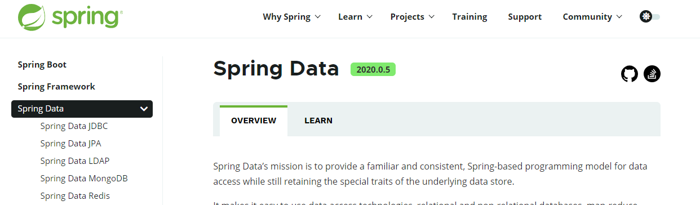
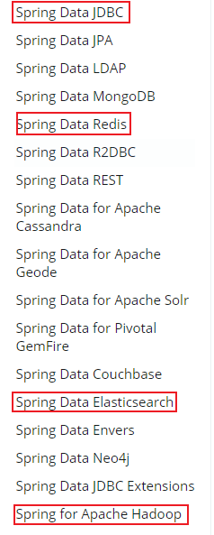
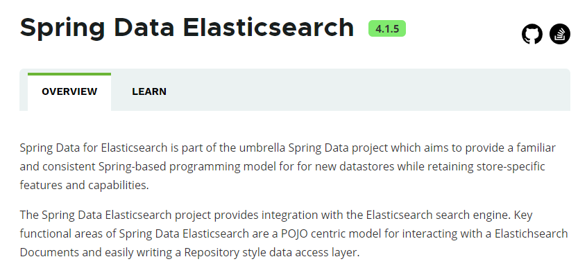
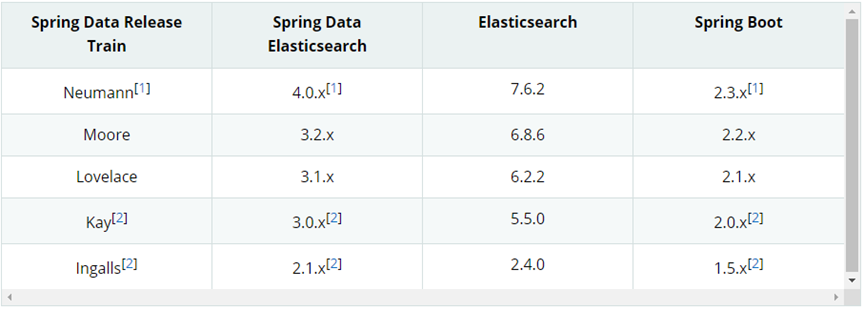
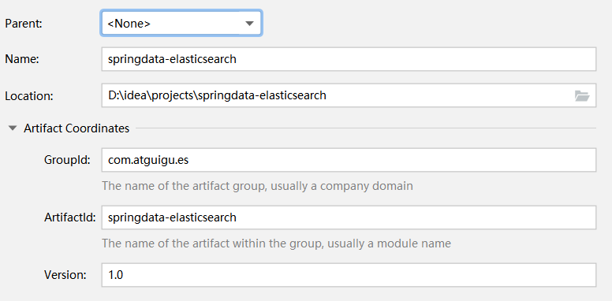

## Elasticsearch集成  

## 1 Spring Data框架集成

### 1 .1 Spring Data框架介绍

Spring Data是一个用于简化数据库、非关系型数据库、索引库访问，并支持云服务的开源框架。其主要目标是使得对数据的访问变得方便快捷，并支持map-reduce框架和云计算数据服务。 Spring Data可以极大的简化JPA（Elasticsearch„）的写法，可以在几乎不用写实现的情况下，实现对数据的访问和操作。除了CRUD外，还包括如分页、排序等一些常用的功能。

Spring Data的官网：https://spring.io/projects/spring-data



Spring Data常用的功能模块如下：



### 1. 2 Spring Data Elasticsearch介绍

Spring Data Elasticsearch 基于 spring data API 简化 Elasticsearch 操作，将原始操作Elasticsearch的客户端API 进行封装 。Spring Data为Elasticsearch项目提供集成搜索引擎。Spring Data Elasticsearch POJO的关键功能区域为中心的模型与Elastichsearch交互文档和轻松地编写一个存储索引库数据访问层。

官方网站: https://spring.io/projects/spring-data-elasticsearch



### 1. 3 Spring Data Elasticsearch版本对比



目前最新springboot对应Elasticsearch7.6.2，Spring boot2.3.x一般可以兼容Elasticsearch7.x

### 1. 4 框架集成

1. 创建Maven项目



2. 修改pom文件，增加依赖关系

```xml
<?xml version="1.0" encoding="UTF-8"?>
<project xmlns="http://maven.apache.org/POM/4.0.0"
xmlns:xsi="http://www.w3.org/2001/XMLSchema-instance"
xsi:schemaLocation="http://maven.apache.org/POM/4.0.0
http://maven.apache.org/xsd/maven-4.0.0.xsd">
    <modelVersion>4.0.0</modelVersion>
    <parent>
    <groupId>org.springframework.boot</groupId>
    <artifactId>spring-boot-starter-parent</artifactId>
    <version>2.3.6.RELEASE</version>
    <relativePath/>
    </parent>
    <groupId>com.atguigu.es</groupId>
    <artifactId>springdata-elasticsearch</artifactId>
    <version>1.0</version>
    <properties>
        <maven.compiler.source>8</maven.compiler.source>
        <maven.compiler.target>8</maven.compiler.target>
    </properties>
    <dependencies>
        <dependency>
            <groupId>org.projectlombok</groupId>
            <artifactId>lombok</artifactId>
        </dependency>
        <dependency>
            <groupId>org.springframework.boot</groupId>
            <artifactId>spring-boot-starter-data-elasticsearch</artifactId>
        </dependency>
        <dependency>
            <groupId>org.springframework.boot</groupId>
            <artifactId>spring-boot-devtools</artifactId>
            <scope>runtime</scope>
            <optional>true</optional>
        </dependency>
        <dependency>
            <groupId>org.springframework.boot</groupId>
            <artifactId>spring-boot-starter-test</artifactId>
            <scope>test</scope>
        </dependency>
        <dependency>
            <groupId>org.springframework.boot</groupId>
            <artifactId>spring-boot-test</artifactId>
        </dependency>
        <dependency>
            <groupId>junit</groupId>
            <artifactId>junit</artifactId>
        </dependency>
        <dependency>
            <groupId>org.springframework</groupId>
            <artifactId>spring-test</artifactId>
        </dependency>
    </dependencies>
</project>
```

3. 增加配置文件

在resources目录中增加application.properties文件

```properties
# es 服务地址
elasticsearch.host=127.0.0.1
# es 服务端口
elasticsearch.port=9200
# 配置日志级别,开启 debug 日志
logging.level.com.atguigu.es=debug
```

4. SpringBoot主程序

```java
package com.atguigu.es;
import org.springframework.boot.SpringApplication;
import org.springframework.boot.autoconfigure.SpringBootApplication;

@SpringBootApplication
public class SpringDataElasticSearchMainApplication {
    public static void main(String[] args) {
    	SpringApplication.run(SpringDataElasticSearchMainApplication.class,args);
    }
}
```

5. 数据实体类

```java
package com.atguigu.es;
import lombok.AllArgsConstructor;
import lombok.Data;
import lombok.NoArgsConstructor;
import lombok.ToString;

@Data
@NoArgsConstructor
@AllArgsConstructor
@ToString
public class Product {
	private Long id;//商品唯一标识
	private String title;//商品名称
    private String category;//分类名称
	private Double price;//商品价格
	private String images;//图片地址
}
```

6. 配置类

- ElasticsearchRestTemplate是spring-data-elasticsearch项目中的一个类，和其他spring项目中的template类似。
- 在新版的spring-data-elasticsearch中，ElasticsearchRestTemplate代替了原来的ElasticsearchTemplate。
- 原因是ElasticsearchTemplate基于TransportClient，TransportClient即将在8.x以后的版本中移除。所以，我们推荐使用ElasticsearchRestTemplate。
- ElasticsearchRestTemplate 基于RestHighLevelClient 客户端的。需要自定义配置类，继承AbstractElasticsearchConfiguration，并实现elasticsearchClient()抽象方法，创建RestHighLevelClient对象。

```java
package com.atguigu.es;
import lombok.Data;
import org.apache.http.HttpHost;
import org.elasticsearch.client.RestClient;
import org.elasticsearch.client.RestClientBuilder;
import org.elasticsearch.client.RestHighLevelClient;
import org.springframework.boot.context.properties.ConfigurationProperties;
import org.springframework.context.annotation.Configuration;
import org.springframework.data.elasticsearch.config.AbstractElasticsearchConfiguration;

@ConfigurationProperties(prefix = "elasticsearch")
@Configuration
@Data
public class ElasticsearchConfig extends AbstractElasticsearchConfiguration {
    
    private String host ;
    private Integer port ;
    
	//重写父类方法
	@Override
	public RestHighLevelClient elasticsearchClient() {
        RestClientBuilder builder = RestClient.builder(new HttpHost(host, port));
        RestHighLevelClient restHighLevelClient = new
        RestHighLevelClient(builder);
        return restHighLevelClient;
    }
}
```

7. DAO数据访问对象

```java
package com.atguigu.es;
import org.springframework.data.elasticsearch.repository.ElasticsearchRepository;
import org.springframework.stereotype.Repository;

@Repository
public interface ProductDao extends ElasticsearchRepository<Product,Long> {
}
```

8. 实体类映射操作

```java
import lombok.AllArgsConstructor;
import lombok.Data;
import lombok.NoArgsConstructor;
import lombok.ToString;
import org.springframework.data.annotation.Id;
import org.springframework.data.elasticsearch.annotations.Document;
import org.springframework.data.elasticsearch.annotations.Field;
import org.springframework.data.elasticsearch.annotations.FieldType;

@Data
@NoArgsConstructor
@AllArgsConstructor
@ToString
@Document(indexName = "shopping", shards = 3, replicas = 1)
public class Product {
    
    //必须有 id,这里的 id 是全局唯一的标识，等同于 es 中的"_id"
    @Id
    private Long id;//商品唯一标识
    
    /**
    * type : 字段数据类型
    * analyzer : 分词器类型
    * index : 是否索引(默认:true)
    * Keyword : 短语,不进行分词
    */
    @Field(type = FieldType.Text, analyzer = "ik_max_word")
    private String title;//商品名称
    @Field(type = FieldType.Keyword)
    private String category;//分类名称
    @Field(type = FieldType.Double)
    private Double price;//商品价格
    @Field(type = FieldType.Keyword, index = false)
    private String images;//图片地址
}
```

9. 索引操作

```java
package com.atguigu.es;
import org.junit.Test;
import org.junit.runner.RunWith;
import org.springframework.beans.factory.annotation.Autowired;
import org.springframework.boot.test.context.SpringBootTest;
import org.springframework.data.elasticsearch.core.ElasticsearchRestTemplate;
import org.springframework.test.context.junit4.SpringRunner;

@RunWith(SpringRunner.class)
@SpringBootTest
public class SpringDataESIndexTest {
    
	//注入 ElasticsearchRestTemplate  
    @Autowired
    private ElasticsearchRestTemplate elasticsearchRestTemplate;
    //创建索引并增加映射配置
    
    @Test
    public void createIndex(){
        //创建索引，系统初始化会自动创建索引
        System.out.println("创建索引");
    }
    
    @Test
    public void deleteIndex(){
        //创建索引，系统初始化会自动创建索引
        boolean flg = elasticsearchRestTemplate.deleteIndex(Product.class);
        System.out.println("删除索引 = " + flg);
    }
}
```

10. 文档操作

```java
package com.atguigu.es;
import org.junit.Test;
import org.junit.runner.RunWith;
import org.springframework.beans.factory.annotation.Autowired;
import org.springframework.boot.test.context.SpringBootTest;
import org.springframework.data.domain.Page;
import org.springframework.data.domain.PageRequest;
import org.springframework.data.domain.Sort;
import org.springframework.test.context.junit4.SpringRunner;
import java.util.ArrayList;
import java.util.List;

@RunWith(SpringRunner.class)
@SpringBootTest
public class SpringDataESProductDaoTest {

    @Autowired
	private ProductDao productDao;
    
    /**
    * 新增
    */
    @Test
    public void save(){
        Product product = new Product();
        product.setId(2L);
        product.setTitle("华为手机");
        product.setCategory("手机");
        product.setPrice(2999.0);
        product.setImages("http://www.atguigu/hw.jpg");
        productDao.save(product);
    }
    
    //修改
    @Test
    public void update(){
        Product product = new Product();
        product.setId(1L);
        product.setTitle("小米2手机");
        product.setCategory("手机");
        product.setPrice(9999.0);
        product.setImages("http://www.atguigu/xm.jpg");
        productDao.save(product);
    }
    
    //根据 id 查询
    @Test
    public void findById(){
        Product product = productDao.findById(1L).get();
        System.out.println(product);
    }
    
    //查询所有
    @Test
    public void findAll(){
        Iterable<Product> products = productDao.findAll();
        for (Product product : products) {
        	System.out.println(product);
        }
    }
    
    //删除
    @Test
    public void delete(){
        Product product = new Product();
        product.setId(1L);
        productDao.delete(product);
    }
    
    //批量新增
    @Test
    public void saveAll(){
        List<Product> productList = new ArrayList<>();
        for (int i = 0; i < 10; i++) {
            Product product = new Product();
            product.setId(Long.valueOf(i));
            product.setTitle("["+i+"]小米手机");
            product.setCategory("手机");
            product.setPrice(1999.0+i);
            product.setImages("http://www.atguigu/xm.jpg");
            productList.add(product);
        }
        productDao.saveAll(productList);
    }
    
    //分页查询
    @Test
    public void findByPageable(){
        //设置排序(排序方式，正序还是倒序，排序的 id)
        Sort sort = Sort.by(Sort.Direction.DESC,"id");
        int currentPage=0;//当前页，第一页从 0 开始， 1 表示第二页
        int pageSize = 5;//每页显示多少条
        //设置查询分页
        PageRequest pageRequest = PageRequest.of(currentPage, pageSize,sort);
        //分页查询
        Page<Product> productPage = productDao.findAll(pageRequest);
        for (Product Product : productPage.getContent()) {
        	System.out.println(Product);
        }
    }
}
```

11. 文档搜索

```java
package com.atguigu.es;
import org.elasticsearch.index.query.QueryBuilders;
import org.elasticsearch.index.query.TermQueryBuilder;
import org.junit.Test;
import org.junit.runner.RunWith;
import org.springframework.beans.factory.annotation.Autowired;
import org.springframework.boot.test.context.SpringBootTest;
import org.springframework.data.domain.PageRequest;
import org.springframework.test.context.junit4.SpringRunner;

@RunWith(SpringRunner.class)
@SpringBootTest
public class SpringDataESSearchTest {
    
    @Autowired
    private ProductDao productDao;
    
    /**
    * term 查询
    * search(termQueryBuilder) 调用搜索方法，参数查询构建器对象
    */
    @Test
    public void termQuery(){
        TermQueryBuilder termQueryBuilder = QueryBuilders.termQuery("title", "小米");
        Iterable<Product> products = productDao.search(termQueryBuilder);
        for (Product product : products) {
        	System.out.println(product);
        }
    }
    
    /**
    * term 查询加分页
    */
    @Test
    public void termQueryByPage(){
        int currentPage= 0 ;
        int pageSize = 5;
        //设置查询分页
        PageRequest pageRequest = PageRequest.of(currentPage, pageSize);
        TermQueryBuilder termQueryBuilder = QueryBuilders.termQuery("title", "小米");
        Iterable<Product> products = productDao.search(termQueryBuilder,pageRequest);
        for (Product product : products) {
        	System.out.println(product);
        }
    }
}
```