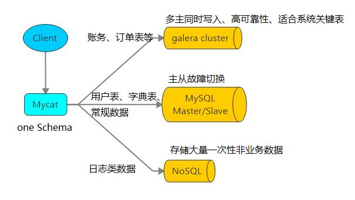

# 入门概述

## 1. 是什么

Mycat 是数据库中间件。  

### 1、数据库中间件

中间件：是一类连接软件组件和应用的计算机软件，以便于软件各部件之间的沟通。
例子：Tomcat，web中间件。
数据库中间件：连接java应用程序和数据库

### 2、为什么要用Mycat？

1. Java与数据库紧耦合。
2. 高访问量高并发对数据库的压力。
3. 读写请求数据不一致

### 3、数据库中间件对比  

| 中间件                                | 介绍                                                         |
| ------------------------------------- | ------------------------------------------------------------ |
| Cobar                                 | Cobar属于阿里B2B事业群，始于2008年，在阿里服役3年多，接管3000+个MySQL数据库的schema,集群日处理在线SQL请求50亿次以上。由于Cobar发起人的离职，Cobar停止维护。 |
| [Mycat官网](http://www.mycat.org.cn/) | Mycat是开源社区在阿里cobar基础上进行二次开发，解决了cobar存在的问题，并且加入了许多新的功能在其中。青出于蓝而胜于蓝。 |
| OneProxy                              | OneProxy基于MySQL官方的proxy思想利用c进行开发的，OneProxy是一款商业收费的中间件。舍弃了一些功能，专注在性能和稳定性上。 |
| kingshard                             | kingshard由小团队用go语言开发，还需要发展，需要不断完善。    |
| Vitess                                | Vitess是Youtube生产在使用，架构很复杂。不支持MySQL原生协议，使用需要大量改造成本。 |
| Atlas                                 | Atlas是360团队基于mysql proxy改写，功能还需完善，高并发下不稳定。 |
| MaxScale                              | MaxScale是mariadb（MySQL原作者维护的一个版本） 研发的中间件  |
| MySQLRoute                            | MySQLRoute是MySQL官方Oracle公司发布的中间件                  |

## 2. 干什么

### 1、读写分离  

### 2、数据分片  

垂直拆分（分库）、水平拆分（分表）、垂直+水平拆分（分库分表）  

### 3、多数据源整合  

## 3. 原理

Mycat 的原理中最重要的一个动词是“拦截”，它拦截了用户发送过来的 SQL 语句，首先对 SQL 语句做了一些特定的分析：如分片分析、路由分析、读写分离分析、  缓存分析等，然后将此 SQL 发往后端的真实数据库，并将返回的结果做适当的处理，最终再返回给用户。  

这种方式把数据库的分布式从代码中解耦出来，程序员察觉不出来后台使用Mycat 还是 MySQL。  

## 4. Mycat1.x 与 Mycat2 功能对比  

### 1、1.x 与 2.0 功能对比图  

| 功能                                     | 1.6                            | 2                                  |
| ---------------------------------------- | ------------------------------ | ---------------------------------- |
| 多语句                                   | 不支持                         | 支持                               |
| blob值                                   | 支持一部分                     | 支持                               |
| 全局二级索引                             | 不支持                         | 支持                               |
| 任意跨库join(包含复杂查询)               | catlet支持                     | 支持                               |
| 分片表与分片表JOIN查询                   | ER表支持                       | 支持                               |
| 关联子查询                               | 不支持                         | 支持一部分                         |
| 分库同时分表                             | 不支持                         | 支持                               |
| 存储过程                                 | 支持固定形式的                 | 支持更多                           |
| 支持逻辑视图                             | 不支持                         | 支持                               |
| 支持物理视图                             | 支持                           | 支持                               |
| 批量插入                                 | 不支持                         | 支持                               |
| 执行计划管理                             | 不支持                         | 支持                               |
| 路由注释                                 | 支持                           | 支持                               |
| 集群功能                                 | 支持                           | 支持更多集群类型                   |
| 自动hash分片算法                         | 不支持                         | 支持                               |
| 支持第三方监控                           | 支持mycat-web                  | 支持普罗米斯,kafka日志等监控       |
| 流式合拼结果集                           | 支持                           | 支持                               |
| 范围查询                                 | 支持                           | 支持                               |
| 单表映射物理表                           | 不支持                         | 支持                               |
| XA事务                                   | 弱XA                           | 支持,事务自动恢复                  |
| 支持MySQL8                               | 需要更改mysql8的服务器配置支持 | 支持                               |
| 虚拟表                                   | 不支持                         | 支持                               |
| joinClustering                           | 不支持                         | 支持                               |
| union all语法                            | 不支持                         | 支持                               |
| BKAJoin                                  | 不支持                         | 支持                               |
| 优化器注释                               | 不支持                         | 支持                               |
| ER表                                     | 支持                           | 支持                               |
| 全局序列号                               | 支持                           | 支持                               |
| 保存点                                   | 不支持                         | 支持                               |
| 离线迁移                                 | 支持                           | 支持（实验）                       |
| 增量迁移                                 | CRC32算法支持                  | BINLOG追平（实验）                 |
| 安全停机                                 | 不支持                         | 支持（实验）                       |
| HAProxy协议                              | 不支持                         | 支持                               |
| 会话粘滞                                 | update后select会粘滞           | update后select会粘滞且支持设置时间 |
| 全局表插入支持全局序列号                 | 不支持                         | 支持                               |
| 全局表插入支持主表插入自增结果作为序列号 | 不支持                         | 支持                               |
| 外部调用的分片算法                       | 不支持但可定制                 | 支持                               |

（1）多语句：解析器会对 SQL 进行拆分依次执行（默认配置）
（2）blob 值：BLOB (binary large object)二进制大对象，是一个可以存储二进制文件的容器。  
（3）全局二级索引：使用全局二级索引后,能有效减少全表扫描,对于减少连接使用,减少计算节点与存储节点的数据传输有帮助.
（4）关联子查询：支持不能消除关联的关联子查询
（5）分库同时分表：把分库分表合一，统一规划
（6）存储过程：存储过程支持多结果集返回、支持接收 affectRow
（7）支持批量插入：支持 rewriteInsertBatchedStatementBatch 参数,用于提高批量插入性能（只有把 rewriteBatchedStatements 参数置为 true, MySQL 驱动才会帮你批量执行 SQL）
（8）支持执行计划管理：Mycat2 的执行计划管理主要作用是管理执行计划,加快 SQL到执行计划的转换,并且提供一个方式可以从持久层读取自定义的执行计划。
（9）自动 hash 分片算法：由 1.6 版本的手动配置算法，到 2.0 的自动 hash 分片
（10）单表映射物理表：使用自动化建表语句创建测试的物理库物理表,它会自动生成配置文件,然后通过查看本地的配置文件,观察它的属性  

### 2、映射模型区别  

