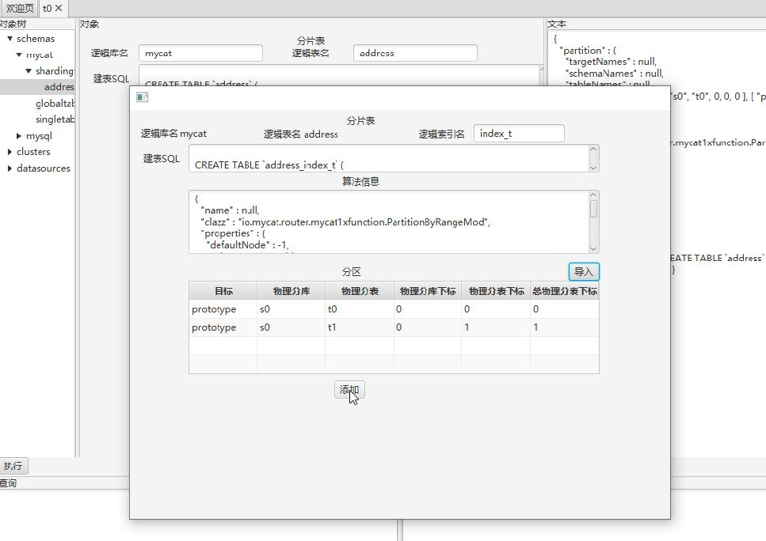

# MyCat相关工具

## 1. Mycat2 UI  

Mycat2 UI 是官方推出的 Mycat2 监控工具  

1、下载
http://dl.mycat.org.cn/2.0/ui/

2、运行环境  

在安装 JDK8 的环境,双击 jar 包就可以打开

3、使用
（1）连接
连接 Mycat2(需要 Mycat2 服务器正常启动)  

（2）编辑分片表  

导出文件是 csv 格式,无表头
(6 项)  

prototype,s0,t0,0,0,0

prototype,s0,t1,0,1,1  

(3 项)

prototype,s0,t0

prototype,s0,t1  

暂时不支持自动 HASH 型算法的分区导入

物理分库下标,物理分表下标是根据分片算法要求填入,没有明确要求不需要填写

对于 1.6 的分片算法,物理分库下标,物理分表下标是没有意义的,只有总物理分表

下标有意义(总分表的下标)  

（3）编辑索引表  

（4）编辑全局表  

