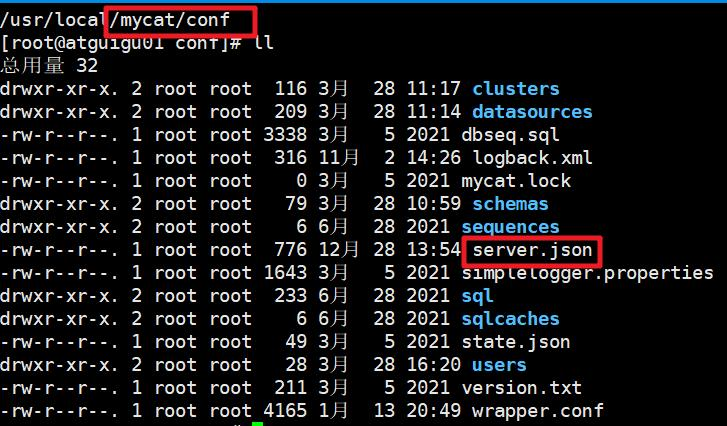

# MyCat2相关概念

## 1. 概念描述  

### 1、分库分表

按照一定规则把数据库中的表拆分为多个带有数据库实例,物理库,物理表访问路径的分表。

解读：

- 分库：一个电商项目，分为用户库、订单库等等。
- 分表：一张订单表数据数百万，达到 MySQL 单表瓶颈，分到多个数据库中的多张表。

### 2、逻辑库  

数据库代理中的数据库,它可以包含多个逻辑表。

解读：Mycat 里定义的库，在逻辑上存在，物理上在 MySQL 里并不存在。有可能是多个 MySQL 数据库共同组成一个逻辑库。类似多个小孩叠罗汉穿上外套，扮演一个大人。  

### 3、逻辑表

数据库代理中的表,它可以映射代理连接的数据库中的表(物理表)。

解读：Mycat 里定义的表，在逻辑上存在，可以映射真实的 MySQL 数据库的表。可以一对一，也可以一对多。

### 4、物理库

数据库代理连接的数据库中的库。

解读：MySQL 真实的数据库。

### 5、物理表

数据库代理连接的数据库中的表 。

解读：MySQL 真实的数据库中的真实数据表。  

### 6、拆分键

即分片键,描述拆分逻辑表的数据规则的字段。

解读：比如订单表可以按照归属的用户 id 拆分，用户 id 就是拆分键。

### 7、物理分表

指已经进行数据拆分的,在数据库上面的物理表,是分片表的一个分区。

解读：多个物理分表里的数据汇总就是逻辑表的全部数据

### 8、物理分库

一般指包含多个物理分表的库

解读：参与数据分片的实际数据库

### 9、分库

一般指通过多个数据库拆分分片表,每个数据库一个物理分表,物理分库名字相同

解读：分库是个动作，需要多个数据库参与。就像多个数据库是多个盘子，分库就是把一串数据葡萄，分到各个盘子里，而查询数据时，所有盘子的葡萄又通过 Mycat2 组成了完整的一串葡萄。

### 10、分片表,水平分片表

按照一定规则把数据拆分成多个分区的表,在分库分表语境下,它属于逻辑表的一种
解读：安按照规则拆分数据，上个例子中的那串葡萄。

### 11、单表

没有分片,没有数据冗余的表  ，

解读：没有拆分数据，也没有复制数据到别的库的表。

### 12、全局表,广播表

每个数据库实例都冗余全量数据的逻辑表.

它通过表数据冗余,使分片表的分区与该表的数据在同一个数据库实例里,达到 join 运算能够直接在该数据库实例里执行.它的数据一致一般是通过数据库代理分发 SQL 实现.也有基于集群日志的实现

解读：例如系统中翻译字段的字典表，每个分片表都需要完整的字典数据翻译字段。

### 13、ER 表

狭义指父子表中的子表,它的分片键指向父表的分片键,而且两表的分片算法相同广义指具有相同数据分布的一组表。

解读：关联别的表的子表，例如：订单详情表就是订单表的 ER 表

### 14、集群

多个数据节点组成的逻辑节点.在 mycat2 里,它是把对多个数据源地址视为一个数据源地址(名称),并提供自动故障恢复,转移,即实现高可用,负载均衡的组件。

解读：集群就是高可用、负载均衡的代名词

### 15、数据源

连接后端数据库的组件,它是数据库代理中连接后端数据库的客户端。
解读：Mycat 通过数据源连接 MySQL 数据库

### 16、原型库(prototype)

原型库是 Mycat2 后面的数据库，比如 mysql 库 。

解读：原型库就是存储数据的真实数据库，配置数据源时必须指定原型库  

## 2. 配置文件

### 1、服务（server）  

服务相关配置 

（1） 所在目录：mycat/conf  



默认配置即可  

### 2、用户（user）

配置用户相关信息
（1） 所在目录：mycat/conf/users

（2） 命名方式：{用户名}.user.json  

（3） 配置内容  

```json
vim mycat/conf/users/root.user.json
{
    "ip":null,
    "password":"123456",
    "transactionType":"xa",
    "username":"root",
    "isolation":3
}

#字段含义
#ip：客户端访问ip，建议为空,填写后会对客户端的ip进行限制
# username：用户名
# password：密码
# isolation：设置初始化的事务隔离级别
READ_UNCOMMITTED:1
READ_COMMITTED:2
REPEATED_READ:3,默认
SERIALIZABLE:4
# transactionType：事务类型
#可选值:
#proxy 本地事务,在涉及大于 1 个数据库的事务,commit 阶段失败会导致不一致,但是兼容性最好
#xa 事务,需要确认存储节点集群类型是否支持 XA
#可以通过语句实现切换
set transaction_policy = 'xa'
set transaction_policy = 'proxy'
#可以通过语句查询
SELECT @@transaction_policy
```


### 3、数据源（datasource）

配置Mycat连接的数据源信息
（1） 所在目录：mycat/conf/datasources

（2） 命名方式：{数据源名字}.datasource.json

（3） 配置内容  

```json
vim mycat/conf/datasources/ prototype. datasources.json
{
    "dbType": "mysql",
    "idleTimeout": 60000,
    "initSqls": [],
    "initSqlsGetConnection": true,
    "instanceType": "READ_WRITE",
    "maxCon": 1000,
    "maxConnectTimeout": 3000,
    "maxRetryCount": 5,
    "minCon": 1,
    "name": "prototype",
    "password": "123456",
    "type": "JDBC",
    "url":
    "jdbc:mysql://127.0.0.1:3306/mysql?useUnicode=true&serverTimezone=UTC",
    "user": "root",
    "weight": 0,
    "queryTimeout":30,//mills
} 

#字段含义
# dbType：数据库类型，mysql
# name：用户名
# password：密码
# type：数据源类型，默认 JDBC
# url：访问数据库地址
# idleTimeout：空闲连接超时时间
# initSqls：初始化sql
# initSqlsGetConnection：对于 jdbc 每次获取连接是否都执行 initSqls
# instanceType：配置实例只读还是读写
可选值:
READ_WRITE,READ,WRITE
#weight ：负载均衡权重
# 连接相关配置
"maxCon": 1000,
"maxConnectTimeout": 3000,
"maxRetryCount": 5,
"minCon": 1,
```


### 4、集群（cluster）

配置集群信息
（4） 所在目录：mycat/conf/clusters

（5） 命名方式：{集群名字}.cluster.json

（6） 配置内容  

```json
vim mycat/conf/clusters/prototype.cluster.json
{
    "clusterType":"MASTER_SLAVE",
    "heartbeat":{
        "heartbeatTimeout":1000,
        "maxRetryCount":3,//2021-6-4前是maxRetry，后更正为
        maxRetryCount
        "minSwitchTimeInterval":300,
        "slaveThreshold":0
	},
    "masters":[ //配置多个主节点,在主挂的时候会选一个检测存活的数据源作为主节点
    	"prototypeDs"
    ],
    "replicas":[//配置多个从节点
    	"xxxx"
    ],
    "maxCon":200,
    "name":"prototype",
    "readBalanceType":"BALANCE_ALL",
    "switchType":"SWITCH", //可选
    "timer":{ //MySQL集群心跳周期,配置则开启集群心跳,Mycat主动检测主从延迟以及高可用主从切换
        "initialDelay": 30,
        "period":5,
        "timeUnit":"SECONDS"
    },
    //readBalanceName:"BALANCE_ALL",
    //writeBalanceName:"BALANCE_ALL",
} 

#字段含义
# clusterType：集群类型
可选值:
SINGLE_NODE:单一节点
MASTER_SLAVE:普通主从
GARELA_CLUSTER:garela cluster/PXC 集群
MHA：MHA 集群
MGR：MGR 集群
# readBalanceType：查询负载均衡策略
可选值:
BALANCE_ALL(默认值)
获取集群中所有数据源
BALANCE_ALL_READ
获取集群中允许读的数据源
BALANCE_READ_WRITE
获取集群中允许读写的数据源,但允许读的数据源优先
BALANCE_NONE
获取集群中允许写数据源,即主节点中选择
# switchType：切换类型
可选值:
NOT_SWITCH:不进行主从切换
SWITCH:进行主从切换
```

### 5、逻辑库表（schema）  

配置逻辑库表，实现分库分表
（7） 所在目录：mycat/conf/schemas

（8） 命名方式：{库名}.schema.json

（9） 配置内容  

```json
vim mycat/conf/schemas/mydb1.schema.json
#库配置
{
"schemaName": "mydb",
"targetName": "prototype"
} 
#schemaName：逻辑库名
# targetName：目的数据源或集群
#targetName自动从prototype目标加载test库下的物理表或者视图作为单表,prototype必须是mysql服务器
#单表配置
{
    "schemaName": "mysql-test",
    "normalTables": {
        "role_edges": {
            "createTableSQL":null,//可选
            "locality": {
                "schemaName": "mysql",//物理库,可选
                "tableName": "role_edges",//物理表,可选
                "targetName": "prototype"//指向集群,或者数据源
            }
        } 
.....
#详细配置见分库分表
    
```


