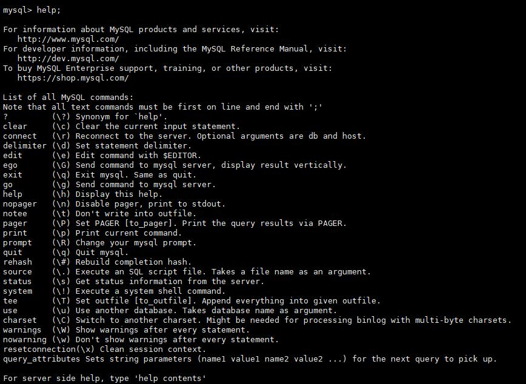

# 安装启动

## 1. 安装

### 1、下载安装包

下载对应的 tar 安装包,以及对应的 jar 包  

tar（zip）包 ：  http://dl.mycat.org.cn/2.0/install-template/mycat2-install-template-1.20.zip  

jar 包 ：  http://dl.mycat.org.cn/2.0/1.21-release/ (下载最新的 jar 包)  

下载所需的 mycat2 的 fat jar 一般大小为 100mb 的一个 jar 文件，把这个 jar 放进解压的 tar 中的 mycat\lib 文件夹下  


### 2、解压后即可使用  

把整合好的文件夹拷贝到 linux 下 /usr/local/  


### 3、修改文件夹及以下文件的权限  

修改成最高权限，否则运行启动命令时，会因权限不足而报错  


## 2. 启动

### 1、在mycat连接的mysql数据库里添加用户  

创建用户 ,用户名为mycat,密码为123456,赋权限，如下：  

```mysql
CREATE USER 'mycat'@'%' IDENTIFIED BY '123456';
# 必须要赋的权限mysql8才有的
GRANT XA_RECOVER_ADMIN ON *.* TO 'root'@'%';
# 视情况赋权限
GRANT ALL PRIVILEGES ON *.* TO 'mycat'@'%' ;
flush privileges;
```


### 2、修改mycat的prototype的配置  

启动mycat之前需要确认prototype数据源所对应的mysql数据库配置,修改对应的user(用户),password(密码),url中的ip  

```json
vim conf/datasources/prototypeDs.datasource.json
{
    "dbType":"mysql",
    "idleTimeout":60000,
    "initSqls":[],
    "initSqlsGetConnection":true,
    "instanceType":"WRITE",
    "maxCon":1000,
    "maxConnectTimeout":3000,
    "maxRetryCount":5,
    "minCon":1,
    "name":"prototypeDs",
    "password":"root",
    "type":"JDBC",
    "url":"jdbc:mysql://192.168.48.222:3306/mydb1?useUnicode=true&serverTimezone=Asia/Shanghai&characterEncoding=UTF-8",
    "user":"root",
    "weight":0
}
```


### 3、验证数据库访问情况  

Mycat 作为数据库中间件要和数据库部署在不同机器上，所以要验证远程访问情况。  

```mysql
mysql -uroot -proot -h 192.168.48.222 -P 3306
mysql -uroot -proot -h 192.168.48.20 -P 3306
#如远程访问报错，请建对应用户
grant all privileges on *.* to root@'缺少的host' identified by 'root';
```


### 4、启动mycat  

```sh
cd mycat/bin
./mycat start
./mycat status
./mycat start 启动
./mycat stop 停止
./mycat console 前台运行
./mycat install 添加到系统自动启动（暂未实现）
./mycat remove 取消随系统自动启动（暂未实现）
./mycat restart 重启服务
./mycat pause 暂停
./mycat status 查看启动状态
```


## 3. 登录

### 1、登录后台管理窗口  

此登录方式用于管理维护 Mycat  

```mysql
mysql -uroot -proot -P 9066  
```

常用命令如下：  





### 2、登录数据窗口  

此登录方式用于通过 Mycat 查询数据，我们选择这种方式访问 Mycat  

```mysql
mysql -uroot -proot -P 8066
```

