# 分库分表

一个数据库由很多表的构成，每个表对应着不同的业务，垂直切分是指按照业务将表进行分类，分布到不同 的数据库上面，这样也就将数据或者说压力分担到不同的库上面，如下图：  

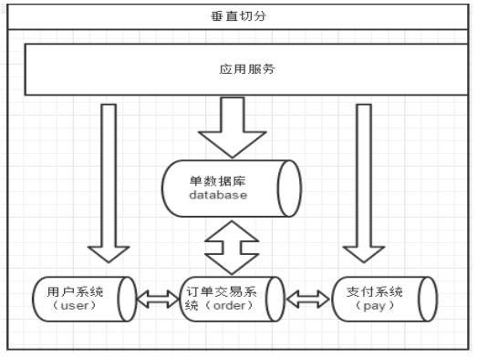

系统被切分成了，用户，订单交易，支付几个模块  

## 1. 如何分库  

一个问题：在两台主机上的两个数据库中的表，能否关联查询？

答案：不可以关联查询。

分库的原则：有紧密关联关系的表应该在一个库里，相互没有关联关系的表可以分到不同的库里。  

```mysql
#客户表 rows:20万
CREATE TABLE customer(
    id INT AUTO_INCREMENT,
    NAME VARCHAR(200),
    PRIMARY KEY(id)
);

#订单表 rows:600万
CREATE TABLE orders(
    id INT AUTO_INCREMENT,
    order_type INT,
    customer_id INT,
    amount DECIMAL(10,2),
    PRIMARY KEY(id)
);

#订单详细表 rows:600万
CREATE TABLE orders_detail(
    id INT AUTO_INCREMENT,
    detail VARCHAR(2000),
    order_id INT,
    PRIMARY KEY(id)
);

#订单状态字典表 rows:20
CREATE TABLE dict_order_type(
    id INT AUTO_INCREMENT,
    order_type VARCHAR(200),
    PRIMARY KEY(id)
);
```

以上四个表如何分库？客户表分在一个数据库，另外三张都需要关联查询，分在另外一个数据库。  


## 2. 如何分表  

### 1、选择要拆分的表  

MySQL 单表存储数据条数是有瓶颈的，单表达到 1000 万条数据就达到了瓶颈，会影响查询效率，需要进行水平拆分（分表）进行优化。

例如：例子中的 orders、orders_detail 都已经达到 600 万行数据，需要进行分表优化。  

### 2、分表字段  

以 orders 表为例，可以根据不同自字段进行分表  

| 编号 | 分表字段               | 效果                                                         |
| ---- | ---------------------- | ------------------------------------------------------------ |
| 1    | id（主键、或创建时间） | 查询订单注重时效，历史订单被查询的次数 少，如此分片会造成一个节点访问多，一个 访问少，不平均。 |
| 2    | customer_id（客户 id） | 根据客户 id 去分，两个节点访问平均，一 个客户的所有订单都在同一个节点 |


## 3. 实现分库分表  

Mycat2 一大优势就是可以在终端直接创建数据源、集群、库表，并在创建时指定分库、分表。与 1.6 版本比大大简化了分库分表的操作  

### 1、添加数据库、存储数据源  

```mysql
/*+ mycat:createDataSource{
"name":"dw0",
"url":"jdbc:mysql://192.168.140.100:3306",
"user":"root",
"password":"123123"
} */;

/*+ mycat:createDataSource{
"name":"dr0",
"url":"jdbc:mysql://192.168.140.100:3306",
"user":"root",
"password":"123123"
} */;

/*+ mycat:createDataSource{
"name":"dw1",
"url":"jdbc:mysql://192.168.140.99:3306",
"user":"root",
"password":"123123"
} */;

/*+ mycat:createDataSource{
"name":"dr1",
"url":"jdbc:mysql://192.168.140.99:3306",
"user":"root",
"password":"123123"
} */;

```

```sh
#通过注释命名添加数据源后，在对应目录会生成相关配置文件
cd /usr/local/mycat/conf/datasources
#如下图
```

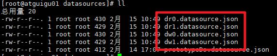

### 2、添加集群配置  

把新添加的数据源配置成集群  

```mysql
#//在 mycat 终端输入
/*!mycat:createCluster{"name":"c0","masters":["dw0"],"replicas":["dr0"]}*/;

/*!mycat:createCluster{"name":"c1","masters":["dw1"],"replicas":["dr1"]}*/;
```

```shell
#可以查看集群配置信息
cd /usr/local/mycat/conf/clusters
#如下图
```

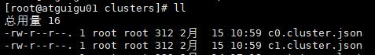

### 3、创建全局表  

```mysql
#Mycat添加数据库db1
CREATE DATABASE db1;
#在建表语句中加上关键字 BROADCAST（广播，即为全局表）
CREATE TABLE db1.`travelrecord` (
    `id` bigint NOT NULL AUTO_INCREMENT,
    `user_id` varchar(100) DEFAULT NULL,
    `traveldate` date DEFAULT NULL,
    `fee` decimal(10,0) DEFAULT NULL,
    `days` int DEFAULT NULL,
    `blob` longblob,
    PRIMARY KEY (`id`),
    KEY `id` (`id`)
) ENGINE=InnoDB DEFAULT CHARSET=utf8 BROADCAST;

#进入相关目录查看 schema 配置
vim /usr/local/mycat/conf/schemas/db1.schema.json
#可以看到自动生成的全局表配置信息
```

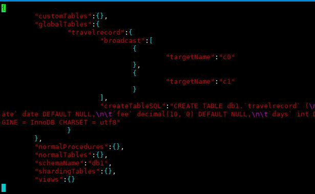

可以看到数据库中都存在这个表

### 4、创建分片表(分库分表)  

```mysql
#在 Mycat 终端直接运行建表语句进行数据分片 两个数据库各分一片
CREATE TABLE db1.orders(
    id BIGINT NOT NULL AUTO_INCREMENT,
    order_type INT,
       customer_id INT,
    amount DECIMAL(10,2),
    PRIMARY KEY(id),
    KEY `id` (`id`)
)ENGINE=INNODB DEFAULT CHARSET=utf8 dbpartition BY mod_hash(customer_id) tbpartition BY mod_hash(customer_id) tbpartitions 1 dbpartitions 2;

#数据库分片规则，表分片规则，以及各分多少片
INSERT INTO orders(id,order_type,customer_id,amount)
VALUES(1,101,100,100100);
INSERT INTO orders(id,order_type,customer_id,amount)
VALUES(2,101,100,100300);
INSERT INTO orders(id,order_type,customer_id,amount)
VALUES(3,101,101,120000);
INSERT INTO orders(id,order_type,customer_id,amount)
VALUES(4,101,101,103000);
INSERT INTO orders(id,order_type,customer_id,amount)
VALUES(5,102,101,100400);
INSERT INTO orders(id,order_type,customer_id,amount)
VALUES(6,102,100,100020);

SELECT * FROM orders;

#同样可以查看生成的配置信息
#进入相关目录查看 schema 配置
vim /usr/local/mycat/conf/schemas/db1.schema.json 
```

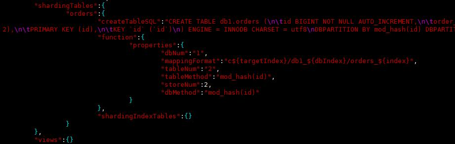

查看数据库可见，分片数据  

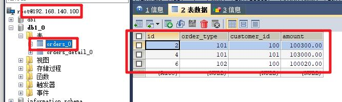

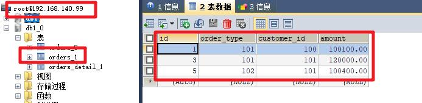

在 Mycat 终端查询依然可以看到全部数据  

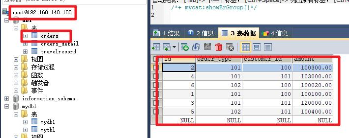

### 5、创建 ER 表  

与分片表关联的表如何分表，也就是 ER 表如何分表，如下  

```mysql
#在 Mycat 终端直接运行建表语句进行数据分片
CREATE TABLE orders_detail(
    `id` BIGINT NOT NULL AUTO_INCREMENT,
    detail VARCHAR(2000),
    order_id INT,
    PRIMARY KEY(id)
)ENGINE=INNODB DEFAULT CHARSET=utf8 dbpartition BY mod_hash(order_id) tbpartition BY mod_hash(order_id) tbpartitions 1 dbpartitions 2;

INSERT INTO orders_detail(id,detail,order_id) VALUES(1,'detail1',1);
INSERT INTO orders_detail(id,detail,order_id) VALUES(2,'detail1',2);
INSERT INTO orders_detail(id,detail,order_id) VALUES(3,'detail1',3);
INSERT INTO orders_detail(id,detail,order_id) VALUES(4,'detail1',4);
INSERT INTO orders_detail(id,detail,order_id) VALUES(5,'detail1',5);
INSERT INTO orders_detail(id,detail,order_id) VALUES(6,'detail1',6);
```

对比数据节点 1

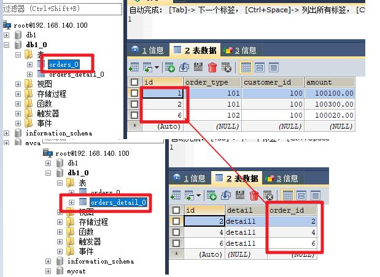

对比数据节点 2  

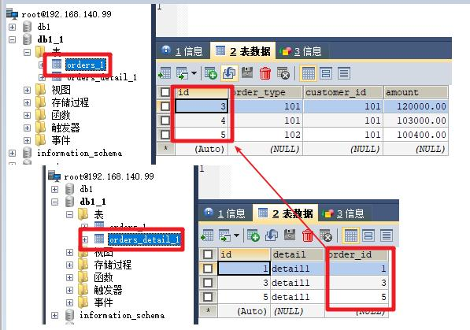

```mysql
#上述两表具有相同的分片算法,但是分片字段不相同
#Mycat2 在涉及这两个表的 join 分片字段等价关系的时候可以完成 join 的下推  

#Mycat2 无需指定 ER 表,是自动识别的,具体看分片算法的接口
#查看配置的表是否具有 ER 关系,使用

/*+ mycat:showErGroup{}*/  
```

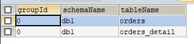

```mysql
#group_id 表示相同的组,该组中的表具有相同的存储分布
运行关联查询语句
SELECT * FROM orders o INNER JOIN orders_detail od ON od.order_id=o.id;
```

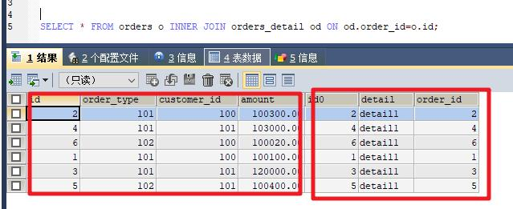

```
#原理如下
```

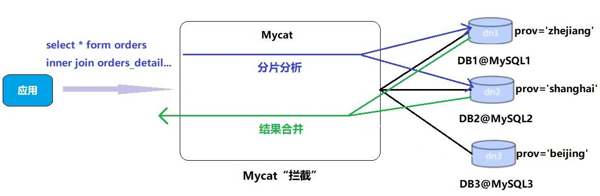


## 4. 常用分片规则  

### 1、分片算法简介

Mycat2 支持常用的(自动)HASH 型分片算法也兼容 1.6 的内置的(cobar)分片算法.HASH 型分片算法默认要求集群名字以 c 为前缀,数字为后缀,c0 就是分片表第一个节点,c1 就是第二个节点.该命名规则允许用户手动改变

### 2、Mycat2 与 1.x 版本区别

Mycat2 Hash 型分片算法多数基于 MOD_HASH(MOD 对应 JAVA 的%运算）,实际上是取余运算。

Mycat2 Hash 型分片算法对于值的处理,总是把分片值转换到列属性的数据类型再运算。

而 1.x 系列的分片算法统一转换到字符串类型再运算且只能根据一个分片字段计算出存储节点下标。

Mycat2 Hash 型分片算法适用于等价条件查询。

而 1.x 系列由于含有用户经验的路由规则。1.x 系列的分片规则总是先转换成字符串再运算。

### 3、分片规则与适用性  

| 分片算法    | 描述           | 分库 | 分表 | 数值类型                                   |
| ----------- | -------------- | ---- | ---- | ------------------------------------------ |
| MOD_HASH    | 取模哈希       | 是   | 是   | 数值，字符串                               |
| UNI_HASH    | 取模哈希       | 是   | 是   | 数值，字符串                               |
| RIGHT_SHIFT | 右移哈希       | 是   | 是   | 数值                                       |
| RANGE_HASH  | 两字段其一取模 | 是   | 是   | 数值，字符串                               |
| YYYYMM      | 按年月哈希     | 是   | 是   | DATE，DATETIME                             |
| YYYYDD      | 按年日哈希     | 是   | 是   | DATE，DATETIME                             |
| YYYYWEEK    | 按年周哈希     | 是   | 是   | DATE，DATETIME                             |
| ~~HASH~~    | ~~取模哈希~~   | 是   | 是   | ~~数值，字符串，如果不是，则转换成字符串~~ |
| MM          | 按月哈希       | 否   | 是   | DATE，DATETIME                             |
| DD          | 按日期哈希     | 否   | 是   | DATE，DATETIME                             |
| MMDD        | 按月日哈希     | 是   | 是   | DATE，DATETIME                             |
| WEEK        | 按周哈希       | 否   | 是   | DATE，DATETIME                             |
| WEEK        | 按周哈希       | 否   | 是   | DATE，DATETIME                             |

### 4、常用分片规则简介  

（1）MOD_HASH

[数据分片]HASH 型分片算法-MOD_HASH

如果分片值是字符串则先对字符串进行 hash 转换为数值类型

**分库键和分表键是同键：**

分表下标=分片值%(分库数量*分表数量)

分库下标=分表下标/分表数量

**分库键和分表键是不同键：**
分表下标= 分片值%分表数量

分库下标= 分片值%分库数量

（2）RIGHT_SHIFT

[数据分片]HASH 型分片算法-RIGHT_SHIFT

RIGHT_SHIFT(字段名,位移数)

仅支持数值类型

分片值右移二进制位数,然后按分片数量取余  

（3）YYYYMM

[数据分片]HASH 型分片算法-YYYYMM

仅用于分库

(YYYY*12+MM)%分库数.MM 是 1-12

（4）MMDD

仅用于分表

仅 DATE/DATETIME

一年之中第几天%分表数

tbpartitions 不超过 366  


## 5. 全局序列  

Mycat2 在 1.x 版本上简化全局序列，自动默认使用雪花算法生成全局序列号，如不需要 Mycat 默认的全局序列，可以通过配置关闭自动全局序列  

### 1、建表语句方式关闭全局序列

如果不需要使用 mycat 的自增序列,而使用 mysql 本身的自增主键的功能,需要在配置中更改对应的建表 sql,不设置 AUTO_INCREMENT 关键字,这样,mycat 就不认为这个表有自增主键的功能,就不会使用 mycat 的全局序列号.这样,对应的插入 sql 在 mysql处理,由 mysql 的自增主键功能补全自增值.

雪花算法：引入了时间戳和 ID 保持自增的分布式 ID 生成算法  

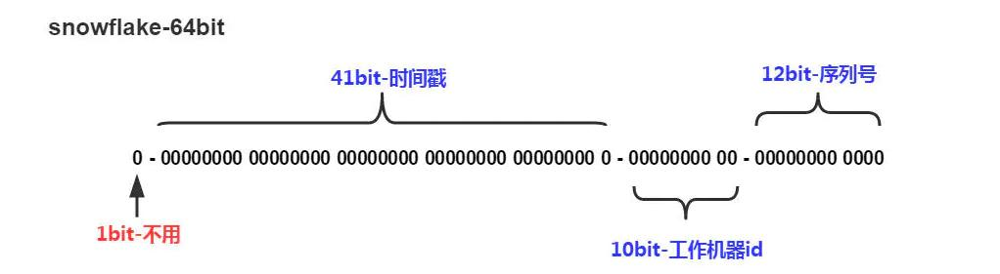

建表 sql 可以自动在原型库对应的逻辑表的物理表获取,如果逻辑表的建表 SQL 与物理表的建表 SQL 不对应,则需要在配置文件中配置建表 SQL  

例如：  

```mysql
#带 AUTO_INCREMENT 关键字使用默认全局序列
CREATE TABLE db1.`travelrecord` (
    `id` bigint NOT NULL AUTO_INCREMENT,
    `user_id` varchar(100) DEFAULT NULL,
    `traveldate` date DEFAULT NULL,
    `fee` decimal(10,0) DEFAULT NULL,
    `days` int DEFAULT NULL,
    `blob` longblob,
    PRIMARY KEY (`id`),
    KEY `id` (`id`)
) ENGINE=InnoDB DEFAULT CHARSET=utf8 BROADCAST;

#去掉关键字，不使用
CREATE TABLE db1.`travelrecord` (
    `id` bigint NOT NULL,
    `user_id` varchar(100) DEFAULT NULL,
    `traveldate` date DEFAULT NULL,
    `fee` decimal(10,0) DEFAULT NULL,
    `days` int DEFAULT NULL,
    `blob` longblob,
    PRIMARY KEY (`id`),
    KEY `id` (`id`)
) ENGINE=InnoDB DEFAULT CHARSET=utf8 BROADCAST;
```

### 2、设置 Mycat 数据库方式获取全局序列  

```
#1、在prototype服务器的db1库导入dbseq.sql文件
Mycat2已经为用户提供了相关sql脚本，需要在对应数据库下运行脚本，不能通过Mycat客户端执行。
脚本所在目录mycat/conf
```

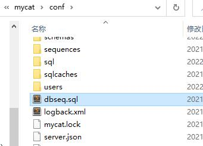

```mysql
脚本内容：
DROP TABLE IF EXISTS MYCAT_SEQUENCE;
CREATE TABLE MYCAT_SEQUENCE ( name VARCHAR(64) NOT NULL, current_value
BIGINT(20) NOT NULL, increment INT NOT NULL DEFAULT 1, PRIMARY KEY
(name) ) ENGINE=InnoDB;

-- ----------------------------
-- Function structure for `mycat_seq_currval`
-- ----------------------------
DROP FUNCTION IF EXISTS `mycat_seq_currval`;
DELIMITER ;;
CREATE FUNCTION `mycat_seq_currval`(seq_name VARCHAR(64)) RETURNS
varchar(64) CHARSET latin1
DETERMINISTIC
BEGIN
DECLARE retval VARCHAR(64);
SET retval="-1,0";
SELECT concat(CAST(current_value AS CHAR),",",CAST(increment AS CHAR) )
INTO retval FROM MYCAT_SEQUENCE WHERE name = seq_name;
RETURN retval ;
END
;;
DELIMITER ;

-- ----------------------------
-- Function structure for `mycat_seq_nextval`
-- ----------------------------
DROP FUNCTION IF EXISTS `mycat_seq_nextval`;
DELIMITER ;;
CREATE FUNCTION `mycat_seq_nextval`(seq_name VARCHAR(64)) RETURNS
varchar(64) CHARSET latin1
DETERMINISTIC
BEGIN
DECLARE retval VARCHAR(64);
DECLARE val BIGINT;
DECLARE inc INT;
DECLARE seq_lock INT;
set val = -1;
set inc = 0;
SET seq_lock = -1;
SELECT GET_LOCK(seq_name, 15) into seq_lock;
if seq_lock = 1 then
SELECT current_value + increment, increment INTO val, inc FROM
MYCAT_SEQUENCE WHERE name = seq_name for update;
if val != -1 then
UPDATE MYCAT_SEQUENCE SET current_value = val WHERE name =
seq_name;
end if;
SELECT RELEASE_LOCK(seq_name) into seq_lock;
end if;
SELECT concat(CAST((val - inc + 1) as CHAR),",",CAST(inc as CHAR)) INTO
retval;
RETURN retval;
END
;;
DELIMITER ;

-- ----------------------------
-- Function structure for `mycat_seq_setvals`
-- ----------------------------
DROP FUNCTION IF EXISTS `mycat_seq_nextvals`;
DELIMITER ;;
CREATE FUNCTION `mycat_seq_nextvals`(seq_name VARCHAR(64), count INT)
RETURNS VARCHAR(64) CHARSET latin1
DETERMINISTIC
BEGIN
DECLARE retval VARCHAR(64);
DECLARE val BIGINT;
DECLARE seq_lock INT;
SET val = -1;
SET seq_lock = -1;
SELECT GET_LOCK(seq_name, 15) into seq_lock;
if seq_lock = 1 then
SELECT current_value + count INTO val FROM MYCAT_SEQUENCE WHERE
name = seq_name for update;
IF val != -1 THEN
UPDATE MYCAT_SEQUENCE SET current_value = val WHERE name =
seq_name;
END IF;
SELECT RELEASE_LOCK(seq_name) into seq_lock;
end if;
SELECT CONCAT(CAST((val - count + 1) as CHAR), ",", CAST(val as CHAR))
INTO retval;
RETURN retval;
END
;;
DELIMITER ;

-- ----------------------------
-- Function structure for `mycat_seq_setval`
-- ----------------------------
DROP FUNCTION IF EXISTS `mycat_seq_setval`;
DELIMITER ;;
CREATE FUNCTION `mycat_seq_setval`(seq_name VARCHAR(64), value BIGINT)
RETURNS varchar(64) CHARSET latin1
DETERMINISTIC
BEGIN
DECLARE retval VARCHAR(64);
DECLARE inc INT;
SET inc = 0;
SELECT increment INTO inc FROM MYCAT_SEQUENCE WHERE name = seq_name;
UPDATE MYCAT_SEQUENCE SET current_value = value WHERE name = seq_name;
SELECT concat(CAST(value as CHAR),",",CAST(inc as CHAR)) INTO retval;
RETURN retval;
END
;;
DELIMITER ;
INSERT INTO MYCAT_SEQUENCE VALUES ('GLOBAL', 1, 1);

#2、添加全局序列配置文件
进入/mycat/conf/sequences目录，添加配置文件
{数据库名字}_{表名字}.sequence.json
配置内容：
{
    "clazz":"io.mycat.plug.sequence.SequenceMySQLGenerator",
    "name":"db1_travelrecord",
    "targetName": "prototype",
    "schemaName":"db1"//指定物理库名
} 

可选参数targetName 更改序列号服务器
"targetName": "prototype" 是执行自增序列的节点,也是dbseq.sql导入的节点
dbseq.sql导入的当前库的库名与逻辑表的逻辑库名一致
导入后检查库下有没有mycat_sequence表。
```

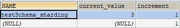

```
其中increment是序列号自增的步伐,为1的时候严格按1递增,当1000的时候,mycat会每次批量递增1000取序列号.此时在多个mycat访问此序列号表的情况下,不能严格自增
NAME列中的值是对应的 库名_表名 该值需要用户设置,即插入一条逻辑表相关的记录,用于记录序列号
```

```mysql
#3、切换为数据库方式全局序列号
使用注释前要导入dbseq.sql以及设置mycat_sequence表内的逻辑表记录
通过注释设置为数据库方式全局序列号
/*+ mycat:setSequence{
"name":"db1_travelrecord",
"clazz":"io.mycat.plug.sequence.SequenceMySQLGenerator",
"name":"db1_travelrecord",
"targetName": "prototype",
"schemaName":"db2"
} */;

#4、切换为雪花算法方式全局序列号
/*+ mycat:setSequence{"name":"db1_travelrecord","time":true} */;
```