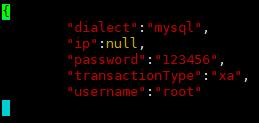

# MyCat安全设置

## 1. 权限配置  

### 1、user 标签权限控制  

目前 Mycat 对于中间件的连接控制并没有做太复杂的控制，目前只做了中间件逻辑库级别的读写权限控制。是通过 mycat/conf/users 目录下的{用户名}.user.json进行配置。  

```json
#root.user.json
{
"dialect":"mysql",
"ip":null,
"password":"123456",
"transactionType":"xa",
"username":"root"
} 
#如下图
```



配置说明  

| 标签属性        | 说明                                                         |
| --------------- | ------------------------------------------------------------ |
| name            | 应用连接中间件逻辑库的用户名                                 |
| password        | 该用户对应的密码                                             |
| ip              | 建议为空,填写后会对客户端的 ip 进行限制                      |
| dialect         | 使用语言，默认 mysql                                         |
| transactionType | 事务类型，默认 proxy <br>proxy：本地事务,在涉及大于 1 个数据库的事务,commit 阶段失败<br>会导致不一致,但是兼容性最好<br> xa：分布式事务，需要确认存储节点集群类型是否支持 XA <br>更改命令：set transaction_policy = 'xa' set transaction_policy = 'proxy' <br>查看命令：SELECT @@transaction_policy |

### 2、权限说明

Mycat2 权限分为两块：登录权限、sql 权限

（1）登录权限：

Mycat2 在 MySQL 网络协议的时候检查客户端的 IP,用户名,密码

其中 IP 使用正则表达式匹配,一旦匹配成功,就放行

（2）sql 权限

使用自定义拦截器实现  