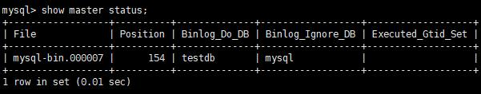

# 搭建读写分离

我们通过 Mycat 和 MySQL 的主从复制配合搭建数据库的读写分离，实现 MySQL 的高可用性。我们将搭建：一主一从、双主双从两种读写分离模式。  

## 1. 搭建一主一从  

一个主机用于处理所有写请求，一台从机负责所有读请求，架构图如下  


### 1、搭建 MySQL 数据库主从复制  

#### 1. MySQL 主从复制原理  


#### 2. 主机配置(atguigu01)  

```properties
修改配置文件：vim /etc/my.cnf
#主服务器唯一ID
server-id=1
#启用二进制日志
log-bin=mysql-bin
# 设置不要复制的数据库(可设置多个)
binlog-ignore-db=mysql
binlog-ignore-db=information_schema
#设置需要复制的数据库
binlog-do-db=需要复制的主数据库名字
#设置logbin格式
binlog_format=STATEMENT
```

binlog 日志三种格式  


#### 3.  从机配置(atguigu02)  

```properties
修改配置文件：vim /etc/my.cnf
#从服务器唯一ID
server-id=2
#启用中继日志
relay-log=mysql-relay
```

#### 4. 主机、从机重启 MySQL 服务

#### 5. 主机从机都关闭防火墙

#### 6. 在主机上建立帐户并授权 slave  

```mysql
#在主机MySQL里执行授权命令
CREATE USER 'slave2'@'%' IDENTIFIED BY '123123';
GRANT REPLICATION SLAVE ON *.* TO 'slave2'@'%';
#此语句必须执行。否则见下面。
ALTER USER 'slave2'@'%' IDENTIFIED WITH mysql_native_password BY '123123';
flush privileges;
#查询master的状态
show master status;
```



```
记录下File和Position的值
执行完此步骤后不要再操作主服务器MySQL，防止主服务器状态值变化
```

#### 7. 在从机上配置需要复制的主机  

```mysql
#复制主机的命令
CHANGE MASTER TO MASTER_HOST='主机的IP地址',
MASTER_USER='slave',
MASTER_PASSWORD='123123',
MASTER_LOG_FILE='mysql-bin.具体数字',MASTER_LOG_POS=具体值;
```


```
#启动从服务器复制功能
start slave;
#查看从服务器状态
show slave status\G;
```


```
#下面两个参数都是Yes，则说明主从配置成功！
Slave_IO_Running: Yes
Slave_SQL_Running: Yes
```

#### 8. 主机新建库、新建表、insert 记录，从机复制  

```mysql
#建库语句
CREATE DATABASE mydb1;
use mydb1;
#建表语句
CREATE TABLE mytbl(id INT,NAME VARCHAR(50));
#插入数据
INSERT INTO mytbl VALUES(1,"zhang3");
```


#### 9. 如何停止从服务复制功能  

```mysql
stop slave;
```

#### 10. 如何重新配置主从  

```mysql
stop slave;
reset master;
```


### 2、配置 Mycat 读写分离  

登录Mycat，创建逻辑库，配置数据源  

```mysql
#在Mycat里创建数据库mydb1
#创建db2逻辑库
create database mydb1;
#修改mydb1.schema.json 指定数据源 "targetName":"prototype"，配置主机数据源
vim /usr/local/mycat/conf/schemas/mydb1.schema.json
```


使用注解方式添加数据源  

```mysql
/*+ mycat:createDataSource{ "name":"rwSepw","url":"jdbc:mysql://192.168.140.100:3306/mydb1?useSSL=false&characterEncoding=UTF-8&useJDBCCompliantTimezoneShift=true", "user":"root","password":"root" } */;

/*+ mycat:createDataSource{ "name":"rwSepr","url":"jdbc:mysql://192.168.140.99:3306/mydb1?useSSL=false&characterEncoding=UTF-8&useJDBCCompliantTimezoneShift=true", "user":"root","password":"root" } */;

#查询配置数据源结果
/*+ mycat:showDataSources{} */;
```


更新集群信息,添加dr0从节点.实现读写分离  

```mysql
#更新集群信息,添加dr0从节点.
/*!mycat:createCluster{"name":"prototype","masters":["rwSepw"],"replicas":["rwSepr"]} */;

#查看配置集群信息
/*+ mycat:showClusters{} */;
```

```shell
#查看集群配置文件
vim /usr/LOCAL/mycat/conf/clusters/prototype.cluster.json
```


```
readBalanceType
查询负载均衡策略
可选值:

BALANCE_ALL(默认值)
获取集群中所有数据源

BALANCE_ALL_READ
获取集群中允许读的数据源

BALANCE_READ_WRITE
获取集群中允许读写的数据源,但允许读的数据源优先

BALANCE_NONE
获取集群中允许写数据源,即主节点中选择

switchType
NOT_SWITCH:不进行主从切换
SWITCH:进行主从切换
```

### 3、重新启动 Mycat  

### 4、验证读写分离  

```mysql
#（1）在写主机数据库表mytbl中插入带系统变量数据，造成主从数据不一致
INSERT INTO mytbl VALUES(2,@@hostname);
```


```
（2）在Mycat里查询mytbl表,可以看到查询语句在主从两个主机间切换  
```


## 2. 搭建双主双从  

一个主机 m1 用于处理所有写请求，它的从机 s1 和另一台主机 m2 还有它的从机 s2负责所有读请求。当 m1 主机宕机后，m2 主机负责写请求，m1、m2 互为备机。架构图如下  


| 编号 | 角色    | IP 地址         | 机器名    |
| ---- | ------- | --------------- | --------- |
| 1    | Master1 | 192.168.140.100 | atguigu01 |
| 2    | Slave1  | 192.168.140.99  | atguigu02 |
| 3    | Master2 | 192.168.140.98  | atguigu03 |
| 4    | Slave2  | 192.168.140.97  | atguigu04 |

### 1、搭建 MySQL 数据库主从复制（双主双从）  

#### 1. 双主机配置  

Master1配置  

```properties
修改配置文件：vim /etc/my.cnf
#主服务器唯一ID
server-id=1
#启用二进制日志
log-bin=mysql-bin
# 设置不要复制的数据库(可设置多个)
binlog-ignore-db=mysql
binlog-ignore-db=information_schema
#设置需要复制的数据库
binlog-do-db=需要复制的主数据库名字
#设置logbin格式
binlog_format=STATEMENT
# 在作为从数据库的时候，有写入操作也要更新二进制日志文件
log-slave-updates
#表示自增长字段每次递增的量，指自增字段的起始值，其默认值是1，取值范围是1 .. 65535
auto-increment-increment=2
# 表示自增长字段从哪个数开始，指字段一次递增多少，他的取值范围是1 .. 65535
auto-increment-offset=1
```

Master2配置  

```properties
修改配置文件：vim /etc/my.cnf
#主服务器唯一ID
server-id=3
#启用二进制日志
log-bin=mysql-bin
# 设置不要复制的数据库(可设置多个)
binlog-ignore-db=mysql
binlog-ignore-db=information_schema
#设置需要复制的数据库
binlog-do-db=需要复制的主数据库名字
#设置logbin格式
binlog_format=STATEMENT
# 在作为从数据库的时候，有写入操作也要更新二进制日志文件
log-slave-updates
#表示自增长字段每次递增的量，指自增字段的起始值，其默认值是1，取值范围是1 .. 65535
auto-increment-increment=2
# 表示自增长字段从哪个数开始，指字段一次递增多少，他的取值范围是1 .. 65535
auto-increment-offset=2
```

#### 2. 双从机配置  

Slave1配置  

```properties
修改配置文件：vim /etc/my.cnf
#从服务器唯一ID
server-id=2
#启用中继日志
relay-log=mysql-relay
```

Slave2配置  

```properties
修改配置文件：vim /etc/my.cnf
#从服务器唯一ID
server-id=4
#启用中继日志
relay-log=mysql-relay
```

#### 3. 双主机、双从机重启 mysql 服务  

#### 4. 主机从机都关闭防火墙  

#### 5. 在两台主机上建立帐户并授权 slave  

```mysql
#在主机MySQL里执行授权命令
CREATE USER 'slave2'@'%' IDENTIFIED BY '123123';
GRANT REPLICATION SLAVE ON *.* TO 'slave2'@'%';
#此语句必须执行。否则见下面。
ALTER USER 'slave2'@'%' IDENTIFIED WITH mysql_native_password BY '123123';
#查询Master1的状态
show master status;
```


```mysql
#查询Master2的状态
show master status;
```


```mysql
#分别记录下File和Position的值
#执行完此步骤后不要再操作主服务器MYSQL，防止主服务器状态值变化
```

#### 6. 在从机上配置需要复制的主机  

Slava1 复制 Master1，Slava2 复制 Master2  

```mysql
#复制主机的命令
CHANGE MASTER TO MASTER_HOST='主机的IP地址',
MASTER_USER='slave',
MASTER_PASSWORD='123123',
MASTER_LOG_FILE='mysql-bin.具体数字',MASTER_LOG_POS=具体值;
```

Slava1的复制命令


Slava2的复制命令  


```mysql
#启动两台从服务器复制功能
start slave;
#查看从服务器状态
show slave status\G;
#Slava1的复制Master1
```


\#Slava2的复制Master2  


```
#下面两个参数都是Yes，则说明主从配置成功！
Slave_IO_Running: Yes
Slave_SQL_Running: Yes
```

#### 7. 两个主机互相复制  

Master2 复制 Master1，Master1 复制 Master2  

```
# Master2的复制命令
```


```
# Master1的复制命令
```


```mysql
#启动两台主服务器复制功能
start slave;
#查看从服务器状态
show slave status\G;
Master2的复制Master1
```


```
Master1的复制Master2
```


```
#下面两个参数都是Yes，则说明主从配置成功！
Slave_IO_Running: Yes
Slave_SQL_Running: Yes
```

#### 8. Master1 主机新建库、新建表、insert 记录，Master2 和从机复制  


#### 9. 如何停止从服务复制功能  

```mysql
stop slave;
```

#### 10. 如何重新配置主从  

```mysql
stop slave;
reset master;
```


### 2、修改 Mycat 的集群配置实现多种主从  

Mycat2.0的特点把集群概念凸显了出来，和mysql主从复制、集群配合实现多节点读写分离  

```mysql
#（1） 双主双从集群角色划分
#  *m1：主机
#  *m2：备机，也负责读
#  *s1，s2：从机
#（2）增加两个数据源

/*+ mycat:createDataSource{ "name":"rwSepw2","url":"jdbc:mysql://192.168.140.98:3306/mydb1?useSSL=false&characterEncoding=UTF-8&useJDBCCompliantTimezoneShift=true", "user":"root","password":"123123" } */;

/*+ mycat:createDataSource{ "name":"rwSepr2","url":"jdbc:mysql://192.168.140.97:3306/mydb1?useSSL=false&characterEncoding=UTF-8&useJDBCCompliantTimezoneShift=true", "user":"root","password":"123123" } */;
```

```json
（3）修改集群配置文件
vim /usr/local/mycat/conf/clusters/prototype.cluster.json
{
    "clusterType":"MASTER_SLAVE",
    "heartbeat":{
        "heartbeatTimeout":1000,
        "maxRetryCount":3,
        "minSwitchTimeInterval":300,
        "slaveThreshold":0
    },
    "masters":[
    	"rwSepw","rwSepw2"
    ],
    "replicas":[
    	"rwSepw2","rwSepr","rwSepr2"
    ],
    "maxCon":200,
    "name":"prototype",
    "readBalanceType":"BALANCE_ALL",
    "switchType":"SWITCH" ,
    "timer":{
        "initialDelay": 30,
        "period":5,
        "timeUnit":"SECONDS"
    }
}
```

```sh
#（4）重启Mycat生效
./mycat restart
```


### 3、读写分离配置扩展  

通过对集群配置的修改，可以根据需求实现更多种情况的读写分离配置，总结如下  

```json
（1）读写分离(一主一从,无备)(m是主,s是从)
{
    "clusterType":"MASTER_SLAVE",
    "heartbeat":{
        "heartbeatTimeout":1000,
        "maxRetryCount":3,
        "minSwitchTimeInterval":300,
        "slaveThreshold":0
    },
    "masters":[
   	 	"m"
    ],
    "replicas":[
    	"s"
    ],
    "maxCon":200,
    "name":"prototype",
    "readBalanceType":"BALANCE_ALL",
    "switchType":"SWITCH" ,
    "timer":{
    	"initialDelay": 30,
        "period":5,
        "timeUnit":"SECONDS"
    }
}

（2）读写分离(一主一从,一备)(m是主,s是从备)
{
    "clusterType":"MASTER_SLAVE",
    "heartbeat":{
        "heartbeatTimeout":1000,
        "maxRetryCount":3,
        "minSwitchTimeInterval":300,
        "slaveThreshold":0
    },
    "masters":[
    	"m","s"
    ],
    "replicas":[
    	"s"
    ],
    "maxCon":200,
    "name":"prototype",
    "readBalanceType":"BALANCE_ALL",
    "switchType":"SWITCH" ,
    "timer":{
        "initialDelay": 30,
        "period":5,
        "timeUnit":"SECONDS"
    }
}

（3）读写分离(一主一从,一备)(m是主,s是从,b是备)
{
    "clusterType":"MASTER_SLAVE",
    "heartbeat":{
        "heartbeatTimeout":1000,
        "maxRetryCount":3,
        "minSwitchTimeInterval":300,
        "slaveThreshold":0
    },
    "masters":[
    	"m","b"
    ],
    "replicas":[
    	"s"
    ],
    "maxCon":200,
    "name":"prototype",
    "readBalanceType":"BALANCE_ALL",
    "switchType":"SWITCH" ,
    "timer":{
        "initialDelay": 30,
        "period":5,
        "timeUnit":"SECONDS"
    }
}
（4）MHA(一主一从,一备)(m是主,s是从,b是备,READ_ONLY判断主)
{
    "clusterType":"MHA",
    "heartbeat":{
        "heartbeatTimeout":1000,
        "maxRetryCount":3,
        "minSwitchTimeInterval":300,
        "slaveThreshold":0
    },
    "masters":[
    	"m","b"
    ],
    "replicas":[
    	"s"
    ],
    "maxCon":200,
    "name":"prototype",
    "readBalanceType":"BALANCE_ALL",
    "switchType":"SWITCH" ,
    "timer":{
        "initialDelay": 30,
        "period":5,
        "timeUnit":"SECONDS"
    }
}
（5）MGR(一主一从,一备)(m是主,s是从,b是备,READ_ONLY判断主)
{
    "clusterType":"MGR",
    "heartbeat":{
        "heartbeatTimeout":1000,
        "maxRetryCount":3,
        "minSwitchTimeInterval":300,
        "slaveThreshold":0
    },
    "masters":[
    	"m","b"
    ],
    "replicas":[
    	"s"
    ],
    "maxCon":200,
    "name":"prototype",
    "readBalanceType":"BALANCE_ALL",
    "switchType":"SWITCH" ,
    "timer":{
        "initialDelay": 30,
        "period":5,
        "timeUnit":"SECONDS"
    }
}

（6）GARELA_CLUSTER(一主一从,一备)(m是主,s是从,b多主)
{
    "clusterType":"GARELA_CLUSTER",
    "heartbeat":{
        "heartbeatTimeout":1000,
        "maxRetryCount":3,
        "minSwitchTimeInterval":300,
        "slaveThreshold":0
    },
    "masters":[
   	 	"m","b"
    ],
    "replicas":[
    	"s"
    ],
    "maxCon":200,
    "name":"prototype",
    "readBalanceType":"BALANCE_ALL",
    "switchType":"SWITCH" ,
    "timer":{
        "initialDelay": 30,
        "period":5,
        "timeUnit":"SECONDS"
    }
}
```

