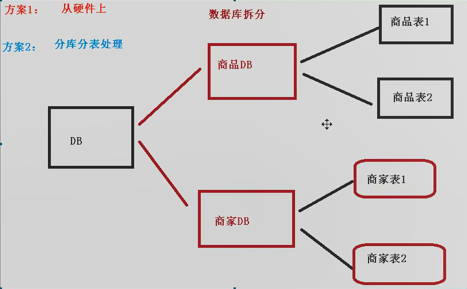
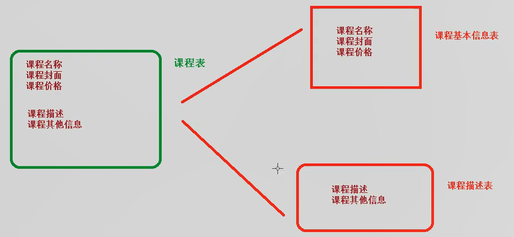
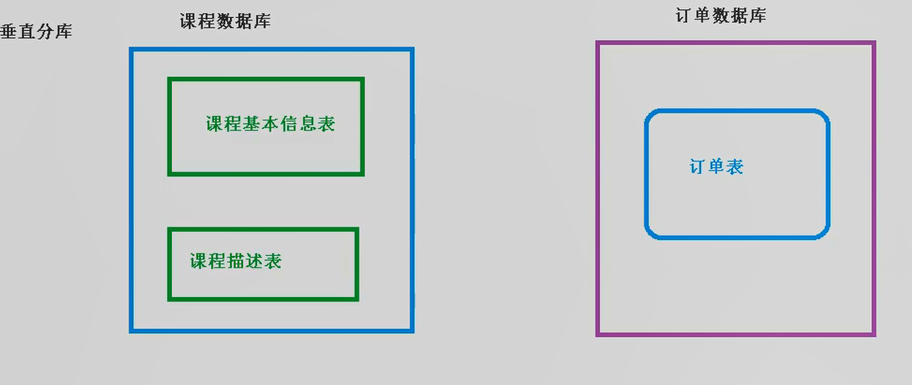
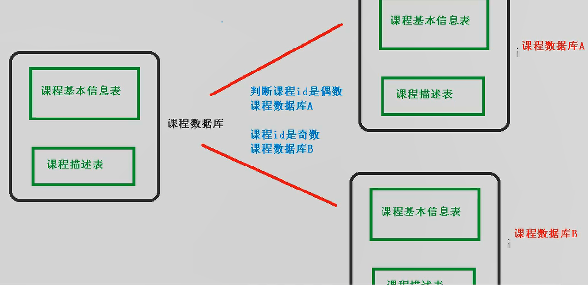
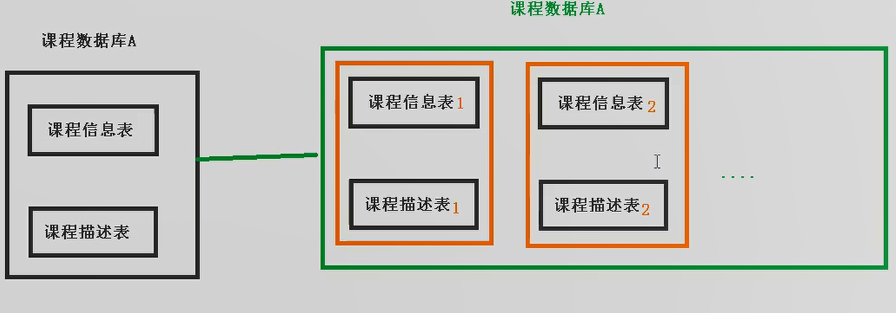
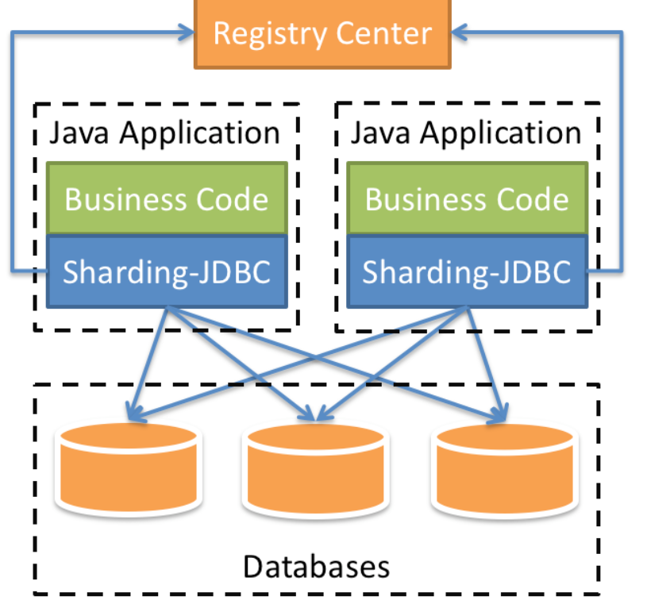
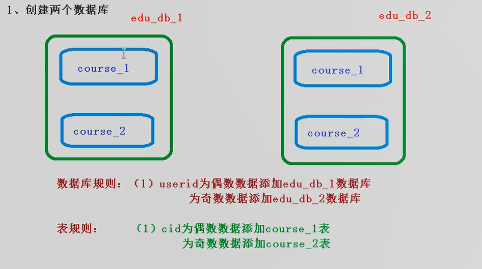
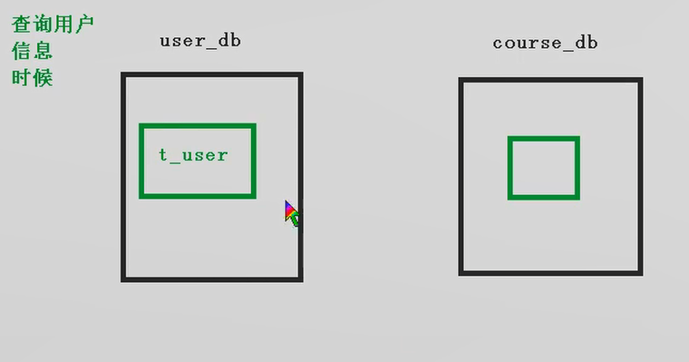
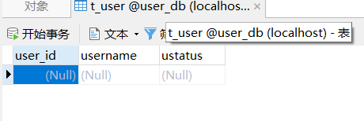
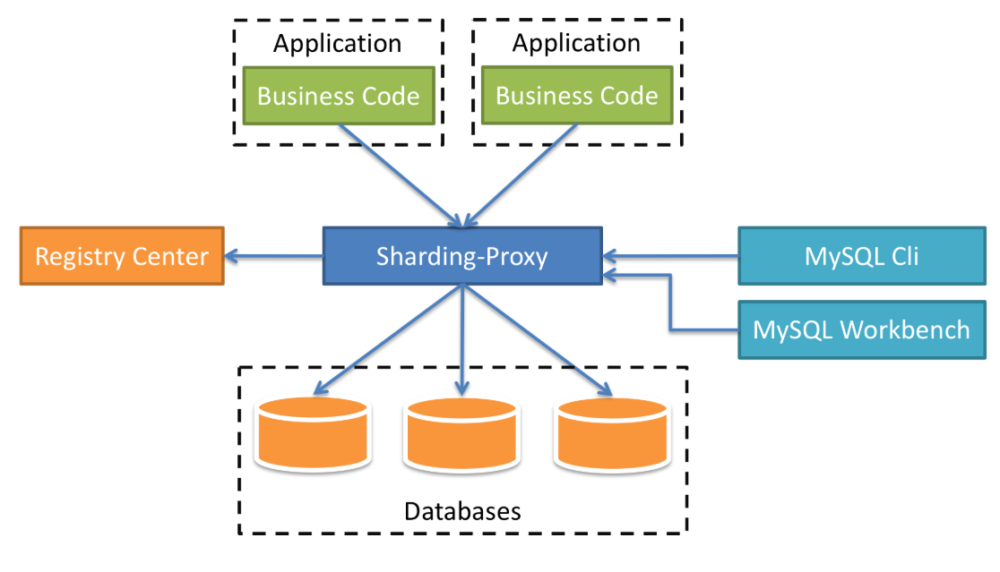

* [一、ShardingSphere](#%E4%B8%80shardingsphere)
  * [什么是ShardingSphere](#%E4%BB%80%E4%B9%88%E6%98%AFshardingsphere)
  * [什么是分库分表](#%E4%BB%80%E4%B9%88%E6%98%AF%E5%88%86%E5%BA%93%E5%88%86%E8%A1%A8)
  * [分库分表的方式](#%E5%88%86%E5%BA%93%E5%88%86%E8%A1%A8%E7%9A%84%E6%96%B9%E5%BC%8F)
    * [垂直分表](#%E5%9E%82%E7%9B%B4%E5%88%86%E8%A1%A8)
    * [垂直分库](#%E5%9E%82%E7%9B%B4%E5%88%86%E5%BA%93)
    * [水平分库](#%E6%B0%B4%E5%B9%B3%E5%88%86%E5%BA%93)
    * [水平分表](#%E6%B0%B4%E5%B9%B3%E5%88%86%E8%A1%A8)
  * [分库分表应用和问题](#%E5%88%86%E5%BA%93%E5%88%86%E8%A1%A8%E5%BA%94%E7%94%A8%E5%92%8C%E9%97%AE%E9%A2%98)
    * [应用](#%E5%BA%94%E7%94%A8)
    * [分库分表问题](#%E5%88%86%E5%BA%93%E5%88%86%E8%A1%A8%E9%97%AE%E9%A2%98)
* [二、Sharding\-JDBC](#%E4%BA%8Csharding-jdbc)
  * [Sharding\-JDBC实现水平分表](#sharding-jdbc%E5%AE%9E%E7%8E%B0%E6%B0%B4%E5%B9%B3%E5%88%86%E8%A1%A8)
    * [搭建环境](#%E6%90%AD%E5%BB%BA%E7%8E%AF%E5%A2%83)
    * [创建数据库，创建数据表](#%E5%88%9B%E5%BB%BA%E6%95%B0%E6%8D%AE%E5%BA%93%E5%88%9B%E5%BB%BA%E6%95%B0%E6%8D%AE%E8%A1%A8)
    * [配置Sharding\-JDBC分片策略](#%E9%85%8D%E7%BD%AEsharding-jdbc%E5%88%86%E7%89%87%E7%AD%96%E7%95%A5)
    * [编写测试代码](#%E7%BC%96%E5%86%99%E6%B5%8B%E8%AF%95%E4%BB%A3%E7%A0%81)
  * [Sharding\-JDBC实现水平分库](#sharding-jdbc%E5%AE%9E%E7%8E%B0%E6%B0%B4%E5%B9%B3%E5%88%86%E5%BA%93)
    * [需求](#%E9%9C%80%E6%B1%82)
    * [在SpringBoot配置文件配置数据库分片规则](#%E5%9C%A8springboot%E9%85%8D%E7%BD%AE%E6%96%87%E4%BB%B6%E9%85%8D%E7%BD%AE%E6%95%B0%E6%8D%AE%E5%BA%93%E5%88%86%E7%89%87%E8%A7%84%E5%88%99)
    * [编写测试代码](#%E7%BC%96%E5%86%99%E6%B5%8B%E8%AF%95%E4%BB%A3%E7%A0%81-1)
  * [Sharding\-JDBC实现垂直分库](#sharding-jdbc%E5%AE%9E%E7%8E%B0%E5%9E%82%E7%9B%B4%E5%88%86%E5%BA%93)
    * [需求](#%E9%9C%80%E6%B1%82-1)
    * [创建数据库数据表](#%E5%88%9B%E5%BB%BA%E6%95%B0%E6%8D%AE%E5%BA%93%E6%95%B0%E6%8D%AE%E8%A1%A8)
    * [编写操作代码](#%E7%BC%96%E5%86%99%E6%93%8D%E4%BD%9C%E4%BB%A3%E7%A0%81)
  * [Sharding\-JDBC 公共表](#sharding-jdbc-%E5%85%AC%E5%85%B1%E8%A1%A8)
    * [公共表](#%E5%85%AC%E5%85%B1%E8%A1%A8)
    * [在多个数据库中都创建相同结构公共表](#%E5%9C%A8%E5%A4%9A%E4%B8%AA%E6%95%B0%E6%8D%AE%E5%BA%93%E4%B8%AD%E9%83%BD%E5%88%9B%E5%BB%BA%E7%9B%B8%E5%90%8C%E7%BB%93%E6%9E%84%E5%85%AC%E5%85%B1%E8%A1%A8)
    * [进行配置](#%E8%BF%9B%E8%A1%8C%E9%85%8D%E7%BD%AE)
    * [编写测试代码](#%E7%BC%96%E5%86%99%E6%B5%8B%E8%AF%95%E4%BB%A3%E7%A0%81-2)
  * [Sharding\-JDBC实现读写分离](#sharding-jdbc%E5%AE%9E%E7%8E%B0%E8%AF%BB%E5%86%99%E5%88%86%E7%A6%BB)
    * [配置](#%E9%85%8D%E7%BD%AE)
    * [创建用于主从复制的账号](#%E5%88%9B%E5%BB%BA%E7%94%A8%E4%BA%8E%E4%B8%BB%E4%BB%8E%E5%A4%8D%E5%88%B6%E7%9A%84%E8%B4%A6%E5%8F%B7)
    * [主从数据同步的设置](#%E4%B8%BB%E4%BB%8E%E6%95%B0%E6%8D%AE%E5%90%8C%E6%AD%A5%E7%9A%84%E8%AE%BE%E7%BD%AE)
    * [Sharding\-JDBC操作](#sharding-jdbc%E6%93%8D%E4%BD%9C)
* [三、Sharding\-Proxy](#%E4%B8%89sharding-proxy)
  * [Sharding\-proxy配置（分库）](#sharding-proxy%E9%85%8D%E7%BD%AE%E5%88%86%E5%BA%93)
  * [Sharding\-proxy配置（读写分离）](#sharding-proxy%E9%85%8D%E7%BD%AE%E8%AF%BB%E5%86%99%E5%88%86%E7%A6%BB)

# 一、ShardingSphere

## 什么是ShardingSphere

1、一套开源的分布式数据库中间件解决方案

2、有三个产品：Sharding-JDBC和Sharding-Proxy

3、定位为关系型数据库中间件，合理在分布式环境下使用关系型数据库操作

## 什么是分库分表

1、数据库数据量不可控的，随着时间和业务发展，造成表里面数据越来越多，如果再去对数据库表CRUD操作时候，造成性能问题

2、方案1：从硬件上

3、方案2：分库分表

- 为了解决由于数据量过大而早晨数据库性能降低问题

  

## 分库分表的方式

1、分库分表的两种方式：垂直切分和水平切分

2、垂直切分：垂直切表和垂直分库

3、水平切分：水平切表和水平分库

### 垂直分表

- 操作数据库中的某张表，把这张表的一部分字段数据存放到一张新表里面，再把这张表另一部分字段数据存放到另一表中

  

### 垂直分库

- 把单一数据库按照业务进行划分，专库专表

  

### 水平分库



### 水平分表



## 分库分表应用和问题

### 应用

- 在数据库设计时候考虑垂直分库和垂直分表
- 随着数据库数据量增加，不要马上考虑水平切分，首先考虑缓存处理，读写分离，使用索引等等方式，如果这些方式不能根本解决问题了，再考虑做水平分库和水平分表

### 分库分表问题

- 跨节点连接查询问题（分页、排序）
- 多数据源管理问题

# 二、Sharding-JDBC

1、是轻量级的java框架，是增强版的JDBC驱动

2、Sharding-JDBC

- 主要目的：简化对分库分表之后数据相关操作



## Sharding-JDBC实现水平分表

### 搭建环境

- SpringBoot + MybatisPlus + Sharding-JDBC + Druid连接池

```pom
<?xml version="1.0" encoding="UTF-8"?>
<project xmlns="http://maven.apache.org/POM/4.0.0" xmlns:xsi="http://www.w3.org/2001/XMLSchema-instance"
         xsi:schemaLocation="http://maven.apache.org/POM/4.0.0 https://maven.apache.org/xsd/maven-4.0.0.xsd">
    <modelVersion>4.0.0</modelVersion>
    <parent>
        <groupId>org.springframework.boot</groupId>
        <artifactId>spring-boot-starter-parent</artifactId>
        <version>2.2.1.RELEASE</version>
        <relativePath/> <!-- lookup parent from repository -->
    </parent>
    <groupId>com.atguigu</groupId>
    <artifactId>shardingjdbcdemo</artifactId>
    <version>0.0.1-SNAPSHOT</version>
    <name>shardingjdbcdemo</name>
    <description>Demo project for Spring Boot</description>

    <properties>
        <java.version>1.8</java.version>
    </properties>

    <dependencies>
        <dependency>
            <groupId>org.springframework.boot</groupId>
            <artifactId>spring-boot-starter</artifactId>
        </dependency>

        <dependency>
            <groupId>com.alibaba</groupId>
            <artifactId>druid-spring-boot-starter</artifactId>
            <version>1.1.20</version>
        </dependency>

        <dependency>
            <groupId>mysql</groupId>
            <artifactId>mysql-connector-java</artifactId>
        </dependency>

        <dependency>
            <groupId>org.apache.shardingsphere</groupId>
            <artifactId>sharding-jdbc-spring-boot-starter</artifactId>
            <version>4.0.0-RC1</version>
        </dependency>

        <dependency>
            <groupId>com.baomidou</groupId>
            <artifactId>mybatis-plus-boot-starter</artifactId>
            <version>3.0.5</version>
        </dependency>

        <dependency>
            <groupId>org.projectlombok</groupId>
            <artifactId>lombok</artifactId>
            <optional>true</optional>
        </dependency>
        <dependency>
            <groupId>org.springframework.boot</groupId>
            <artifactId>spring-boot-starter-test</artifactId>
            <scope>test</scope>
        </dependency>
    </dependencies>

    <build>
        <plugins>
            <plugin>
                <groupId>org.springframework.boot</groupId>
                <artifactId>spring-boot-maven-plugin</artifactId>
            </plugin>
        </plugins>
    </build>

</project>
```

### 创建数据库，创建数据表

- 创建数据库course_db

- 在数据库创建两张表course_1和course_2

  ```sql
  CREATE TABLE course_1(
  		cid BIGINT(20) PRIMARY KEY,
  		cname VARCHAR(50) NOT NULL,
  		user_id BIGINT(20) NOT NULL,
  		cstatus VARCHAR(10) NOT NULL
  )
  ```

- 约束规则：课程id是偶数把数据添加course_1，奇数添加到course_2

### 配置Sharding-JDBC分片策略

- 在项目application.properties配置文件中进行配置

  ```properties
  #ShardingJDBC分片策略
  #配置数据源
  spring.shardingsphere.datasource.names=m1
  
  #一个实体类对应两张表，覆盖，不配置会报错
  spring.main.allow-bean-definition-overriding=true
  
  #数据源具体内容
  spring.shardingsphere.datasource.m1.type=com.alibaba.druid.pool.DruidDataSource
  spring.shardingsphere.datasource.m1.driver-class-name=com.mysql.cj.jdbc.Driver
  spring.shardingsphere.datasource.m1.url=jdbc:mysql://localhost:3306/course_db?serverTimezone=GMT%2B8
  spring.shardingsphere.datasource.m1.username=root
  spring.shardingsphere.datasource.m1.password=123456
  
  #指定course表分布情况，配置表在哪个数据库，表名称都是什么 m1.course_1,m1.course_2
  spring.shardingsphere.sharding.tables.course.actual-data-nodes=m1.course_$->{1..2}
  
  #指定course表里面主键生成策略
  spring.shardingsphere.sharding.tables.course.key-generator.column=cid
  spring.shardingsphere.sharding.tables.course.key-generator.type=SNOWFLAKE
  
  #指定分片策略，cid偶数添加到course_1，奇数course_2
  spring.shardingsphere.sharding.tables.course.table-strategy.inline.sharding-column=cid
  spring.shardingsphere.sharding.tables.course.table-strategy.inline.algorithm-expression=course_$->{cid % 2 + 1}
  
  #打开sql输出日志
  spring.shardingsphere.props.sql.show=true
  ```

### 编写测试代码

```java
package com.atguigu.shardingjdbcdemo;

import com.atguigu.shardingjdbcdemo.entity.Course;
import com.atguigu.shardingjdbcdemo.mapper.CourseMapper;
import com.baomidou.mybatisplus.core.conditions.query.QueryWrapper;
import org.junit.jupiter.api.Test;
import org.springframework.beans.factory.annotation.Autowired;
import org.springframework.boot.test.context.SpringBootTest;

@SpringBootTest
class ShardingjdbcdemoApplicationTests {

    @Autowired
    private CourseMapper courseMapper;

    //添加课程的方法
    @Test
    void addCourse() {
        for (int i = 0; i < 10; i++) {
            Course course = new Course();
            course.setCname("java"+i);
            course.setUserId(100L);
            course.setCstatus("Normal"+i);
            courseMapper.insert(course);
        }

    }

    //查询课程的方法
    @Test
    void findCourse(){
        QueryWrapper<Course> wrapper = new QueryWrapper<>();
        wrapper.eq("cid",474876014774714369L);
        Course course = courseMapper.selectOne(wrapper);
        System.out.println(course);
    }

}
```

## Sharding-JDBC实现水平分库

### 需求



### 在SpringBoot配置文件配置数据库分片规则

```properties
#ShardingJDBC分片策略
#配置数据源
#水平分库，配置两个数据源
spring.shardingsphere.datasource.names=m1,m2

#一个实体类对应两张表，覆盖
spring.main.allow-bean-definition-overriding=true

#数据源具体内容，第一个
spring.shardingsphere.datasource.m1.type=com.alibaba.druid.pool.DruidDataSource
spring.shardingsphere.datasource.m1.driver-class-name=com.mysql.cj.jdbc.Driver
spring.shardingsphere.datasource.m1.url=jdbc:mysql://localhost:3306/edu_db_1?serverTimezone=GMT%2B8
spring.shardingsphere.datasource.m1.username=root
spring.shardingsphere.datasource.m1.password=123456

#数据源具体内容，第二个
spring.shardingsphere.datasource.m2.type=com.alibaba.druid.pool.DruidDataSource
spring.shardingsphere.datasource.m2.driver-class-name=com.mysql.cj.jdbc.Driver
spring.shardingsphere.datasource.m2.url=jdbc:mysql://localhost:3306/edu_db_2?serverTimezone=GMT%2B8
spring.shardingsphere.datasource.m2.username=root
spring.shardingsphere.datasource.m2.password=123456

#指定数据库分布情况，数据库里面表分布情况
spring.shardingsphere.sharding.tables.course.actual-data-nodes=m$->{1..2}.course_$->{1..2}

#指定course表里面主键生成策略
spring.shardingsphere.sharding.tables.course.key-generator.column=cid
spring.shardingsphere.sharding.tables.course.key-generator.type=SNOWFLAKE

#指定表分片策略，cid偶数添加到course_1，奇数course_2
spring.shardingsphere.sharding.tables.course.table-strategy.inline.sharding-column=cid
spring.shardingsphere.sharding.tables.course.table-strategy.inline.algorithm-expression=course_$->{cid % 2 + 1}

#指定数据库分片策略，约定user_id是偶数添加m1，是奇数添加m2，这是所有表规则
#spring.shardingsphere.sharding.default-database-strategy.inline.sharding-column=user_id
#spring.shardingsphere.sharding.default-database-strategy.inline.algorithm-expression=m$->{user_id % 2 + 1}

#指定表规则
spring.shardingsphere.sharding.tables.course.database-strategy.inline.sharding-column=user_id
spring.shardingsphere.sharding.tables.course.database-strategy.inline.algorithm-expression=m$->{user_id % 2 + 1}

#打开sql输出日志
spring.shardingsphere.props.sql.show=true
```

### 编写测试代码

```java
package com.atguigu.shardingjdbcdemo;

import com.atguigu.shardingjdbcdemo.entity.Course;
import com.atguigu.shardingjdbcdemo.mapper.CourseMapper;
import com.baomidou.mybatisplus.core.conditions.query.QueryWrapper;
import org.junit.jupiter.api.Test;
import org.springframework.beans.factory.annotation.Autowired;
import org.springframework.boot.test.context.SpringBootTest;

@SpringBootTest
class ShardingjdbcdemoApplicationTests {

    @Autowired
    private CourseMapper courseMapper;

    //===================水平分库====================//
    @Test
    void addCourseDB(){
        Course course = new Course();
        course.setCname("javademo");
        //分库根据user_id
        course.setUserId(111L);
        course.setCstatus("Normal");
        courseMapper.insert(course);
    }

    @Test
    void findCourseDB(){
        QueryWrapper<Course> wrapper = new QueryWrapper<>();
        wrapper.eq("user_id",100L);
        wrapper.eq("cid",474892912748920833L);
        Course course = courseMapper.selectOne(wrapper);
        System.out.println(course);
    }
}

```

## Sharding-JDBC实现垂直分库

### 需求




### 创建数据库数据表



### 编写操作代码

- 实体类和mapper

- 配置垂直分库策略

  ```properties
  #ShardingJDBC分片策略
  #配置数据源
  #水平分库，配置两个数据源
  spring.shardingsphere.datasource.names=m1,m2,m0
  
  #一个实体类对应两张表，覆盖
  spring.main.allow-bean-definition-overriding=true
  
  #数据源具体内容，第一个
  spring.shardingsphere.datasource.m1.type=com.alibaba.druid.pool.DruidDataSource
  spring.shardingsphere.datasource.m1.driver-class-name=com.mysql.cj.jdbc.Driver
  spring.shardingsphere.datasource.m1.url=jdbc:mysql://localhost:3306/edu_db_1?serverTimezone=GMT%2B8
  spring.shardingsphere.datasource.m1.username=root
  spring.shardingsphere.datasource.m1.password=123456
  
  #数据源具体内容，第二个
  spring.shardingsphere.datasource.m2.type=com.alibaba.druid.pool.DruidDataSource
  spring.shardingsphere.datasource.m2.driver-class-name=com.mysql.cj.jdbc.Driver
  spring.shardingsphere.datasource.m2.url=jdbc:mysql://localhost:3306/edu_db_2?serverTimezone=GMT%2B8
  spring.shardingsphere.datasource.m2.username=root
  spring.shardingsphere.datasource.m2.password=123456
  
  #数据源具体内容，第三个
  spring.shardingsphere.datasource.m0.type=com.alibaba.druid.pool.DruidDataSource
  spring.shardingsphere.datasource.m0.driver-class-name=com.mysql.cj.jdbc.Driver
  spring.shardingsphere.datasource.m0.url=jdbc:mysql://localhost:3306/user_db?serverTimezone=GMT%2B8
  spring.shardingsphere.datasource.m0.username=root
  spring.shardingsphere.datasource.m0.password=123456
  
  #配置user_db数据库里面t_user专库专表
  #指定数据库分布情况，数据库里面表分布情况
  spring.shardingsphere.sharding.tables.t_user.actual-data-nodes=m$->{0}.t_user
  
  #指定course表里面主键生成策略
  spring.shardingsphere.sharding.tables.t_user.key-generator.column=user_id
  spring.shardingsphere.sharding.tables.t_user.key-generator.type=SNOWFLAKE
  
  #指定表分片策略，cid偶数添加到course_1，奇数course_2
  spring.shardingsphere.sharding.tables.t_user.table-strategy.inline.sharding-column=user_id
  spring.shardingsphere.sharding.tables.t_user.table-strategy.inline.algorithm-expression=t_user
  ```

- 编写测试代码

  ```java
  package com.atguigu.shardingjdbcdemo.entity;
  
  import com.baomidou.mybatisplus.annotation.TableName;
  import lombok.Data;
  
  /**
   * @author zhanghao
   * @date 2020/6/3 - 11:26
   */
  @Data
  @TableName(value="t_user")
  public class User {
  
      private  Long userId;
      private  String username;
      private  String ustatus;
  }
  
  //============================================================================//
  
  package com.atguigu.shardingjdbcdemo;
  
  import com.atguigu.shardingjdbcdemo.entity.Course;
  import com.atguigu.shardingjdbcdemo.entity.User;
  import com.atguigu.shardingjdbcdemo.mapper.CourseMapper;
  import com.atguigu.shardingjdbcdemo.mapper.UserMapper;
  import com.baomidou.mybatisplus.core.conditions.query.QueryWrapper;
  import org.junit.jupiter.api.Test;
  import org.springframework.beans.factory.annotation.Autowired;
  import org.springframework.boot.test.context.SpringBootTest;
  
  @SpringBootTest
  class ShardingjdbcdemoApplicationTests {
      
      @Autowired
      private UserMapper userMapper;
  
      //===================垂直分库===================//
      @Test
      void addUser(){
          User user = new User();
          user.setUsername("jack");
          user.setUstatus("a");
          userMapper.insert(user);
      }
  
      @Test
      void findUser(){
          QueryWrapper<User> wrapper = new QueryWrapper<>();
          wrapper.eq("user_id",474903817675079681L);
          User user = userMapper.selectOne(wrapper);
          System.out.println(user);
      }
  
  }
  
  ```

## Sharding-JDBC 公共表

### 公共表

- 存储固定数据的表，表数据很少发生变化，查询时候经常进行关联
- 在每个数据库中创建出相同结构公共表

### 在多个数据库中都创建相同结构公共表

```sql
CREATE TABLE t_udict(
		dictid BIGINT(20) PRIMARY KEY,
		ustatus VARCHAR(100) NOT NULL,
		uvalue VARCHAR(100) NOT NULL
)
```

### 进行配置

```properties
#ShardingJDBC分片策略
#配置数据源
#水平分库，配置两个数据源
spring.shardingsphere.datasource.names=m1,m2,m0

#一个实体类对应两张表，覆盖
spring.main.allow-bean-definition-overriding=true

#数据源具体内容，第一个
spring.shardingsphere.datasource.m1.type=com.alibaba.druid.pool.DruidDataSource
spring.shardingsphere.datasource.m1.driver-class-name=com.mysql.cj.jdbc.Driver
spring.shardingsphere.datasource.m1.url=jdbc:mysql://localhost:3306/edu_db_1?serverTimezone=GMT%2B8
spring.shardingsphere.datasource.m1.username=root
spring.shardingsphere.datasource.m1.password=123456

#数据源具体内容，第二个
spring.shardingsphere.datasource.m2.type=com.alibaba.druid.pool.DruidDataSource
spring.shardingsphere.datasource.m2.driver-class-name=com.mysql.cj.jdbc.Driver
spring.shardingsphere.datasource.m2.url=jdbc:mysql://localhost:3306/edu_db_2?serverTimezone=GMT%2B8
spring.shardingsphere.datasource.m2.username=root
spring.shardingsphere.datasource.m2.password=123456

#数据源具体内容，第三个
spring.shardingsphere.datasource.m0.type=com.alibaba.druid.pool.DruidDataSource
spring.shardingsphere.datasource.m0.driver-class-name=com.mysql.cj.jdbc.Driver
spring.shardingsphere.datasource.m0.url=jdbc:mysql://localhost:3306/user_db?serverTimezone=GMT%2B8
spring.shardingsphere.datasource.m0.username=root
spring.shardingsphere.datasource.m0.password=123456

#配置公共表
spring.shardingsphere.sharding.broadcast-tables=t_udict
spring.shardingsphere.sharding.tables.t_udict.key-generator.column=dictid
spring.shardingsphere.sharding.tables.t_udict.key-generator.type=SNOWFLAKE

#配置user_db数据库里面t_user专库专表
#指定数据库分布情况，数据库里面表分布情况
spring.shardingsphere.sharding.tables.t_user.actual-data-nodes=m$->{0}.t_user

#指定course表里面主键生成策略
spring.shardingsphere.sharding.tables.t_user.key-generator.column=user_id
spring.shardingsphere.sharding.tables.t_user.key-generator.type=SNOWFLAKE

#指定表分片策略，cid偶数添加到course_1，奇数course_2
spring.shardingsphere.sharding.tables.t_user.table-strategy.inline.sharding-column=user_id
spring.shardingsphere.sharding.tables.t_user.table-strategy.inline.algorithm-expression=t_user

#指定数据库分片策略，约定user_id是偶数添加m1，是奇数添加m2，这是所有表规则
#spring.shardingsphere.sharding.default-database-strategy.inline.sharding-column=user_id
#spring.shardingsphere.sharding.default-database-strategy.inline.algorithm-expression=m$->{user_id % 2 + 1}

#指定表规则
spring.shardingsphere.sharding.tables.course.database-strategy.inline.sharding-column=user_id
spring.shardingsphere.sharding.tables.course.database-strategy.inline.algorithm-expression=m$->{user_id % 2 + 1}

#打开sql输出日志
spring.shardingsphere.props.sql.show=true
```

### 编写测试代码

- 创建实体类和mapper

  ```java
  package com.atguigu.shardingjdbcdemo.entity;
  
  import com.baomidou.mybatisplus.annotation.TableName;
  import lombok.Data;
  
  /**
   * @author zhanghao
   * @date 2020/6/3 - 15:31
   */
  @Data
  @TableName(value = "t_udict")
  public class Udict {
      private Long dictid;
      private String ustatus;
      private String uvalue;
  }
  ```

  ```java
  package com.atguigu.shardingjdbcdemo.mapper;
  
  import com.atguigu.shardingjdbcdemo.entity.User;
  import com.baomidou.mybatisplus.core.mapper.BaseMapper;
  import org.springframework.stereotype.Repository;
  
  /**
   * @author zhanghao
   * @date 2020/6/3 - 11:27
   */
  @Repository
  public interface UserMapper extends BaseMapper<User> {
  }
  ```

- 编写添加和删除方法进行测试

  ```java
  package com.atguigu.shardingjdbcdemo;
  
  import com.atguigu.shardingjdbcdemo.entity.Course;
  import com.atguigu.shardingjdbcdemo.entity.Udict;
  import com.atguigu.shardingjdbcdemo.entity.User;
  import com.atguigu.shardingjdbcdemo.mapper.CourseMapper;
  import com.atguigu.shardingjdbcdemo.mapper.UdictMapper;
  import com.atguigu.shardingjdbcdemo.mapper.UserMapper;
  import com.baomidou.mybatisplus.core.conditions.query.QueryWrapper;
  import org.junit.jupiter.api.Test;
  import org.springframework.beans.factory.annotation.Autowired;
  import org.springframework.boot.test.context.SpringBootTest;
  
  @SpringBootTest
  class ShardingjdbcdemoApplicationTests {
  
      @Autowired
      private UdictMapper udictMapper;
  
      //====================测试公共表===================//
      @Test
      void addUdict(){
          Udict udict = new Udict();
          udict.setUstatus("a");
          udict.setUvalue("已启用");
          udictMapper.insert(udict);
      }
  
      @Test
      void delUdict(){
          QueryWrapper<Udict> wrapper = new QueryWrapper<Udict>();
          wrapper.eq("dictid",474964022777610241L);
          udictMapper.delete(wrapper);
      }
  
  }
  ```

## Sharding-JDBC实现读写分离

[mysql主从复制](https://github.com/jackhusky/doc/blob/master/mysql/mysql.md#%E5%9B%9B%E4%B8%BB%E4%BB%8E%E5%A4%8D%E5%88%B6)，Sharding-JDBC通过sql语义分析，实现读写分离过程，不会做数据同步

### 配置

```ini
# 开启日志
log-bin=mysql-bin

# 设置服务id，主从不能一致
server-id=1

# 设置需要同步的数据库
binlog-do-db=user_db

# 屏蔽系统库的同步
binlog-ignore-db=mysql
binlog-ignore-db=information_schema
binlog-ignore-db=performance_schema
```

```ini
# 开启日志
log-bin=mysql-bin

# 选择row模式
binlog_format=ROW

# 设置服务id，主从不能一致
server-id=2

# 设置需要同步的数据库
replicate_wild_do_table=user_db.%

# 屏蔽系统库的同步
replicate_wild_ignore_table=mysql.%
replicate_wild_ignore_table=information_schema.%
replicate_wild_ignore_table=performance_schema.%
```

### 创建用于主从复制的账号

```sql
GRANT REPLICATION SLAVE  ON *.* TO 'jack'@'%' IDENTIFIED BY '123456';
FLUSH PRIVILEGES;
```

### 主从数据同步的设置

### Sharding-JDBC操作

```properties
#ShardingJDBC分片策略
#配置数据源
#水平分库，配置两个数据源
spring.shardingsphere.datasource.names=m1,m2,m0,s0

#一个实体类对应两张表，覆盖
spring.main.allow-bean-definition-overriding=true

#数据源具体内容，第一个
spring.shardingsphere.datasource.m1.type=com.alibaba.druid.pool.DruidDataSource
spring.shardingsphere.datasource.m1.driver-class-name=com.mysql.cj.jdbc.Driver
spring.shardingsphere.datasource.m1.url=jdbc:mysql://localhost:3306/edu_db_1?serverTimezone=GMT%2B8
spring.shardingsphere.datasource.m1.username=root
spring.shardingsphere.datasource.m1.password=123456

#数据源具体内容，第二个
spring.shardingsphere.datasource.m2.type=com.alibaba.druid.pool.DruidDataSource
spring.shardingsphere.datasource.m2.driver-class-name=com.mysql.cj.jdbc.Driver
spring.shardingsphere.datasource.m2.url=jdbc:mysql://localhost:3306/edu_db_2?serverTimezone=GMT%2B8
spring.shardingsphere.datasource.m2.username=root
spring.shardingsphere.datasource.m2.password=123456

#数据源具体内容，第三个
#user_db主服务器
spring.shardingsphere.datasource.m0.type=com.alibaba.druid.pool.DruidDataSource
spring.shardingsphere.datasource.m0.driver-class-name=com.mysql.cj.jdbc.Driver
spring.shardingsphere.datasource.m0.url=jdbc:mysql://localhost:3306/user_db?serverTimezone=GMT%2B8
spring.shardingsphere.datasource.m0.username=root
spring.shardingsphere.datasource.m0.password=123456

#user_db从服务器
spring.shardingsphere.datasource.s0.type=com.alibaba.druid.pool.DruidDataSource
spring.shardingsphere.datasource.s0.driver-class-name=com.mysql.cj.jdbc.Driver
spring.shardingsphere.datasource.s0.url=jdbc:mysql://localhost:3307/user_db?serverTimezone=GMT%2B8
spring.shardingsphere.datasource.s0.username=root
spring.shardingsphere.datasource.s0.password=123456

#主库从库逻辑数据源定义 ds0为user_db
spring.shardingsphere.sharding.master-slave-rules.ds0.master-data-source-name=m0
spring.shardingsphere.sharding.master-slave-rules.ds0.slave-data-source-names=s0

#配置user_db数据库里面t_user专库专表
#指定数据库分布情况，数据库里面表分布情况
#spring.shardingsphere.sharding.tables.t_user.actual-data-nodes=m$->{0}.t_user
spring.shardingsphere.sharding.tables.t_user.actual-data-nodes=ds0.t_user

#配置公共表
spring.shardingsphere.sharding.broadcast-tables=t_udict
spring.shardingsphere.sharding.tables.t_udict.key-generator.column=dictid
spring.shardingsphere.sharding.tables.t_udict.key-generator.type=SNOWFLAKE

#指定course表里面主键生成策略
spring.shardingsphere.sharding.tables.t_user.key-generator.column=user_id
spring.shardingsphere.sharding.tables.t_user.key-generator.type=SNOWFLAKE

#指定表分片策略，cid偶数添加到course_1，奇数course_2
spring.shardingsphere.sharding.tables.t_user.table-strategy.inline.sharding-column=user_id
spring.shardingsphere.sharding.tables.t_user.table-strategy.inline.algorithm-expression=t_user

#指定数据库分片策略，约定user_id是偶数添加m1，是奇数添加m2，这是所有表规则
#spring.shardingsphere.sharding.default-database-strategy.inline.sharding-column=user_id
#spring.shardingsphere.sharding.default-database-strategy.inline.algorithm-expression=m$->{user_id % 2 + 1}

#指定表规则
spring.shardingsphere.sharding.tables.course.database-strategy.inline.sharding-column=user_id
spring.shardingsphere.sharding.tables.course.database-strategy.inline.algorithm-expression=m$->{user_id % 2 + 1}

#打开sql输出日志
spring.shardingsphere.props.sql.show=true
```

```java
package com.atguigu.shardingjdbcdemo;

import com.atguigu.shardingjdbcdemo.entity.Course;
import com.atguigu.shardingjdbcdemo.entity.Udict;
import com.atguigu.shardingjdbcdemo.entity.User;
import com.atguigu.shardingjdbcdemo.mapper.CourseMapper;
import com.atguigu.shardingjdbcdemo.mapper.UdictMapper;
import com.atguigu.shardingjdbcdemo.mapper.UserMapper;
import com.baomidou.mybatisplus.core.conditions.query.QueryWrapper;
import org.junit.jupiter.api.Test;
import org.springframework.beans.factory.annotation.Autowired;
import org.springframework.boot.test.context.SpringBootTest;

@SpringBootTest
class ShardingjdbcdemoApplicationTests {

    @Autowired
    private UserMapper userMapper;

    @Test
    void addUser(){
        User user = new User();
        user.setUsername("rose");
        user.setUstatus("b");
        userMapper.insert(user);
    }

    @Test
    void findUser(){
        QueryWrapper<User> wrapper = new QueryWrapper<>();
        wrapper.eq("user_id",475017048674533377L);
        User user = userMapper.selectOne(wrapper);
        System.out.println(user);
    }
}
```

# 三、Sharding-Proxy

1、透明的数据库代理端



2、Sharding-Proxy独立应用，使用安装服务，进行分库分表或者读写分离配置，启动使用

3、安装

- 下载安装

- 配置

  server.yaml

  ```yaml
  authentication:
    users:
      root:
        password: root
      sharding:
        password: sharding 
        authorizedSchemas: sharding_db
  
  props:
    max.connections.size.per.query: 1
    acceptor.size: 16  # The default value is available processors count * 2.
    executor.size: 16  # Infinite by default.
    proxy.frontend.flush.threshold: 128  # The default value is 128.
      # LOCAL: Proxy will run with LOCAL transaction.
      # XA: Proxy will run with XA transaction.
      # BASE: Proxy will run with B.A.S.E transaction.
    proxy.transaction.type: LOCAL
    proxy.opentracing.enabled: false
    query.with.cipher.column: true
    sql.show: false
  ```

  config-sharding.yaml，复制mysql驱动包到lib下

  分库分表规则

  ```yaml
  ######################################################################################################
  #
  # If you want to connect to MySQL, you should manually copy MySQL driver to lib directory.
  #
  ######################################################################################################
  
  schemaName: sharding_db
  
  dataSources:
    ds_0:
      url: jdbc:mysql://127.0.0.1:3306/demo_ds_0?serverTimezone=UTC&useSSL=false
      username: root
      password:
      connectionTimeoutMilliseconds: 30000
      idleTimeoutMilliseconds: 60000
      maxLifetimeMilliseconds: 1800000
      maxPoolSize: 50
    ds_1:
      url: jdbc:mysql://127.0.0.1:3306/demo_ds_1?serverTimezone=UTC&useSSL=false
      username: root
      password:
      connectionTimeoutMilliseconds: 30000
      idleTimeoutMilliseconds: 60000
      maxLifetimeMilliseconds: 1800000
      maxPoolSize: 50
  
  shardingRule:
    tables:
      t_order:
        actualDataNodes: ds_${0..1}.t_order_${0..1}
        tableStrategy:
          inline:
            shardingColumn: order_id
            algorithmExpression: t_order_${order_id % 2}
        keyGenerator:
          type: SNOWFLAKE
          column: order_id
      t_order_item:
        actualDataNodes: ds_${0..1}.t_order_item_${0..1}
        tableStrategy:
          inline:
            shardingColumn: order_id
            algorithmExpression: t_order_item_${order_id % 2}
        keyGenerator:
          type: SNOWFLAKE
          column: order_item_id
    bindingTables:
      - t_order,t_order_item
    defaultDatabaseStrategy:
      inline:
        shardingColumn: user_id
        algorithmExpression: ds_${user_id % 2}
    defaultTableStrategy:
      none:
  ```

- 启动Sharding-proxy服务(windows)

  ```shell
   .\start.bat 3308
  ```

- 通过Sharding-proxy启动端口进行连接

  ```cmd
  PS C:\Users\more_\Desktop> mysql -P3308 -uroot -p
  Enter password: ****
  Welcome to the MySQL monitor.  Commands end with ; or \g.
  Your MySQL connection id is 1
  Server version: 5.6.4-Sharding-Proxy 4.0.0
  
  Copyright (c) 2000, 2019, Oracle and/or its affiliates. All rights reserved.
  
  Oracle is a registered trademark of Oracle Corporation and/or its
  affiliates. Other names may be trademarks of their respective
  owners.
  
  Type 'help;' or '\h' for help. Type '\c' to clear the current input statement.
  
  mysql>
  ```

- 添加一条记录后，在3306端口数据库中，看到了表和添加的数据

## Sharding-proxy配置（分库）

- 找到conf目录，config-sharding.yaml

  ```yaml
  schemaName: sharding_db
  
  dataSources:
    ds_0:
      url: jdbc:mysql://127.0.0.1:3306/edu_db_1?serverTimezone=UTC&useSSL=false
      username: root
      password: 123456
      connectionTimeoutMilliseconds: 30000
      idleTimeoutMilliseconds: 60000
      maxLifetimeMilliseconds: 1800000
      maxPoolSize: 50
    ds_1:
      url: jdbc:mysql://127.0.0.1:3306/edu_db_2?serverTimezone=UTC&useSSL=false
      username: root
      password: 123456
      connectionTimeoutMilliseconds: 30000
      idleTimeoutMilliseconds: 60000
      maxLifetimeMilliseconds: 1800000
      maxPoolSize: 50
  
  shardingRule:
    tables:
      t_order:
        actualDataNodes: ds_${0..1}.t_order_${1..2}
        tableStrategy:
          inline:
            shardingColumn: order_id
            algorithmExpression: t_order_${order_id % 2 + 1}
        keyGenerator:
          type: SNOWFLAKE
          column: order_id
    bindingTables:
      - t_order
    defaultDatabaseStrategy:
      inline:
        shardingColumn: user_id
        algorithmExpression: ds_${user_id % 2}
    defaultTableStrategy:
      none:
  ```

- 启动Sharding-proxy服务

  ```shell
   .\start.bat 3308
  ```

- 打开cmd仓库，连接Sharding-proxy服务

  ```cmd
  PS C:\Users\more_\Desktop> mysql -P3308 -uroot -p
  Enter password: ****
  Welcome to the MySQL monitor.  Commands end with ; or \g.
  Your MySQL connection id is 1
  Server version: 5.6.4-Sharding-Proxy 4.0.0
  
  Copyright (c) 2000, 2019, Oracle and/or its affiliates. All rights reserved.
  
  Oracle is a registered trademark of Oracle Corporation and/or its
  affiliates. Other names may be trademarks of their respective
  owners.
  
  Type 'help;' or '\h' for help. Type '\c' to clear the current input statement.
  
  mysql>
  ```

- 创建表添加数据在edu_db_1、edu_db_2都可以看到

## Sharding-proxy配置（读写分离）

- 创建三个数据库

- 配置

  ```yaml
  schemaName: master_slave_db
  
  dataSources:
    master_ds:
      url: jdbc:mysql://127.0.0.1:3306/demo_ds_master?serverTimezone=UTC&useSSL=false
      username: root
      password: 123456
      connectionTimeoutMilliseconds: 30000
      idleTimeoutMilliseconds: 60000
      maxLifetimeMilliseconds: 1800000
      maxPoolSize: 50
    slave_ds_0:
      url: jdbc:mysql://127.0.0.1:3306/demo_ds_slave_0?serverTimezone=UTC&useSSL=false
      username: root
      password: 123456
      connectionTimeoutMilliseconds: 30000
      idleTimeoutMilliseconds: 60000
      maxLifetimeMilliseconds: 1800000
      maxPoolSize: 50
    slave_ds_1:
      url: jdbc:mysql://127.0.0.1:3306/demo_ds_slave_1?serverTimezone=UTC&useSSL=false
      username: root
      password: 123456
      connectionTimeoutMilliseconds: 30000
      idleTimeoutMilliseconds: 60000
      maxLifetimeMilliseconds: 1800000
      maxPoolSize: 50
  
  masterSlaveRule:
    name: ms_ds
    masterDataSourceName: master_ds
    slaveDataSourceNames:
      - slave_ds_0
      - slave_ds_1
  ```

- 启动服务

- 在主库和从库创建表

  ```sql
  CREATE TABLE `demo_ds_slave_0`.`t_order`  (
    `order_id` bigint(0) NOT NULL,
    `user_id` int(0) NOT NULL,
    `status` varchar(50) NULL,
    PRIMARY KEY (`order_id`)
  )
  CREATE TABLE `demo_ds_slave_1`.`t_order`  (
    `order_id` bigint(0) NOT NULL,
    `user_id` int(0) NOT NULL,
    `status` varchar(50) NULL,
    PRIMARY KEY (`order_id`)
  )
  CREATE TABLE `t_order`  (
    `order_id` bigint(0) NOT NULL,
    `user_id` int(0) NOT NULL,
    `status` varchar(50) NULL,
    PRIMARY KEY (`order_id`)
  )
  ```
