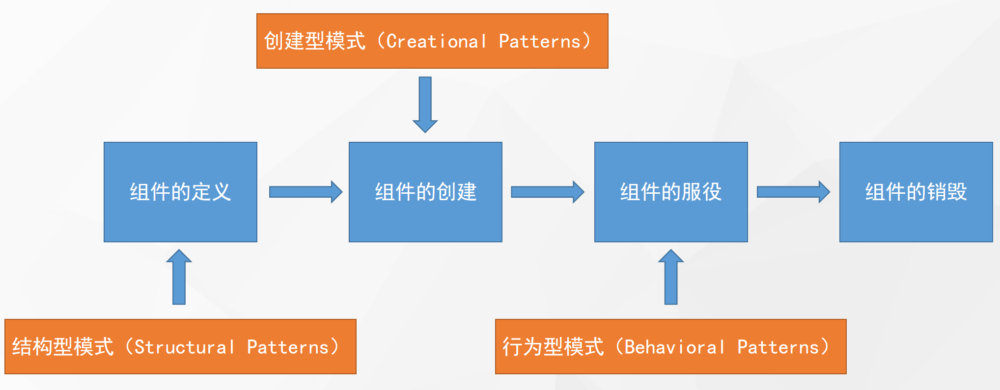

# 设计模式

- 创建型模式
- 结构型模式
- 行为型模式

**对接口编程而不是对实现编程。**

**优先使用对象组合而不是继承。**

## 组件的生命周期

## 设计的七大原则

### 开闭原则

- 软件实体应当**对扩展开放，对修改关闭**
- 合成复用原则、里氏替换原则相辅相成，都是开闭原则的具体实现规范

> 扩展新类而不是修改旧类

### 里氏替换原则

- 继承必须确保超类所拥有的性质在子类中仍然成立

> 继承父类而不去改变父类

### 依赖倒置原则

- 高层模块不应该依赖低层模块，两者都应该依赖其抽象；抽象不应该依赖细节，细节应该依赖抽象

> 面向接口编程，而不是面向实现类

### 单一职责原则

- 一个类应该有且仅有一个引起它变化的原因，否则类应该被拆分

> 每个类只负责自己的事情，而不是变成万能

### 接口隔离原则

- 一个类对另一个类的依赖应该建立在最小的接口上

> 各个类建立自己的专用接口，而不是建立万能接口

### 迪米特法则

- 最少知识原则
- 只与你的直接朋友交谈，不跟“陌生人”说话

> 无需直接交互的两个类，如果需要交互，使用中间者
>
> 过度使用迪米特法则会使系统产生大量的中介类，从而增加系统的复杂性，使模块之间的通信效率降低

### 合成复用原则

- 又叫组合/聚合复用原则
- 软件复用时，要尽量先使用组合或者聚合等关联关系来实现，其次才考虑使用继承关系来实现

> 优先组合，其次继承
