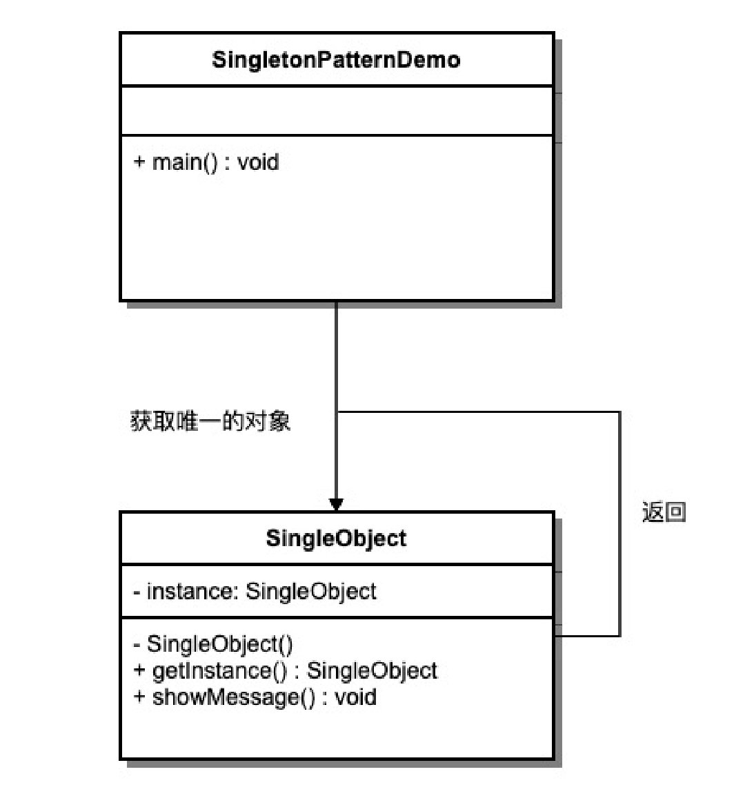
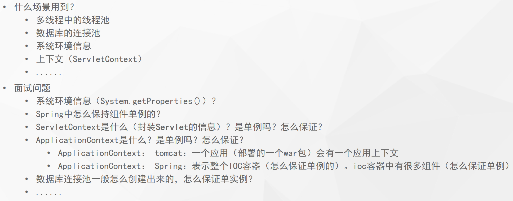
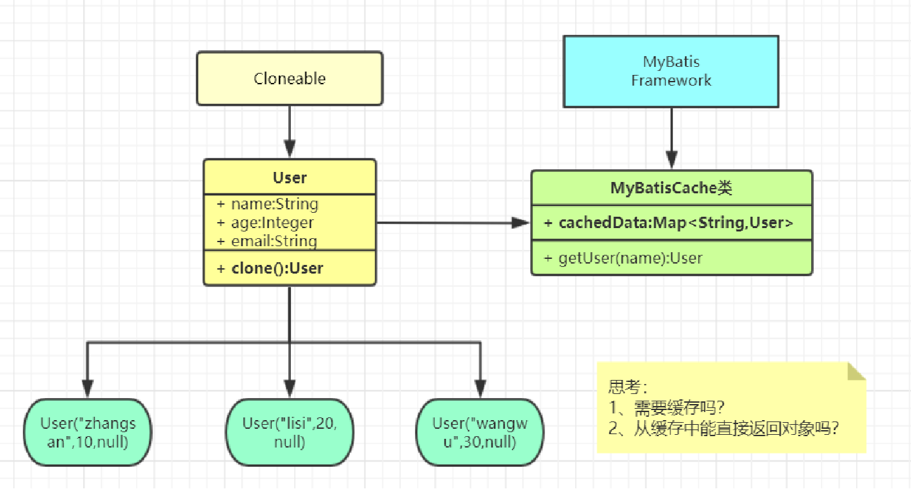
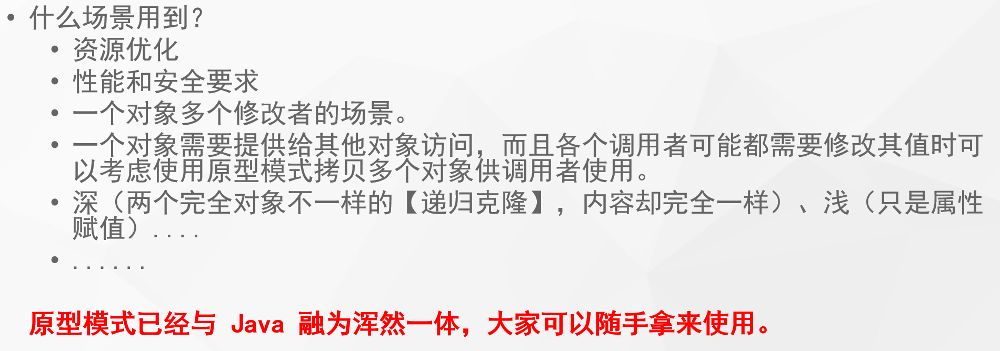

# 创建型模式（Creational Patterns）

## 1. 单例（Singleton）模式

一个单一的类，负责创建自己的对象，同时确保系统中只有单个对象被创建。

单例特点：

- 某个类只能有一个实例；（构造器私有）
- 它必须自行创建这个实例；（自己编写实例化逻辑）
- 它必须自行向整个系统提供这个实例；（对外提供实例化方法）

应用场景：

## 2. 原型（Prototype）模式

- **原型模式（Prototype Pattern）是用于创建重复的对象，同时又能保证性能。**
- 本体给外部提供一个克隆体进行使用

应用场景：

