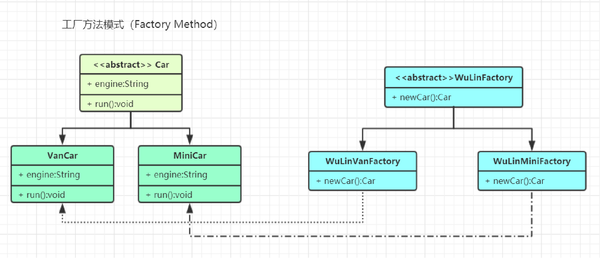
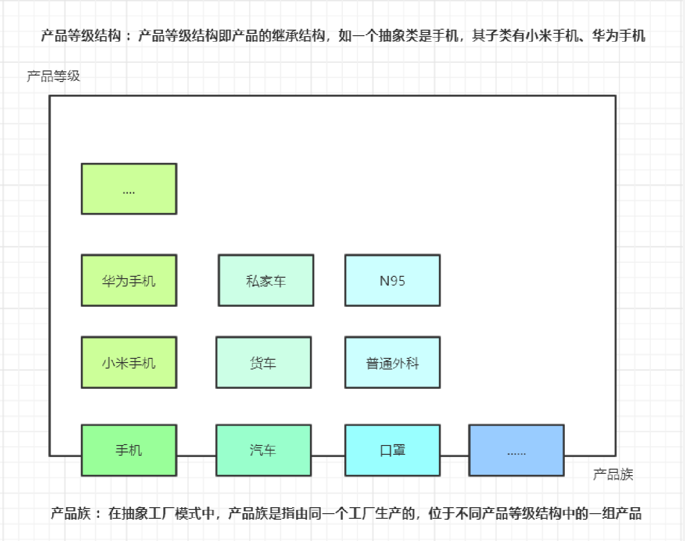
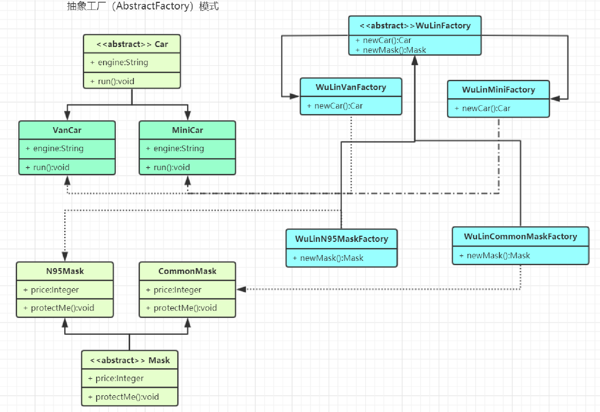
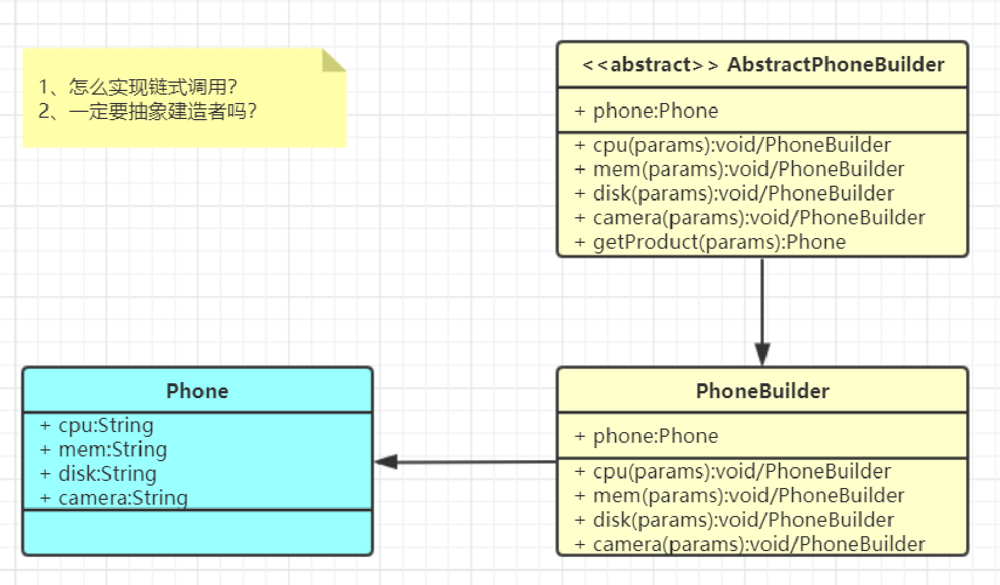

# 创建型模式（Creational Patterns）

- 创建型模式关注点“**怎样创建出对象？**”
- **“将对象的创建与使用分离”**。
- 降低系统的耦合度
- 使用者无需关注对象的创建细节
  - 对象的创建由相关的工厂来完成；（各种工厂模式）
  - 对象的创建由一个建造者来完成；（建造者模式）
  - 对象的创建由原来对象克隆完成；（原型模式）
  - 对象始终在系统中只有一个实例；（单例模式）

## 1. 单例（Singleton）模式

一个单一的类，负责创建自己的对象，同时确保系统中只有单个对象被创建。

单例特点：

- 某个类只能有一个实例；（构造器私有）
- 它必须自行创建这个实例；（自己编写实例化逻辑）
- 它必须自行向整个系统提供这个实例；（对外提供实例化方法）

应用场景：

## 2. 原型（Prototype）模式

- **原型模式（Prototype Pattern）是用于创建重复的对象，同时又能保证性能。**
- 本体给外部提供一个克隆体进行使用

应用场景：

## 3. 工厂（Factory）模式

- 工厂模式（Factory Pattern）提供了一种创建对象的最佳方式。我们不必关心对象的创建细节，只需要根据不同情况获取不同产品即可。难点：写好我们的工厂

### 3.1 工厂（Factory）模式-简单工厂(Simple Factory )

**三个角色**

Factory：工厂角色， WuLinFactory

Product：抽象产品角色，Car

ConcreteProduct：具体产品角色， VanCar、MiniCar

> **缺点：违背开闭，扩展不易**

### 3.2 工厂（Factory）模式-工厂方法(Factory Method)

**四个角色**

Product：抽象产品

ConcreteProduct：具体产品

Factory：抽象工厂

ConcreteFactory：具体工厂

> **缺点：系统复杂度增加，产品单一**

### 3.3 工厂（Factory）模式-抽象工厂(Abstract Factory)

**如何实现，人民需要什么，五菱就造什么**

**工厂模式的退化**

当抽象工厂模式中**每一个具体工厂类只创建一个产品对象**，也就是只存在一个产品等级结构时，**抽象工厂模式退化成工厂方法模式**；当工厂方法模式中抽象工厂与具体工厂合并，提供一个统一的工厂来创建产品对象，并将创建对象的工厂方法设计为静态方法时，**工厂方法模式退化成简单工厂模式**。

什么场景用到？

NumberFormat、SimpleDateFormat

LoggerFactory：

SqlSessionFactory：MyBatis

BeanFactory：Spring的BeanFactory（就是为了造出bean）......

## 4. 建造者（Builder）模式

产品角色（Product）：Phone

抽象建造者（Builder）：AbstracPhoneBuilder

具体建造者(Concrete Builder）：PhoneBuilder

创建的东西细节复杂，还必须暴露给使用者。**屏蔽过程而不屏蔽细节**
