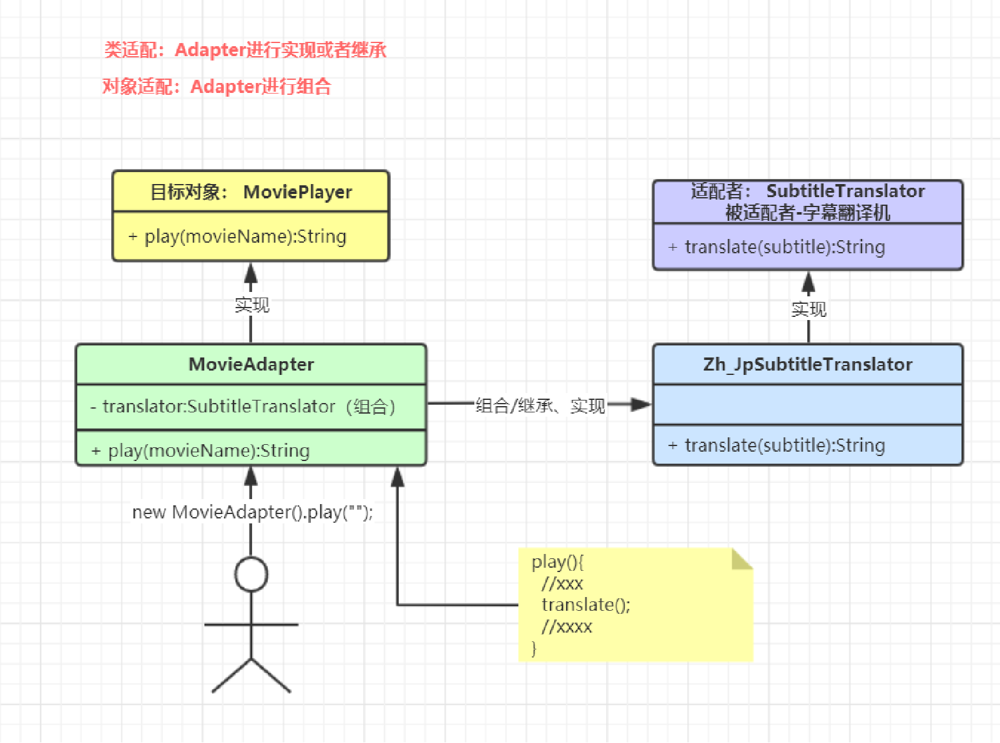
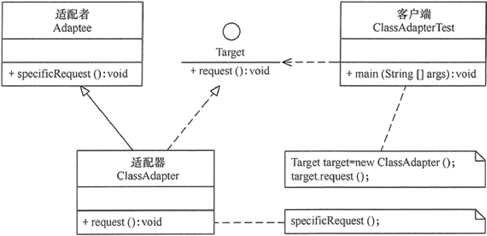
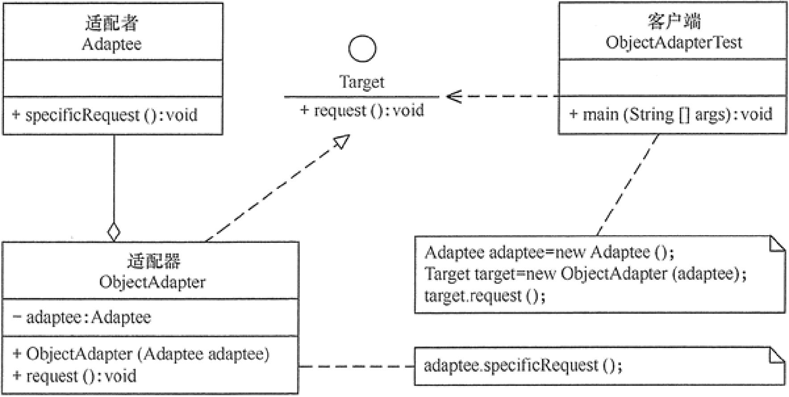
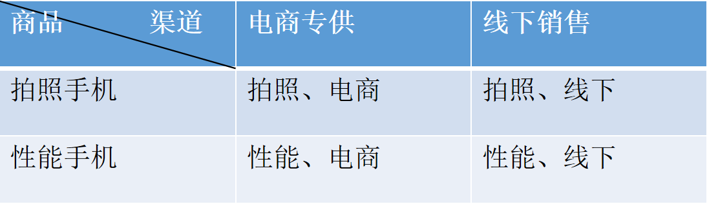
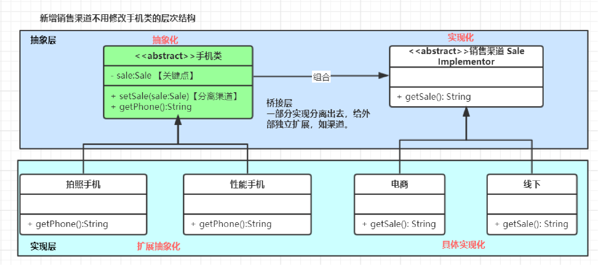
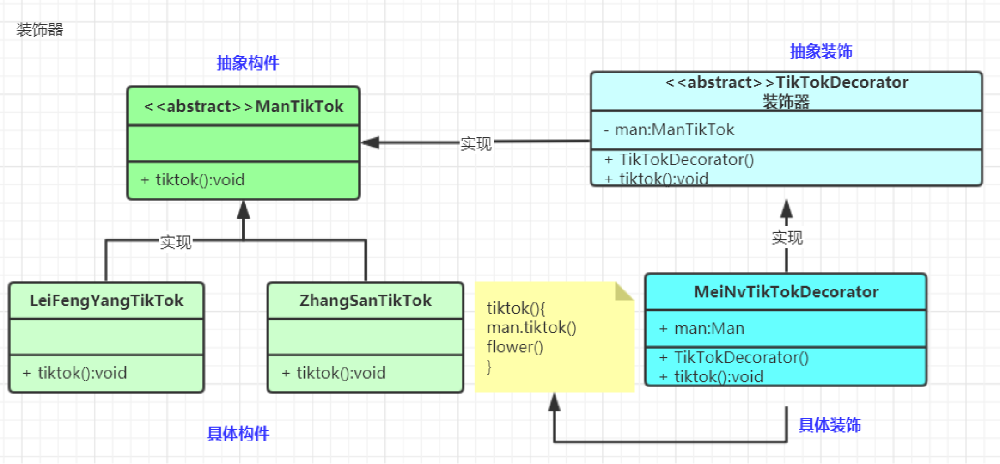
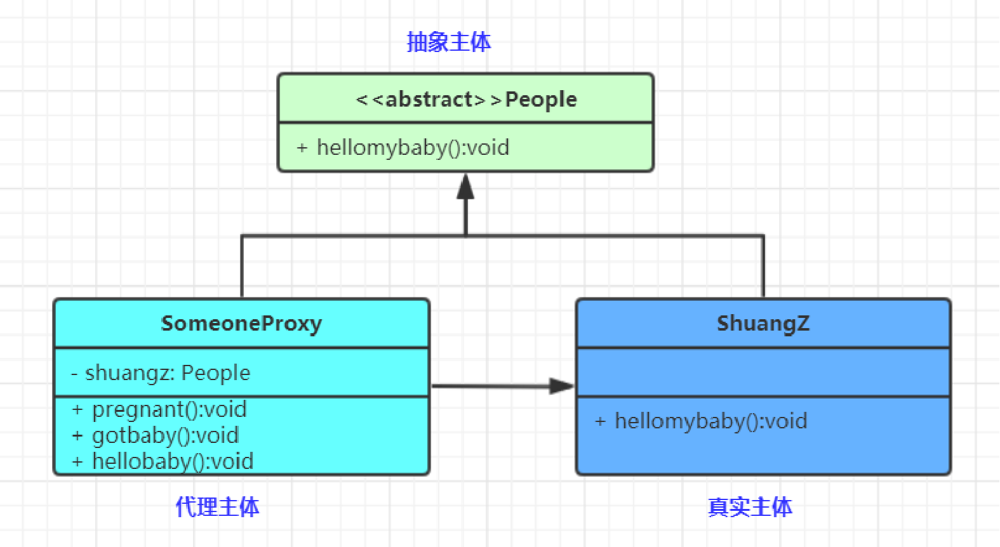

# 结构型模式（Structural Patterns）

- 结构型模式关注点“怎样组合对象/类？”所以我们关注下类的组合关系
- 类结构型模式关心类的组合，由多个类可以组合成一个更大的（继承）
- 对象结构型模式关心类与对象的组合，通过关联关系在一个类中定义另一个类的实例对象（组合）
- 根据“合成复用原则”，在系统中尽量使用关联关系来替代继承关系，因此大部分结构型模式都是对象结构型模式。
  - **适配器模式（Adapter Pattern）**：两个不兼容接口之间适配的桥梁
  - 桥接模式（Bridge Pattern）：相同功能抽象化与实现化解耦，抽象与实现可以独立升级。
  - 过滤器模式（Filter、Criteria Pattern）：使用不同的标准来过滤一组对象
  - **组合模式（Composite Pattern）**：相似对象进行组合，形成树形结构
  - **装饰器模式（Decorator Pattern）**：向一个现有的对象添加新的功能，同时又不改变其结构
  - **外观模式（Facade Pattern）**：向现有的系统添加一个接口，客户端访问此接口来隐藏系统的复杂性。
  - 享元模式（Flyweight Pattern）：尝试重用现有的同类对象，如果未找到匹配的对象，则创建新对象
  - **代理模式（Proxy Pattern）**：一个类代表另一个类的功能

## 1. 适配器模式（Adapter Pattern）

- 将**一个接口转换成客户希望的另一个接口**，适配器模式使接口不兼容的那些类可以一起工作，适配器模式分为类结构型模式（继承）和对象结构型模式（组合）两种，前者（继承）类之间的耦合度比后者高，且要求程序员了解现有组件库中的相关组件的内部结构，所以应用相对较少些。
- 别名也可以是Wrapper，包装器

适配器模式（Adapter）包含以下主要角色。
目标（Target）接口：可以是抽象类或接口。客户希望直接用的接口
适配者（Adaptee）类：隐藏的转换接口
适配器（Adapter）类：它是一个转换器，通过继承或引用适配者的对象，把适配者接口转换成目标接口。

类结构型：

对象结构型：

**什么场景用到？**

- Tomcat如何将Request流转为标准Request；
  - tomcat.Request接口
  - servlet.Request接口
  - tomcat ===  CoyoteAdapte === ServletRequest
- Spring AOP中的AdvisorAdapter是什么：增强的适配器
  - 前置、后置、返回、结束  Advisor（通知方法）
  - 底层真的目标方法
- Spring MVC中经典的HandlerAdapter是什么；
  - HelloController.hello()
  - HandlerAdapter
  - Servlet.doGet()
- SpringBoot 中 WebMvcConfigurerAdapter为什么存在又取消
  ......

## 2. 桥接模式（Bridge Pattern）

- **将抽象与实现解耦，使两者都可以独立变化**
- 在现实生活中，某些类具有两个或多个维度的变化，如图形既可按形状分，又可按颜色分。如何设计类似于 Photoshop 这样的软件，能画不同形状和不同颜色的图形呢？如果用继承方式，m 种形状和 n 种颜色的图形就有 m×n 种，不但对应的子类很多，而且扩展困难。不同颜色和字体的文字、不同品牌和功率的汽车
- **桥接将继承转为关联，降低类之间的耦合度，减少代码量**

桥接（Bridge）模式包含以下主要角色：

- 系统设计期间，如果这个类里面的一些东西，会扩展很多，这个东西就应该分离出来
- 抽象化（Abstraction）角色：定义抽象类，并包含一个对实现化对象的引用。
- 扩展抽象化（Refined Abstraction）角色：是抽象化角色的子类，实现父类中的业务方法，并通过组合关系调用实现化角色中的业务方法。
- 实现化（Implementor）角色：定义实现化角色的接口，供扩展抽象化角色调用。

什么场景用到？

- 当一个类存在两个独立变化的维度，且这两个维度都需要进行扩展时。
- 当一个系统不希望使用继承或因为多层次继承导致系统类的个数急剧增加时。
- 当一个系统需要在构件的抽象化角色和具体化角色之间增加更多的灵活性时。
- InputStreamReader桥接模式。An InputStreamReader is a bridge from byte streams to character streams:
- InputStreamReader 桥接+适配器

## 3. 装饰器模式（Decorator/Wrapper（包装） Pattern）

- **适配器是连接两个类，可以增强一个类，装饰器是增强一个类**
- 向一个现有的对象添加新的功能，同时又不改变其结构。属于对象结构型模式。
- 创建了一个装饰类，用来包装原有的类，并在保持类方法签名完整性的前提下，提供了额外的功能。

抽象构件（Component）角色：
		定义一个抽象接口以规范准备接收附加责任的对象。
具体构件（ConcreteComponent）角色：
		实现抽象构件，通过装饰角色为其添加一些职责。
抽象装饰（Decorator）角色：
		继承抽象构件，并包含具体构件的实例，可以通过其子类扩展具体构件的功能。
具体装饰（ConcreteDecorator）角色：
		实现抽象装饰的相关方法，并给具体构件对象添加附加的责任。

什么场景使用？

- 无处不在.....
- SpringSession中如何进行session与redis关联？HttpRequestWrapper
  - session：数据存在了内存
  - session：数据存在redis
  - HttpSession；getAttribute();
  - Wrapper(session){
    - getAttribute(String param){    redis.get(param) };
  - }
- MyBatisPlus提取了QueryWrapper，这是什么？
- Spring中的BeanWrapper是做什么？包装了Bean。bean的功能增强？
- Spring Webflux中的 WebHandlerDecorator？
- 已存的类，每一天在某个功能使用的时候发现不够，就可以装饰器。
- ......

## 4. 代理模式（Proxy Pattern）

代理模式(Proxy Pattern) ,给某一个对象提供一个代理，并由代理对象控制对原对象的引用,对象结构型模式。这种也是静态代理

代理模式包含如下角色：

Subject: 抽象主体角色(抽象类或接口)

Proxy: 代理主体角色(代理对象类)

RealSubject: 真实主体角色(被代理对象类)
