# 行为型模式（Behavioral Patterns）

- 行为型模式关注点“**怎样运行对象/类？**”所以我们关注下类/对象的运行时流程控制
- 行为型模式用于描述程序在运行时复杂的流程控制，
- 描述多个类或对象之间怎样相互协作共同完成单个对象都无法单独完成的任务，它涉及算法与对象间职责的分配。
- 行为型模式分为**类行为模式和对象行为模式**，前者采用继承机制来在类间分派行为，后者采用组合或聚合在对象间分配行为。由于组合关系或聚合关系比继承关系耦合度低，满足“**合成复用原则**”，所以对象行为模式比类行为模式具有更大的灵活性。

- **模板方法（Template Method）模式：父类定义算法骨架，某些实现放在子类**
- **策略（Strategy）模式：每种算法独立封装，根据不同情况使用不同算法策略**
- **状态（State）模式：每种状态独立封装，不同状态内部封装了不同行为**
- 命令（Command）模式：将一个请求封装为一个对象，使发出请求的责任和执行请求的责任分割开
- **职责链（Chain of Responsibility）模式：所有处理者封装为链式结构，依次调用**
- 备忘录（Memento）模式：把核心信息抽取出来，可以进行保存
- 解释器（Interpreter）模式：定义语法解析规则
- **观察者（Observer）模式：维护多个观察者依赖，状态变化通知所有观察者**
- 中介者（Mediator）模式：取消类/对象的直接调用关系，使用中介者维护
- 迭代器（Iterator）模式：定义集合数据的遍历规则
- 访问者（Visitor）模式：分离对象结构，与元素的执行算法

**除了模板方法模式和解释器模式是类行为型模式，其他的全部属于对象行为型模式**

## 1. 模板方法（Template Method）

- 在模板模式（Template Pattern）中，一个抽象类公开定义了执行它的方法的方式模板。它的子类可以按需要重写方法实现，但调用将以抽象类中定义的方式进行。

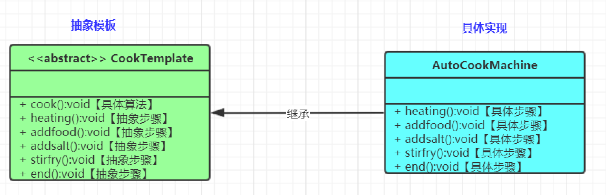

模板方法（Template Method）包含两个角色

抽象类/抽象模板（Abstract Class）

具体子类/具体实现（Concrete Class）

**什么场景用到？**

- Spring的整个继承体系都基本用到模板方法;
  - BeanFactory.getBean(1,2,3,4)--A1---A2---A3---A4（全部被完成）
- JdbcTemplate、RedisTemplate都允许我们再扩展.....
- 我们自己的系统也应该使用模板方法组织类结构
- ......

## 2. 策略（Strategy）模式

策略（Strategy）模式定义了一系列算法，并将每个算法封装起来，使它们可以相互替换，且算法的变化不会影响使用算法的客户。属于对象行为模式

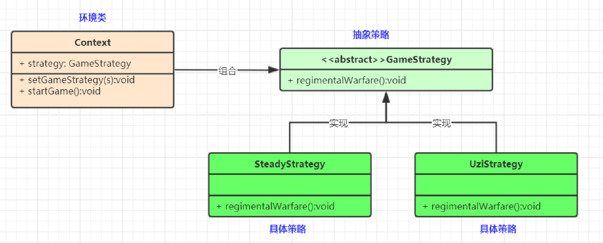

策略模式的主要角色如下。
抽象策略（Strategy）类：公共接口，各种不同的算法以不同的方式实现这个接口，环境角色使用这个接口调用不同的算法，一般使用接口或抽象类实现。
具体策略（Concrete Strategy）类：实现了抽象策略定义的接口，提供具体的算法实现。
环境（Context）类：持有一个策略类的引用，最终给客户端调用。

**什么场景用到？**

- 使用策略模式可以避免使用多重条件语句，如 if...else 语句、switch...case 语句
- 什么是Spring的 InstantiationStrategy
- 线程池拒绝策略
- ......

## 3. 状态（State）模式

状态（State）模式：对有状态的对象，把复杂的“判断逻辑”提取到不同的状态对象中，允许状态对象在其内部状态发生改变时改变其行为

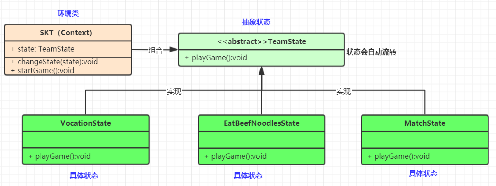

状态模式包含以下主要角色。
环境类（Context）角色：也称为上下文，它定义了客户端需要的接口，内部维护一个当前状态，并负责具体状态的切换。
抽象状态（State）角色：定义一个接口，用以封装环境对象中的特定状态所对应的行为，可以有一个或多个行为。
具体状态（Concrete State）角色：实现抽象状态所对应的行为，并且在需要的情况下进行状态切换。

 

**什么场景使用？**

- 策略模式和状态模式是一样的？
- 状态模式核心需要具体状态类能在必要的时候切换状态
- 流程框架与状态机
- ......

## 4. 中介者（Mediator）模式

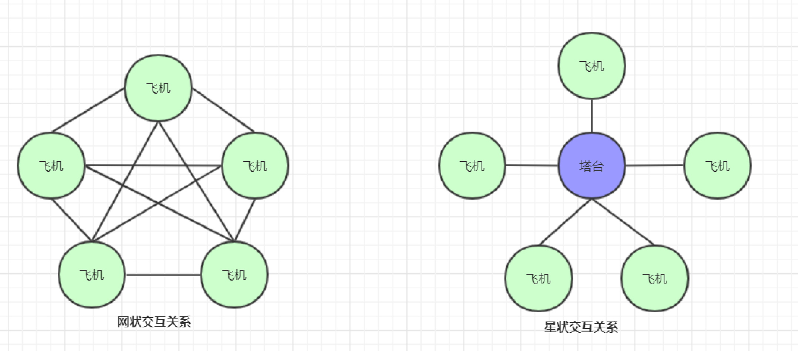

中介者模式(Mediator Pattern)：用一个中介对象来封装一系列的对象交互，中介者使各对象不需要显式地相互引用，减少对象间混乱的依赖关系，从而使其耦合松散，而且可以独立地改变它们之间的交互。对象行为型模式。

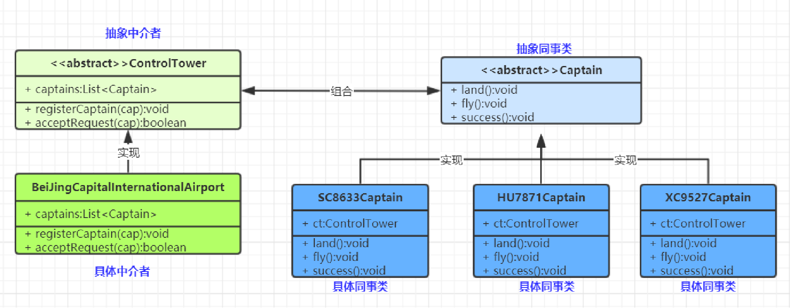

Mediator: 抽象中介者
ConcreteMediator: 具体中介者
Colleague: 抽象同事类
ConcreteColleague: 具体同事类

**什么场景用到？**

- SpringMVC 的 DispatcherServlet是一个中介者，他会提取Controller、Model、View来进行调用。而无需controller直接调用view之类的渲染方法
- 分布式系统中的网关
- 迪米特法则的一个典型应用
- 中介者和外观（门面）模式区别？
  - 中介者双向操作，门面偏向于封装某一方

- .......

## 5. 观察者（Observer）模式

观察者模式(Observer Pattern)：定义对象间的一种一对多依赖关系，使得每当一个对象状态发生改变时，其相关依赖对象皆得到通知并被自动更新。观察者模式又叫做发布-订阅（Publish/Subscribe）模式、模型-视图（Model/View）模式、源-监听器（Source/Listener）模式或从属者（Dependents）模式。对象行为型模式

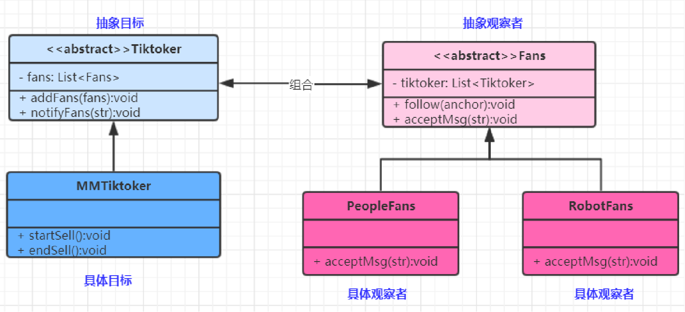

Subject: 目标

ConcreteSubject: 具体目标

Observer: 观察者

ConcreteObserver: 具体观察者

**什么场景使用？**

- Spring事件机制如何实现？
- Vue的双向绑定
- 核心响应式编程核心思想
- ......

## 6. 备忘录（Memento）模式

备忘录（Memento）模式：在不破坏封装性的前提下，捕获一个对象的内部状态，并在该对象之外保存这个状态，以便以后当需要时能将该对象恢复到原先保存的状态。该模式又叫快照模式。对象行为型模式

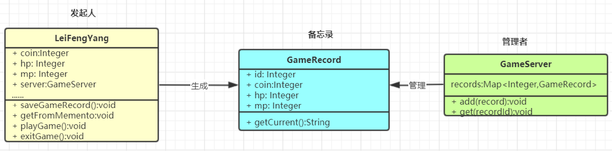

发起人（Originator）角色：记录当前时刻的内部状态信息，提供创建备忘录和恢复备忘录数据的功能，实现其他业务功能，它可以访问备忘录里的所有信息。
备忘录（Memento）角色：负责存储发起人的内部状态，在需要的时候提供这些内部状态给发起人。
管理者（Caretaker）角色：对备忘录进行管理，提供保存与获取备忘录的功能，但其不能对备忘录的内容进行访问与修改。

**什么场景用到？**

- 游戏存档
- 数据库保存点事务（savepoint）
- session活化钝化
- ......

## 7. 解释器（Interpreter）模式

解释器（Interpreter）模式：给分析对象定义一个语言，并定义该语言的文法表示，再设计一个解析器来解释语言中的句子。也就是说，用编译语言的方式来分析应用中的实例。这种模式实现了文法表达式处理的接口，该接口解释一个特定的上下文。类行为型模式

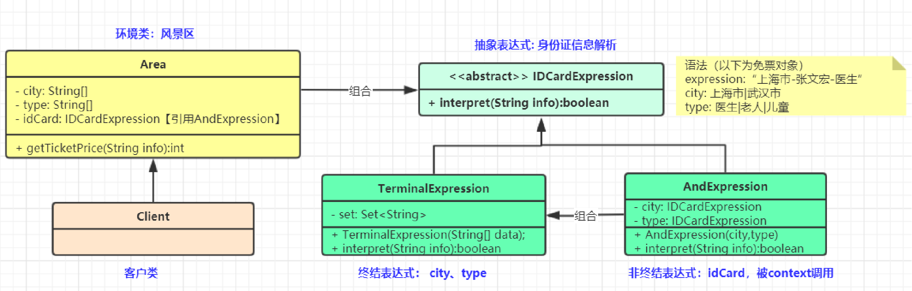

- 抽象表达式（Abstract Expression）角色：
  定义解释器的接口，约定解释器的解释操作，主要包含解释方法 interpret()。
- 终结符表达式（Terminal Expression）角色：
  是抽象表达式的子类，用来实现文法中与终结符相关的操作，文法中的每一个终结符都有一个具体终结表达式与之相对应。
- 非终结符表达式（Nonterminal Expression）角色：
  也是抽象表达式的子类，用来实现文法中与非终结符相关的操作，文法中的每条规则都对应于一个非终结符表达式。
- 环境（Context）角色：
  通常包含各个解释器需要的数据或是公共的功能，一般用来传递被所有解释器共享的数据，后面的解释器可以从这里获取这些值。
- 客户端（Client）：
  主要任务是将需要分析的句子或表达式转换成使用解释器对象描述的抽象语法树，然后调用解释器的解释方法，当然也可以通过环境角色间接访问解释器的解释方法。

**什么场景用到？**

- Spring的表达式解析：#{}
- Thymeleaf等模板引擎的语法解析
- 编译原理
- ......

## 8. 命令（Command）模式

命令（Command）模式：将一个请求封装为一个对象，使发出请求的责任和执行请求的责任分割开。这样两者之间通过命令对象进行沟通，这样方便将命令对象进行储存、传递、调用、增加与管理。

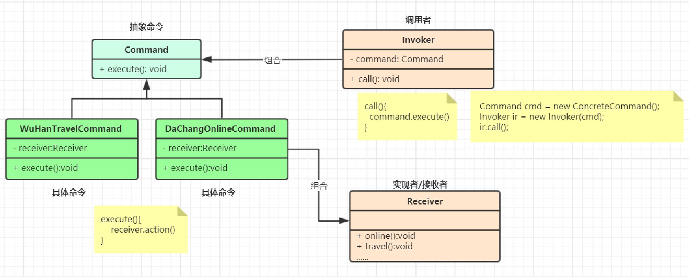

- 抽象命令类（Command）角色：
  声明执行命令的接口，拥有执行命令的抽象方法 execute()。
- 具体命令类（Concrete Command）角色：
  是抽象命令类的具体实现类，它拥有接收者对象，并通过调用接收者的功能来完成命令要执行的操作。
- 实现者/接收者（Receiver）角色：
  执行命令功能的相关操作，是具体命令对象业务的真正实现者。
- 调用者/请求者（Invoker）角色：
  是请求的发送者，它通常拥有很多的命令对象，并通过访问命令对象来执行相关请求，它不直接访问接收者。

**什么场景用到？**

- mvc就是典型的命令模式
- 当系统需要执行一组操作时，命令模式可以定义宏命令（一个命令组合了多个命令）来实现该功能。
- 结合备忘录模式还可以实现命令的撤销和恢复
- ......

## 9. 迭代器（Iterator）模式

迭代器（Iterator）模式：提供一个对象(迭代器)来顺序访问聚合对象(迭代数据)中的一系列数据，而不暴露聚合对象的内部表示。对象行为型模式

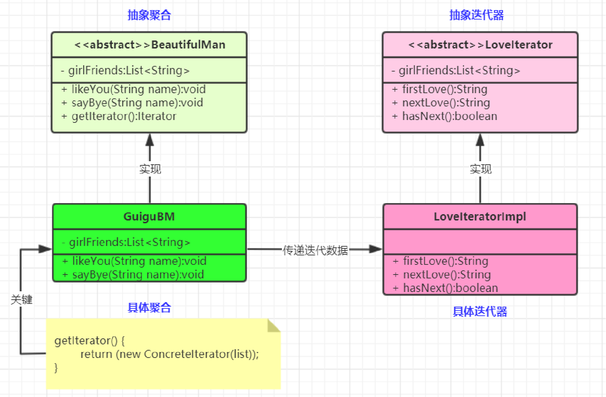

- 抽象聚合（Aggregate）角色：
  定义存储、添加、删除聚合对象以及创建迭代器对象的接口。
- 具体聚合（ConcreteAggregate）角色：
  实现抽象聚合类，返回一个具体迭代器的实例。
- 抽象迭代器（Iterator）角色：
  定义访问和遍历聚合元素的接口，通常包含 hasNext()、first()、next() 等方法。
- 具体迭代器（Concretelterator）角色：
  实现抽象迭代器接口中所定义的方法，完成对聚合对象的遍历，记录遍历的当前位置。

**什么场景用到？**

- jdk容器接口的Iterator定义
- 现实开发中，我们几乎无需编写迭代器，基本数据结构链表、树、图的迭代器已经都有了。除非要重写迭代逻辑
- ......

## 10. 访问者（Visitor）模式

访问者（Visitor）模式：将作用于某种数据结构中的各元素的操作分离出来封装成独立的类，使其在不改变数据结构的前提下可以添加作用于这些元素的新的操作，为数据结构中的每个元素提供多种访问方式。它将对数据的操作与数据结构进行分离，是行为类模式中最复杂的一种模式。

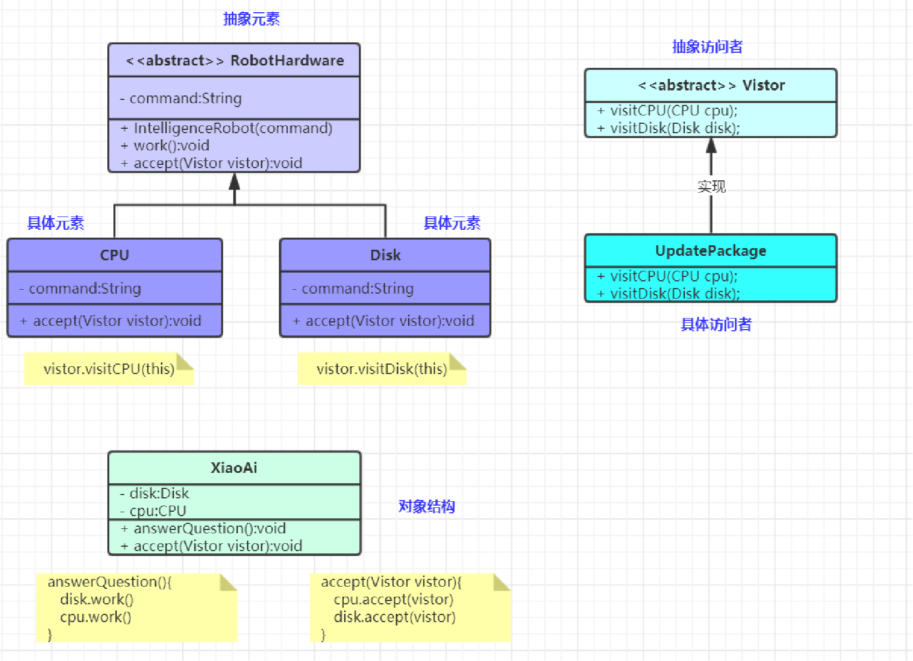

- 抽象访问者（Visitor）角色：
  定义一个访问具体元素的接口，为每个具体元素类对应一个访问操作 visit() ，该操作中的参数类型标识了被访问的具体元素。
- 具体访问者（ConcreteVisitor）角色：
  实现抽象访问者角色中声明的各个访问操作，确定访问者访问一个元素时该做什么。
  抽象元素（Element）角色：
  声明一个包含接受操作 accept() 的接口，被接受的访问者对象作为 accept() 方法的参数。
- 具体元素（ConcreteElement）角色：
  实现抽象元素角色提供的 accept() 操作，其方法体通常都是 visitor.visit(this) ，另外具体元素中可能还包含本身业务逻辑的相关操作。
- 对象结构（Object Structure）角色：
  是一个包含元素角色的容器，提供让访问者对象遍历容器中的所有元素的方法，通常由 List、Set、Map 等聚合类实现。

**什么场景用到？**

- 在访问者模式中，每增加一个新的元素类，都要在每一个具体访问者类中增加相应的具体操作，这违背了“开闭原则”。
- 违反依赖倒置原则。访问者模式依赖了具体类，而没有依赖抽象类
- 破坏封装。访问者模式中具体元素对访问者公布细节，这破坏了对象的封装性
- 应用于对象结构相对稳定，但其操作算法经常变化的程序。
- Spring反射工具中的MethodVisitor是什么？
- ......

## 11. 职责链（Chain of Responsibility）模式

责任链（Chain of Responsibility）模式：为了避免请求发送者与多个请求处理者耦合在一起，于是将所有请求的处理者通过前一对象记住其下一个对象的引用而连成一条链；当有请求发生时，可将请求沿着这条链传递，直到有对象处理它为止。属于对象行为型模式

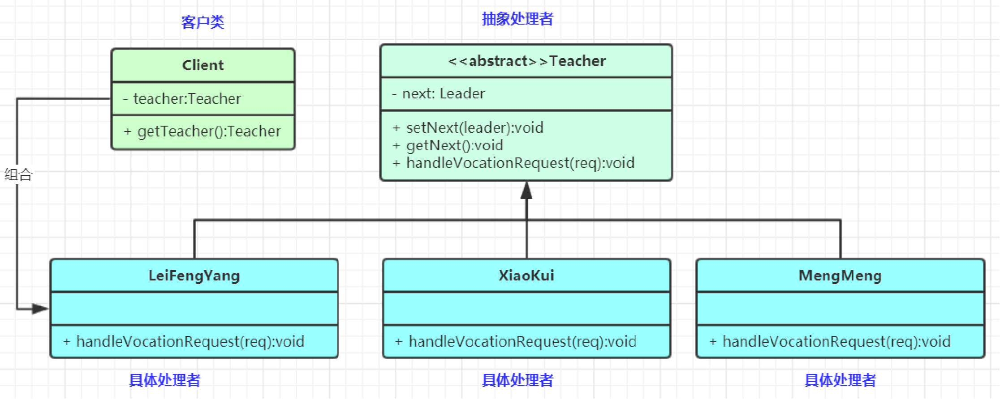

- 抽象处理者（Handler）角色：
  定义一个处理请求的接口，包含抽象处理方法和一个后继连接。
- 具体处理者（Concrete Handler）角色：
  实现抽象处理者的处理方法，判断能否处理本次请求，如果可以处理请求则处理，否则将该请求转给它的后继者。
- 客户类（Client）角色：
  创建处理链，并向链头的具体处理者对象提交请求，它不关心处理细节和请求的传递过程。

**什么场景用到？**

- Tomcat的Pipeline、Valve

- Filter链

- Aop责任链

- ......
