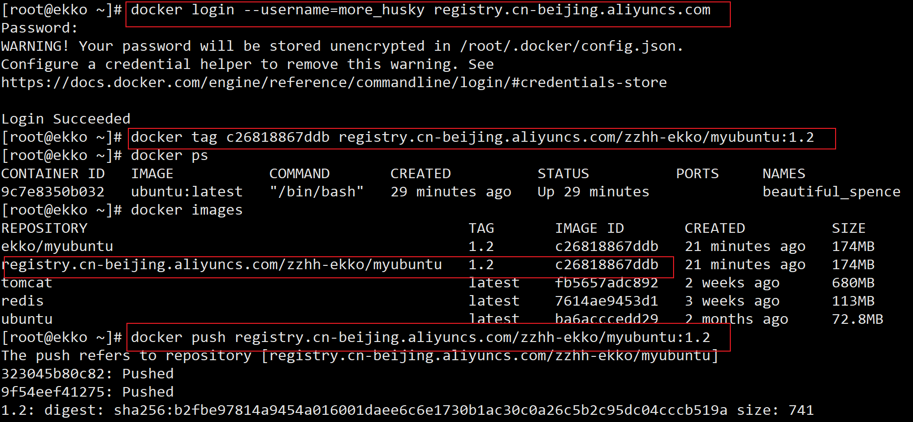
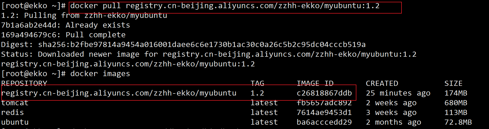

# 本地镜像发布到阿里云

## 本地镜像发布到阿里云流程


## 镜像的生成方法

```sh
#基于当前容器创建一个新的镜像，新功能增强
docker commit [OPTIONS] 容器ID [REPOSITORY[:TAG]]
```

后面的DockerFile章节，第2种方法

## 将本地镜像推送到阿里云

```sh
$ docker login --username=more_husky registry.cn-beijing.aliyuncs.com
$ docker tag [ImageId] registry.cn-beijing.aliyuncs.com/zzhh-ekko/myubuntu:[镜像版本号]
$ docker push registry.cn-beijing.aliyuncs.com/zzhh-ekko/myubuntu:[镜像版本号]
```



## 将阿里云上的镜像下载到本地

```sh
$ docker pull registry.cn-beijing.aliyuncs.com/zzhh-ekko/myubuntu:[镜像版本号]
```




