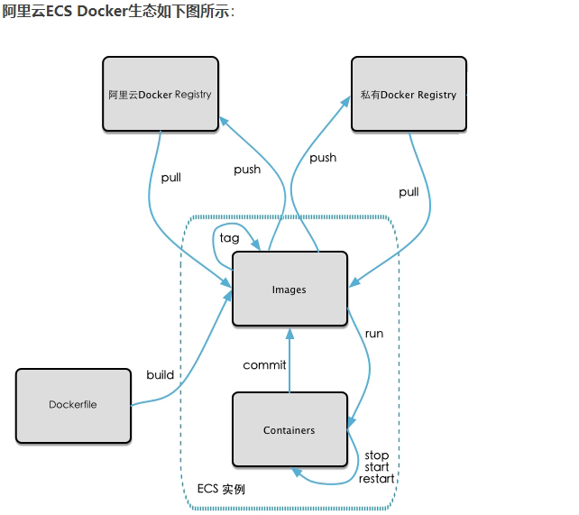
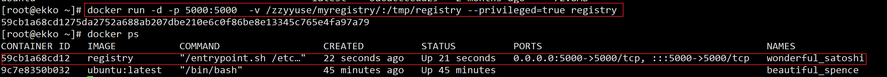
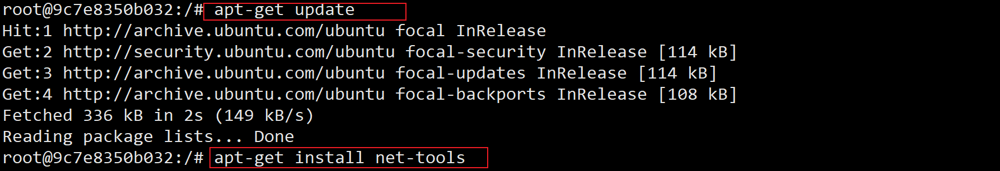
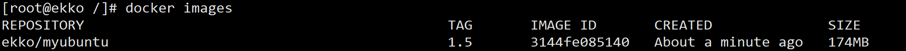
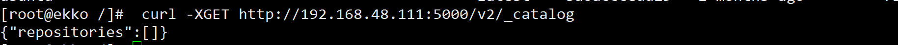
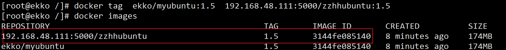
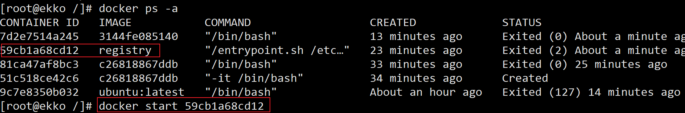
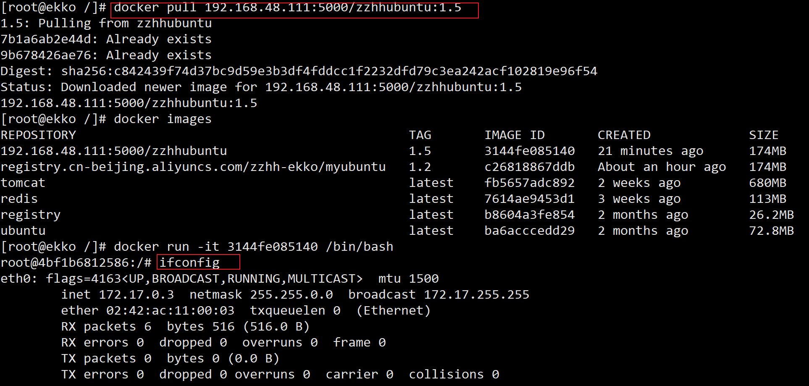

# 本地镜像发布到私有库

## 本地镜像发布到私有库流程



## 是什么

1 官方Docker Hub地址：https://hub.docker.com/，中国大陆访问太慢了且准备被阿里云取代的趋势，不太主流。

2 Dockerhub、阿里云这样的公共镜像仓库可能不太方便，涉及机密的公司不可能提供镜像给公网，所以需要创建一个本地私人仓库供给团队使用，基于公司内部项目构建镜像。

Docker Registry是官方提供的工具，可以用于构建私有镜像仓库

## 将本地镜像推送到私有库

1. 下载镜像Docker Registry

   ```sh
   docker pull registry 
   ```

2. 运行私有库Registry，相当于本地有个私有Docker hub

   ```sh
   docker run -d -p 5000:5000  -v /zzyyuse/myregistry/:/tmp/registry --privileged=true registry
   # 默认情况，仓库被创建在容器的/var/lib/registry目录下，建议自行用容器卷映射，方便于宿主机联调
   ```

   

3. 案例演示创建一个新镜像，ubuntu安装ifconfig命令

   ```sh
   #docker容器内执行上述两条命令：
   apt-get update
   apt-get install net-tools
   ```

   

   ```sh
   #安装完成后，commit我们自己的新镜像
   docker commit -m="提交的描述信息" -a="作者" 容器ID 要创建的目标镜像名:[标签名]
   docker commit -m="ifconfig add ok" -a="zzhh" 9c7e8350b032 ekko/myubuntu:1.5
   ```

   

4. curl验证私服库上有什么镜像

   ```
   curl -XGET http://192.168.48.111:5000/v2/_catalog
   ```

   

5. 将新镜像myubuntu:1.5修改符合私服规范的Tag

   ```sh
   #按照公式： docker   tag   镜像:Tag   Host:Port/Repository:Tag
   #自己host主机IP地址，填写同学你们自己的，不要粘贴错误，O(∩_∩)O
    
   docker tag  ekko/myubuntu:1.5  192.168.48.111:5000/zzhhubuntu:1.5
   ```

   

6. 修改配置文件使之支持http

   ```sh
   #vim命令如下内容：
   vim /etc/docker/daemon.json
   
   {
     "registry-mirrors": ["https://6zp4yz40.mirror.aliyuncs.com"],
     "insecure-registries": ["192.168.48.111:5000"]
   }
   
   systemctl restart docker
   ```

   > 上述理由：docker默认不允许http方式推送镜像，通过配置选项来取消这个限制。====> 修改完后如果不生效，建议重启docker

   

7. push推送到私服库

   ```sh
   docker push 192.168.48.111:5000/zzhhubuntu:1.5
   ```

8. curl验证私服库上有什么镜像2

   ```sh
   curl -XGET http://192.168.48.111:5000/v2/_catalog
   ```

   

9. pull到本地并运行

   ```sh
   docker pull 192.168.48.111:5000/zzhhubuntu:1.5
   ```

   


