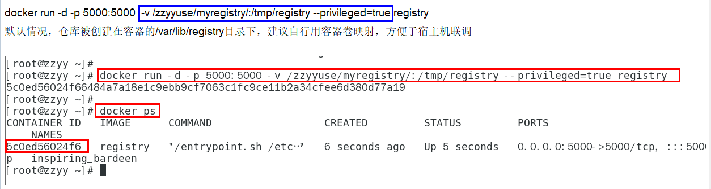
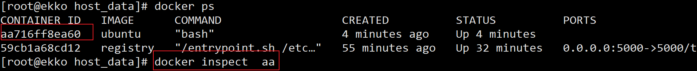
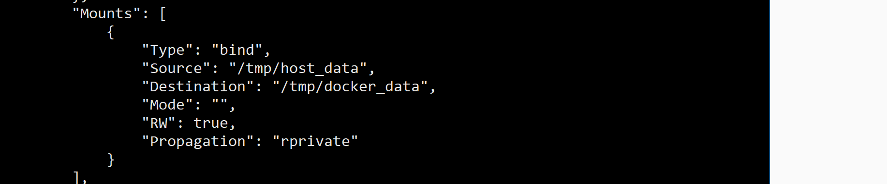
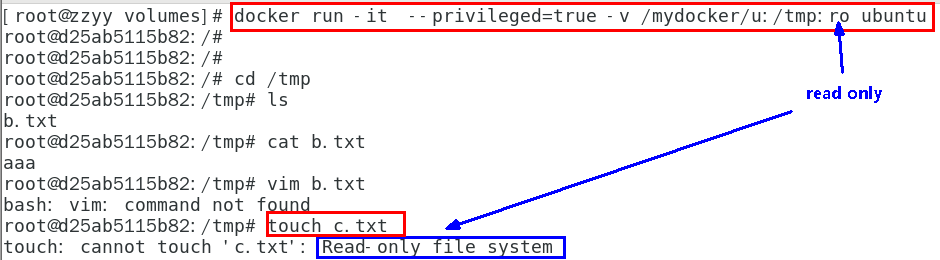
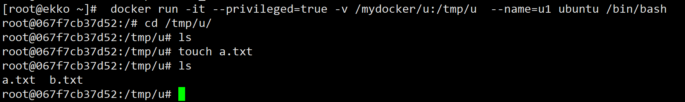
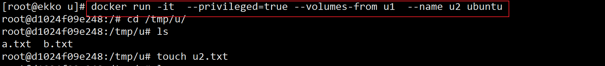

# Docker容器数据卷

## 1. 坑：容器卷记得加入

```sh
--privileged=true
```

Docker挂载主机目录访问**如果出现cannot open directory .: Permission denied**
解决办法：在挂载目录后多加一个`--privileged=true`参数即可

如果是CentOS7安全模块会比之前系统版本加强，不安全的会先禁止，所以目录挂载的情况被默认为不安全的行为，在SELinux里面挂载目录被禁止掉了额，如果要开启，我们一般使用`--privileged=true`命令，扩大容器的权限解决挂载目录没有权限的问题，也即使用该参数，container内的root拥有真正的root权限，否则，container内的root只是外部的一个普通用户权限。 

## 2. 回顾下上一讲的知识点，参数V



## 3. 是什么

一句话：有点类似我们Redis里面的rdb和aof文件

将docker容器内的数据保存进宿主机的磁盘中

运行一个带有容器卷存储功能的容器实例

```sh
 docker run -it --privileged=true -v /宿主机绝对路径目录:/容器内目录      镜像名
```

## 4. 能干嘛

将运用与运行的环境打包镜像，run后形成容器实例运行 ，但是我们对数据的要求希望是**持久化的**

Docker容器产生的数据，如果不备份，那么当容器实例删除后，容器内的数据自然也就没有了。
为了能保存数据在docker中我们使用卷。

特点：
1：数据卷可在容器之间共享或重用数据
2：卷中的更改可以直接实时生效，爽
3：数据卷中的更改不会包含在镜像的更新中
4：数据卷的生命周期一直持续到没有容器使用它为止

## 5. 数据卷案例

### 5.1 宿主vs容器之间映射添加容器卷

```sh
 docker run -it --privileged=true -v /tmp/host_data:/tmp/docker_data  --name=u1 ubuntu
```

```sh
#查看数据卷是否挂载成功
docker inspect 容器ID
```





1. docker修改，主机同步获得 
2. 主机修改，docker同步获得
3. docker容器stop，主机修改，docker容器重启数据成功同步。

### 5.2 读写规则映射添加说明

#### 5.2.1 读写(默认)

```sh
 docker run -it --privileged=true -v /宿主机绝对路径目录:/容器内目录:rw      镜像名
```

默认同上案例，默认就是rw

#### 5.2.2 只读

容器实例内部被限制，只能读取不能写

```sh
 docker run -it --privileged=true -v /宿主机绝对路径目录:/容器内目录:ro      镜像名
```



 /容器目录:ro 镜像名               就能完成功能，此时容器自己只能读取不能写  

ro = read only

此时如果宿主机写入内容，可以同步给容器内，容器可以读取到。

### 5.3 卷的继承和共享

#### 5.3.1 容器1完成和宿主机的映射



#### 5.3.2 容器2继承容器1的卷规则

```sh
docker run -it  --privileged=true --volumes-from 父类  --name u2 ubuntu
```




