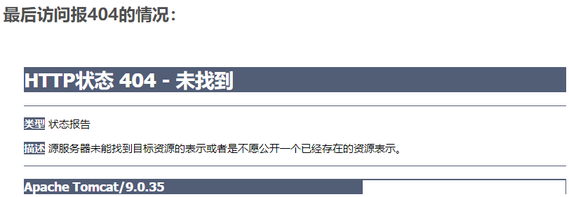
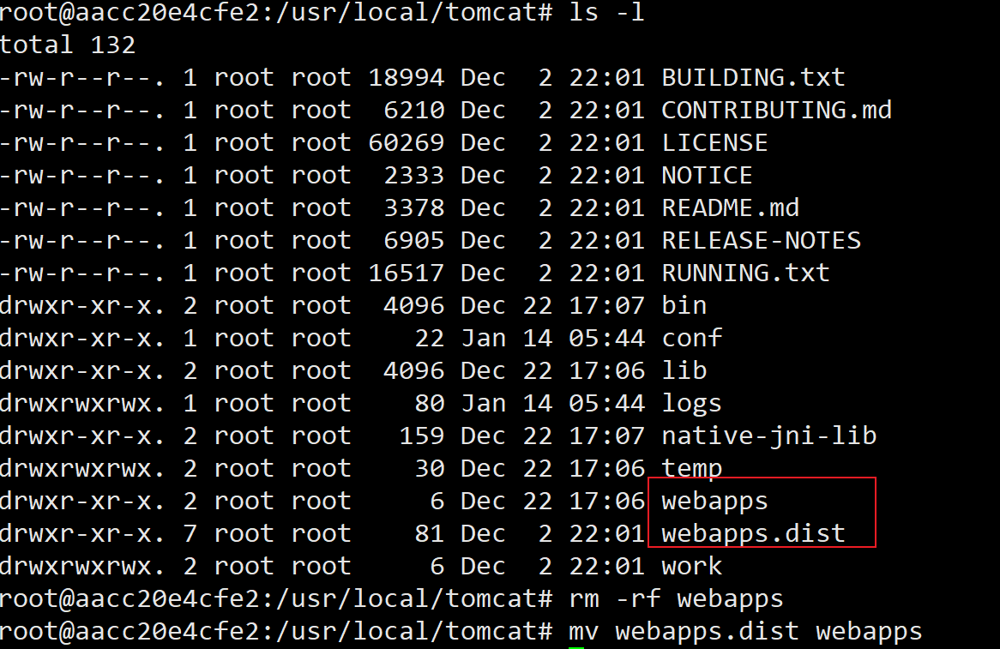
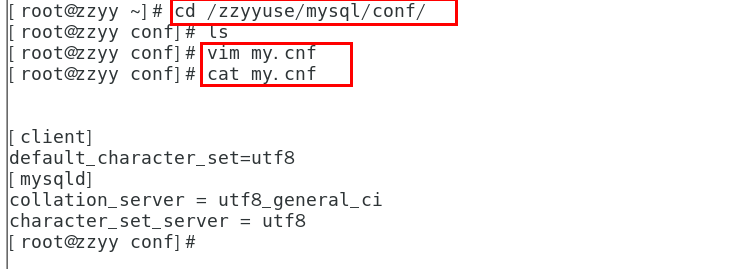
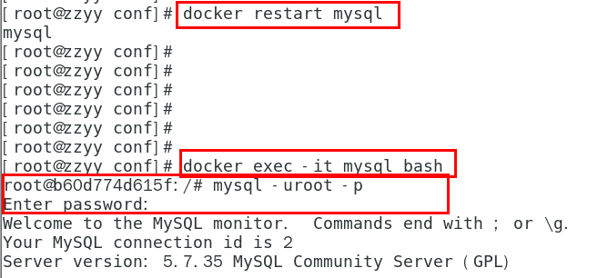
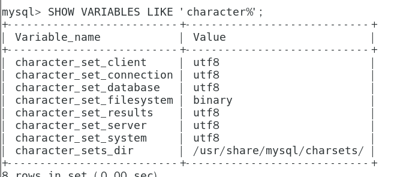
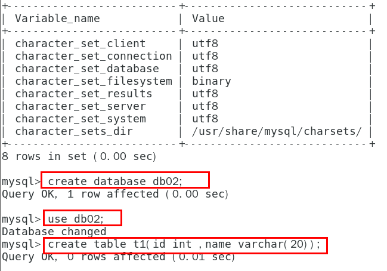
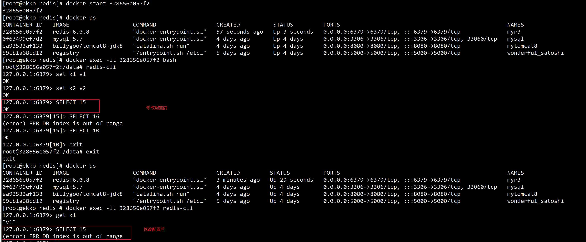

## Docker常规安装简介

## 总体步骤

1. 搜索镜像
2. 拉取镜像
3. 查看镜像
4. 启动镜像——服务端口映射
5. 停止容器
6. 移除容器

## 安装tomcat

- docker hub上面查找tomcat镜像

  ```sh
  docker search tomcat
  ```

- 从docker hub上拉取tomcat镜像到本地

  ```sh
  docker pull tomcat
  ```

- docker images查看是否有拉取到的tomcat

- 使用tomcat镜像创建容器实例(也叫运行镜像)

  ```sh
  docker run -d -p  8080:8080 --name=t1 tomcat
  ```

- 访问猫首页

  - 问题

  - 解决：

    - 可能没有映射端口或者没有关闭防火墙
    - 把webapps.dist目录换成webapps

    

- 免修改版说明

  ```sh
  docker pull billygoo/tomcat8-jdk8
  docker run -d -p 8080:8080 --name mytomcat8 billygoo/tomcat8-jdk8
  ```

  

## 安装mysql

```sh
docker pull mysql:5.7
docker run -p 3306:3306 -e MYSQL_ROOT_PASSWORD=123456 -d mysql:5.7
docker ps
docker exec -it 容器ID /bin/bash
mysql -uroot -p
```

### 问题

- 插入中文报错，需要修改字符编码

```sh
SHOW VARIABLES LIKE 'character%'
```

- 删除容器后，里面的mysql数据如何办

### 实战

- 新建mysql容器实例

  ```sh
  docker run -d -p 3306:3306 --privileged=true -v /zzyyuse/mysql/log:/var/log/mysql -v /zzyyuse/mysql/data:/var/lib/mysql -v /zzyyuse/mysql/conf:/etc/mysql/conf.d -e MYSQL_ROOT_PASSWORD=123456  --name mysql mysql:5.7
  ```

- 新建my.cnf，通过容器卷同步给mysql容器实例

  ```sh
  [client]
  default_character_set=utf8
  [mysqld]
  collation_server = utf8_general_ci
  character_set_server = utf8
  ```

  

- 重新启动mysql容器实例再重新进入并查看字符编码





- 再新建库新建表再插入中文测试

### 结论：

之前的DB  无效

修改字符集操作+重启mysql容器实例

之后的DB  有效，需要新建

结论：docker安装完MySQL并run出容器后，建议请先修改完字符集编码后再新建mysql库-表-插数据



假如将当前容器实例删除，再重新来一次，之前建的db01实例还有吗？trytry

## 安装redis

```sh
# 入门命令
docker pull redis:6.0.8
docker run -d -p 6379:6379 redis:6.0.8
docker exec -it ec275b20b9ef bash
```

Docker挂载主机目录Docker访问出现cannot open directory .: Permission denied
解决办法：在挂载目录后多加一个--privileged=true参数即可

```sh
# 加入数据卷
[root@ekko ~]# mkdir -p /app/redis
[root@ekko ~]# cd /app/redis/
[root@ekko redis]# vim redis.conf
[root@ekko redis]# docker run  -p 6379:6379 --name myr3 --privileged=true -v /app/redis/redis.conf:/etc/redis/redis.conf -v /app/redis/data:/data -d redis:6.0.8 redis-server /etc/redis/redis.conf

```



## 安装Nginx

见高级篇Portainer