# Docker复杂安装详说

## 安装MySQL主从复制

1、新建主服务器容器实例3307

```sh
docker run -p 3307:3306 --name mysql-master \
-v /mydata/mysql-master/log:/var/log/mysql \
-v /mydata/mysql-master/data:/var/lib/mysql \
-v /mydata/mysql-master/conf:/etc/mysql \
-e MYSQL_ROOT_PASSWORD=root  \
-d mysql:5.7
```

2、进入/mydata/mysql-master/conf目录下新建my.cnf

```cnf
[mysqld]
## 设置server_id，同一局域网中需要唯一
server_id=101 
## 指定不需要同步的数据库名称
binlog-ignore-db=mysql  
## 开启二进制日志功能
log-bin=mall-mysql-bin  
## 设置二进制日志使用内存大小（事务）
binlog_cache_size=1M  
## 设置使用的二进制日志格式（mixed,statement,row）
binlog_format=mixed  
## 二进制日志过期清理时间。默认值为0，表示不自动清理。
expire_logs_days=7  
## 跳过主从复制中遇到的所有错误或指定类型的错误，避免slave端复制中断。
## 如：1062错误是指一些主键重复，1032错误是因为主从数据库数据不一致
slave_skip_errors=1062
```

3、修改完配置后重启master实例

```sh
docker restart mysql-master
```

4、进入mysql-master容器

```sh
docker exec -it mysql-master /bin/bash
mysql -uroot -proot
```

5、master容器实例内创建数据同步用户

```
CREATE USER 'slave'@'%' IDENTIFIED BY '123456';
GRANT REPLICATION SLAVE, REPLICATION CLIENT ON *.* TO 'slave'@'%';
```

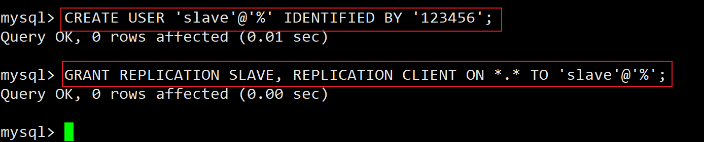

6、新建从服务器容器实例3308

```sh
docker run -p 3308:3306 --name mysql-slave \
-v /mydata/mysql-slave/log:/var/log/mysql \
-v /mydata/mysql-slave/data:/var/lib/mysql \
-v /mydata/mysql-slave/conf:/etc/mysql \
-e MYSQL_ROOT_PASSWORD=root  \
-d mysql:5.7
```

7、进入/mydata/mysql-slave/conf目录下新建my.cnf

```cnf
[mysqld]
## 设置server_id，同一局域网中需要唯一
server_id=102
## 指定不需要同步的数据库名称
binlog-ignore-db=mysql  
## 开启二进制日志功能，以备Slave作为其它数据库实例的Master时使用
log-bin=mall-mysql-slave1-bin  
## 设置二进制日志使用内存大小（事务）
binlog_cache_size=1M  
## 设置使用的二进制日志格式（mixed,statement,row）
binlog_format=mixed  
## 二进制日志过期清理时间。默认值为0，表示不自动清理。
expire_logs_days=7  
## 跳过主从复制中遇到的所有错误或指定类型的错误，避免slave端复制中断。
## 如：1062错误是指一些主键重复，1032错误是因为主从数据库数据不一致
slave_skip_errors=1062  
## relay_log配置中继日志
relay_log=mall-mysql-relay-bin  
## log_slave_updates表示slave将复制事件写进自己的二进制日志
log_slave_updates=1  
## slave设置为只读（具有super权限的用户除外）
read_only=1
```

8、修改完配置后重启slave实例

```sh
docker restart mysql-slave
```

9、在主数据库中查看主从同步状态

```mysql
show master status;
```

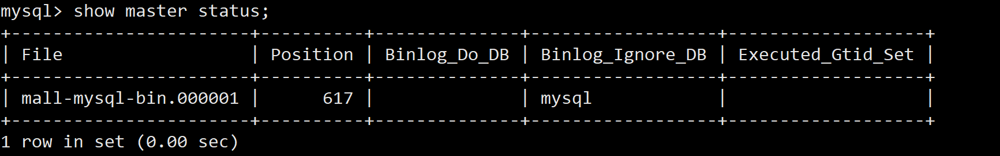

10、进入mysql-slave容器

```sh
docker exec -it mysql-slave /bin/bash
mysql -uroot -proot
```

11、在从数据库中配置主从复制

```sh
change master to master_host='192.168.48.111', master_user='slave', master_password='123456', master_port=3307, master_log_file='mall-mysql-bin.000001', master_log_pos=617, master_connect_retry=30;
```

12、在从数据库中查看主从同步状态

```mysql
show slave status \G;
```

13、在从数据库中开启主从同步

```mysql
start slave;
```

14、查看从数据库状态发现已经同步

```mysql
show slave status \G;
```

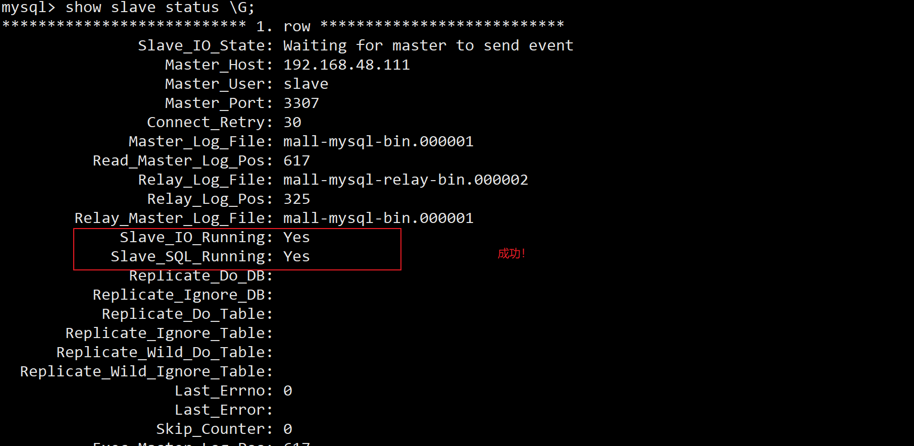

15、主从复制测试

- 主机新建库-使用库-新建表-插入数据，ok
- 从机使用库-查看记录，ok

## 安装redis集群(大厂面试题第4季-分布式存储案例真题)

**cluster(集群)模式-docker版哈希槽分区进行亿级数据存储**

### 面试题

1~2亿条数据需要缓存，请问如何设计这个存储案例？

单机单台100%不可能，肯定是分布式存储，用redis如何落地？

上述问题阿里P6~P7工程案例和场景设计类必考题目，一般业界有3种解决方案

- 哈希取余分区
- 一致性哈希算法分区
- 哈希槽分区

#### 哈希取余分区

.jpg)

2亿条记录就是2亿个k,v，我们单机不行必须要分布式多机，假设有3台机器构成一个集群，用户每次读写操作都是根据公式：
hash(key) % N个机器台数，计算出哈希值，用来决定数据映射到哪一个节点上。

**优点：**
简单粗暴，直接有效，只需要预估好数据规划好节点，例如3台、8台、10台，就能保证一段时间的数据支撑。使用Hash算法让固定的一部分请求落到同一台服务器上，这样每台服务器固定处理一部分请求（并维护这些请求的信息），起到负载均衡+分而治之的作用。

缺点：
原来规划好的节点，进行扩容或者缩容就比较麻烦了额，不管扩缩，每次数据变动导致节点有变动，映射关系需要重新进行计算，在服务器个数固定不变时没有问题，如果需要弹性扩容或故障停机的情况下，原来的取模公式就会发生变化：Hash(key)/3会变成Hash(key) /?。此时地址经过取余运算的结果将发生很大变化，根据公式获取的服务器也会变得不可控。

某个redis机器宕机了，由于台数数量变化，会导致hash取余全部数据重新洗牌。

#### 一致性哈希算法分区

**是什么？**一致性Hash算法背景：一致性哈希算法在1997年由麻省理工学院中提出的，设计目标是为了解决分布式缓存数据变动和映射问题，某个机器宕机了，分母数量改变了，自然取余数不OK了。

**能干嘛？**提出一致性Hash解决方案。目的是当服务器个数发生变动时，尽量减少影响客户端到服务器的映射关系。

**3大步骤。**

1. 算法构建一致性哈希环

   > 一致性哈希算法必然有个hash函数并按照算法产生hash值，这个算法的所有可能哈希值会构成一个全量集，这个集合可以成为一个hash空间[0,2^32-1]，这个是一个线性空间，但是在算法中，我们通过适当的逻辑控制将它首尾相连(0 = 2^32),这样让它逻辑上形成了一个环形空间。
   >
   > 它也是按照使用取模的方法，前面笔记介绍的节点取模法是对节点（服务器）的数量进行取模。而一致性Hash算法是对2^32取模，简单来说，一致性Hash算法将整个哈希值空间组织成一个虚拟的圆环，如假设某哈希函数H的值空间为0-2^32-1（即哈希值是一个32位无符号整形），整个哈希环如下图：整个空间按顺时针方向组织，圆环的正上方的点代表0，0点右侧的第一个点代表1，以此类推，2、3、4、……直到2^32-1，也就是说0点左侧的第一个点代表2^32-1， 0和2^32-1在零点中方向重合，我们把这个由2^32个点组成的圆环称为Hash环。

   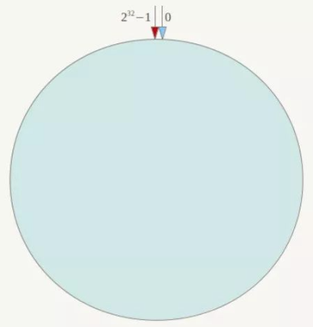

2. 服务器IP节点映射

   > 将集群中各个IP节点映射到环上的某一个位置。
   > 将各个服务器使用Hash进行一个哈希，具体可以选择服务器的IP或主机名作为关键字进行哈希，这样每台机器就能确定其在哈希环上的位置。假如4个节点NodeA、B、C、D，经过IP地址的哈希函数计算(hash(ip))，使用IP地址哈希后在环空间的位置如下：

   

3. key落到服务器的落键规则

   > 当我们需要存储一个kv键值对时，首先计算key的hash值，hash(key)，将这个key使用相同的函数Hash计算出哈希值并确定此数据在环上的位置，从此位置沿环顺时针“行走”，第一台遇到的服务器就是其应该定位到的服务器，并将该键值对存储在该节点上。
   > 如我们有Object A、Object B、Object C、Object D四个数据对象，经过哈希计算后，在环空间上的位置如下：根据一致性Hash算法，数据A会被定为到Node A上，B被定为到Node B上，C被定为到Node C上，D被定为到Node D上。

   

4. 优点

   1. 一致性哈希算法的容错性

      > 假设Node C宕机，可以看到此时对象A、B、D不会受到影响，只有C对象被重定位到Node D。一般的，在一致性Hash算法中，如果一台服务器不可用，则受影响的数据仅仅是此服务器到其环空间中前一台服务器（即沿着逆时针方向行走遇到的第一台服务器）之间数据，其它不会受到影响。简单说，就是C挂了，受到影响的只是B、C之间的数据，并且这些数据会转移到D进行存储。

      

   2. 一致性哈希算法的扩展性

      > 数据量增加了，需要增加一台节点NodeX，X的位置在A和B之间，那收到影响的也就是A到X之间的数据，重新把A到X的数据录入到X上即可，
      > 不会导致hash取余全部数据重新洗牌。

      

5. 缺点

   > 一致性哈希算法的数据倾斜问题
   >
   > Hash环的数据倾斜问题
   > 一致性Hash算法在服务节点太少时，容易因为节点分布不均匀而造成数据倾斜（被缓存的对象大部分集中缓存在某一台服务器上）问题，
   > 例如系统中只有两台服务器：

   

6. 小总结

   为了在节点数目发生改变时尽可能少的迁移数据

   将所有的存储节点排列在收尾相接的Hash环上，每个key在计算Hash后会**顺时针**找到临近的存储节点存放。
   而当有节点加入或退出时仅影响该节点在Hash环上**顺时针相邻的后续节点**。  

   **优点**
   加入和删除节点只影响哈希环中顺时针方向的相邻的节点，对其他节点无影响。

   **缺点** 
   数据的分布和节点的位置有关，因为这些节点不是均匀的分布在哈希环上的，所以数据在进行存储时达不到均匀分布的效果。

#### 哈希槽分区

**是什么。**


1 为什么出现

哈希槽实质就是一个数组，数组[0,2^14 -1]形成hash slot空间。

2 能干什么
解决均匀分配的问题，**在数据和节点之间又加入了一层，把这层称为哈希槽（slot），用于管理数据和节点之间的关系**，现在就相当于节点上放的是槽，槽里放的是数据。


槽解决的是粒度问题，相当于把粒度变大了，这样便于数据移动。
哈希解决的是映射问题，使用key的哈希值来计算所在的槽，便于数据分配。

3 多少个hash槽
一个集群只能有16384个槽，编号0-16383（0-2^14-1）。这些槽会分配给集群中的所有主节点，分配策略没有要求。可以指定哪些编号的槽分配给哪个主节点。集群会记录节点和槽的对应关系。解决了节点和槽的关系后，接下来就需要对key求哈希值，然后对16384取余，余数是几key就落入对应的槽里。slot = CRC16(key) % 16384。以槽为单位移动数据，因为槽的数目是固定的，处理起来比较容易，这样数据移动问题就解决了。

**哈希槽计算。**

Redis 集群中内置了 16384 个哈希槽，redis 会根据节点数量大致均等的将哈希槽映射到不同的节点。当需要在 Redis 集群中放置一个 key-value时，redis 先对 key 使用 crc16 算法算出一个结果，然后把结果对 16384 求余数，这样每个 key 都会对应一个编号在 0-16383 之间的哈希槽，也就是映射到某个节点上。如下代码，key之A 、B在Node2， key之C落在Node3上


### 步骤

#### 3主3从redis集群配置

1. 关闭防火墙+启动docker后台服务

2. 新建6个docker容器redis实例

   ```sh
   docker run -d --name redis-node-1 --net host --privileged=true -v /data/redis/share/redis-node-1:/data redis:6.0.8 --cluster-enabled yes --appendonly yes --port 6381
    
   docker run -d --name redis-node-2 --net host --privileged=true -v /data/redis/share/redis-node-2:/data redis:6.0.8 --cluster-enabled yes --appendonly yes --port 6382
    
   docker run -d --name redis-node-3 --net host --privileged=true -v /data/redis/share/redis-node-3:/data redis:6.0.8 --cluster-enabled yes --appendonly yes --port 6383
    
   docker run -d --name redis-node-4 --net host --privileged=true -v /data/redis/share/redis-node-4:/data redis:6.0.8 --cluster-enabled yes --appendonly yes --port 6384
    
   docker run -d --name redis-node-5 --net host --privileged=true -v /data/redis/share/redis-node-5:/data redis:6.0.8 --cluster-enabled yes --appendonly yes --port 6385
    
   docker run -d --name redis-node-6 --net host --privileged=true -v /data/redis/share/redis-node-6:/data redis:6.0.8 --cluster-enabled yes --appendonly yes --port 6386
   ```

   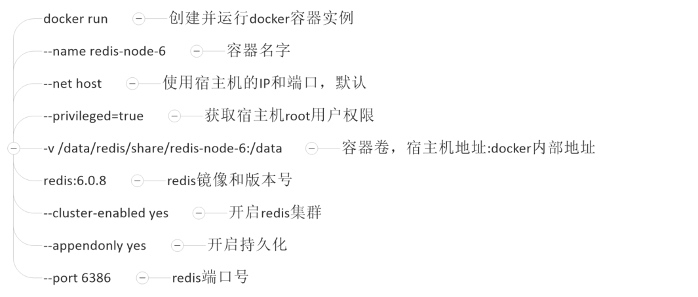

   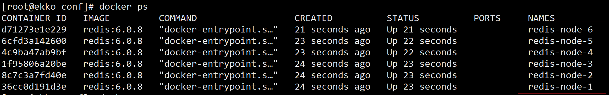

3. 进入容器redis-node-1并为6台机器构建集群关系

   1. 进入容器

      ```sh
      docker exec -it redis-node-1 /bin/bash
      ```

   2. 构建主从关系

      > 注意，进入docker容器后才能执行一下命令，且注意自己的真实IP地址
      >
      > --cluster-replicas 1 表示为每个master创建一个slave节点

      ```sh
      redis-cli --cluster create 192.168.48.111:6381 192.168.48.111:6382 192.168.48.111:6383 192.168.48.111:6384 192.168.48.111:6385 192.168.48.111:6386 --cluster-replicas 1
      ```

      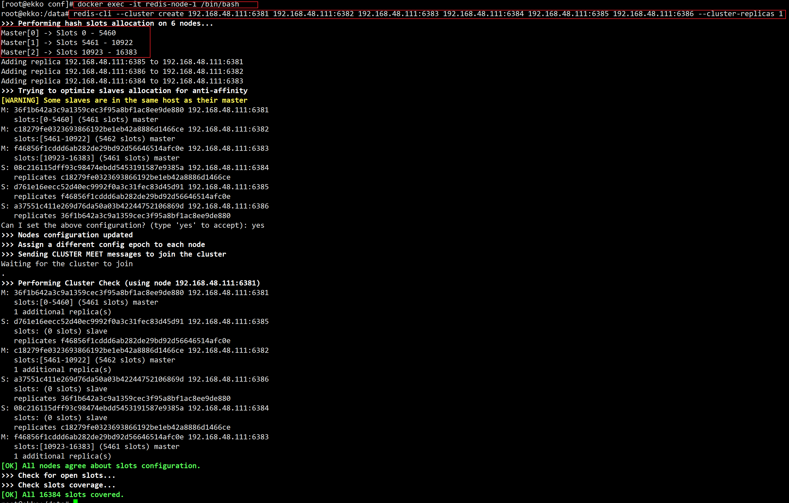

   3. 一切ok的话，3主3从搞定

4. 链接进入6381作为切入点，查看集群状态

   ```sh
   redis-cli -p 6381
   CLUSTER INFO
   CLUSTER NODES
   ```

   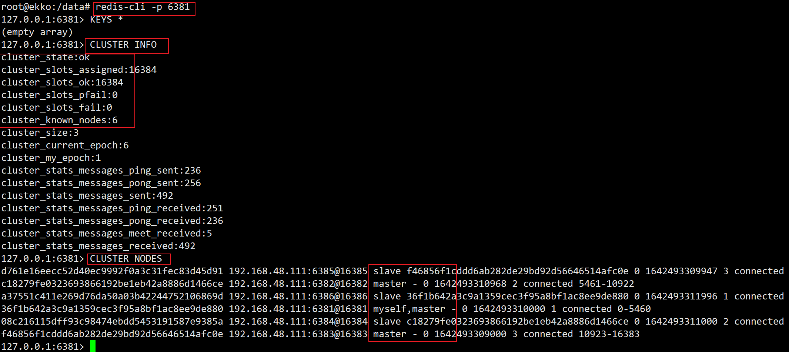

#### 主从容错切换迁移案例

##### 数据读写存储

1. 启动6机构成的集群并通过exec进入

2. 对6381新增两个key

   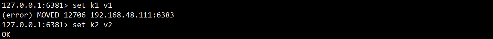

3. 防止路由失效加参数-c并新增两个key

   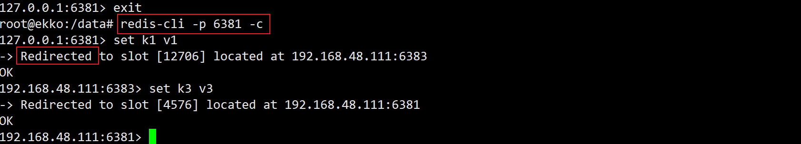

4. 查看集群信息

   ```sh
   redis-cli --cluster check 192.168.48.111:6381
   ```

   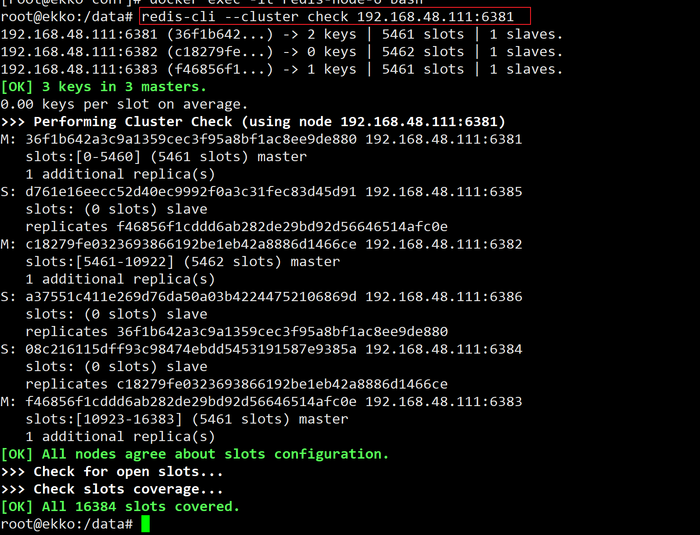

##### 容错切换迁移

1. 主6381和从机切换，先停止主机6381

   - 6381主机停了，对应的真实从机上位；

   - 6381作为1号主机分配的从机以实际情况为准，具体是几号机器就是几号

2. 再次查看集群信息

   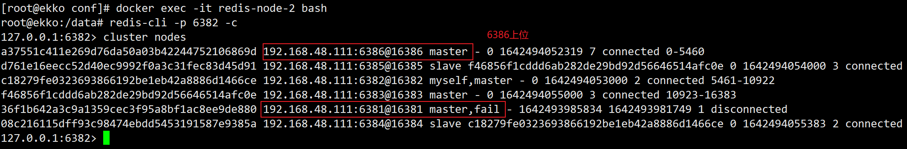

3. 先还原之前的3主3从

   ```sh
   docker start redis-node-1
   ```

   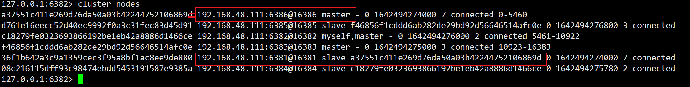

4. 查看集群状态

   ```sh
   redis-cli --cluster check 192.168.48.111:6381
   ```

   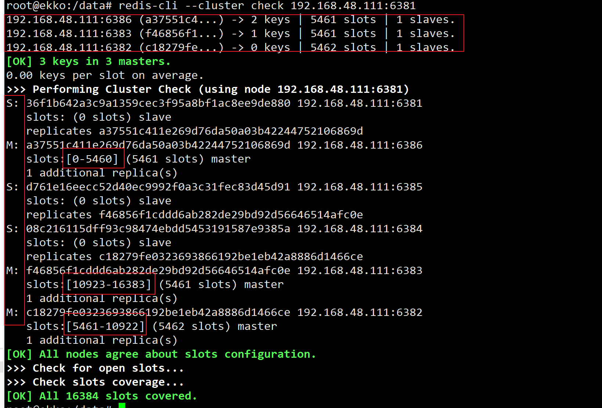

#### 主从扩容案例

1. 新建6387、6388两个节点+新建后启动+查看是否8节点

   ```sh
   docker run -d --name redis-node-7 --net host --privileged=true -v /data/redis/share/redis-node-7:/data redis:6.0.8 --cluster-enabled yes --appendonly yes --port 6387
   docker run -d --name redis-node-8 --net host --privileged=true -v /data/redis/share/redis-node-8:/data redis:6.0.8 --cluster-enabled yes --appendonly yes --port 6388
   docker ps
   ```

2. 进入6387容器实例内部

   ```sh
   docker exec -it redis-node-7 /bin/bash
   ```

3. 将新增的6387节点(空槽号)作为master节点加入原集群

   > 将新增的6387作为master节点加入集群
   > **redis-cli --cluster add-node 自己实际IP地址:6387 自己实际IP地址:6381**
   > 6387 就是将要作为master新增节点
   > 6381 就是原来集群节点里面的领路人，相当于6387拜拜6381的码头从而找到组织加入集群

   ```sh
   redis-cli --cluster add-node 192.168.48.111:6387 192.168.48.111:6381
   ```

   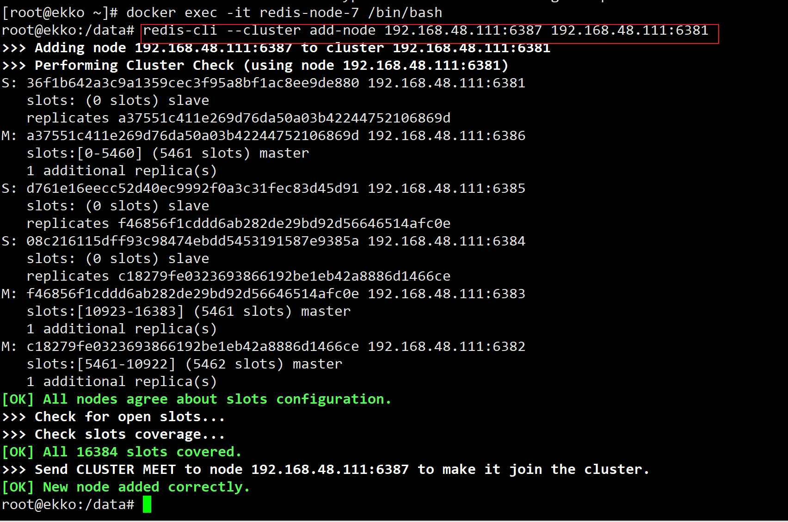

4. 检查集群情况第1次

   ```sh
   redis-cli --cluster check 192.168.48.111:6381
   ```

   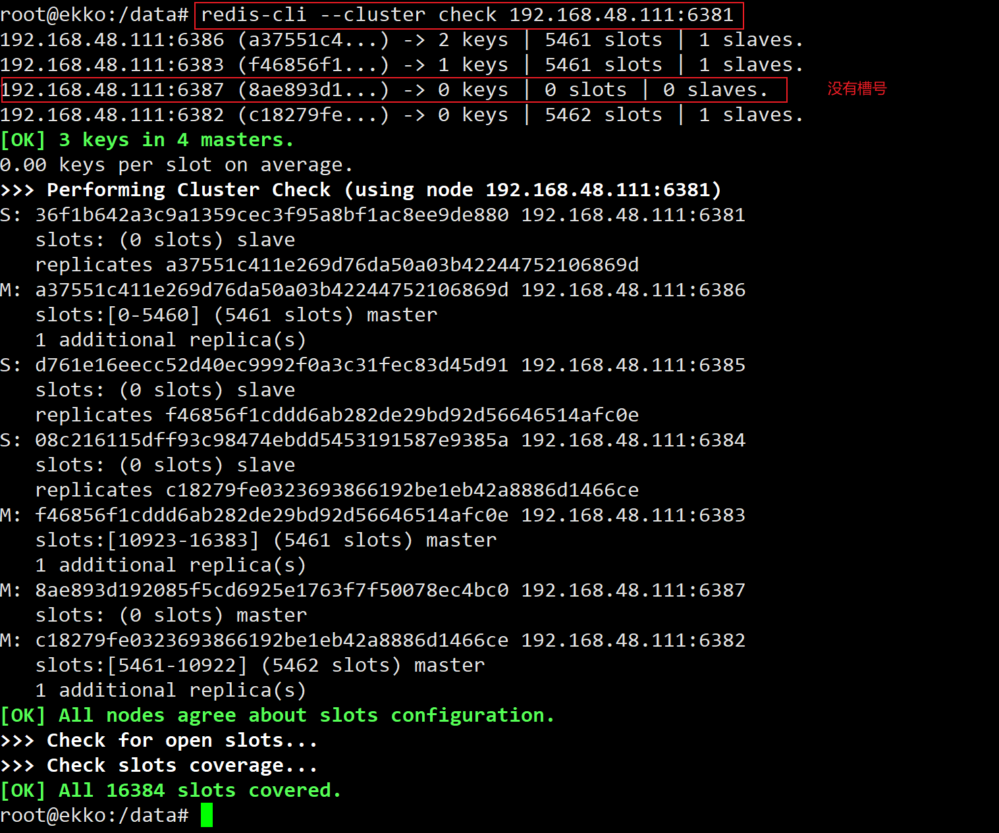

5. 重新分派槽号

   ```sh
   #重新分派槽号命令:redis-cli --cluster reshard IP地址:端口号
   redis-cli --cluster reshard 192.168.48.111:6381
   ```

   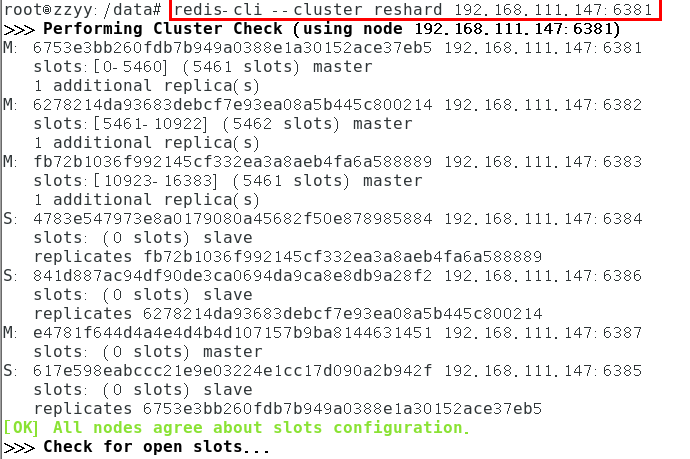

   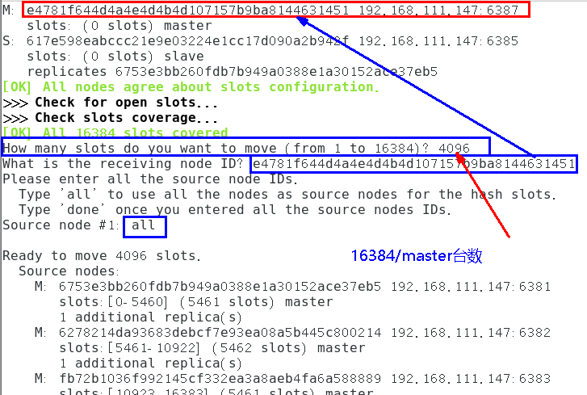

6. 检查集群情况第2次

   ```sh
   redis-cli --cluster check 192.168.48.111:6381
   ```

   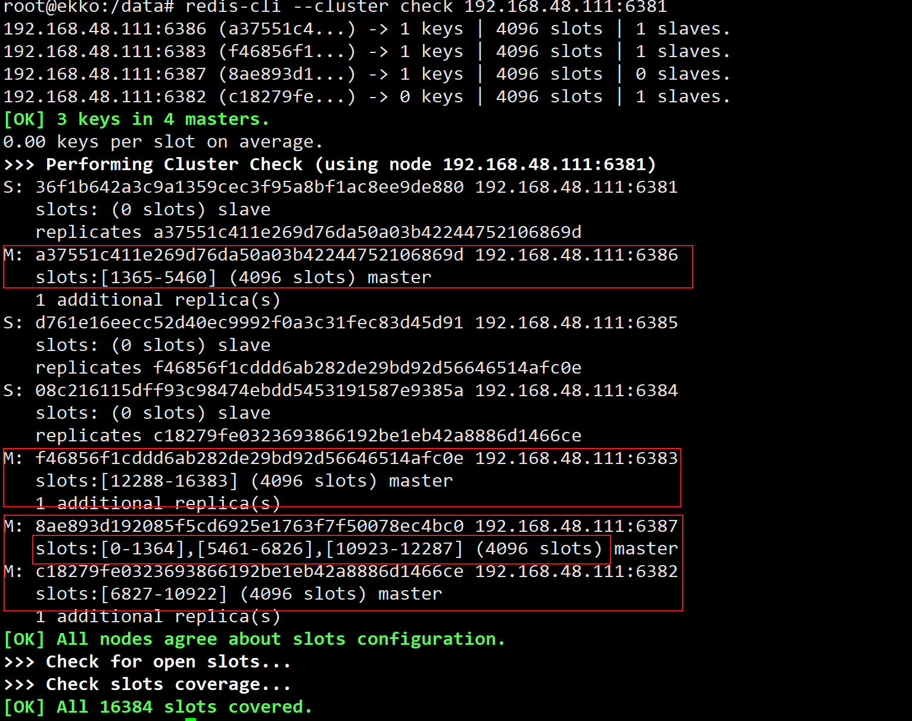

   > 为什么6387是3个新的区间，以前的还是连续？
   > 重新分配成本太高，所以前3家各自匀出来一部分，从6381/6382/6383三个旧节点分别匀出1364个坑位给新节点6387

7. 为主节点6387分配从节点6388

   ```sh
   # 命令：redis-cli --cluster add-node ip:新slave端口 ip:新master端口 --cluster-slave --cluster-master-id 新主机节点ID
    
   redis-cli --cluster add-node 192.168.48.111:6388 192.168.48.111:6387 --cluster-slave --cluster-master-id e4781f644d4a4e4d4b4d107157b9ba8144631451-------这个是6387的编号，按照自己实际情况
   ```

   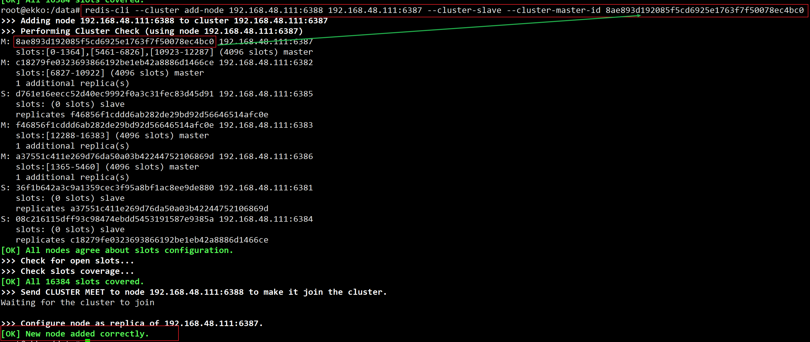

8. 检查集群情况第3次

   ```sh
   redis-cli --cluster check 192.168.48.111:6381
   ```

   

#### 主从缩容案例

1. 目的：6387和6388下线

2. 检查集群情况1获得6388的节点ID

3. 将6388删除，从集群中将4号从节点6388删除

   ```sh
   #命令：redis-cli --cluster del-node ip:从机端口 从机6388节点ID
    
   redis-cli --cluster del-node 192.168.48.111:6388 10cd3e149d9f30af4f718b9adff4cbde4e7b08f4
   ```

   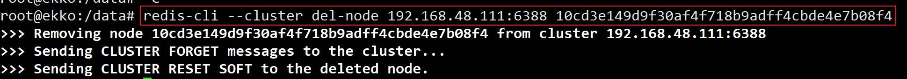

4. 将6387的槽号清空，重新分配，本例将清出来的槽号都给6381

   ```sh
   redis-cli --cluster reshard 192.168.48.111:6381
   ```

   

   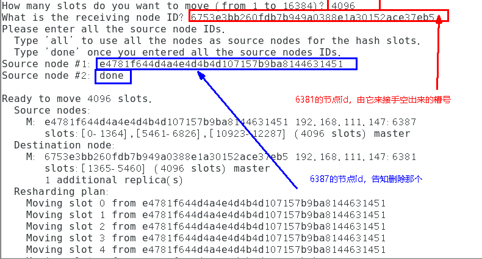

   

5. 检查集群情况第二次

   ```sh
   redis-cli --cluster check 192.168.48.111:6381
   ```

   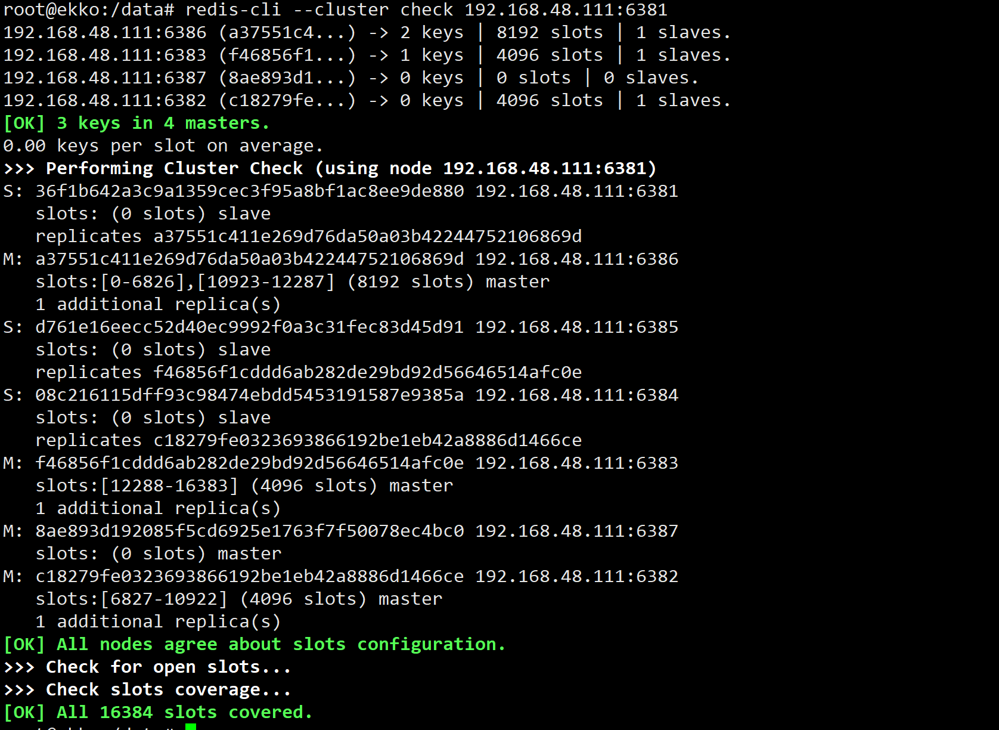

6. 将6387删除

   ```sh
   #命令：redis-cli --cluster del-node ip:端口 6387节点ID
    
   redis-cli --cluster del-node 192.168.48.111:6387 8ae893d192085f5cd6925e1763f7f50078ec4bc0
   ```

   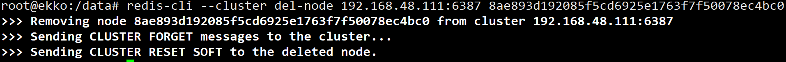

7. 检查集群情况第三次

   ```sh
   redis-cli --cluster check 192.168.48.111:6381
   ```

   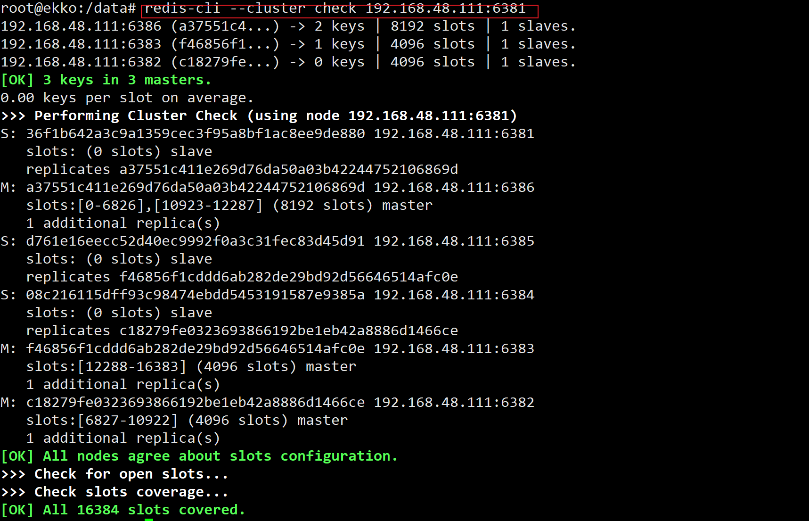


