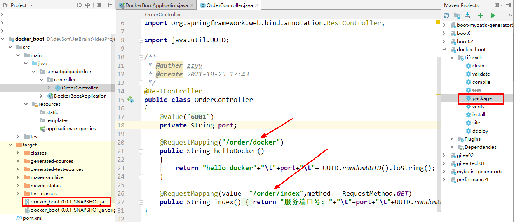
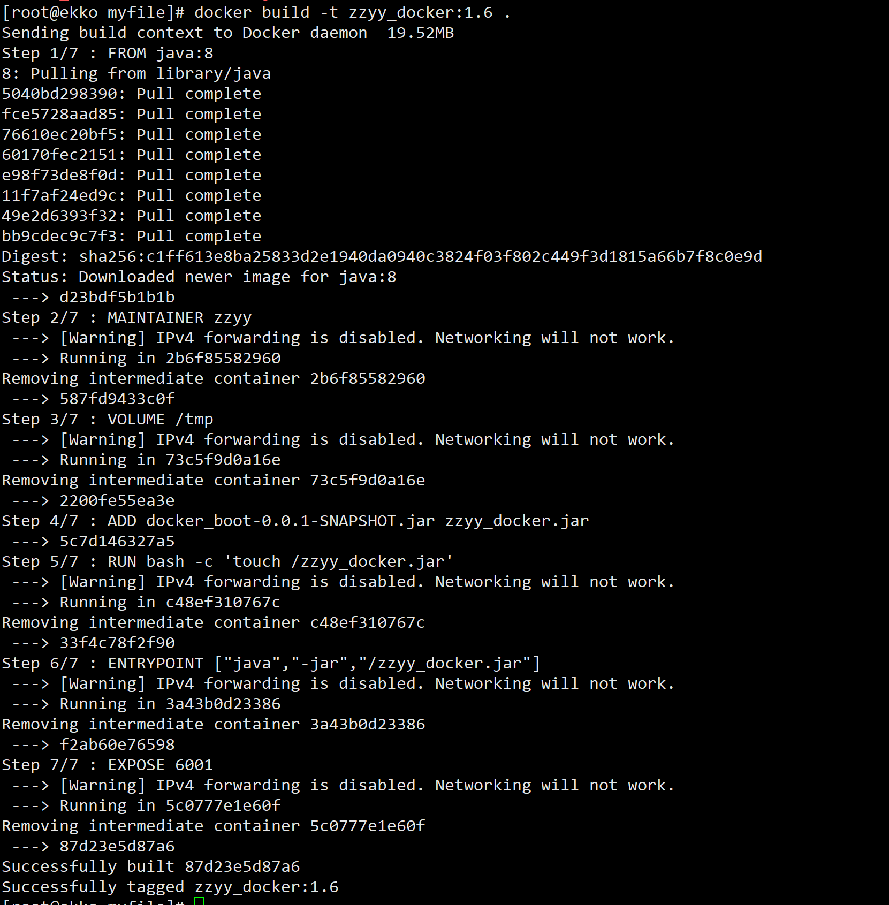
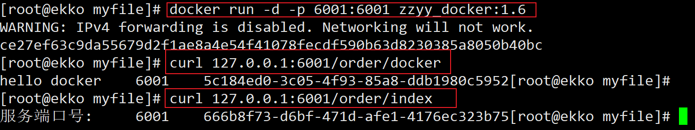
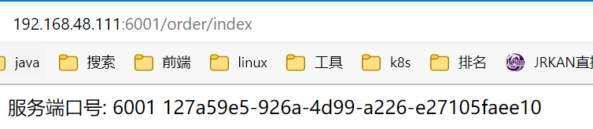

# Docker微服务实战

## 1. 通过IDEA新建一个普通微服务模块

略

## 2. 通过dockerfile发布微服务部署到docker容器

1. IDEA工具里面搞定微服务jar包



2. 编写Dockerfile

   ```dockerfile
   # 基础镜像使用java
   FROM java:8
   # 作者
   MAINTAINER zzyy
   # VOLUME 指定临时文件目录为/tmp，在主机/var/lib/docker目录下创建了一个临时文件并链接到容器的/tmp
   VOLUME /tmp
   # 将jar包添加到容器中并更名为zzyy_docker.jar
   ADD docker_boot-0.0.1-SNAPSHOT.jar zzyy_docker.jar
   # 运行jar包
   RUN bash -c 'touch /zzyy_docker.jar'
   ENTRYPOINT ["java","-jar","/zzyy_docker.jar"]
   #暴露6001端口作为微服务
   EXPOSE 6001
   ```

   将微服务jar包和Dockerfile文件上传到同一个目录下/mydocker

3. 构建镜像

   ```sh
   docker build -t zzyy_docker:1.6 .
   ```

   

4. 运行容器

   ```sh
   docker run -d -p 6001:6001 zzyy_docker:1.6
   ```

   ```sh
   curl 127.0.0.1:6001/order/docker
   curl 127.0.0.1:6001/order/index
   ```

   

5. 访问测试

```
http://192.168.48.111:6001/order/index
```

