# Docker网络

## 1. 是什么

### 1.1 docker不启动，默认网络情况

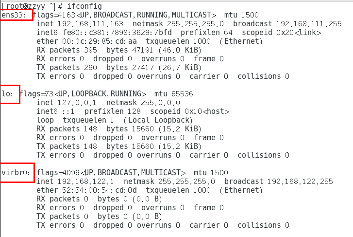

在CentOS7的安装过程中如果有选择相关虚拟化的的服务安装系统后，启动网卡时会发现有一个以网桥连接的私网地址的virbr0网卡(virbr0网卡：它还有一个固定的默认IP地址192.168.122.1)，是做虚拟机网桥的使用的，其作用是为连接其上的虚机网卡提供 NAT访问外网的功能。

我们之前学习Linux安装，勾选安装系统的时候附带了libvirt服务才会生成的一个东西，如果不需要可以直接将libvirtd服务卸载，

```
yum remove libvirt-libs.x86_64
```


### 1.2 docker启动后，网络情况

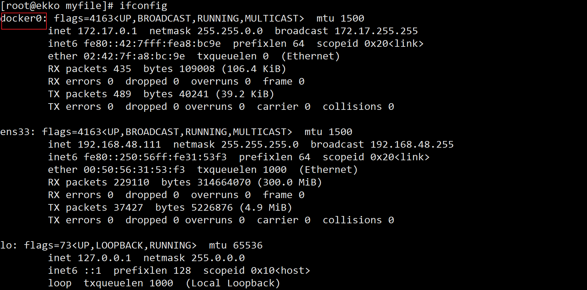

查看docker网络模式命令：

```sh
docker network ls
```

默认创建3大网络模式：

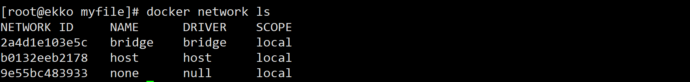

## 2. 常用基本命令

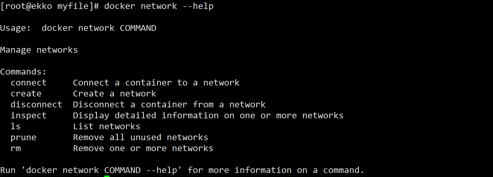

查看网络：

```sh
docker network ls
```

查看网络数据源数据：

```sh
docker network inspect  XXX网络名字
```

删除网络：

```sh
docker network rm XXX网络名字
```

### 2.1 案例

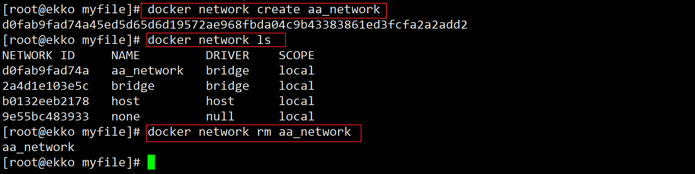


## 3. 能干嘛

- 容器间的互联和通信以及端口映射

- 容器IP变动时候可以通过服务名直接网络通信而不受到影响


## 4. 网络模式

### 4.1 总体介绍

- bridge模式：使用--network  bridge指定，默认使用docker0
- host模式：使用--network host指定
- none模式：使用--network none指定
- container模式：使用--network container:NAME或者容器ID指定


### 4.2 容器实例内默认网络IP生产规则

1. 先启动两个ubuntu容器实例

   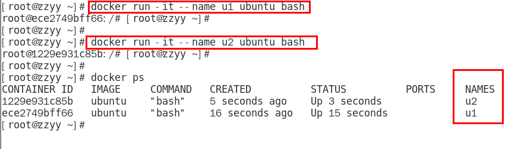

2. docker inspect 容器ID or 容器名字

   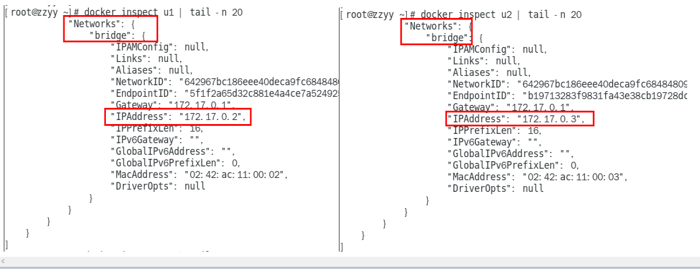

3. 关闭u2实例，新建u3，查看ip变化

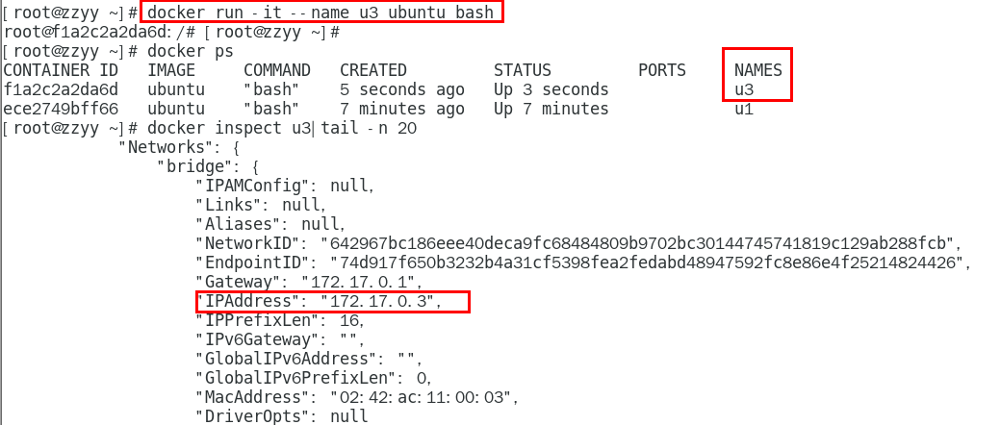

**结论：docker容器内部的ip是有可能会发生改变的**

### 4.3 案例说明

#### 4.3.1 bridge

Docker 服务默认会创建一个 docker0 网桥（其上有一个 docker0 内部接口），该桥接网络的名称为docker0，它在**内核层**连通了其他的物理或虚拟网卡，这就将所有容器和本地主机都放到**同一个物理网络**。Docker 默认指定了 docker0 接口 的 IP 地址和子网掩码，**让主机和容器之间可以通过网桥相互通信**。

```sh
#查看 bridge 网络的详细信息，并通过 grep 获取名称项
docker network inspect bridge | grep name
```

##### 案例：

1. Docker使用Linux桥接，在宿主机虚拟一个Docker容器网桥(docker0)，Docker启动一个容器时会根据Docker网桥的网段分配给容器一个IP地址，称为Container-IP，同时Docker网桥是每个容器的默认网关。因为在同一宿主机内的容器都接入同一个网桥，这样容器之间就能够通过容器的Container-IP直接通信。

2. docker run 的时候，没有指定network的话默认使用的网桥模式就是bridge，使用的就是docker0。在宿主机ifconfig,就可以看到docker0和自己create的network(后面讲)eth0，eth1，eth2……代表网卡一，网卡二，网卡三……，lo代表127.0.0.1，即localhost，inet addr用来表示网卡的IP地址

3. 网桥docker0创建一对对等虚拟设备接口一个叫veth，另一个叫eth0，成对匹配。
      3.1 整个宿主机的网桥模式都是docker0，类似一个交换机有一堆接口，每个接口叫veth，在本地主机和容器内分别创建一个虚拟接口，并让他们彼此联通（这样一对接口叫veth pair）；
      3.2 每个容器实例内部也有一块网卡，每个接口叫eth0；
      3.3 docker0上面的每个veth匹配某个容器实例内部的eth0，两两配对，一一匹配。
    通过上述，将宿主机上的所有容器都连接到这个内部网络上，两个容器在同一个网络下,会从这个网关下各自拿到分配的ip，此时两个容器的网络是互通的。

   


```sh
docker run -d -p 8081:8080   --name tomcat81 billygoo/tomcat8-jdk8
docker run -d -p 8082:8080   --name tomcat82 billygoo/tomcat8-jdk8
```

两两匹配：

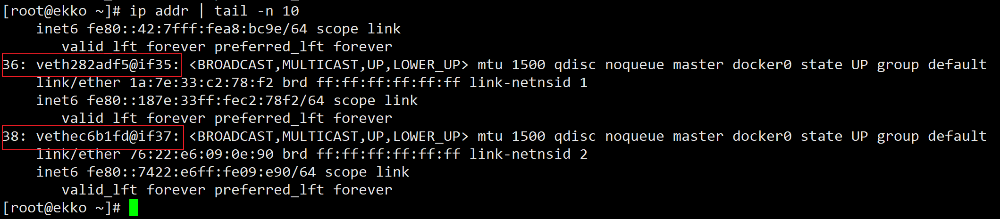

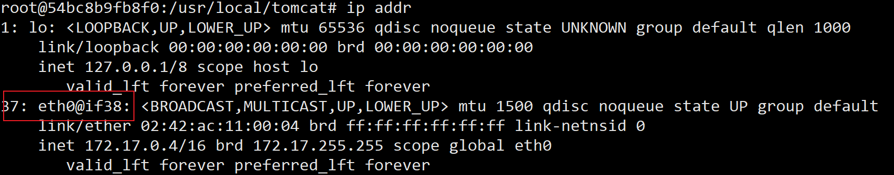

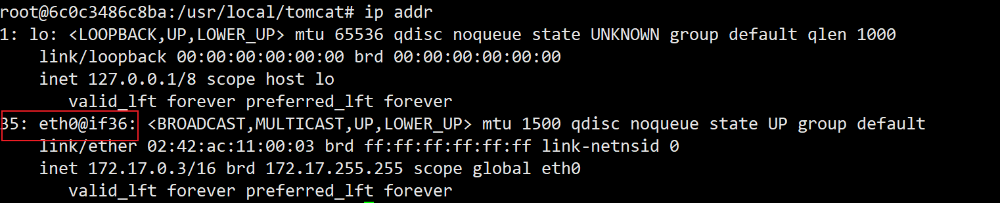

#### 4.3.2 host

直接使用宿主机的 IP 地址与外界进行通信，不再需要额外进行NAT 转换。

##### 案例

容器将不会获得一个独立的Network Namespace， 而是和宿主机共用一个Network Namespace。**容器将不会虚拟出自己的网卡而是使用宿主机的IP和端口。**


```sh
docker run -d -p 8083:8080 --network host --name tomcat83 billygoo/tomcat8-jdk8
docker run -d              --network host --name tomcat83 billygoo/tomcat8-jdk8

```

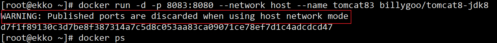

问题：
     docke启动时总是遇见标题中的警告
原因：
    docker启动时指定--network=host或-net=host，如果还指定了-p映射端口，那这个时候就会有此警告，
并且通过-p设置的参数将不会起到任何作用，端口号会以主机端口号为主，重复时则递增。
解决:
    解决的办法就是使用docker的其他网络模式，例如--network=bridge，这样就可以解决问题，或者直接无视。。。。O(∩_∩)O哈哈~


无之前的配对显示了，看容器实例内部

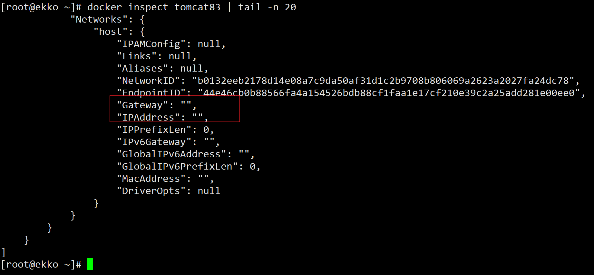

没有设置-p的端口映射了，如何访问启动的tomcat83？？

http://宿主机IP:8080/

在CentOS里面用默认的火狐浏览器访问容器内的tomcat83看到访问成功，因为此时容器的IP借用主机的，
所以容器共享宿主机网络IP，这样的好处是外部主机与容器可以直接通信。

#### 4.3.3 none

在none模式下，并不为Docker容器进行任何网络配置。也就是说，这个Docker容器没有网卡、IP、路由等信息，只有一个lo，需要我们自己为Docker容器添加网卡、配置IP等。

禁用网络功能，只有lo标识(就是127.0.0.1表示本地回环)

```sh
docker run -d -p 8084:8080 --network none --name tomcat84 billygoo/tomcat8-jdk8
```

容器内部查看：

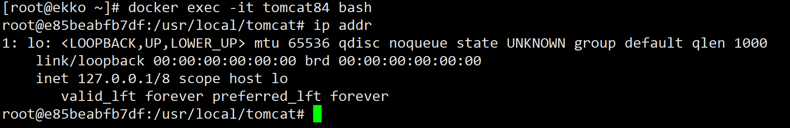

容器外部查看：

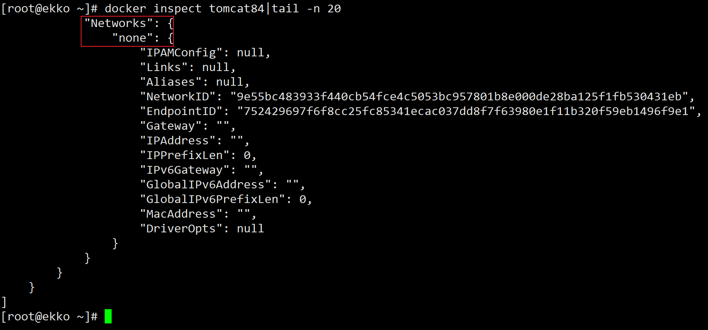


#### 4.3.4 container

新建的容器和已经存在的一个容器共享一个网络ip配置而不是和宿主机共享。新创建的容器不会创建自己的网卡，配置自己的IP，而是和一个指定的容器共享IP、端口范围等。同样，两个容器除了网络方面，其他的如文件系统、进程列表等还是隔离的。


##### 案例1：错误演示

```sh
docker run -d -p 8085:8080                              --name tomcat85 billygoo/tomcat8-jdk8
docker run -d -p 8086:8080 --network container:tomcat85 --name tomcat86 billygoo/tomcat8-jdk8
```

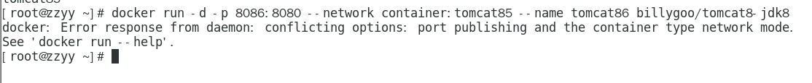

相当于tomcat86和tomcat85公用同一个ip同一个端口，导致端口冲突。本案例用tomcat演示不合适。。。演示坑。。。。。。o(╥﹏╥)o。换一个镜像给大家演示

##### 案例2

Alpine操作系统是一个面向安全的轻型 Linux发行版：Alpine Linux 是一款独立的、非商业的通用 Linux 发行版，专为追求安全性、简单性和资源效率的用户而设计。 可能很多人没听说过这个 Linux 发行版本，但是经常用 Docker 的朋友可能都用过，因为他小，简单，安全而著称，所以作为基础镜像是非常好的一个选择，可谓是麻雀虽小但五脏俱全，镜像非常小巧，不到 6M的大小，所以特别适合容器打包。

```sh
docker run -it                             --name alpine1  alpine /bin/sh
docker run -it --network container:alpine1 --name alpine2  alpine /bin/sh
```

运行结果，验证共用搭桥

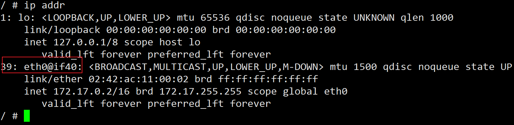

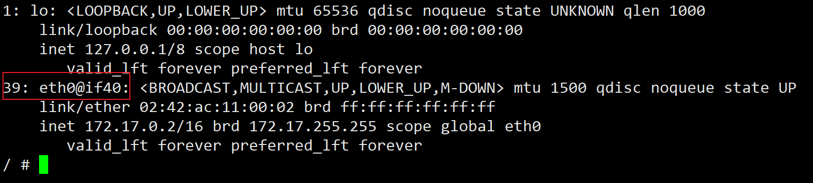

假如此时关闭alpine1，再看看alpine2

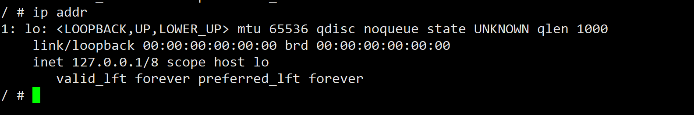

#### 4.3.5 自定义网络

##### 过时的link

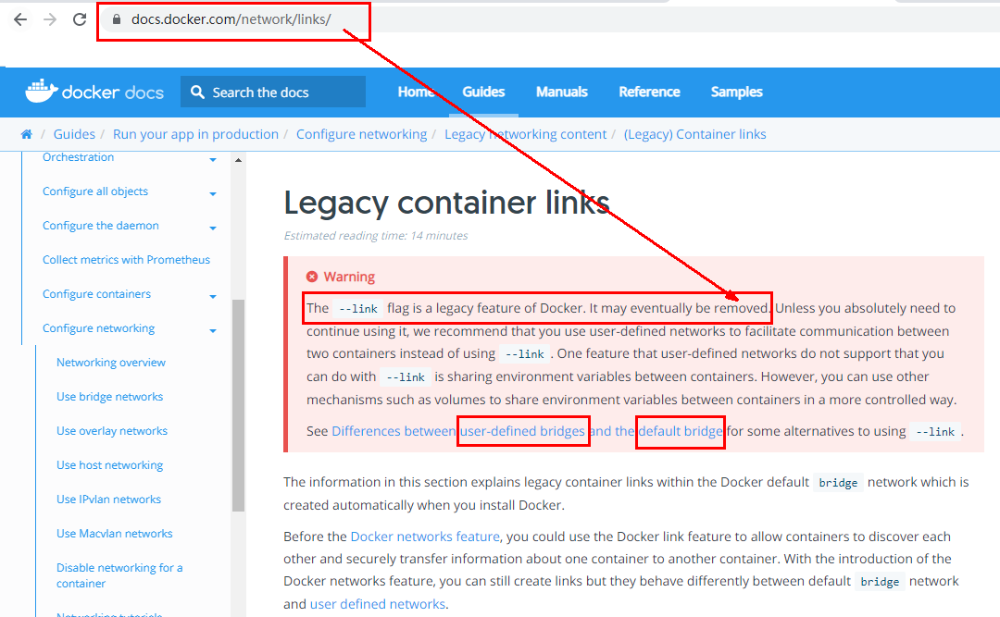


##### 案例

before：

```sh
docker run -d -p 8081:8080   --name tomcat81 billygoo/tomcat8-jdk8
docker run -d -p 8082:8080   --name tomcat82 billygoo/tomcat8-jdk8
```

上述成功启动并用docker exec进入各自容器实例内部

**问题：**

按照IP地址ping是OK的，按照服务名ping结果???

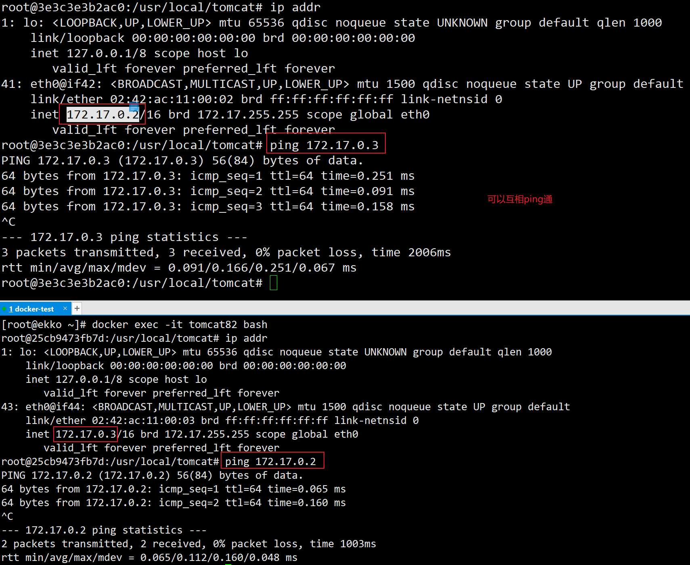

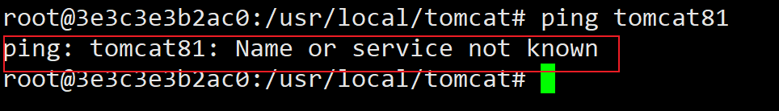

after：

1. 自定义桥接网络,自定义网络默认使用的是桥接网络bridge

2. 新建自定义网络

   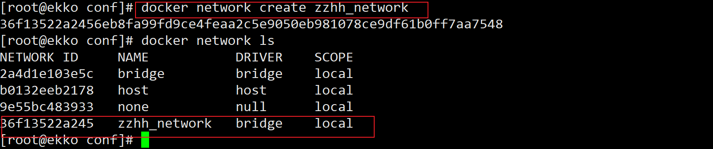

3. 新建容器加入上一步新建的自定义网络

   ```sh
   docker run -d -p 8081:8080 --network zzhh_network  --name tomcat81 billygoo/tomcat8-jdk8
   docker run -d -p 8082:8080 --network zzhh_network  --name tomcat82 billygoo/tomcat8-jdk8
   ```

   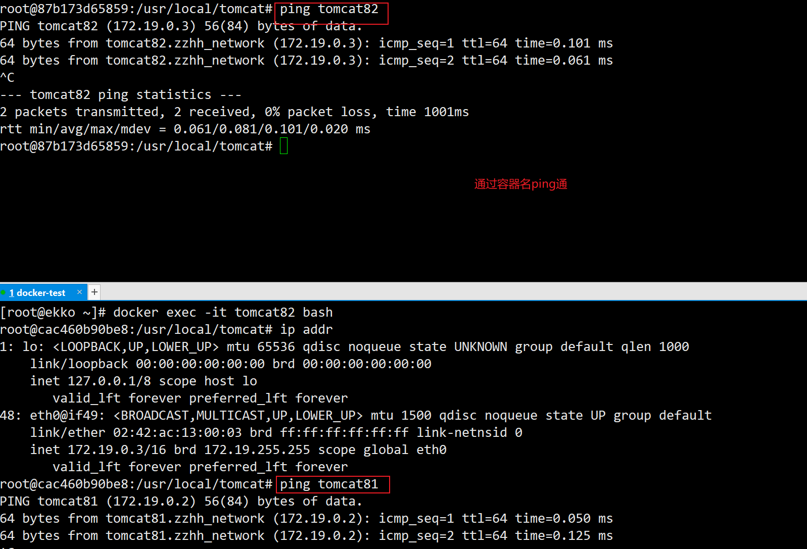

   

   **问题结论：自定义网络本身就维护好了主机名和ip的对应关系（ip和域名都能通）**


## 5. Docker平台架构图解

### 5.1 整体说明

从其架构和运行流程来看，Docker 是一个 C/S 模式的架构，后端是一个松耦合架构，众多模块各司其职。 

Docker 运行的基本流程为：

1. 用户是使用 Docker Client 与 Docker Daemon 建立通信，并发送请求给后者。
2. Docker Daemon 作为 Docker 架构中的主体部分，首先提供 Docker Server 的功能使其可以接受 Docker Client 的请求。
3. Docker Engine 执行 Docker 内部的一系列工作，每一项工作都是以一个 Job 的形式的存在。
4. Job 的运行过程中，当需要容器镜像时，则从 Docker Registry 中下载镜像，并通过镜像管理驱动 Graph driver将下载镜像以Graph的形式存储。
5. 当需要为 Docker 创建网络环境时，通过网络管理驱动 Network driver 创建并配置 Docker 容器网络环境。
6. 当需要限制 Docker 容器运行资源或执行用户指令等操作时，则通过 Execdriver 来完成。
7. Libcontainer是一项独立的容器管理包，Network driver以及Exec driver都是通过Libcontainer来实现具体对容器进行的操作。

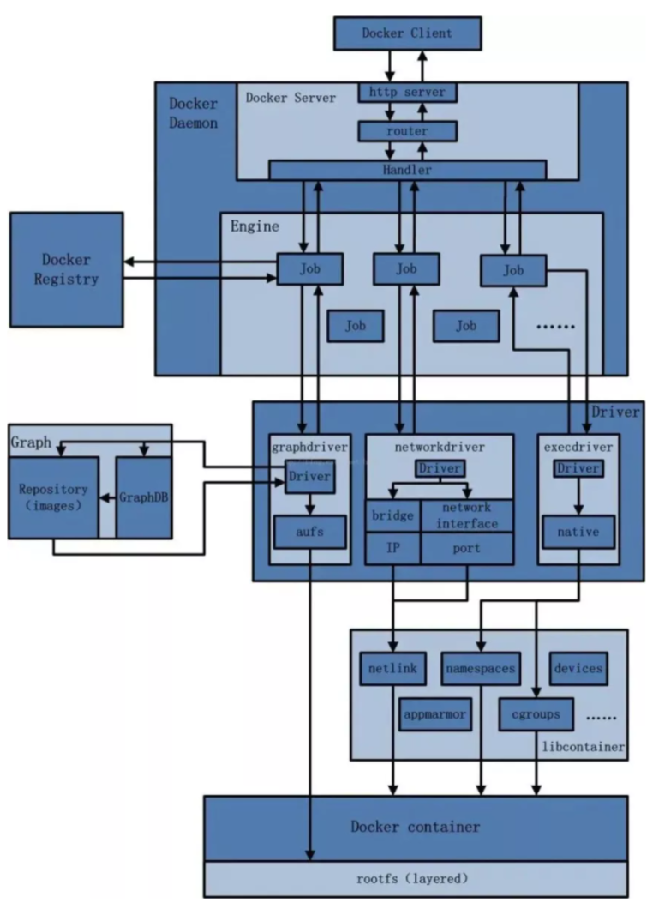