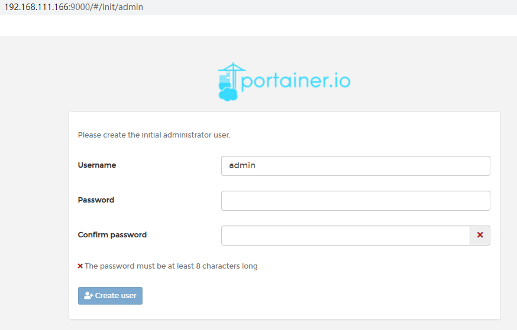
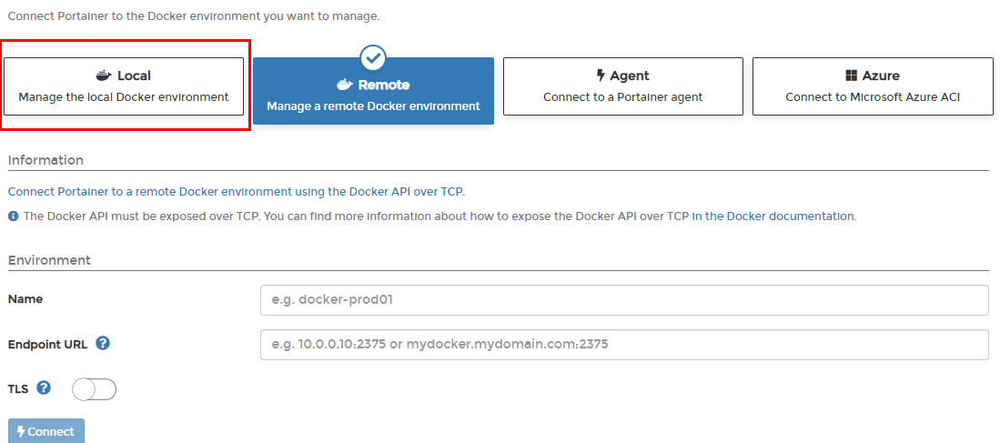
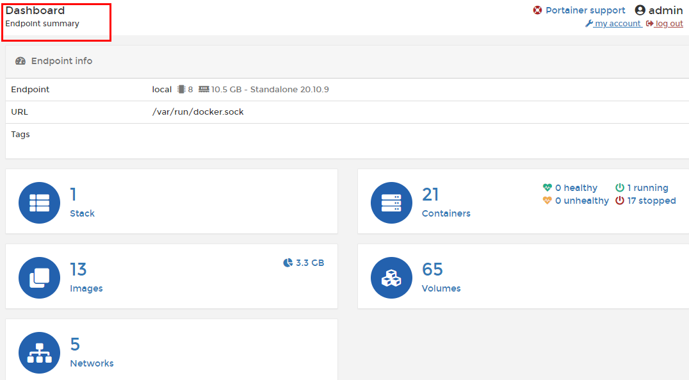
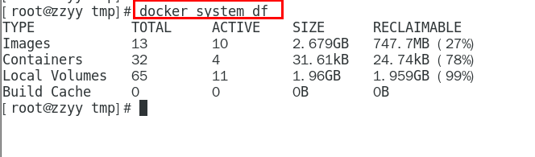
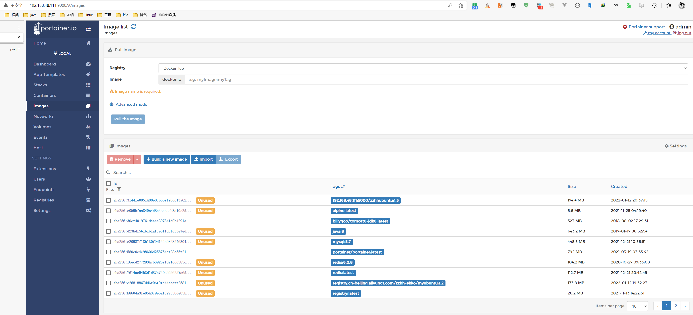

# Docker轻量级可视化工具Portainer

## 1. 是什么

Portainer 是一款轻量级的应用，它提供了图形化界面，用于方便地管理Docker环境，包括单机环境和集群环境。


## 2. 安装

### 2.1 官网

https://www.portainer.io/

https://docs.portainer.io/v/ce-2.9/start/install/server/docker/linux

### 2.2 步骤

1. docker命令安装

   ```sh
   docker run -d -p 8000:8000 -p 9000:9000 --name portainer     --restart=always     -v /var/run/docker.sock:/var/run/docker.sock     -v portainer_data:/data     portainer/portainer
   ```

   

2. 第一次登录需创建admin，访问地址：xxx.xxx.xxx.xxx:9000

   用户名，直接用默认admin，密码记得8位，随便你写

   

3. 设置admin用户和密码后首次登陆

   

4. 选择local选项卡后本地docker详细信息展示

   

5. 上一步的图形展示，能想得起对应命令吗？

   




## 3. 登陆并演示介绍常用操作case

