# 容器监控之CAdvisor+InfluxDB+Granfana

## 原生命令

```sh
docker stats
```

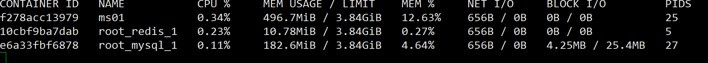

通过docker stats命令可以很方便的看到当前宿主机上所有容器的CPU,内存以及网络流量等数据，一般小公司够用了。。。。

但是，docker stats统计结果只能是当前宿主机的全部容器，数据资料是实时的，没有地方存储、没有健康指标过线预警等功能

## 是什么

### 容器监控3剑客


CAdvisor监控收集+InfluxDB存储数据+Granfana展示图表

#### CAdvisor

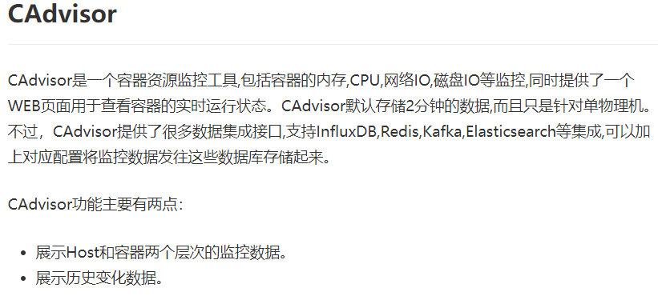

#### InfluxDB

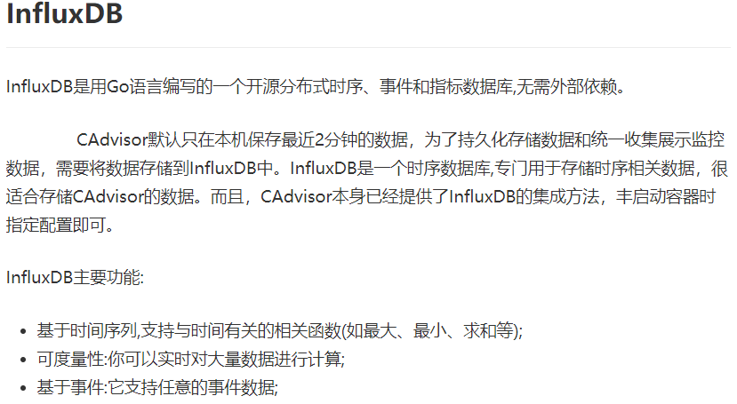


#### Granfana

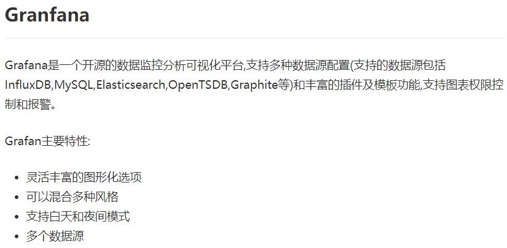

#### 总结


## compose容器编排，一套带走

### 新建目录


### 新建3件套组合的docker-compose.yml

```yaml
version: '3.1'
 
volumes:
  grafana_data: {}
 
services:
 influxdb:
  image: tutum/influxdb:0.9
  restart: always
  environment:
    - PRE_CREATE_DB=cadvisor
  ports:
    - "8083:8083"
    - "8086:8086"
  volumes:
    - ./data/influxdb:/data
 
 cadvisor:
  image: google/cadvisor
  links:
    - influxdb:influxsrv
  command: -storage_driver=influxdb -storage_driver_db=cadvisor -storage_driver_host=influxsrv:8086
  restart: always
  ports:
    - "8080:8080"
  volumes:
    - /:/rootfs:ro
    - /var/run:/var/run:rw
    - /sys:/sys:ro
    - /var/lib/docker/:/var/lib/docker:ro
 
 grafana:
  user: "104"
  image: grafana/grafana
  user: "104"
  restart: always
  links:
    - influxdb:influxsrv
  ports:
    - "3000:3000"
  volumes:
    - grafana_data:/var/lib/grafana
  environment:
    - HTTP_USER=admin
    - HTTP_PASS=admin
    - INFLUXDB_HOST=influxsrv
    - INFLUXDB_PORT=8086
    - INFLUXDB_NAME=cadvisor
    - INFLUXDB_USER=root
    - INFLUXDB_PASS=root
```

### 启动docker-compose文件

```sh
docker-compose up
```

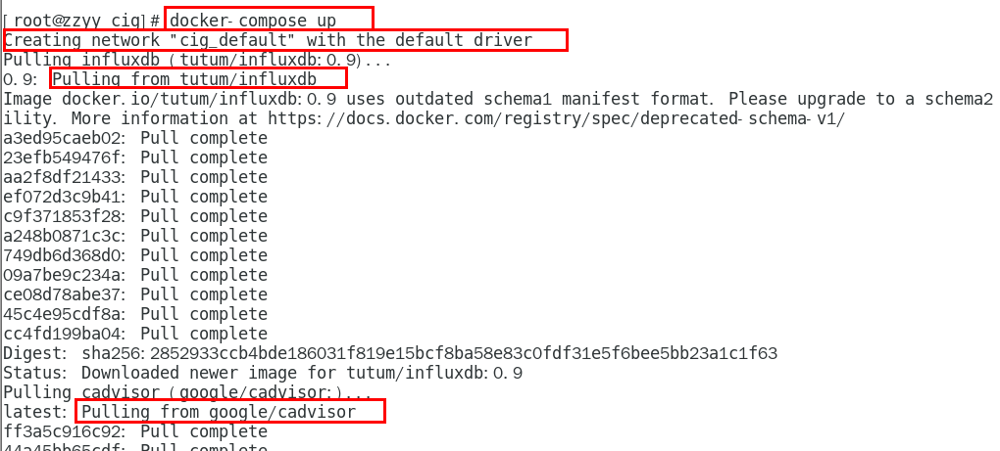

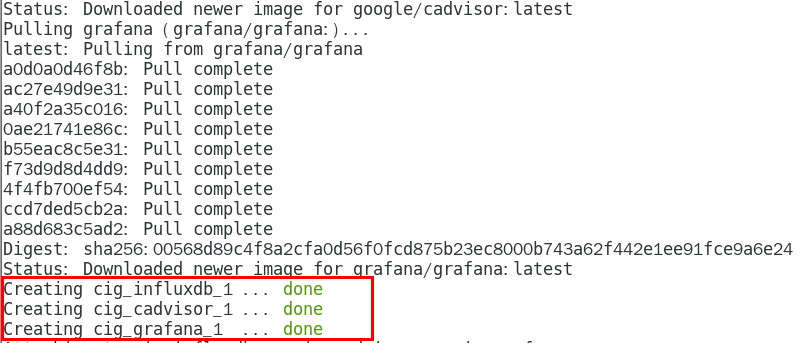

### 查看三个服务容器是否启动

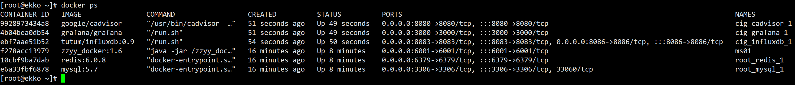

### 测试

```sh
#浏览cAdvisor收集服务，http://ip:8080/
http://192.168.48.111:8080/containers/
```

cadvisor也有基础的图形展现功能，这里主要用它来作数据采集


```sh
#浏览influxdb存储服务，http://ip:8083/
http://192.168.48.111:8083/
```


```sh
#浏览grafana展现服务，http://ip:3000,ip+3000端口的方式访问,默认帐户密码（admin/admin）
http://192.168.48.111:3000/
```

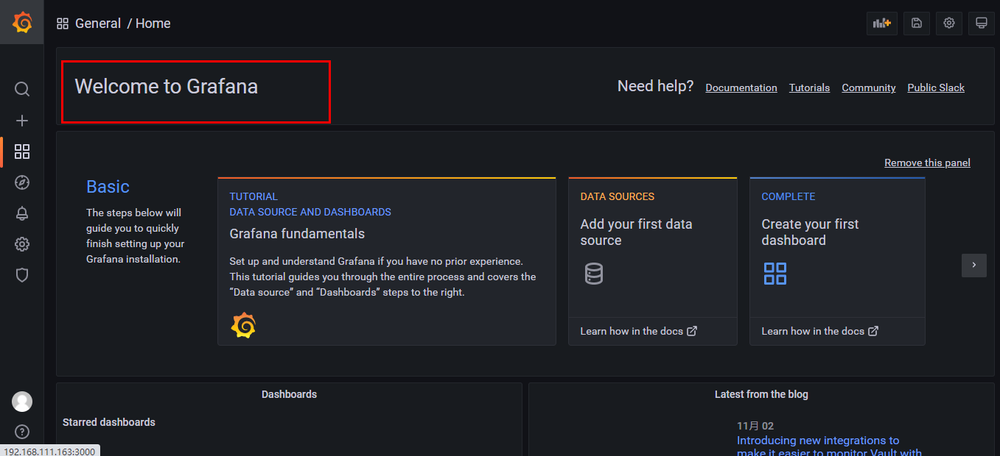

配置步骤：

1. 配置数据源

   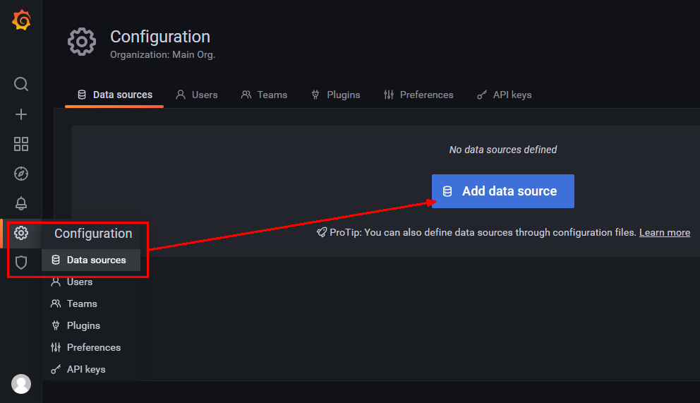

2. 选择influxdb数据源

   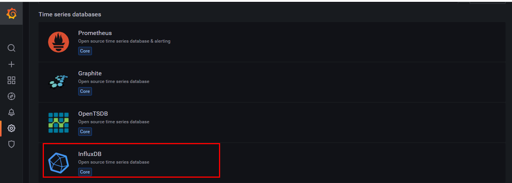

3. 配置细节

   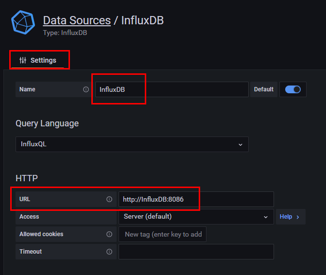

   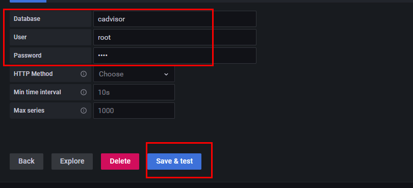

   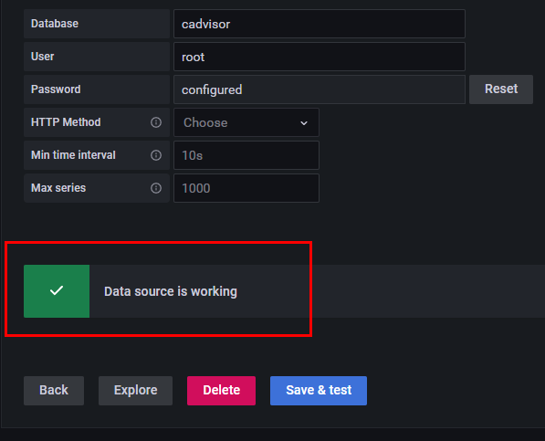

   

   

4. 配置面板panel

   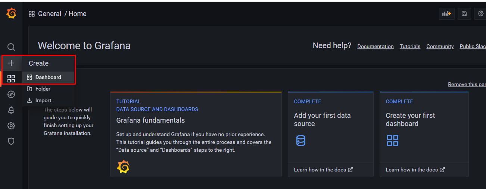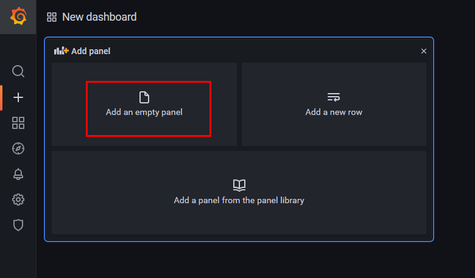

   

   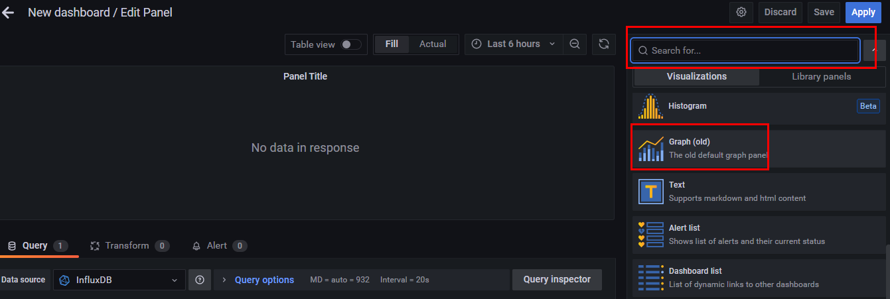

   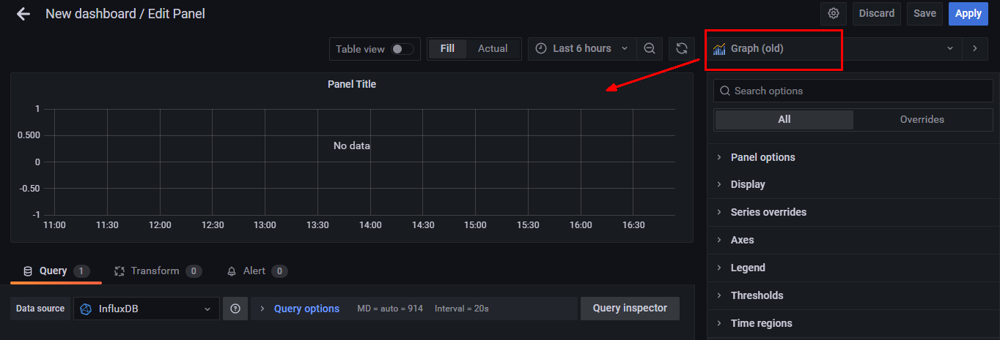

   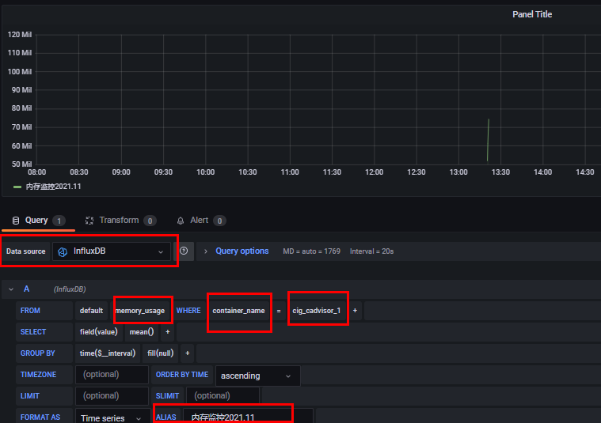

   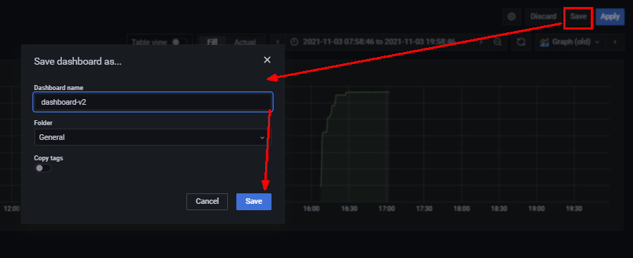

   

5. 到这里cAdvisor+InfluxDB+Grafana容器监控系统就部署完成了

   

   

   

   

