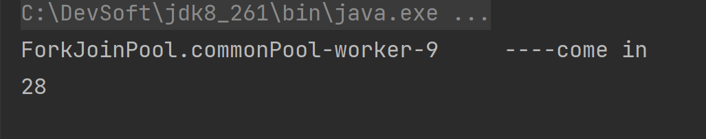

# CompletableFuture

## 1. Future和Callable接口

`Future`接口定义了操作**异步任务执行一些方法**，如获取异步任务的执行结果、取消任务的执行、判断任务是否被取消、判断任务执行是否完毕等。


`Callable`接口中定义了需要有返回的任务需要实现的方法。

```java
@FunctionalInterface
public interface Callable<V> {
    /**
     * Computes a result, or throws an exception if unable to do so.
     *
     * @return computed result
     * @throws Exception if unable to compute a result
     */
    V call() throws Exception;
}
```

比如主线程让一个子线程去执行任务，子线程可能比较耗时，启动子线程开始执行任务后，主线程就去做其他事情了，过了一会才去获取子任务的执行结果。

## 2. 从之前的FutureTask说起

本源的Future接口相关架构：


### 1、get()阻塞

一旦调用get()方法，不管是否计算完成都会导致阻塞，o(╥﹏╥)o

```java
private static void method1() throws InterruptedException, ExecutionException, TimeoutException {
        FutureTask<Integer> futureTask = new FutureTask<>(() -> {
            System.out.println(Thread.currentThread().getName() + "\t ----come in");
            try { TimeUnit.SECONDS.sleep(3); } catch (InterruptedException e) {e.printStackTrace();}
            return 10;
        });

        new Thread(futureTask,"t1").start();
        //不见不散。出现get方法，不管是否计算完成都阻塞等待结果出来再运行
        //System.out.println(futureTask.get());

        //过时不候。3秒钟才出现结果，我只等1秒钟
        System.out.println(Thread.currentThread().getName() + "\t" + futureTask.get(1L,TimeUnit.SECONDS));
    }
```

### 2、isDone()轮询

轮询的方式会耗费无谓的CPU资源，而且也不见得能及时地得到计算结果。

如果想要异步获取结果,通常都会以轮询的方式去获取结果
尽量不要阻塞


```java
private static void method2() throws InterruptedException, ExecutionException {
        FutureTask<Integer> futureTask = new FutureTask<>(() ->{
            System.out.println(Thread.currentThread().getName() + "\t come in");
            try { TimeUnit.SECONDS.sleep(3); } catch (InterruptedException e) {e.printStackTrace();}
            return 10;
        });

        //new Thread(futureTask,"t1").start();
        Executors.newSingleThreadExecutor().submit(futureTask,new Integer(0));

        while (true){
            if (futureTask.isDone()) {
                System.out.println("result = " + futureTask.get());
                break;
            }
            System.out.println("还在计算中！");
        }
    }
```

> 想完成一些复杂的任务？
>
> 1、应对Future的完成时间，完成了可以告诉我，也就是我们的回调通知
>
> 2、将两个异步计算合成一个异步计算，这两个异步计算互相独立，同时第二个又依赖第一个的结果。
>
> 3、当Future集合中某个任务最快结束时，返回结果。
>
> 4、等待Future结合中的所有任务都完成。
>
> ......

## 3. 对Future的改进

### 1、CompletableFuture和CompletionStage源码分别介绍


接口CompletionStage是什么？

代表异步计算过程中的某一个阶段，一个阶段完成以后可能会触发另外一个阶段，有些类似Linux系统的管道分隔符传参数。

类CompletableFuture是什么？


### 2、核心的四个静态方法，来创建一个异步操作

`runAsync` 无返回值

```java
public static CompletableFuture<Void> runAsync(Runnable runnable);
public static CompletableFuture<Void> runAsync(Runnable runnable,Executor executor)
```

`supplyAsync` 有返回值

```java
public static <U> CompletableFuture<U> supplyAsync(Supplier<U> supplier);
public static <U> CompletableFuture<U> supplyAsync(Supplier<U> supplier,Executor executor)
```

上述`Executor executor`参数说明：

- 没有指定Executor的方法，直接使用默认的ForkJoinPool.commonPool() 作为它的线程池执行异步代码。
- 如果指定线程池，则使用我们自定义的或者特别指定的线程池执行异步代码

```java
	/**
     * 无返回值
     * @throws InterruptedException
     * @throws ExecutionException
     */
    private static void m1() throws InterruptedException, ExecutionException {
        CompletableFuture<Void> future = CompletableFuture.runAsync(() -> {
            System.out.println(Thread.currentThread().getName() + "\t ----come in");
            try {
                TimeUnit.SECONDS.sleep(1);
            } catch (InterruptedException e) {
                e.printStackTrace();
            }
            System.out.println("----task over");

        });
        System.out.println(future.get());
    }
```


```java
    /**
     * 有返回值
     * @throws InterruptedException
     * @throws ExecutionException
     */
    private static void m2() throws InterruptedException, ExecutionException {
        CompletableFuture<Integer> future = CompletableFuture.supplyAsync(() -> {
            System.out.println(Thread.currentThread().getName() + "\t ----come in");
            try {
                TimeUnit.SECONDS.sleep(1);
            } catch (InterruptedException e) {
                e.printStackTrace();
            }
            return 28;
        });
        System.out.println(future.get());
    }
```



### 3、Code之通用演示，减少阻塞和轮询

从Java8开始引入了CompletableFuture，它是Future的功能增强版，
可以传入回调对象，当异步任务完成或者发生异常时，自动调用回调对象的回调方法。

```java
    private static void m3() {
        CompletableFuture.supplyAsync(() -> {
            System.out.println(Thread.currentThread().getName() + "\t ---come in");
            int result = ThreadLocalRandom.current().nextInt(10);
            try {
                TimeUnit.SECONDS.sleep(1);
            } catch (InterruptedException e) {
                e.printStackTrace();
            }
            System.out.println("-----计算结束耗时1秒钟，result: " + result);
            if (result > 6) {
                int age = 10 / 0;
            }
            return result;
        }).whenComplete((v, e) -> {
            if (null == e) {
                System.out.println("-----result: " + v);
            }
        }).exceptionally(e -> {
            System.out.println("----exception: " + e.getCause() + "\t" + e.getMessage());
            return -1;
        });
        //主线程不要立刻结束，否则CompletableFuture默认使用的线程池会立刻关闭:暂停3秒钟线程
        //自定义线程池记得关闭
        try { TimeUnit.SECONDS.sleep(3); } catch (InterruptedException e) {e.printStackTrace();}
    }
```

### 4、CompletableFuture的优点

- 异步任务结束时，会自动回调某个对象的方法；
- 异步任务出错时，会自动回调某个对象的方法；
- 主线程设置好回调后，不再关心异步任务的执行，异步任务之间可以顺序执行

## 4. 案例精讲—从电商网站的比价需求说起

### 1、函数式编程已经主流

Lambda +Stream+链式调用+Java8函数式编程带走


### 2、先说说join和get对比

1、join()和get()方法都是用来获取CompletableFuture异步之后的返回值。

2、join()方法抛出的是uncheck异常（即RuntimeException),不会强制开发者抛出，会将异常包装成CompletionException异常 /CancellationException异常，但是本质原因还是代码内存在的真正的异常。

3、get()方法抛出的是经过检查的异常，ExecutionException, InterruptedException 需要用户手动处理（抛出或者 try catch）。

### 3、大厂业务需求说明

- 切记，功能→性能

- 对内微服务多系统调用

- 对外网站比价

   

  ```
  经常出现在等待某条 SQL 执行完成后，再继续执行下一条 SQL ，而这两条 SQL 本身是并无关系的，可以同时进行执行的。
  
  我们希望能够两条 SQL 同时进行处理，而不是等待其中的某一条 SQL 完成后，再继续下一条。同理，
  对于分布式微服务的调用，按照实际业务，如果是无关联step by step的业务，可以尝试是否可以多箭齐发，同时调用。
  
  我们去比同一个商品在各个平台上的价格，要求获得一个清单列表，
  1 step by step，查完京东查淘宝，查完淘宝查天猫......
  
  2 all   一口气同时查询。。。。。
  ```

### 4、一波流Java8函数式编程带走

```java
package com.ekko.juc.cf;

import lombok.Getter;

import java.util.Arrays;
import java.util.List;
import java.util.concurrent.CompletableFuture;
import java.util.concurrent.ThreadLocalRandom;
import java.util.concurrent.TimeUnit;
import java.util.stream.Collectors;

/**
 * @ClassName T1
 * @Description <description class purpose>
 * @Author zhanghao
 * @Create 2022年10月19日 11:17:40
 */
public class T1
{
    static List<NetMall> list = Arrays.asList(
            new NetMall("jd"),
            new NetMall("tmall"),
            new NetMall("pdd"),
            new NetMall("mi")
    );

    public static List<String> findPriceSync(List<NetMall> list,String productName)
    {
        return list.stream().map(mall -> String.format(productName+" %s price is %.2f",mall.getNetMallName(),mall.getPriceByName(productName))).collect(Collectors.toList());
    }

    public static List<String> findPriceASync(List<NetMall> list,String productName)
    {
        return list.stream().map(mall -> CompletableFuture.supplyAsync(() -> String.format(productName + " %s price is %.2f", mall.getNetMallName(), mall.getPriceByName(productName)))).collect(Collectors.toList()).stream().map(CompletableFuture::join).collect(Collectors.toList());
    }


    public static void main(String[] args)
    {
        long startTime = System.currentTimeMillis();
        List<String> list1 = findPriceSync(list, "thinking in java");
        for (String element : list1) {
            System.out.println(element);
        }
        long endTime = System.currentTimeMillis();
        System.out.println("----costTime: "+(endTime - startTime) +" 毫秒");

        long startTime2 = System.currentTimeMillis();
        List<String> list2 = findPriceASync(list, "thinking in java");
        for (String element : list2) {
            System.out.println(element);
        }
        long endTime2 = System.currentTimeMillis();
        System.out.println("----costTime: "+(endTime2 - startTime2) +" 毫秒");
    }
}

class NetMall
{
    @Getter
    private String netMallName;

    public NetMall(String netMallName)
    {
        this.netMallName = netMallName;
    }

    public double getPriceByName(String productName)
    {
        return calcPrice(productName);
    }

    private double calcPrice(String productName)
    {
        try { TimeUnit.SECONDS.sleep(1); } catch (InterruptedException e) { e.printStackTrace(); }
        return ThreadLocalRandom.current().nextDouble() + productName.charAt(0);
    }
}

```


## 5. CompletableFuture常用方法

### 1、获得结果和触发计算

获取结果：

```java
public T    get();//不见不散
public T    get(long timeout, TimeUnit unit);//过时不候
public T    getNow(T valueIfAbsent);//没有计算完成的情况下，给我一个替代结果;立即获取结果不阻塞,计算完，返回计算完成后的结果;没算完，返回设定的valueIfAbsent值
public T    join()
```

```java
    private static void m1() {
        CompletableFuture<Integer> future = CompletableFuture.supplyAsync(() -> {
            try {
                TimeUnit.SECONDS.sleep(3);
            } catch (InterruptedException e) {
                e.printStackTrace();
            }
            return 11;
        });
        try { TimeUnit.SECONDS.sleep(2); } catch (InterruptedException e) {e.printStackTrace();}
        System.out.println(future.getNow(33));
    }
```

主动触发计算：

```java
public boolean complete(T value);//是否打断get方法立即返回括号值
```

```java
private static void m2() throws InterruptedException, ExecutionException {
        CompletableFuture<Integer> future = CompletableFuture.supplyAsync(() -> {
            try {
                TimeUnit.SECONDS.sleep(1);
            } catch (InterruptedException e) {
                e.printStackTrace();
            }
            return 1;
        });

        //注释掉暂停线程，get还没有算完只能返回complete方法设置的444；暂停2秒钟线程，异步线程能够计算完成返回get
        //try { TimeUnit.SECONDS.sleep(2); } catch (InterruptedException e) {e.printStackTrace();}

        //当调用CompletableFuture.get()被阻塞的时候,complete方法就是结束阻塞并get()获取设置的complete里面的值.
        System.out.println(future.complete(444)+"\t"+future.get());
    }
```

### 2、对计算结果进行处理

thenApply：计算结果存在依赖关系，这两个线程串行化

```java
    private static void m3() {
        CompletableFuture.supplyAsync(()->{
           try { TimeUnit.SECONDS.sleep(1); } catch (InterruptedException e) {e.printStackTrace();}
            System.out.println("111");
           return 1024;
        }).thenApply(f->{
            System.out.println("222");
            return f+1;
        }).thenApply(f ->{
            //int age = 10/0;
            System.out.println("333");
            return f+1;
        }).whenCompleteAsync((v,e)->{
            System.out.println("---v: " +v);
        }).exceptionally(e->{
            e.printStackTrace();
            return null;
        });

        System.out.println("主线程结束，END");
        try { TimeUnit.SECONDS.sleep(3); } catch (InterruptedException e) {e.printStackTrace();}
    }
```

由于存在依赖关系(当前步错，不走下一步)，当前步骤有异常的话就叫停。


handle：有异常也可以往下一步走，根据带的异常参数可以进一步处理

```java
    private static void m4() {
        CompletableFuture.supplyAsync(()->{
           try { TimeUnit.SECONDS.sleep(1); } catch (InterruptedException e) {e.printStackTrace();}
            System.out.println("111");
           return 1;
        }).handle((f,e)->{
            int a = 10/0;
            System.out.println("222");
            return f+1;
        }).handle((f,e)->{
            System.out.println("333");
            return f+1;
        }).whenCompleteAsync((v,e)->{
            System.out.println("v =  " +v);
        }).exceptionally(e ->{
            e.printStackTrace();
            return null;
        });

        System.out.println("主线程结束，END");
        try { TimeUnit.SECONDS.sleep(3); } catch (InterruptedException e) {e.printStackTrace();}
```


总结：


### 3、对计算结果进行消费

接收任务的处理结果，并消费处理，无返回结果

thenAccept

```java
    private static void m5() {
        CompletableFuture.supplyAsync(()->{
            return 1;
        }).thenApply(f->{
            return f+1;
        }).thenAccept(f ->{
            System.out.println("f = " +f);
        });
    }
```

Code之任务之间的顺序执行：

thenRun(Runnable runnable)：任务 A 执行完执行 B，并且 B 不需要 A 的结果

thenAccept(Consumer action)：任务 A 执行完执行 B，B 需要 A 的结果，但是任务 B 无返回值

thenApply(Function fn)：任务 A 执行完执行 B，B 需要 A 的结果，同时任务 B 有返回值

```java
 
System.out.println(CompletableFuture.supplyAsync(() -> "resultA").thenRun(() -> {}).join());
 

System.out.println(CompletableFuture.supplyAsync(() -> "resultA").thenAccept(resultA -> {}).join());


System.out.println(CompletableFuture.supplyAsync(() -> "resultA").thenApply(resultA -> resultA + " resultB").join());
 

```


### 4、对计算速度进行选用

谁快用谁；applyToEither

```java
private static void m7() throws InterruptedException, ExecutionException {
        CompletableFuture<Integer> completableFuture1 = CompletableFuture.supplyAsync(() -> {
            System.out.println(Thread.currentThread().getName() + "\t" + "---come in ");
            //暂停几秒钟线程
            try { TimeUnit.SECONDS.sleep(2); } catch (InterruptedException e) { e.printStackTrace(); }
            return 10;
        });

        CompletableFuture<Integer> completableFuture2 = CompletableFuture.supplyAsync(() -> {
            System.out.println(Thread.currentThread().getName() + "\t" + "---come in ");
            try { TimeUnit.SECONDS.sleep(1); } catch (InterruptedException e) { e.printStackTrace(); }
            return 20;
        });

        CompletableFuture<Integer> thenCombineResult = completableFuture1.applyToEither(completableFuture2,f -> {
            System.out.println(Thread.currentThread().getName() + "\t" + "---come in ");
            return f + 1;
        });

        System.out.println(Thread.currentThread().getName() + "\t" + thenCombineResult.get());
    }
```


### 5、对计算结果进行合并

两个CompletionStage任务都完成后，最终能把两个任务的结果一起交给thenCombine 来处理

先完成的先等着，等待其它分支任务

thenCombine；

```java
    private static void m8() throws InterruptedException, ExecutionException {
        CompletableFuture<Integer> future = CompletableFuture.supplyAsync(() -> {
            System.out.println(Thread.currentThread().getName() + "\t  ---come in");
            return 10;
        });

        CompletableFuture<Integer> future1 = CompletableFuture.supplyAsync(() -> {
            System.out.println(Thread.currentThread().getName() + "\t  ---come in");
            return 20;
        });

        CompletableFuture<Integer> combine = future.thenCombine(future1, (x, y) -> {
            System.out.println(Thread.currentThread().getName() + "\t  ---come in");
            return x + y;
        });

        System.out.println(combine.get());
    }
```

```java
    private static void m9() throws InterruptedException, ExecutionException {
        CompletableFuture<Integer> thenCombineResult = CompletableFuture.supplyAsync(() -> {
            System.out.println(Thread.currentThread().getName() + "\t" + "---come in 1");
            return 10;
        }).thenCombine(CompletableFuture.supplyAsync(() -> {
            System.out.println(Thread.currentThread().getName() + "\t" + "---come in 2");
            return 20;
        }), (x,y) -> {
            System.out.println(Thread.currentThread().getName() + "\t" + "---come in 3");
            return x + y;
        }).thenCombine(CompletableFuture.supplyAsync(() -> {
            System.out.println(Thread.currentThread().getName() + "\t" + "---come in 4");
            return 30;
        }),(a,b) -> {
            System.out.println(Thread.currentThread().getName() + "\t" + "---come in 5");
            return a + b;
        });
        System.out.println("-----主线程结束，END");
        System.out.println(thenCombineResult.get());


        // 主线程不要立刻结束，否则CompletableFuture默认使用的线程池会立刻关闭:
        try { TimeUnit.SECONDS.sleep(10); } catch (InterruptedException e) { e.printStackTrace(); }
    }
```

