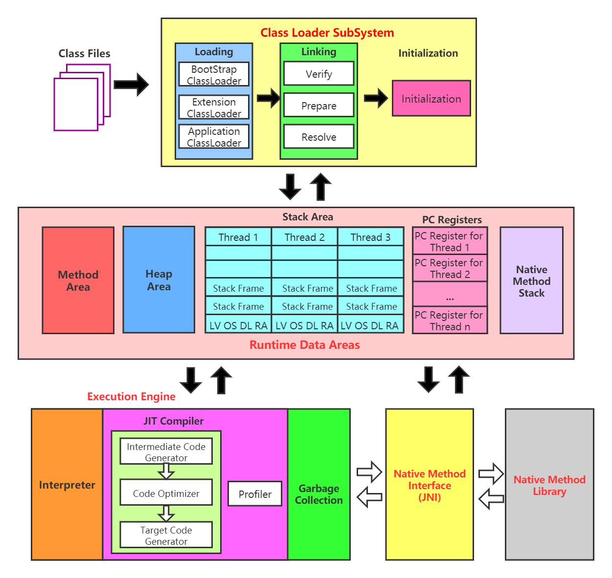

# java虚拟机知识总结
学习java虚拟机的底层原理，JVM的整体结构如下

## 内存与垃圾回收

- [01_类加载子系统](./docs/内存与垃圾回收/01_类加载子系统.md)
- [02_运行时数据区概述及线程](./docs/内存与垃圾回收/02_运行时数据区概述及线程.md)

- [03_程序计数器](./docs/内存与垃圾回收/03_程序计数器.md)
- [04_虚拟机栈](./docs/内存与垃圾回收/04_虚拟机栈.md)
- [05_本地方法接口](./docs/内存与垃圾回收/05_本地方法接口.md)
- [06_本地方法栈](./docs/内存与垃圾回收/06_本地方法栈.md)
- [07_堆](./docs/内存与垃圾回收/07_堆.md)
- [08_方法区](./docs/内存与垃圾回收/08_方法区.md)
- [09_对象的实例化内存布局与访问定位](./docs/内存与垃圾回收/09_对象的实例化内存布局与访问定位.md)
- [10_直接内存](./docs/内存与垃圾回收/10_直接内存.md)
- [11_执行引擎](./docs/内存与垃圾回收/11_执行引擎.md)
- [12_StringTable](./docs/内存与垃圾回收/12_StringTable.md)
- [13_垃圾回收概述](./docs/内存与垃圾回收/13_垃圾回收概述.md)
- [14_垃圾回收相关算法](./docs/内存与垃圾回收/14_垃圾回收相关算法.md)
- [15_垃圾回收相关概念](./docs/内存与垃圾回收/15_垃圾回收相关概念.md)
- [16_垃圾回收器](./docs/内存与垃圾回收/16_垃圾回收器.md)

## 字节码与类的加载

- [01_Class文件结构](./docs/字节码与类的加载/01_Class文件结构.md)
- [02_字节码指令集与解析举例](./docs/字节码与类的加载/02_字节码指令集与解析举例.md)
- [03_类的加载过程详解](./docs/字节码与类的加载/03_类的加载过程详解.md)
- [04_再谈类的加载](./docs/字节码与类的加载/04_再谈类的加载.md)
- [05_JVM指令手册](./docs/字节码与类的加载/05_JVM指令手册.md)

- [06_Class字节码文件结构](./docs/字节码与类的加载/06_Class字节码文件结构.md)

## 性能监控和调优

- [01_概述](./docs/性能监控和调优/01_概述.md)

- [02_JVM监控及诊断工具-命令行](./docs/性能监控和调优/02_JVM监控及诊断工具-命令行.md)

- [03_JVM监控及诊断工具-GUI](./docs/性能监控和调优/03_JVM监控及诊断工具-GUI.md)

- [04_JVM运行时参数](./docs/性能监控和调优/04_JVM运行时参数.md)

- [05_分析GC日志](./docs/性能监控和调优/05_分析GC日志.md)