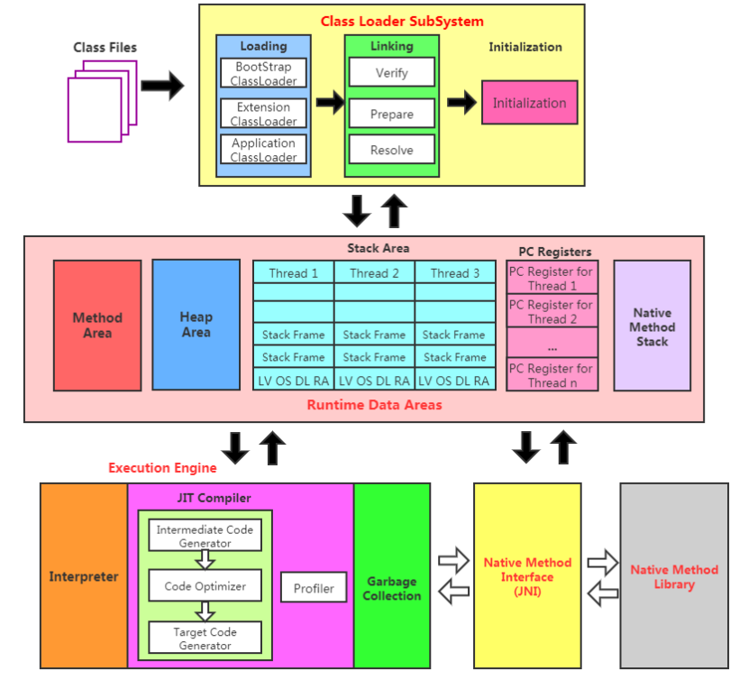

# java虚拟机知识总结
学习java虚拟机的底层原理，JVM的整体结构如下

## 内存与垃圾回收

- [01_类加载子系统](https://github.com/ekko1994/doc/tree/master/jvm/docs/内存与垃圾回收/01_类加载子系统.md)

- [02_运行时数据区](https://github.com/ekko1994/doc/tree/master/jvm/docs/内存与垃圾回收/02_运行时数据区.md)

- [03_本地方法接口](https://github.com/ekko1994/doc/tree/master/jvm/docs/内存与垃圾回收/03_本地方法接口.md)

- [04_对象的实例化内存布局访问定位](https://github.com/ekko1994/doc/tree/master/jvm/docs/内存与垃圾回收/04_对象的实例化内存布局访问定位.md)

- [05_直接内存](https://github.com/ekko1994/doc/tree/master/jvm/docs/内存与垃圾回收/05_直接内存.md)

- [06_执行引擎](https://github.com/ekko1994/doc/tree/master/jvm/docs/内存与垃圾回收/06_执行引擎.md)

- [07_String类](https://github.com/ekko1994/doc/tree/master/jvm/docs/内存与垃圾回收/07_String类.md)

- [08_垃圾回收](https://github.com/ekko1994/doc/tree/master/jvm/docs/内存与垃圾回收/08_垃圾回收.md)

## 字节码与类的加载

- [01_Class文件结构](https://github.com/ekko1994/doc/tree/master/jvm/docs/字节码与类的加载/01_Class文件结构.md)
- [02_字节码指令集与解析举例](https://github.com/ekko1994/doc/tree/master/jvm/docs/字节码与类的加载/02_字节码指令集与解析举例.md)
- [03_类的加载过程详解](https://github.com/ekko1994/doc/tree/master/jvm/docs/字节码与类的加载/03_类的加载过程详解.md)
- [04_再谈类的加载](https://github.com/ekko1994/doc/tree/master/jvm/docs/字节码与类的加载/04_再谈类的加载.md)
- [05_JVM指令手册](https://github.com/ekko1994/doc/tree/master/jvm/docs/字节码与类的加载/05_JVM指令手册.md)

## 性能监控和调优

- [01_概述](https://github.com/ekko1994/doc/tree/master/jvm/docs/性能监控和调优/01_概述.md)
- [02_JVM监控及诊断工具-命令行](https://github.com/ekko1994/doc/tree/master/jvm/docs/性能监控和调优/02_JVM监控及诊断工具-命令行.md)

- [03_JVM监控及诊断工具-GUI](https://github.com/ekko1994/doc/tree/master/jvm/docs/性能监控和调优/04_JVM监控及诊断工具-GUI.md)

- [04_JVM运行时参数](https://github.com/ekko1994/doc/tree/master/jvm/docs/性能监控和调优/04_JVM运行时参数.md)

