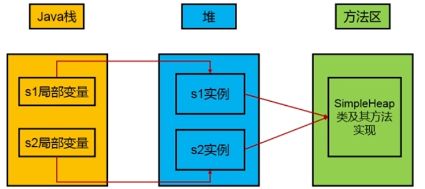
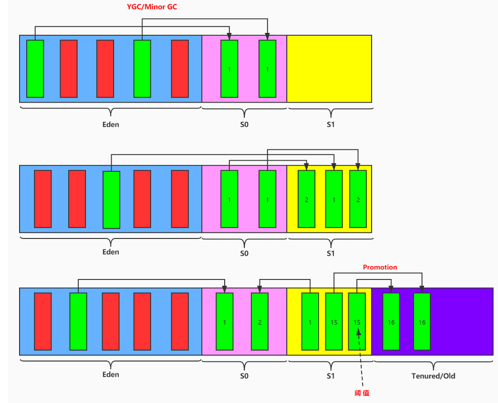
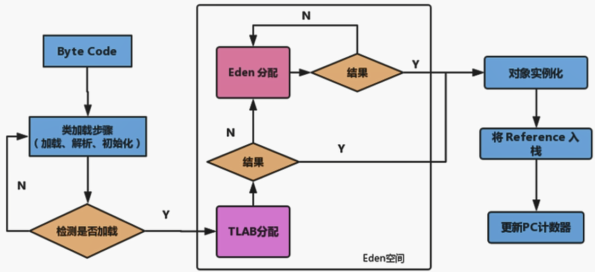
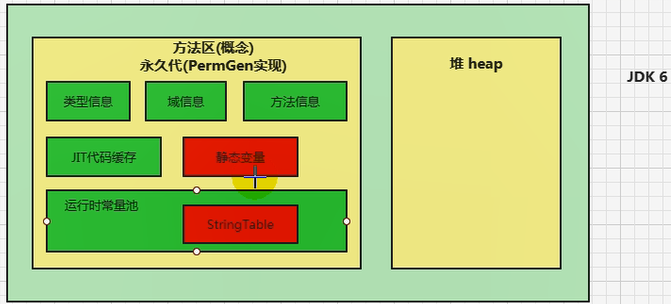
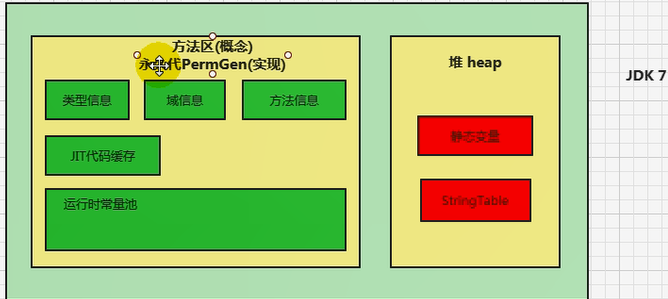
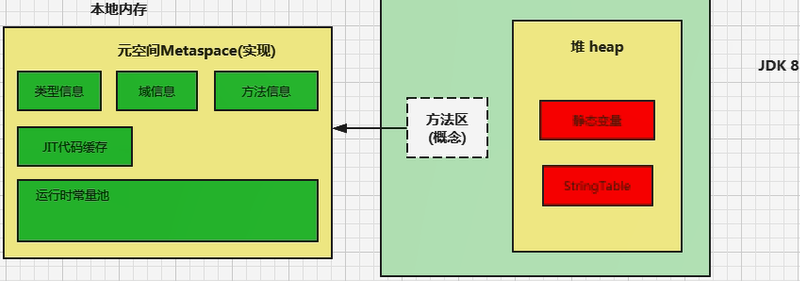

# 运行时数据区


- 每个线程：程序计数器、栈、本地栈。
- 线程间共享：堆、堆外内存（永久代或元空间、代码缓存）。
  - 每个JVM只有一个`Runtime`实例

## 线程

- 线程是一个程序里的运行单元。JVM允许一个应用有多个线程运行的执行。
- 在HotSpot JVM里，每个线程都与操作系统的本地线程直接映射。
  - 当一个Java线程准备好执行之后，此时一个操作系统的本地线程也同时创建。Java线程执行终止后，本地线程也会回收。
- 操作系统负责所有线程的安排调度到任何一个可用的CPU上。一旦本地线程初始化成功，它就会调用Java线程中的`run()`方法。

## 程序计数器（PC寄存器）

PC寄存器用来存储指向下一条指令的地址，也即将要执行的指令代码。由执行引擎读取下一条指令。


- 它是一块很小的内存空间，几乎可以忽略不计。也是运行最快的存储区域。
- 在JVM规范中，每个线程都有它自己的程序计数器，是线程私有的，生命周期与线程的生命周期保持一致。
- 任何时间一个线程都只有一个方法在执行，也就是所谓的当前方法。程序计数器会存储当前线程正在执行的Java方法的JVM指令地址；或者，如果是在执行native方法，则是未指定值（undefined）。
- 它是程序控制流的指示器，分支、循环、跳转、异常处理、线程恢复等基础功能都需要依赖这个计数器来完成。
- 字节码解释器工作时就是通过改变这个计数器的值来选取下一条需要执行的字节码指令。
- 它是唯一一个在Java虚拟机中没有任何`OutOfMemoryError`情况的区域。


### 两个常见问题

**使用PC寄存器存储字节码指令地址有什么用呢？为什么使用PC寄存器记录当前线程的执行地址呢？**


因为CPU需要不停的切换各个线程，这时候切换回来后，就得知道接着从哪开始继续执行。

JVM字节码解释器就需要通过改变PC寄存器的值来明确下一条应该执行什么样的字节码指令。

**PC寄存器为什么会被设定为线程私有？**


我们知道多线程在一个特定的时间段内只会执行某一个线程的方法，CPU会不停地任务切换，这样必会导致经常中断或回复，如何保证分毫无差呢？为了能够准确地记录各个线程正在执行的当前字节码指令地址，最好的办法自然是为每一个线程都分配一个PC寄存器，这样一来各个线程之间便可以进行独立计算，从而不会出现相互干扰的情况。

## 虚拟机栈

 Java的指令都是根据栈来设计的，优点是跨平台，指令集小，编译器容易实现，缺点是性能下降，实现同样的功能需要更多的指令。

**栈是运行时的单位，而堆是存储的单位。**

- 一个栈帧对应一个方法。

- 生命周期和线程一致。

- 栈主管Java程序的运行，保存了方法的局部变量（8种基本数据类型、对象的引用地址）、部分结果，并参与方法的调用和返回。
- 栈是一种快速有效的分配存储方式，访问速度仅次于程序计数器。
- JVM直接对Java栈的操作只有两个
  - 每个方法执行，伴随着进栈（入栈、压栈）。
  - 执行结束后的出栈工作。
- 对于栈来说不存在垃圾回收问题。

- 如果采用固定大小的Java虚拟机栈，那每一个线程的Java虚拟机栈容量可以在线程创建时独立选定。如果线程请求分配的栈容量超过Java虚拟机栈允许的最大容量，Java虚拟机将会抛出`java.lang.StackOverflowError`异常。
- 如果Java虚拟机栈可以动态扩展，并且在尝试扩展的时候无法申请到足够的内存，或者在创建新的线程时没有足够的内存去创建对应的虚拟机栈，那Java虚拟机将会抛出OOM异常。

```java
// java.lang.StackOverflowError
public class Main {
    public static void main(String[] args) {
        main(args);
    }
}
```

> -Xss256k：设置栈的大小

### 栈的存储单位


- 每个线程都有自己的栈，栈中的数据都是以栈帧（Stack Frame）的格式存在。
- 在这个线程上正在执行的每个方法都各自对应一个栈帧。
- 栈帧是一个内存区块，是一个数据集，维系着方法执行过程中的各种数据信息。

### 栈的运行原理

- JVM直接对Java栈的操作只有两个，就是对栈帧的**压栈**和**出栈**，遵循“先进后出”（FILO）原则。
- 在一条活动线程中，一个时间点上，只有一个活动的栈帧。只有当前正在执行的方法的栈帧是有效的，这个栈帧被称为**当前栈帧**，与当前栈帧对应的方法就是当前方法，定义这个方法的类就是**当前类**。
- 执行引擎运行的所有字节码指令只针对当前栈帧进行操作。
- 如果在该方法中调用了其他方法，对应的新的栈帧会被创建出来，放子栈的顶端，称为新的当前帧。
- 不同线程中所包含的栈帧是不允许存在相互引用的， 即不可能在一个栈帧中引用另外一个线程的栈帧。
- 如果当前方法调用了其他方法 ，方法返回之际，当前栈帧会传回此方法的执行结果给前一个帧，接着虚拟机会丢弃当前栈帧，使得前一个栈帧重新成为当前栈帧。
- Java方法有两种返回函数的方式，**一种是正常的函数返回，使用`return`指令；另外一种是抛出异常。不管使用哪种方式，都会导致栈帧被弹出**。

### 栈帧的内部结构

- **局部变量表（Local Variables）**
- **操作数栈（Operand Stack 或 表达式栈）**
- 动态链接（Dynamic Linking）（指向运行时常量池的方法引用）
- 方法返回地址（Return Address）（方法正常退出或者异常退出的定义）
- 一些附加信息

### 局部变量表

- **定义为一个数字数组，主要用于存储方法参数和定义在方法体内的局部变量**，这些数据类型包括各类基本数据类型、对象引用（reference）、以及`returnAddress`类型。
- 建立在线程的栈上，是线程的私有数据，**不存在数据安全问题**。
- **局部变量表所需的容量大小是在编译期确定下来的**，并保存在方法的Code属性的`maximum local variables`数据项中。在方法运行期间是不会改变局部变量表的大小的。
- **方法嵌套调用的次数由栈的大小决定。一般来说，栈越大，方法嵌套调用次数越多。**
- **局部变量表中的变量只在当前方法调用中有效**。在方法执行时，虚拟机通过使用局部变量表完成参数值到参数变量列表的传递过程。**当方法调用结束后，随着方法栈帧的销毁，局部变量表也会随之销毁。** 

#### 关于slot的理解

- 参数值的存放总是在局部变量数组的index 0开始，到数组长度-1的索引结束。

- 局部变量表，**最基本的存储单位是slot（变量槽）**。
- 局部变量表中存放编译器可知的各种基本数据类型（8种），引用类型（reference），returnAddress类型的变量。
- 在局部变量表里，**32位以内的类型只占用一个slot（包括returnAddress类型），64位的类型（long和double）占用两个slot**
  - `byte`、`short`、`char`在存储前被转为`int`，`boolean`也被转为`int`，0表示`flase`，非0表示`true`。
  - `long`和`double`占据两个slot。
- JVM会为局部变量表中的每一个Slot都分配一个访问索引，通过这个索引即可成功访问到局部变量表中指定的局部变量值。
- 当一个实例方法被调用的时候，他的方法参数和方法内部定义的局部变量会**按照顺序被复制**到局部变量表的slot上。
- **如果访问局部变量表中一个64bit的局部变量值时，只需要使用前一个索引即可**（比如：访问`long`或`double`类型变量）。
- 如果当前栈帧是由构造方法或者实例方法创建的，那么**该对象引用`this`将会存放在index为0的slot处**。


```java
public void method1(){
    int a = 1;
    double b = 2.0;
    String str = "string";
}
```

局部变量表


#### slot的重复利用

**栈帧中的局部变量表的槽位是可以重用的**，如果一个局部变量过了其作用域，那么在其作用域之后声明的新的局部变量就很有可能复用过期局部变量的槽位，从而**达到节省资源的目的**。

```java
public void method2(){
    int a = 10;
    {
        int b = 0;
        b++;
    }
    // 变量c使用之前已经销毁的变量b占用的slot
    int c = 20;
}
```


#### 静态变量和局部变量的对比

```java
/**
 *	变量的分类：按照数据类型分：1、基本数据类型	2、引用数据类型
 *			  按照在类中声明的位置分：1、成员变量：在使用前，都经过默认初始化赋值
 *										类变量：linking的prepare阶段：给类变量默认赋值 --》initial阶段：给类变量显示赋值即静态代码块赋值
 *										实例变量：随着对象的创建，会在对空间中分配实例变量空间，并进行默认赋值
 *								  2、局部变量：在使用前，必须进行显示赋值！否则，编译不通过
 */
```

#### 补充说明

- 在栈帧中，与性能调优关系最为密切的部分就是局部变量表。在方法执行时，虚拟机使用局部变量表完成方法的传递。
- **局部变量表中的变量也是重要的垃圾回收根节点，只要被局部变量表中直接或间接引用的对象都不会被回收。**

### 操作数栈

- 每一个独立的栈帧中除了包含局部变量表以外，还包含一个后进先出的操作数栈。
- 在方法执行过程中，根据字节码指令，往栈中写入数据或提取数据，即入栈（push）/出栈（pop）。
  - 某些字节码指令将值压入操作数栈，其余的字节码指令将操作数取出栈。使用它们后再把结果压入栈。
  - 比如：执行复制、交换、求和等操作。

- 主要用于保存计算过程中的中间结果，同时作为计算过程中变量临时的存储空间。
- 操作数栈就是JVM执行引擎的一个工作区，当一个方法刚开始执行的时候，一个新的栈帧也会随之被创建出来，**这个方法的操作数栈是空的**。
- 每个操作数栈都会拥有一个明确的栈深度用于存储数值，其所需的最大深度在编译器就定义好了，保存在方法的Code属性中为`max_stack`的值。
- 栈中的任何一个元素都是可以任意的Java数据类型。
  - 32bit的类型占用一个栈单位深度
  - 64bit的类型占用两个栈单位深度
- 操作数栈**并非采用访问索引的方式来进行数据访问的**，而是只能通过标准的入栈和出栈操作来完成一次数据访问。
- **如果被调用的方法带有返回值的话，其返回值将会被压入当前栈帧的操作数栈中**，并更新PC寄存器中下一条需要执行的字节码指令。
- 操作数栈中元素的数据类型必须与字节码指令的序列严格匹配，并由编译器在编译期间进行验证，同时再类加载过程中的类检验阶段的数据流分析阶段要再次验证。
- 另外，我们说Java虚拟机的**解释引擎是基于栈的执行引擎**，其中的栈指的就是操作数栈。

#### 代码追踪

```java
public void test() {
    // byte、short、char、boolean：都以int型来保存
    byte i = 15;
    int j = 8;
    int k = i + j;
}
```


### 栈顶缓存（Top-of-Stack Cashing）技术

基于栈式架构的虚拟机所使用的零地址指令更加紧凑，但完成一项操作的时候必然需要使用更多的入栈和出栈指令，这同时也就意味着将更多的指令分派次数和内存读/写次数。

由于操作数是存储在内存中的，因此频繁地执行内存读/写操作必然会影响执行速度。为了解决这个问题，HotSpot JVM的设计者们提出了栈顶缓存技术，**将栈顶元素全部缓存在物理CPU的寄存器中，依次降低对内存的读/写次数，提升执行引擎的执行效率**。

### 动态链接（或指向运行时常量池的方法引用）

- 每个栈帧内部都包含一个**指向运行时常量池**中**该栈帧所属方法的引用**，包含这个引用的目的就是为了支持当前方法的代码能够实现动态链接（Dynamic Linking）。比如：invokeDynamic指令。

- Java源文件编译为字节码文件时，所有的变量和方法引用都作为符号引用保存在class文件的常量池里。比如：描述一个方法调用另外的方法时，就是通过常量池中指向方法的符号引用来表示的，**动态链接的作用就是为了将这些符号引用转换为调用方法的直接引用**。


**为什么需要常量池呢？**

常量池的作用，就是为了提供一些符号和常量，便于指令的识别。

### 方法的调用

####  静态链接和动态链接

在JVM中，将符号引用转换为调用方法的直接引用与方法的绑定机制相关。

- **静态链接**：当一个字节码被装载进JVM内部时，如果被调用的**目标方法在编译器可知**，且运行期保持不变。这种情况下将调用方法的符号引用转换为直接引用的过车行称之为静态链接。

- **动态链接**：**被调用的方法在编译期间无法被确定下来**，只能在程序运行期将调用方法的符号引用
  转换为直接引用，由于这种引用转换过程具备动态性，因此被称为动态链接。

#### 早期绑定和晚期绑定

对应的方法的绑定机制为：早期绑定和晚期绑定。绑定是一个字段、方法或类在符号引用被替换为直接引用的过程，这仅仅发生一次。

- **早期绑定**：就是指**被调用的目标方法如果在编译器可知，且运行期保持不变**时，即可将这个方法与所属的类型进行绑定，这样一来，由于明确了被调用的目标方法究竟是哪一个，因此也就可以使用静态链接的方式将符号引用转换为直接引用。
- **晚期绑定**：如果**被调用的方法在编译器无法被确定下来，只能够在程序运行期根据实际的类型绑定相关的方法**，这种绑定方式也就被称之为晚期绑定。

```java
/**
 * 说明早期绑定和晚期绑定的例子
 * @author shkstart
 * @create 2020 上午 11:59
 */
class Animal{

    public void eat(){
        System.out.println("动物进食");
    }
}
interface Huntable{
    void hunt();
}
class Dog extends Animal implements Huntable{
    @Override
    public void eat() {
        System.out.println("狗吃骨头");
    }

    @Override
    public void hunt() {
        System.out.println("捕食耗子，多管闲事");
    }
}

class Cat extends Animal implements Huntable{

    public Cat(){
        super();//表现为：早期绑定
    }

    public Cat(String name){
        this();//表现为：早期绑定
    }

    @Override
    public void eat() {
        super.eat();//表现为：早期绑定
        System.out.println("猫吃鱼");
    }

    @Override
    public void hunt() {
        System.out.println("捕食耗子，天经地义");
    }
}
public class AnimalTest {
    public void showAnimal(Animal animal){
        animal.eat();//表现为：晚期绑定
    }
    public void showHunt(Huntable h){
        h.hunt();//表现为：晚期绑定
    }
}
```

#### 虚方法和非虚方法

- 如果方法在编译器就确定了具体的调用版本，这个版本在运行时是不可变的。称为**非虚方法**。
- 静态方法、私有方法、`final`方法、实例构造器、父类方法都是非虚方法。
- 其他方法称为虚方法。

虚拟机中提供了以下几条方法调用指令：

- 普通调用指令：

  1、`invokestatic`：调用静态方法，解析阶段确定唯一方法版本。

  2、`invokespecial`：调用`<init>`方法、私有及父类方法，解析阶段确定唯一方法版本。

  3、`invokevirtual`：调用所有虚方法。

  4、`invokeinterface`：调用接口方法。

- 动态调用指令：

  5、`invokedynamic`：动态解析出需要调用的方法，然后执行。（Lambda表达式）

**`invokestatic`指令和`invokespecial`指令调用的方法非虚方法，其余的（`final`修饰的除外）称为虚方法。**

```java
/**
 * 解析调用中非虚方法、虚方法的测试
 *
 * invokestatic指令和invokespecial指令调用的方法称为非虚方法
 * @author shkstart
 * @create 2020 下午 12:07
 */
class Father {
    public Father() {
        System.out.println("father的构造器");
    }

    public static void showStatic(String str) {
        System.out.println("father " + str);
    }

    public final void showFinal() {
        System.out.println("father show final");
    }

    public void showCommon() {
        System.out.println("father 普通方法");
    }
}

public class Son extends Father {
    public Son() {
        //invokespecial
        super();
    }
    public Son(int age) {
        //invokespecial
        this();
    }
    //不是重写的父类的静态方法，因为静态方法不能被重写！
    public static void showStatic(String str) {
        System.out.println("son " + str);
    }
    private void showPrivate(String str) {
        System.out.println("son private" + str);
    }

    public void show() {
        //invokestatic
        showStatic("atguigu.com");
        //invokestatic
        super.showStatic("good!");
        //invokespecial
        showPrivate("hello!");
        //invokespecial
        super.showCommon();

        //invokevirtual
        showFinal();//因为此方法声明有final，不能被子类重写，所以也认为此方法是非虚方法。
        //虚方法如下：
        //invokevirtual
        showCommon();
        info();

        MethodInterface in = null;
        //invokeinterface
        in.methodA();
    }

    public void info(){

    }

    public void display(Father f){
        f.showCommon();
    }

    public static void main(String[] args) {
        Son so = new Son();
        so.show();
    }
}

interface MethodInterface{
    void methodA();
}
```

```class
 0 ldc #11 <atguigu.com>
 2 invokestatic #12 <com/atguigu/java2/Son.showStatic : (Ljava/lang/String;)V>
 5 ldc #13 <good!>
 7 invokestatic #14 <com/atguigu/java2/Father.showStatic : (Ljava/lang/String;)V>
10 aload_0
11 ldc #15 <hello!>
13 invokespecial #16 <com/atguigu/java2/Son.showPrivate : (Ljava/lang/String;)V>
16 aload_0
17 invokespecial #17 <com/atguigu/java2/Father.showCommon : ()V>
20 aload_0
21 invokevirtual #18 <com/atguigu/java2/Son.showFinal : ()V>
24 aload_0
25 invokevirtual #19 <com/atguigu/java2/Son.showCommon : ()V>
28 aload_0
29 invokevirtual #20 <com/atguigu/java2/Son.info : ()V>
32 aconst_null
33 astore_1
34 aload_1
35 invokeinterface #21 <com/atguigu/java2/MethodInterface.methodA : ()V> count 1
40 return
```

#### 虚方法表

如果在每次动态分派的过程中都要重新在类的方法元数据中搜索合适的目标的话就可能影响到执行效率。为了提高性能，JVM采用在类的方法区建立一个**虚方法表（非虚方法不会出现在表中）来实现。使用索引表来代替查找。**

虚方法表会在类加载的链接阶段被创建并开始初始化（解析阶段）


### 方法返回地址

- 存放调用该方法的PC寄存器的值。
- 一个方法的结束，有两种方式：
  - 正常执行完成
  - 出现未处理的异常，非正常退出
- 无论通过哪种方式退出，在方法退出后都返回到该方法被调用的位置。方法正常退出时，**调用者的PC寄存器的值作为返回地址，即调用该方法的指令的下一条指令的地址**。异常退出，返回地址是要通过异常表来确定，栈帧中一般不会保存这部分信息。 

当一个方法开始执行后，只有两种方式可以退出这个方法：

1、执行引擎遇到任何一个方法返回的字节码指令（`return`），会有返回值传递给上层的方法调用者，简称**正常完成出口**。

- 一个方法在正常调用完成之后究竟需要使用哪一个返回指令还需要根据方法返回值的实际数据类型而定。
- 在字节码指令中，返回指令包含`ireturn`（当返回值是`boolean`、`byte`、`char`、`short`、`int`类型时使用）、`lreturn`、`freturn`、`dreturn`以及`areturn`，另外还有一个`return`指令供声明为`void`的方法、实例初始化方法、类和接口的初始化方法使用。

2、在方法执行的过程中遇到了异常（`Exception`），并且这个异常没有在方法内进行处理，也就是只要在本方法的异常表中没有搜索到匹配的异常处理器，就会导致方法退出。简称`异常完成出口`。

- 方法执行过程中抛出异常时的异常处理，存储在一个异常处理表，方便在发生异常的时候找到处理异常的代码。


**正常完成出口和异常完成出口的区别在于：通过异常完成出口退出的不会给它的上层调用者产生任何的返回值。**

### 附加信息

## 本地方法栈

- **Java虚拟机栈用于管理Java方法的调用，而本地方法栈用于管理本地方法的调用。**
- 本地方法栈，也是线程私有的。
- 允许被是线程固定或者可动态扩展的内存大小。（在内存溢出方面是相同的）
  - 如果线程请求分配的栈容量超过本地方法栈允许的最大容量，Java虚拟机将会抛出一个`StackOverflowError`异常。
  - 如果本地方法栈可以动态扩展，并且在尝试扩展的时候无法申请到足够的内存，或者在创建新的线程时没有足够的内存去创建对应的本地方法栈，那么Java虚拟机将会抛出一个`OutOfMemoryError`异常。
- 本地方法是使用C语言实现的。
- Native Method Stack中登记native方法，在Execution Engine执行时加载本地方法库。
- **当某个线程调用一个本地方法时，他就进入了一个全新的并且不再受虚拟机限制的世界，它和虚拟机拥有同样的权限**。
  - 本地方法可以通过本地方法接口来**访问虚拟机内部的运行时数据区**。
  - 它甚至可以直接使用本地处理器中的寄存器。
  - 直接从本地内存的堆中分配任意数量的内存。
- 并不是所有的JVM都支持本地方法。因为Java虚拟机规范没有明确要求本地方法栈的使用语言、具体实现方式、数据结构等。
- 在HotSpot JVM中，直接将本地方法栈和虚拟机栈合二为一。

## 堆


- 一个JVM实例只存在一个堆内存，也是Java内存管理的核心区域。
- Java堆区在JVM启动的时候即被创建，其空间大小也就确定了。是JVM管理的最大一块内存空间。
  - 堆内存的大小是可以调节的。
- 《Java虚拟机规范》规定，堆可以处于**物理上不连续**的内存空间中，但在**逻辑上**它应该被视为**连续**的。
- 所有的线程共享Java堆，在这里还可以划分线程私有的缓冲区（Thread Local Allocation Buffer，TLAB）。
- 《Java虚拟机规范》中对Java堆的描述是：所有的对象实例以及数组都应当在运行时分配在堆上。
  - 从实际使用角度看，**几乎**所有的对象实例都在堆上分配内存。
- 数组和对象可能永远不会存储在栈上，因为栈帧中保存引用，这个引用指向对象或者数组在堆中的位置。
- 在方法结束后，堆中的对象不会马上被移除，仅仅在垃圾收集的时候才会被移除。
- 堆是GC执行垃圾回收的重点区域。



### 内存细分

- Java7及之前堆内存逻辑上分为三部分：新生区+养老区+永久区
- Java8及之后堆内存逻辑上分为三部分：新生区+养老区+元空间

### 堆空间大小的设置

- `-Xms`用来表示堆区（年轻代+老年代）的起始内存，等价于`-XX:InitialHeapSize`。
- `-Xmx`用来表示堆区的最大内存，等价于`-XX:MaxHeapSize`。
- 一旦堆区中的内存大小超过`-Xmx`所指定的最大内存时，将会抛出`OutOfMemoryError`异常。
- 通常会将`-Xms`和`-Xmx`两个参数配置相同的值，目的是**为了能够在java垃圾回收机制清理完堆区后不需要重新分隔计算堆区的大小，从而提高性能。**
- 默认情况下，初始内存大小是电脑内存大小的1/64，最大内存大小是电脑内存大小的1/4。

```java
/**
 * 1. 设置堆空间大小的参数
 * -Xms 用来设置堆空间（年轻代+老年代）的初始内存大小
 *      -X 是jvm的运行参数
 *      ms 是memory start
 * -Xmx 用来设置堆空间（年轻代+老年代）的最大内存大小
 *
 * 2. 默认堆空间的大小
 *    初始内存大小：物理电脑内存大小 / 64
 *             最大内存大小：物理电脑内存大小 / 4
 * 3. 手动设置：-Xms600m -Xmx600m
 *     开发中建议将初始堆内存和最大的堆内存设置成相同的值。
 *
 * 4. 查看设置的参数：方式一： jps   /  jstat -gc 进程id
 *                  方式二：-XX:+PrintGCDetails
 */
public class HeapSpaceInitial {
    public static void main(String[] args) {

        //返回Java虚拟机中的堆内存总量
        long initialMemory = Runtime.getRuntime().totalMemory() / 1024 / 1024;
        //返回Java虚拟机试图使用的最大堆内存量
        long maxMemory = Runtime.getRuntime().maxMemory() / 1024 / 1024;

        System.out.println("-Xms : " + initialMemory + "M");
        System.out.println("-Xmx : " + maxMemory + "M");

//        System.out.println("系统内存大小为：" + initialMemory * 64.0 / 1024 + "G");
//        System.out.println("系统内存大小为：" + maxMemory * 4.0 / 1024 + "G");

        try {
            Thread.sleep(1000000);
        } catch (InterruptedException e) {
            e.printStackTrace();
        }
    }
}
```

### 年轻代和老年代


- 存储在JVM中的Java对象可以被划分为两类：
  - 一类是生命周期较短的瞬时对象，这类对象的创建和消亡都非常迅速
  - 另外一类对象的生命周期非常长，在某些极端的情况下还能够与JVM的生命周期保持一致

- 配置新生代与老年代在堆结构的占比，一般不会修改

  - 默认`-XX:NewRatio`=2，表示新生代占1，老年代占2，新生代占整个堆的1/3。
- 在HotSpot中，Eden空间和另外两个Survivor空间缺省所占的比例是8:1:1。
- 当然开发人员可通过`-XX:SurvivorRatio=8`调整这个空间比例。（需要显示设置）
  - `-XX:-UseAdaptiveSizePolicy`：关闭自适应的内存分配策略
- **几乎所有的J**ava对象都是在Eden区内new出来的。
- 绝大部分的Java对象的销毁都在新生代进行了。
- 可以使用选项`-Xmn`新生代的空间大小。 （一般不设置）

```java
/**
 * -Xms600m -Xmx600m
 *
 * -XX:NewRatio ： 设置新生代与老年代的比例。默认值是2.
 * -XX:SurvivorRatio ：设置新生代中Eden区与Survivor区的比例。默认值是8
 * -XX:-UseAdaptiveSizePolicy ：关闭自适应的内存分配策略  （暂时用不到）
 * -Xmn:设置新生代的空间的大小。 （一般不设置）
 *
 */
public class EdenSurvivorTest {
    public static void main(String[] args) {
        System.out.println("我只是来打个酱油~");
        try {
            Thread.sleep(1000000);
        } catch (InterruptedException e) {
            e.printStackTrace();
        }
    }
}
```

### 图解对象分配过程

**一般过程**



- 可以设置去养老区需要复制的次数，默认为15次。
  - `-XX:MaxTenuringThreshold=<N>`进行设置。

- 针对幸存者s0，s1区的总结：复制之后有交换，谁空谁是to。
- 关于垃圾回收：频繁在新生区收集，很少在养老区收集，几乎不在永久区/元空间收集。

**特殊情况**


###  Minor GC、Major GC与Full GC

JVM在进行GC时，并非每次都对上面三个内存（新生代、老年代；方法区）一起回收的，大部分时候回收的都是指新生代。

针对HotSpot VM的实现，它里面的GC按照回收区域又分为两大种类型：一种是部分收集（Partial GC），一种是整堆收集（Full GC）

- 部分收集：不是完整收集整个Java堆的垃圾收集。其中又分为：
  - 新生代收集（Minor GC/Young GC）：只是新生代（Eden/s0，s1）的垃圾收集
  - 老年代收集（Major GC/Old GC）：只是老年代的垃圾收集。
    - 目前，只有CMS GC会有单独收集老年代的行为。
    - **注意，很多时候Major GC和Full GC混淆使用，需要具体分辨是老年代回收还是整堆回收。**
  - 混合收集（Mixed GC）：收集整个新生代以及部分老年代的垃圾收集。
    - 目前，只有G1 GC会有这种行为。
- 整堆收集（Full GC）：收集整个Java堆和方法区的垃圾收集。

- 年轻代GC（Minor GC）触发机制：

  - 当年轻代空间不足时，就会触发Minor GC，这里的年轻代满指的是Eden区满，Survivor满不会引发GC。（每次Minor GC会清理年轻代的内存）
  - 因为Java对象**大多都具备朝生夕死**的特性，所以Minor GC非常频繁，一般回收速度也比较快。这一定义既清晰又易于理解。
  - Minor GC会引发STW，暂停其他用户的线程，等垃圾回收结束，用户线程才恢复运行。

- 老年代GC（Major GC/Full GC）触发机制：

  - 指发生在老年代的GC，对象从老年代消失时，我们说Major GC或 Full GC发生了。
  - 出现了Major GC，经常会伴随着至少一次的Minor GC（但非绝对，在Parallel Scavenge收集器的收集策略里就有直接进行Major GC的策略选择过程）
    - 也就是在老年代空间不足时，会先尝试触发Minor GC。如果之后空间不足，就触发Major GC。
  - Major GC的速度一般比Minor GC慢10倍以上，STW的时间更长。
  - 如果Major GC后，内存还不足，就报OOM了。

- Full GC触发机制：（后面细讲）

  - 调用System.gc()时，系统建议执行Full GC，但是不必然执行
  - 老年代空间不足
  - 方法区空间不足
  - 通过Minor GC后进入老年代的平均大小大于老年代的可用内存
  - 由Eden区、survivor space0（From Space）区向Survivor space1（To Space）区复制时，对象大小大于To Space可用内存，则把该对象转存到老年代，且老年代的可用内存小于该对象大小

  **说明：Full GC是开发或调优中尽量要避免的，这样暂停时间会短一些。**

### 堆空间分代思想

为什么需要把Java堆分代？不分代就不能正常工作了吗？

- 经研究，不同对象的声明周期不同，70%-99%的对象是临时对象。

- 不分代也完全可以，分代的唯一理由就是**优化GC性能**。

### 内存分配策略

- 优先分配到Eden
- 大对象直接分配到老年代
  - 尽量避免程序中出现过多的大对象
- 长期存活的对象分配到老年代
- 动态对象年龄判断
  - 如果Survivor区中相同年龄的所有对象大小的总和大于Survivor空间的一半，年龄大于或等于该年龄的对象可以直接进入老年代，无需等到`MaxTenuringThreshold`中要求的年龄。
- 空间分配担保
  - `-XX:HandlePromotionFailure`

### 对象分配过程：TLAB

为什么有TLAB（Thread Local Allocation Buffer）？

- 堆区是线程共享区域，任何线程都可以访问到堆区中的共享数据
- 由于对象实例的创建在JVM中非常频繁，因此在并发环境下从堆区划分内存空间时线程不安全的
- 为避免多个线程操作同一地址，需要使用加锁等机制，进而影响分配速度


什么是TLAB？

- 从内存模型而不是垃圾收集的角度，对Eden区域继续进行划分，JVM为**每个线程分配了一个私有的缓存区域**，它包含在Eden空间内。
- 多线程同时分配内存时，使用TLAB可以避免线程安全问题，不会考虑线程同步，同时还能够提升内存分配的吞吐量，这种内存分配方式称为**快速分配策略**。
- 尽管不是所有的对象实例都能在TLAB中成功分配内存，但**JVM确实是将TLAB作为内存分配的首选**。
- 可以通过`-XX:UseTLAB`设置是否开启TLAB空间。默认是开启的。
- TLAB空间的内存非常小，**仅占有这个Eden空间的1%**，可通过`-XX:TLABWastTargetPercent`设置TLAB空间占用Eden空间的百分比大小。
- 一旦对象在TLAB空间分配内存失败，JVM会通过**使用加锁机制**确保数据操作的原子性，从而直接在Eden空间中分配内存。



### 堆空间参数设置

`-XX:PrintFlagsInitial`：查看所有的参数的默认值

`-XX:PrintFlagsFinal`：查看所有的参数额最终值（可能会存在修改，不再是初始值）

`-Xms`：初始堆空间内存（默认为物理内存的1/64）

`-Xmx`：最大堆空间内存（默认为物理内存的1/4）

`-XX:NewRatio`：配置新生代与老年代在堆结构的占比

`-XX:SurvivorRatio`：设置新生代Eden/s0/s1空间的比例

`-XX:MaxTenuringThreshold`：设置新生代垃圾的最大年龄

`-XX:+PrintGCDetails`：输出详细的GC处理日志

打印GC的简要信息：①`-XX:+PrintGC` ②`-verbose:gc`

`-XX:HandlePromotionFailure`：是否设置空间分配担保

在发生Minor GC之前，虚拟机会**检查老年代最大可用的连续空间是否大于新生代所有的对象的总空间**。

- 如果大于，则此次Minor GC是安全的
- 如果小于，则虚拟机会查看`-XX:HandlePromotionFailure`设置值是否允许担保失败。
  - 如果`HandlePromotionFailure=true`，那么会继续检查**老年代最大可用连续空间是否大于历次晋升到老年代的对象的平均大小**。
    - 如果大于，则尝试进行一次Minor GC，但这次Minor GC依然是有风险的。
    - 如果小于，则改为进行一次Full GC。
  - 如果`HandlePromotionFailure=false`，则改为进行一次Full GC。

在JDK7及以后，`HandlePromotionFailure`参数不会再影响到虚拟机的空间分配担保策略。**只要老年代的连续空间大于新生代对象总大小**或者**历次晋升的平均大小就会进行Minor GC**，否则进行Full GC。

### 堆是分配对象存储的唯一选择吗？

如果经过逃逸分析（Escape Analysis）后发现，一个对象并没有逃逸出方法的话，那么就可能被优化成栈上分配。这样就无需在堆上分配内存，也无需进行垃圾回收了。这也是最常见的堆外存储技术。

基于OpenJDK深度定制的TaoBaoVM，其中创新的GCIH（GC invisible heap）技术实现off-heap，将生命周期较长的Java对象从heap中移至heap外，并且GC不能管理GCIH内部的Java对象，以此达到降低GC的回收频率和提升GC的回收效率的目的。

#### 逃逸分析

- 当一个对象在方法中被定义后，对象只在方法内部使用，则认为没有发生逃逸。（栈上分配）
- 当一个对象在方法中被定义后，它被外部方法所引用，则认为发生逃逸。

```java
public static String method(String str) {
    StringBuffer stringBuffer = new StringBuffer();
    stringBuffer.append(str);
    return stringBuffer.toString();
}
```

> 快速判断是否发生逃逸分析：看new的对象实体是否有可能在方法外被调用

#### 参数设置

- 在JDK7及以后，HotSpot中默认开启了逃逸分析

- 如果是较早版本，通过`-XX:+DoEscapeAnnalysis`显示开启逃逸分析，`-XX:+PrintEscapeAnalysis`查看逃逸分析的筛选结果

> 开发中能使用局部变量的，就不要使用在方法外定义

#### 代码优化

使用逃逸分析，编译器可以对代码做如下优化

- **栈上分配。**

- **同步省略。**如果一个对象被发现只能从一个线程被访问到，那么对于这个对象的操作可以不考虑同步。动态编译同步块的时候，JIT编译器可以借助逃逸分析**判断同步块所使用的锁对象是否只能被一个线程访问而没有被发布到其他线程**。如果没有，就会取消对这部分代码的同步，也叫**锁消除**。

- **标量替换或分离对象 。**
  - 标量（Scalar）是指一个无法再分解成更小的数据的数据。Java中的基本数据类型就是标量。
  - 相对的，还可以分解的数据叫做**聚合量（Aggregate）**，Java中的对象就是聚合量。
  - 在JIT阶段，如果经过逃逸分析，发现一个对象不会被外界访问的话，经过JIT优化，就会把这个对象拆解成若干个其中包含若干个成员变量来代替，这个过程就是**标量替换。**

**标量替换参数设置**：`-XX:+EliminateAllocations`默认开启，允许将对象打散分配到栈上。

## 方法区

### 栈、堆、方法区的交互关系


### 基本理解

尽管所有的方法区在逻辑上是属于堆的一部分，但对于HotSpotJVM而言，方法区还有一个别名叫做Non-Heap（非堆）。所以，方法区看做是一块独立于Java堆的内存空间。

- 线程共享的区域。
- 在JVM启动的时候被创建，它的实际物理内存空间可以是不连续的。
- 方法区的大小可以选择固定大小或者可扩展。
- 方法区的大小决定了系统可以保存多少个类，如果定义了太多的类，导致方法区溢出，会发生OOM。
  - 加载大量的第三方的jar包
  - Tomcat部署的工程过多
  - 大量动态的生成反射类
- 关闭JVM会释放这个区域的内存。

### HotSpot中方法区的演进

- jdk7及以前，方法区称为永久代。jdk8开始，元空间取代了永久代。
- 《Java虚拟机规范》对如何实现方法区不做统一要求。
  - 使用永久代不是好的选择，导致Java程序更容易OOM（超过`-XX:MaxPermSize`上限），使用的是Java虚拟机内存。
- JDK8完全废弃了永久代的概念 ，改用与JRockit、J9一样在本地内存中实现的元空间（Metaspace）来代替。
- 元空间不在虚拟机设置的内存中，而是使用本地内存。

- 永久代、元空间并不只是名字变了，内部结构也调整了。
- 根据《Java虚拟机规范》规定，如果方法区无法满足新的内存分配需求时，将抛出OOM异常。

### 设置方法区大小

- JDK7及之前
  - 通过`-XX:PermSize`来设置永久代初始分配空间，默认值是20.75M
  - `-XX:MaxPermSize`来设定永久代最大可分配空间。32位机器默认是64M，64位机器默认是82M。
- JDK8及之后
  - 使用参数`-XX:MetaspaceSize`和`-XX:MaxMetaspaceSize`指定。
  - 默认值依赖于平台。windows下，`-XX:MetaspaceSize`是21M，`-XX:MaxMetaspaceSize`的值是-1，即没有限制。
  - `-XX:MetaspaceSize`称为高水位线，如果设置过低，调整高水位线会发生很多次，Full GC会多次调用。为了避免频繁地GC，建议将`-XX:MetaspaceSize`设置一个相对较高的值。

###  方法区内部结构

它用于存储已被虚拟机加载的类型信息、常量、静态变量、即时编译器编译后的代码缓存


#### 类型信息

对每个加载的类型（类、接口、枚举、注解），JVM必须在方法区中存储以下类型信息：

① 这个类型的完整有效名称（全名=包名.类名）

② 这个类型直接父类的完整有效名（对于接口或`java.lang.Object`没有父类）

③ 这个类型的修饰符（`public`, `abstract`,`final`的某个子集）

④ 这个类型直接接口的一个有序列表

#### 域（Filed）信息

- JVM必须在方法区中保存类型的所有域的相关信息以及域的声明顺序。
- 域的相关信息包括：域名称、域类型、域修饰符（`public`，`private`，`protected`，`static`，`final`，`volatile`，`transient`的某个子集）。

#### 方法（Method）信息

- 方法名称
- 方法的返回类型（或 `void`）
- 方法参数的数量和类型（按顺序）
- 方法的修饰符（`public`，`private`，`protected`，`static`，`final`，`synchronized`，`native`，`abstract`的一个子集）
- 方法的字节码（bytecodes）、操作数栈、局部变量表及大小（`abstract`和`native`方法除外）
- 异常表（`abstract`和`native`方法除外）
  - 每个异常处理的开始位置、结束位置、代码处理在程序计数器中的偏移地址、被捕获的异常类的常量池索引

#### 类变量

类变量被类的所有实例共享，即使没有类实例你也可以访问它

全局常量：被声明为`final`的类变量的处理方法不同，每个全局常量在编译的时候就会被分配了。

#### 运行时常量池

- 方法区，内部包含了运行时常量池。
- 字节码文件，内部包含了常量池。
- 要清楚方法区，需要理解清楚ClassFile，因为加载类的信息都在方法区。
- 要清楚方法区的运行时常量池，需要理解清楚ClassFile中的常量池。

常量池中有：

- 数量值
- 字符串值
- 类引用
- 字段引用
- 方法引用

常量池可以看做是一张表，虚拟机指令根据这张常量表找到要执行的类名，方法名，参数类型，字面量的类型。

------

常量池表是Class文件的一部分，用于存放编译期生成的各种字面量与符号引用，这部分内容在类加载后存放在方法区的运行时常量池中。

运行时常量池中包含多种不同的常量，包括编译器就已经明确的数值字面量，也包括到运行期解析后才能获得的方法或者字段引用。此时不再是常量池中的符号地址，这里换为真实地址。

运行时常量池相对于Class文件常量池的另一重要特征是：**具备动态性**。

### 方法区的演进细节

1. 只有HotSpot才有永久代。

2. HotSpot中方法区的变化

   | 版本         | 区别                                                         |
   | ------------ | ------------------------------------------------------------ |
   | JDK1.6及之前 | 有永久代，静态变量存放在永久代上                             |
   | JDK1.7       | 有永久代，但已经逐步去永久代，字符串常量池，静态变量，保存在堆中 |
   | JDK1.8及之后 | 无永久代，类型信息、字段、方法、常量保存在本地内存的元空间，但字符串常量池、静态变量在堆中 |







#### StringTable为什么要调整？

jdk7将StringTable放到了堆空间中。因为永久代的回收效率很低，在Full GC的时候才会触发。而Full GC是老年代的空间不足、永久代不足时才会触发。这就导致StringTable回收效率不高。而我们开发中会有大量的字符串被创建，回收效率低，导致永久代内存不足。放到堆中，能及时回收内存。

### 方法区的垃圾回收

《java虚拟机规范》对方法区的约束是非常宽松的，可以不要求虚拟机在方法区实现垃圾收集。这个区域的回收效果比较难令人满意，尤其是类型的卸载，条件相当苛刻。

方法区的垃圾收集主要回收两部分内容：常量池中废弃的常量和不再使用的类型。

- 方法区中常量池主要存放的两大类常量：字面量和符号引用。字面量比较接近Java语言层次的常量概念，如文本字符串、被声明为`final`的常量值等。而符号引用则属于编译原理方面的概念，包括：
  - 类和接口的全限定名
  - 字段和名称和描述符
  - 方法的名称和描述符
- HotSpot虚拟机对常量池的回收策略是很明确的，只要常量池中的常量没有被任何地方引用，就可以被回收。
- 回收废弃常量与回收Java堆中的对象非常类似。
- 判定一个类型是否属于不再被使用的类的条件就比较苛刻了。需要同时满足：
  - 该类所有的实例都已经被回收，Java堆中不存在该类及其任何派生子类的实例。
  - 加载该类的类加载器已经被回收。
  - 该类对应的`java.lang.Class`对象没有任何地方被引用，无法在任何地方通过反射访问该类的方法。


