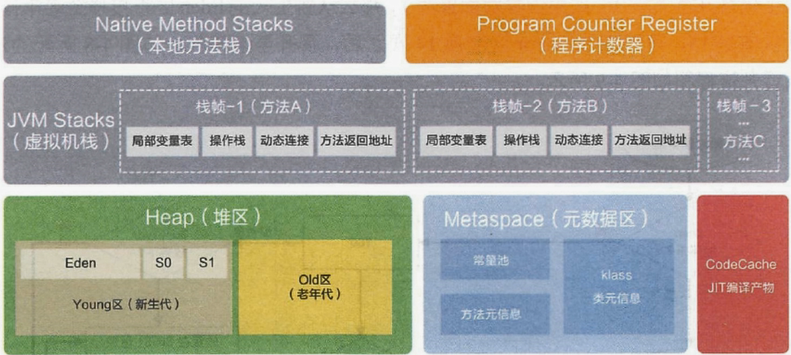

# 运行时数据区

- 每个线程：程序计数器、栈、本地栈。
- 线程间共享：堆、堆外内存（永久代或元空间、代码缓存）。
  - 每个JVM只有一个`Runtime`实例

## 线程

- 线程是一个程序里的运行单元。JVM允许一个应用有多个线程运行的执行。
- 在HotSpot JVM里，每个线程都与操作系统的本地线程直接映射。
  - 当一个Java线程准备好执行之后，此时一个操作系统的本地线程也同时创建。Java线程执行终止后，本地线程也会回收。
- 操作系统负责所有线程的安排调度到任何一个可用的CPU上。一旦本地线程初始化成功，它就会调用Java线程中的`run()`方法。

