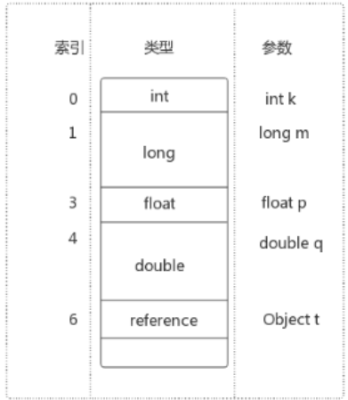
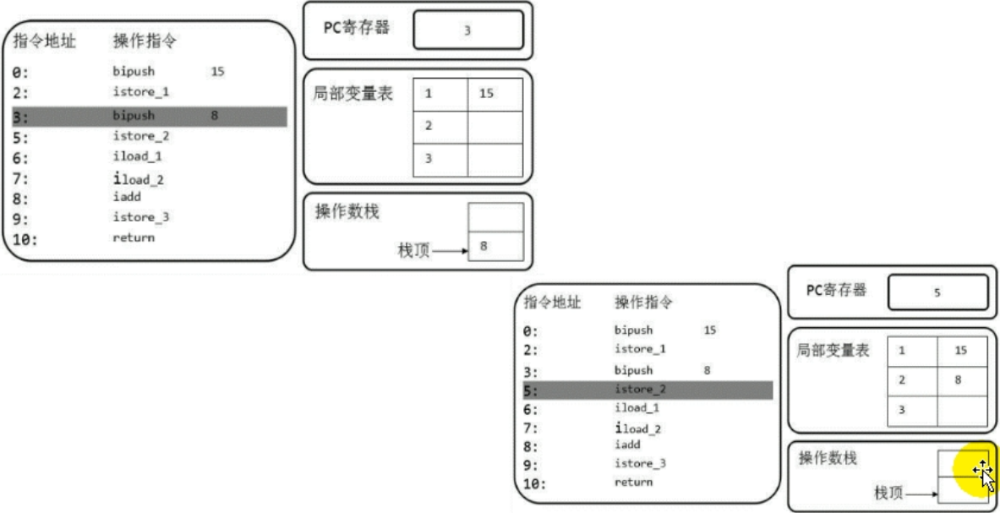
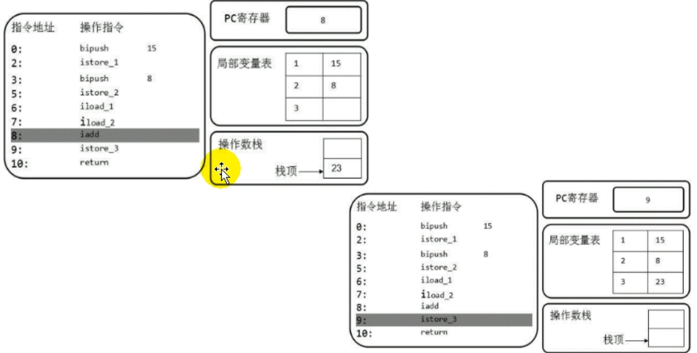
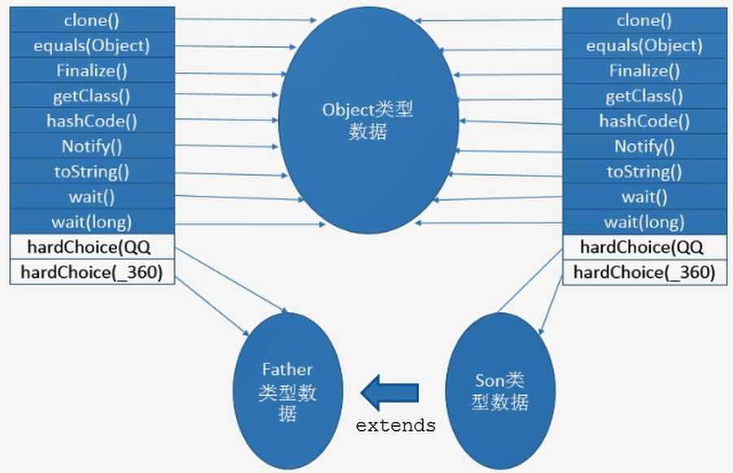

# 虚拟机栈

 Java的指令都是根据栈来设计的，优点是跨平台，指令集小，编译器容易实现，缺点是性能下降，实现同样的功能需要更多的指令。

**栈是运行时的单位，而堆是存储的单位。**

- 一个栈帧对应一个方法。

- 生命周期和线程一致。

- 栈主管Java程序的运行，保存了方法的局部变量（8种基本数据类型、对象的引用地址）、部分结果，并参与方法的调用和返回。
- 栈是一种快速有效的分配存储方式，访问速度仅次于程序计数器。
- JVM直接对Java栈的操作只有两个
  - 每个方法执行，伴随着进栈（入栈、压栈）。
  - 执行结束后的出栈工作。
- 对于栈来说不存在垃圾回收问题。

- 如果采用固定大小的Java虚拟机栈，那每一个线程的Java虚拟机栈容量可以在线程创建时独立选定。如果线程请求分配的栈容量超过Java虚拟机栈允许的最大容量，Java虚拟机将会抛出`java.lang.StackOverflowError`异常。
- 如果Java虚拟机栈可以动态扩展，并且在尝试扩展的时候无法申请到足够的内存，或者在创建新的线程时没有足够的内存去创建对应的虚拟机栈，那Java虚拟机将会抛出OOM异常。

```java
// java.lang.StackOverflowError
public class Main {
    public static void main(String[] args) {
        main(args);
    }
}
```

> -Xss256k：设置栈的大小

## 栈的存储单位


- 每个线程都有自己的栈，栈中的数据都是以栈帧（Stack Frame）的格式存在。
- 在这个线程上正在执行的每个方法都各自对应一个栈帧。
- 栈帧是一个内存区块，是一个数据集，维系着方法执行过程中的各种数据信息。

## 栈的运行原理

- JVM直接对Java栈的操作只有两个，就是对栈帧的**压栈**和**出栈**，遵循“先进后出”（FILO）原则。
- 在一条活动线程中，一个时间点上，只有一个活动的栈帧。只有当前正在执行的方法的栈帧是有效的，这个栈帧被称为**当前栈帧**，与当前栈帧对应的方法就是当前方法，定义这个方法的类就是**当前类**。
- 执行引擎运行的所有字节码指令只针对当前栈帧进行操作。
- 如果在该方法中调用了其他方法，对应的新的栈帧会被创建出来，放子栈的顶端，称为新的当前帧。
- 不同线程中所包含的栈帧是不允许存在相互引用的， 即不可能在一个栈帧中引用另外一个线程的栈帧。
- 如果当前方法调用了其他方法 ，方法返回之际，当前栈帧会传回此方法的执行结果给前一个帧，接着虚拟机会丢弃当前栈帧，使得前一个栈帧重新成为当前栈帧。
- Java方法有两种返回函数的方式，**一种是正常的函数返回，使用`return`指令；另外一种是抛出异常。不管使用哪种方式，都会导致栈帧被弹出**。

## 栈帧的内部结构

- **局部变量表（Local Variables）**
- **操作数栈（Operand Stack 或 表达式栈）**
- 动态链接（Dynamic Linking）（指向运行时常量池的方法引用）
- 方法返回地址（Return Address）（方法正常退出或者异常退出的定义）
- 一些附加信息

## 局部变量表

- **定义为一个数字数组，主要用于存储方法参数和定义在方法体内的局部变量**，这些数据类型包括各类基本数据类型、对象引用（reference）、以及`returnAddress`类型。
- 建立在线程的栈上，是线程的私有数据，**不存在数据安全问题**。
- **局部变量表所需的容量大小是在编译期确定下来的**，并保存在方法的Code属性的`maximum local variables`数据项中。在方法运行期间是不会改变局部变量表的大小的。
- **方法嵌套调用的次数由栈的大小决定。一般来说，栈越大，方法嵌套调用次数越多。**
- **局部变量表中的变量只在当前方法调用中有效**。在方法执行时，虚拟机通过使用局部变量表完成参数值到参数变量列表的传递过程。**当方法调用结束后，随着方法栈帧的销毁，局部变量表也会随之销毁。** 

### 关于slot的理解

- 参数值的存放总是在局部变量数组的index 0开始，到数组长度-1的索引结束。

- 局部变量表，**最基本的存储单位是slot（变量槽）**。
- 局部变量表中存放编译器可知的各种基本数据类型（8种），引用类型（reference），returnAddress类型的变量。
- 在局部变量表里，**32位以内的类型只占用一个slot（包括returnAddress类型），64位的类型（long和double）占用两个slot**
  - `byte`、`short`、`char`在存储前被转为`int`，`boolean`也被转为`int`，0表示`flase`，非0表示`true`。
  - `long`和`double`占据两个slot。
- JVM会为局部变量表中的每一个Slot都分配一个访问索引，通过这个索引即可成功访问到局部变量表中指定的局部变量值。
- 当一个实例方法被调用的时候，他的方法参数和方法内部定义的局部变量会**按照顺序被复制**到局部变量表的slot上。
- **如果访问局部变量表中一个64bit的局部变量值时，只需要使用前一个索引即可**（比如：访问`long`或`double`类型变量）。
- 如果当前栈帧是由构造方法或者实例方法创建的，那么**该对象引用`this`将会存放在index为0的slot处**。



```java
public void method1(){
    int a = 1;
    double b = 2.0;
    String str = "string";
}
```

局部变量表


### slot的重复利用

**栈帧中的局部变量表的槽位是可以重用的**，如果一个局部变量过了其作用域，那么在其作用域之后声明的新的局部变量就很有可能复用过期局部变量的槽位，从而**达到节省资源的目的**。

```java
public void method2(){
    int a = 10;
    {
        int b = 0;
        b++;
    }
    // 变量c使用之前已经销毁的变量b占用的slot
    int c = 20;
}
```


### 静态变量和局部变量的对比

```java
/**
 *	变量的分类：按照数据类型分：1、基本数据类型	2、引用数据类型
 *			  按照在类中声明的位置分：1、成员变量：在使用前，都经过默认初始化赋值
 *										类变量：linking的prepare阶段：给类变量默认赋值 --》initial阶段：给类变量显示赋值即静态代码块赋值
 *										实例变量：随着对象的创建，会在对空间中分配实例变量空间，并进行默认赋值
 *								  2、局部变量：在使用前，必须进行显示赋值！否则，编译不通过
 */
```

### 补充说明

- 在栈帧中，与性能调优关系最为密切的部分就是局部变量表。在方法执行时，虚拟机使用局部变量表完成方法的传递。
- **局部变量表中的变量也是重要的垃圾回收根节点，只要被局部变量表中直接或间接引用的对象都不会被回收。**

## 操作数栈

- 每一个独立的栈帧中除了包含局部变量表以外，还包含一个后进先出的操作数栈。
- 在方法执行过程中，根据字节码指令，往栈中写入数据或提取数据，即入栈（push）/出栈（pop）。
  - 某些字节码指令将值压入操作数栈，其余的字节码指令将操作数取出栈。使用它们后再把结果压入栈。
  - 比如：执行复制、交换、求和等操作。

- 主要用于保存计算过程中的中间结果，同时作为计算过程中变量临时的存储空间。
- 操作数栈就是JVM执行引擎的一个工作区，当一个方法刚开始执行的时候，一个新的栈帧也会随之被创建出来，**这个方法的操作数栈是空的**。
- 每个操作数栈都会拥有一个明确的栈深度用于存储数值，其所需的最大深度在编译器就定义好了，保存在方法的Code属性中为`max_stack`的值。
- 栈中的任何一个元素都是可以任意的Java数据类型。
  - 32bit的类型占用一个栈单位深度
  - 64bit的类型占用两个栈单位深度
- 操作数栈**并非采用访问索引的方式来进行数据访问的**，而是只能通过标准的入栈和出栈操作来完成一次数据访问。
- **如果被调用的方法带有返回值的话，其返回值将会被压入当前栈帧的操作数栈中**，并更新PC寄存器中下一条需要执行的字节码指令。
- 操作数栈中元素的数据类型必须与字节码指令的序列严格匹配，并由编译器在编译期间进行验证，同时再类加载过程中的类检验阶段的数据流分析阶段要再次验证。
- 另外，我们说Java虚拟机的**解释引擎是基于栈的执行引擎**，其中的栈指的就是操作数栈。

### 代码追踪

```java
public void test() {
    // byte、short、char、boolean：都以int型来保存
    byte i = 15;
    int j = 8;
    int k = i + j;
}
```







## 栈顶缓存（Top-of-Stack Cashing）技术

基于栈式架构的虚拟机所使用的零地址指令更加紧凑，但完成一项操作的时候必然需要使用更多的入栈和出栈指令，这同时也就意味着将更多的指令分派次数和内存读/写次数。

由于操作数是存储在内存中的，因此频繁地执行内存读/写操作必然会影响执行速度。为了解决这个问题，HotSpot JVM的设计者们提出了栈顶缓存技术，**将栈顶元素全部缓存在物理CPU的寄存器中，依次降低对内存的读/写次数，提升执行引擎的执行效率**。

## 动态链接（或指向运行时常量池的方法引用）

- 每个栈帧内部都包含一个**指向运行时常量池**中**该栈帧所属方法的引用**，包含这个引用的目的就是为了支持当前方法的代码能够实现动态链接（Dynamic Linking）。比如：invokeDynamic指令。

- Java源文件编译为字节码文件时，所有的变量和方法引用都作为符号引用保存在class文件的常量池里。比如：描述一个方法调用另外的方法时，就是通过常量池中指向方法的符号引用来表示的，**动态链接的作用就是为了将这些符号引用转换为调用方法的直接引用**。


**为什么需要常量池呢？**

常量池的作用，就是为了提供一些符号和常量，便于指令的识别。

## 方法的调用

###  静态链接和动态链接

在JVM中，将符号引用转换为调用方法的直接引用与方法的绑定机制相关。

- **静态链接**：当一个字节码被装载进JVM内部时，如果被调用的**目标方法在编译器可知**，且运行期保持不变。这种情况下将调用方法的符号引用转换为直接引用的过车行称之为静态链接。

- **动态链接**：**被调用的方法在编译期间无法被确定下来**，只能在程序运行期将调用方法的符号引用
  转换为直接引用，由于这种引用转换过程具备动态性，因此被称为动态链接。

### 早期绑定和晚期绑定

对应的方法的绑定机制为：早期绑定和晚期绑定。绑定是一个字段、方法或类在符号引用被替换为直接引用的过程，这仅仅发生一次。

- **早期绑定**：就是指**被调用的目标方法如果在编译器可知，且运行期保持不变**时，即可将这个方法与所属的类型进行绑定，这样一来，由于明确了被调用的目标方法究竟是哪一个，因此也就可以使用静态链接的方式将符号引用转换为直接引用。
- **晚期绑定**：如果**被调用的方法在编译器无法被确定下来，只能够在程序运行期根据实际的类型绑定相关的方法**，这种绑定方式也就被称之为晚期绑定。

```java
/**
 * 说明早期绑定和晚期绑定的例子
 * @author shkstart
 * @create 2020 上午 11:59
 */
class Animal{

    public void eat(){
        System.out.println("动物进食");
    }
}
interface Huntable{
    void hunt();
}
class Dog extends Animal implements Huntable{
    @Override
    public void eat() {
        System.out.println("狗吃骨头");
    }

    @Override
    public void hunt() {
        System.out.println("捕食耗子，多管闲事");
    }
}

class Cat extends Animal implements Huntable{

    public Cat(){
        super();//表现为：早期绑定
    }

    public Cat(String name){
        this();//表现为：早期绑定
    }

    @Override
    public void eat() {
        super.eat();//表现为：早期绑定
        System.out.println("猫吃鱼");
    }

    @Override
    public void hunt() {
        System.out.println("捕食耗子，天经地义");
    }
}
public class AnimalTest {
    public void showAnimal(Animal animal){
        animal.eat();//表现为：晚期绑定
    }
    public void showHunt(Huntable h){
        h.hunt();//表现为：晚期绑定
    }
}
```

### 虚方法和非虚方法

- 如果方法在编译器就确定了具体的调用版本，这个版本在运行时是不可变的。称为**非虚方法**。
- 静态方法、私有方法、`final`方法、实例构造器、父类方法都是非虚方法。
- 其他方法称为虚方法。

虚拟机中提供了以下几条方法调用指令：

- 普通调用指令：

  1、`invokestatic`：调用静态方法，解析阶段确定唯一方法版本。

  2、`invokespecial`：调用`<init>`方法、私有及父类方法，解析阶段确定唯一方法版本。

  3、`invokevirtual`：调用所有虚方法。

  4、`invokeinterface`：调用接口方法。

- 动态调用指令：

  5、`invokedynamic`：动态解析出需要调用的方法，然后执行。（Lambda表达式）

**`invokestatic`指令和`invokespecial`指令调用的方法非虚方法，其余的（`final`修饰的除外）称为虚方法。**

```java
/**
 * 解析调用中非虚方法、虚方法的测试
 *
 * invokestatic指令和invokespecial指令调用的方法称为非虚方法
 * @author shkstart
 * @create 2020 下午 12:07
 */
class Father {
    public Father() {
        System.out.println("father的构造器");
    }

    public static void showStatic(String str) {
        System.out.println("father " + str);
    }

    public final void showFinal() {
        System.out.println("father show final");
    }

    public void showCommon() {
        System.out.println("father 普通方法");
    }
}

public class Son extends Father {
    public Son() {
        //invokespecial
        super();
    }
    public Son(int age) {
        //invokespecial
        this();
    }
    //不是重写的父类的静态方法，因为静态方法不能被重写！
    public static void showStatic(String str) {
        System.out.println("son " + str);
    }
    private void showPrivate(String str) {
        System.out.println("son private" + str);
    }

    public void show() {
        //invokestatic
        showStatic("atguigu.com");
        //invokestatic
        super.showStatic("good!");
        //invokespecial
        showPrivate("hello!");
        //invokespecial
        super.showCommon();

        //invokevirtual
        showFinal();//因为此方法声明有final，不能被子类重写，所以也认为此方法是非虚方法。
        //虚方法如下：
        //invokevirtual
        showCommon();
        info();

        MethodInterface in = null;
        //invokeinterface
        in.methodA();
    }

    public void info(){

    }

    public void display(Father f){
        f.showCommon();
    }

    public static void main(String[] args) {
        Son so = new Son();
        so.show();
    }
}

interface MethodInterface{
    void methodA();
}
```

```class
 0 ldc #11 <atguigu.com>
 2 invokestatic #12 <com/atguigu/java2/Son.showStatic : (Ljava/lang/String;)V>
 5 ldc #13 <good!>
 7 invokestatic #14 <com/atguigu/java2/Father.showStatic : (Ljava/lang/String;)V>
10 aload_0
11 ldc #15 <hello!>
13 invokespecial #16 <com/atguigu/java2/Son.showPrivate : (Ljava/lang/String;)V>
16 aload_0
17 invokespecial #17 <com/atguigu/java2/Father.showCommon : ()V>
20 aload_0
21 invokevirtual #18 <com/atguigu/java2/Son.showFinal : ()V>
24 aload_0
25 invokevirtual #19 <com/atguigu/java2/Son.showCommon : ()V>
28 aload_0
29 invokevirtual #20 <com/atguigu/java2/Son.info : ()V>
32 aconst_null
33 astore_1
34 aload_1
35 invokeinterface #21 <com/atguigu/java2/MethodInterface.methodA : ()V> count 1
40 return
```

### 虚方法表

如果在每次动态分派的过程中都要重新在类的方法元数据中搜索合适的目标的话就可能影响到执行效率。为了提高性能，JVM采用在类的方法区建立一个**虚方法表（非虚方法不会出现在表中）来实现。使用索引表来代替查找。**

虚方法表会在类加载的链接阶段被创建并开始初始化（解析阶段）



## 方法返回地址

- 存放调用该方法的PC寄存器的值。
- 一个方法的结束，有两种方式：
  - 正常执行完成
  - 出现未处理的异常，非正常退出
- 无论通过哪种方式退出，在方法退出后都返回到该方法被调用的位置。方法正常退出时，**调用者的PC寄存器的值作为返回地址，即调用该方法的指令的下一条指令的地址**。异常退出，返回地址是要通过异常表来确定，栈帧中一般不会保存这部分信息。 

当一个方法开始执行后，只有两种方式可以退出这个方法：

1、执行引擎遇到任何一个方法返回的字节码指令（`return`），会有返回值传递给上层的方法调用者，简称**正常完成出口**。

- 一个方法在正常调用完成之后究竟需要使用哪一个返回指令还需要根据方法返回值的实际数据类型而定。
- 在字节码指令中，返回指令包含`ireturn`（当返回值是`boolean`、`byte`、`char`、`short`、`int`类型时使用）、`lreturn`、`freturn`、`dreturn`以及`areturn`，另外还有一个`return`指令供声明为`void`的方法、实例初始化方法、类和接口的初始化方法使用。

2、在方法执行的过程中遇到了异常（`Exception`），并且这个异常没有在方法内进行处理，也就是只要在本方法的异常表中没有搜索到匹配的异常处理器，就会导致方法退出。简称`异常完成出口`。

- 方法执行过程中抛出异常时的异常处理，存储在一个异常处理表，方便在发生异常的时候找到处理异常的代码。


**正常完成出口和异常完成出口的区别在于：通过异常完成出口退出的不会给它的上层调用者产生任何的返回值。**

## 附加信息


