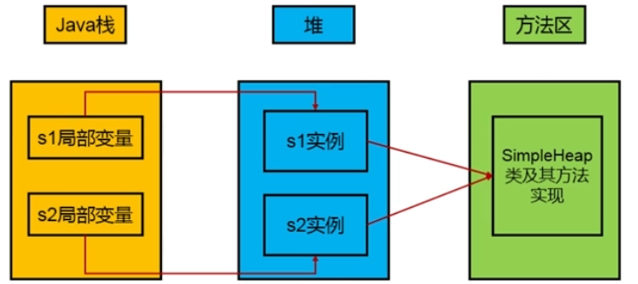
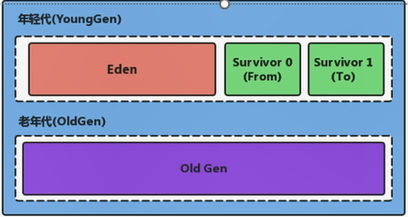
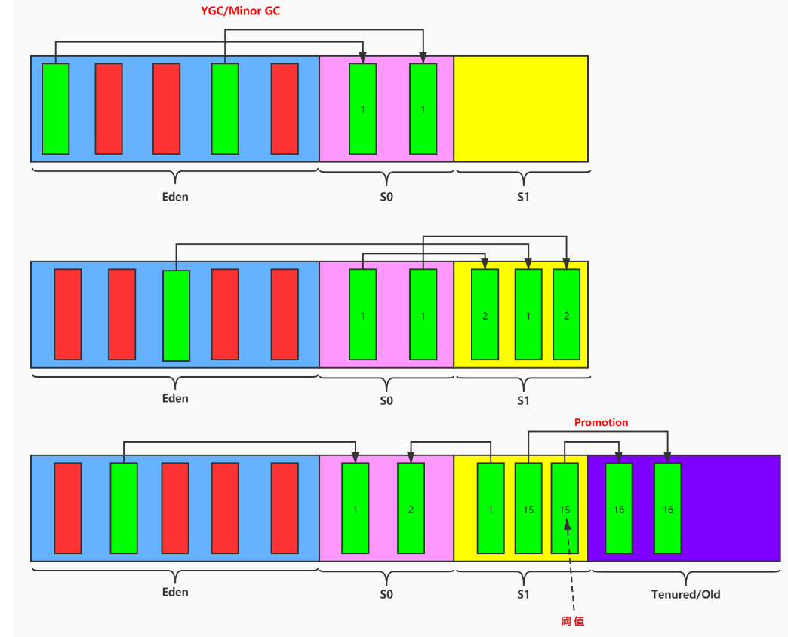
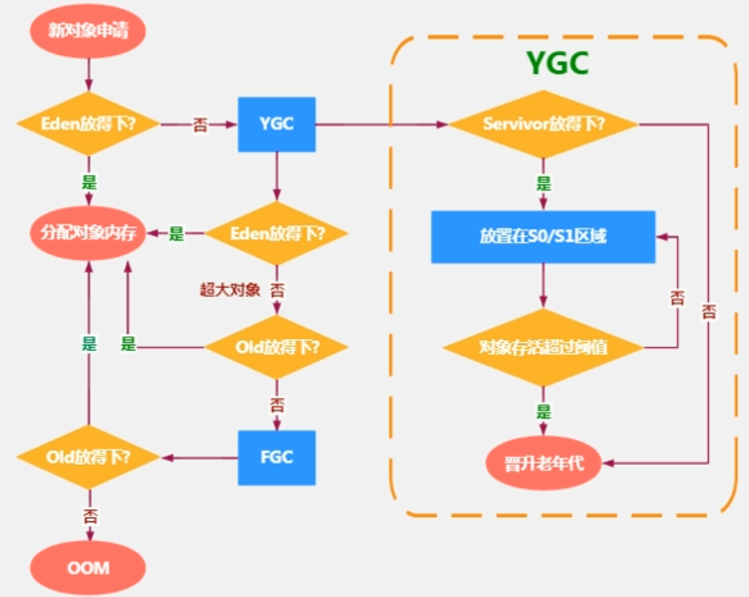
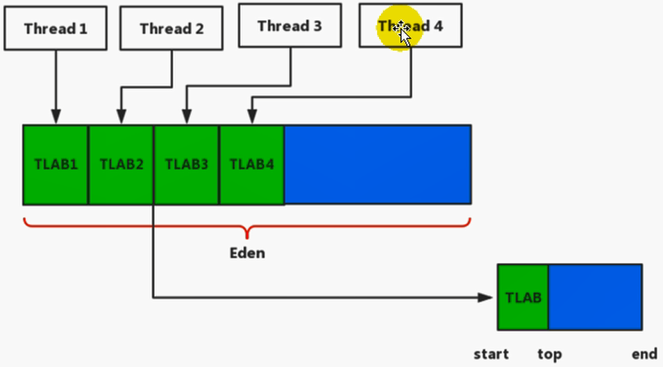
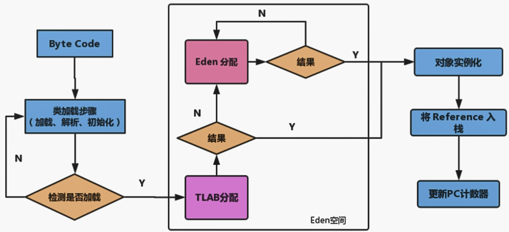
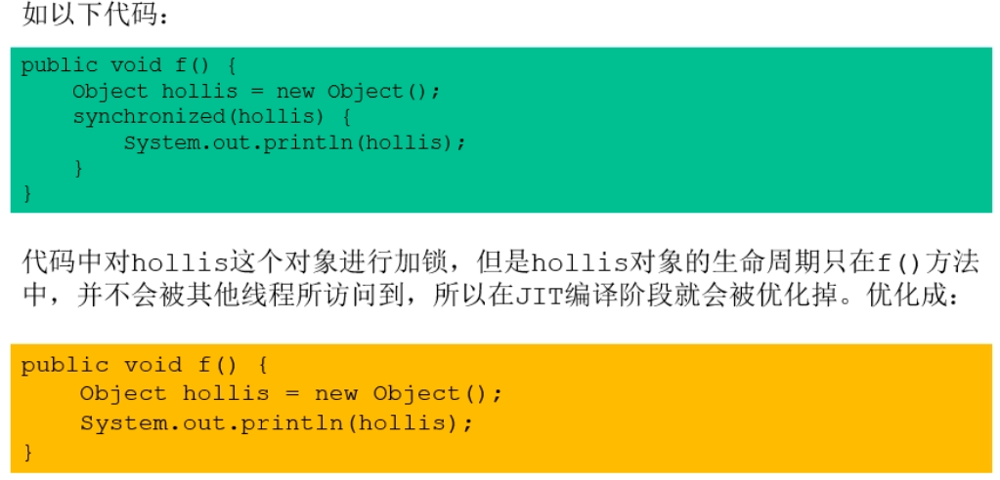
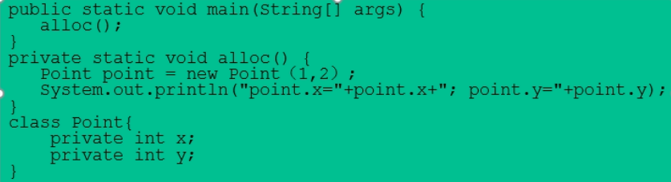
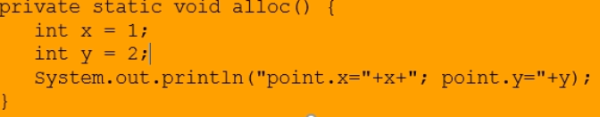
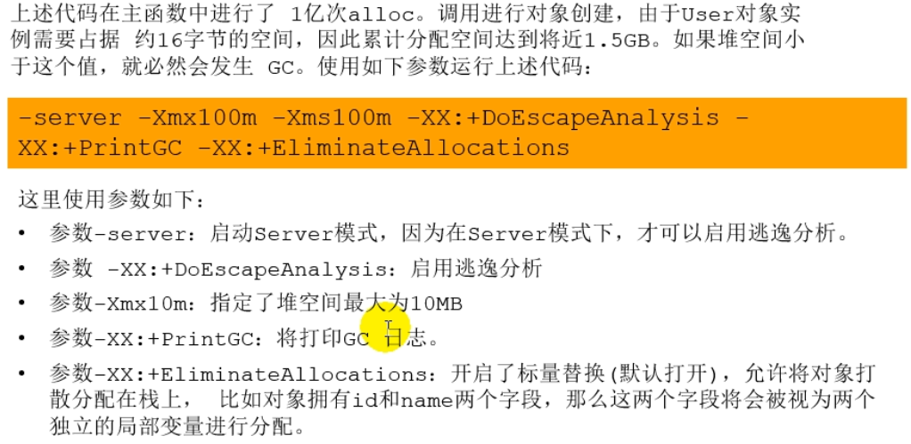

# 堆


- 一个JVM实例只存在一个堆内存，也是Java内存管理的核心区域。
- Java堆区在JVM启动的时候即被创建，其空间大小也就确定了。是JVM管理的最大一块内存空间。
  - 堆内存的大小是可以调节的。
- 《Java虚拟机规范》规定，堆可以处于**物理上不连续**的内存空间中，但在**逻辑上**它应该被视为**连续**的。
- 所有的线程共享Java堆，在这里还可以划分线程私有的缓冲区（Thread Local Allocation Buffer，TLAB）。
- 《Java虚拟机规范》中对Java堆的描述是：所有的对象实例以及数组都应当在运行时分配在堆上。
  - 从实际使用角度看，**几乎**所有的对象实例都在堆上分配内存。
- 数组和对象可能永远不会存储在栈上，因为栈帧中保存引用，这个引用指向对象或者数组在堆中的位置。
- 在方法结束后，堆中的对象不会马上被移除，仅仅在垃圾收集的时候才会被移除。
- 堆是GC执行垃圾回收的重点区域。



## 内存细分

- Java7及之前堆内存逻辑上分为三部分：新生区+养老区+永久区
- Java8及之后堆内存逻辑上分为三部分：新生区+养老区+元空间

## 堆空间大小的设置

- `-Xms`用来表示堆区（年轻代+老年代）的起始内存，等价于`-XX:InitialHeapSize`。
- `-Xmx`用来表示堆区的最大内存，等价于`-XX:MaxHeapSize`。
- 一旦堆区中的内存大小超过`-Xmx`所指定的最大内存时，将会抛出`OutOfMemoryError`异常。
- 通常会将`-Xms`和`-Xmx`两个参数配置相同的值，目的是**为了能够在java垃圾回收机制清理完堆区后不需要重新分隔计算堆区的大小，从而提高性能。**
- 默认情况下，初始内存大小是电脑内存大小的1/64，最大内存大小是电脑内存大小的1/4。

```java
/**
 * 1. 设置堆空间大小的参数
 * -Xms 用来设置堆空间（年轻代+老年代）的初始内存大小
 *      -X 是jvm的运行参数
 *      ms 是memory start
 * -Xmx 用来设置堆空间（年轻代+老年代）的最大内存大小
 *
 * 2. 默认堆空间的大小
 *    初始内存大小：物理电脑内存大小 / 64
 *             最大内存大小：物理电脑内存大小 / 4
 * 3. 手动设置：-Xms600m -Xmx600m
 *     开发中建议将初始堆内存和最大的堆内存设置成相同的值。
 *
 * 4. 查看设置的参数：方式一： jps   /  jstat -gc 进程id
 *                  方式二：-XX:+PrintGCDetails
 */
public class HeapSpaceInitial {
    public static void main(String[] args) {

        //返回Java虚拟机中的堆内存总量
        long initialMemory = Runtime.getRuntime().totalMemory() / 1024 / 1024;
        //返回Java虚拟机试图使用的最大堆内存量
        long maxMemory = Runtime.getRuntime().maxMemory() / 1024 / 1024;

        System.out.println("-Xms : " + initialMemory + "M");
        System.out.println("-Xmx : " + maxMemory + "M");

//        System.out.println("系统内存大小为：" + initialMemory * 64.0 / 1024 + "G");
//        System.out.println("系统内存大小为：" + maxMemory * 4.0 / 1024 + "G");

        try {
            Thread.sleep(1000000);
        } catch (InterruptedException e) {
            e.printStackTrace();
        }
    }
}
```

## 年轻代和老年代



- 存储在JVM中的Java对象可以被划分为两类：
  - 一类是生命周期较短的瞬时对象，这类对象的创建和消亡都非常迅速
  - 另外一类对象的生命周期非常长，在某些极端的情况下还能够与JVM的生命周期保持一致

- 配置新生代与老年代在堆结构的占比，一般不会修改

  - 默认`-XX:NewRatio`=2，表示新生代占1，老年代占2，新生代占整个堆的1/3。
- 在HotSpot中，Eden空间和另外两个Survivor空间缺省所占的比例是8:1:1。
- 当然开发人员可通过`-XX:SurvivorRatio=8`调整这个空间比例。（需要显示设置）
  - `-XX:-UseAdaptiveSizePolicy`：关闭自适应的内存分配策略
- **几乎所有的**Java对象都是在Eden区内new出来的。
- 绝大部分的Java对象的销毁都在新生代进行了。
- 可以使用选项`-Xmn`新生代的空间大小。 （一般不设置）

```java
/**
 * -Xms600m -Xmx600m
 *
 * -XX:NewRatio ： 设置新生代与老年代的比例。默认值是2.
 * -XX:SurvivorRatio ：设置新生代中Eden区与Survivor区的比例。默认值是8
 * -XX:-UseAdaptiveSizePolicy ：关闭自适应的内存分配策略  （暂时用不到）
 * -Xmn:设置新生代的空间的大小。 （一般不设置）
 *
 */
public class EdenSurvivorTest {
    public static void main(String[] args) {
        System.out.println("我只是来打个酱油~");
        try {
            Thread.sleep(1000000);
        } catch (InterruptedException e) {
            e.printStackTrace();
        }
    }
}
```

## 图解对象分配过程

### 一般过程



- 可以设置去养老区需要复制的次数，默认为15次。
  - `-XX:MaxTenuringThreshold=<N>`进行设置。

- 针对幸存者s0，s1区的总结：复制之后有交换，谁空谁是to。
- 关于垃圾回收：频繁在新生区收集，很少在养老区收集，几乎不在永久区/元空间收集。

### 特殊情况



##  Minor GC、Major GC与Full GC

JVM在进行GC时，并非每次都对上面三个内存（新生代、老年代；方法区）一起回收的，大部分时候回收的都是指新生代。

针对HotSpot VM的实现，它里面的GC按照回收区域又分为两大种类型：一种是部分收集（Partial GC），一种是整堆收集（Full GC）

- 部分收集：不是完整收集整个Java堆的垃圾收集。其中又分为：
  - 新生代收集（Minor GC/Young GC）：只是新生代（Eden/s0，s1）的垃圾收集
  - 老年代收集（Major GC/Old GC）：只是老年代的垃圾收集。
    - 目前，只有CMS GC会有单独收集老年代的行为。
    - **注意，很多时候Major GC和Full GC混淆使用，需要具体分辨是老年代回收还是整堆回收。**
  - 混合收集（Mixed GC）：收集整个新生代以及部分老年代的垃圾收集。
    - 目前，只有G1 GC会有这种行为。
- 整堆收集（Full GC）：收集整个Java堆和方法区的垃圾收集。

- 年轻代GC（Minor GC）触发机制：

  - 当年轻代空间不足时，就会触发Minor GC，这里的年轻代满指的是Eden区满，Survivor满不会引发GC。（每次Minor GC会清理年轻代的内存）
  - 因为Java对象**大多都具备朝生夕死**的特性，所以Minor GC非常频繁，一般回收速度也比较快。这一定义既清晰又易于理解。
  - Minor GC会引发STW，暂停其他用户的线程，等垃圾回收结束，用户线程才恢复运行。

- 老年代GC（Major GC/Full GC）触发机制：

  - 指发生在老年代的GC，对象从老年代消失时，我们说Major GC或 Full GC发生了。
  - 出现了Major GC，经常会伴随着至少一次的Minor GC（但非绝对，在Parallel Scavenge收集器的收集策略里就有直接进行Major GC的策略选择过程）
    - 也就是在老年代空间不足时，会先尝试触发Minor GC。如果之后空间不足，就触发Major GC。
  - Major GC的速度一般比Minor GC慢10倍以上，STW的时间更长。
  - 如果Major GC后，内存还不足，就报OOM了。

- Full GC触发机制：（后面细讲）

  - 调用System.gc()时，系统建议执行Full GC，但是不必然执行
  - 老年代空间不足
  - 方法区空间不足
  - 通过Minor GC后进入老年代的平均大小大于老年代的可用内存
  - 由Eden区、survivor space0（From Space）区向Survivor space1（To Space）区复制时，对象大小大于To Space可用内存，则把该对象转存到老年代，且老年代的可用内存小于该对象大小

  **说明：Full GC是开发或调优中尽量要避免的，这样暂停时间会短一些。**

## 堆空间分代思想

为什么需要把Java堆分代？不分代就不能正常工作了吗？

- 经研究，不同对象的声明周期不同，70%-99%的对象是临时对象。

- 不分代也完全可以，分代的唯一理由就是**优化GC性能**。

## 内存分配策略

- 优先分配到Eden
- 大对象直接分配到老年代
  - 尽量避免程序中出现过多的大对象
- 长期存活的对象分配到老年代
- 动态对象年龄判断
  - 如果Survivor区中相同年龄的所有对象大小的总和大于Survivor空间的一半，年龄大于或等于该年龄的对象可以直接进入老年代，无需等到`MaxTenuringThreshold`中要求的年龄。
- 空间分配担保
  - `-XX:HandlePromotionFailure`

## 对象分配过程：TLAB

为什么有TLAB（Thread Local Allocation Buffer）？

- 堆区是线程共享区域，任何线程都可以访问到堆区中的共享数据
- 由于对象实例的创建在JVM中非常频繁，因此在并发环境下从堆区划分内存空间时线程不安全的
- 为避免多个线程操作同一地址，需要使用加锁等机制，进而影响分配速度



什么是TLAB？

- 从内存模型而不是垃圾收集的角度，对Eden区域继续进行划分，JVM为**每个线程分配了一个私有的缓存区域**，它包含在Eden空间内。
- 多线程同时分配内存时，使用TLAB可以避免线程安全问题，不会考虑线程同步，同时还能够提升内存分配的吞吐量，这种内存分配方式称为**快速分配策略**。
- 尽管不是所有的对象实例都能在TLAB中成功分配内存，但**JVM确实是将TLAB作为内存分配的首选**。
- 可以通过`-XX:UseTLAB`设置是否开启TLAB空间。默认是开启的。
- TLAB空间的内存非常小，**仅占有这个Eden空间的1%**，可通过`-XX:TLABWastTargetPercent`设置TLAB空间占用Eden空间的百分比大小。
- 一旦对象在TLAB空间分配内存失败，JVM会通过**使用加锁机制**确保数据操作的原子性，从而直接在Eden空间中分配内存。



## 堆空间参数设置

`-XX:PrintFlagsInitial`：查看所有的参数的默认值

`-XX:PrintFlagsFinal`：查看所有的参数额最终值（可能会存在修改，不再是初始值）

`-Xms`：初始堆空间内存（默认为物理内存的1/64）

`-Xmx`：最大堆空间内存（默认为物理内存的1/4）

`-XX:NewRatio`：配置新生代与老年代在堆结构的占比

`-XX:SurvivorRatio`：设置新生代Eden/s0/s1空间的比例

`-XX:MaxTenuringThreshold`：设置新生代垃圾的最大年龄

`-XX:+PrintGCDetails`：输出详细的GC处理日志

打印GC的简要信息：①`-XX:+PrintGC` ②`-verbose:gc`

`-XX:HandlePromotionFailure`：是否设置空间分配担保

在发生Minor GC之前，虚拟机会**检查老年代最大可用的连续空间是否大于新生代所有的对象的总空间**。

- 如果大于，则此次Minor GC是安全的
- 如果小于，则虚拟机会查看`-XX:HandlePromotionFailure`设置值是否允许担保失败。
  - 如果`HandlePromotionFailure=true`，那么会继续检查**老年代最大可用连续空间是否大于历次晋升到老年代的对象的平均大小**。
    - 如果大于，则尝试进行一次Minor GC，但这次Minor GC依然是有风险的。
    - 如果小于，则改为进行一次Full GC。
  - 如果`HandlePromotionFailure=false`，则改为进行一次Full GC。

在JDK7及以后，`HandlePromotionFailure`参数不会再影响到虚拟机的空间分配担保策略。**只要老年代的连续空间大于新生代对象总大小**或者**历次晋升的平均大小就会进行Minor GC**，否则进行Full GC。

## 堆是分配对象存储的唯一选择吗？

随着JIT编译器的发展与逃逸分析技术逐渐成熟，**栈上分配、标量替换优化技术**将会导致一些微秒的变化，所有的对象都分配到堆上也逐渐变得不那么绝对了。

**如果经过逃逸分析（Escape Analysis）后发现，一个对象并没有逃逸出方法的话，那么就可能被优化成栈上分配**。这样就无需在堆上分配内存，也无需进行垃圾回收了。这也是最常见的堆外存储技术。

基于OpenJDK深度定制的TaoBaoVM，其中创新的GCIH（GC invisible heap）技术实现off-heap，将生命周期较长的Java对象从heap中移至heap外，并且GC不能管理GCIH内部的Java对象，以此达到降低GC的回收频率和提升GC的回收效率的目的。

### 逃逸分析

- 当一个对象在方法中被定义后，对象只在方法内部使用，则认为没有发生逃逸。（栈上分配）
- 当一个对象在方法中被定义后，它被外部方法所引用，则认为发生逃逸。

```java
// 不逃出方法，栈上分配
public static String method(String str) {
    StringBuffer stringBuffer = new StringBuffer();
    stringBuffer.append(str);
    return stringBuffer.toString();
}
```

> 快速判断是否发生逃逸分析：看new的**对象实体**是否有可能在方法外被调用

```java
/**
 *  如何快速的判断是否发生了逃逸分析，大家就看new的对象实体是否有可能在方法外被调用。
 */
public class EscapeAnalysis {

    public EscapeAnalysis obj;

    /*
    方法返回EscapeAnalysis对象，发生逃逸
     */
    public EscapeAnalysis getInstance(){
        return obj == null? new EscapeAnalysis() : obj;
    }
    /*
    为成员属性赋值，发生逃逸
     */
    public void setObj(){
        this.obj = new EscapeAnalysis();
    }
    //思考：如果当前的obj引用声明为static的？仍然会发生逃逸。

    /*
    对象的作用域仅在当前方法中有效，没有发生逃逸
     */
    public void useEscapeAnalysis(){
        EscapeAnalysis e = new EscapeAnalysis();
    }
    /*
    引用成员变量的值，发生逃逸
     */
    public void useEscapeAnalysis1(){
        EscapeAnalysis e = getInstance();
        //getInstance().xxx()同样会发生逃逸
    }
}
```

### 参数设置

- 在JDK7及以后，HotSpot中默认开启了逃逸分析

- 如果是较早版本，通过`-XX:+DoEscapeAnnalysis`显示开启逃逸分析，`-XX:+PrintEscapeAnalysis`查看逃逸分析的筛选结果

> 开发中能使用局部变量的，就不要使用在方法外定义

### 代码优化

使用逃逸分析，编译器可以对代码做如下优化：

- **栈上分配**。将堆分配转化为栈分配。如果一个对象在子程序中被分配，要使指向该对象的指针永远不会逃逸，对象可能是栈分配的候选，而不是堆分配。

- **同步省略**。如果一个对象被发现只能从一个线程被访问到，那么对于这个对象的操作可以不考虑同步。

- **标量替换或分离对象** 。有的对象可能不需要作为一个连续的内存结果存在也可以被访问到，那么对象的部分（或全部）可以不存在内存，而是存储在CPU寄存器中。

#### 代码优化之栈上分配

- JIT编译器在编译期间根据逃逸分析的结果，发现如果一个对象并没有逃逸出方法的话，就可能被优化成栈上分配。分配完成后，继续在调用栈内执行，最后线程结束，栈空间被回收，局部变量对象也被回收。这样就无需进行垃圾回收了。
- **常见的栈上分配的场景**
  - 在逃逸分析中，已经说明了。分别是给成员变量赋值、方法返回值、实例引用传递。

```java
/**
 * 栈上分配测试，使用visualVM查看User对象数量
 * -Xmx1G -Xms1G -XX:-DoEscapeAnalysis -XX:+PrintGCDetails
 */
public class StackAllocation {
    public static void main(String[] args) {
        long start = System.currentTimeMillis();

        for (int i = 0; i < 10000000; i++) {
            alloc();
        }
        // 查看执行时间
        long end = System.currentTimeMillis();
        System.out.println("花费的时间为： " + (end - start) + " ms");
        // 为了方便查看堆内存中对象个数，线程sleep
        try {
            Thread.sleep(1000000);
        } catch (InterruptedException e1) {
            e1.printStackTrace();
        }
    }

    private static void alloc() {
        User user = new User();//未发生逃逸
    }

    static class User {

    }
}
```

#### 代码优化之同步省略（消除）

- 线程同步的代价是相当高的，同步的后果是降低并发性和性能。
- 在动态编译同步块的时候，JIT编译器可以借助逃逸分析来**判断同步块所使用的锁对象是否只能被一个线程访问而没有被发布到其他线程**。如果没有，那么JIT编译器在编译这个同步块的时候就会取消对这部分代码的同步。这样就能大大提高并发性和性能。这个取消同步的过程就叫同步省略，也叫**锁消除**。



#### 代码优化之标量替换

- **标量（Scalar）**是指一个无法再分解成更小的数据的数据。Java中的基本数据类型就是标量。
- 相对的，还可以分解的数据叫做**聚合量（Aggregate）**，Java中的对象就是聚合量。
- 在JIT阶段，如果经过逃逸分析，发现一个对象不会被外界访问的话，经过JIT优化，就会把这个对象拆解成若干个其中包含若干个成员变量来代替，这个过程就是**标量替换。**



以上代码，经过标量替换，就会变成：



可以看到，Point这个聚合量经过逃逸分析后，发现他并没有逃逸，就被替换成两个标量了。那么标量替换有什么好处呢？就是可以大大减少堆内存的占用。因为一旦不需要创建对象了，那么就不再需要分配堆内存了。

标量替换为栈上分配提供了很好的基础。

**标量替换参数设置**：`-XX:+EliminateAllocations`默认开启，允许将对象打散分配到栈上。

```java
/**
 * 标量替换测试
 *  -Xmx100m -Xms100m -XX:+DoEscapeAnalysis -XX:+PrintGC -XX:-EliminateAllocations
 */
public class ScalarReplace {
    public static class User {
        public int id;
        public String name;
    }

    public static void alloc() {
        User u = new User();//未发生逃逸
        u.id = 5;
        u.name = "www.atguigu.com";
    }

    public static void main(String[] args) {
        long start = System.currentTimeMillis();
        for (int i = 0; i < 10000000; i++) {
            alloc();
        }
        long end = System.currentTimeMillis();
        System.out.println("花费的时间为： " + (end - start) + " ms");
    }
}
```



### 逃逸分析小结：逃逸分析并不成熟

- 关于逃逸分析的论文在1999年就已经发表了，但知道JDK1.6才有实现，而且这项技术如今也并不是十分成熟的。
- 其根本原因就是**无法保证逃逸分析的性能消耗一定能高于它的消耗。虽然经过逃逸分析可以做标量替换、栈上分配、和锁消除。但是逃逸分析自身也是需要进行一系列复杂的分析的，这其实也是一个相对耗时的过程。**
- 一个极端的例子，就是经过逃逸分析之后，发现没有一个对象是不逃逸的，那这个逃逸分析的过程就白白浪费掉了。
- 虽然这项技术并不十分成，但是它也**是即时编译器优化技术中一个十分重要的手段**。
- 注意到有一些观点，认为通过逃逸分析，JVM会在栈上分配哪些不会逃逸的对象，这在理论上是可行的，但是取决于JVM设计者的选择。据我所知，Oracle HotSpot JVM中并未这么做，这一点在逃逸分析相关的文档里已经说明，所以可以明确所有的对象实例都是创建在堆上。
- 目前很多书籍还是基于JDK 7以前的版本，JDK已经发生了很多变化，intern字符串的缓存和静态变量曾经都分配在永久代上，而永久代已经被元空间取代。但是intern字符串缓存和静态变量并不是被转移到元数据区，而是直接在堆上分配，所以这一点同样符合前面一点的结论：对象实例都是分配在堆上。


