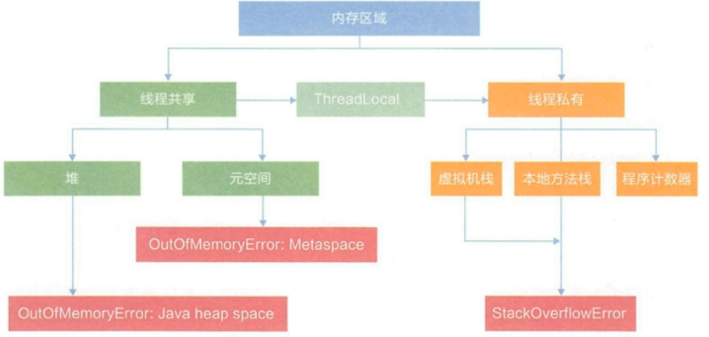
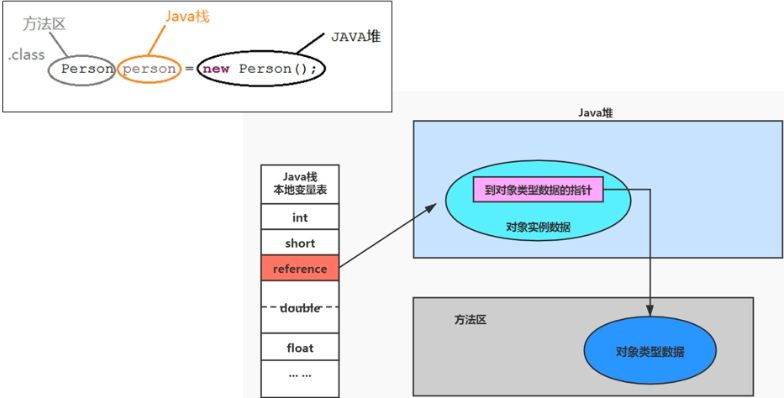
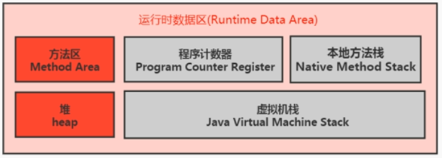
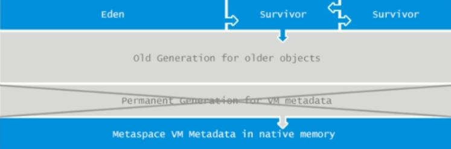
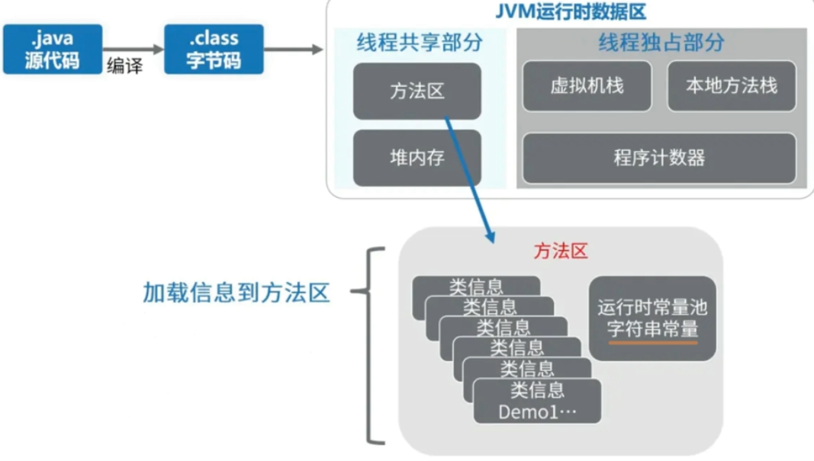
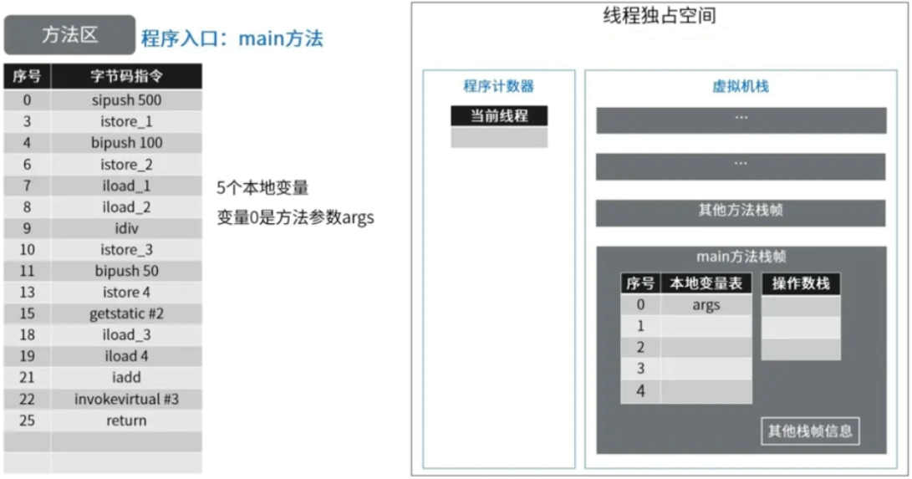
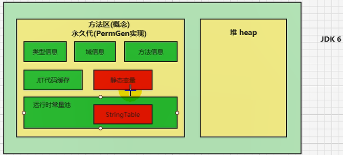
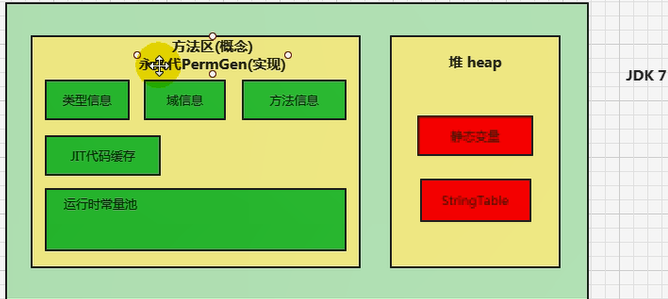
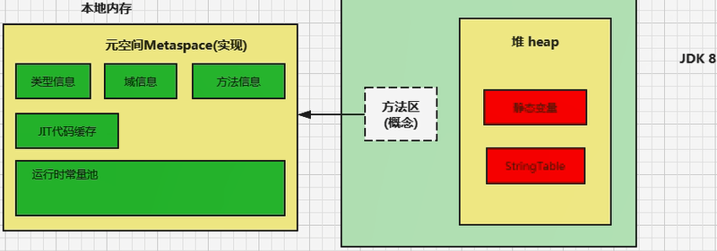
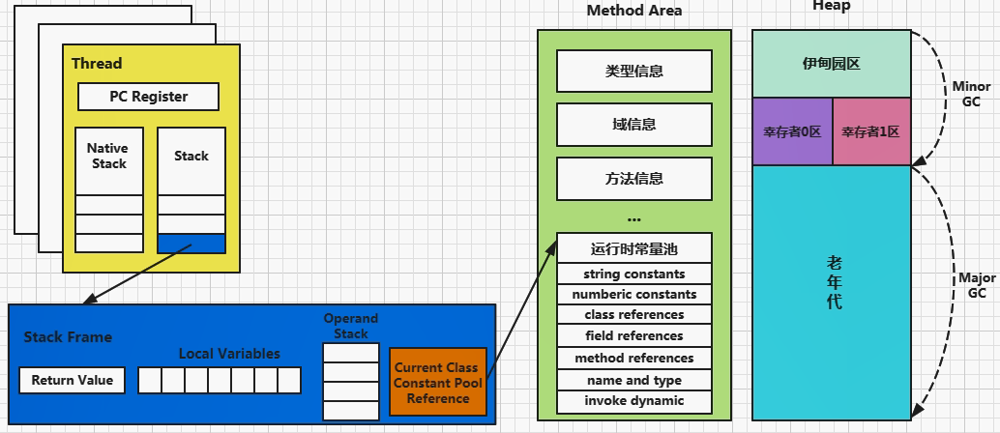

# 方法区



## 栈、堆、方法区的交互关系



## 方法区的理解

《Java虚拟机规范》中明确说明：“尽管所有的方法区在逻辑上是属于堆的一部分，但一些简单的实现可能不会选择去进行垃圾收集或者进行压缩。”但对于HotSpot JVM而言，方法区还有一个别名叫做Non-Heap（非堆），目的就是要和堆分开。所以，方法区看做是一块独立于Java堆的内存空间。



- 方法区和Java堆一样，是各个线程共享的内存区域。
- 方法区在JVM启动的时候被创建，并且它的实际物理内存空间和Java堆区一样都可以是不连续的。
- 方法区的大小跟堆空间一样，可以选择固定大小或者可扩展。
- 方法区的大小决定了系统可以保存多少个类，如果定义了太多的类，导致方法区溢出，虚拟机同样会抛出内存溢出错误：`java.lang.OutOfMemoryError:PermGen space` 或者 `java.lang.OutOfMemoryError:Metaspace`
  - 加载大量的第三方的jar包
  - Tomcat部署的工程过多
  - 大量动态的生成反射类
- 关闭JVM会释放这个区域的内存。

## HotSpot中方法区的演进

- jdk7及以前，方法区称为永久代。jdk8开始，元空间取代了永久代。
- 本质上，方法区和永久代并不等价。仅是对HotSpot而言的。《Java虚拟机规范》对如何实现方法区，不做统一要求。
  - 现在来看，当年使用永久代不是好的选择，导致Java程序更容易OOM（超过`-XX:MaxPermSize`上限），使用的是Java虚拟机内存。
- JDK8完全废弃了永久代的概念 ，改用与JRockit、J9一样在本地内存中实现的元空间（Metaspace）来代替。



- 元空间的本质和永久代类似，都是对JVM规范中方法区的实现。不过元空间与永久代最大的区别在于： **元空间不在虚拟机设置的内存中，而是使用本地内存。**
- 永久代、元空间并不只是名字变了，内部结构也调整了。
- 根据《Java虚拟机规范》规定，如果方法区无法满足新的内存分配需求时，将抛出OOM异常。

## 设置方法区大小

- 方法区的大小不必是固定的，JVM可以根据应用的需要动态调整。

- **JDK7及之前**
  - 通过`-XX:PermSize`来设置永久代初始分配空间，默认值是20.75M
  - `-XX:MaxPermSize`来设定永久代最大可分配空间。32位机器默认是64M，64位机器默认是82M。
  - 当JVM加载的类信息容量超过了这个值，会报异常`java.lang.OutOfMemoryError:PermGen space`
- **JDK8及之后**
  - 元数据区大小可以使用参数`-XX:MetaspaceSize`和`-XX:MaxMetaspaceSize`指定，替换上述原有的两个参数。
  - 默认值依赖于平台。**windows下，`-XX:MetaspaceSize`是21M，`-XX:MaxMetaspaceSize`的值是-1，即没有限制**。
  - 与永久代不同，如果不指定大小，默认情况下，虚拟机会耗尽所有的可用系统内存。如果元数据区发生溢出，虚拟机一样会抛出异常`java.lang.OutOfMemoryError:Metaspace`
  - `-XX:MetaspaceSize`：设置初始的元空间大小。对于一个64位的服务器端JVM来说，其默认的`-XX:MetaspaceSize`值为21MB。这就是初始的高水位线，一旦触及这个水位线，Full GC将会被触发并卸载没用的类（即这些类对应的类加载器不再存活），然后这个高水位线将会重置。新的高水位线的值取决于GC后释放了多少元空间。如果释放的空间不足，那么在不超过`MaxMetaspaceSize`时，适当提高该值。如果释放空间过多，则适当降低该值。
  - 如果初始化的高水位线设置过低，上述高水位线调整高水位线会发生很多次。通过垃圾回收器的日志可以观察到Full GC多次调用。为了避免频繁地GC，建议将`-XX:MetaspaceSize`设置一个相对较高的值。

```java
/**
 *  测试设置方法区大小参数的默认值
 *
 *  jdk7及以前：
 *  -XX:PermSize=100m -XX:MaxPermSize=100m
 *
 *  jdk8及以后：
 *  -XX:MetaspaceSize=100m  -XX:MaxMetaspaceSize=100m
 */
public class MethodAreaDemo {
    public static void main(String[] args) {
        System.out.println("start...");
//        try {
//            Thread.sleep(1000000);
//        } catch (InterruptedException e) {
//            e.printStackTrace();
//        }

        System.out.println("end...");
    }
}
```

```java
/**
 * jdk6/7中：
 * -XX:PermSize=10m -XX:MaxPermSize=10m
 *
 * jdk8中：
 * -XX:MetaspaceSize=10m -XX:MaxMetaspaceSize=10m
 */
public class OOMTest extends ClassLoader {
    public static void main(String[] args) {
        int j = 0;
        try {
            OOMTest test = new OOMTest();
            for (int i = 0; i < 10000; i++) {
                //创建ClassWriter对象，用于生成类的二进制字节码
                ClassWriter classWriter = new ClassWriter(0);
                //指明版本号，修饰符，类名，包名，父类，接口
                classWriter.visit(Opcodes.V1_8, Opcodes.ACC_PUBLIC, "Class" + i, null, "java/lang/Object", null);
                //返回byte[]
                byte[] code = classWriter.toByteArray();
                //类的加载
                test.defineClass("Class" + i, code, 0, code.length);//Class对象
                j++;
            }
        } finally {
            System.out.println(j);
        }
    }
}
```

## 如何解决这些OOM？

1、要解决OOM异常或heap space的异常，一般的手段是首先通过内存映像分析工具（如visualVM、jprofiler等）对dump出来的堆转储快照进行分析，重点是确认内存中的对象是否是必要的，也就是要分清楚到底是出现了内存泄漏（Memory Leak）还是内存溢出（Memory Overflow）。

2、如果是内存泄漏，可进一步通过工具查看泄漏对象到GC Roots的引用链。于是就能找到泄漏对象是通过怎样的路径与GC Roots相关联并导致垃圾收集器无法自动回收它们的。掌握了泄漏对象的类型信息，以及GC Roots引用链的信息，就可以比较准确地定位出泄漏代码的位置。

3、如果不存在内存泄漏，换句话说就是内存中的对象确实还必须存活着，那就应当检查虚拟机的堆参数（-Xmx和-Xms），与机器物理内存对比看是否还可以调大，从代码上检查是否存在某些对象生命周期过长、持有状态时间过长的情况，尝试减少程序运行期的内存消耗。

##  方法区内部结构



《深入理解Java虚拟机》中对方法区存储内容描述如下：**它用于存储已被虚拟机加载的类型信息、常量、静态变量、即时编译器编译后的代码缓存**等。


### 类型信息

对每个加载的类型（类、接口、枚举、注解），JVM必须在方法区中存储以下类型信息：

① 这个类型的完整有效名称（全名=包名.类名）

② 这个类型直接父类的完整有效名（对于接口或`java.lang.Object`没有父类）

③ 这个类型的修饰符（`public`, `abstract`,`final`的某个子集）

④ 这个类型直接接口的一个有序列表

### 域（Filed）信息

- JVM必须在方法区中保存类型的所有域的相关信息以及域的声明顺序。
- 域的相关信息包括：域名称、域类型、域修饰符（`public`，`private`，`protected`，`static`，`final`，`volatile`，`transient`的某个子集）。

### 方法（Method）信息

JVM必须保存所有方法的以下信息，同域信息一样包括声明顺序：

- 方法名称
- 方法的返回类型（或 `void`）
- 方法参数的数量和类型（按顺序）
- 方法的修饰符（`public`，`private`，`protected`，`static`，`final`，`synchronized`，`native`，`abstract`的一个子集）
- 方法的字节码（bytecodes）、操作数栈、局部变量表及大小（`abstract`和`native`方法除外）
- 异常表（`abstract`和`native`方法除外）
  - 每个异常处理的开始位置、结束位置、代码处理在程序计数器中的偏移地址、被捕获的异常类的常量池索引

```java
/**
 * 测试方法区的内部构成
 */
public class MethodInnerStrucTest extends Object implements Comparable<String>,Serializable {
    //属性
    public int num = 10;
    private static String str = "测试方法的内部结构";
    //构造器
    //方法
    public void test1(){
        int count = 20;
        System.out.println("count = " + count);
    }
    public static int test2(int cal){
        int result = 0;
        try {
            int value = 30;
            result = value / cal;
        } catch (Exception e) {
            e.printStackTrace();
        }
        return result;
    }

    @Override
    public int compareTo(String o) {
        return 0;
    }
}
```

字节码：

```class
Classfile /D:/workspace_idea5/JVMDemo/out/production/chapter09/com/atguigu/java/MethodInnerStrucTest.class
  Last modified 2020-4-22; size 1626 bytes
  MD5 checksum 69643a16925bb67a96f54050375c75d0
  Compiled from "MethodInnerStrucTest.java"
  //类型信息
public class com.atguigu.java.MethodInnerStrucTest extends java.lang.Object 
implements java.lang.Comparable<java.lang.String>, java.io.Serializable

  minor version: 0
  major version: 51
  flags: ACC_PUBLIC, ACC_SUPER
Constant pool:
   #1 = Methodref          #18.#52        // java/lang/Object."<init>":()V
   #2 = Fieldref           #17.#53        // com/atguigu/java/MethodInnerStrucTest.num:I
   #3 = Fieldref           #54.#55        // java/lang/System.out:Ljava/io/PrintStream;
   #4 = Class              #56            // java/lang/StringBuilder
   #5 = Methodref          #4.#52         // java/lang/StringBuilder."<init>":()V
   #6 = String             #57            // count =
   #7 = Methodref          #4.#58         // java/lang/StringBuilder.append:(Ljava/lang/String;)Ljava/lang/StringBuilder;
   #8 = Methodref          #4.#59         // java/lang/StringBuilder.append:(I)Ljava/lang/StringBuilder;
   #9 = Methodref          #4.#60         // java/lang/StringBuilder.toString:()Ljava/lang/String;
  #10 = Methodref          #61.#62        // java/io/PrintStream.println:(Ljava/lang/String;)V
  #11 = Class              #63            // java/lang/Exception
  #12 = Methodref          #11.#64        // java/lang/Exception.printStackTrace:()V
  #13 = Class              #65            // java/lang/String
  #14 = Methodref          #17.#66        // com/atguigu/java/MethodInnerStrucTest.compareTo:(Ljava/lang/String;)I
  #15 = String             #67            // 测试方法的内部结构
  #16 = Fieldref           #17.#68        // com/atguigu/java/MethodInnerStrucTest.str:Ljava/lang/String;
  #17 = Class              #69            // com/atguigu/java/MethodInnerStrucTest
  #18 = Class              #70            // java/lang/Object
  #19 = Class              #71            // java/lang/Comparable
  #20 = Class              #72            // java/io/Serializable
  #21 = Utf8               num
  #22 = Utf8               I
  #23 = Utf8               str
  #24 = Utf8               Ljava/lang/String;
  #25 = Utf8               <init>
  #26 = Utf8               ()V
  #27 = Utf8               Code
  #28 = Utf8               LineNumberTable
  #29 = Utf8               LocalVariableTable
  #30 = Utf8               this
  #31 = Utf8               Lcom/atguigu/java/MethodInnerStrucTest;
  #32 = Utf8               test1
  #33 = Utf8               count
  #34 = Utf8               test2
  #35 = Utf8               (I)I
  #36 = Utf8               value
  #37 = Utf8               e
  #38 = Utf8               Ljava/lang/Exception;
  #39 = Utf8               cal
  #40 = Utf8               result
  #41 = Utf8               StackMapTable
  #42 = Class              #63            // java/lang/Exception
  #43 = Utf8               compareTo
  #44 = Utf8               (Ljava/lang/String;)I
  #45 = Utf8               o
  #46 = Utf8               (Ljava/lang/Object;)I
  #47 = Utf8               <clinit>
  #48 = Utf8               Signature
  #49 = Utf8               Ljava/lang/Object;Ljava/lang/Comparable<Ljava/lang/String;>;Ljava/io/Serializable;
  #50 = Utf8               SourceFile
  #51 = Utf8               MethodInnerStrucTest.java
  #52 = NameAndType        #25:#26        // "<init>":()V
  #53 = NameAndType        #21:#22        // num:I
  #54 = Class              #73            // java/lang/System
  #55 = NameAndType        #74:#75        // out:Ljava/io/PrintStream;
  #56 = Utf8               java/lang/StringBuilder
  #57 = Utf8               count =
  #58 = NameAndType        #76:#77        // append:(Ljava/lang/String;)Ljava/lang/StringBuilder;
  #59 = NameAndType        #76:#78        // append:(I)Ljava/lang/StringBuilder;
  #60 = NameAndType        #79:#80        // toString:()Ljava/lang/String;
  #61 = Class              #81            // java/io/PrintStream
  #62 = NameAndType        #82:#83        // println:(Ljava/lang/String;)V
  #63 = Utf8               java/lang/Exception
  #64 = NameAndType        #84:#26        // printStackTrace:()V
  #65 = Utf8               java/lang/String
  #66 = NameAndType        #43:#44        // compareTo:(Ljava/lang/String;)I
  #67 = Utf8               测试方法的内部结构
  #68 = NameAndType        #23:#24        // str:Ljava/lang/String;
  #69 = Utf8               com/atguigu/java/MethodInnerStrucTest
  #70 = Utf8               java/lang/Object
  #71 = Utf8               java/lang/Comparable
  #72 = Utf8               java/io/Serializable
  #73 = Utf8               java/lang/System
  #74 = Utf8               out
  #75 = Utf8               Ljava/io/PrintStream;
  #76 = Utf8               append
  #77 = Utf8               (Ljava/lang/String;)Ljava/lang/StringBuilder;
  #78 = Utf8               (I)Ljava/lang/StringBuilder;
  #79 = Utf8               toString
  #80 = Utf8               ()Ljava/lang/String;
  #81 = Utf8               java/io/PrintStream
  #82 = Utf8               println
  #83 = Utf8               (Ljava/lang/String;)V
  #84 = Utf8               printStackTrace
{
  //域信息
  public int num;
    descriptor: I
    flags: ACC_PUBLIC

  private static java.lang.String str;
    descriptor: Ljava/lang/String;
    flags: ACC_PRIVATE, ACC_STATIC

  //方法信息
  public com.atguigu.java.MethodInnerStrucTest();
    descriptor: ()V
    flags: ACC_PUBLIC
    Code:
      stack=2, locals=1, args_size=1
         0: aload_0
         1: invokespecial #1                  // Method java/lang/Object."<init>":()V
         4: aload_0
         5: bipush        10
         7: putfield      #2                  // Field num:I
        10: return
      LineNumberTable:
        line 10: 0
        line 12: 4
      LocalVariableTable:
        Start  Length  Slot  Name   Signature
            0      11     0  this   Lcom/atguigu/java/MethodInnerStrucTest;

  public void test1();
    descriptor: ()V
    flags: ACC_PUBLIC
    Code:
      stack=3, locals=2, args_size=1
         0: bipush        20
         2: istore_1
         3: getstatic     #3                  // Field java/lang/System.out:Ljava/io/PrintStream;
         6: new           #4                  // class java/lang/StringBuilder
         9: dup
        10: invokespecial #5                  // Method java/lang/StringBuilder."<init>":()V
        13: ldc           #6                  // String count =
        15: invokevirtual #7                  // Method java/lang/StringBuilder.append:(Ljava/lang/String;)Ljava/lang/StringBuilder;
        18: iload_1
        19: invokevirtual #8                  // Method java/lang/StringBuilder.append:(I)Ljava/lang/StringBuilder;
        22: invokevirtual #9                  // Method java/lang/StringBuilder.toString:()Ljava/lang/String;
        25: invokevirtual #10                 // Method java/io/PrintStream.println:(Ljava/lang/String;)V
        28: return
      LineNumberTable:
        line 17: 0
        line 18: 3
        line 19: 28
      LocalVariableTable:
        Start  Length  Slot  Name   Signature
            0      29     0  this   Lcom/atguigu/java/MethodInnerStrucTest;
            3      26     1 count   I

  public static int test2(int);
    descriptor: (I)I
    flags: ACC_PUBLIC, ACC_STATIC
    Code:
      stack=2, locals=3, args_size=1
         0: iconst_0
         1: istore_1
         2: bipush        30
         4: istore_2
         5: iload_2
         6: iload_0
         7: idiv
         8: istore_1
         9: goto          17
        12: astore_2
        13: aload_2
        14: invokevirtual #12                 // Method java/lang/Exception.printStackTrace:()V
        17: iload_1
        18: ireturn
      Exception table:
         from    to  target type
             2     9    12   Class java/lang/Exception
      LineNumberTable:
        line 21: 0
        line 23: 2
        line 24: 5
        line 27: 9
        line 25: 12
        line 26: 13
        line 28: 17
      LocalVariableTable:
        Start  Length  Slot  Name   Signature
            5       4     2 value   I
           13       4     2     e   Ljava/lang/Exception;
            0      19     0   cal   I
            2      17     1 result   I
      StackMapTable: number_of_entries = 2
        frame_type = 255 /* full_frame */
          offset_delta = 12
          locals = [ int, int ]
          stack = [ class java/lang/Exception ]
        frame_type = 4 /* same */

  public int compareTo(java.lang.String);
    descriptor: (Ljava/lang/String;)I
    flags: ACC_PUBLIC
    Code:
      stack=1, locals=2, args_size=2
         0: iconst_0
         1: ireturn
      LineNumberTable:
        line 33: 0
      LocalVariableTable:
        Start  Length  Slot  Name   Signature
            0       2     0  this   Lcom/atguigu/java/MethodInnerStrucTest;
            0       2     1     o   Ljava/lang/String;

  public int compareTo(java.lang.Object);
    descriptor: (Ljava/lang/Object;)I
    flags: ACC_PUBLIC, ACC_BRIDGE, ACC_SYNTHETIC
    Code:
      stack=2, locals=2, args_size=2
         0: aload_0
         1: aload_1
         2: checkcast     #13                 // class java/lang/String
         5: invokevirtual #14                 // Method compareTo:(Ljava/lang/String;)I
         8: ireturn
      LineNumberTable:
        line 10: 0
      LocalVariableTable:
        Start  Length  Slot  Name   Signature
            0       9     0  this   Lcom/atguigu/java/MethodInnerStrucTest;

  static {};
    descriptor: ()V
    flags: ACC_STATIC
    Code:
      stack=1, locals=0, args_size=0
         0: ldc           #15                 // String 测试方法的内部结构
         2: putstatic     #16                 // Field str:Ljava/lang/String;
         5: return
      LineNumberTable:
        line 13: 0
}
Signature: #49                          // Ljava/lang/Object;Ljava/lang/Comparable<Ljava/lang/String;>;Ljava/io/Serializable;
SourceFile: "MethodInnerStrucTest.java"
```

### non-final的类变量

- 静态变量和类关联在一起，随着类的加载而加载，他们成为类数据在逻辑上的一部分。

- 类变量被类的所有实例共享，即使没有类实例你也可以访问它。

```java
/**
 * non-final的类变量:运行成功，不会报错
 */
public class MethodAreaTest {
    public static void main(String[] args) {
        Order order = null;
        order.hello();
        System.out.println(order.count);
    }
}

class Order {
    public static int count = 1;
    public static final int number = 2;

    public static void hello() {
        System.out.println("hello!");
    }
}
```

**全局常量**：被声明为`final`的类变量的处理方法不同，每个全局常量在编译的时候就会被分配了。

`Order`类的字节码：**`number`已经赋值**！

```class
Classfile /D:/workspace_idea5/JVMDemo/out/production/chapter09/com/atguigu/java/Order.class
  Last modified 2020-4-22; size 615 bytes
  MD5 checksum d4677b869ab4314d40170a167fb6d6f8
  Compiled from "MethodAreaTest.java"
class com.atguigu.java.Order
  minor version: 0
  major version: 51
  flags: ACC_SUPER
Constant pool:
   #1 = Methodref          #7.#24         // java/lang/Object."<init>":()V
   #2 = Fieldref           #25.#26        // java/lang/System.out:Ljava/io/PrintStream;
   #3 = String             #27            // hello!
   #4 = Methodref          #28.#29        // java/io/PrintStream.println:(Ljava/lang/String;)V
   #5 = Fieldref           #6.#30         // com/atguigu/java/Order.count:I
   #6 = Class              #31            // com/atguigu/java/Order
   #7 = Class              #32            // java/lang/Object
   #8 = Utf8               count
   #9 = Utf8               I
  #10 = Utf8               number
  #11 = Utf8               ConstantValue
  #12 = Integer            2
  #13 = Utf8               <init>
  #14 = Utf8               ()V
  #15 = Utf8               Code
  #16 = Utf8               LineNumberTable
  #17 = Utf8               LocalVariableTable
  #18 = Utf8               this
  #19 = Utf8               Lcom/atguigu/java/Order;
  #20 = Utf8               hello
  #21 = Utf8               <clinit>
  #22 = Utf8               SourceFile
  #23 = Utf8               MethodAreaTest.java
  #24 = NameAndType        #13:#14        // "<init>":()V
  #25 = Class              #33            // java/lang/System
  #26 = NameAndType        #34:#35        // out:Ljava/io/PrintStream;
  #27 = Utf8               hello!
  #28 = Class              #36            // java/io/PrintStream
  #29 = NameAndType        #37:#38        // println:(Ljava/lang/String;)V
  #30 = NameAndType        #8:#9          // count:I
  #31 = Utf8               com/atguigu/java/Order
  #32 = Utf8               java/lang/Object
  #33 = Utf8               java/lang/System
  #34 = Utf8               out
  #35 = Utf8               Ljava/io/PrintStream;
  #36 = Utf8               java/io/PrintStream
  #37 = Utf8               println
  #38 = Utf8               (Ljava/lang/String;)V
{
  public static int count;
    descriptor: I
    flags: ACC_PUBLIC, ACC_STATIC

  public static final int number;
    descriptor: I
    flags: ACC_PUBLIC, ACC_STATIC, ACC_FINAL
    ConstantValue: int 2

  com.atguigu.java.Order();
    descriptor: ()V
    flags:
    Code:
      stack=1, locals=1, args_size=1
         0: aload_0
         1: invokespecial #1                  // Method java/lang/Object."<init>":()V
         4: return
      LineNumberTable:
        line 16: 0
      LocalVariableTable:
        Start  Length  Slot  Name   Signature
            0       5     0  this   Lcom/atguigu/java/Order;

  public static void hello();
    descriptor: ()V
    flags: ACC_PUBLIC, ACC_STATIC
    Code:
      stack=2, locals=0, args_size=0
         0: getstatic     #2                  // Field java/lang/System.out:Ljava/io/PrintStream;
         3: ldc           #3                  // String hello!
         5: invokevirtual #4                  // Method java/io/PrintStream.println:(Ljava/lang/String;)V
         8: return
      LineNumberTable:
        line 22: 0
        line 23: 8

  static {};
    descriptor: ()V
    flags: ACC_STATIC
    Code:
      stack=1, locals=0, args_size=0
         0: iconst_1
         1: putstatic     #5                  // Field count:I
         4: return
      LineNumberTable:
        line 17: 0
}
SourceFile: "MethodAreaTest.java"
```

### 运行时常量池

- 方法区，内部包含了运行时常量池。
- 字节码文件，内部包含了常量池。
- 要清楚方法区，需要理解清楚ClassFile，因为加载类的信息都在方法区。
- 要清楚方法区的运行时常量池，需要理解清楚ClassFile中的常量池。

#### 常量池中有什么？

几种在常量池内存储的数据类型包括：

- 数量值
- 字符串值
- 类引用
- 字段引用
- 方法引用

**小结：常量池可以看做是一张表，虚拟机指令根据这张常量表找到要执行的类名，方法名，参数类型，字面量的类型。**

------

- 运行时常量池（Runtime Constant Pool）是方法区的一部分。

- 常量池表是class文件的一部分，**用于存放编译期生成的各种字面量与符号引用，这部分内容在类加载后存放在方法区的运行时常量池中**。
- 运行时常量池，在加载类和接口到虚拟机后，就会创建对应的运行时常量池。
- JVM为每个已加载的类型（类或接口）都维护一个常量池。池中的数据项像数组项一样，是通过**索引访问**的。

- 运行时常量池中包含多种不同的常量，包括编译器就已经明确的数值字面量，也包括到运行期解析后才能获得的方法或者字段引用。此时不再是常量池中的符号地址，这里换为真实地址。
  - 运行时常量池相对于Class文件常量池的另一重要特征是：**具备动态性**。`String.intern()`
- 运行时常量池类型与传统编程语言中的符号表（symbol table），但是它包含的数据却比符号表要更加丰富一些。
- 当创建类或接口的运行时常量池时，如果构造运行时常量池所需的内存空间超过了方法区所能提供的最大值，则JVM会抛出OOM异常。

## 图示举例方法区的使用

```java
public class MethodAreaDemo {
    public static void main(String[] args) {
        int x = 500;
        int y = 100;
        int a = x / y;
        int b = 50;
        System.out.println(a + b);
    }
}
```

```class
Classfile /D:/workspace_idea5/JVMDemo/out/production/chapter09/com/atguigu/java1/MethodAreaDemo.class
  Last modified 2020-4-23; size 640 bytes
  MD5 checksum a2e8a0e034e2dd986b45d36a3401a63b
  Compiled from "MethodAreaDemo.java"
public class com.atguigu.java1.MethodAreaDemo
  minor version: 0
  major version: 51
  flags: ACC_PUBLIC, ACC_SUPER
Constant pool:
   #1 = Methodref          #5.#24         // java/lang/Object."<init>":()V
   #2 = Fieldref           #25.#26        // java/lang/System.out:Ljava/io/PrintStream;
   #3 = Methodref          #27.#28        // java/io/PrintStream.println:(I)V
   #4 = Class              #29            // com/atguigu/java1/MethodAreaDemo
   #5 = Class              #30            // java/lang/Object
   #6 = Utf8               <init>
   #7 = Utf8               ()V
   #8 = Utf8               Code
   #9 = Utf8               LineNumberTable
  #10 = Utf8               LocalVariableTable
  #11 = Utf8               this
  #12 = Utf8               Lcom/atguigu/java1/MethodAreaDemo;
  #13 = Utf8               main
  #14 = Utf8               ([Ljava/lang/String;)V
  #15 = Utf8               args
  #16 = Utf8               [Ljava/lang/String;
  #17 = Utf8               x
  #18 = Utf8               I
  #19 = Utf8               y
  #20 = Utf8               a
  #21 = Utf8               b
  #22 = Utf8               SourceFile
  #23 = Utf8               MethodAreaDemo.java
  #24 = NameAndType        #6:#7          // "<init>":()V
  #25 = Class              #31            // java/lang/System
  #26 = NameAndType        #32:#33        // out:Ljava/io/PrintStream;
  #27 = Class              #34            // java/io/PrintStream
  #28 = NameAndType        #35:#36        // println:(I)V
  #29 = Utf8               com/atguigu/java1/MethodAreaDemo
  #30 = Utf8               java/lang/Object
  #31 = Utf8               java/lang/System
  #32 = Utf8               out
  #33 = Utf8               Ljava/io/PrintStream;
  #34 = Utf8               java/io/PrintStream
  #35 = Utf8               println
  #36 = Utf8               (I)V
{
  public com.atguigu.java1.MethodAreaDemo();
    descriptor: ()V
    flags: ACC_PUBLIC
    Code:
      stack=1, locals=1, args_size=1
         0: aload_0
         1: invokespecial #1                  // Method java/lang/Object."<init>":()V
         4: return
      LineNumberTable:
        line 7: 0
      LocalVariableTable:
        Start  Length  Slot  Name   Signature
            0       5     0  this   Lcom/atguigu/java1/MethodAreaDemo;

  public static void main(java.lang.String[]);
    descriptor: ([Ljava/lang/String;)V
    flags: ACC_PUBLIC, ACC_STATIC
    Code:
      stack=3, locals=5, args_size=1
         0: sipush        500
         3: istore_1
         4: bipush        100
         6: istore_2
         7: iload_1
         8: iload_2
         9: idiv
        10: istore_3
        11: bipush        50
        13: istore        4
        15: getstatic     #2                  // Field java/lang/System.out:Ljava/io/PrintStream;
        18: iload_3
        19: iload         4
        21: iadd
        22: invokevirtual #3                  // Method java/io/PrintStream.println:(I)V
        25: return
      LineNumberTable:
        line 9: 0
        line 10: 4
        line 11: 7
        line 12: 11
        line 13: 15
        line 14: 25
      LocalVariableTable:
        Start  Length  Slot  Name   Signature
            0      26     0  args   [Ljava/lang/String;
            4      22     1     x   I
            7      19     2     y   I
           11      15     3     a   I
           15      11     4     b   I
}
```



## 方法区的演进细节

1. 只有HotSpot才有永久代。

2. HotSpot中方法区的变化：

   | **版本**         | **区别**                                                     |
   | ---------------- | ------------------------------------------------------------ |
   | **JDK1.6及之前** | **有永久代，静态变量存放在永久代上**                         |
   | **JDK1.7**       | **有永久代，但已经逐步去永久代，字符串常量池，静态变量，保存在堆中** |
   | **JDK1.8及之后** | **无永久代，类型信息、字段、方法、常量保存在本地内存的元空间，但字符串常量池、静态变量在堆中** |







### 永久代为什么要被元空间替换？

- **为永久代设置空间大小是很难确定的。**
  - 在某些场景下，如果动态加载类过多，容易产生Perm区的OOM。比如某个web工程中，因为功能点比较多，在运行过程中，要不断动态加载很多类，经常出现致命错误。
  - 而元空间和永久代之间最大的区别在于：元空间并不在虚拟机中，而是使用本地内存。因此，默认情况下，元空间的大小仅受本地内存限制。
- **对永久代进行调优是很困难的。**

### StringTable为什么要调整位置？

jdk7将StringTable放到了堆空间中。因为永久代的回收效率很低，在Full GC的时候才会触发。而Full GC是老年代的空间不足、永久代不足时才会触发。这就导致StringTable回收效率不高。而我们开发中会有大量的字符串被创建，回收效率低，导致永久代内存不足。放到堆中，能及时回收内存。

### 静态变量放在哪里？

```java
/**
 * 结论：
 * 静态引用对应的对象实体始终都存在堆空间
 *
 * jdk7：
 * -Xms200m -Xmx200m -XX:PermSize=300m -XX:MaxPermSize=300m -XX:+PrintGCDetails
 * jdk 8：
 * -Xms200m -Xmx200m -XX:MetaspaceSize=300m -XX:MaxMetaspaceSize=300m -XX:+PrintGCDetails
 */
public class StaticFieldTest {
    private static byte[] arr = new byte[1024 * 1024 * 100];//100MB

    public static void main(String[] args) {
        System.out.println(StaticFieldTest.arr);

//        try {
//            Thread.sleep(1000000);
//        } catch (InterruptedException e) {
//            e.printStackTrace();
//        }
    }
}
```

```java
/**
 * 《深入理解Java虚拟机》中的案例：
 * staticObj、instanceObj、localObj存放在哪里？
 * staticObj随着Test的类型信息存放在方法区，instanceObj随着Test的对象实例存放在Java堆，localObject则是存放在foo()方法栈帧的局部变量表中
 * 测试发现：三个对象的数据在内存中的地址都落在Eden区范围内，所以结论：只要是对象实例必然会在Java堆中分配。
 * 接着，找到一个引用该staticObj对象的地方，是在一个java.lang.Class的实例里。
 */
public class StaticObjTest {
    static class Test {
        static ObjectHolder staticObj = new ObjectHolder();
        ObjectHolder instanceObj = new ObjectHolder();

        void foo() {
            ObjectHolder localObj = new ObjectHolder();
            System.out.println("done");
        }
    }

    private static class ObjectHolder {
    }

    public static void main(String[] args) {
        Test test = new StaticObjTest.Test();
        test.foo();
    }
}
```

**JDK7及其以后版本的HotSpot虚拟机选择把静态变量与类型在Java语言一段的映射Class对象存放在一起，存储在Java堆之中**

## 方法区的垃圾回收

《java虚拟机规范》对方法区的约束是非常宽松的，可以不要求虚拟机在方法区实现垃圾收集。事实上也确实有未实现或未能实现方法区类型卸载的收集器存在（如JDK 11时期的ZGC收集器就不支持类卸载）。

**这个区域的回收效果比较难令人满意，尤其是类型的卸载，条件相当苛刻。但是这部分区域的回收有时又确实是必要的。**

**方法区的垃圾收集主要回收两部分内容：常量池中废弃的常量和不再使用的类型。**

- 方法区中常量池主要存放的两大类常量：字面量和符号引用。字面量比较接近Java语言层次的常量概念，如文本字符串、被声明为`final`的常量值等。而符号引用则属于编译原理方面的概念，包括：
  - 类和接口的全限定名
  - 字段和名称和描述符
  - 方法的名称和描述符
- HotSpot虚拟机对常量池的回收策略是很明确的，**只要常量池中的常量没有被任何地方引用，就可以被回收**。
- 回收废弃常量与回收Java堆中的对象非常类似。
- 判定一个类型是否属于不再被使用的类的条件就比较苛刻了。需要同时满足：
  - 该类所有的实例都已经被回收，Java堆中不存在该类及其任何派生子类的实例。
  - 加载该类的类加载器已经被回收，很难达成。
  - 该类对应的`java.lang.Class`对象没有任何地方被引用，无法在任何地方通过反射访问该类的方法。
- Java虚拟机被允许对满足上述条件的无用类进行回收，这里说的仅仅是“被允许”，而不是和对象一样，没有引用了就必然会回收。

## 总结




