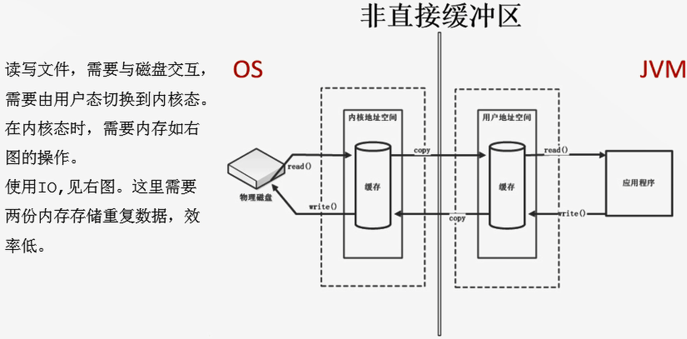
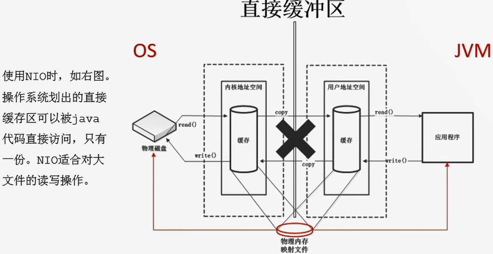

# 直接内存

- 不是虚拟机运行时数据区的一部分，也不是《Java虚拟机规范》中定义的内存区域。
- 直接内存是在Java堆外的、直接向系统申请的内存区间。
- 来源于NIO，通过存在堆中的`DirectByteBuffer`操作Native内存
- 通常，访问直接内存的速度会优于Java堆。即读写性能高。
  - 出于性能考虑，读写频繁的场合可能会考虑使用直接内存。
  - Java的NIO库允许Java程序使用直接内存，用于数据缓冲区。

```java
/**
 *  IO                  NIO (New IO / Non-Blocking IO)
 *  byte[] / char[]     Buffer
 *  Stream              Channel
 *
 * 查看直接内存的占用与释放
 */
public class BufferTest {
    private static final int BUFFER = 1024 * 1024 * 1024;//1GB

    public static void main(String[] args){
        //直接分配本地内存空间
        ByteBuffer byteBuffer = ByteBuffer.allocateDirect(BUFFER);
        System.out.println("直接内存分配完毕，请求指示！");

        Scanner scanner = new Scanner(System.in);
        scanner.next();

        System.out.println("直接内存开始释放！");
        byteBuffer = null;
        System.gc();
        scanner.next();
    }
}
```

传统IO:



NIO：



- 也可能导致OOM异常
- 由于直接内存在Java堆外，因此它的大小不会直接受限于`-Xmx`指定的最大堆大小，但是系统内存时有限的，Java堆和直接内存的总和依然受限于操作系统能给出的最大内存。
- 缺点
  - 分配回收成本较高
  - 不受JVM内存回收管理
- 直接内存大小可以通过`MaxDirectMemorySize`设置
- 如果不指定，默认与堆的最大值`-Xmx`参数值一致

```java
/**
 * 本地内存的OOM:  OutOfMemoryError: Direct buffer memory
 */
public class BufferTest2 {
    private static final int BUFFER = 1024 * 1024 * 20;//20MB

    public static void main(String[] args) {
        ArrayList<ByteBuffer> list = new ArrayList<>();

        int count = 0;
        try {
            while(true){
                ByteBuffer byteBuffer = ByteBuffer.allocateDirect(BUFFER);
                list.add(byteBuffer);
                count++;
                try {
                    Thread.sleep(100);
                } catch (InterruptedException e) {
                    e.printStackTrace();
                }
            }
        } finally {
            System.out.println(count);
        }
    }
}
```

