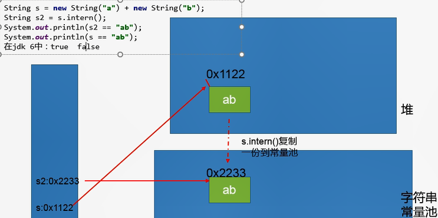
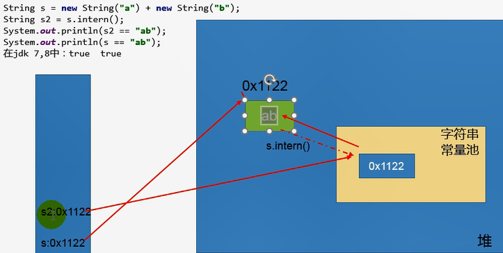
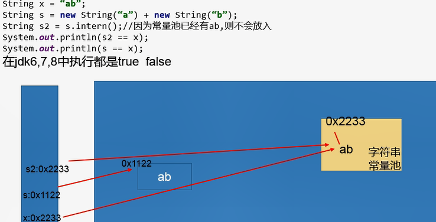

# StringTable

## String的基本特性

- `String`：字符串，使用一对""引起来表示。
  - `string s1= "atguigu";`//字面量的定义方式
  - `String s2= new String(“hello”);`
- `String`声明为`final`的，不可被继承
- `String`实现了 `Serializable`接口：表示字符串是支持序列化的。实现了 `Comparable`接口：表示`String`可以比较大小
- `String`在jdk8及以前内部定义了`final char[] value`用于存储字符串数据。jdk9时改为`byte[]`

- `String`：代表不可变的字符序列。简称：不可变性。
  - 当对字符串重新赋值时，需要重写指定内存区域赋值，不能使用原有的value进行赋值。
  - 当对现有的字符串进行连接操作时，也需要重新指定内存区域赋值，不能使用原有的value进行赋值。
  - 当调用`String`的 `replace()`方法修改指定字符或字符串时，也需要重新指定内存区域赋值，不能使用原有的 value进行赋值。

```java
/**
 * String的基本使用:体现String的不可变性
 */
public class StringTest1 {
    @Test
    public void test1() {
        String s1 = "abc";//字面量定义的方式，"abc"存储在字符串常量池中
        String s2 = "abc";
        s1 = "hello";

        System.out.println(s1 == s2);//判断地址：true  --> false

        System.out.println(s1);//
        System.out.println(s2);//abc
    }

    @Test
    public void test2() {
        String s1 = "abc";
        String s2 = "abc";
        s2 += "def";
        System.out.println(s2);//abcdef
        System.out.println(s1);//abc
    }

    @Test
    public void test3() {
        String s1 = "abc";
        String s2 = s1.replace('a', 'm');
        System.out.println(s1);//abc
        System.out.println(s2);//mbc
    }
}
```

```java
public class StringExer {
    String str = new String("good");
    char[] ch = {'t', 'e', 's', 't'};

    public void change(String str, char ch[]) {
        str = "test ok";
        ch[0] = 'b';
    }

    public static void main(String[] args) {
        StringExer ex = new StringExer();
        ex.change(ex.str, ex.ch);
        System.out.println(ex.str);//good
        System.out.println(ex.ch);//best
    }
}
```

- 通过字面量的方式给一个字符串赋值，此时的字符串值声明在字符串常量池中。
- **字符串常量池中不会存储相同内容的字符串的。**
- `String`的String Pool是一个固定大小的`HashTable`，如果字符串非常多，就会造成Hash冲突严重，从而导致链表会很长，链表长了以后直接会造成的影响就是当调用`String.intern()`时性能会大幅下降。
- 使用`-XX:StringTableSize`可设置`StringTable`的长度。
- JDK6中`StringTable`是固定的，就是**1009**的长度，如果常量池中的字符串过多就会导致效率下降很快。`StringTableSize`设置没有要求。
- JDK7中，`StringTable`的长度默认是**60013**。`StringTableSize`设置没有要求。
- JDK8开始，设置`StringTable`长度的话，1009是可设置的最小值。

## String的内存分配

- 在Java语言中有8种基本数据类型和一种比较特殊的类型String。这些类型为了使它们在运行过程中速度更快、更节省内存，都提供了一种常量池的概念。

- 常量池就类似一个Java系统级别提供的缓存。8种基本数据类型的常量池都是系统协调的，**String类型的常量池比较特殊。它的主要使用方法有两种**。
  - 直接使用双引号声明出来的`String`对象会直接存储在常量池中。比如：`String info="atguigu.com"`；
  - 如果不是用双引号声明的`String`对象，可以使用`String`提供的`intern()`方法。这个后面重点谈。

- Java 6及以前，字符串常量池存放在永久代。
- Java 7中Oracle的工程师对字符串池的逻辑做了很大的改变，将字符串常量池的位置调整到Java堆中。
- Java 8元空间，字符串常量在堆。

**问题**：`StringTable`为什么调整？

1. `PermSize`默认比较小
2. 永久代垃圾回收频率低

## String的基本操作

```java
/**
 * IDEA debug查看Memory
 */
public class StringTest4 {
    public static void main(String[] args) {
        System.out.println();//2293
        System.out.println("1");//2294
        System.out.println("2");
        System.out.println("3");
        System.out.println("4");
        System.out.println("5");
        System.out.println("6");
        System.out.println("7");
        System.out.println("8");
        System.out.println("9");
        System.out.println("10");//2303
        //如下的字符串"1" 到 "10"不会再次加载
        System.out.println("1");//2304
        System.out.println("2");//2304
        System.out.println("3");
        System.out.println("4");
        System.out.println("5");
        System.out.println("6");
        System.out.println("7");
        System.out.println("8");
        System.out.println("9");
        System.out.println("10");//2304
    }
}
```

## 字符串拼接操作

1. 常量与常量的拼接结果在常量池，原理是编译器优化。
2. 常量池中不会存在相同内容的常量。
3. 只要其中有一个是变量，结果就在堆中，变量拼接的原理是`StringBuilder`。
4. 如果拼接的结果调用`intern()`方法，则主动将常量池中还没有的字符串对象放入池中，并返回此对象地址。

```java
/**
 * 字符串拼接操作
 */
public class StringTest5 {
    @Test
    public void test1(){
        String s1 = "a" + "b" + "c";//编译期优化：等同于"abc"
        String s2 = "abc"; //"abc"一定是放在字符串常量池中，将此地址赋给s2
        /*
         * 最终.java编译成.class,再执行.class
         * String s1 = "abc";
         * String s2 = "abc"
         */
        System.out.println(s1 == s2); //true
        System.out.println(s1.equals(s2)); //true
    }

    @Test
    public void test2(){
        String s1 = "javaEE";
        String s2 = "hadoop";

        String s3 = "javaEEhadoop";
        String s4 = "javaEE" + "hadoop";//编译期优化
        //如果拼接符号的前后出现了变量，则相当于在堆空间中new String()，具体的内容为拼接的结果：javaEEhadoop
        String s5 = s1 + "hadoop";
        String s6 = "javaEE" + s2;
        String s7 = s1 + s2;

        System.out.println(s3 == s4);//true
        System.out.println(s3 == s5);//false
        System.out.println(s3 == s6);//false
        System.out.println(s3 == s7);//false
        System.out.println(s5 == s6);//false
        System.out.println(s5 == s7);//false
        System.out.println(s6 == s7);//false
        //intern():判断字符串常量池中是否存在javaEEhadoop值，如果存在，则返回常量池中javaEEhadoop的地址；
        //如果字符串常量池中不存在javaEEhadoop，则在常量池中加载一份javaEEhadoop，并返回次对象的地址。
        String s8 = s6.intern();
        System.out.println(s3 == s8);//true
    }

    @Test
    public void test3(){
        String s1 = "a";
        String s2 = "b";
        String s3 = "ab";
        /*
        如下的s1 + s2 的执行细节：(变量s是我临时定义的）
        ① StringBuilder s = new StringBuilder();
        ② s.append("a")
        ③ s.append("b")
        ④ s.toString()  --> 约等于 new String("ab")

        补充：在jdk5.0之后使用的是StringBuilder,在jdk5.0之前使用的是StringBuffer
         */
        String s4 = s1 + s2;//
        System.out.println(s3 == s4);//false
    }
    /*
    1. 字符串拼接操作不一定使用的是StringBuilder!
       如果拼接符号左右两边都是字符串常量或常量引用，则仍然使用编译期优化，即非StringBuilder的方式。
    2. 针对于final修饰类、方法、基本数据类型、引用数据类型的量的结构时，能使用上final的时候建议使用上。
     */
    @Test
    public void test4(){
        final String s1 = "a";
        final String s2 = "b";
        String s3 = "ab";
        String s4 = s1 + s2;
        System.out.println(s3 == s4);//true
    }
    //练习：
    @Test
    public void test5(){
        String s1 = "javaEEhadoop";
        String s2 = "javaEE";
        String s3 = s2 + "hadoop";
        System.out.println(s1 == s3);//false

        final String s4 = "javaEE";//s4:常量
        String s5 = s4 + "hadoop";
        System.out.println(s1 == s5);//true

    }

    /*
    体会执行效率：通过StringBuilder的append()的方式添加字符串的效率要远高于使用String的字符串拼接方式！
    详情：① StringBuilder的append()的方式：自始至终中只创建过一个StringBuilder的对象
          使用String的字符串拼接方式：创建过多个StringBuilder和String的对象
         ② 使用String的字符串拼接方式：内存中由于创建了较多的StringBuilder和String的对象，内存占用更大；如果进行GC，需要花费额外的时间。

     改进的空间：在实际开发中，如果基本确定要前前后后添加的字符串长度不高于某个限定值highLevel的情况下,建议使用构造器实例化：
               StringBuilder s = new StringBuilder(highLevel);//new char[highLevel]
     */
    @Test
    public void test6(){

        long start = System.currentTimeMillis();

//        method1(100000);//4014
        method2(100000);//7

        long end = System.currentTimeMillis();

        System.out.println("花费的时间为：" + (end - start));
    }

    public void method1(int highLevel){
        String src = "";
        for(int i = 0;i < highLevel;i++){
            src = src + "a";//每次循环都会创建一个StringBuilder、String
        }
//        System.out.println(src);

    }

    public void method2(int highLevel){
        //只需要创建一个StringBuilder
        StringBuilder src = new StringBuilder();
        for (int i = 0; i < highLevel; i++) {
            src.append("a");
        }
//        System.out.println(src);
    }
}
```

实际开发中，如果基本确定要前前后后添加的字符串长度不高于某个限定值highLevel，使用构造器

```java
StringBuilder s = new StringBuilder(highLevl);
```

## intern()的使用

如果不是用双引号声明的`String`对象，可以使用`String`提供的`intern()`方法，`intern()`方法会从字符串常量池中查询当前字符串是否存在，若不存在就会将当前字符串放入常量池中。

```java
String s = new String("abc").intern();
```

也就是说，如果在任意字符串上调用`String.intern`方法，那么返回结果指向的那个类实例，必须和直接以常量形式出现的字符串实例完全相同。

```java
("a" + "b" + "c").intern() == "abc"
```

确保字符串在内存中只有一份拷贝，这样可以节约内存空间，加快字符串操作任务的执行速度。注意，这个值会被存放在字符串常量池。

### 面试题

```java
/**
 * 题目：
 * new String("ab")会创建几个对象？看字节码，就知道是两个。
 *     一个对象是：new关键字在堆空间创建的
 *     另一个对象是：字符串常量池中的对象"ab"。 字节码指令：ldc
 *
 * 思考：
 * new String("a") + new String("b")呢？
 *  对象1：new StringBuilder()
 *  对象2： new String("a")
 *  对象3： 常量池中的"a"
 *  对象4： new String("b")
 *  对象5： 常量池中的"b"
 *
 *  深入剖析： StringBuilder的toString():
 *      对象6 ：new String("ab")
 *       强调一下，toString()的调用，在字符串常量池中，没有生成"ab"
 */
public class StringNewTest {
    public static void main(String[] args) {
       String str = new String("ab");

        // String str = new String("a") + new String("b");
    }
}
```

```class
 0 new #2 <java/lang/String>
 3 dup
 4 ldc #3 <ab>
 6 invokespecial #4 <java/lang/String.<init> : (Ljava/lang/String;)V>
 9 astore_1
10 return
```

```class
 0 new #2 <java/lang/StringBuilder>
 3 dup
 4 invokespecial #3 <java/lang/StringBuilder.<init> : ()V>
 7 new #4 <java/lang/String>
10 dup
11 ldc #5 <a>
13 invokespecial #6 <java/lang/String.<init> : (Ljava/lang/String;)V>
16 invokevirtual #7 <java/lang/StringBuilder.append : (Ljava/lang/String;)Ljava/lang/StringBuilder;>
19 new #4 <java/lang/String>
22 dup
23 ldc #8 <b>
25 invokespecial #6 <java/lang/String.<init> : (Ljava/lang/String;)V>
28 invokevirtual #7 <java/lang/StringBuilder.append : (Ljava/lang/String;)Ljava/lang/StringBuilder;>
31 invokevirtual #9 <java/lang/StringBuilder.toString : ()Ljava/lang/String;>
34 astore_1
35 return
```

```class
# toString()字节码
 0 new #80 <java/lang/String>
 3 dup
 4 aload_0
 5 getfield #234 <java/lang/StringBuilder.value : [C>
 8 iconst_0
 9 aload_0
10 getfield #233 <java/lang/StringBuilder.count : I>
13 invokespecial #291 <java/lang/String.<init> : ([CII)V>
16 areturn
```

### intern()的使用：JDK6 vs JDK7/8

```java
public static void main(String[] args) {
    String s = new String("1");
    // 调用此方法之前，字符串常量池中已经存在了"1"
    s.intern();
    String s2 = "1";
    System.out.println(s == s2); // jdk6:false jdk7/8:false

    // s3变量记录的地址为new String("11")
    String s3 = new String("1") + new String("1");
    // 执行完上一行代码后，字符串常量池中，是否存在”11“呢？不存在
    // 在字符串常量池中生成"11" 如何理解
    // jdk6:创建一个新的对象"11",也就有新的地址
    // jdk7:此时常量池没有创建"11"，而是创建一个指向堆空间new String("11")的地址
    s3.intern();
    // s4变量记录的地址:使用的是上一行代码执行时，在常量池中生成的"11"的地址
    String s4 = "11";
    System.out.println(s3 == s4); // jdk6:false jdk7/8:true
}
```

JDK6：

.png)

JDK7

.png)

```java
public class StringIntern1 {
    public static void main(String[] args) {
        //StringIntern.java中练习的拓展：
        String s3 = new String("1") + new String("1");//new String("11")
        //执行完上一行代码以后，字符串常量池中，是否存在"11"呢？答案：不存在！！
        String s4 = "11";//在字符串常量池中生成对象"11"
        String s5 = s3.intern();
        System.out.println(s3 == s4);//false
        System.out.println(s5 == s4);//true
    }
}
```

总结intern()的使用

- JDK6中，将这个字符串对象尝试放入常量池。
  - 如果常量池中有，则并不会放入。返回已有的常量池中的对象的地址。
  - 如果没有，会把**此对象复制一份(new)**，放入常量池，并返回常量池中的对象地址。
- JDK7起，将这个字符串对象尝试放入常量池。
  - 如果常量池中有，则并不会放入。返回已有的常量池中的对象的地址。
  - 如果没有，会把**此对象的引用地址复制一份**，放入常量池，并返回常量池中的引用地址。

### 练习

```java
public class StringExer1 {
    public static void main(String[] args) {
        String x = "ab";
        String s = new String("a") + new String("b");//new String("ab")
        //在上一行代码执行完以后，字符串常量池中并没有"ab"

        String s2 = s.intern();//jdk6中：在串池中创建一个字符串"ab"
                               //jdk8中：串池中没有创建字符串"ab",而是创建一个引用，指向new String("ab")，将此引用返回

        System.out.println(s2 == "ab");//jdk6:true  jdk8:true
        System.out.println(s == "ab");//jdk6:false  jdk8:true
    }
}
```







```java
public class StringExer2 {
    public static void main(String[] args) {
        String s1 = new String("ab");//执行完以后，会在字符串常量池中会生成"ab"
//        String s1 = new String("a") + new String("b");//执行完以后，不会在字符串常量池中会生成"ab"
        s1.intern();
        String s2 = "ab";
        System.out.println(s1 == s2);
    }
}
```

### intern()的效率测试

```java
/**
 * 使用intern()测试执行效率：空间使用上
 *
 * 结论：对于程序中大量存在存在的字符串，尤其其中存在很多重复字符串时，使用intern()可以节省内存空间。
 */
public class StringIntern2 {
    static final int MAX_COUNT = 1000 * 10000;
    static final String[] arr = new String[MAX_COUNT];

    public static void main(String[] args) {
        Integer[] data = new Integer[]{1,2,3,4,5,6,7,8,9,10};

        long start = System.currentTimeMillis();
        for (int i = 0; i < MAX_COUNT; i++) {
//            arr[i] = new String(String.valueOf(data[i % data.length]));
            arr[i] = new String(String.valueOf(data[i % data.length])).intern();

        }
        long end = System.currentTimeMillis();
        System.out.println("花费的时间为：" + (end - start));

        try {
            Thread.sleep(1000000);
        } catch (InterruptedException e) {
            e.printStackTrace();
        }
        System.gc();
    }
}
```

> 大的网站平台，需要内存中存储大量的字符串。比如社交网站，很多人都存储：北京市、海淀区等信息。这时候如果字符串都调用intern()方法，就会明显降低内存的大小。

## StringTable的垃圾回收

`-XX:+PrintStringTableStatistics`:打印字符串常量池的统计信息

## G1中的String去重操作

Java堆中存活的数据集合差不多25%是`String`对象，这里面差不多一半`String`对象是重复的。`str1.equals(str2)=true`。堆上存在重复的`String`对象必然是一种内存的浪费。

实现：

- 当垃圾收集器工作的时候，会访问堆上存活的对象。**对每一个访问的对象都会检查是否是候选的要去重的`String`对象。**
- 如果是，把这个对象的一个引用插入到队列中等待后续的处理。一个去重的线程在后台运行，处理这个队列。处理队列的一个元素意味着从队列删除这个元素，然后尝试去重它引用的`String`对象。
- 使用hashtable记录所有的被`String`对象使用的不重复的`char`数组。去重的时候会查这个`hashtable`，来看堆上是否存在一个一样的`char`数组。
- 如果存在`String`对象会被调整引用那个数组，释放原来的数组的引用，最终会被垃圾收集器回收掉。
- 不存在，`char`数组会被插入到`hashtable`，这样以后就可以共享这个数组了。
- 命令行选项
  - `UseStringDeduplication`：**开启String去重，默认不开启。**
  - `PrintStringDeduplicationStatistics`：打印详细的去重统计信息。
  - `StringDeduplicationAgeThreshold`：达到这个年龄的`String`对象被认为是去重的候选对象。


 