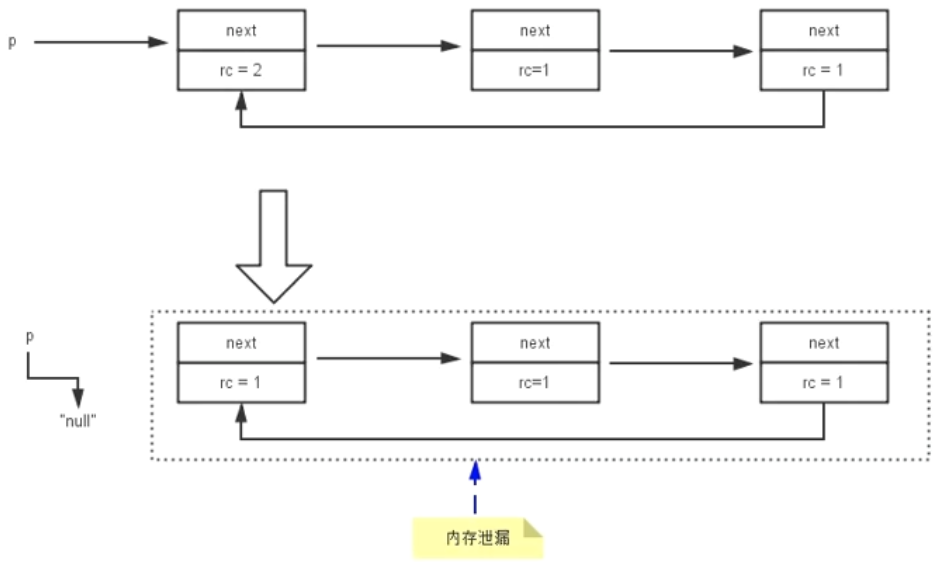
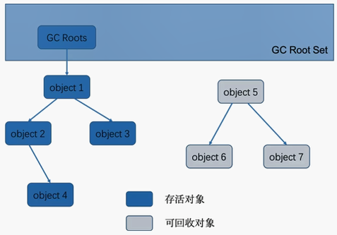
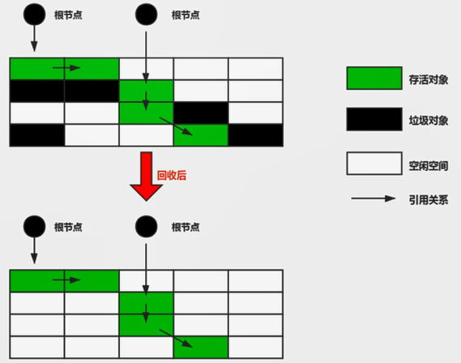
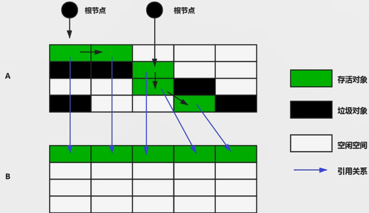
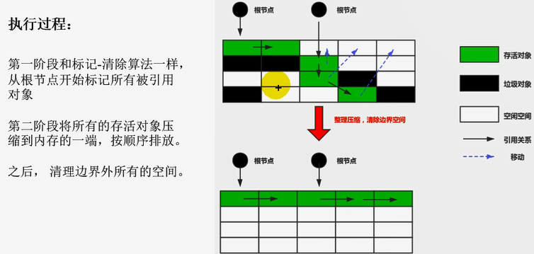

# 垃圾回收相关算法

## 标记阶段：引用计数算法

### 垃圾标记阶段：对象存活判断

- 在堆里存放着几乎所有的Java对象实例，在GC执行垃圾回收之前，首先**需要区分出内存中哪些是存活对象，哪些是已经死亡的对象**。只有被标记为己经死亡的对象，GC才会在执行垃圾回收时，释放掉其所占用的内存空间，因此这个过程我们可以称为**垃圾标记阶段**。

- 那么在JVM中究竟是如何标记一个死亡对象呢？简单来说，当一个对象已经不再被任何的存活对象继续引用时，就可以宣判为已经死亡。

- 判断对象存活一般有两种方式：==引用计数算法和可达性分析算法==。

***

- 引用计数算法比较简单，**对每个对象保存一个整型的引用计数器属性。用于记录对象被引用的情况**。

- 对一个对象A，只要有任何一个对象引用了A，则A的引用计数器就加1；当引用失效时，引用计数器就减1。只要对象A的引用计数器的值为0，表示对象A不可能再被使用，可进行回收。
- 优点：**实现简单，垃圾对象便于辨识；判定效率高，回收没有延迟性**。
- 缺点：
  - 它需要单独得到字段存储计数器，这样的做法增加了**存储空间的开销**。
  - 每次赋值都需要更新计数器，伴随着加法和减法操作，这增加了**时间开销**。
  - 引用计数器有一个严重的问题，**无法处理循环引用**的情况。这是一条致命缺陷，导致在Java的垃圾回收器中没有使用这类算法。

### 循环引用



### 小结

- 引用计数算法是很多语言的资源回收选择，例如python，它更是同时支持引用计数和垃圾收集机制。
- 具体哪种最优是要看场景的，业界有大规模实践中仅保留引用计数机制，以提高吞吐量的尝试。
- Java没有选择引用计数是因为它很难处理循环引用关系。
- python如何解决循环引用？
  - 手动解除：在合适的时机解除引用关系。
  - 使用弱引用weakref，weakref是python提供的标准库，旨在解决循环引用。

## 标记阶段：可达性分析算法（根搜索算法、追踪性垃圾收集）

- 相对于引用计数算法而言，可达性分析算法不仅同样具备实现简单执行高效等特点，更重要的是该算法可以有效地**解决在引用计数算法中循环引用的问题，防止内存泄漏的发生**。

***

- 所谓“GC Roots”根集合就是一组必须活跃的引用。
- 基本思路：
  - 可达性分析算法是以根对象集合（GC Roots）为起始点，按照从上至下的方式**搜索被根对象集合所连接的目标对象是否可达**。
  - 使用可达性分析算法后，内存中的存活对象都会被根对象集合直接或间接连接着，搜索所走过的路径称为**引用链**。
  - 如果目标对象没有任何引用链连接，则是不可达的，可以标记为垃圾对象。
  - 在可达性分析算法中，只有被根集合对象直接或间接连接的对象才是存活对象。



在Java语言中，GC Roots包括以下几类元素：

- 虚拟机栈中引用的对象
  - 比如：各个线程被调用的方法中使用到的参数、局部变量等。
- 本地方法栈内JNI（本地方法）引用的对象
- 方法区中类静态属性引用的对象
  - 比如：Java类的引用类型静态变量
- 方法区中常量引用的对象
  - 比如：字符串常量池（String Table）里的引用
- 所有被同步锁`synchronized`持有的对象
- Java虚拟机内部的引用
  - 基本数据类型对应的`Class`对象，一些常驻的异常对象（如：NPE、OOM）,系统类加载器。
- 反应Java虚拟机内部情况的JMXBean、JVMTI中注册的回调、本地代码缓存等。
- 除了这些固定的GC Roots集合以外，根据用户所选用的垃圾收集器以及当前回收的内存区域不同，还可以有其他对象“临时性”地加入，共同构成完整GC Roots集合。比如：分代收集和局部回收（Partial GC）。
  - 如果只针对Java堆中的某一块区域进行垃圾回收（比如：典型的只针对新生代），必须考虑到内存区域是虚拟机自己的实现细节，更不是孤立封闭的，这个区域的对象完全有可能被其他区域的对象所引用，这时候就需要一并将关联的区域对象也加入GC Roots集合中去考虑，才能保证可达性分析的准确性。
  - 比如对年轻代进行回收，老年代中的变量指向了年轻代，也需要放入Roots Set中。
- 如果要使用可达性分析算法来判断内存是否可回收，那么分析工作必须在一个能保障一致性的快照中进行。这点不满足的话分析结果的准确性就无法保证。
- 这点也是导致GC进行时必须“Stop The World”的一个重要原因。
  - 即使是号称（几乎）不会发生停顿的CMS收集器中，**枚举根节点时也是必须要停顿的**。

## 对象的finalization机制

- Java语言提供了对象终止（finalization）机制来允许开发人员提供**对象销毁之前的自定义处理逻辑**。

- 当垃圾回收器发现没有引用指向一个对象，即：垃圾回收对象之前，总会调用对象的`finalize()`方法。
- `finalize()`方法允许在子类中被重写，**用于在对象被回收时进行资源释放**。通常在这个方法中进行一些资源释放和清理的工作，比如关闭文件、套接字和数据库连接等。
- 永远不主动调用`finalize()`方法，应该交给垃圾回收机制调用。理由有三点：
  - 在`finalize()`时可能会导致对象复活
  - `finalize()`方法的执行时间没有保障的，它完全由GC线程决定。若不发生GC，则`finalize()`方法将没有执行机会。
  - 一个糟糕的`finalize()`方法会严重影响GC的性能。
- 由于`finalize()`方法的存在，虚拟机中的对象一般处于三种可能的状态。
  - 可触及的：从根节点开始，可以到达这个对象
  - 可复活的：对象的所有引用都被释放，但是对象有可能在`finalize()`中复活。
  - 不可触及的：对象`finalize()`被调用，并且没有复活，那么就会进入不可触及状态。不可触及的对象不可能被复活，因为`finalize()`只会被调用一次。
- 以上三种状态中，是由于`finalize()`方法的存在，进行的区分，只有对象不可触及时才可以被回收。

具体过程：

判断一个对象是否可回收，至少经历两次标记过程：

1. 如果对象到GC Roots没有引用链，则进行第一次标记。
2. 进行筛选，判断此对象是否有必要执行`finalize()`方法
   -  如果对象没有重写`finalize()`方法，或者`finalize()`方法已经被虚拟机调用过，则虚拟机视为“没有必要执行”，被判定为不可触及的。
   - 如果对象重写了`finalize()`方法，且还没有执行过，那么对象会被插入到F-Queue队列中，由一个虚拟机自动创建的、低优先级的Finalizer线程触发其`finalize()`方法执行。
   -  ==`finalize()`方法是对象逃脱死亡的最后机会==，稍候GC会对F-Queue队列中的对象进行第二次标记。如果对象在`finalize()`方法中与引用链上的任何一个对象建立了联系，那么在第二次标记时，对象会被移除“即将回收”集合。之后，对象会再次出现没有引用存在的情况。在这个情况下，`finalize()`方法不会被再次调用，对象会直接变成不可触及的状态。对象的`finalize()`方法只会被调用一次。

```java
/**
 * 测试Object类中finalize()方法，即对象的finalization机制。
 */
public class CanReliveObj {
    public static CanReliveObj obj;//类变量，属于 GC Root


    //此方法只能被调用一次
    @Override
    protected void finalize() throws Throwable {
        super.finalize();
        System.out.println("调用当前类重写的finalize()方法");
        obj = this;//当前待回收的对象在finalize()方法中与引用链上的一个对象obj建立了联系
    }

    public static void main(String[] args) {
        try {
            obj = new CanReliveObj();
            // 对象第一次成功拯救自己
            obj = null;
            System.gc();//调用垃圾回收器
            System.out.println("第1次 gc");
            // 因为Finalizer线程优先级很低，暂停2秒，以等待它
            Thread.sleep(2000);
            if (obj == null) {
                System.out.println("obj is dead");
            } else {
                System.out.println("obj is still alive");
            }
            System.out.println("第2次 gc");
            // 下面这段代码与上面的完全相同，但是这次自救却失败了
            obj = null;
            System.gc();
            // 因为Finalizer线程优先级很低，暂停2秒，以等待它
            Thread.sleep(2000);
            if (obj == null) {
                System.out.println("obj is dead");
            } else {
                System.out.println("obj is still alive");
            }
        } catch (InterruptedException e) {
            e.printStackTrace();
        }
    }
}
```

## MAT与JProfiler的GC Roots溯源

```java
/**
 * -Xms8m -Xmx8m -XX:+HeapDumpOnOutOfMemoryError
 */
public class HeapOOM {
    byte[] bytes = new byte[1*1024*1024];

    public static void main(String[] args) {
        ArrayList<HeapOOM> heapOOMS = new ArrayList<>();
        try {
            while (true){
                heapOOMS.add(new HeapOOM());
            }
        } catch (Exception e) {
            e.printStackTrace();
        }
    }
}
```


## 清除阶段：标记-清除算法

当成功区分出内存中存活对象和死亡对象后，GC接下来的任务就是执行垃圾回收，释放掉无用对象所占用的内存空间，以便有足够的可用内存空间为新对象分配内存。

目前在JVM中比较常见的三种垃圾收集算法是标记一清除算法（Mark-Sweep）、复制算法（Copying）、标记-压缩算法（Mark-Compact）。

***

当堆中的有效内存空间被耗尽的时候，就会停止整个程序（stop the world），然后进行两项工作，第一项是标记、第二项则是清除。

- 标记：Collector从引用根节点开始遍历，==标记所有被引用的对象==。一般是在对象的Header中记录为==可达对象==。
- 清除：Collector对堆内存从头到尾进行线性的遍历，如果发现某个对象在其Header中没有标记为可达对象，则将其回收。



优点：基础、容易理解

缺点：

1. 效率不算高
2. 在进行GC的时候，需要停止整个应用程序，导致用户体验差
3. 这种方式清理出来的内存时不连续的，产生内存碎片。需要维护一个空闲列表（也要占用内存空间）

**何为清除？**

这里所谓的清除并不是真的置空，而是把需要清除的对象地址保存在空闲地址列表里。下一次有新对象需要加载时，判断垃圾的位置空间是否够，如果够，就存放覆盖。

## 清除阶段：复制算法

为了解决标记-清除算法在垃圾收集效率方面的缺陷。

将活着的内存空间分为两块，每次只是用其中一块，在垃圾回收时将正在使用的内存中的存活对象复制到未被使用的内存块中，之后清除正在使用的内存块中的所有对象，交换两个内存的角色，最后完成垃圾回收。



优点：

1. 没有标记和清除过程，实现简单，运行高效。
2. 复制过去以后保证空间的连续性，不会出现“碎片”问题。

缺点：

1. 此算法的缺点也是很明显的，就是需要两倍的内存空间。
2. 对于G1这种分拆成为大量的region的GC，复制而不是移动，意味着GC需要维护region之间对象引用关系，不管是内存占用或者时间开销也不小。

特别的：

如果系统中的存活对象很多，复制算法不会很理想。因为需要复制算法的存活对象数量并不会太大，或者说非常低才行。

## 清除阶段：标记-压缩算法

复制算法的高效性是建立在存活对象少、垃圾对象多的前提下的。这种情况在新生代经常发生，但是在老年代，更常见的情况是大部分对象都是存活对象。

标记-清除算法的确可以应用在老年代，但是该算法不仅执行效率低下，而且在执行完内存回收后还会产生内存碎片，所以JVM的设计者需要在此基础之上进行改进。标记-压缩算法由此诞生。



标记-压缩算法的最终效果等同于标记-清除算法执行完成后，再进行一次内存碎片整理，因此，也可以把它称为==标记-清除-压缩（Mark-Sweep-Compact）算法==。

二者的本质差异在于==标记-清除算法是一种非移动式的回收算法==，==标记-压缩是移动式的==。是否移动回收后的存活对象是一项优缺点并存的风险决策。

可以看到，标记的存活对象将会被整理，按照内存地址依次排列，而未被标记的内存会被清理掉。如此一来，当我们需要给新对象分配内存时，JVM只需要持有一个内存的起始地址即可，这比维护一个空闲列表显然少了许多开销。

优点：

1. 消除了标记-清除算法当中，内存区域分散的缺点，我们需要给新对象分配内存时，JVM只需要持有一个内存的起始地址即可。
2. 消除了复制算法中，内存减半的高额代价。

缺点：

1. 从效率上来说，标记-整理算法要低于复制算法。
2. 移动对象的同时，如果对象被其他对象引用，则还需要调整引用的地址。
3. 移动过程中，需要全程暂停用户应用程序。

## 小结

|          | 标记-清除      | 标记-整理      | 复制                                |
| -------- | -------------- | -------------- | ----------------------------------- |
| 效率     | 中等           | 最慢           | 最快                                |
| 空间开销 | 少，会堆积碎片 | 少，不堆积碎片 | 通常需要活对象的2倍大小，不堆积碎片 |
| 移动对象 | 否             | 是             | 是                                  |

效率上来说，复制算法是当之无愧的老大，但是却浪费了太多内存。

而为了尽量兼顾上面提到的三个指标，标记-整理算法相对来说更平滑一些，但是效率上不尽如人意，它比复制算法多了一个标记的阶段，比标记-清除多了一个整理内存的阶段。

## 分代收集算法

分代收集算法基于这样一个事实：不同的对象的生命周期是不一样的。==因此不同生命周期的对象可以采取不同的收集方式，以便提高回收效率==。

几乎所有的GC都是采用分代收集算法执行垃圾回收的。

在HotSpot中，基于分代的概念，GC使用的内存回收算法必须结合年轻代和老年代各自的特点。

- 年轻代（Young Gen）

  年轻代特点：区域相对老年代较小，对象生命周期短、存活率低，回收频繁。

  这种情况复制算法的回收整理，速度是最快的。复制算法的效率只和当前存活对象大小有关，因此很适用于年轻代的回收。而复制算法内存利用率不高的问题，通过两个survivor的设计得到缓解。

- 老年代（Tenured Gen）

   老年代特点：区域较大，对象生命周期长、存活率高，回收不及年轻代频繁。

  这种情况存在大量存活率高的对象，符合算法明显变得不合适。一般是由标记-清除或者是标记-整理的混合实现，

  - Mark阶段的开销与存活对象的数量成正比。
  - Sweep阶段的开销与所管理区域的大小成正相关。
  - Compact阶段的开销与存活对象的数据成正比。   

## 增量收集算法、分区算法

### 增量收集算法

如果一次性将所有的垃圾进行处理，需要造成系统长时间的停顿，那么就可以让垃圾收集线程和应用程序线程交替执行。**每次，垃圾收集线程只收集一小片区域的内存空间，接着切换到应用程序线程。一次反复，直到垃圾收集完成。**

总的来说，增量收集算法的基础仍然是标记-清除和复制算法。增量收集算法通过**对线程间冲突的妥善处理，允许垃圾收集线程以分阶段的方式完成标记、清理或复制工作。**  

缺点：

使用这种方式，由于在垃圾回收过程中，间断性的还执行了应用程序代码，所以能减少系统的停顿时间。但是，因为线程切换和上下文转换的消耗，会使得垃圾回收的总体成本上升，**造成系统吞吐量的下降。**

### 分区算法

相同条件下，堆空间越大，一次GC时所需要的时间就越长，有关GC产生的停顿就越长。为了更好控制GC产生的停顿时间，将一块大的内存区域分割成多个小块，根据目标的停顿时间，每次合理地回收若干个小区间，而不是整个堆空间，从而减少一次GC所产生的的停顿。

分区算法将整个堆空间分成连续的不同小区间region。

每个小区间都独立使用，独立回收。可以控制一次回收多少个小空间。
