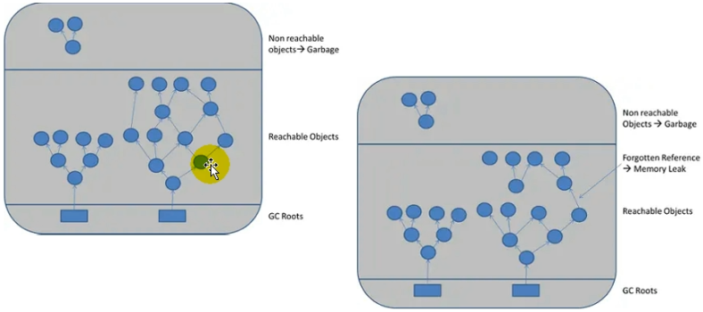
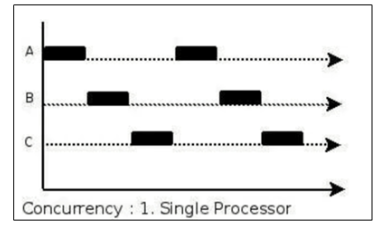
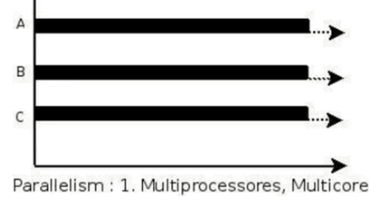
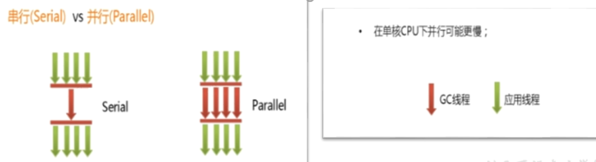
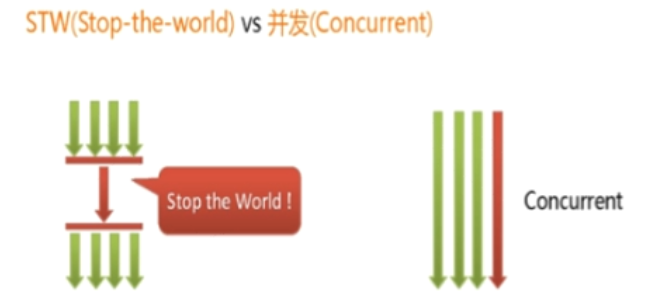

# 垃圾回收相关概念

## System.gc()的理解

`System.gc()`或者`Runtime.getRuntime().gc()`==会显式触发Full GC==，同时对老年代和新生代进行回收，尝试释放被丢弃对象占用的内存。

`System.gc()`调用附带一个免责声明，无法保证对垃圾收集器的调用。

JVM实现者可以通过`System.gc()`调用来决定JVM的GC行为。而一般情况下，垃圾回收应该是自动进行的，==无须手动触发，否则就太过于麻烦了==。在一些特殊情况下，如我们正在编写一个性能基准，我们可以在运行之间调用`System.gc()`。

```java
public class SystemGCTest {
    public static void main(String[] args) {
        new SystemGCTest();
        System.gc();//提醒jvm的垃圾回收器执行gc,但是不确定是否马上执行gc
        //与Runtime.getRuntime().gc();的作用一样。

        System.runFinalization();//强制调用使用引用的对象的finalize()方法
    }

    @Override
    protected void finalize() throws Throwable {
        super.finalize();
        System.out.println("SystemGCTest 重写了finalize()");
    }
}
```

## 内存溢出与内存泄漏

### 内存溢出（OOM）

javadoc中对`OutOfMemoryError`的解释是：没有空闲内存，并且垃圾收集器也无法提供更多内存。

首先说没有空闲内存的情况：说明Java虚拟机的堆内存不够。原因有二：

- ==Java虚拟机的堆内存设置不够。==
  - 可能存在内存泄漏问题
  - 可能堆的大小不合适
- ==代码中创建了大量大对象，并且长时间不能被垃圾收集器收集（存在被引用）。==
- 这里面隐含着一层意思，在抛出`OutOfMemoryError`之前，通常垃圾收集器会被触发，尽其所能去清理出空间。
  - 例如：在引用机制分析中，涉及到JVM会去尝试回收软引用指向的对象等。
- 当然，也不是在任何情况下垃圾收集器都会被触发的。
  - 比如，我们去分配一个超大对象，已经超过堆的最大值，JVM判断出垃圾收集并不能解决这个问题，直接抛出`OutOfMemoryError`。

### 内存泄漏（Memory Leak）

==严格来说，只有对象不会再被程序用到了，但是GC又不能回收他们的情况，才叫内存泄漏。==

但实际情况很多时候一些不太好的实践（或疏忽）会导致对象的生命周期变很长很长甚至导致OOM，也可以叫做**宽泛意义上的“内存泄漏”。**



举例：

1. 单例模式：单例的生命周期和应用程序是一样长的，所以单例程序中，如果持有对外部对象的引用的话，那么这个外部对象是不能被回收的，则会导致内存泄漏的产生。

   ```java
   class A {
   	public A(){
   		B.getInstance().setA(this);
   	}
   ....
   }
   //B类采用单例模式
   class B{
   	private A a;
   	private static B instance=new B();
   	public B(){}
   	public static B getInstance(){
   		return instance;
   	}
       public void setA(A a){
       	this.a=a;
       }
   //getter...
   }
   ```

2. 一些提供close的资源未关闭导致内存泄漏：数据库连接（`dataSourse.getConnection()`），网络连接(`socket`)和io连接必须手动close，否则是不能被回收的。

3. 静态集合类引起内存泄露：像`HashMap`、`Vector`等的使用最容易出现内存泄露，这些静态变量的生命周期和应用程序一致，他们所引用的所有的对象`Object`也不能被释放，因为他们也将一直被`Vector`等引用着。

   ```java
   Static Vector v = new Vector(10);
   for (int i = 1; i<100; i++){
       Object o = new Object();
       v.add(o);
       o = null;
   }
   ```

## Stop The World

GC事件发生过程中，会产生应用程序的停顿。==停顿产生时整个应用程序线程都会被暂停，没有任何响应==，有点像卡死的感觉，这个停顿称为STW。

可达性分析算法中枚举根节点（GC Roots）会导致所有Java执行线程停顿。

- 分析工作必须在一个能确保一致性的快照中进行
- 一致性指整个分析期间整个执行系统看起来像被冻结在某个时间点上
- ==如果出现分析过程中对象关系还在不断变化，则分析结果的准确性无法保证==

被STW中断的应用程序线程会在完成GC之后恢复，频繁中断会让用户感觉像是网速不快造成电影卡带一样，所以我们需要减少STW的发生。

- STW事件和采用哪款GC无关，所有的GC都有这个事件
- 哪怕是G1也不能完全避免stop-the-world情况发生，只能说垃圾回收器越来越优秀，回收效率越来越高，尽可能地缩短了暂停时间。

- STW是JVM在==后台自动发起和自动完成==的。在用户不可见的情况下，把用户正常的工作线程全部停掉。

- 开发中不要用`System.gc()`;会导致stop-the-world的发生。

## 垃圾回收的并行与并发

### 程序的并发（Concurrent）

在操作系统中，指**一个时间段中**有几个程序都处于已启动运行到运行完毕之间，且这几个程序都是在同一个处理器上运行。

并不是真正意义上的“同时进行”，只是CPU把一个时间段划分成几个时间片段（时间区间），然后在这几个时间区间之间来回切换，由于CPU处理的速度非常快，只要时间间隔处理得当，即可让用户感觉是多个应用程序同时在进行。



### 程序的并行（Parallel）

当系统有一个以上CPU时，当一个CPU执行一个进程时，另一个CPU可以执行另一个进程，两个进程互不抢占CPU资源，可以同时进行。

其实决定并行的因素不是CPU的数量，而是CPU的核心数量，比如一个CPU多个核也可以并行。



### 二者对比：

并发：多个事情，在==同一时间段内同时发生了==，多个任务之间互相抢占资源

并行：多个事情，在==同一时间点上同时发生了==，多个任务之间不互相抢占资源

只有在多CPU或者一个CPU多核的情况下，才会发生并行。否则，看似同时发生的事情，其实都是并发执行的。

### 垃圾回收的并行和并发

- 并行（Parallel）：指多条垃圾收集线程并行工作，但此时用户线程仍处于等待状态。
  - 如ParNew、Parallel Scavenge、Parallel Old
- 串行（Serial）
  - 相较于并行的概念，单线程执行
  - 如果内存不够，则程序暂停，启动JVM垃圾回收器进行回收。回收完，再启动程序的线程



- 并发（Concurrent）：指用户线程与垃圾收集线程同时执行（但不一定是并行的，可能会交替执行），垃圾回收线程执行时不会停顿用户程序的运行。
  - 用户程序在继续运行，而垃圾收集程序线程运行于另一个CPU上
  - 如CMS、G1



## 安全点与安全区域

### 安全点

程序执行时并非在所有地方都能停顿下来开始GC，只有特定的位置才能停顿下来开始GC，这些位置称为安全点（Safepoint）

安全点如果太少可能导致GC等待时间太长，如果太频繁可能导致运行时的性能问题。通常会根据“是否具有让程序长时间执行的特征”为标准。比如：选择一些执行时间较长的指令作为安全点，比如**方法调用、循环跳转和异常跳转**等。

如何在GC发生时，检查所有线程都跑到最近的安全点停顿下来呢？

- 抢占式中断：（目前没有虚拟机采用了）

首先中断所有线程。如果还有线程不在安全点，就恢复线程，让线程跑到安全点。

- 主动式中断：

设置一个中断标志，各个线程运行到安全点的时候主动轮训这个标志，如果中断标志为真，则将自己进行中断挂起。

### 安全区域

如果程序不执行的时候，比如线程属于sleep或blocked状态，无法响应JVM的中断请求，”走“到安全点去中断挂起，JVM也不太可能等待线程被唤醒，这种情况就需要安全区域来解决。

安全区域是指在一段代码片段中，对象的引用关系不会发生变化，在这个区域中的任何位置开始GC都是安全的。我们也可以把安全区域看作是被扩展了的安全点。

实际执行：

1. 当线程运行到安全区域的代码时，首先标识已经进入了安全区域，如果这段时间内发生GC，JVM会忽略标识为安全区域状态的线程。
2. 当线程即将离开安全区域时，会检查JVM是否已经完成GC，如果完成了，则继续运行，否则线程必须等待直到收到可以安全离开安全区域的信号位置。

## 再谈引用：强引用

我们希望能描述这样一类对象：当内存空间还足够时，则能保留在内存中；如果内存空间在进行垃圾收集后还是很紧张，则可以抛弃这些对象。

在JDK1.2版之后，Java对引用的概念进行了扩充，将引用分为强引用（strong Reference）、软引用（Soft Reference）、弱引用（Weak Reference）和虚引用（Phantom Reference）4种，==这4种引用强度依次逐渐减弱==。

除强引用外，其他3种引用均可以在`java.lang.ref`包中找到它们的身影。如下图，显示了这3种引用类型对应的类，开发人员可以在应用程序中直接使用它们。

Reference子类中只有终结器引用是包内可见的，其他3种引用类型均为`public`，可以在应用程序中直接使用

- 强引用（StrongReference）：最传统的“引用”的定义，是指在程序代码之中普遍存在的引用赋值，即类似“`Object obj=new Object()`”这种引用关系。==无论任何情况下，只要强引用关系还存在，垃圾收集器就永远不会回收掉被引用的对象==。

- 软引用（SoftReference）：在系统将要发生内存溢出之前，将会把这些对象列入回收范围之中进行第二次回收。如果这次回收后还没有足够的内存，才会抛出内存溢出异常。
- 弱引用（WeakReference）：被弱引用关联的对象只能生存到下一次垃圾收集之前。当垃圾收集器工作时，无论内存空间是否足够，都会回收掉被弱引用关联的对象。
- 虚引用（PhantomReference）：一个对象是否有虚引用的存在，完全不会对其生存时间构成影响，也无法通过虚引用来获得一个对象的实例。为一个对象设置虚引用关联的==唯一目的就是能在这个对象被收集器回收时收到一个系统通知==。

***

==不回收==

强引用的对象是可触及的（可达的），垃圾收集器就永远不会回收掉被引用的对象。

强引用是造成Java内存泄漏的主要原因之一。

## 再谈引用：软引用

==内存不足就回收==

描述还有用但是非必须的对象。==只有软引用关联着的对象，在系统将要发生内存溢出之前，将会把这些对象列入回收范围之中进行第二次回收==（第一次是回收不可达对象）。如果这次回收后还没有足够的内存，才会抛出内存溢出异常。

软引用通常用来实现内存敏感的缓存。比如：高速缓存就有用到软引用。如果还有空闲内存，就可以暂时保留缓存，当内存不足时清理掉，这样就保证了使用缓存的同时，不会耗尽内存。

垃圾回收器在某个时刻决定回收软可达的对象的时候，会清理软引用，并可选地把引用存放到一个引用队列（Reference Queue）。

类似弱引用，只不过Java虚拟机会尽量让软引用的存活时间长一些，迫不得已才清理。

在JDK1.2版之后提供了`java.1ang.ref.SoftReference`类来实现软引用。

```java
Object obj=new Object();//声明强引用
SoftReference<Object>sf=new SoftReference<Object>(obj);
obj=null;//销毁强引用
```

```java
/**
 * 软引用的测试：内存不足即回收
 */
public class SoftReferenceTest {
    public static class User {
        public User(int id, String name) {
            this.id = id;
            this.name = name;
        }

        public int id;
        public String name;

        @Override
        public String toString() {
            return "[id=" + id + ", name=" + name + "] ";
        }
    }

    public static void main(String[] args) {
        //创建对象，建立软引用
//        SoftReference<User> userSoftRef = new SoftReference<User>(new User(1, "songhk"));
        //上面的一行代码，等价于如下的三行代码
        User u1 = new User(1,"songhk");
        SoftReference<User> userSoftRef = new SoftReference<User>(u1);
        u1 = null;//取消强引用


        //从软引用中重新获得强引用对象
        System.out.println(userSoftRef.get());

        System.gc();
        System.out.println("After GC:");
//        //垃圾回收之后获得软引用中的对象
        System.out.println(userSoftRef.get());//由于堆空间内存足够，所有不会回收软引用的可达对象。
//
        try {
            //让系统认为内存资源紧张、不够
//            byte[] b = new byte[1024 * 1024 * 7];
            byte[] b = new byte[1024 * 7168 - 635 * 1024];
        } catch (Throwable e) {
            e.printStackTrace();
        } finally {
            //再次从软引用中获取数据
            System.out.println(userSoftRef.get());//在报OOM之前，垃圾回收器会回收软引用的可达对象。
        }
    }
}
```

## 再谈引用：弱引用

==发现就回收==

弱引用也是用来描述那些非必需对象，==只被弱引用关联的对象只能生存到下一次垃圾收集发生为止==。在系统GC时，只要发现弱引用，不管系统堆空间使用是否充足，都会回收掉只被弱引用关联的对象。

但是，由于垃圾回收器的线程通常优先级很低，因此，并不一定能很快地发现持有弱引用的对象。在这种情况下，弱引用对象可以存在较长的时间。

弱引用和软引用一样，在构造弱引用时，也可以指定一个引用队列，当弱引用对象被回收时，就会加入指定的引用队列，通过这个队列可以跟踪对象的回收情况。

==软引用、弱引用都非常适合来保存那些可有可无的缓存数据==。如果这么做，当系统内存不足时，这些缓存数据会被回收，不会导致内存溢出。而当内存资源充足时，这些缓存数据又可以存在相当长的时间，从而起到加速系统的作用。

在JDK1.2版之后提供了`java.lang.ref.WeakReference`类来实现弱引用。

```java
Object obj=new Object();//声明强引用
WeakReference<Object>wr=new WeakReference<Object>(obj);
obj=nul1；//销毁强引用
```

==弱引用对象与软引用对象的最大不同==就在于，当GC在进行回收时，需要通过算法检查是否回收软引用对象，而对于弱引用对象，GC总是进行回收。==弱引用对象更容易、更快被GC回收==。

```java
/**
 * 弱引用的测试
 */
public class WeakReferenceTest {
    public static class User {
        public User(int id, String name) {
            this.id = id;
            this.name = name;
        }

        public int id;
        public String name;

        @Override
        public String toString() {
            return "[id=" + id + ", name=" + name + "] ";
        }
    }

    public static void main(String[] args) {
        //构造了弱引用
        WeakReference<User> userWeakRef = new WeakReference<User>(new User(1, "songhk"));
        //从弱引用中重新获取对象
        System.out.println(userWeakRef.get());

        System.gc();
        // 不管当前内存空间足够与否，都会回收它的内存
        System.out.println("After GC:");
        //重新尝试从弱引用中获取对象
        System.out.println(userWeakRef.get());
    }
}
```

## 再谈引用：虚引用

==对象回收跟踪==

也称为“幽灵引用”或者“幻影引用”，是所有引用类型中最弱的一个。

一个对象是否有虚引用的存在，完全不会决定对象的生命周期。如果一个对象仅持有虚引用，那么它和没有引用几乎是一样的，随时都可能被垃圾回收器回收。

它不能单独使用，也无法通过虚引用来获取被引用的对象。当试图通过虚引用的`get()`方法取得对象时，总是null。

==为一个对象设置虚引用关联的唯一目的在于跟踪垃圾回收过程。比如：能在这个对象被收集器回收时收到一个系统通知。==

- 虚引用必须和引用队列一起使用。虚引用在创建时必须提供一个引用队列作为参数。当垃圾回收器准备回收一个对象时，如果发现它还有虚引用，就会在回收对象后，将这个虚引用加入引用队列，以通知应用程序对象的回收情况。

- ==由于虚引用可以跟踪对象的回收时间，因此，也可以将一些资源释放操作放置在虚引用中执行和记录。==

- 在JDK1.2版之后提供了`PhantomReference`类来实现虚引用。

```java
/**
 * 虚引用的测试
 */
public class PhantomReferenceTest {
    public static PhantomReferenceTest obj;//当前类对象的声明
    static ReferenceQueue<PhantomReferenceTest> phantomQueue = null;//引用队列

    public static class CheckRefQueue extends Thread {
        @Override
        public void run() {
            while (true) {
                if (phantomQueue != null) {
                    PhantomReference<PhantomReferenceTest> objt = null;
                    try {
                        objt = (PhantomReference<PhantomReferenceTest>) phantomQueue.remove();
                    } catch (InterruptedException e) {
                        e.printStackTrace();
                    }
                    if (objt != null) {
                        System.out.println("追踪垃圾回收过程：PhantomReferenceTest实例被GC了");
                    }
                }
            }
        }
    }

    @Override
    protected void finalize() throws Throwable { //finalize()方法只能被调用一次！
        super.finalize();
        System.out.println("调用当前类的finalize()方法");
        obj = this;
    }

    public static void main(String[] args) {
        Thread t = new CheckRefQueue();
        t.setDaemon(true);//设置为守护线程：当程序中没有非守护线程时，守护线程也就执行结束。
        t.start();

        phantomQueue = new ReferenceQueue<PhantomReferenceTest>();
        obj = new PhantomReferenceTest();
        //构造了 PhantomReferenceTest 对象的虚引用，并指定了引用队列
        PhantomReference<PhantomReferenceTest> phantomRef = new PhantomReference<PhantomReferenceTest>(obj, phantomQueue);

        try {
            //不可获取虚引用中的对象
            System.out.println(phantomRef.get());

            //将强引用去除
            obj = null;
            //第一次进行GC,由于对象可复活，GC无法回收该对象
            System.gc();
            Thread.sleep(1000);
            if (obj == null) {
                System.out.println("obj 是 null");
            } else {
                System.out.println("obj 可用");
            }
            System.out.println("第 2 次 gc");
            obj = null;
            System.gc(); //一旦将obj对象回收，就会将此虚引用存放到引用队列中。
            Thread.sleep(1000);
            if (obj == null) {
                System.out.println("obj 是 null");
            } else {
                System.out.println("obj 可用");
            }
        } catch (InterruptedException e) {
            e.printStackTrace();
        }
    }
}
```

## 再谈引用：终结器引用

用以实现对象的`finalize()`方法，在GC时，终结器引用入队。由Finalizer线程通过终结器引用找到被引用对象并调用它的`finalize()`方法，第二次GC时才能回收被引用对象。


