# 垃圾收集器

> Java不同版本的新特性：
> 1.语法层面：Lambda表达式、switch、自动装箱、自动拆箱、enum、<>、。。。
> 2.API层面：Stream API、新的日期时间、Optional、String、集合框架
> 3.底层优化：JVM的优化，GC的变化、元空间、静态域、字符串常量池等


## GC分类与性能指标

- 垃圾收集器没有在规范中进行过多的规定，可以由不同的厂商、不同版本的JVM来实现。

- 由于JDK的版本处于高速迭代过程中，因此Java发展至今已经衍生了众多的GC版本。

- 从不同角度分析垃圾收集器，可以将GC分为不同的类型。


### GC分类

按==线程数==分：可以分为串行垃圾回收器和并行垃圾回收器

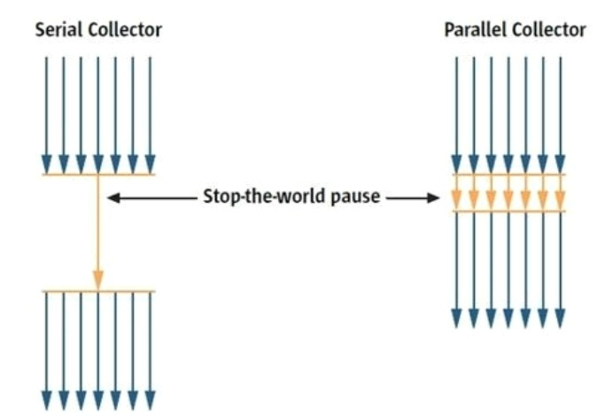

按工作模式分：可以分为并发式垃圾回收器和独占式垃圾回收器

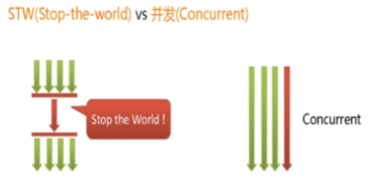

按碎片处理方式分：可以分为压缩式垃圾回收器和非压缩式垃圾回收器

按工作内存区间分：可以分为年轻代垃圾回收器和老年代垃圾回收器


### 评估GC的性能指标

- ==**吞吐量：运行用户代码的时间占总运行时间的比例。**==
  - 总运行时间：程序的运行时间 + 内存回收的事件。
- 垃圾收集开销：吞吐量的补数，垃圾收集所用时间与总运行时间的比例。
- ==**暂停时间：执行垃圾收集时，程序的工作线程被暂停的时间。**==
- 收集频率：相对于应用程序的执行，收集操作发生的频率。
- ==**内存占用：Java堆区所占的内存大小。**==
- 快速：一个对象从诞生到被回收所经历的时间。 

吞吐量 = 运行用户代码时间 / （运行用户代码时间 + 垃圾收集时间）

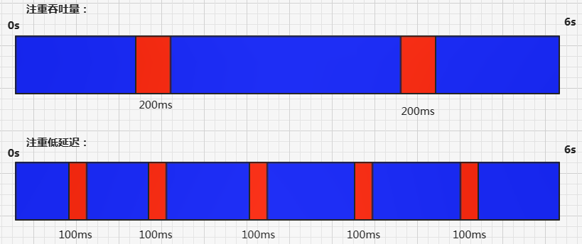

现在标准：==在最大吞吐量优先的情况下，降低停顿时间。==


## 不同的垃圾回收器概述

Java常见的垃圾收集器有哪些？

垃圾收集器发展史

有了虚拟机，就一定需要收集垃圾的机制，这就是Garbage Collection，对应的产品我们称为Garbage Collector。

- 1999年随JDK1.3.1一起来的是串行方式的SerialGC，它是第一款GC。ParNew垃圾收集器是Serial收集器的多线程版本

- 2002年2月26日，Parallel GC和Concurrent Mark Sweep GC跟随JDK1.4.2一起发布Parallel GC在JDK6之后成为HotSpot默认GC。

- 2012年，在JDK1.7u4版本中，G1可用。

- 2017年，JDK9中G1变成默认的垃圾收集器，以替代CMS。

- 2018年3月，JDK10中G1垃圾回收器的并行完整垃圾回收，实现并行性来改善最坏情况下的延迟。

- 2018年9月，JDK11发布。引入Epsilon垃圾回收器，又被称为"No-Op（无操作）”回收器。同时，引入zGC：可伸缩的低延迟垃圾回收器（Experimental）。

- 2019年3月，JDK12发布。增强G1，自动返回未用堆内存给操作系统。同时，引入Shenandoah GC：低停顿时间的GC（Experimental）。

- 2019年9月，JDK13发布。增强zGC，自动返回未用堆内存给操作系统。

- 2020年3月，JDK14发布。删除CMs垃圾回收器。扩展ZGC在macos和Windows上的应用


### 7款经典收集器与垃圾分代之间的关系

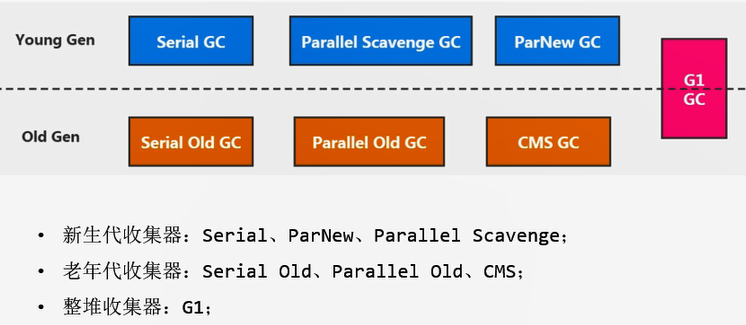


### 垃圾收集器的组合关系

不同厂商、不同版本的虚拟机实现差别很大。Hotspot虚拟机在JDK7/8后所有收集器及组合（连线），如下图：（更新到了JDK14）

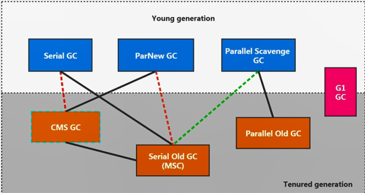

1. 两个收集器间有连线，表明它们可以搭配使用

   Serial/Serial Old、Serial/CMS、ParNew/Serial Old、ParNew/CMS、Parallel Scavenge/Serial Old、Parallel Scavenge/Parallel Old、G1

2. 其中Serial Old作为CMS出现“Concurrent Mode Failure”失败的后备方案

3. 红色虚线由于维护和兼容性测试的成本，在JDK8时将Serial+CMS、ParNew+Serial Old这两个组合声明为废弃（JEP 173），在JDK9中完全取消了这些组合的支持（JEP214）

4. 绿色虚线JDK14中：弃用Parallel Scavenge和Serial Old组合（JEP 366）

5. 青色虚线JDK14中：删除CMS垃圾收集器（JEP 363）

***

- 为什么要有很多收集器，一个不够吗？因为Java的使用场景很多，移动端，服务器等。所以就需要针对不同的场景，提供不同的垃圾收集器，提高垃圾收集的性能。

- 虽然我们会对各个收集器进行比较，但并非为了挑选一个最好的收集器出来。没有一种放之四海皆准、任何场景下都适用的完美收集器存在，更加没有万能的收集器。所以==我们选择的只是对具体应用最合适的收集器==。


### 如何查看默认的垃圾收集器

- `-XX:+PrintCommandLineFlags`：查看命令行相关参数（包含使用的垃圾收集器）
- 使用命令行指令：`jinfo -flag` 相关垃圾回收器参数 进程ID

```java
/**
 *  -XX:+PrintCommandLineFlags
 *
 *  -XX:+UseSerialGC:表明新生代使用Serial GC ，同时老年代使用Serial Old GC
 *
 *  -XX:+UseParNewGC：标明新生代使用ParNew GC
 *
 *  -XX:+UseParallelGC:表明新生代使用Parallel GC
 *  -XX:+UseParallelOldGC : 表明老年代使用 Parallel Old GC
 *  说明：二者可以相互激活
 *
 *  -XX:+UseConcMarkSweepGC：表明老年代使用CMS GC。同时，年轻代会触发对ParNew 的使用
 */
public class GCUseTest {
    public static void main(String[] args) {
        ArrayList<byte[]> list = new ArrayList<>();

        while(true){
            byte[] arr = new byte[100];
            list.add(arr);
            try {
                Thread.sleep(10);
            } catch (InterruptedException e) {
                e.printStackTrace();
            }
        }
    }
}
```


## Serial 回收器：串行回收

- Serial 收集器是最基本、历史最悠久的垃圾收集器了。JDK1.3之前回收新生代唯一的选择。
- Serial 收集器作为HotSpot中Client模式下的默认新生代垃圾收集器。

- ==Serial 收集器采用复制算法、串行回收和“Stop-the-world”机制的方式执行内存回收。==

- 除了年轻代之外，Serial 收集器还提供了用于执行老年代垃圾收集的Serial Old 收集器。==Serial Old 收集器同样也采用了串行回收和STW机制，只不过内存回收算法使用的是标记-压缩算法。==
  - Serial Old 是运行在Client模式下的默认的老年代的垃圾回收器
  - Serial Old 在Server模式下主要有两个用途：① 与新生代的Parallel Scavenge配合使用 ② 作为老年代CMS收集器的后备垃圾收集方案

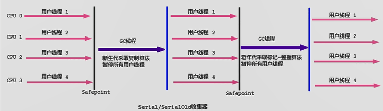

这个收集器是一个单线程的收集器，但它的“单线程”的意义不仅仅说明它只会**使用一个 CPU 或一条收集线程去完成垃圾收集工作**，更重要的是在它进行垃圾收集时，**必须暂停其他所有的工作线程**，直到它收集结束（Stop The World）。

- 优势：==简单而高效（与其他收集器的单线程比）==，对于限定单个CPU的环境来说，Serial收集器由于没有线程交互的开销，专心做垃圾收集自然可以获得最高的单线程收集效率。
  - 运行在Client模式下的虚拟机是个不错的选择。

- 使用`-XX:+UseSerialGC`参数可以指定年轻代和老年代都是用串行收集器

***

### 总结：

这种垃圾收集器大家了解，现在已经不用串行的了。而且在限定单核cpu才可以用。现在都不是单核的了。

对于交互较强的应用而言，这种垃圾收集器是不能接受的。一般在Java web应用程序中是不会采用串行垃圾收集器的。


## ParNew 回收器：并行回收

- 如果说Serial GC是年轻代中的单线程垃圾收集器，那么ParNew收集器则是Serial收集器的多线程版本。
  - Par是Parallel的缩写，New是只能处理新生代
- ParNew 收集器除了采用==并行回收==的方式执行内存回收外，两款垃圾收集器之间几乎没有任何区别。ParNew 收集器在年轻代中同样也是==采用复制算法、STW机制。==
- ParNew 是很多JVM运行在Server模式下新生代的默认垃圾收集器。

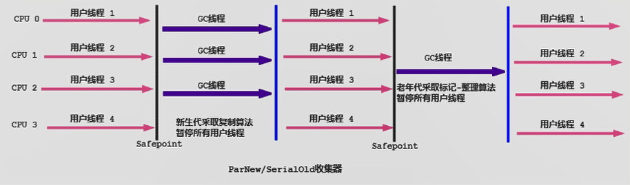

- 对于新生代，回收次数频繁，使用并行方式高效。
- 对于老年代，回收次数少，使用串行方式节省资源。（CPU并行需要切换线程，串行可以省去切换线程的资源）

- ParNew垃圾收集器回收效率在任何场景都会比Serial收集器更高效？
  - ParNew 收集器运行在多CPU的环境下，由于可以充分利用多CPU、多核心等物理硬件资源优势，可以更快地完成垃圾收集器，提升程序的吞吐量。
  - 但是==在单个CPU的环境下，ParNew垃圾收集器不比Serial收集器更高效==。虽然Serial收集器是基于串行回收，但是由于CPU不需要频繁地做任务切换，因此可以有效避免多线程交互过程中产生的一些额外开销。
- 除Serial外，目前只有ParNew GC能与CMS收集器配合使用。
- 使用`-XX:+UseParNewGC`指定使用ParNew收集器执行内存回收任务。表示年轻代使用并行收集器，不影响老年代。
- `-XX:ParallelGCThreads` 限制线程数量，默认开启和CPU数据相同的线程数。


## Parallel 回收器：吞吐量优先

- HotSpot的年轻代中除了拥有ParNew收集器是基于并行回收的以外，Parallel Scavenge收集器同样采用了==复制算法、并行回收和STW机制==。
- 那么Parallel Scavenge收集器的出现是否多此一举？
  - 和ParNew收集器不同，Parallel Scavenge收集器的目标是达到一个==可控制的吞吐量==（Throughput），它也被称为吞吐量优先的垃圾收集器。
- ==自适应调节策略==也是Parallel Scavenge与ParNew一个重要区别。
- 高吞吐量则是可以高效地利用CPU时间，尽快完成程序的运算任务，主要==适合在后台运算而不需要太多交互的任务==。因此，常见在服务器环境中使用。==例如：那些执行批量处理、订单处理、工资支付、科学计算的应用程序==。
- Parallel Scavenge收集器在JDK1.6提供了用于执行老年代垃圾收集的Parallel Old收集器，用来代替老年代的Serial Old收集器。
- ==Parallel Old收集器采用了标记-压缩算法，但同样也是基于并行回收和STW机制。==
- 在JDK8中，默认是此垃圾收集器。
- 使用`-XX:+UseParallelGC` 指定年轻代使用Parallel并行收集器执行内存回收任务。
- 使用`-XX:+UseParallelOldGC` 指定老年代使用并行回收收集器。
  - 分别适用于新生代和老年代。默认JDK8中是开启的。
  - 开启一个，另一个也会被开启。（互相激活）
- 使用`-XX:ParallelGCThreads` 设置年轻代并行收集器的线程数。一般地，最好与CPU数量相等，以避免过多的线程数影响垃圾收集性能。
  - 默认情况下，当CPU数量小于8个，`ParallelGCThreads` 的值等于CPU数量。
  - 当CPU数量大于8个，`ParallelGCThreads`  的值等于3+(5*CPU_Count)/8。
- 使用`-XX:MaxGCPauseMillis` 设置垃圾收集器最大停顿时间（STW的时间），单位是毫秒。==该参数使用需谨慎。==
  - 为了尽可能地把停顿时间控制在`MaxGCPauseMillis`以内，收集器在工作时会调整Java堆大小或者其他一些参数。
  - 对于用户来讲，停顿时间越短体验越好。但是在服务端，我们注重高并发，整体的吞吐量。所以服务器适合`Parallel`进行控制。
- `-XX:GCTimeRatio` 垃圾收集时间占总时间的比例（=1/(N+1)）。用于衡量吞吐量的大小。
  - 取值范围(0,100)。默认值99，也就是垃圾回收时间不超过1%。
  - 与`-XX:MaxGCPauseMillis`参数有一定矛盾性。暂停时间越长，Ratio参数就容易超过设定的比例。
- `-XX:+UseAdaptiveSizePolicy`设置Parallel Scavenge收集器具有自适应调节策略。
  - 这种模式下，年轻代的大小、Eden和Survivor的比例、晋升老年代的对象年龄等参数会被自动调整，已达到在堆大小、吞吐量和停顿时间之间的平衡点。
  - 手动调优比较困难的场合，可以直接使用这种自适应的方式，仅指定虚拟机的最大堆、目标的吞吐量（`GCTimeRatio`）和停顿时间（`MaxGCPauseMillis`）,让虚拟机自己完成调优工作。


## CMS 回收器：低延迟

- 在JDK1.5时期，HotSpot推出了一款在==强交互应用==中几乎可认为有划时代意义的垃圾收集器：CMS（Concurrent-Mark-Sweep）收集器，==这款收集器是HotSpot虚拟机中第一款真正意义上的并发收集器，它第一次实现了让垃圾收集线程与用户线程同时工作。==
- CMS收集器的关注点是尽可能缩短垃圾收集时用户线程停顿时间。停顿时间越短（低延迟）就越适合与用户交互的程序，良好的响应速度能提升用户体验。
  - ==目前很大一部分的Java应用集中在互联网站或者B/S系统的服务端上，这类应用尤其重视服务的响应速度，希望系统停顿时间最短==，以给用户带来较好的体验CMS收集器就非常符合这类应用的需求。
- CMS的垃圾收集算法采用==标记-清除算法，并且也会STW==。

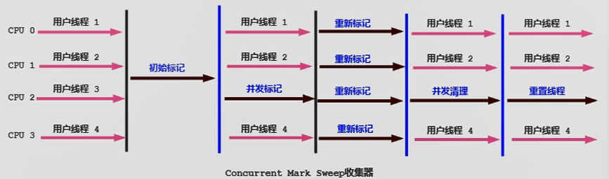

- 初始标记（Initial-Mark）阶段：程序中所有工作线程会因为STW机制而出现短暂的暂停，==仅仅标记GC Roots能直接关联到的对象==。由于直接关联对象比较小，所以这里的==速度非常快==。
- 并发标记（Concurrent-Mark）阶段：==从GC Roots的直接关联对象开始遍历整个对象图的过程==，这个过程==耗时较长==但是==不需要停顿用户线程==，可以与垃圾收集线程一起并发运行。
- 重新标记（Remark）阶段：由于在并发标记阶段中，程序的工作线程会和垃圾收集线程同时运行或者交叉运行，因此为了==修正并发标记期间，因用户程序继续运作而导致标记产生变动的那一部分对象的标记记录==，这个阶段的停顿时间通常会比初始标记阶段稍长一些，但也远比并发标记阶段的时间短。
- 并发清除（Concurrent-Sweep）阶段：此阶段==清理删除掉标记阶段判断的已经死亡的对象，释放内存空间==。由于不需要移动存活对象，所以这个阶段也是可以与用户线程同时并发的。

==由于最耗费时间的并发标记与并发清除阶段都不需要暂停工作，所以整体的回收是低停顿的。==

另外，由于垃圾收集阶段用户线程没有中断，所以==在CMS回收过程中，还应该确保应用程序用户线程有足够的内存可用==。因此，当堆内存使用率达到某一阈值时，便开始进行回收。要是CMS运行期间预留的内存无法满足程序需要，就会出现一次“Concurrent Mode Failure”失败，这时虚拟机启动后预案：临时启用Serial Old收集器重新进行老年代的垃圾收集，这时停顿时间就很长了。

由于CMS收集器采用==标记-清除算法，会产生一些内存碎片==。那么CMS在为新对象分配内存空间时，将无法使用指针碰撞（Bump the Pointer）技术，只能选择空闲列表（Free List）执行内存分配。

**有人会觉得既然Mark Sweep会造成内存碎片，那么为什么不把算法换成Mark Compact呢？**

答案其实很简答，因为当并发清除的时候，用Compact整理内存的话，原来的用户线程使用的内存还怎么用呢？要保证用户线程能继续执行，前提的它运行的资源不受影响嘛。Mark Compact更适合“stop the world”这种场景下使用

**优点**：并发收集，低延迟。

**缺点**：

1. ==会产生内存碎片==，导致并发清除后，用户线程可用的空间不足。在无法分配大对象的情况下，不得不提前触发Full GC。
2. ==CMS收集器对CPU资源非常敏感==。在并发阶段，它虽然不会导致用户停顿，但是会因为占用了一部分线程而导致应用程序变慢，总吞吐量会降低。
3. ==CMS收集器无法处理浮动垃圾==。并发标记阶段如果产生新的垃圾对象，CMS无法对这些垃圾对象进行标记，最终会导致这些新产生的垃圾对象没有被及时回收，从而只能在下一次执行GC时释放这些之前未被回收的内存空间。

***

- 使用`-XX:+UseConcMarkSweepGC`指定使用CMS GC。并且自动将`-XX:+UseParNewGC`打开。
- `-XX:CMSInitiatingOccupanyFraction`设置堆内存使用率的阈值，一旦达到该阈值，便开始进行回收。
  - JDK5及以前版本默认值是68，即当老年代空间使用率达到68%，会执行一次CMS回收。==JDK6以及以上版本默认值是92%==。
  - 如果内存增长缓慢，则可以设置一个稍大的值，大的阀值可以有效降低cMS的触发频率，减少老年代回收的次数可以较为明显地改善应用程序性能。反之，如果应用程序内存使用率增长很快，则应该降低这个阈值，以避免频繁触发老年代串行收集器。因此==通过该选项便可以有效降低Full GC的执行次数==。
- `-XX:+UseCMSCompactAtFullCollection`用于指定执行完Full GC后堆内存空间进行压缩整理，避免内存碎片的产生。
- `-XX:CMSFullGCsBeforeCompaction`设置在执行多少次Full GC后对内存空间进行压缩整理。
- `-XX:ParallelCMSThreads`设置CMS的线程数量。默认启动的线程数时(ParallelGCThreads+3)/4。


### 小结

如果你想要最小化地使用内存和并行开销，选择Serial GC。

如果你想要最大化应用程序的吞吐量，选择Parallel GC。

如果你想要最小化GC的中断或停顿时间，选择CMS GC。


### JDK后续版本中CMS的变化

- JDK9新特性：CMS被标记为Deprecate了（JEP291）
  - 如果对JDK9及以上版本的HotSpot虚拟机使用参数`-XX:+UseConcMarkSweepGC`来开启CMS收集器的话，用户会收到一个警告信息，提示CMS未来将会被废弃。

- JDK14新特性：删除CMs垃圾回收器（JEP363）
  - 移除了CMs垃圾收集器，如果在JDK14中使用`-XX:+UseConcMarkSweepGC`的话，JVM不会报错，只是给出一个warning信息，但是不会exit。JVM会自动回退以默认GC方式启动JVM


## G1 回收器：区域化分代式

**既然我们已经有了前面几个强大的GC，为什么还要发布Garbage First（G1）GC？**

原因就在于应用程序所应对的==业务越来越庞大、复杂，用户越来越多==，没有GC就不能保证应用程序正常进行，而经常造成STW的GC又跟不上实际的需求，所以才会不断地尝试对GC进行优化。G1（Garbage-First）垃圾回收器是在Java7 update 4之后引入的一个新的垃圾回收器，是当今收集器技术发展的最前沿成果之一。

与此同时，为了适应现在==不断扩大的内存和不断增加的处理器数量==，进一步降低暂停时间（pause time），同时兼顾良好的吞吐量。

==官方给G1设定的目标是在延迟可控的情况下获得尽可能高的吞吐量，所以才担当起“全功能收集器”的重任与期望。==

**为什么名字叫做Garbage First（Gl）呢？**

- 因为G1是一个并行回收器，它把堆内存分割为很多不相关的区域（Region）（物理上不连续的）。使用不同的Region来表示Eden、幸存者0区，幸存者1区，老年代等。

- G1 GC有计划地避免在整个Java堆中进行全区域的垃圾收集。G1跟踪各个Region里面的垃圾堆积的价值大小（回收所获得的空间大小以及回收所需时间的经验值），在后台维护一个优先列表，==每次根据允许的收集时间，优先回收价值最大的Region==。

- 由于这种方式的侧重点在于回收垃圾最大量的区间（Region），所以我们给G1一个名字：垃圾优先（Garbage First）。

G1（Garbage-First）是一款面向服务端应用的垃圾收集器，==主要针对配备多核CPU及大容量内存的机器==，以极高概率满足GC停顿时间的同时，还兼具高吞吐量的性能特征。

在JDK1.7版本正式启用，移除了Experimenta1的标识，==是JDK9以后的默认垃圾回收器==，取代了CMS回收器以及Parallel+Parallel0ld组合。被oracle官方称为“==全功能的垃圾收集器==”。

与此同时，CMS已经在JDK9中被标记为废弃（deprecated）。在jdk8中还不是默认的垃圾回收器，需要使用`-XX：+UseG1GC`来启用。


### 特点（优势）

与其他GC收集器相比，G1使用了全新的分区算法，其特点如下所示：

- 并行与并发
  - 并行性：在回收期间，可以有多个Gc线程同时工作，有效利用多核计算能力。此时用户线程STW
  - 并发性：G1拥有与应用程序交替执行的能力，部分工作可以和应用程序同时执行，因此，一般来说，不会在整个回收阶段发生完全阻塞应用程序的情况

- 分代收集
  - 从分代上看，==G1依然属于分代型垃圾回收器==，它会区分年轻代和老年代，年轻代依然有Eden区和survivor区。但从堆的结构上看，它不要求整个Eden区、年轻代或者老年代都是连续的，也不再坚持固定大小和固定数量。

  - 将==堆空间分为若干个区域（Region），这些区域中包含了逻辑上的年轻代和老年代。==
  - 和之前的各类回收器不同，它同时==兼顾年轻代和老年代==。对比其他回收器，或者工作在年轻代，或者工作在老年代；

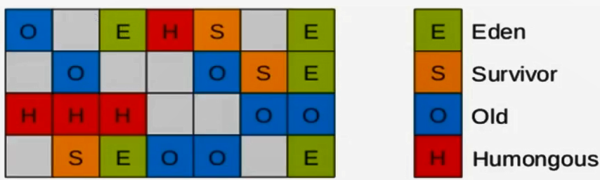

- 空间整合
  - CMS：标记-清除算法、内存碎片、若干次GC后进行一次碎片整理
  - G1将内存划分为一个个的region。内存的回收是以region作为基本单位的。==Region之间是复制算法==，但==整体上实际可看作是标记-压缩（Mark-Compact）算法==，两种算法都可以避免内存碎片。这种特性有利于程序长时间运行，分配大对象时不会因为无法找到连续内存空间而提前触发下一次GC。尤其是当Java堆非常大的时候，G1的优势更加明显。

- 可预测的停顿时间模型（即：软实时soft real-time）

这是G1相对于CMS的另一大优势，GI除了追求低停顿外，还能建立可预测的停顿时间模型，能让使用者明确指定在一个长度为M毫秒的时间片段内，消耗在垃圾收集上的时间不得超过N毫秒。

- 
  - 由于分区的原因，G1可以只选取部分区域进行内存回收，这样缩小了回收的范围，因此对于全局停顿情况的发生也能得到较好的控制。
  - G1跟踪各个Region里面的垃圾堆积的价值大小（回收所获得的空间大小以及回收所需时间的经验值），在后台维护一个优先列表，==每次根据允许的收集时间，优先回收价值最大的Region==。保证了G1收集器在有限的时间内可以获取尽可能高的收集效率。
  - 相比于CMS GC，G1未必能做到CMS在最好情况下的延时停顿，但是最差情况要好很多。

**缺点：**

相较于CMS，G1还不具备全方位、压倒性优势。比如在用户程序运行过程中，G1无论是为了垃圾收集产生的内存占用（Footprint）还是程序运行时的额外执行负载（Overload）都要比CMS要高。

从经验上来说，在小内存应用上CMS的表现大概率会优于G1，而G1在大内存应用上则发挥其优势。平衡点在6-8GB之间。


### 参数设置

- `-XX:+UseG1GC`手动指定G1收集器。

- `-XX:G1HeapRegionSize`设置每个Region的大小。值是2的幂，范围是1MB-32MB之间，根据最小的Java堆大小划分出2048个区域。默认是堆内存的1/2000。
- `-XX:MaxGCPauseMillis`设置期望达到的最大GC停顿时间（JVM会尽力实现，但不保证达到）。默认是200ms。
- `-XX:ParallelGCThread`设置STW时GC线程数的值。最多设置为8。
- `-XX:ConcGCThreads`设置并发标记的线程数。将n设置为并行垃圾回收线程数（ParallelGCThreads）的1/4左右。
- `-XX:InitiatingHeapOccupancyPercent`设置触发并发GC周期的Java堆占用率阈值。超过此值，就触发GC。默认值是45。


### G1回收器的常见操作步骤

1. 开启G1垃圾收集器
2. 设置堆的最大内存
3. 设置最大的停顿时间

G1中提供了三种垃圾回收模式：YoungGC、Mixed GC和Full GC，在不同的条件下被触发。


### 适用场景

- 面向服务端应用，针对具有大内存，多处理器的机器（在普通大小的堆里表现平平）
- 最主要的应用是需要低延迟，并具有大堆的应用程序提供解决方案
- 如在堆大小约6GB或更大时，可预测的暂停时间可以低于0.5秒。
- 用来替换JDK1.5中的CMS收集器
  - 超过50%的Java堆被活动数据占用
  - 对象分配频率或年代提升频率变化很大
  - GC停顿时间过长（长于0.5秒至1秒）

- HotSpot垃圾收集器里，除了G1以外，其他的垃圾收集器使用内置的JVM线程执行GC的多线程操作，而G1 GC可以采用应用线程承担后台运行的GC工作，即当JVM的GC线程处理速度慢时，系统会调用应用程序线程帮助加速垃圾回收过程。


### 分区Region：化整为零 

使用G1收集器时，它将整个Java堆划分成约2048个大小相同的独立Region块，每个Region块大小根据堆空间的实际大小而定，整体被控制在1MB到32MB之间，且为2的N次幂，即1MB，2MB，4MB，8MB，16MB，32MB。可以通过`-XX:G1HeapRegionSize`设定。==所有的Region大小相同，且在JVM生命周期内不会被改变。==

虽然还保留有新生代和老年代的概念，但新生代和老年代不再是物理隔离的了，它们都是一部分Region（不需要连续）的集合。通过Region的动态分配方式实现逻辑上的连续。

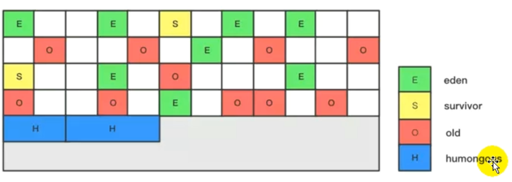

- 一个region 有可能属于Eden，Survivor或者old/Tenured内存区域。但是一个region只可能属于一个角色。图中的E表示该region属于Eden内存区域，s表示属于survivor内存区域，o表示属于old内存区域。图中空白的表示未使用的内存空间。

- G1垃圾收集器还增加了一种新的内存区域，叫做Humongous内存区域，如图中的H块。主要用于存储大对象，如果超过1.5个region，就放到H。

设置H的原因：

对于堆中的大对象，默认直接会被分配到老年代，但是如果它是一个短期存在的大对象，就会对垃圾收集器造成负面影响。为了解决这个问题，G1划分了一个Humongous区，它用来专门存放大对象。==如果一个H区装不下一个大对象，那么G1会寻找连续的H区来存储==。为了能找到连续的H区，有时候不得不启动Full GC。G1的大多数行为都把H区作为老年代的一部分来看待。

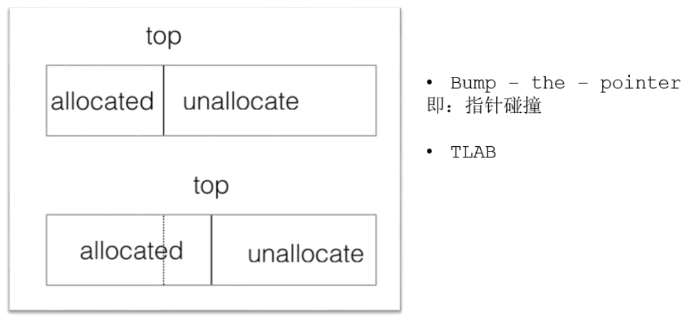

### G1回收器垃圾回收过程

G1 GC的垃圾收集过程主要包括三个环节：

1. 年轻代GC（Young GC）
2. 老年代并发标记过程（Concurrent GC）
3. 混合回收（Mixed GC）
4. 如果需要，单线程、独立式、高强度的Full GC还是继续存在的。他针对GC的评估失败提供了一种失败保护机制，即强力回收。

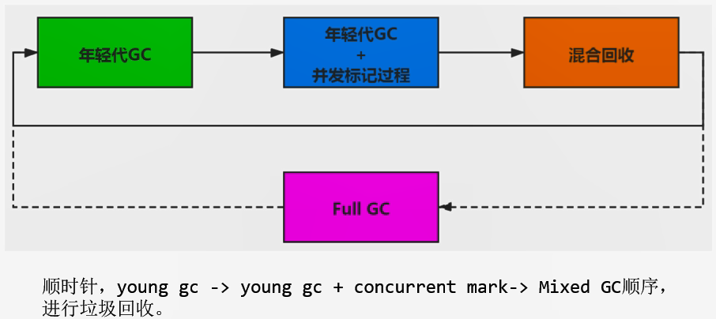

应用程序分配内存，==当年轻代的Eden区用尽时开始年轻代回收过程==；G1的年轻代收集阶段是一个==并行的独占式==（STW）收集器。在年轻代回收期，G1 GC暂停所有应用程序线程，启动多线程执行年轻代回收。然后==从年轻代区间移动存活对象到Survivor区间或者老年区间，也有可能是两个区间都会涉及==。

当堆内存使用达到一定值（默认45%）时，开始老年代并发标记过程。

标记完成马上混合回收过程。对于一个混合回收期，G1 GC从老年区间移动存活对象到空闲区间，这些空闲区间也就成为了老年代的一部分。和年轻代不同，老年代回收器和其他GC不同，==G1的老年代回收器不需要这个老年代被回收，一次只需要/回收一小部分老年代的Region就可以了==。同时，这个老年代Region是和年轻代一起被回收的。

例子：一个Web服务器，Java进程最大堆内存是4G，每分钟响应1500个请求，每45秒钟会新分配大约2G的内存。G1会每45秒钟进行一次年轻代回收，每31个小时整个堆的使用率达到45%，会开始老年代并发标记过程，标记后开始四到五次的混合回收。


### Remembered Set

- 一个对象被不同区域引用的问题
- 一个Region不可能是孤立的，一个Region中的对象可能被其他任意Region中对象引用，判断对象存活时，是否需要扫描整个Java堆才能保证准确？
- 在其他的分代收集器，也存在这样的问题（而G1更突出）

- 回收新生代也不得不同时扫描老年代？

- 这样的话会降低Minor GC的效率；

解决方法：

- 无论G1还是其他分代收集器，JVM都是使用Remembered Set来避免全局扫描。
- ==每个Region都有一个对应的Remembered Set。==
- 每次引用类型数据写操作时，都会产生一个Write Barrier暂时中断操作。
- 然后检查将要写入的引用指向的对象是否和该引用类型数据在不同的Region（其他收集器：检查老年代对象是否引用了新生代对象）。
- 如果不同，通过CardTable（卡表）把相关引用信息记录到引用指向对象的所在Region对应的Remembered Set中。
- 当进行垃圾收集时，在GC根节点的枚举范围加入Remembered Set，就可以保证不进行全局扫描，也不会有遗漏。

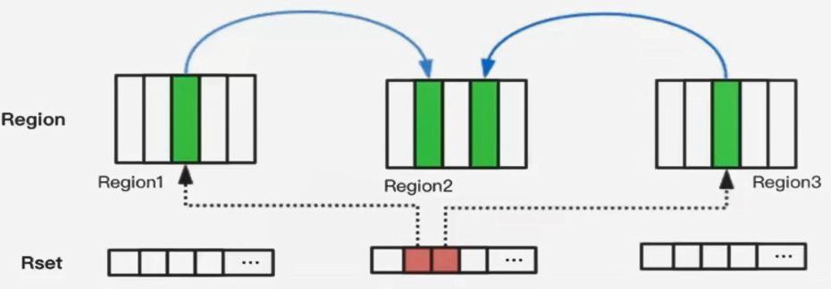


### G1回收过程一：年轻代GC

JVM启动时，G1先准备好Eden区，程序在运行过程中不断创建对象到Eden区，当空间耗尽时，G1会启动一次年轻代垃圾收集过程。

==年轻代垃圾回收只会回收Eden区和Survivor区。==

YGC时首先G1停止应用程序的执行（STW），G1创建回收集，是指需要被回收的内存分段的集合，年轻代回收过程的回收集包含年轻代Eden区和Survivor区所有的内存分段。

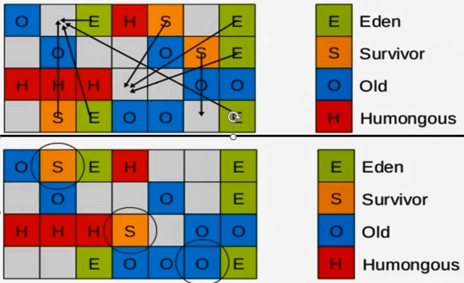

1. 扫描根：是指`static`变量指向的对象，正在执行的方法调用链条上的局部变量等。根引用连同RSet记录的外部引用作为扫描存活对象的入口。
2. 更新RSet：处理dirty card queue中的card，更新RSet。此阶段完成后，Rset可以准确的反应老年代对所在的内存分段中对象的引用。
3. 处理RSet：识别被老年代对象指向的Eden中的对象，这些被指向的Eden中的对象被认为是存活的对象。
4. 复制对象：此阶段对象树被遍历，Eden区内存段中存活的对象会被复制到Survivor区中空的内存分段，Survivor区内存段中存活的对象如果年龄未达阈值，年龄会加1，达到阈值会被复制到Old区中空的内存分段。如果Survivor空间不够，Eden空间的部分数据会直接晋升到老年代空间。
5. 处理引用：处理Soft，Weak，Phantom，Final，JNI Weak等引用。最后Eden空间的数据为空，GC停止工作，而目标内存中的对象都是连续存储的，没有碎片。

> 对于应用程序的引用赋值语句object.field=object，JVM会在之前和之后执行特殊的操作以在dirty card queue中入队一个保存了对象引用信息的card。在年轻代回收的时候，G1会对Dirty Card Queue中所有的card进行处理，以更新RSet，保证RSet实时准确的反映引用关系。
>
> 那为什么不在引用赋值语句处直接更新RSet呢？这是为了性能的需要，RSet的处理需要线程同步，开销会很大，使用队列性能会好很多。


### G1回收过程二：并发标记过程

1. 初始标记阶段：标记从根节点直接可达的对象（和CMS一样）。这个阶段是STW的，并且会触发一次年轻代GC。
2. 根区域扫描：G1 GC扫描Survivor区直接可达的老年代区域对象，并标记被引用的对象。这一过程必须在young GC之前完成。
3. 并发标记：在整个堆中进行并发标记，此过程可能被young GC中断。在并发标记阶段，==若发现区域对象中的所有对象都是垃圾，那这个区域会被立即回收==。同时并发标记过程中，会计算每个区域的对象活性（区域中存活对象的比例）。
4. 再次标记：由于应用程序持续进行，需要修正上一次标记结果。是STW的。G1中采用了比CMS更快的初始快照算法。
5. 独占清理（STW）：计算各个区域的存活对象和GC回收比例，并进行排序，识别可以混合回收的区域。这个阶段并不会实际上去做垃圾的收集。
6. 并发清理阶段：识别并清理完全空闲的区域。


### G1回收过程三：混合回收

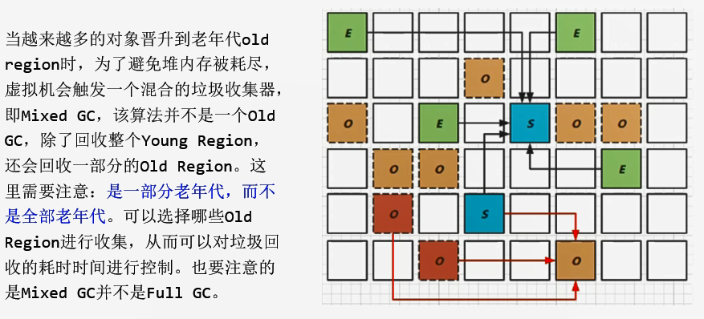

1. 并发标记结束以后，老年代中百分百为垃圾的内存分段被回收了，部分为垃圾的内存分段被计算了出来。默认情况下，这些老年代的内存分段会分为8次（`-XX:G1MixedGCCountTarget`）被回收。
2. 混合回收的回收集包括八分之一的老年代内存分段，Eden区内存分段，Survivor区内存分段。混合回收的算法和年轻代回收的算法完全一样，只是回收集多了老年代的内存分段。
3. 由于老年代中的内存分段默认为8次回收，G1会优先回收垃圾多的内存分段。垃圾占内存分段比例越高的，越会被先回收。阈值决定内存分段是否被回收，`-XX:G1MixedCLiveThresholdPercent`，默认是65%，意思是垃圾占内存分段比例要达到65%才会被回收。如果垃圾占比太低，意味着存活的对象占比高，在复制的时候会话费更多时间。
4. 混合回收并不一定要进行8次。有一个阈值`-XX:G1HeapWastePercent`，默认值是10%，意思是允许整个堆内存中10%空间被浪费，如果发现可以回收的垃圾占堆内存的比例低于10%，则不再进行混合回收。因为GC会话费很多时间但是回收到的内存却很少。


### G1回收可选的过程四：Full GC

G1的初衷就是要避免Full GC的出现。但是如果上述方式不能正常工作，==G1会停止应用程序的执行（STW）==，使用单线程的内存回收算法进行垃圾收集，性能会非常差，应用程序停顿时间会很长。

要避免Full GC的发生，一旦发生需要进行调整。什么时候会发生呢？比如==堆内存太小==，当G1在复制存活对象的时候没有空的内存分段可用，则会回退到Full GC，这种情况可以通过增大内存解决。

导致G1Full GC的原因可能有两个：

1. 回收阶段(Evacution)的时候没有足够的to-space来存放晋升的对象。
2. 并发处理过程完成之前空间耗尽。


### G1回收过程：补充

从oracle官方透露出来的信息可获知，回收阶段（Evacuation）其实本也有想过设计成与用户程序一起并发执行，但这件事情做起来比较复杂，考虑到G1只是回收一部分Region，停顿时间是用户可控制的，所以并不迫切去实现，而==选择把这个特性放到了G1之后出现的低延迟垃圾收集器（即ZGC）中==。另外，还考虑到G1不是仅仅面向低延迟，停顿用户线程能够最大幅度提高垃圾收集效率，为了保证吞吐量所以才选择了完全暂停用户线程的实现方案。


### G1回收器优化建议

- 年轻代大小
  - 避免使用`-Xmn`或`-XX:NewRatio`等相关选项显式设置年轻代大小
  - 固定年轻代的大小会覆盖暂停时间目标
- 暂停时间目标不要太过严苛
  - G1 GC的吞吐量目标是90%的应用程序时间和10%的垃圾收集时间
  - 评估G1 GC的吞吐量时，暂停时间目标不要太严苛。目标太过严苛表示你愿意承受更多的垃圾回收开销，而这些会直接影响到吞吐量。


## 垃圾回收器总结

截止JDK8，一共有7款不同的垃圾收集器。

| 垃圾收集器   | 分类           | 作用位置       | 使用算法                | 特点         | 适用场景                           |
| ------------ | -------------- | -------------- | ----------------------- | ------------ | ---------------------------------- |
| Serial       | 串行运行       | 新生代         | 复制算法                | 响应速度优先 | 单CPU环境下的client模式            |
| ParNew       | 并行运行       | 新生代         | 复制算法                | 响应速度优先 | 多CPU环境Server模式下与CMS配合使用 |
| Parallel     | 并行运行       | 新生代         | 复制算法                | 吞吐量优先   | 后台运算而不需要太多交互的场景     |
| Serial Old   | 串行运行       | 老年代         | 标记-压缩算法           | 响应速度优先 | 单CPU环境下的client模式            |
| Parallel Old | 并行运行       | 老年代         | 标记-压缩算法           | 吞吐量优先   | 后台运算而不需要太多交互的场景     |
| CMS          | 并发运行       | 老年代         | 标记-清除算法           | 响应速度优先 | 互联网或B/S业务                    |
| G1           | 并发、并行运行 | 新生代、老年代 | 标记-压缩算法、复制算法 | 响应速度优先 | 面向服务端应用                     |


怎么选择垃圾收集器？

1. 优先调整堆的大小让JVM自适应完成
2. 如果内存小于100M，使用串行收集器
3. 如果是单核、单机程序，并且没有停顿时间的要求，使用串行收集器
4. 如果是多CPU、需要高吞吐量、允许停顿时间超过1秒，选择并行或者JVM自己选择
5. 如果是多CPU、追求低停顿时间，需快速响应（比如延迟不能超过1秒，如互联网引用），使用并发收集器。官方推荐G1，性能高。==现在互联网的项目基本都是使用G1。==


## GC 日志分析

内存分配和垃圾回收的参数列表

`-XX:+PrintGC`						输出GC日志。类似：`-verbose:gc`

`-XX:+PrintGCDetails`			输出GC的详细日志

`-XX:+PrintGCTimeStamps`  输出GC的时间戳（以基准时间的形式）

`-XX:+PrintGCDateStamps`   输出GC的时间戳（以日期的形式）

`-XX:+PrintHeapAtGC`			在进行GC的前后打印出堆的信息

`-Xloggc:../logs/gc.log`			日志文件的输出路径

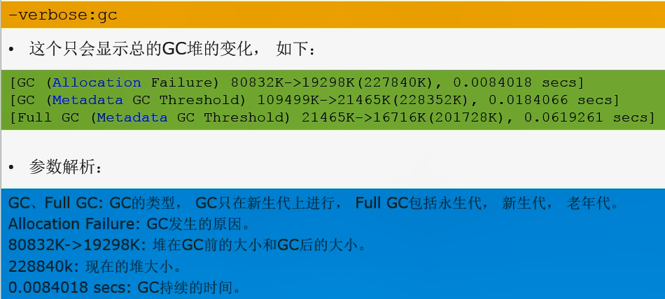

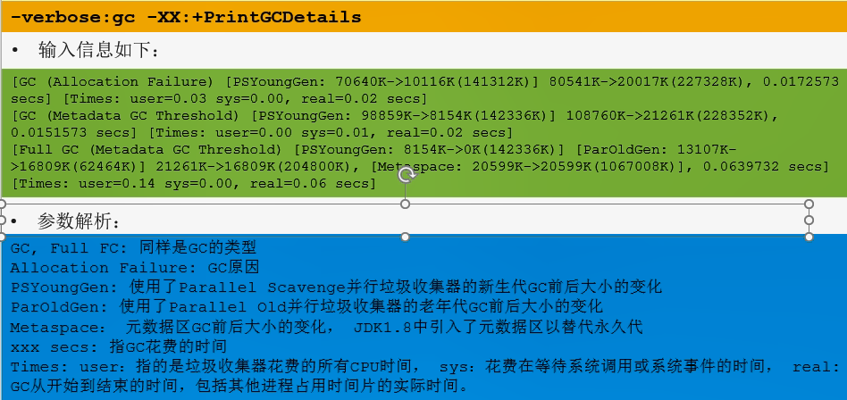

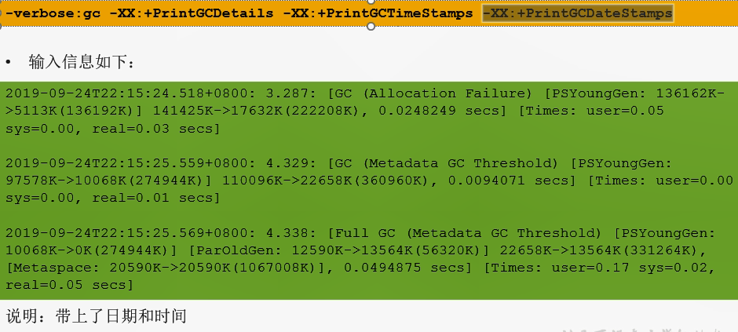

- "[GC"和"[Full GC"说明了这次垃圾收集的停顿类型，如果有“Full"则说明GC发生了"Stop The World"
- 使用Serial收集器在新生代的名字是Default New Generation，因此显示的是"[DefNew"
- 使用ParNew收集器在新生代的名字会变成"[ParNew"，意思是"Parallel New Generation"
- 使用Parallel Scavenge收集器在新生代的名字是"[PSYoungGen"
- 老年代的收集和新生代道理一样，名字也是收集器决定的
- 使用G1收集器的话，会显示为"garbage-first heap"
- Allocation Failure：表明本次引起GC的原因是因为在年轻代中没有足够的空间能够存储新的数据了。
- [PSYoungGen:  5986->696(8704K)]  5986K->704K(9216K)
  - 中括号内：GC回收前年轻代大小，回收后大小，（年轻代总大小）
  - 括号外：GC回收前年轻代和老年代大小，回收后大小，（年轻代和老年代总大小）
- user代表用户态回收好使，sys内核态回收耗时，real实际耗时。由于多核的原因，时间总和可能会超过real时间

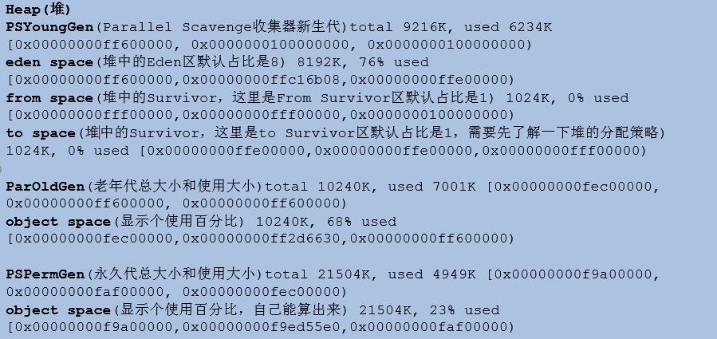

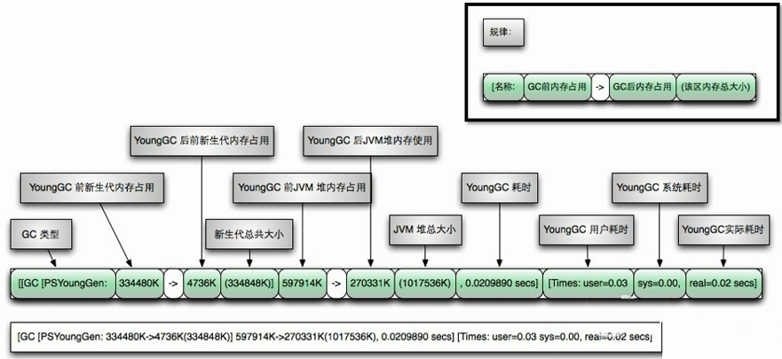

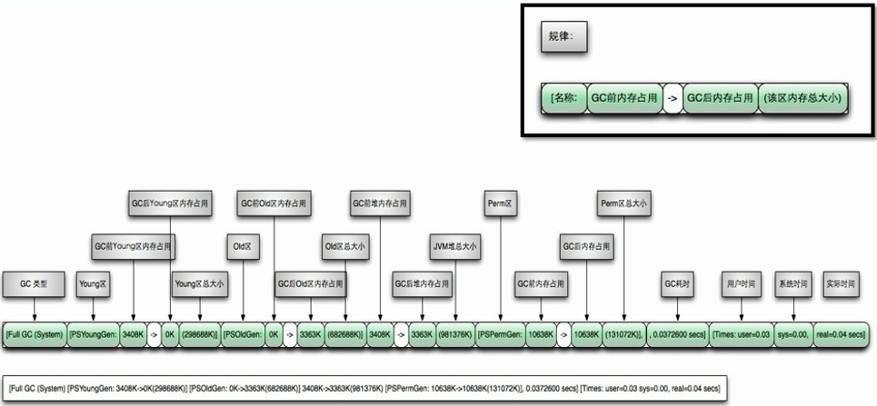

常用的日志分析工具有：==GCViewer、GCEasy、==GCHisto、GCLogViewer、Hpjmeter、garbagecat等。


## 垃圾回收期的新发展

目前的G1 GC在不断的进行改进，很多我们原来认为的缺点，例如串行的Full GC、Card Table扫描低效等，都已经被大幅改进，例如，JDK 10以后，Full GC已经是并行运行，在很多场景下，其表现还略优于Parallel GC的并行Full GC实现。

- JDK11引入了ZGC、Open JDK12引入了Shenandoah。特点低停顿时间。

ZGC收集器是一款基于Region内存布局的，（暂时）不设分代的，使用了读屏障、染色指针和内存多重映射等技术来实现可并发的标记-压缩算法的，以低延迟为首要目标的一款垃圾收集器。

ZGC的工作过程可以分为四个阶段：并发标记-并发预备重分配-并发重分配-并发重映射。

除了初始标记的是STW的，ZGC几乎所有地方都是并发执行的。所以停顿时间几乎就耗费在初始标记上，这部分的实际时间是非常少的。

JDK14新特性：JEP 364：ZGC应用在macOS上、JEP 365：ZGC应用在Windows上

`-XX:+UnlockExperimentalVMOptions`、`-XX:+UseZGC`


