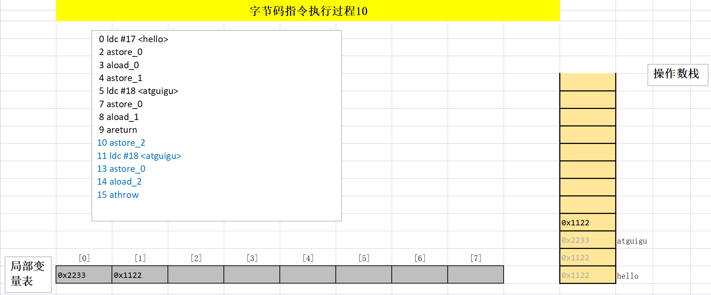

# 字节码指令集与解析举例

## 概述

- Java字节码对于虚拟机，就好像汇编语言对于计算机，属于基本执行指令。 

- Java虚拟机的指令由一个字节长度的、代表着某种特定操作含义的数字（称为操作码，Opcode）以及跟随其后的零至多个代表此操作所需参数（称为操作数，Operands）而构成。由于Java虚拟机采用面向操作数栈而不是寄存器的结构，所以大多数的指令都不包含操作数，只有一个操作码。

- 由于限制了Java虚拟机操作码的长度为一个字节（即0~255），这意味着指令集的操作码总数不可能超过256条。

- 官方文档：https://docs.oracle.com/javase/specs/jvms/se8/html/jvms-6.html

- 熟悉虚拟机的指令对于动态字节码生成、反编译Class文件、Class文件修补都有着非常重要的价值。因此，阅读字节码作为了解Java虚拟机的基础技能，需要熟练掌握常见指令。

### 执行模型

如果不考虑异常处理的话，那么Java虚拟机的解释器可以使用下面伪代码当做最基本的执行模型来理解。

```java
do{
    自动计算PC寄存器的值加1;
    根据PC寄存器的指示位置，从字节码流中取出操作码;
    if(字节码存在操作数)从字节码流中取出操作数;
    执行操作码所定义的操作;
}while(字节码长度>0);
```

### 字节码与数据类型

在Java虚拟机的指令集中，大多数指令都包含了其所操作所对应的数据类型信息。比如：`iload`指令用于从局部变量表中加载`int`型的数据到操作数栈中，而`fload`指令加载的是`float`类型的数据。

对于大部分与数据类型相关的字节码指令，它们的操作码助记符中都有特殊的字符来标明专门为哪种数据类型服务：

- i代表对`int`类型的数据操作
- l代表`long`
- s代表`short`
- b代表`byte`
- c代表`char`
- f代表`float`
- d代表`double`

也有一些指令的助记符中没有明确地指令操作类型的字母，如`arraylength`指令，他没有代表数据类型的特殊字符，但操作数永远只能是一个数组类型的对象。

还有另外一些指令，如无条件跳转指令`goto`则是与数据类型无关的。

大部分的指令都没有支持整数类型`byte`、`char`和`short`，甚至没有任何指令支持`boolean`类型。编译器会在编译器或运行期将`byte`和`short`类型的数据带符号扩展（Sign-Extend）为相应的`int`类型数据，将`boolean`和`char`类型数据零位扩展（Zero-Extend）为相应的`int`类型数据。与之类似，在处理`boolean`、`byte`、`short`和`char`类型的数组时，也会转换为使用相应的`int`类型的字节码指令来处理。因此，大多数对于`boolean`、`byte`、`short`和`char`类型数据的操作，实际上都是使用相应的`int`类型作为运算类型。

### 指令分类

- 加载与存储指令
- 算数指令
- 类型转换指令
- 对象的创建与访问指令
- 方法调用与返回指令
- 操作数栈管理指令
- 比较控制指令
- 异常处理指令
- 同步控制指令

## 加载与存储指令

### 作用

加载和存储指令用于将数据从栈桢的局部变量表和操作数栈之间来回传递。

### 常用指令

1. 局部变量压栈指令：将一个局部变量加载到操作数栈：`xload、xload_<n>` （其中x为i、l、f、d、a，n为0~3）
2. 常量入栈指令：将一个常量加载到操作数栈：`bipush`、`sipush`、`ldc`、`ldc_w`、`ldc2_w`、`aconst_null`、`iconst_m1`、`iconst_<i>`、`lconst_<l>`、`fconst_<f>`、`dconst_<d>`
3. 出栈装入局部变量表指令：将一个数值从操作数栈存储到局部变量表：`xstore`、`xstore_<n>`（其中x为i、l、f、d、a，n为0~3）；`xastore`（其中x为i、l、f、d、a、b、c、s）
4. 扩充局部变量表的访问索引的指令：`wide`。

上面列举的指令助记符中，有一部分是以尖括号结尾的。这些指令助记符实际上代表了一组指令（`iload_<n>`代表了`iload_0`、`iload_1`、`iload_2`、`iload_3`这几个指令）。这几组指令都是某个带有一个操作数的通用指令的特殊形式，**对于这若干组特殊指令来说，它们表面上没有操作数，不需要进行取操作数的动作，但操作数都隐含在指令中**。

比如：`iload_0`：将局部变量表中索引为0位置上的数据压入操作数栈中。

操作`byte`、`char`、`short`、`boolean`类型数据时，进场用`int`类型的指令来表示。

### 局部变量压栈指令

**局部变量压栈指令将给定的局部变量表中的数据压入操作数栈。**

这类指令大体可以分为：

- `xload_<n>`（x为i、l、f、d、a，n为0~3）
- `xload`（x为i、l、f、d、a）

指令`xload_n`表示将第n个局部变量压入操作数栈，比如`iload_1`、`fload_0`、`aload_0`等指令。其中`aload_n`表示将一个对象引用压栈。

指令`xload`通过指定参数的形式，把局部变量压入操作数栈，当使用这个命令时，表示局部变量的数量可能超过了4个，比如`iload、fload`等。

```java
// 局部变量压入栈指令
public void load(int num, Object obj, long count, boolean flag,short[] arr){
    System.out.println(num);
    System.out.println(obj);
    System.out.println(count);
    System.out.println(flag);
    System.out.println(arr);
}
```


### 常量入栈指令

常量入栈指令的功能是将常数压入操作数栈，根据数据类型和入栈内容的不同，又可以分为`const`系列、`push`系列、`push`系列和`ldc`指令。

**指令`const`系列**：用于对特定的常量入栈，入栈的常量隐含在指令本身里。指令有：`iconst_<i>`（i从-1到5）、`lconst_<l>`（l从0到1）、`fconst_<f>`（f从0到2）、`dconst_<d>`（d从0到1）、`aconst_null`。

比如，

`iconst_m1`将-1压入操作数栈；

`iconst_x`（x为e到5）将x压入栈：
`lconst_0`、`lconst_1`分别将长整数0和1压入栈；

`fconst_0`、`fconst_1`、`fconst_2`分别将浮点数0、1、2压入栈；  

`dconst_0`和`dconst_1`分别将double型0和1压入栈。
`aconst_null`将`null`压入操作数栈；

```
int i=3;iconst_3
intj=6;iconst 6?bipush 6?
int k=32768 1dc?
```

**指令`push`系列**：主要包含`bipush`和`sipush`。他们的区别在于接收数据类型的不同，`bipush`接收8位整数作为参数，`sipush`接收16位整数，它们都将参数压入栈。

**指令`ldc`系列**：如果以上指令都不能满足需求，那么可以使用万能的`ldc`指令，它可以接收一个8位的参数，该参数指向常量池中的`int`、`float`或者`String`的索引，将指定的内容压入堆栈。

类似的还有`ldc_w`，它接收两个8位参数，能支持的索引范围大于`ldc`。

如果要压入的元素是`long`或者`double`类型的，则使用`ldc2_w`指令。

总结：

| 类型                         | 常数指令 | 范围                         |
| ---------------------------- | -------- | ---------------------------- |
| int(boolean,byte,char,short) | iconst   | [-1,5)                       |
|                              | bipush   | [-128,127]                   |
|                              | sipush   | [-32768,32767]               |
|                              | ldc      | any int value                |
| long                         | lconst   | 0,1                          |
|                              | ldc      | any long value               |
| float                        | fconst   | 0,1,2                        |
|                              | ldc      | any float value              |
| double                       | dconst   | 0,1                          |
|                              | ldc      | any double value             |
| reference                    | aconst   | null                         |
|                              | ldc      | String literal,Class literal |

代码：

```java
// 常量入栈指令
public void pushConstLdc(){
    int i = -1;
    int a = 5;
    int b = 6;
    int c = 127;
    int d = 128;
    int e = 32767;
    int f = 32768;
}
```

字节码：

```
 0 iconst_m1
 1 istore_1
 2 iconst_5
 3 istore_2
 4 bipush 6
 6 istore_3
 7 bipush 127
 9 istore 4
11 sipush 128
14 istore 5
16 sipush 32767
19 istore 6
21 ldc #7 <32768>
23 istore 7
25 return
```

代码：

```java
public void constLdc(){
    long a1 = 1;
    long a2 = 2;
    float b1 = 2;
    float b2 = 3;
    double c1 = 1;
    double c2 = 2;
    Date d = null;
}
```

字节码：

```
 0 lconst_1
 1 lstore_1
 2 ldc2_w #8 <2>
 5 lstore_3
 6 fconst_2
 7 fstore 5
 9 ldc #10 <3.0>
11 fstore 6
13 dconst_1
14 dstore 7
16 ldc2_w #11 <2.0>
19 dstore 9
21 aconst_null
22 astore 11
24 return
```

### 出栈装入局部变量表指令

出栈装入局部变量表指令用于将操作数栈中栈顶元素弹出后，装入局部变量表的指定位置，用于给局部变量表赋值。

这类指令主要以`store`的形式存在，比如`xstore`（x为i、l、f、d、a）、`xstore_n`（x为i、l、f、d、a，n为0~3）。

- 其中，指令`istore_n`将从操作数栈中弹出一个整数，并把它赋值给局部变量表索引n位置。
- 指令`xstore`由于没有隐含参数信息，故需要提供一个`byte`类型的参数类指定目标局部变量表的位置。

```java
public void store(int k, double d){
    int m = k + 2;
    long l = 12;
    String str = "abcdef";
    float f = 10.0F;
    d = 10;
}
```


说明：

一般来说，类似像`store`这样的指令需要带一个参数，用来指明将弹出的元素放在局部变量表的第几个位置。但是为了尽可能压缩指令大小，使用专门的`istore_1`指令表示将弹出的元素放在局部变量表第1个位置。类似还有`istore_0`、`istore_2`、`istore_3`。

由于局部变量表前几个位置总是非常有用，因此这种做法虽然增加了指令数量，但是可以大大压缩生成的字节码的体积。

## 算术指令

### 作用

算数指令用于对两个操作数栈上的值进行某种特定运算，并把结果重新压入操作数栈。

### 分类

大体上分为两种：对**整型数据**进行运算的指令和**浮点型数据**进行运算的指令。

### byte、short、char和boolean类型说明

| 实际类型      | 运算类型      | 分类 |
| ------------- | ------------- | ---- |
| boolean       | int           | 一   |
| byte          | int           | 一   |
| char          | int           | 一   |
| short         | int           | 一   |
| int           | int           | 一   |
| float         | float         | 一   |
| reference     | reference     | 一   |
| returnAddress | returnAddress | 一   |
| long          | long          | 二   |
| double        | double        | 二   |

### NaN值使用

当一个操作产生溢出时，将会使用有符号的无穷大表示，如果某个操作结果没有明确的数学定义的话，将会使用`NaN`值表示。所有使用`NaN`值作为操作数的算术操作，结果都会返回`NaN`。

```java
public void method1(){
    int i = 10;
    double j = i / 0.0;
    System.out.println(j);//无穷大


    double d1 = 0.0;
    double d2 = d1 / 0.0;
    System.out.println(d2);//NaN: not a number
}
```

### 所有算术指令

加法指令：`iadd`、`ladd`、`fadd`、`dadd`

减法指令：`isub`、`lsub`、`fsub`、`dsub`

乘法指令：`imul`、`lmul`、`fmul`、`dmul`

除法指令：`idiv`、`ldiv`、`fdiv`、`ddiv`

求余指令：`irem`、`lrem`、`frem`、`drem`       //remainder：余数

取反指令：`ineg`、`lneg`、`fneg`、`dneg`      //negation：取反

自增指令：`iinc`

位运算指令：

- 位移指令：`ishl`、`ishr`、`iushr`、`lshl`、`lshr`、`lushr`
- 按位或指令：`ior`、`lor`
- 按位与指令：`iand`、`land`
- 按位异或指令：`ixor`、`lxor`

比较指令：`dcmpg`、`dcmpl`、`fcmpg`、`fcmpl`、`lcmp`

### 比较指令的说明

- 比较指令的作用是比较栈顶两个元素的大小，并将比较结果入栈。
- 比较指令：`dcmpg`、`dcmpl`、`fcmpg`、`fcmpl`、`lcmp`
  - 首字符d表示`double`类型，f表示`float`，l表示`long`。
- 对于`double`和`float`类型的数字，由于`NaN`的存在，各有两个版本的指令。
- 由于`long`型整数没有`NaN`值，所以没有两套指令。

举例：

指令`fcmpg`和`fcmpl`都从栈中弹出两个操作数，并将它们作比较，设栈顶的元素为v2，栈顶顺位第2位的元素为v1，若v1=v2，则压入0；若v1>v2则压入1；若v1<v2则压入-1。

两个指令不同在于，如果遇到`NaN`值，`fcmpg`会压入1，而`fcmpl`会压入-1。

```java
//结合比较指令
public void compare2() {
    float f1 = 9;
    float f2 = 10;
    System.out.println(f1 < f2);//true
}
```


## 类型转换指令

1. 类型转换指令可以将两种不同的数值类型进行相互转换。
2. 这些转换操作作用用于实现用户代码中的显示类型转换操作，或者用来处理字节码指令集中数据类型相关指令无法与数据类型一一对应的问题。

### 宽化类型转换

1. 转换规则：Java虚拟机直接支持以下数值的宽化类型转换（小范围类型向大范围类型的安全转换）。也就是说，并不需要指令执行。

   - 从`int`类型到`long`、`float`或者`double`类型。对应的指令是：`i2l`、`i2f`、`i2d`
   - 从`long`类型到`float`、`double`类型。对应的指令是：`l2f`、`l2d`
   - 从`float`类型到`double`类型。对应的指令是：`f2d`

   `int` --> `long` --> `float` --> `double`

2. 精度损失问题

   - 宽化类型转换是不会因为超过目标类型最大值而丢失信息的。
   - 从`int`、`long`类型数值转换为`float`，或者`long`类型转换到`double`时，可能发生精度丢失。
   - 尽管宽化类型转换实际上是可能发生精度丢失的，但是这种转换永远不会导致Java虚拟机抛出运行时异常。

   ```java
   public void upCast2(){
       int i = 123123123;
       float f = i;
       System.out.println(f);//123123120
   
       long l = 123123123123L;
       l = 123123123123123123L;
       double d = l;
       System.out.println(d);//123123123123123120
   
   }
   ```

3. 补充说明

   **从`byte`、`char`和`short`类型到`int`类型的宽化类型转换实际上是不存在的**。对于`byte`类型转为`int`，虚拟机并没有做实质性的转化处理，只是简单地通过操作数栈交换了两个数据。而将`byte`转为`long`时，使用的是`i2l`，可以看到在内部`byte`在这里已经等同于`int`类型处理，类似的还有`short`类型，这种处理方式有两个特点：

   一方面可以减少实际的数据类型，如果为`short`和`byte`都准备一套指令，那么指令的数量就会大增，而**虚拟机目前的设计上，只愿意使用一个字节表示指令，因此指令总数不能超过256个，为了节省指令资源，将`short`和`byte`当做`int`处理也在情理之中**。

   另一方面，由于局部变量表中的槽位固定为32位，无论是`byte`或者`short`存入局部变量表，都会占用32位空间。从这个角度说，也没有必要特意区分这几种数据类型。

### 窄化类型转换

1. 转换规则

   - 从`int`类型到`byte`、`short`、`char`类型。对应指令有：`i2b`、`i2s`、`i2c`
   - 从`long`类型到`int`类型。对应指令有：`l2i`
   - 从`float`类型到`int`或者`long`类型。对应指令有：`f2i`、`f2l`
   - 从`double`类型到`int`、`long`、float类型。对应指令有：`d2i`、`d2l`、`d2f`

2. 精度损失问题

   窄化类型转换可能会导致转换结果具备不同的正负号、不同的数量级，因此，转换过程很可能会导致数值丢失精度。
   
3. 补充说明

   当将一个浮点值窄化转换为整数类型T（T限于int或long类型之一）的时候，将遵循一下转换规则：

   - 如果浮点值是`NaN`，那转换结果就是`int`或`long`类型的0。
   - 如果浮点值不是无穷大的话，浮点值使用IEEE 754的向零舍入模式取整，获得整数值v，如果v在目标类型T（`int`或`long`）的表示范围之内，那转换结果就是v。否则，将根据v的符号，转换为T所能表示的最大或最小正数。

   当将一个`double`类型窄化转换为`float`类型时，建行遵循以下转换规则：

   通过向最接近数舍入一个可以使用`float`类型表示的数字。最后结果根据下面3条规则判断：

   - 如果转换结果的绝对值太小而无法使用`float`来表示，将返回`float`类型的正负零。
   - 如果转换结果的绝对值太大而无法使用`float`来表示，将返回`float`类型的正负无穷大。
   - 对于`double`类型的`NaN`值按规定转换为`float`类型的`NaN`值。

## 对象的创建与访问指令

Java是面向对象的程序设计语言，虚拟机平台从字节码层面就对面向对象做了深层次的支持。有一系列指令专门用于对象操作，可进一步细分为创建指令、字段访问指令、数组操作指令、类型检查指令。

### 创建指令

1. 创建类实例的指令：`new`
   
   - 它接收一个操作数，为指向常量池的索引，表示要创建的类型，执行完成后，将对象的引用压入栈。
   
   ```java
   //1.创建指令
   public void newInstance() {
       Object obj = new Object();
   
       File file = new File("atguigu.avi");
   }
   ```
   
   
   
2. 创建数组的的指令：`newarray`、`anewarray`、`multianewarray`

   - `newarray`：创建基本类型数组
   - `anewarray`：创建引用类型数组
   - `multianewarray`：创建多维数组

   ```java
   public void newArray() {
       int[] intArray = new int[10];
       Object[] objArray = new Object[10];
       int[][] mintArray = new int[10][10];
   
       String[][] strArray = new String[10][];
   }
   ```

   

### 字段访问指令

对象创建后，就可以通过对象访问指令获取对象实例或数组实例中的字段或数组元素。

- 访问类字段指令：`getstatic`（压栈）、`putstatic`（出栈）
- 访问类实例字段指令：`getfield`、`putfield`

```java
//2.字段访问指令
public void sayHello() {
    System.out.println("hello");
}
```


```java
public void setOrderId(){
    Order order = new Order();
    order.id = 1001;
    System.out.println(order.id);

    Order.name = "ORDER";
    System.out.println(Order.name);
}
```


### 数组操作指令

数组操作指令主要有：`xastore`和`xaload`指令。

- 把一个数组元素加载到操作数栈的指令：`baload`、`caload`、`saload`、`iaload`、`laload`、`faload`、`daload`、`aaload`
- 将一个操作数栈的值存储到数组元素中的指令：`bastore`、`castore`、`sastore`、`iastore`、`lastore`、`fastore`、`dastore`、`aastore`

`boolean`、`byte`都是`baload`、`bastore`。

- 取数组长度的指令：`arraylength`，该指令弹出栈顶的数组元素，获取数组的长度，将长度压入栈。

说明：

- 指令`xaload`表示将数组的元素压栈，比如`saload`表示压入`short`数组。指令`xaload`在执行时，要求操作数中栈顶元素为数组索引i，栈顶顺位第2个元素为数组引用a，该指令会弹出栈顶这两个元素，并将`a[i]`重新压入栈。
- `xastore`针对数组操作，以`iastore`为例，它用于给一个`int`数组的给定索引赋值。在`iastore`执行前，操作数栈顶需要以此准备3个元素：值、索引、数组引用，`iastore`会弹出这3个值，并将值赋给数组中指定索引的位置。

```java
//3.数组操作指令
public void setArray() {
    int[] intArray = new int[10];
    intArray[3] = 20;
    System.out.println(intArray[1]);

    boolean[] arr = new boolean[10];
    arr[1] = true;
}
```


### 类型检查指令

检查类实例或数组类型的指令：`instanceof`、`checkcast`

- 指令`checkcast`用于检查类型强制转换是否可以进行。如果可以进行那么`checkcast`指令不会改变操作数栈，否则它会抛出`ClassCastException`异常。
- 指令`instanceof`用于判断给定对象是否是某一个类的实例，它会将判断结果压入操作数栈。

```java
//4.类型检查指令
public String checkCast(Object obj) {
    if (obj instanceof String) {
        return (String) obj;
    } else {
        return null;
    }
}
```


## 方法调用与返回指令

### 方法调用指令

- `invokevirtual`指令用于调用对象的实例方法，根据对象的实际类型进行分派（虚方法分派），支持多态。这也是Java语言中**最常见的方法分派方式**。
- `invokeinterface`指令用于**调用接口方法**，它会在运行时搜索由特定对象所实现的这个接口方法，并找出适合的方法进行调用。
- `invokespecial`指令用于调用一些需要特殊处理的实例方法，包括**实例初始化方法（构造器）、私有方法和父类方法**。这些方法都是静态类型绑定的，不会在调用时进行动态派发。（**不可重写的**）
- `invokestatic`指令用于调用命名**类中的类方法**（`static`方法）。这是静态绑定的。
- `invokedynamic`指令用于调用动态绑定的方法，这个是JDK7后新加入的指令。用于在运行时动态解析出调用点限定符所引用的方法，并执行该方法。前面4条调用指令的分派逻辑都固化在Java虚拟机内部，而`invokedynamic`指令的分派逻辑是由用户所设定的引导方法决定的。

```java
//方法调用指令:invokespecial:静态分派
public void invoke1(){
    //情况1：类实例构造器方法：<init>()
    Date date = new Date();

    Thread t1 = new Thread();
    //情况2：父类的方法
    super.toString();
    //情况3：私有方法
    methodPrivate();
}

private void methodPrivate(){

}
```


```java
//方法调用指令:invokestatic:静态分派
public void invoke2(){
    methodStatic();
}
public static void methodStatic(){

}
//方法调用指令:invokeinterface
public void invoke3(){
    Thread t1 = new Thread();
    ((Runnable)t1).run();

    Comparable<Integer> com = null;
    com.compareTo(123);
}

//方法调用指令:invokeVirtual:动态分派
public void invoke4(){
    System.out.println("hello");

    Thread t1 = null;
    t1.run();
}
```

### 方法返回指令

方法返回指令是根据返回值的类型区分的。

- 包括`ireturn`（当返回值是`boolean`、`byte`、`char`、`short`和`int`类型时 使用）、`lreturn`、`freturn`、`dreturn`和`areturn`
- 另外还有一条`return`指令供声明为`void`的方法、实例初始化方法以及接口的类初始化方法使用。

举例：

通过`ireturn`指令，将当前函数操作数栈的顶层元素弹出，并将这个元素压入调用者函数的操作数栈中，所有在当前函数操作数栈中的其他元素都会被丢弃。

如果当前返回的是`synchronized`方法，那么还会执行一个隐含的`monitorexit`指令，退出临界区。

最后，会丢弃当前方法的整个帧，回复调用者的帧，并将控制权转交给调用者。

## 操作数栈管理指令

如同操作一个普通数据结构的堆栈那样，JVM提供的操作数栈管理指令，可以用于直接操作操作数栈的指令。

- 将一个或两个元素从栈顶弹出，并且直接废弃：`pop`、`pop2`
- 复制栈顶一个或两个数值并将复制值或双份的复制值重新压入栈顶：`dup`，`dup2`，`dup_x1`，`dup2_x1`，`dup_x2`，`dup2_x2`。
- 将栈最顶端的两个Slot数值位置交换：`swap`。Java虚拟机没有提供交换两个64位数据类型（`long`、`double`）数值的指令。
- 指令`nop`是一个非常特殊的指令，它的字节码为0x00。和汇编语言中的`nop`一样，它表示什么都不做。这条指令一般可用于调试、占位等。

这些指令属于通用型，对栈的压入或者弹出无需指明数据类型。

说明：

- `pop`：将栈顶的一个Slot数值出栈。例如1个`short`类型数值。
- `pop2`：将栈顶的2个Slot数值出栈。例如1个`double`类型数值，或者2个`int`类型数值。
- 不带`_x`的指令是复制栈顶数据并压入栈顶，包括两个指令，`dup`和`dup2`。`dup`的系数代表要复制的Slot个数。
  - `dup`开头的指令用于复制1个Slot的数据。例如1个`int`或1个`reference`类型数据。
  - `dup2`开头的指令用于复制2个Slot的数据。例如1个`long`，或2个`int`，或1个`int`+1个`float`类型数据。
- 带`_x`的指令是复制栈顶数据并插入栈顶以下的某个位置。共有4个指令，`dup_x1`，`dup2_x1`，`dup_x2`，`dup2_x2`。对于带`_x`的复制插入指令，只要将指令的`dup`和x的系数相加，结果即为需要插入的位置。
  - `dup_x1`插入位置：1+1=2，即栈顶2个Slot下面
  - `dup_x2`插入位置：1+2=3，即栈顶3个Slot下面
  - `dup2_x1`插入位置：2+1=3，即栈顶3个Slot下面
  - `dup2_x2`插入位置：2+2=4，即栈顶4个Slot下面

```java
public long nextIndex() {
    return index++;
}

private long index = 0;
```


## 控制转移指令

### 条件跳转指令

条件跳转指令通常和比较指令结合使用。在条件跳转指令执行前，一般可以先用比较指令进行栈顶元素的准备，然后进行条件跳转。

条件跳转指令有：`ifeq`，`iflt`，`ifle`，`ifne`，`ifgt`，`ifge`，`ifnull`，`ifnonnull`。这些指令都接收两个字节的操作数，用于计算跳转的位置（16位符号整数作为当前位置的offset）。

它们的统一含义是：弹出栈顶元素，测试它是否满足某一条件，如果满足条件，则跳转到给定位置。

| 指令      | 含义                             |
| --------- | -------------------------------- |
| ifeq      | 当栈顶int类型数值等于0时跳转     |
| ifne      | 当栈顶int类型数值不等于0时跳转   |
| iflt      | 当栈顶int类型数值小于0时跳转     |
| ifle      | 当栈顶int类型数值小于等于0时跳转 |
| ifgt      | 当栈顶int类型数值大于0时跳转     |
| ifge      | 当栈顶int类型数值大于等于0时跳转 |
| ifnull    | 为null时跳转                     |
| ifnonnull | 不为null时跳转                   |

注意：

对于`boolean`、`byte`、`char`、`short`类型的条件分支比较操作，都是使用`int`类型的比较指令完成

对于`long`、`float`、`double`类型的条件分支比较操作，则会先执行响应类型的比较运算指令，运算指令会返回一个整型值到操作数栈中，随后再执行`int`类型的条件分支比较操作来完成整个分支跳转

由于各类型的比较最终都会转为`int`类型的比较操作，所以Java虚拟机提供的`int`类型的条件分支指令是最为丰富和强大的。

### 比较条件跳转指令

比较条件跳转指令类似于比较指令和条件跳转指令的结合体，它将比较和跳转两个步骤合二为一。

这类指令有：`if_icmpeq`、`if_icmpne`、`if_icmplt`、`if_icmpgt`、`if_icmple`、`if_icmpge`、`if_acmpeq`和`if_acmpne`。其中指令助记符加上”if_“后，以字符”i“开头的指令针对int类型整数操作（包括short和byte类型），以字符”a“开头的指令表示对象引用的比较。

| 指令      | 说明                                                |
| --------- | --------------------------------------------------- |
| if_icmpeq | 比较栈顶两int类型数值大小，当前者等于后者时跳转     |
| if_icmpne | 比较栈顶两int类型数值大小，当前者不等于后者时跳转   |
| if_icmplt | 比较栈顶两int类型数值大小，当前者小于后者时跳转     |
| if_icmpgt | 比较栈顶两int类型数值大小，当前者大于后者时跳转     |
| if_icmple | 比较栈顶两int类型数值大小，当前者小于等于后者时跳转 |
| if_icmpge | 比较栈顶两int类型数值大小，当前者大于等于后者时跳转 |
| if_acmpeq | 比较栈顶两引用类型数值，当结果相等时跳转            |
| if_acmpne | 比较栈顶两引用类型数值，当结果不相等时跳转          |

这些指令都接收两个字节的操作数作为参数，用于计算跳转的位置。同时在执行指令时，栈顶需要准备两个元素进行比较。指令执行完成后，栈顶的两个元素被清空，且没有任何数据入栈，如果预设条件成立，则执行跳转，否则，继续执行下一条语句。

### 多条件分支跳转

多条件分支跳转指令是专为`switch`-`case`语句设计的，主要有`tableswitch`和`lookupswitch`。

| 指令         | 描述                             |
| ------------ | -------------------------------- |
| tableswitch  | 用于switch条件跳转，case值连续   |
| lookupswitch | 用于switch条件跳转，case值不连续 |

从助记符上看，两者都是`switch`语句的实现，它们的区别：

- `tableswitch`要求多个条件分支值是连续的，它内部只存放起始值和终止值，以及若干个跳转偏移量，通过给定的操作数index，可以立即定位到跳转偏移量位置，**因此效率比较高**。
- 指令`lookupswitch`内部存放着各个离散的case-offset对，每次执行都要搜索全部的case-offset对，找到匹配的case值，并根据对应的offset计算跳转地址，**因此效率较低**。

### 无条件跳转

目前主要的无条件跳转指令为`goto`。指令`goto`接收两个字节的操作数，共同组成一个带符号的整数，用于指定指令的偏移量，指令执行的目的是跳转到偏移量给定的位置处。

如果指令偏移量太大，超过双字节的带符号整数的范围，则可以使用指令`goto_w`，它和`goto`有相同的作用，但是它接收4个子节点的操作数，可以表示更大的地址范围。

指令`jsr`、`jsr_w`、`ret`虽然也是无条件跳转的，但主要用于`try`-`finally`语句，且已经被虚拟机**逐渐废弃**。

| 指令   | 描述                                                         |
| ------ | ------------------------------------------------------------ |
| goto   | 无条件跳转                                                   |
| goto_w | 无条件跳转（宽索引）                                         |
| jsr    | 跳转至指定16位offset位置，并将jsr下一条指令地址压入栈顶      |
| jsr_w  | 跳转至指定32位offset位置，并将jsr_w下一条指令地址压入栈顶    |
| ret    | 返回至由指定的局部变量所给出的指令位置（一般与jsr、jsr_w联合使用） |

## 异常处理指令

### 抛出异常指令

`athrow`指令：在Java程序中显式抛出异常的操作（`throw`语句）都是由`athrow`指令来实现。

除了使用`throw`语句显式抛出异常情况外，**JVM规范还规定了许多运行时异常会在其他Java虚拟机指令监测到异常状况时自动抛出**。例如，在之前介绍的整数运算时，当除数为0时，虚拟机会在`idiv`或`ldiv`指令中抛出`ArithmeticException`异常。

正常情况下，操作数栈的压入弹出都是一条条指令完成的，唯一的例外情况是在抛出异常时，Java虚拟机会清除操作数栈上的所有内容，而后将异常实例压入调用者操作数栈上。

***

异常及异常的处理：
过程一：异常对象的生成过程--->`throw`（手动/自动）-->指令：`athrow`

过程二：异常的处理：抓抛模型。`try-catch-finally`--->使用异常表

```java
public void throwZero(int i){
    if(i == 0){
        throw new RuntimeException("参数值为0");
    }
}
```


### 异常处理与异常表

在Java虚拟机中，处理异常（`catch`语句）不是由字节码指令来实现的（早期使用`jsr`、`ret`指令），而是**采用异常表来完成的**。

如果一个方法定义了一个`try`-`catch`或者`try`-`finally`的异常处理，就会创建一个异常表。它包含了每个异常处理或者`finally`块的信息。异常表保存了每个异常处理信息。

- 起始位置
- 结束位置
- 程序计数器记录的代码处理的偏移地址
- 被捕获的异常类在常量池中的索引

**当一个异常被抛出时，JVM会在当前的方法里寻找一个匹配的处理，如果没有找到，这个方法会强制结束并弹出当前栈帧**，并且异常会重新抛给上层调用的方法（在调用方法栈帧）。如果在所有栈帧弹出前仍然没有找到合适的异常处理，这个线程将终止。如果这个异常在最后一个非守护线程里抛出，将会导致JVM自己终止，比如这个线程是`main`线程。

**不管什么时候抛出异常，如果异常处理最终匹配了所有异常类型，代码就会继续执行**。在这种情况下，如果方法结束后没有抛出异常，仍然执行`finally`块，在`return`前，它直接跳到`finally`块来完成。

```java
public void tryCatch(){
    try{
        File file = new File("d:/hello.txt");
        FileInputStream fis = new FileInputStream(file);

        String info = "hello!";
    }catch (FileNotFoundException e) {
        e.printStackTrace();
    }
    catch(RuntimeException e){
        e.printStackTrace();
    }
}
```


```java
//思考：如下方法返回结果为多少？
public static String func() {
    String str = "hello";
    try{
        return str;
    }
    finally{
        str = "atguigu";
    }
}
```



## 同步控制指令

Java虚拟机支持两种同步结构，**方法级的同步**和**方法内部一段指令序列的同步**，这两种同步都是使用`monitor`来支持的。

### 方法级的同步

方法级的同步：**是隐式的**，即无须通过字节码指令来孔子，它实现在方法调用和返回操作之中。虚拟机可以从方法常量池的方法表结构中的`ACC_SYNCHRONIZED`访问标志得知一个方法是否声明为同步方法。

当调用方法时，调用指令将会检查方法的`ACC_SYNCHRONIZED`访问标志是否设置。

- 如果设置了，执行线程将先持有同步锁，然后执行方法。最后在方法完成（无论是正常完成还是非正常完成）时释放同步锁。
- 在方法执行期间，执行线程持有了同步锁，其他任何线程都无法再获得同一个锁。
- 如果一个同步方法执行期间抛出了异常，并且在方法内部无法处理此异常，那这个同步方法所持有的锁将在异常抛到同步方法之外时自动释放。

```java
private int i = 0;
public void add(){
    i++;
}
```

\

说明：

这段代码和普通的无同步操作的代码没有什么不同，没有使用`monitorenter`和`monitorext`进行同步区控制。这是因为，对于同步方法而言，当虚拟机通过方法的访问标示符判断是一个同步方法时，会自动在方法调用前进行加锁，当同步方法执行完毕后，不管方法是正常结束还是有异常抛出，均会由虚拟机释放这个锁。因此，对于同步方法而言，`monitorenter`和`monitorexit`指令是隐式存在的，并未直接出现在字节码中。

### 方法内指定指令序列的同步

同步一段指令集序列：通常是由Java中的`synchronized`语句块来表示的。jvm的指令集有`monitorenter`和`monitorexit`两条指令来支持`synchronized`关键字的语义。

当一个线程进入同步代码块时，它使用`monitorenter`指令请求进入。如果当前对象的监视器计数器为0，则它会被准许进入，若为1，则判断持有当前监视器的线程是否为自己，如果是，则进入，否则进行等待，知道对象的监视器计数器为0，才会被允许进入同步块。

当线程退出同步块时，需要使用`monitorexit`声明退出。在Java虚拟机中，任何对象都有一个监视器与之相关联，用来判断对象是否被锁定，当监视器被持有后，对象处于锁定状态。

指令`monitorenter`和`monitorexit`在执行时，都需要在操作数栈顶压入对象，之后`monitorenter`和`monitorexit`的锁定和释放都是针对这个对象的监视器进行的。

下图展示了监视器如何保护临界区代码不同时被多个线程访问，只有当线程4离开临界区后，线程1、2、3才有可能进入。


```java
private int i = 0;
private Object obj = new Object();
public void subtract(){

    synchronized (obj){
        i--;
    }
}
```


附：[JVM指令手册](../字节码与类的加载/JVM指令手册.md)