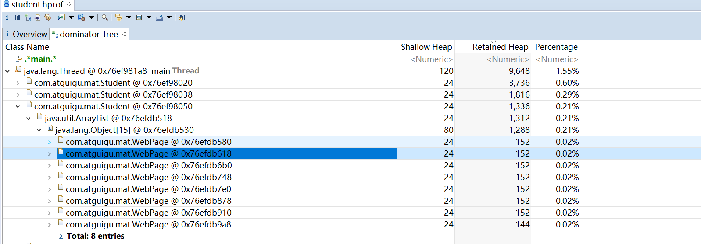

# JVM监控及诊断工具-GUI

## 工具概述

- JDK自带的工具
  - jconsole：JDK自带的可视化监控工具。查看Java应用程序的运行概况、监控堆信息、永久代（或元空间）使用情况、类加载情况等
  - Visual VM：提供了可是界面，用于查看Java虚拟机上运行的基于Java技术的应用程序的详细信息。
  - JMC：Java Mission Control，内置Java Flight Recorder。能够以极低的性能开销收集Java虚拟机的性能数据。
- 第三方工具
  - MAT：基于Eclipse的内存分析工具，是一个快速、功能丰富的Java heap分析工具，它可以帮助我们查找内存泄漏和减少内存消耗
  - JProfiler：商业软件，需要付费。功能强大。
  - Arthas：Alibaba开源的Java诊断工具。
  - Btrace：Java运行时追踪工具。可以在不停机的情况下，跟踪指定的方法调用、构造函数调用和系统内存等信息。

## jConsole

### 基本概述

- 从JDK5开始，在JDK自带的java监控和管理控制台。
- 用于对JVM中内存、线程和类等的监控，是一个基于JMX（java management extensions）的GUI性能监控工具。

### 三种连接方式

#### Local

使用JConsole连接一个正在本地系统运行的JVM，并且执行程序的和运行JConsole的需要是同一个用户。JConsole使用文件系统的授权通过RMI连接器连接到平台的MBean服务器上。这种从本地连接的监控能力只有Sun的JDK具有。

#### Remote

使用下面的URL通过RMI连接器连接到一个JMX代理，service:jmx:rmi:///jndi/rmi://hostName:portNum/jmxrmi。
JConsole为建立连接，需要在环境变量中设置mx.remote.credentials来指定用户名和密码，从而进行授权。

#### Advanced

使用一个特殊的URL连接JMX代理。一般情况使用自己定制的连接器而不是RMI提供的连接器来连接JMX代理，或者是一个使用JDK1.4的实现了JMX和JMXRmote的应用。

## Visual VM

### 基本概述

- 是一个功能强大的多合一故障诊断和性能监控的可视化工具。
- 集成了多个JDK命令行工具，使用Visual VM可用于显示虚拟机进程及进程的配置和环境信息（jps，jinfo），监视应用程序的CPU、GC、堆、方法区和线程的信息（jstat、jstack）等，甚至代替JConsole。
- Visual VM也可以作为独立的软件安装。

首页：https://visualvm.github.io/index.html

### 插件的安装

idea插件的安装、visualvm插件的安装、Visual GC插件安装

### 连接方式

#### 本地连接

监控本地Java进程的CPU、类、线程等

#### 远程连接

1. 确定远程服务器的ip地址
2. 添加JMX（通过JMX技术具体监控远端服务器哪个进程）
3. 修改bin/catalina.sh文件，连接远程的tocat
4. 在../conf添加jmxremote.access和jmxremote.password文件
5. 将服务器地址改为公网ip地址
6. 设置阿里云安全策略和防火墙cel
7. 启动tomcat，查看tomcat启动日志和端口监控
8. JMX中输入端口号、用户名、密码登录

### 主要功能

1. 生成/读取堆内存快照
2. 查看JVM参数和系统属性
3. 查看运行中的虚拟机进程
4. 生成/读取线程快照
5. 程序资源的实时监控
6. 其他功能（JMX代理连接、远程环境监控、CPU分析和内存分析）

## eclipse MAT

### 基本概述

MAT工具是一个款功能强大的Java堆内存分析器。可以用于查找内存泄漏以及查看内存消耗情况。

MAT是基于Eclipse开发的，不仅可以单独使用，还可以作为插件的形式嵌入在Eclipse中使用。是一款免费的性能分析工具，使用起来非常方便。大家可以在
https://www.eclipse.org/mat/downloads.php下载并使用MAT。

### 获取堆dump文件

#### dump文件内容

MAT可以分析heap dump文件。在进行内存分析时，只要获得了反应当前设备映像的hprof文件，通过MAT打开就可以直观地看到当前的内存信息。

一般来说，这些内存信息包含：

- 所有的对象信息，包括对象实例、成员变量、存储于栈中的基本类型值和存储于堆中的其它对象的引用值。
- 所有的类信息，包括classloader、类名称、父类、静态变量等
- GCRoot到所有的这些对象的引用路径
- 线程信息，包括线程的调用栈及此线程的线程局部变量（TLS）

#### 两点说明

1. 不是一个万能工具，并不能处理所有类型的堆存储文件，支持主流的厂家和格式。
2. 最吸引人的还是能够快速为开发人员生成**内存泄漏报表**，方便定位问题和分析问题。

#### 获取dump文件

1. jmap工具生成，可以生成任意一个java进程的dump文件
2. 通过配置参数生成
   - 选项`-XX:+HeapDumpOnOutOfMemoryError`或`-XX:+HeapDumpBeforeFullGC`
   - 选项`-XX:HeapDumpPath`表示当程序出现OOM时，将会在响应的目录下生成一份dump文件，若不指定该参数则在当前目录下生成dump文件
   - 考虑到生成环境中几乎不可能在线对其进行分析，大都是采用离线分析，因此使用jmap+MAT工具是最常见的组合。
3. 使用VisualVM可以导出dump文件
4. 使用MAT既可以打开一个已有的堆快照，也可以通过MAT直接从活动Java程序中导出堆快照。该功能将借助jps列出当前正在运行的Java进程，以供选择并获取快照。

### 分析堆dump文件

#### histogram

MAT的直方图和jmap的-histo子命令一样，都能够展示各个类的实例数目以及这些实例的shallow heap总和。但是，MAT的直方图还能够计算Retained heap，并支持基于实例数目或Retained heap的排序方式（默认为Shallow heap）。

此外，MAT还可以将直方图中的类按照超类、类加载器或者包名分组。

当选中某个类时，MAT界面左上角的Inspector窗口将展示该类的Class实例的相关信息，如类加载器等。

展示了各个类的实例数目以及这些实例数目以及这些实例的Shallow heap或Retained heap的总和。

#### thread overview

- 查看系统中的Java线程
- 查看局部变量的信息

#### 获得对象相互引用的关系

- with outgoing references
- with incoming references

#### 浅堆与深堆

##### shallow heap

浅堆是指一个对象所消耗的内存。在32位系统中，一个对象引用会占用4个字节，一个int类型会占据4个字节，long类型变量会占据8个字节，每个对象头需要占用8个字节。根据堆快照格式不同，对象的大小可能会向8个字节进行对齐。

以String为例：2个int值共占8个字节，对象引用占用4个字节，对象头8字节，合计20字节，向8字节对齐，所以共占24字节。（JDK7）

这24字节为String对象的浅堆大小。它与String的value实际取值无关，无论字符串长度如何，浅堆大小始终是24字节。

##### retained heap

**保留集（Retained Set）**：对象A的保留集指当对象A被垃圾回收后，可以被释放的所有的对象集合（包括对象A本身），即对象A的保留集可以被认为**只能通过**对象A被直接或间接访问到的所有对象的集合。通俗的说，就是指仅被对象A所持有的对象的集合。

**深堆**是指对象的保留集中所有的对象的浅堆大小之和。

注意：浅堆指对象本身占用的内存，不包括其内部引用对象的大小。一个对象的深堆指只能通过该对象访问到的（直接或间接）所有对象的浅堆之和，即对象被回收后，可以释放的真实空间。

##### 补充：对象实际大小

另外一个常用的概念是对象的实际大小。这里，对象的实际大小定义为一个对象**所能触及的**所有对象的浅堆大小之和，也就是通常意义上我们说的对象大小。与深堆相比，这个在日常开发中更为直观和被人接受，**但实际上，这个概念和垃圾回收无关**。

下图显示了一个简单的对象引用关系图，对象A引用了C和D，对象B引用了C和E。那么对象A的浅堆大小只是A本身，不含C和D，而A的实际大小为A、C、D三者之和。而A的深堆大小为A和D之和，由于对象C还可以通过对象B访问到，因此不在对象A的深堆范围内。


##### 练习


上图中，GCRoots直接引用了A和B两个对象。

A对象的Retained Size=A对象的Shallow Size 

B对象的Retained Size=B对象的Shallow Size + C对象的Shallow Size

这里不包括D对象，因为D对象被GC Roots直接引用。
如果GC Roots不引用D对象呢？


##### 案例分析：StudentTrace

```java
package com.atguigu.mat;

import java.util.ArrayList;
import java.util.List;
import java.util.Vector;

/**
 * 有一个学生浏览网页的记录程序，它将记录 每个学生访问过的网站地址。
 * 它由三个部分组成：Student、WebPage和StudentTrace三个类
 *
 *  -XX:+HeapDumpBeforeFullGC -XX:HeapDumpPath=d:\student.hprof
 */
public class StudentTrace {
    static List<WebPage> webpages = new ArrayList<WebPage>();


    public static void createWebPages() {
        for (int i = 0; i < 100; i++) {
            WebPage wp = new WebPage();
            wp.setUrl("http://www." + Integer.toString(i) + ".com");
            wp.setContent(Integer.toString(i));
            webpages.add(wp);
        }
    }

    public static void main(String[] args) {
        createWebPages();//创建了100个网页
        //创建3个学生对象
        Student st3 = new Student(3, "Tom");
        Student st5 = new Student(5, "Jerry");
        Student st7 = new Student(7, "Lily");

        for (int i = 0; i < webpages.size(); i++) {
            if (i % st3.getId() == 0)
                st3.visit(webpages.get(i));
            if (i % st5.getId() == 0)
                st5.visit(webpages.get(i));
            if (i % st7.getId() == 0)
                st7.visit(webpages.get(i));
        }
        webpages.clear();
        System.gc();

    }
}

class Student {
    private int id;
    private String name;
    private List<WebPage> history = new ArrayList<>();

    public Student(int id, String name) {
        super();
        this.id = id;
        this.name = name;
    }

    public int getId() {
        return id;
    }

    public void setId(int id) {
        this.id = id;
    }

    public String getName() {
        return name;
    }

    public void setName(String name) {
        this.name = name;
    }

    public List<WebPage> getHistory() {
        return history;
    }

    public void setHistory(List<WebPage> history) {
        this.history = history;
    }

    public void visit(WebPage wp) {
        if (wp != null) {
            history.add(wp);
        }
    }
}

class WebPage {
    private String url;
    private String content;

    public String getUrl() {
        return url;
    }

    public void setUrl(String url) {
        this.url = url;
    }

    public String getContent() {
        return content;
    }

    public void setContent(String content) {
        this.content = content;
    }
}
```


> lily同学：
>
> 15个webpage，每个对应152个字节 152 * 15=2280，即为elementData的实际大小
>
> 关心的是elementData的深堆1288如何计算出来的？能被7整除，且能被3整除，以及能被5整除的数值有：0，21，42，63，84，35，70 共7个数。
>
> 7 * 152 = 1064字节
>
> 2280 - 1064 = 1216字节，还少72字节！
>
> 15个elementData元素 *4 = 60字节
>
> 60 + 8个对象头的字节数 + 4字节 = 72字节


#### 支配树

支配树（Dominator Tree）的概念源自图论。

MAT提供了一个称为支配树的对象图。支配树体现了对象实例间的支配关系。在对象引用图中，所有指向对象B的路径都经过对象A，则认为**对象A支配对象B**。如果对象A是离对象B最近的一个支配对象，则认为对象A为对象B的**直接支配者**。支配树是基于对象间的引用图所建立的，它有一下基本性质：

- 对象A的子树（所有被对象A支配的对象集合）表示对象A的保留集，即深堆。
- 如果对象A支配对象B，那么对象A的直接支配者也支配对象B。
- 支配树的边与对象引用图的边不直接对应。

如下图所示：左图表示对象引用图，右图表示左图所对应的支配树。对象A和B由根对象直接支配，由于在到对象C的路径中，可以经过A，也可以经过B，因此对象C的直接支配者也是根对象。对象F与对象D相互引用，因为到对象F的所有路径必然经过对象D，因此，对象D是对象F的直接支配者。而到对象D的所有路径中，必然经过对象C，即使是从对象F到对象D的引用，从根节点出发，也是经过对象C的，所以，对象D的直接支配者为对象C。


同理，对象E支配对象G。到达对象H的可以通过对象D，也可以通过对象E，因此对象D和E都不能支配对象H，而经过对象C既可以到达D也可以到达E，因此对象C为对象H的直接支配者。

在MAT中，单击工具栏上的对象支配树按钮，可以打开对象支配树视图。


下图显示了对象支配树视图的一部分。该截图显示部分Lily学生的history队列的直接支配对象。即当Lily对象被回收，也会一并回收的所有对象。显然能被3或者5整除的网页不会出现在该列表中，因为它们同时被另外两名学生对象引用。



### 案例：Tomcat堆栈分析

Tomcat是最常用的Java Servlet容器之一，同时也可以当做单独的Web服务器使用。Tomcat本身使用Java实现，并运行于Java虚拟机之上。在大规模请求时，Tomcat有可能会因为无法承受压力而发生内存溢出错误。这里根据一个被压垮的Tomcat的堆快照文件，来分析Tomcat在崩溃时的内部情况。

#### 分析过程：

图1：


图2：


图3：sessions对象，它占用了约17MB空间


图4：可以看到sessions对象为ConcurrentHashMap，其内部分为16个Segment。从深堆大小看，每个Segment都比较平均，大约为1MB，合计17MB。


图5：


图6：当前堆中含有9941个session，并且每一个session的深堆为1592字节，合计约15MB，达到当前堆大小的50%。


图7：


图8：


根据当前的session总数，可以计算每秒的平均压力为：9941/（1403324677648-1403324645728）*1000=311次/秒。

由此推断，在发生Tomcat堆溢出时，Tomcat在连续30秒的时间内，平均每秒接收了约311次不同客户端的请求，创建了合计9941个session。

## 再谈内存泄漏

### 内存泄漏的理解和分类

可达性分析算法来判断对象是否是不再使用的对象，本质都是判断一个对象是否还被引用。那么对于这种情况下，由于代码的实现不同就会出现很多种内存泄漏问题题（让JVM误以为此对象还在引用中，无法回收，造成内存泄漏）。

- 是否还被使用？是
- 是否还被需要？否

#### 内存泄漏（memory leak）的理解

**严格来说，只有对象不会再被程序用到了，但是GC又不能回收它们的情况，才叫内存泄漏。**

但实际情况很多时候一些不太好的实践（或疏忽）会导致对象的生命周期变得很长甚至导致OOM，也可以叫做**宽泛意义上的内存泄漏**。


对象X引用对象Y，X的生命周期比Y的生命周期长；那么当V生命周期结束的时候，X依然引用着Y，这时候，垃圾回收期是不会回收对象Y的；如果对象X还引用着生命周期比较短的A、B、C，对象A又引用着对象a、b、c，这样就可能造成大量无用的对象不能被回收，进而占据了内存资源，造成内存泄漏，直到内存溢出。

#### 内存泄漏和内存溢出的关系

1. 内存泄漏

   申请了内存用完了不释放，比如一共有1024M的内存，分配了512M的内存一直不回收，那么可以用的内存只有512M了，仿佛泄漏掉了一部分。

   通俗一点讲的话，内存泄漏就是【占着萨坑不拉shi】。

2. 内存溢出

   申请内存时，没有足够的内存可以使用。
   
   通俗一点儿讲，一个厕所就三个坑，有两个站着茅坑不走的（内存泄漏），剩下最后一个坑，厕所表示接待压力很大，这时候一下子来了两个人，坑位（内存）就不够了，内存泄漏变成内存溢出了。

可见，内存泄漏和内存溢出的关系：内存泄漏的增多，最终导致内存溢出。

#### 泄漏的分类

**经常发生**：发生内存泄漏的代码会多次执行，每次执行，泄漏一块内存。

**偶然发生**：在某些特定情况下才会发生。

**一次性**：发生内存泄漏的方法只会执行一次。

**隐式泄漏**：一直占着内存不释放，直到执行结束；严格的说这个不算内存泄漏，因为最终释放掉了，但是如果执行时间特别长，也可能导致内存耗尽。

### Java中内存泄漏的8种情况

#### 静态集合类

静态集合类，如HashMap、LinkedList等等。如果这些容器为静态的，那么它们的生命周期与JVM程序一致，则容器中的对象在程序结束之前将不能被释放，从而造成内存泄漏。简单而言，长生命周期的对象持有短生命周期对象的引用，尽管短生命周期的对象不再使用，但是因为长生命周期对象持有它的引用而导致不能被回收。

~~~java
public class MemoryLeak {

    static List list = new ArrayList();

    public static void method(){
        Object o = new Object();
        list.add(o);
    }
}
~~~

#### 单例模式

和静态集合导致内存泄漏的原因类似，因为单例的静态特性，它的生命周期和JVM的生命周期一样长，所以如果单例对象如果持有外部对象的引用，那么这个外部对象也不会被回收，那么就会造成内存泄漏。

#### 内部类持有外部类

如果一个外部类的实例对象的方法返回了一个内部类的实例对象。这个内部类对象被长期使用了， 即使那个外部类实例对象不再被使用，但由于内部类持有外部类的实例对象，这个外部类对象将不会被垃圾回收，这也会造成内存泄露。

#### 各种连接，如数据库连接、网络连接和IO连接等

在对数据库进行操作的过程中，首先需要建立与数据库的连接，当不再使用时，需要调用close方法来释放与数据库的连接。只有连接被关闭后，垃圾回收器才会回收对应的对象。否则，如果在访问数据库的过程中，对Connection、Statement或ResultSet不显性地关闭，将会造成大量的对象无法被回收，从而引起内存泄漏。

~~~java
public static void main(String[] args) {
        try {
            Connection connection = null;
            Class.forName("com.mysql.jdbc.Driver");
            connection = DriverManager.getConnection("", "", "");
            Statement statement = connection.createStatement();
            ResultSet resultSet = statement.executeQuery("");
        } catch (ClassNotFoundException e) {
            e.printStackTrace();
        } catch (SQLException throwables) {
            throwables.printStackTrace();
        } finally {
            // 1.关闭结果集statement
            // 2.关闭声明的对象resultSet
            // 3.关闭连接 connection
        }
    }
~~~

#### 变量不合理的作用域

一般而言，一个变量的定义的作用范围大于其使用范围，很有可能会造成内存泄漏。另一方面，如果没有及时地把对象设置为null，很有可能导致内存泄漏的发生。

~~~java
public class UsingRandom {

    private String msg;

    public void receiveMsg(){

        readFromNet();// 从网络中接受数据保存到msg中
        saveDB();// 把msg保存到数据库中
    }
}
~~~

如上面这个伪代码，通过readFromNet方法把接受的消息保存在变量msg中，然后调用saveDB方法把msg的内容保存到数据库中，此时msg已经就没用了，由于msg的生命周期与对象的生命周期相同，此时msg还不能回收，因此造成了内存泄漏。

实际上这个msg变量可以放在receiveMsg方法内部，当方法使用完，那么msg的生命周期也就结束，此时就可以回收了。还有一种方法，在使用完msg后，把msg设置为null，这样垃圾回收器也会回收msg的内存空间。

#### 改变哈希值

改变哈希值，当一个对象被存储进`HashSet`集合中以后，就不能修改这个对象中的那些参与计算哈希值的字段了。

否则，对象修改后的哈希值与最初存储进`HashSet`集合中时的哈希值就不同了，在这种情况下，即使在`contains`方法使用该对象的当前引用作为的参数去`HashSet`集合中检索对象，也将返回找不到对象的结果，这也会导致无法从`HashSet`集合中单独删除当前对象，造成内存泄漏。

这也是`String`为什么被设置成了不可变类型，我们可以放心地把`String`存入`HashSet`，或者把`String`当做`HashMap`的key值；

当我们想把自己定义的类保存到散列表的时候，需要保证对象的`hashCode`不可变。

```java
public class ChangeHashCode1 {
    public static void main(String[] args) {
        HashSet<Point> hs = new HashSet<Point>();
        Point cc = new Point();
        cc.setX(10);//hashCode = 41
        hs.add(cc);

        cc.setX(20);//hashCode = 51  此行为导致了内存的泄漏

        System.out.println("hs.remove = " + hs.remove(cc));//false
        hs.add(cc);
        System.out.println("hs.size = " + hs.size());//size = 2

        System.out.println(hs);
    }

}

class Point {
    int x;

    public int getX() {
        return x;
    }

    public void setX(int x) {
        this.x = x;
    }

    @Override
    public int hashCode() {
        final int prime = 31;
        int result = 1;
        result = prime * result + x;
        return result;
    }

    @Override
    public boolean equals(Object obj) {
        if (this == obj) return true;
        if (obj == null) return false;
        if (getClass() != obj.getClass()) return false;
        Point other = (Point) obj;
        if (x != other.x) return false;
        return true;
    }

    @Override
    public String toString() {
        return "Point{" +
                "x=" + x +
                '}';
    }
}
```

```java
public class ChangeHashCode {
    public static void main(String[] args) {
        HashSet set = new HashSet();
        Person p1 = new Person(1001, "AA");
        Person p2 = new Person(1002, "BB");

        set.add(p1);
        set.add(p2);

        p1.name = "CC";//导致了内存的泄漏
        set.remove(p1); //删除失败

        System.out.println(set);

        set.add(new Person(1001, "CC"));
        System.out.println(set);

        set.add(new Person(1001, "AA"));
        System.out.println(set);

    }
}

class Person {
    int id;
    String name;

    public Person(int id, String name) {
        this.id = id;
        this.name = name;
    }

    @Override
    public boolean equals(Object o) {
        if (this == o) return true;
        if (!(o instanceof Person)) return false;

        Person person = (Person) o;

        if (id != person.id) return false;
        return name != null ? name.equals(person.name) : person.name == null;
    }

    @Override
    public int hashCode() {
        int result = id;
        result = 31 * result + (name != null ? name.hashCode() : 0);
        return result;
    }

    @Override
    public String toString() {
        return "Person{" +
                "id=" + id +
                ", name='" + name + '\'' +
                '}';
    }
}
```

#### 缓存泄漏

内存泄漏的另一个常见来源是缓存，一旦你把对象引用放入到缓存中，他就很容易遗忘。比如：之前项目在一次上线的时候，应用启动奇慢直到夯死，就是因为代码中会加载一个表中的数据到缓（内存）中，测试环境只有几百条数据，但是生产环境有几百万的数据。

对于这个问题，可以使用`WeakHashMap`代表缓存，此种`Map`的特点是，当除了自身有对key的引用外，此key没有其他引用那么此map会自动丢弃此值。

~~~java
public class MapTest {
    static Map wMap = new WeakHashMap();
    static Map map = new HashMap();
    public static void main(String[] args) {
        init();
        testWeakHashMap();
        testHashMap();
    }

    public static void init(){
        String ref1= new String("obejct1");
        String ref2 = new String("obejct2");
        String ref3 = new String ("obejct3");
        String ref4 = new String ("obejct4");
        wMap.put(ref1, "chaheObject1");
        wMap.put(ref2, "chaheObject2");
        map.put(ref3, "chaheObject3");
        map.put(ref4, "chaheObject4");
        System.out.println("String引用ref1，ref2，ref3，ref4 消失");

    }
    public static void testWeakHashMap(){

        System.out.println("WeakHashMap GC之前");
        for (Object o : wMap.entrySet()) {
            System.out.println(o);
        }
        try {
            System.gc();
            TimeUnit.SECONDS.sleep(20);
        } catch (InterruptedException e) {
            // TODO Auto-generated catch block
            e.printStackTrace();
        }
        System.out.println("WeakHashMap GC之后");
        for (Object o : wMap.entrySet()) {
            System.out.println(o);
        }
    }
    public static void testHashMap(){
        System.out.println("HashMap GC之前");
        for (Object o : map.entrySet()) {
            System.out.println(o);
        }
        try {
            System.gc();
            TimeUnit.SECONDS.sleep(20);
        } catch (InterruptedException e) {
            // TODO Auto-generated catch block
            e.printStackTrace();
        }
        System.out.println("HashMap GC之后");
        for (Object o : map.entrySet()) {
            System.out.println(o);
        }
    }

}
/** 结果
 String引用ref1，ref2，ref3，ref4 消失
 WeakHashMap GC之前
 obejct2=chaheObject2
 obejct1=chaheObject1
 WeakHashMap GC之后
 HashMap GC之前
 obejct4=chaheObject4
 obejct3=chaheObject3
 Disconnected from the target VM, address: '127.0.0.1:51628', transport: 'socket'
 HashMap GC之后
 obejct4=chaheObject4
 obejct3=chaheObject3
 **/
~~~


上面代码和图示主演演示`WeakHashMap`如何自动释放缓存对象，当int函数执行完成后，局部变量字符串引用weakd1，weakd2，d1，d2都会消失，此时只有静态map中保存中对字符串对象的引用，可以看到，调用gc之后，`HashMap`的没有被回收，而`WeakHashMap`里面的缓存被回收了。

#### 监听器和回调

内存泄漏另一个常见来源是监听器和其他回调，如果客户端在你实现的API中注册回调，却没有显示的取消，那么就会积聚。需要确保回调立即被当作垃圾回收的最佳方法是只保存他的弱引用，例如将他们保存成为WeakHashMap中的键。

### 内存泄漏案例分析

~~~java

import java.util.Arrays;
import java.util.EmptyStackException;

public class Stack {
    private Object[] elements;
    private int size = 0;
    private static final int DEFAULT_INITIAL_CAPACITY = 16;

    public Stack() {
        elements = new Object[DEFAULT_INITIAL_CAPACITY];
    }

    public void push(Object e) {
        ensureCapacity();
        elements[size++] = e;
    }

    // 存在内存泄漏
    public Object pop() {
        if (size == 0)
            throw new EmptyStackException();
        return elements[--size];
    }

    private void ensureCapacity() {
        if (elements.length == size)
            elements = Arrays.copyOf(elements, 2 * size + 1);
    }
}
~~~

上述程序并没有明显的错误，但是这段程序有一个内存泄漏，随着GC活动的增加，或者内存占用的不断增加，程序性能的降低就会表现出来，严重时可导致内存泄漏，但是这种失败情况相对较少。代码的主要问题在pop函数，下面通过这张图示展现
假设这个栈一直增长，增长后如下图所示


当进行大量的pop操作时，由于引用未进行置空，gc是不会释放的，如下图所示


解决方法：

~~~java
public Object pop() {
    if (size == 0)
    throw new EmptyStackException();
    Object result = elements[--size];
    elements[size] = null;
    return result;
}
~~~

一旦引用过期，清空这些引用，将引用置空。


## 支持使用OQL语言查询对象信息

MAT支持一种类似于SQL的查询语言OQL（Object Query Language）。OQL使用类SQL语法，可以在堆中进行对象的查找和筛选。

### select子句


### from子句


### where字句


### 内置对象与方法


## JProfiler 

### 基本概述

#### 介绍

在运行Java的时候有时候想测试运行时占用内存情况，这时候就需要使用测试工具查看了。在eclipse里面有Eclipse Memory Analyzer tool（MAT）插件可以测试，而在IDEA中也有这么一个插件，就是JProfiler。

JProfiler 是由ej-technologies公司开发的一款Java应用性能诊断工具。功能强大，但是收费。

官网下载地址：https://www.ej-technologies.com/products/jprofiler/overview.html

#### 特点

- 使用方便、界面操作友好（简单且强大）
- 对被分析的应用影响小（提供模版）
- CPU，Thread，Memory分析功能尤其强大
- 支持对jdbc、nosql、jsp、servlet、socket等进行分析
- 支持多种模式（离线、在线）的分析
- 支持监控本地、远程的JVM
- 跨平台，拥有多种操作系统的安装版本


#### 主要功能

1-方法调用：对方法调用的分析可以帮助您了解应用程序正在做什么，并找到提高其性能的方法

2-内存分配：通过分析堆上对象、引用链和垃圾收集能帮您修复内存泄漏问题，优化内存使用

3-线程和锁：JProfiler提供多种针对线程和锁的分析视图助您发现多线程问题许多性能问题都发生在更高的语义级别上。例如，对于JDBC调用，您可能希望找出

4-高级子系统：许多性能问题都发生在更高的语义级别上。例如，对于JDBC调用，您可能希望找出执行最慢的SQL语句。JProfiler支持对这些子系统进行集成分析

### 具体使用

#### 数据采集方式

JProfier数据采集方式分为两种：Sampling（样本采集）和Instrumentation（重构模式）

- Instrumentation：这是JProfiler全功能模式。在class加载之前，JProfier把相关功能代码写入到需要分析的class的bytecode中，对正在运行的jvm有一定影响。
  - 优点：功能强大。在此设置中，调用堆栈信息是准确的。
  - 缺点：若要分析的class较多，则对应用的性能影响较大，CPU开销可能很高（取决于Filter的控制）。因此使用此模式一般配合Filter使用，只对特定的类或包进行分析。

- Sampling：类似于样本统计，每隔一定时间（5ms）将每个线程栈中方法栈中的信息统计出来。
  - 优点：对CPU的开销非常低，对应用影响小（即使你不配置任何Filter）
  - 缺点：一些数据/特性不能提供（例如：方法的调用次数、执行时间）

注：JProfiler本身没有指出数据的采集类型，这里的采集类型是针对方法调用的采集类型。因为JProfiler的绝大多数核心功能都依赖方法调用采集的数据，所以可以直接认为是JProfiler的数据采集类型。

#### 遥感监测Telemetries


#### 内存视图Live Memory

- **所有对象 All Objects**

显示所有加载的类的列表和在堆上分配的实例数

- **记录对象 Record Objects**

查看特定时间段对象的分配，并记录分配的调用堆栈。

- **分配访问树 Allocation Call Tree**

显示一颗请求树或者方法、类包或对已选择类由带注释的分配信息的J2EE组件

- **分配热点 Allocation Hot Spots**

显示一个列表，包括方法、类、包或分配已选择的J2EE组件。可以标注当前值并且显示差异值。对于每个热点都可以显示它的跟踪记录树

- **类追踪器 Class Tracker**

类跟踪视图可以包含任意数量的图表，显示选定的类和包的实例与时间

***

分析：内存中的对象情况

1. 频繁创建Java对象：死循环、循环次数过多
2. 存在大的对象：读取文件时，byte[]应该边读边写
3. 存在内存泄漏

#### 堆遍历heap walker

**类 Classes**

显示所有类和它们的实例，可以点击具体的类“Used Selected Instance”实现进一步跟踪。

**分配 Allocations**

为所有记录对象显示分配树和分配热点。

**索引 References**

为单个对象和“显示到垃圾回收根目录的路径”提供索引图的显示功能。还能提供合并输入视图和输出视图的功能。

**时间 Time**

显示一个对已记录对象的解决时间的柱状图。

**检查 Inspections**

显示了一个数量的操作，将分析当前对象集在某种条件下的子集，实质是筛选的过程。

**图表 Graph**

需要在references视图和biggest视图手动添加对象到图表，它可以显示对象的传入和传出引用，能方便的找到垃圾收集器根源。

> 在工具栏点击“Go To Start”可以使堆内存重新计数，也就是回到初始状态。

#### cpu视图cpu views

JProfiler提供不同的方法来记录访问树以优化性能和细节。线程或者线程组以及线程状况可以被所有的视图选择。所有的视图都可以聚集到方法、类、包或J2EE组件等不同层上。

**访问树 Call Tree**

显示一个积累的自顶向下的树，树中包含所有在JVM中已记录的访问队列。JDBC，JMS和JNDI服务请求都被注释在请求树中。请求树可以根据Servlet和JSP对URL的不同需要进行拆分。

**热点 Hot Spots**

显示消耗时间最多的方法的列表。对每个热点都能够显示回溯树。该热点可以按照方法请求，JDBC，JMS和JNDI服务请求以及按照URL请求来进行计算。

**访问图 Call Graph**

显示一个从已选方法、类、包或J2EE组件开始的访问队列的图。

**方法统计 Method Statistcs**

显示一段时间内记录的方法的调用时间细节。

#### 线程视图threads

JProfiler通过对线程历史的监控判断其运行状态，并监控是否有线程阻塞产生，还能将一个线程所管理的方法以及树状形式呈现。

**线程历史 Thread History**

显示一个与线程活动和线程状态在一起的活动时间表。

**线程监控 Thread Monitor**

显示一个列表，包括所有的活动线程以及它们目前的活动状况。

**线程转储 Thread Dumps**

显示所有线程的堆栈跟踪。

***

线程分析主要关心三个方面：

1. web容器的线程最大数。比如：Tomcat的线程容量应该略大于最大并发数。
2. 线程阻塞。
3. 线程死锁。

#### 监视器&锁Monitors&locks

所有的线程持有锁的情况以及锁的信息。

- 死锁探测图表 Current Locking Graph：显示JVM中的当前死锁图表。
- 目前使用的检测器Current Monitors：显示目前使用的探测器并且包括它们的关联线程。
- 锁定历史图表 Locking History Graph：显示记录在JVM中的锁定历史。
- 历史监测记录：Monitor History：显示重大的等待事件和阻塞事件的历史记录。
- 监控器使用统计Monitor Usage Statistcs：显示分组监测，线程和监测类的统计监测数据。

### 案例分析

#### 案例1

```java
public class JProfilerTest {
    public static void main(String[] args) {
        while (true){
            ArrayList list = new ArrayList();
            for (int i = 0; i < 500; i++) {
                Data data = new Data();
                list.add(data);
            }
            try {
                TimeUnit.MILLISECONDS.sleep(500);
            } catch (InterruptedException e) {
                e.printStackTrace();
            }
        }
    }
}
class Data{
    private int size = 10;
    private byte[] buffer = new byte[1024 * 1024];//1mb
    private String info = "hello,atguigu";
}
```


#### 案例2

```java
public class MemoryLeak {

    public static void main(String[] args) {
        while (true) {
            ArrayList beanList = new ArrayList();
            for (int i = 0; i < 500; i++) {
                Bean data = new Bean();
                data.list.add(new byte[1024 * 10]);//10kb
                beanList.add(data);
            }
            try {
                TimeUnit.MILLISECONDS.sleep(500);
            } catch (InterruptedException e) {
                e.printStackTrace();
            }
        }
    }

}

class Bean {
    int size = 10;
    String info = "hello,atguigu";
     ArrayList list = new ArrayList();
//    static ArrayList list = new ArrayList();
}
```

## Arthas

### 基本概述 

JProfiler、jvisualVM这两款工具在业界知名度也比较高，他们的**优点**是可以图形界面上看到各维度的性能数据，使用者根据这些数据进行综合分析，然后判断哪里出现了性能问题。

但是这两款工具也有个**缺点**，都必须在服务端项目进程中配置相关的监控参数。然后工具通过远程连接到项目进程，获取相关的数据。这样就会带来一些不便，比如线上环境的网络是隔离的，本地的监控工具根本连不上线上环境。并且类似于Jprofiler这样的商业工具，是需要付费的。

那么有没有一款工具不需要远程连接，也不需要配置监控参数，同时也提供了丰富的性能监控数据呢？

Arthas是Alibaba开元的Java诊断工具，在线排查问题，无需重启；动态跟踪Java代码，实时监控JVM状态。

### 基于哪些工具而来

greys-anatomy:Arthas代码基于Greys二次开发而来，非常感谢Greys之前所有的工作，以及Greys原作者对Arthas提出的意见和建议！

termd:Arthas的命令行实现基于termd开发，是一款优秀的命令行程序开发框架，感谢termd提供了优秀的框架。

crash:Arthas的文本渲染功能基于crash中的文本渲染功能开发，可以从这里看到源码，感谢crash在这方面所做的优秀工作。

cli:Arthas的命令行界面基于vert.x提供的cli库进行开发，感谢vert.x在这方面做的优秀工作。

compiler Arthas里的内存编绎器代码来源

Apache Commons Net Arthas里的Telnet Client代码来源JavaAgent：运行在main方法之前的拦截器，它内定的方法名叫premain，也就是说先执行premain 方法然后再执行main方法

ASM：一个通用的Java字节码操作和分析框架。它可以用于修改现有的类或直接以二进制形式动态生成类。ASM提供了一些常见的字节码转换和分析算法，可以从它们构建定制的复杂转换和代码分析工具。ASM提供了与其他Java字节码框架类似的功能，但是主要关注性能。因为它被设计和实现得尽可能小和快，所以非常适合在动态系统中使用（当然也可以以静态方式使用，例如在编译器中）

### 安装与使用

#### 安装

安装方式一：可以直接在Linux上通过命令下载

可以在官方Github上进行下载，如果速度较慢，可以尝试国内的码云Gitee下载。
github下载：`wget https://alibaba.github.io/arthas/arthas-boot.jar`
Gitee下载：`wget https://arthas.gitee.io/arthas-boot.jar`

安装方式二：
也可以在浏览器直接访问https://alibaba.github.io/arthas/arthas-boot.jar，等待下载成功后，上传到Linux服务器上。


#### 工程目录

```sh
arthas-agent：基于JavaAgent技术的代理bin：一些启动脚本
arthas-boot:Java版本的一键安装启动脚本arthas-client:telnet client代码arthas-common：一些共用的工具类和枚举类
arthas-core：核心库，各种arthas命令的交互和实现arthas-demo：示例代码
arthas-memorycompiler：内存编绎器代码，Fork from https://github.com/skalogs/SkaETL/tree/master/compiler arthas-packaging:maven打包相关的arthas-site:arthas站点
arthas-spy：编织到目标类中的各个切面
static：静态资源
arthas-testcase：测试
```

#### 启动

Arthas 只是一个java程序，所以可以直接用java-jar运行。

执行成功后，arthas提供了一种命令行方式的交互方式，arthas会检测当前服务器上的Java进程，并将进程列表展示出来，用户输入对应的编号（1、2、3、4…）进行选择，然后回车。

方式1：

```
java-jar arthas-boot.jar
```

方式2：运行时选择Java进程PID

```
java-jar arthas-boot.jar[PID]
```


#### 查看日志

```sh
cat ~/logs/arthas/arthas.log
```

 

#### 参看帮助

```sh
java -jar arthas-boot.jar -h
```


#### web console

除了在命令行查看外，Arthas目前还支持Web Console。在成功启动连接进程之后就已经自动启动，可以直接访问http://127.0.0.1:8563/访问，页面上的操作模式和控制台完全一样。

#### 退出

最后一行[arthas@7457]$，说明打开进入了监控客户端，在这里就可以执行相关命令进行查看了。

- 使用quit\exit：退出当前客户端
- 使用stop\shutdown：关闭arthas服务端，并退出所有客户端。


### 相关诊断指令

#### 基础指令

```sh
help——查看命令帮助信息

cat-—打印文件内容，和linux里的cat命令类似echo-打印参数，和linux里的echo命令类似

echo-打印参数，和linux里的echo命令类似

grep—-匹配查找，和linux里的grep命令类似tee——复制标准输入到标准输出和指定的文件，和linux里的tee命令类似pwd--返回当前的工作目录，和linux命令类似

tee—-复制标准输入到标准输出和指定的文件，和linux里的tee命令类似

pwd-—返回当前的工作目录，和linux命令类似

cls-—清空当前屏幕区域

session-—查看当前会话的信息

reset--重置增强类，将被Arthas增强过的类全部还原，Arthas服务端关闭时会重置所有增强过的类version—-输出当前目标Java进程所加载的Arthas版本号

version—-输出当前目标Java进程所加载的Arthas版本号

history-—打印命令历史

quit-—退出当前Arthas 客户端，其他Arthas客户端不受影响stop-—关闭 Arthas 服务端，所有Arthas 客户端全部退出keymap--Arthas快捷键列表及自定义快捷键

stop--关闭Arthas 服务端，所有Arthas客户端全部退出

keymap--Arthas快捷键列表及自定义快捷键
```


#### JVM相关

- [dashboard](https://arthas.aliyun.com/doc/dashboard.html)——当前系统的实时数据面板
- [thread](https://arthas.aliyun.com/doc/thread.html)——查看当前 JVM 的线程堆栈信息
- [jvm](https://arthas.aliyun.com/doc/jvm.html)——查看当前 JVM 的信息
- [sysprop](https://arthas.aliyun.com/doc/sysprop.html)——查看和修改JVM的系统属性
- [sysenv](https://arthas.aliyun.com/doc/sysenv.html)——查看JVM的环境变量
- [vmoption](https://arthas.aliyun.com/doc/vmoption.html)——查看和修改JVM里诊断相关的option
- [perfcounter](https://arthas.aliyun.com/doc/perfcounter.html)——查看当前 JVM 的Perf Counter信息
- [logger](https://arthas.aliyun.com/doc/logger.html)——查看和修改logger
- [getstatic](https://arthas.aliyun.com/doc/getstatic.html)——查看类的静态属性
- [ognl](https://arthas.aliyun.com/doc/ognl.html)——执行ognl表达式
- [mbean](https://arthas.aliyun.com/doc/mbean.html)——查看 Mbean 的信息
- [heapdump](https://arthas.aliyun.com/doc/heapdump.html)——dump java heap, 类似jmap命令的heap dump功能
- [vmtool](https://arthas.aliyun.com/doc/vmtool.html)——从jvm里查询对象，执行forceGc


#### class/classloader相关

- [sc](https://arthas.aliyun.com/doc/sc.html)——查看JVM已加载的类信息
- [sm](https://arthas.aliyun.com/doc/sm.html)——查看已加载类的方法信息
- [jad](https://arthas.aliyun.com/doc/jad.html)——反编译指定已加载类的源码
- [mc](https://arthas.aliyun.com/doc/mc.html)——内存编译器，内存编译`.java`文件为`.class`文件
- [retransform](https://arthas.aliyun.com/doc/retransform.html)——加载外部的`.class`文件，retransform到JVM里
- [redefine](https://arthas.aliyun.com/doc/redefine.html)——加载外部的`.class`文件，redefine到JVM里
- [dump](https://arthas.aliyun.com/doc/dump.html)——dump 已加载类的 byte code 到特定目录
- [classloader](https://arthas.aliyun.com/doc/classloader.html)——查看classloader的继承树，urls，类加载信息，使用classloader去getResource


#### monitor/watch/trace相关

- [monitor](https://arthas.aliyun.com/doc/monitor.html)——方法执行监控
- [watch](https://arthas.aliyun.com/doc/watch.html)——方法执行数据观测
- [trace](https://arthas.aliyun.com/doc/trace.html)——方法内部调用路径，并输出方法路径上的每个节点上耗时
- [stack](https://arthas.aliyun.com/doc/stack.html)——输出当前方法被调用的调用路径
- [tt](https://arthas.aliyun.com/doc/tt.html)——方法执行数据的时空隧道，记录下指定方法每次调用的入参和返回信息，并能对这些不同的时间下调用进行观测

#### 其他

- [profiler](https://arthas.aliyun.com/doc/profiler.html)–使用[async-profiler](https://github.com/jvm-profiling-tools/async-profiler)对应用采样，生成火焰图
- [options](https://arthas.aliyun.com/doc/options.html)——查看或设置Arthas全局开关


## Java Mission Control

### 历史

在Oracle收购Sun之前，Oracle的JRockit 虚拟机提供了一款叫做JRockit Mission Control 的虚拟机诊断工具。

在Oracle收购Sun之后，Oracle公司同时拥有了Sun Hotspot和JRockit两款虚拟机。根据Orac1e对于Java的战略，在今后的发展中，会将JRockit的优秀特性移植到Hotspot上。其中，一个重要的改进就是在Sun的JDK中加入了JRockit的支持。

在Oracle JDK 7u40之后，Mission Control这款工具已经绑定在oracleJDK中发布。

自Java 11开始，本节介绍的JFR已经开源。但在之前的Java版本，JFR属于Commercial Feature，需要通过Java 虚拟机参数`-XX:+UnlockCommercialFeatures`开启

如果你有兴趣请可以查看OpenJDK的Mission Control项目。
https://github.com/JDKMissionControl/jmc

### 启动

jmc.exe

### 概述

Java Mission Control（简称JMC），Java官方提供的性能强劲的工具。是一个用于对Java 应用程序进行管理、监视、概要分析和故障排除的工具套件。

它包含一个GUI客户端，以及众多用来收集Java虚拟机性能数据的插件，如JMX Console（能够访问用来存放虚拟机各个子系统运行数据的MXBeans），以及虚拟机内置的高效profiling 工具Java Flight Recorder（JFR）。

JMC的另一个优点就是：采用取样，而不是传统的代码植入技术，对应用性能的影响非常非常小，完全可以开着JMC来做压测（唯一影响可能是fullgc多了）。

### 功能：实时监控JVM运行时的状态


### Java Flight Recorder


## TProfiler

案例：

使用JDK自身提供的工具进行JVM调优可以将TPS由2.5提升到20（提升了7倍），并准确定位系统瓶颈。

系统瓶颈有：应用里静态对象不是太多、有大量的业务线程在频繁创建一些生命周期很长的临时对象，代码里有问题。

那么，如何在海量业务代码里边准确定位这些性能代码？这里使用阿里开源工具TProfiler来定位这些性能代码，成功解决掉了GC过于频繁的性能瓶颈，并最终在上次优化的基础上将TPS再提升了4倍，即提升到100。

TProfiler配置部署、远程操作、日志阅读都不太复杂，操作还是很简单的。但是其却是能够起到一针见血、立竿见影的效果，帮我们解决了GC过于频繁的性能瓶颈。

TProfiler 最重要的特性就是能够统计出你指定时间段内JvM的top method，这些top method极有可能就是造成你JVM性能瓶颈的元凶。这是其他大多数JVM调优工具所不具备的，包括JRockit Mission Control。JRokit 首席开发者Marcus Hirt在其私人博客《Low Overhead Method Profiling with Java Mission Control》下的评论中曾明确指出JRMC并不支持TOP方法的统计。

TProfiler的下载：https://github.com/alibaba/TProfiler


