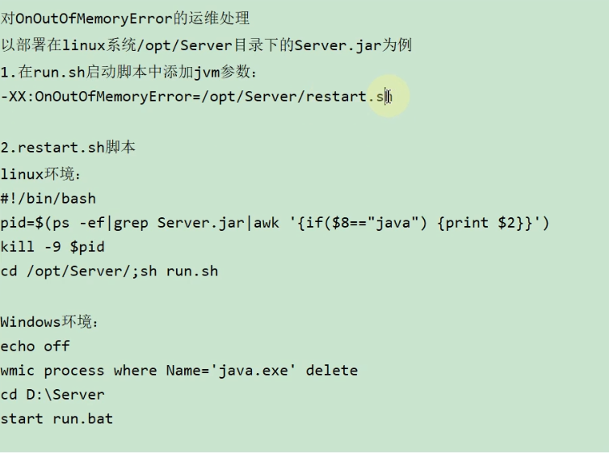

# JVM运行时参数

## JVM参数选项类型

### 类型一：标准参数选项

比较稳定，后续版本基本不会变化，以-开头。

可以使用`java`或者`java -help`查看所有标准选项。

### 类型二：-X参数选项

功能比较稳定，但官方后续可能会变更，以-X开头。

可以使用`java -X`查看。

特别的，`-Xms`等价于`-XX:InitialHeapSize`，`-Xmx`等价于`-XX:MaxHeapSize`，`-Xss`等价于`-XX:ThreadStackSize`。

### 类型三：-XX参数选项

使用最多的参数类型，这类选项属于实验性，不稳定，以-XX开头。用于开发和调试JVM。

#### 分类

**Boolean类型格式**

`-XX:+<option>`表示启动option属性，`-XX:-<option>`表示禁用option属性。

**非Boolean类型格式**

子类型1：数值型格式`-XX:<option>=<number>`

子类型2：非数值型格式`-XX:<option>=<string>`

#### 特别的

`-XX:+PrintFlagsFinal`：输出所有参数的名称和默认值、默认不包括Diagnostic和Experimental的参数、可以配合`-XX:+UnlockDiagnosticVMOptions`和`-XX:UnlockExperimentalVMOptions`使用

## 添加JVM参数

### 运行jar包

~~~java
java -Xms100m -Xmx100m -XX:+PrintGCDetails -jar demo.jar
~~~

### 通过Tomcat运行war包

Linux：tomcat/bin/catalina.sh中添加，JAVA_OPTS=“-Xms100m -Xmx100m”

Windows：catalina.bat中添加，set”JAVA_OPTS=-Xms100m -Xmx100m”

### 程序运行过程中

- `jinfo -flag <name>=<value> <pid>`设置非Boolean类型参数

- `jinfo -flag [+|-] <name> <pid>`设置Boolean类型参数

## 常用的JVM参数选项

### 打印设置的XX选项及值

`-XX:+PrintCommandLineFlags`：可以让在程序运行前打印出用户手动设置或者JVM自动设置的XX选项

`-XX:+PrintFlagsInitial`：打印出所有XX选项的默认值

`-XX:+PrintFlagsFinal`：打印出XX选项在运行程序时生效的值

`-XX:+PrintVMOptions`：打印JVM的参数

### 堆、栈、方法区等内存大小设置

#### 栈

`-Xss128k`：设置每个线程的栈大小为128k，等价于`-XX:ThreadStackSize=128k`

#### 堆内存

`-Xms100m`：等价于`-XX:InitialHeapSize=100m`，设置JVM初始堆内存为100M

`-Xmx100m`：等价于`-XX:MaxHeapSize=100m`，设置JVM最大堆内存为100M

`-Xmn2g`：设置年轻代大小为2G，官方推荐配置为整个堆大小的3/8

`-XX:NewSize=1024m`：设置年轻代初始值为1024M

`-XX:MaxNewSize=1024m`：设置年轻代最大值为1024M

`-XX:SurvivorRatio=8`：设置年轻代中Eden区与一个Survivor区的比值，默认为8

`-XX:+UseAdaptiveSizePolicy`：自动选择各区大小比例

`-XX:NewRatio=4`：设置老年代与年轻代的比值

`-XX:PretenureSizeThredshold=1024`：设置让大于此阈值的对象直接分配在老年代，单位为字节，只对Serial、ParNew收集器有效

`-XX:MaxTenuringThreshold=15`：默认值为15，新生代每次MinorGC后，还存活的对象年龄+1，当对象的年龄大于设置的这个值时就进入老年代

`-XX:+PrintTenuringDistribution`：让JVM在每次MinorGC后打印出当前使用的Survivor中对象的年龄分布

`-XX:TargetSurvivorRatio`：表示MinorGC结束后Survivor区域中占用空间的期望比例

#### 方法区

##### 永久代

`-XX:PermSize=256m`：设置永久代初始值为256M

`-XX:MaxPermSize=256m`，设置永久代最大值为256M

##### 元空间

`-XX:MetaspaceSize=size`：初始空间大小

`-XX:MaxMetaspaceSize=size`：最大空间，默认没有限制

`-XX:+UseCompressedOops`：压缩对象指针

`-XX:+UseCompressedClassPointers`：压缩类指针

`-XX:CompressedClassSpaceSize`：设置klass MetaSpace的大小，默认为1G

#### 直接内存

`-XX:MaxDirectMemorySize`：指定DirectMemory容量，若未指定，则默认与Java堆最大值一样

### OutOfMemory相关的选项

`-XX:+HeapDumpOnOutOfMemoryError`：表示在内存出现OOM的时候，把Heap转存（Dump）到文件以便后续分析

`-XX:+HeapDumpBeforeFullGC`：表示在出现FullGC之前，生成Heap转储文件

`-XX:HeapDumpPath=<path>`：指定heap转存文件的存储路径

`-XX:OnOutOfMemoryError=/opt/Server/restart.sh`：指定一个可行性程序或者脚本的路径，当发生OOM的时候，去执行这个脚本

### 垃圾收集器相关选项

#### 查看默认垃圾收集器

`-XX:+PrintCommandLineFlags`：查看命令行相关参数

使用命令行指令：jinfo -flag 相关垃圾回收器参数 进程ID

#### Serial回收器

`-XX:+SerialGC`：指定年轻代和老年代都使用串行收集器

#### ParNew回收器

`-XX:+UseParNewGC`：年轻代使用并行收集器

`-XX:ParallelGCThreads=N`：限制线程数量，默认开启和CPU数据相同的线程数

#### Parallel回收器

`-XX:+UseParallelGC`：指定年轻代使用Parallel并行收集器执行内存回收任务

`-XX:+UseParallelOldGC`：指定老年代使用并行收集器

- 分别适用于新生代和老年代，默认jdk8是开启的
- 上面两个参数，默认开启一个，另一个也会被开启（互相激活）

`-XX:ParallelGCThreads`：设置年轻代并行收集器的线程数。一般地，最好与CPU数量相等，以避免过多的线程数影响垃圾收集性能。

- 在默认情况下，当CPU数量小于8个，`ParallelGCThreads`的值等于CPU数量。
- 当CPU数量大于8个，`ParallelGCThreads`的值等于3+[5*CPU_COUNT/8]。

`-XX:MaxGCPauseMillis`：设置垃圾收集器最大停顿时间（STW的时间）。单位是毫秒

- 为了尽可能地把停顿时间控制在`MaxGCPauseMillis`以内，收集器在工作时会调整Java堆大小或者其他一些参数。
- 对于用户来说，停顿时间越短体验越好。但是在服务器端，我们注重高并发，整体的吞吐量。所以服务器端适合Parallel，进行控制。
- 该参数使用需要谨慎。

`-XX:GCTimeRatio`：垃圾收集时间占总时间的比例（=1/（N+1））。用于衡量吞吐量的大小。

- 取值范围（0,100）。默认值99，也就是垃圾回收时间不超过1%。
- 与前一个`-XX:MaxGCPauseMillis`参数有一定矛盾性。暂停时间越长，Ratio参数就容易超过设定的比例。

`-XX:+UseAdaptiveSizePolicy`：设置Parallel Scavenge收集器具有自适应调节策略。

- 这种模式下，年轻代的大小、Eden和Survivor的比例、晋升老年代的对象年龄等参数会被自动调整，已达到在堆大小、吞吐量和停顿时间之间的平衡点。
- 在手动调优比较困难的场合，可以直接使用这种自适应的方式，仅指定虚拟机的最大堆、目标的吞吐量（GCTimeRatio）和停顿时间（MaxGCPauseMillis），让虚拟机自己完成调优工作。

#### CMS回收器

`-XX:+UseConcMarkSweepGC`：手动指定使用CMS收集器执行内存回收任务。

- 开启该参数会自动将`-XX:+UseParNewGC`打开。即：PaNew（Young区用）+CMS（Old区用）+Serial Old组合

`-XX:CMSInitiatingOccupancyFraction`：设置堆内存使用率的阈值，一旦达到了该阈值，便开始进行回收。

- JDK5及以前版本默认值是68，即当老年代空间使用率达到68%，会执行一次CMS回收。JDK6以及以上版本默认值是92%。
- 如果内存增长缓慢设置一个稍大的值，可以有效降低CMS的触发频率。反之如果内存使用率增长很快要降低这个阈值，避免频繁触发老年代串行收集器。因此该参数可以有效降低Full GC的执行次数。

`-XX:+UseCMSCompactAtFullCollection`：用于指定执行完Full GC后堆内存空间进行压缩整理，避免内存碎片的产生。不过由于内存压缩整理过程无法并发执行，所带来的的问题就是停顿时间变得更长了。

`-XX:CMSFullGCsBeforeCompaction`：设置在执行多少次Full GC后对内存空间进行压缩整理。

`-XX:ParallelCMSThreads`：设置CMS的线程数量。默认启动的线程数时(ParallelGCThreads+3)/4。

***

`-XX:ConcGCThreads`：设置并发垃圾收集的线程数，默认值是基于`ParallelGCThreads`计算出来的。

`-XX:+UseCMSInitiatingOccupancyOnly`：是否动态可调，用于这个参数可以使CMS一直按CMSInitiatingOccupancyOnly设置的值启动。

`-XX:+CMSScavengeBeforeRemark`：强制Hotspot虚拟机在CMS Remark阶段之前做一次minor gc，用于提高remark阶段的速度。

`-XX:+CMSClassUnloadingEnabled`：如果有的话，启用回收Perm区（JDK8之前）。

`-XX:+CMSParallelInitialEnabled`：用于开启CMS initial-mark阶段采用多线程的方式进行标记，用于提高标记速度，在Java8开始已经默认开启。

`-XX:+CMSParallelRemarkEnabled`：用于开启CMS remark阶段采用多线程的方式进行重新标记，默认开启。

`-XX:+ExplicitGCInvokesConcurrent`、`-XX:+ExplicitGCInvokesConcurrentAndUnloadsClasses`这两个参数用于指定Hotspot虚拟机在执行`System.gc()`时使用CMS周期。

`-XX:+CMSPrecleaningEnabled`：指定CMS是否需要进行pre cleaning这个阶段。

> JDK9中CMS已被标记过时了，JDK14中删除了CMS收集器

#### G1回收器

`-XX:+UseG1GC`：使用G1收集器执行内存回收任务。

`-XX:G1HeapRegionSize`：设置 G1 区域的大小。该值为2的幂，范围从 1 MB 到 32 MB 不等。目标是根据最小的Java堆大小划分出大约2048个区域。默认是堆内存的1/2000。

`-XX:MaxGCPauseMillis=500`：设置期望达到的最大GC停顿时间指标（JVM会尽力实现，但不保证达到）。默认值是200ms。

`-XX:ParallelGCThreads=2`：设置STW时GC线程数的值。最多设置为8。

`-XX:ConcGCThreads=2`：设置并发标记的线程数。将n设置为并行垃圾回收线程数的（ParallelGCThreads）1/4左右。

`-XX:InitiatingHeapOccupancyPercent=75`：设置触发并发GC周期的Java堆占用率阈值。超过此值，就触发GC。默认值是45。

`-XX:G1NewSizePercent`、`-XX:G1MaxNewSizePercent`： 新生代占整个堆内存的最小百分比（默认5%），最大百分比（默认60%）。

`-XX:G1ReservePercent=10`：保留内存区域，防止to space（Survivor中的to区）溢出。

***

注意：G1收集器主要涉及到Mixed GC，Mixed GC会回收young区和部分old区。

G1关于Mixed GC调优常用参数：

- `-XX:InitiatingHeapOccupancyPercent`：设置堆占用率的百分比（0到100）达到这个数值的时候触发global concurrent marking（全局并发标记），默认为45%。值为0表示间断进行全局并发标记。

- `-XX:G1MixedGCLiveThresholdPercent`：设置old区的region被回收时候的对象占比，默认占用率为85%。只有0ld区的region中存活的对象占用达到了这个百分比，才会在Mixed GC中被回收。

- `-XX:G1HeaplastePercent`：在global concurrent marking（全局并发标记）结束之后，可以知道所有的区有多少空间要被回收，在每次youngGC之后和再次发生Mixed GC之前，会检查垃圾占比是否达到此参数，只有达到了，下次才会发生Mixed GC。

- `-XX:G1MixedGCCountTarget`：一次global concurrent marking（全局并发标记）之后，最多执行MixedGC的次数，默认是8。

- `-XX:G1OldCSetRegionThresholdPercent`：设置Mixed GC收集周期中要收集的old region数的上限。默认值是Java堆的10%

#### 怎么选择垃圾回收器

### GC日志相关选项

#### 常用参数

`-verbose:gc`：输出gc日志信息，默认输出到标准输出

`-XX:+PrintGC`：等同于`-verbose:gc`表示打开简化的gc日志

`-XX:+PrintGCDetails`：在发生垃圾回收时打印内存回收详细的日志，并在进程退出时输出当前内存各区域分配情况。

`-XX:+PrintGCTimeStamps`：输出GC发生时的时间戳，不可以独立使用，配合`-XX:+PrintGCDetails`使用

`-XX:+PrintGCDateStamps`：输出GC发生时的时间戳（以日期的形式），不可以独立使用，配合`-XX:+PrintGCDetails`使用

`-XX:+PrintHeapAtGC`：每一次GC前和GC后，都打印堆信息

`-Xloggc:<file>`：把GC日志写入到一个文件中去，而不是打印到标准输出中

#### 其他参数

`-XX:+TraceClassLoading`：监控类的加载

`-XX:+PrintGCApplicationStoppedTime`：打印GC时线程的停顿时间

`-XX:+PrintGCApplicationConcurrentTime`：垃圾收集之前打印出应用未中断的执行时间

`-XX:+PrintReferenceGC`：记录回收了多少种不同类型的引用

`-XX:+PrintTenuringDistribution`：让JVM在每次MinorGC后打印出当前使用的Survivor中的对象的年龄分布

`-XX:+UseGCLogFileRotation`：启用GC日志文件的自动转储

`-XX:NumberOfGClogFiles=1`：GC日志文件的循环数目

`-XX:GCLogFileSize=1M`：控制GC日志文件的大小

### 其他参数

`-XX:+DisableExplicitGC`：禁止Hotspot执行System.gc()，默认禁用

`-XX:ReservedCodeCacheSize=size`、`-XX:ReservedCodeCacheSize=size`：指定代码缓存的大小

`-XX:+UseCodeCacheFlushing`：使用该参数让JVM放弃一些被编译的代码，避免代码缓存被占满时JVM切换到interpreted-only的情况

`-XX:+DoEscapeAnalysis`：开启逃逸分析

`-XX:+UseBiasedLocking`：开启偏向锁

`-XX:+UseLargePages`：开启使用大页面

`-XX:+UseTLAB`：使用TLAB，默认打开

`-XX:+PrintTLAB`：打印TLAB使用情况

`-XX:TLABSize=size`：设置TLAB大小