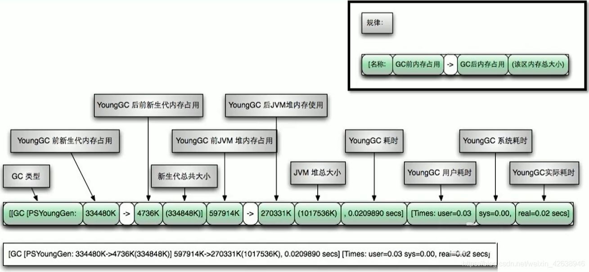
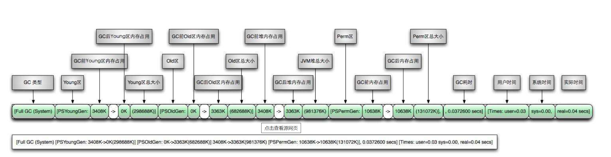

# 分析GC日志

## GC日志参数

`-verbose:gc`：输出gc日志信息，默认输出到标准输出

`-XX:+PrintGC`：等同于`-verbose:gc`表示打开简化的gc日志

**`-XX:+PrintGCDetails`：在发生垃圾回收时打印内存回收详细的日志，并在进程退出时输出当前内存各区域分配情况。**

`**-XX:+PrintGCTimeStamps`：输出GC发生时的时间戳，不可以独立使用，配合`-XX:+PrintGCDetails`使用**

**`-XX:+PrintGCDateStamps`：输出GC发生时的时间戳（以日期的形式），不可以独立使用，配合`-XX:+PrintGCDetails`使用**

`-XX:+PrintHeapAtGC`：每一次GC前和GC后，都打印堆信息

**`-Xloggc:<file>`：把GC日志写入到一个文件中去，而不是打印到标准输出中**


## GC日志格式

### GC分类

针对Hotpot VM的实现，它里面的GC按照回收区域又分为两大种类型：一种是部分收集（PartialGC），一种是整堆收集（FullGC）

- 部分收集：不是完整收集整个Java堆的垃圾收集。其中又分为：
  - 新生代收集（Minor GC/Young GC）：只是新生代（Eden\S0，S1）的垃圾收集
  - 老年代收集（Major GC/Old GC）：只是老年代的垃圾收集。
    - 目前，只有CMS GC会有单独收集老年代的行为。
    - **注意，很多时候Major GC会和Fu11GC混淆使用，需要具体分辨是老年代回收还是整堆回收。**
  - 混合收集（Mixed GC）：收集整个新生代以及部分老年代的垃圾收集。
    - 目前，只有G1 GC会有这种行为

- 整堆收集（Full GC）：收集整个java堆和方法区的垃圾收集。

> 哪些情况会触发Full GC？
>
> 老年代空间不足
>
> 方法区空间不足
>
> 显式调用System.gc（）
>
> Minor GC进入老年代的数据的平均大小大于老年代的可用内存
>
> 大对象直接进入老年代，而老年代的可用空间不足

#### Minor GC

```
[GC (Allocation Failure) [PSYoungGen: 15356K->2536K(17920K)] 15356K->13701K(58880K), 0.0051914 secs] [Times: user=0.00 sys=0.00, real=0.01 secs] 
```



#### Full GC

```
[Full GC (Ergonomics) [PSYoungGen: 2544K->0K(17920K)] [ParOldGen: 26425K->28754K(40960K)] 28969K->28754K(58880K), [Metaspace: 3296K->3296K(1056768K)], 0.0080397 secs] [Times: user=0.03 sys=0.00, real=0.01 secs] 
```



### GC日志结构剖析

#### 垃圾收集器

- 使用Serial收集器在新生代的名字是Default New Generation，因此显示的是"[DefNew”

- 使用ParNew收集器在新生代的名字会变成"[ParNew"，意思是"Parallel New Generation"

- 使用Parallel Scavenge收集器在新生代的名字是"[PSYoungGen"，这里的JDK1.7使用的就是PSYoungGen

- 使用Parallel Old Generation收集器在老年代的名字是"[ParoldGen"

- 使用G1收集器的话，会显示为"garbage-first heap"

Allocation Failure表明本次引起GC的原因是因为在**年轻代中没有足够的空间能够存储新的数据了**。

#### GC前后情况

通过图示，我们可以发现GC日志格式的规律一般都是：GC前内存占用一>GC后内存占用（该区域内存总大小）

```
[PSYoungGen：5986K->696k（8704K）]5986K->704K（9216K）
```

中括号内：GC回收前年轻代堆大小，回收后大小，（年轻代堆总大小）

括号外：GC回收前年轻代和老年代大小，回收后大小，（年轻代和老年代总大小）

#### GC时间

GC日志中有三个时间：user，sys和real

- user-进程执行用户态代码码（核心之外）所使用的时间。**这是执行此进程所使用的实际CPU时间**，其他进程和此进程阻塞的时间并不包括在内。在垃圾收集的情况下，表示GC线程执行所使用的CPU总时间。

- sys-进程在内核态消耗的CPU时间，即**在内核执行系统调用或等待系统事件所使用的CPU时间**

- real-程序从开始到结束所用的时钟时间。这个时间包括其他进程使用的时间片和进程阻塞的时间（比如等待I/0完成）。对于并行gc，这个数字应该接近（用户时间+系统时间）除以垃圾收集器使用的线程数。

由于多核的原因，一般的GC事件中，real time是小于sys+user time的，因为一般是多个线程并发的去做GC，所以real time是要小于sys+user time的。如果real>sys+user的话，则你的应用可能存在下列问题：IO负载非常重或者是CPU不够用。


### Minor GC日志解析

```
2020-11-20T17:19:43.265-0800:0.822:[ GC(ALLOCATION FAILURE)[ PSYOUNGGEN:76800K->8433K(89600K)]76800K->8449K(294400K),0.0088371 SECS] [ TIMES: USER=0.02 SYS=0.01, REAL=0.01 SECS]
```

- 2020-11-20T17:19:43.265-0800：日志打印时间日期格式如2013-05-04T21：53：59.234+0800
- 0.822：gc发生时，Java虚拟机启动以来经过的秒数
- [ GC(ALLOCATION FAILURE)：发生了一次垃圾回收，这是一次MinorGC。它不区分新生代GC还是老年代GC，括号里的内容是gc发生的原因，这里的Allocation Failure的原因是新生代中没有足够区域能够存放需要分配的数据而失败。
- [ PSYoungGen:76800K->8433K(89600K)]：
  - PSYoungGen：表示GC发生的区域，区域名称与使用的GC收集器是密切相关的
  - :76800K->8433K(89600K)：如果是新生代，总容量则会显示整个新生代内存的9/10，即eden+from/to区；如果是老年代，总容量则是全部内存大小，无变化
- 76800K->8449K(294400K)：在显示完区域容量GC的情况之后，会接着显示整个堆内存区域的GC情况：GC前堆内存已使用容量->GC堆内存容量（堆内存总容量）堆内存总容量=9/10新生代+老年代<初始化的内存大小
- 0.0088371 SECS]：整个GC所花费的时间，单位是秒
- [ Times: user=0.02 sys=0.01, real=0.01 secs]：
  - user：指的是CPU工作在用户态所花费的时间
  - sys：指的是CPU工作在内核态所花费的时间
  - real：指的是在此次GC事件中所花费的总时间


### Full GC日志解析

```
2020-11-20T17:19:43.794-0800:1.351:[ FULL GC(METADATA GC THRESHOLD)[ PSYOUNGGEN:10082K->0K(89600K)][ PAROLDGEN:32K->9638K(204800K)]10114K->9638K(294400K),[ METASPACE:20158K->20156K(1067008K)],0.0285388 SECS] [ TIMES: USER=0.11SYS=0.00, REAL=0.03 SECS]
```

- 2020-11-20T17:19:43.265-0800：日志打印时间日期格式如2013-05-04T21：53：59.234+0800
- 1.351：gc发生时，Java虚拟机启动以来经过的秒数
- FULL GC(METADATA GC THRESHOLD）:
  - 发生了一次垃圾回收，这是一次FULL GC。它不区分新生代GC还是老年代GC
  - 括号里的内容是gc发生的原因，这里的Metadata GCThreshold的原因是Metaspace区不够用了。
  - Full GC（Ergonomics）：JVM自适应调整导致的GC；FullGC（System）：调用了Systgm.gc()方法
- [ PSYoungGen:10082K->0K(89600K)]：
  - PSYoungGen：表示GC发生的区域，区域名称与使用的GC收集器是密切相关的；
    - Seria收集器：Default New Generation显示
    - DefNew ParNew收集器：
    - ParNew Parallel Scanvenge收集器：
    - PSYoung老年代和新生代同理，也是和收集器名称相关
  - 10082K->0K（89600K）：GC前该内存区域已使用容量->GC后该区域容量（该区域总容量）
    - 如果是新生代，总容量则会显示整个新生代内存的9/10，即eden+from/to区
    - 如果是老年代，总容量则是全部内存大小，无变化
- [ ParOldGen:32K->9638K(204800K)]：老年代区域没有发生GC，因为本次GC是metaspace引起的
- 10114K->9638K(294400K)：在显示完区域容量GC的情况之后，会接着显示整个堆内存区域的GC情况：GC前堆内存已使用容量->GC堆内存容量（堆内存总容量）堆内存总容量=9/10新生代+老年代<初始化的内存大小
- [ METASPACE:20158K->20156K(1067008K)]：metaspace GC回收2k空间
- 0.0285388 SECS：整个GC所花费的时间，单位是秒
- [ Times: user=0.02 sys=0.01, real=0.01 secs]：
  - user：指的是CPU工作在用户态所花费的时间
  - sys：指的是CPU工作在内核态所花费的时间
  - real：指的是在此次GC事件中所花费的总时间


## GC日志分析工具

### GCeasy

GCeasy——一款超好用的在线分析GC日志的网站

官网地址：https://gceasy.io/，GCeasy是一款在线的GC日志分析器，可以通过GC日志分析进行内存泄漏检测、GC暂停原因分析、JVM配置建议优化等功能，而且是可以免费使用的（有一些服务是收费的）。


### GCViewer

1.下载GCViewer工具
源码下载：https://github.com/chewiebug/GCViewer运行版本下载：https://github.com/chewiebug/GCViewer/wiki/Changelog

2.只需双击gcviewer-1.3x.jar或运行java-jar gcviewer-1.3x.jar（它需要运行java1.8vm），即可启动GCViewer（gui）


### 其他工具

#### GChisto

官网上没有下载的地方，需要自己从SVN上拉下来编译

不过这个工具似乎没怎么维护了，存在不少bug

#### HPjmeter

工具很强大，但只能打开由以下参数生成的GClog，`-verbose:gc-`、`Xloggc:gc.log`。添加其他参数生成的gc.log无法打开

HPjmeter集成了以前的HPjtune功能，可以分析在HP机器上产生的垃圾回收日志文件


