# Kubernetes控制器Controller详解

## 无状态和有状态

### 无状态应用

我们原来使用 deployment，部署的都是无状态的应用，那什么是无状态应用？

- 认为Pod都是一样的
- 没有顺序要求
- 不考虑应用在哪个node上运行
- 能够进行随意伸缩和扩展

### 有状态应用

- 上述的因素都需要考虑到

- 让每个Pod独立的，保持Pod启动顺序和唯一性
- 唯一的网络标识符，持久存储
- 有序，比如mysql中的主从

## 部署有状态应用

无头service？ClusterIP: None

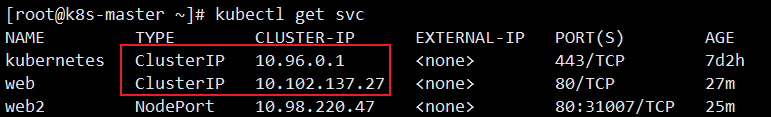

**使用 StatefulSet部署有状态应用**

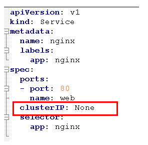

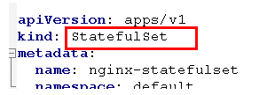

~~~yaml
apiVersion: v1
kind: Service
metadata:
  name: nginx
  labels:
    app: nginx
spec:
  ports:
  - port: 80
    name: web
  clusterIP: None
  selector:
    app: nginx

---

apiVersion: apps/v1
kind: StatefulSet
metadata:
  name: nginx-statefulset
  namespace: default
spec:
  serviceName: nginx
  replicas: 3
  selector:
    matchLabels:
      app: nginx
  template:
    metadata:
      labels:
        app: nginx
    spec:
      containers:
      - name: nginx
        image: nginx:latest
        ports:
        - containerPort: 80
~~~

查看Pod，有三个Pod，每个都有唯一名称

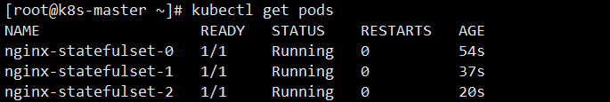

查看service，发现是无头的service

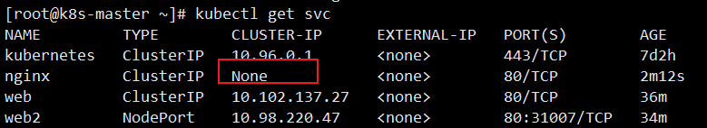

这里有状态的约定，肯定不是简简单单通过名称来进行约定，而是更加复杂的操作

- deployment：是有身份的，有唯一标识
- statefulset：根据主机名 + 按照一定规则生成域名

每个Pod有唯一的主机名，并且有唯一的域名

- 格式：主机名称.service名称.名称空间.svc.cluster.local
- 举例：nginx-statefulset-0.nginx.default.svc.cluster.local

## 部署守护进程DaemonSet

DaemonSet 即后台支撑型服务，主要是用来部署守护进程。

长期伺服型和批处理型的核心在业务应用，可能有些节点运行多个同类业务的Pod，有些节点上又没有这类的Pod运行；而后台支撑型服务的核心关注点在K8S集群中的节点(物理机或虚拟机)，要保证每个节点上都有一个此类Pod运行。节点可能是所有集群节点，也可能是通过 nodeSelector选定的一些特定节点。典型的后台支撑型服务包括：存储、日志和监控等。在每个节点上支撑K8S集群运行的服务。

守护进程在我们每个节点上，运行的是同一个pod，新加入的节点也同样运行在同一个pod里面

ds.yaml，FileBeat镜像，主要是为了做日志采集工作

~~~yaml
apiVersion: apps/v1
kind: DaemonSet
metadata:
  name: ds-test 
  labels:
    app: filebeat
spec:
  selector:
    matchLabels:
      app: filebeat
  template:
    metadata:
      labels:
        app: filebeat
    spec:
      containers:
      - name: logs
        image: nginx
        ports:
        - containerPort: 80
        volumeMounts:
        - name: varlog
          mountPath: /tmp/log
      volumes:
      - name: varlog
        hostPath:
          path: /var/log
~~~

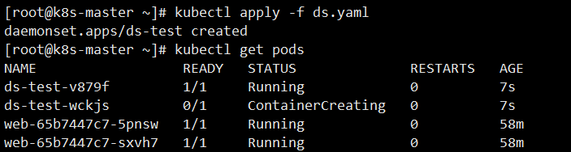

进入某个 Pod里面

```shell
kubectl exec -it ds-test-v879f bash
```

通过该命令后，我们就能看到我们内部收集的日志信息了

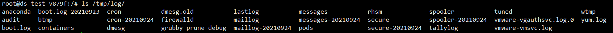

## Job和CronJob

一次性任务 和 定时任务

- 一次性任务：一次性执行完就结束
- 定时任务：周期性执行

### Job

一次性任务，job.yml

~~~yaml
apiVersion: batch/v1
kind: Job
metadata:
  name: pi
spec:
  template:
    spec:
      containers:
      - name: pi
        image: perl
        command: ["perl",  "-Mbignum=bpi", "-wle", "print bpi(2000)"]
      restartPolicy: Never
  backoffLimit: 4
~~~

创建执行

~~~shell
kubectl create -f job.yaml
~~~


使用下面命令，能够看到目前已经存在的Job

```bash
kubectl get jobs
```

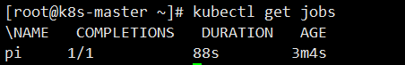

在计算完成后，通过命令查看，能够发现该任务已经完成

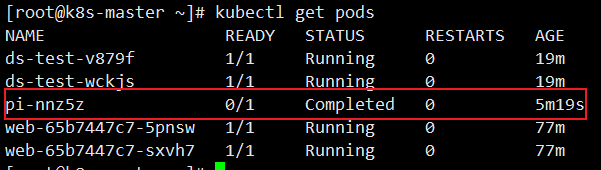

我们可以通过查看日志，查看到一次性任务的结果

~~~shell
kubectl logs pi-nnz5z
~~~

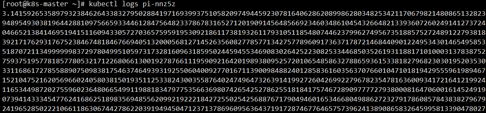

由于一次性任务，最后可以删掉yaml文件

~~~shell
kubectl delete -f job.yaml 
~~~

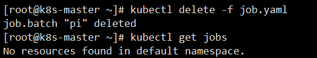

### CronJob

定时任务，cronjob.yaml

~~~yaml
apiVersion: batch/v1beta1
kind: CronJob
metadata:
  name: hello
spec:
  schedule: "*/1 * * * *"
  jobTemplate:
    spec:
      template:
        spec:
          containers:
          - name: hello
            image: busybox
            args:
            - /bin/sh
            - -c
            - date; echo Hello from the Kubernetes cluster
          restartPolicy: OnFailure
~~~

这里面的命令就是每个一段时间，这里是通过 cron 表达式配置的，通过 schedule字段

然后下面命令就是每个一段时间输出

我们首先用上述的配置文件，创建一个定时任务

~~~shell
kubectl apply -f cronjob.yaml
~~~

创建完成后，我们就可以通过下面命令查看定时任务

```shell
kubectl get cronjobs
```

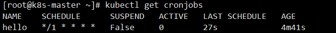

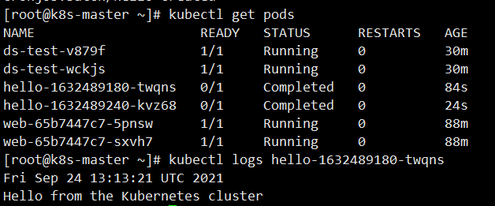