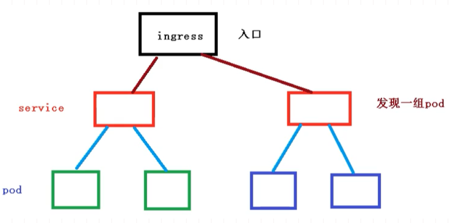
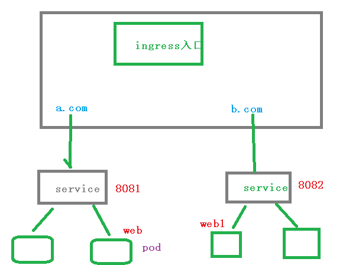
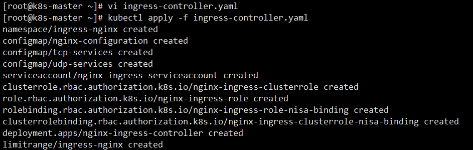
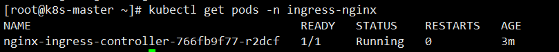
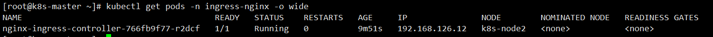
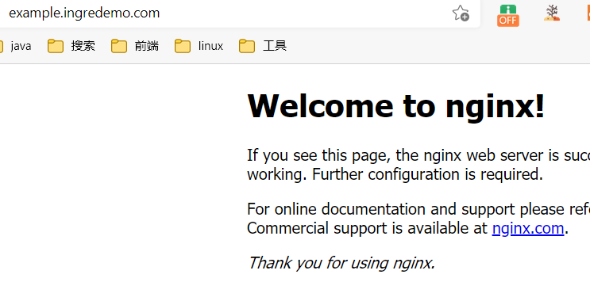

# Kubernetes核心技术Ingress

## 前言

原来我们需要将端口号对外暴露，通过 ip + 端口号就可以进行访问

原来是使用Service中的NodePort来实现

- 在每个节点上都会启动端口
- 在访问的时候通过任何节点，通过ip + 端口号就能实现访问

但是NodePort还存在一些缺陷

- 因为端口不能重复，所以每个端口只能使用一次，一个端口对应一个应用
- 实际访问中都是用域名，根据不同域名跳转到不同端口服务中

## Ingress和Pod关系

pod 和 ingress 是通过service进行关联的，而ingress作为统一入口，由service关联一组pod中



- 首先service就是关联我们的pod
- 然后ingress作为入口，首先需要到service，然后发现一组pod
- 发现pod后，就可以做负载均衡等操作

## Ingress工作流程

在实际的访问中，我们都是需要维护很多域名， a.com 和 b.com

然后不同的域名对应的不同的Service，然后service管理不同的pod



需要注意，ingress不是内置的组件，需要我们单独的安装

## 使用Ingress

步骤如下所示

- 部署ingress Controller【需要下载官方的】
- 创建ingress规则【对哪个Pod、名称空间配置规则】

### 创建Nginx Pod

创建一个nginx应用，然后对外暴露端口

```bash
# 创建pod
kubectl create deployment web --image=nginx
# 查看
kubectl get pods
```

对外暴露端口

```bash
kubectl expose deployment web --port=80 --target-port=80 --type=NodePort
```

### 部署 ingress controller

下面我们来通过yaml的方式，部署我们的ingress，配置文件如下所示:ingress-controller.yaml

~~~yaml
apiVersion: v1
kind: Namespace
metadata:
  name: ingress-nginx
  labels:
    app.kubernetes.io/name: ingress-nginx
    app.kubernetes.io/part-of: ingress-nginx

---

kind: ConfigMap
apiVersion: v1
metadata:
  name: nginx-configuration
  namespace: ingress-nginx
  labels:
    app.kubernetes.io/name: ingress-nginx
    app.kubernetes.io/part-of: ingress-nginx

---
kind: ConfigMap
apiVersion: v1
metadata:
  name: tcp-services
  namespace: ingress-nginx
  labels:
    app.kubernetes.io/name: ingress-nginx
    app.kubernetes.io/part-of: ingress-nginx

---
kind: ConfigMap
apiVersion: v1
metadata:
  name: udp-services
  namespace: ingress-nginx
  labels:
    app.kubernetes.io/name: ingress-nginx
    app.kubernetes.io/part-of: ingress-nginx

---
apiVersion: v1
kind: ServiceAccount
metadata:
  name: nginx-ingress-serviceaccount
  namespace: ingress-nginx
  labels:
    app.kubernetes.io/name: ingress-nginx
    app.kubernetes.io/part-of: ingress-nginx

---
apiVersion: rbac.authorization.k8s.io/v1beta1
kind: ClusterRole
metadata:
  name: nginx-ingress-clusterrole
  labels:
    app.kubernetes.io/name: ingress-nginx
    app.kubernetes.io/part-of: ingress-nginx
rules:
  - apiGroups:
      - ""
    resources:
      - configmaps
      - endpoints
      - nodes
      - pods
      - secrets
    verbs:
      - list
      - watch
  - apiGroups:
      - ""
    resources:
      - nodes
    verbs:
      - get
  - apiGroups:
      - ""
    resources:
      - services
    verbs:
      - get
      - list
      - watch
  - apiGroups:
      - ""
    resources:
      - events
    verbs:
      - create
      - patch
  - apiGroups:
      - "extensions"
      - "networking.k8s.io"
    resources:
      - ingresses
    verbs:
      - get
      - list
      - watch
  - apiGroups:
      - "extensions"
      - "networking.k8s.io"
    resources:
      - ingresses/status
    verbs:
      - update

---
apiVersion: rbac.authorization.k8s.io/v1beta1
kind: Role
metadata:
  name: nginx-ingress-role
  namespace: ingress-nginx
  labels:
    app.kubernetes.io/name: ingress-nginx
    app.kubernetes.io/part-of: ingress-nginx
rules:
  - apiGroups:
      - ""
    resources:
      - configmaps
      - pods
      - secrets
      - namespaces
    verbs:
      - get
  - apiGroups:
      - ""
    resources:
      - configmaps
    resourceNames:
      # Defaults to "<election-id>-<ingress-class>"
      # Here: "<ingress-controller-leader>-<nginx>"
      # This has to be adapted if you change either parameter
      # when launching the nginx-ingress-controller.
      - "ingress-controller-leader-nginx"
    verbs:
      - get
      - update
  - apiGroups:
      - ""
    resources:
      - configmaps
    verbs:
      - create
  - apiGroups:
      - ""
    resources:
      - endpoints
    verbs:
      - get

---
apiVersion: rbac.authorization.k8s.io/v1beta1
kind: RoleBinding
metadata:
  name: nginx-ingress-role-nisa-binding
  namespace: ingress-nginx
  labels:
    app.kubernetes.io/name: ingress-nginx
    app.kubernetes.io/part-of: ingress-nginx
roleRef:
  apiGroup: rbac.authorization.k8s.io
  kind: Role
  name: nginx-ingress-role
subjects:
  - kind: ServiceAccount
    name: nginx-ingress-serviceaccount
    namespace: ingress-nginx

---
apiVersion: rbac.authorization.k8s.io/v1beta1
kind: ClusterRoleBinding
metadata:
  name: nginx-ingress-clusterrole-nisa-binding
  labels:
    app.kubernetes.io/name: ingress-nginx
    app.kubernetes.io/part-of: ingress-nginx
roleRef:
  apiGroup: rbac.authorization.k8s.io
  kind: ClusterRole
  name: nginx-ingress-clusterrole
subjects:
  - kind: ServiceAccount
    name: nginx-ingress-serviceaccount
    namespace: ingress-nginx

---

apiVersion: apps/v1
kind: Deployment
metadata:
  name: nginx-ingress-controller
  namespace: ingress-nginx
  labels:
    app.kubernetes.io/name: ingress-nginx
    app.kubernetes.io/part-of: ingress-nginx
spec:
  replicas: 1
  selector:
    matchLabels:
      app.kubernetes.io/name: ingress-nginx
      app.kubernetes.io/part-of: ingress-nginx
  template:
    metadata:
      labels:
        app.kubernetes.io/name: ingress-nginx
        app.kubernetes.io/part-of: ingress-nginx
      annotations:
        prometheus.io/port: "10254"
        prometheus.io/scrape: "true"
    spec:
      hostNetwork: true
      # wait up to five minutes for the drain of connections
      terminationGracePeriodSeconds: 300
      serviceAccountName: nginx-ingress-serviceaccount
      nodeSelector:
        kubernetes.io/os: linux
      containers:
        - name: nginx-ingress-controller
          image: lizhenliang/nginx-ingress-controller:0.30.0
          args:
            - /nginx-ingress-controller
            - --configmap=$(POD_NAMESPACE)/nginx-configuration
            - --tcp-services-configmap=$(POD_NAMESPACE)/tcp-services
            - --udp-services-configmap=$(POD_NAMESPACE)/udp-services
            - --publish-service=$(POD_NAMESPACE)/ingress-nginx
            - --annotations-prefix=nginx.ingress.kubernetes.io
          securityContext:
            allowPrivilegeEscalation: true
            capabilities:
              drop:
                - ALL
              add:
                - NET_BIND_SERVICE
            # www-data -> 101
            runAsUser: 101
          env:
            - name: POD_NAME
              valueFrom:
                fieldRef:
                  fieldPath: metadata.name
            - name: POD_NAMESPACE
              valueFrom:
                fieldRef:
                  fieldPath: metadata.namespace
          ports:
            - name: http
              containerPort: 80
              protocol: TCP
            - name: https
              containerPort: 443
              protocol: TCP
          livenessProbe:
            failureThreshold: 3
            httpGet:
              path: /healthz
              port: 10254
              scheme: HTTP
            initialDelaySeconds: 10
            periodSeconds: 10
            successThreshold: 1
            timeoutSeconds: 10
          readinessProbe:
            failureThreshold: 3
            httpGet:
              path: /healthz
              port: 10254
              scheme: HTTP
            periodSeconds: 10
            successThreshold: 1
            timeoutSeconds: 10
          lifecycle:
            preStop:
              exec:
                command:
                  - /wait-shutdown

---

apiVersion: v1
kind: LimitRange
metadata:
  name: ingress-nginx
  namespace: ingress-nginx
  labels:
    app.kubernetes.io/name: ingress-nginx
    app.kubernetes.io/part-of: ingress-nginx
spec:
  limits:
  - min:
      memory: 90Mi
      cpu: 100m
    type: Container
~~~

这个文件里面，需要注意的是 hostNetwork: true，改成ture是为了让后面访问到

```bash
kubectl apply -f ingress-controller.yaml
```

通过这种方式，其实我们在外面就能访问，这里还需要在外面添加一层

```bash
kubectl apply -f ingress-controller.yaml
```



最后通过下面命令，查看是否成功部署 ingress

```bash
kubectl get pods -n ingress-nginx
```



### 创建ingress规则文件

创建ingress规则文件，ingress-http.yaml

~~~yaml
apiVersion: networking.k8s.io/v1beta1
kind: Ingress
metadata:
  name: example-ingress
spec:
  rules:
  - host: example.ingredemo.com
    http:
      paths:
      - path: /
        backend:
          serviceName: web
          servicePort: 80
~~~


~~~shell
kubectl get pods -n ingress-nginx -o wide
~~~



### 添加域名访问规则

在windows 的 hosts文件，添加域名访问规则【因为我们没有域名解析，所以只能这样做】

`192.168.126.12 example.ingressdemo.com`

```shell
# 查看ingress
kubectl get ing
```


根据域名访问成功



