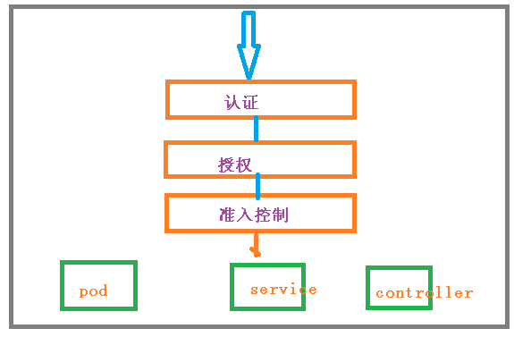
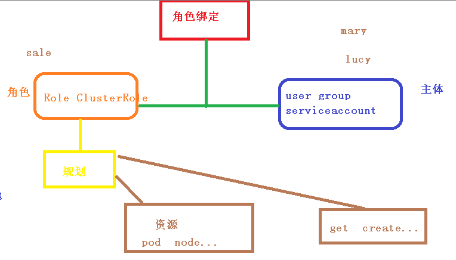
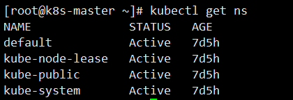
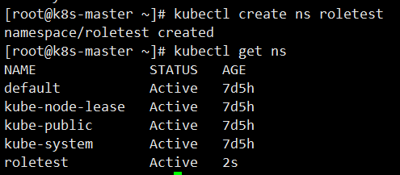
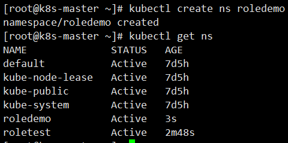
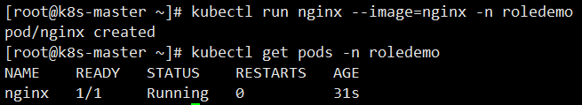
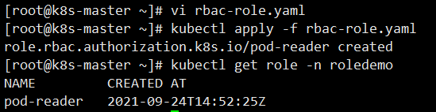
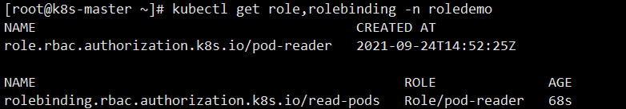

# Kubernetes集群安全机制

## 概述

当我们访问K8S集群时，需要经过三个步骤完成具体操作

- 认证
- 鉴权【授权】
- 准入控制

进行访问的时候，都需要经过 apiserver， apiserver做统一协调，比如门卫

- 访问过程中，需要证书、token、或者用户名和密码
- 如果访问Pod需要serviceAccount



### 认证 传输安全

传输安全：对外不暴露8080端口，只能内部访问，对外使用的端口6443

客户端身份认证常用方式

- https证书认证，基于ca证书
- http token认证，通过token来识别用户
- http基本认证，用户名 + 密码认证

### 鉴权

- 基于RBAC进行鉴权操作

- 基于角色访问控制

### 准入控制

就是准入控制器的列表，如果列表有请求内容就通过，没有的话就拒绝

## RBAC

基于角色的访问控制，为某个角色设置访问内容，然后用户分配该角色后，就拥有该角色的访问权限



k8s中有默认的几个角色

- role：特定命名空间访问权限
- ClusterRole：所有命名空间的访问权限

角色绑定

- roleBinding：角色绑定到主体
- ClusterRoleBinding：集群角色绑定到主体

主体

- user：用户
- group：用户组
- serviceAccount：服务账号

### 创建命名空间

我们可以首先查看已经存在的命名空间

```bash
kubectl get namespace
```



然后我们创建一个自己的命名空间 roletest

```bash
kubectl create ns roletest
```



## RBAC实现鉴权

### 创建命名空间



### 在新的命名空间创建Pod

为什么要创建命名空间？因为如果不创建命名空间的话，默认是在default下

~~~shell
kubectl run nginx --image=nginx -n roledemo
kubectl get pods -n roledemo
~~~



### 创建角色

我们通过 rbac-role.yaml进行创建

~~~yaml
kind: Role
apiVersion: rbac.authorization.k8s.io/v1
metadata:
  namespace: roledemo
  name: pod-reader
rules:
- apiGroups: [""] # "" indicates the core API group
  resources: ["pods"]
  verbs: ["get", "watch", "list"]
~~~

~~~shell
# 创建
kubectl apply -f rbac-role.yaml
# 查看
kubectl get role -n roledemo
~~~



### 创建角色绑定

rbac-rolebinding.yaml

~~~yaml
kind: RoleBinding
apiVersion: rbac.authorization.k8s.io/v1
metadata:
  name: read-pods
  namespace: roledemo
subjects:
- kind: User
  name: mary # Name is case sensitive
  apiGroup: rbac.authorization.k8s.io
roleRef:
  kind: Role #this must be Role or ClusterRole
  name: pod-reader # this must match the name of the Role or ClusterRole you wish to bind to
  apiGroup: rbac.authorization.k8s.io
~~~

然后创建我们的角色绑定

```bash
# 创建角色绑定
kubectl apply -f rbac-rolebinding.yaml
# 查看角色绑定
kubectl get role,rolebinding -n roledemo
```



### 使用证书识别身份

我们首先得有一个 rbac-user.sh 证书脚本

~~~sh
cat > mary-csr.json <<EOF
{
  "CN": "mary",
  "hosts": [],
  "key": {
    "algo": "rsa",
    "size": 2048
  },
  "names": [
    {
      "C": "CN",
      "L": "BeiJing",
      "ST": "BeiJing"
    }
  ]
}
EOF

cfssl gencert -ca=ca.pem -ca-key=ca-key.pem -config=ca-config.json -profile=kubernetes mary-csr.json | cfssljson -bare mary 

kubectl config set-cluster kubernetes \
  --certificate-authority=ca.pem \
  --embed-certs=true \
  --server=https://192.168.126.10:6443 \
  --kubeconfig=mary-kubeconfig
  
kubectl config set-credentials mary \
  --client-key=mary-key.pem \
  --client-certificate=mary.pem \
  --embed-certs=true \
  --kubeconfig=mary-kubeconfig

kubectl config set-context default \
  --cluster=kubernetes \
  --user=mary \
  --kubeconfig=mary-kubeconfig

kubectl config use-context default --kubeconfig=mary-kubeconfig
~~~


这里包含了很多证书文件，在TSL目录下，需要复制过来

通过下面命令执行我们的脚本

```bash
./rbac-user.sh
```

最后我们进行测试

```bash
# 用get命令查看 pod 【有权限】
kubectl get pods -n roledemo
# 用get命令查看svc 【没权限】
kubectl get svc -n roledmeo
```

