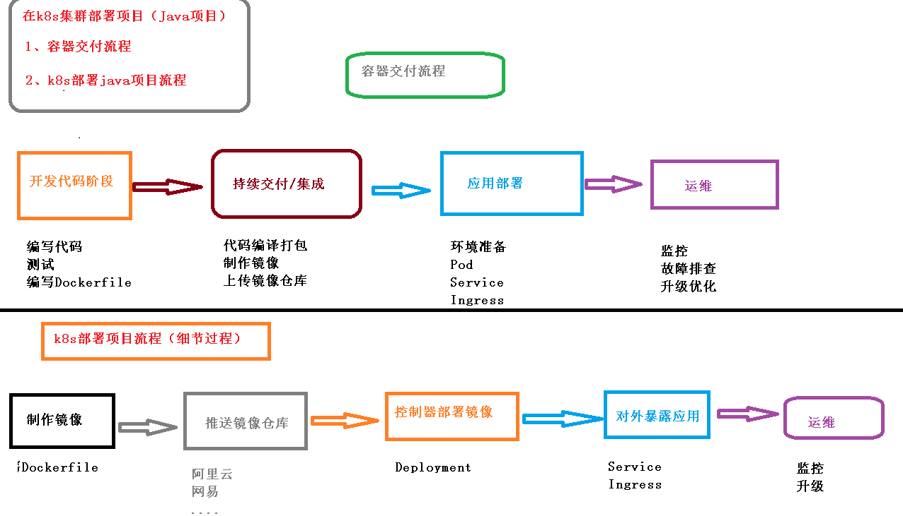
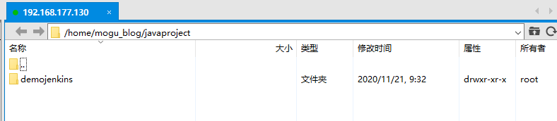
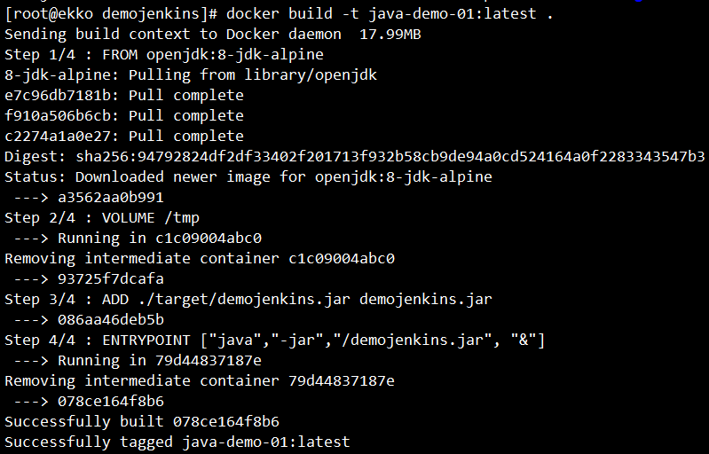
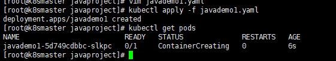
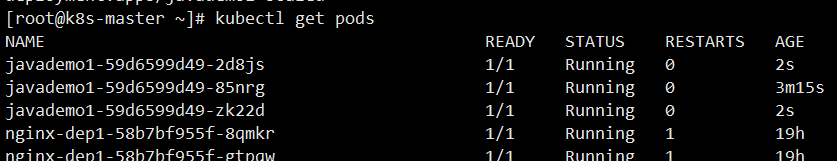
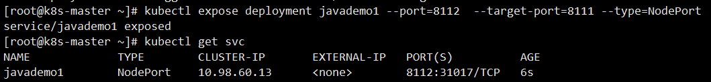

# Kubernetes容器交付介绍

如何在k8s集群中部署Java项目



## 容器交付流程

- 开发代码阶段
  - 编写代码
  - 编写Dockerfile【打镜像做准备】
- 持续交付/集成
  - 代码编译打包
  - 制作镜像
  - 上传镜像仓库
- 应用部署
  - 环境准备
  - Pod
  - Service
  - Ingress
- 运维
  - 监控
  - 故障排查
  - 应用升级

## k8s部署Java项目流程

- 制作镜像【Dockerfile】
- 上传到镜像仓库【Dockerhub、阿里云、网易】
- 控制器部署镜像【Deployment】
- 对外暴露应用【Service、Ingress】
- 运维【监控、升级】

## k8s部署Java项目

### 准备Java项目

第一步，准备java项目，把java进行打包【jar包或者war包】

### 依赖环境

在打包java项目的时候，我们首先需要两个环境

- java环境【JDK】
- maven环境

然后把java项目打包成jar包

```bash
mvn clean packge
```

### 编写Dockerfile文件

Dockerfile 内容如下所示

```bash
FROM openjdk:8-jdk-alpine
VOLUME /tmp
ADD ./target/demojenkins.jar demojenkins.jar
ENTRYPOINT ["java","-jar","/demojenkins.jar", "&"]
```

### 制作镜像

在我们创建好Dockerfile文件后，我们就可以制作镜像了

我们首先将我们的项目，放到我们的服务器上



然后执行下面命令打包镜像

```
docker build -t java-demo-01:latest .
```

等待一段后，即可制作完成我们的镜像



最后通过下面命令，即可查看我们的镜像了

```BASH
docker images;
```

### 启动镜像

在我们制作完成镜像后，我们就可以启动我们的镜像了

```bash
docker run -d -p 8111:8111 java-demo-01:latest -t
```

启动完成后，我们通过浏览器进行访问，即可看到我们的java程序

```
http://192.168.126.128:8111/user
```

### 推送镜像

下面我们需要将我们制作好的镜像，上传到镜像服务器中【阿里云、DockerHub】

首先我们需要到 阿里云 [容器镜像服务](https://cr.console.aliyun.com/cn-hangzhou/instances/repositories)，然后开始创建镜像仓库

### 控制器部署镜像

在我们推送镜像到服务器后，就可以通过控制器部署镜像了

首先我们需要根据刚刚的镜像，导出yaml

```bash
# 导出yaml
kubectl create deployment  javademo1 --image=registry.cn-hangzhou.aliyuncs.com/zzhh-ekko/zzhh-test:1.0.0 --dry-run -o yaml > javademo1.yaml
```

导出后的 javademo1.yaml 如下所示

```yaml
apiVersion: apps/v1
kind: Deployment
metadata:
  creationTimestamp: null
  labels:
    app: javademo1
  name: javademo1
spec:
  replicas: 1
  selector:
    matchLabels:
      app: javademo1
  strategy: {}
  template:
    metadata:
      creationTimestamp: null
      labels:
        app: javademo1
    spec:
      containers:
      - image: registry.cn-hangzhou.aliyuncs.com/zzhh-ekko/zzhh-test:1.0.0
        name: zzhh-test
        resources: {}
status: {}
```

然后通过下面命令，通过yaml创建我们的deployment

```bash
# 创建
kubectl apply -f javademo1.yaml
# 查看 pods
```



或者我们可以进行扩容，多创建几个副本

```bash
kubectl scale deployment javademo1 --replicas=3
```



然后我们还需要对外暴露端口【通过service 或者 Ingress】

```bash
# 对外暴露端口
kubectl expose deployment javademo1 --port=8111  --target-port=8111 --type=NodePort
# 查看对外端口号
kubectl get svc
```



然后通过下面的地址访问

```bash
# 对内访问
curl http://10.98.60.13:8112/user
# 对外访问
http://192.168.126.10:31017/user
```

