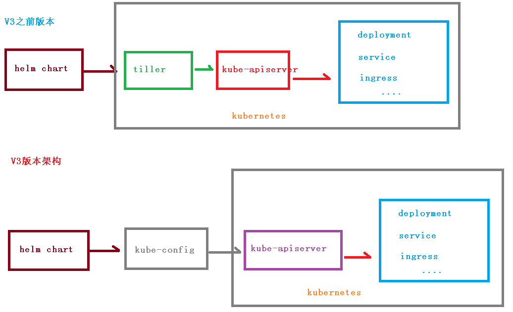

# Kubernetes核心技术Helm

## Helm引入

之前都是基于yaml文件来进行部署发布的，而目前项目大部分微服务化或者模块化，会分成很多个组件来部署，每个组件可能对应一个deployment.yaml,一个service.yaml,一个Ingress.yaml还可能存在各种依赖关系，这样一个项目如果有5个组件，很可能就有15个不同的yaml文件，这些yaml分散存放，如果某天进行项目恢复的话，很难知道部署顺序，依赖关系等，而所有这些包括

- 基于yaml配置的集中存放
- 基于项目的打包
- 组件间的依赖

但是这种方式部署，会有什么问题呢？

- 如果使用之前部署单一应用，少数服务的应用，比较合适
- 但如果部署微服务项目，可能有几十个服务，每个服务都有一套yaml文件，需要维护大量的yaml文件，版本管理特别不方便

## Helm的引入解决问题

- 使用Helm可以把这些YAML文件作为整体管理
- 实现YAML文件高效复用
- 使用helm应用级别的版本管理

## Helm介绍

Helm是一个Kubernetes的包管理工具，就像Linux下的包管理器，如yum/apt等，可以很方便的将之前打包好的yaml文件部署到kubernetes上。

Helm有三个重要概念

- helm：一个命令行客户端工具，主要用于Kubernetes应用chart的创建、打包、发布和管理
- Chart：应用描述，一系列用于描述k8s资源相关文件的集合
- Release：基于Chart的部署实体，一个chart被Helm运行后将会生成对应的release，将在K8S中创建出真实的运行资源对象。也就是应用级别的版本管理
- Repository：用于发布和存储Chart的仓库


## Helm v3变化

2019年11月13日，Helm团队发布了Helm v3的第一个稳定版本

该版本主要变化如下

- V3版本删除Tiller
- relesase可以在不同命名空间重用
- 将chart推送到docker仓库中



## Helm安装

首先我们需要去 [官网下载](https://helm.sh/docs/intro/quickstart/)

- 第一步，[下载helm](https://github.com/helm/helm/releases)安装压缩文件，上传到linux系统中
- 第二步，解压helm压缩文件，把解压后的helm目录复制到 usr/bin 目录中
- 使用命令：helm

我们都知道yum需要配置yum源，那么helm就就要配置helm源

## 配置Helm仓库

添加仓库

```bash
helm repo add 仓库名  仓库地址 
```

例如

```bash
# 配置微软源
helm repo add stable http://mirror.azure.cn/kubernetes/charts
# 配置阿里源
helm repo add aliyun https://kubernetes.oss-cn-hangzhou.aliyuncs.com/charts
# 配置google源
helm repo add google https://kubernetes-charts.storage.googleapis.com/

helm repo add bitnami https://charts.bitnami.com/bitnami
helm repo add aliyuncs https://apphub.aliyuncs.com
# 更新
helm repo update
```

然后可以查看我们添加的仓库地址

```bash
# 查看全部
helm repo list
# 查看某个
helm search repo stable
```


或者可以删除我们添加的源

```bash
helm repo remove stable
```

## Helm基本命令

- chart install
- chart upgrade
- chart rollback

## 使用helm快速部署应用

### 使用命令搜索应用

首先我们使用命令，搜索我们需要安装的应用

```bash
# 搜索 weave仓库
helm search repo weave
```


### 根据搜索内容选择安装

搜索完成后，使用命令进行安装

```bash
helm install ui aliyun/weave-scope
```

可以通过下面命令，来下载yaml文件【如果】

```bash
kubectl apply -f weave-scope.yaml
```

安装完成后，通过下面命令即可查看

```bash
helm list
```


同时可以通过下面命令，查看更新具体的信息

```bash
helm status ui
```

但是我们通过查看 svc状态，发现没有对象暴露端口


所以我们需要修改service的yaml文件，添加NodePort

```bash
kubectl edit svc ui-weave-scope
```


再次查看svc


然后我们通过任意节点IP + 32544 即可访问

## 自己创建Chart

### 使用命令，自己创建Chart

```bash
helm create mychart
```

创建完成后，我们就能看到在当前文件夹下，创建了一个 mychart目录


- templates：编写yaml文件存放到这个目录
- values.yaml：yaml文件可以使用的全局变量
- Chart.yaml：当前chart属性配置信息

### 在templates文件夹创建两个文件

我们创建以下两个

- deployment.yaml
- service.yaml

我们可以通过下面命令创建出yaml文件

~~~shell
# 导出deployment.yaml
kubectl create deployment web1 --image=nginx --dry-run -o yaml > deployment.yaml
# 导出service.yaml 【可能需要创建 deployment，不然会报错】
kubectl expose deployment web1 --port=80 --target-port=80 --type=NodePort --dry-run -o yaml > service.yaml
~~~

### 安装mychart

执行命令创建

```bash
helm install web1 mychart
```


### 应用升级

当我们修改了mychart中的东西后（比如yaml文件），就可以进行升级操作

```bash
helm upgrade web1 mychart
```


## chart模板使用

通过传递参数，动态渲染模板，yaml内容动态从传入参数生成


刚刚我们创建mychart的时候，看到有values.yaml文件，这个文件就是一些全局的变量，然后在templates中能取到变量的值，下面我们可以利用这个，来完成动态模板

- 在values.yaml定义变量和值
- 具体yaml文件，获取定义变量值
- yaml文件中大体有几个地方不同
  - image
  - tag
  - label
  - port
  - replicas

### 定义变量和值

在values.yaml定义变量和值


### 在template中的yaml获取变量和值

通过表达式形式 使用全局变量 `{{.Values.变量名称}}`

例如： `{{.Release.Name}}`


### 安装应用

在我们修改完上述的信息后，就可以尝试的创建应用了

```bash
helm install --dry-run web2 mychart
```

