# Kubernetes配置管理

## Secret

Secret的主要作用就是加密数据，然后存在etcd里面，让Pod容器以挂载Volume方式进行访问

场景：用户名 和 密码进行加密

一般场景的是对某个字符串进行base64编码 进行加密

```shell
echo -n 'admin' | base64
```

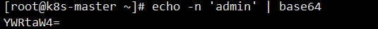

### 创建secret加密数据

secret.yaml

~~~yaml
apiVersion: v1
kind: Secret
metadata:
  name: mysecret
type: Opaque
data:
  username: YWRtaW4=
  password: MWYyZDFlMmU2N2Rm
~~~

然后使用下面命令创建一个pod

```bash
kubectl create -f secret.yaml
```

通过get命令查看

```bash
kubectl get secret
```

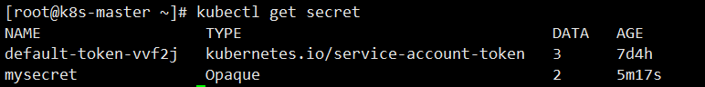

### 以变量形式挂载到Pod容器中

secret-var.yaml

~~~yaml
apiVersion: v1
kind: Pod
metadata:
  name: mypod
spec:
  containers:
  - name: nginx
    image: nginx
    env:
      - name: SECRET_USERNAME
        valueFrom:
          secretKeyRef:
            name: mysecret
            key: username
      - name: SECRET_PASSWORD
        valueFrom:
          secretKeyRef:
            name: mysecret
            key: password
~~~

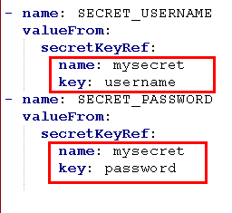

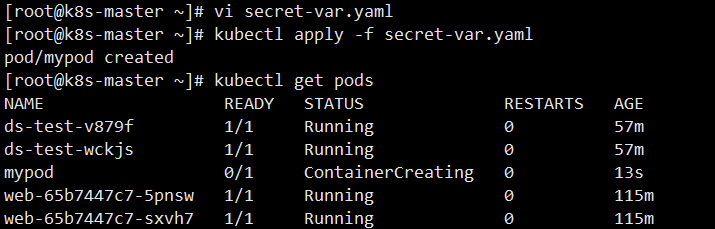

然后我们通过下面的命令，进入到我们的容器内部

```bash
kubectl exec -it mypod -- bash
```

然后我们就可以输出我们的值，这就是以变量的形式挂载到我们的容器中

```bash
# 输出用户
echo $SECRET_USERNAME
# 输出密码
echo $SECRET_PASSWORD
```

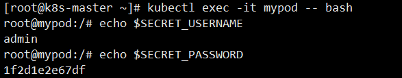

### 以Volume形式挂载到Pod容器中

secret-vol.yaml

~~~yaml
apiVersion: v1
kind: Pod
metadata:
  name: mypod
spec:
  containers:
  - name: nginx
    image: nginx
    volumeMounts:
    - name: foo
      mountPath: "/etc/foo"
      readOnly: true
  volumes:
  - name: foo
    secret:
      secretName: mysecret
~~~

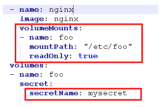

~~~shell
# 根据配置创建容器
kubectl apply -f secret-vol.yaml
# 进入容器
kubectl exec -it mypod bash
# 查看
ls /etc/foo
~~~

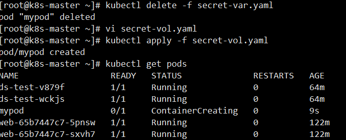

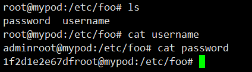

## ConfigMap

ConfigMap作用是存储不加密的数据到etcd中，让Pod以变量或数据卷Volume挂载到容器中

应用场景：配置文件

### 创建配置文件

首先我们需要创建一个配置文件 `redis.properties`

```bash
redis.host=127.0.0.1
redis.port=6379
redis.password=123456
```

### 创建ConfigMap

我们使用命令创建configmap

```bash
kubectl create configmap redis-config --from-file=redis.properties
```

然后查看详细信息

```bash
kubectl describe cm redis-config
```

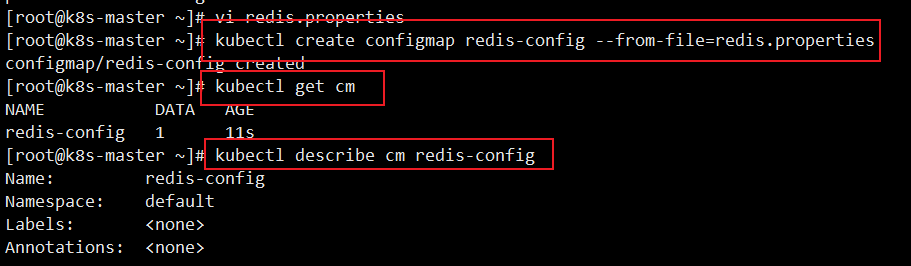

### 以Volume形式挂载到Pod容器中

cm.yaml

~~~yaml
apiVersion: v1
kind: Pod
metadata:
  name: mypod
spec:
  containers:
    - name: busybox
      image: busybox
      command: [ "/bin/sh","-c","cat /etc/config/redis.properties" ]
      volumeMounts:
      - name: config-volume
        mountPath: /etc/config
  volumes:
    - name: config-volume
      configMap:
        name: redis-config
  restartPolicy: Never
~~~

然后使用该yaml创建我们的pod

```bash
# 创建
kubectl apply -f cm.yaml
# 查看
kubectl get pods
```

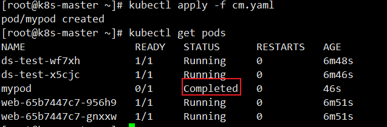

最后我们通过命令就可以查看结果输出了

```bash
kubectl logs mypod
```

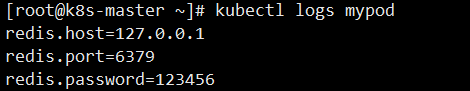

### 以变量形式挂载到Pod容器中

myconfig.yaml，声明变量信息，然后以configmap创建

~~~yaml
apiVersion: v1
kind: ConfigMap
metadata:
  name: myconfig
  namespace: default
data:
  special.level: info
  special.type: hello
~~~

然后我们就可以创建我们的配置文件

```bash
# 创建pod
kubectl apply -f myconfig.yaml
# 获取
kubectl get cm
```

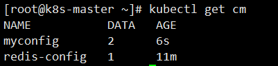

然后我们创建完该pod后，我们就需要在创建一个 config-var.yaml 来使用我们的配置信息

config-var.yaml

~~~yaml
apiVersion: v1
kind: Pod
metadata:
  name: mypod
spec:
  containers:
    - name: busybox
      image: busybox
      command: [ "/bin/sh", "-c", "echo $(LEVEL) $(TYPE)" ]
      env:
        - name: LEVEL
          valueFrom:
            configMapKeyRef:
              name: myconfig
              key: special.level
        - name: TYPE
          valueFrom:
            configMapKeyRef:
              name: myconfig
              key: special.type
  restartPolicy: Never
~~~

最后我们查看输出

```bash
kubectl logs mypod
```

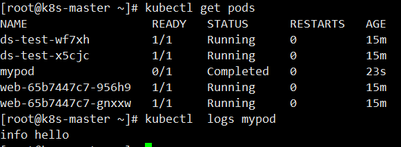