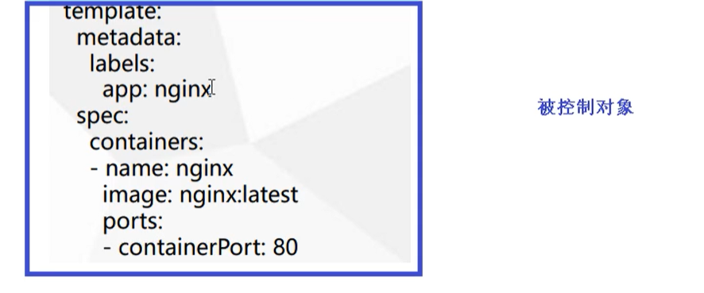
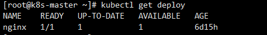
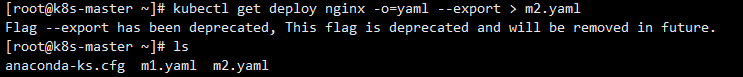
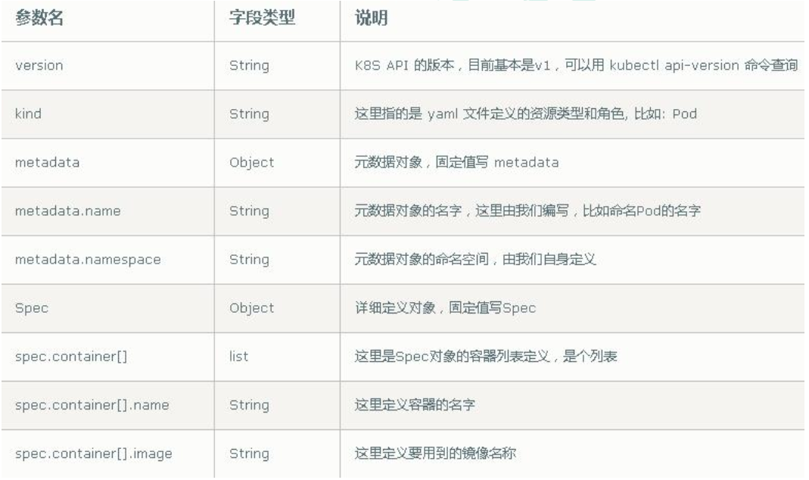
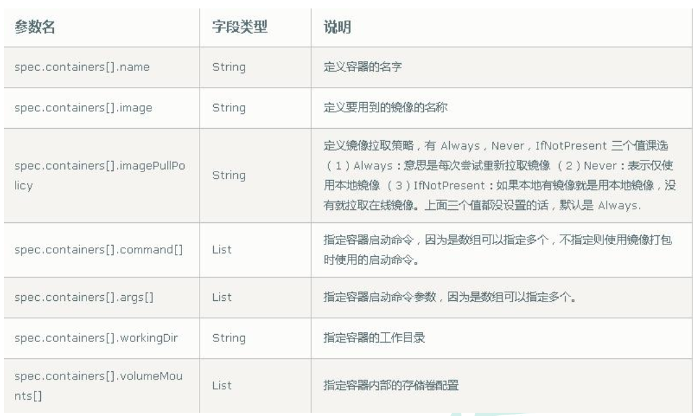
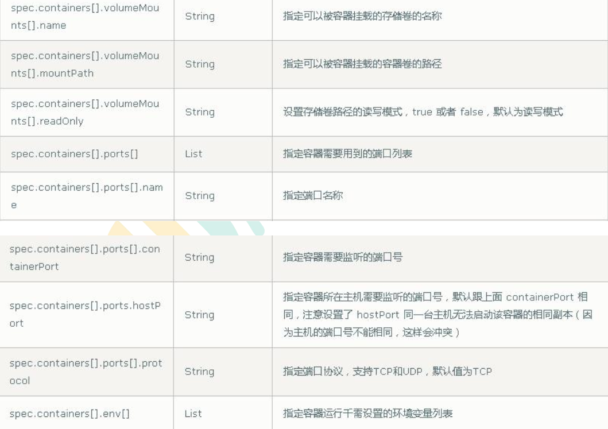
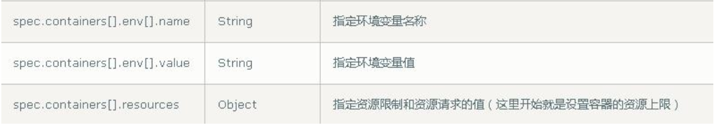
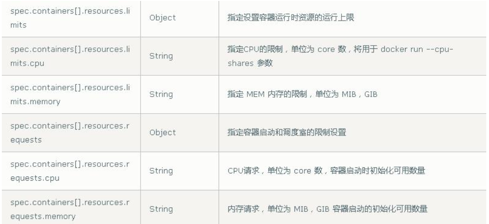
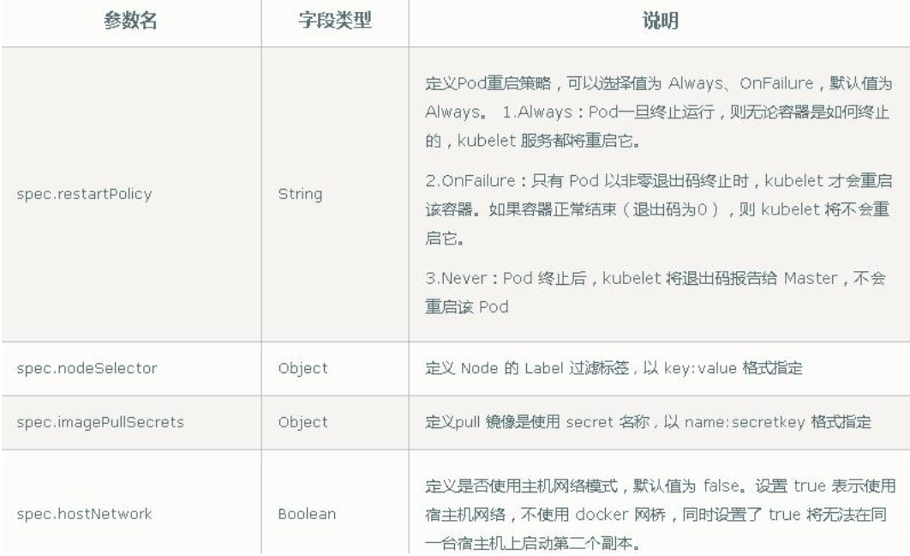

# Kubernetes集群YAML文件详解

## 概述

k8s 集群中对资源管理和资源对象编排部署都可以通过声明样式（YAML）文件来解决，也就是可以把需要对资源对象操作编辑到YAML 格式文件中，我们把这种文件叫做资源清单文件，通过kubectl 命令直接使用资源清单文件就可以实现对大量的资源对象进行编排部署了。一般在我们开发的时候，都是通过配置YAML文件来部署集群的。

> YAML文件：资源清单文件，用于资源编排

## YAML 文件书写格式

### YAML 介绍

YAML ：仍是一种标记语言。为了强调这种语言以数据做为中心，而不是以标记语言为重点。

YAML 是一个可读性高，用来表达数据序列的格式。

### YAML 基本语法 

- 使用空格做为缩进
- 缩进的空格数目不重要，只要相同层级的元素左侧对齐即可
- 低版本缩进时不允许使用Tab 键，只允许使用空格
- 使用#标识注释，从这个字符一直到行尾，都会被解释器忽略
- 使用 --- 表示新的yaml文件开始

## YAML文件组成部分

两部分：控制器的定义和被控制对象

### 控制器的定义


### 被控制对象



### 字段说明

| 属性名称   | 介绍       |
| ---------- | ---------- |
| apiVersion | API版本    |
| kind       | 资源类型   |
| metadata   | 资源元数据 |
| spec       | 资源规格   |
| replicas   | 副本数量   |
| selector   | 标签选择器 |
| template   | Pod模板    |
| metadata   | Pod元数据  |
| spec       | Pod规格    |
| containers | 容器配置   |

## 如何快速编写YAML文件

一般来说，我们很少自己手写YAML文件，因为这里面涉及到了很多内容，我们一般都会借助工具来创建。

### 使用kubectl create命令

一般用于资源没有真正部署的时候，生成一个YAML文件，没有执行

用于资源已经部署的时候，可以下载yaml文件

```shell
# 尝试运行,并不会真正执行
kubectl create deployment web --image=nginx -o yaml --dry-run
```

也可以输出到一个文件

```shell
kubectl create deployment web --image=nginx -o yaml --dry-run > m1.yaml
```

### 使用kubectl get命令导出yaml文件

适用于已经部署好的项目。

查看部署的镜像

```shell
kubectl get deploy
```



导出yaml配置

```shell
kubectl get deploy nginx -o=yaml --export > m2.yaml
```



## 属性说明

### 必须属性



### spec 主要对象









### 额外的参数

