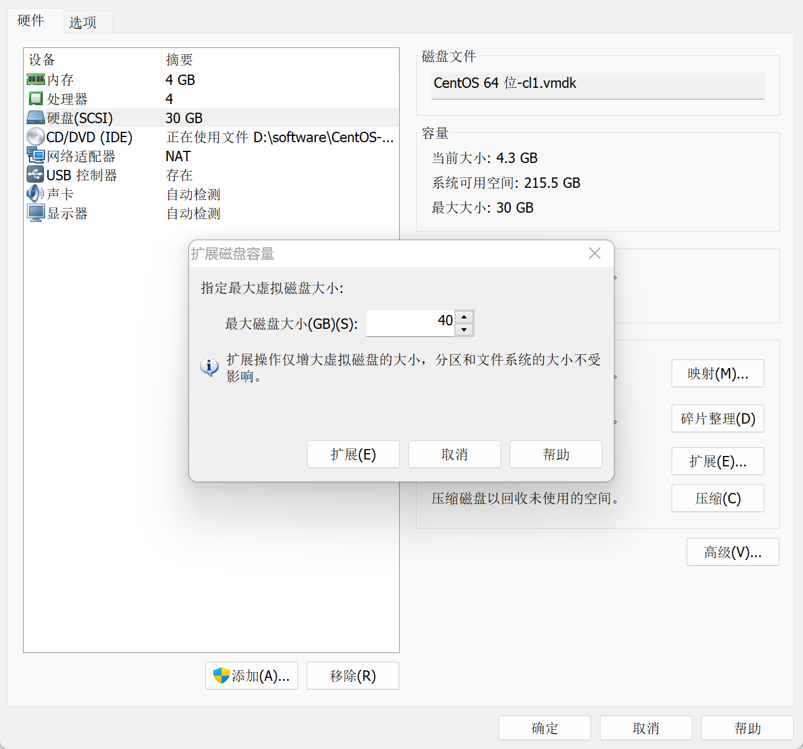
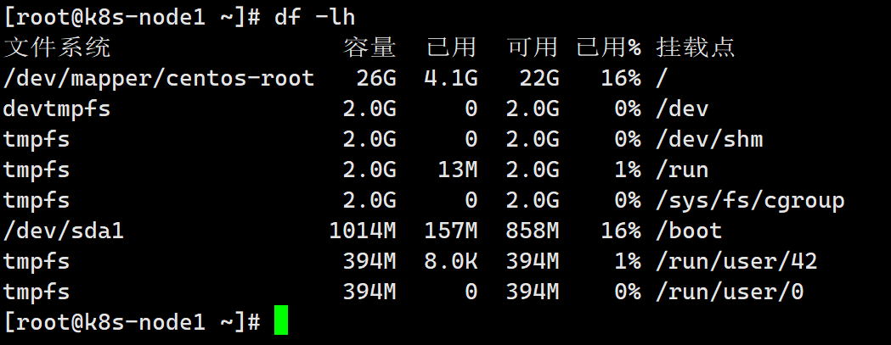
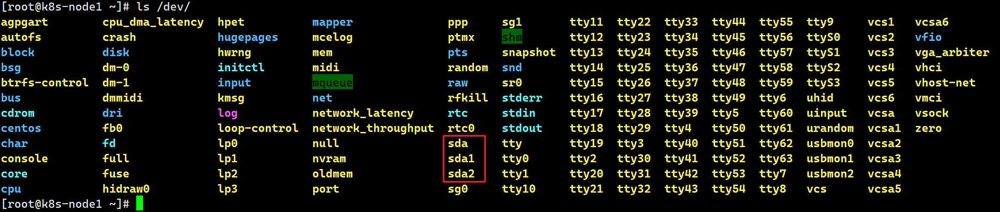
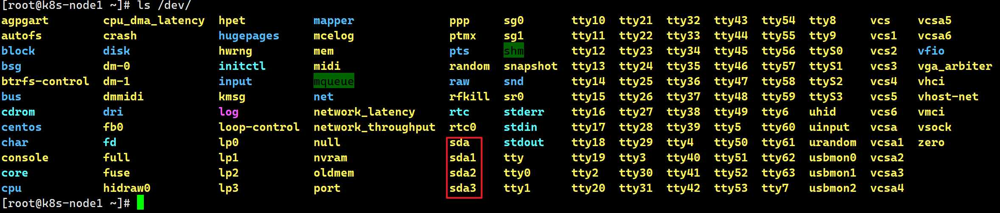
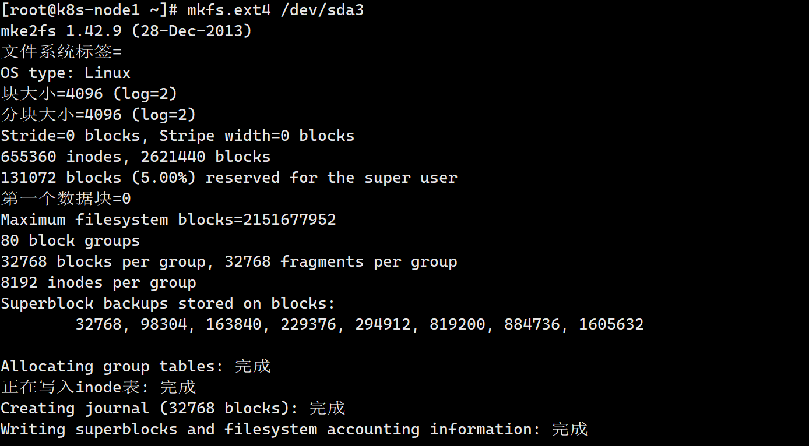
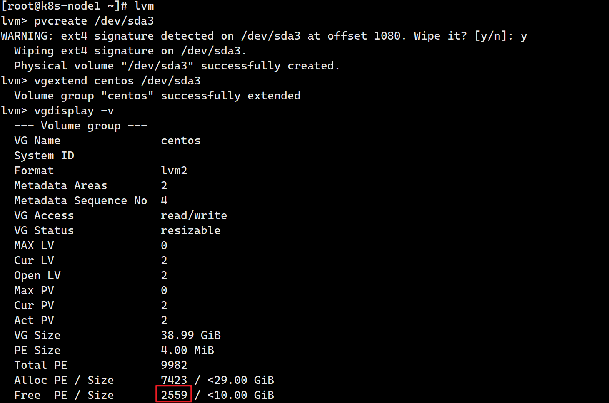
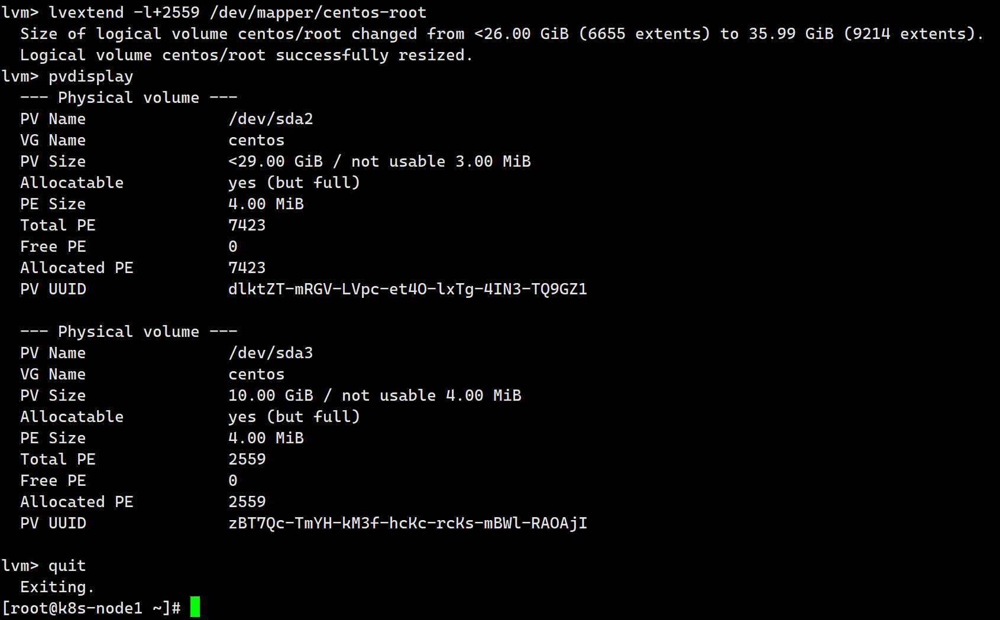
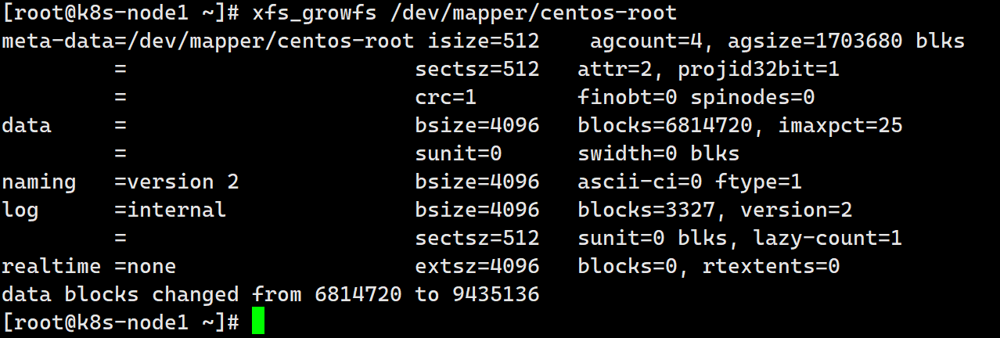
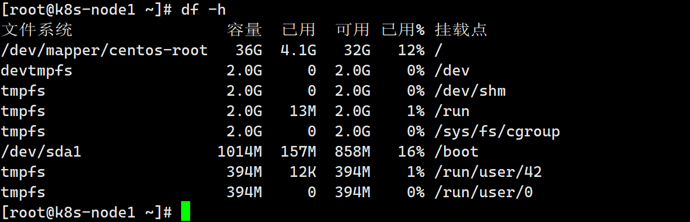

# VMware虚拟机磁盘扩容

## 1、关闭linux，在VMware上进行磁盘扩容



目的：磁盘空间由30G扩展为40G

```sh
df -lh
```



```
ls /dev
```

现在最大的分区为sda2，所以管理磁盘sda后添加的分区应该为sda3



## 2、管理SDA磁盘

输入【fdisk /dev/sda】

命令行提示下输入【m】

输入命令【n】添加新分区。

输入命令【p】创建主分区。

输入【回车】，选择默认大小，这样不浪费空间

输入【回车】，选择默认的start cylinder。

输入【w】，保持修改

接着进行重启，必须进行重启，否则无法格式化分区sda3

```sh
ls /dev
```



```sh
# 对磁盘进行格式化
mkfs.ext4 /dev/sda3
```



## 3、添加新LVM到已有的LVM组，实现卷扩容

```sh
lvm　　　　　　　　　　　　           #进入lvm管理

lvm>pvcreate /dev/sda4　　           #这是初始化刚才的分区4

lvm>vgextend centos /dev/sda4     #将初始化过的分区加入到虚拟卷组centos (卷和卷组的命令可以通过 vgdisplay )

lvm>vgdisplay -v或者vgdisplay查看free PE /Site

lvm>lvextend -l+1279 /dev/mapper/centos-root　　#扩展已有卷的容量（1279 是通过vgdisplay查看free PE /Site的大小）

lvm>pvdisplay #查看卷容量，这时你会看到一个很大的卷了

lvm>quit 　#退出

```





## 4、文件系统的扩容

以上只是做成了卷扩容，接下来做文件系统的真正扩容
**centos7**执行

```sh
xfs_growfs /dev/mapper/centos-root
```

**centos6**执行

```sh
resize2fs /dev/mapper/centos-root
```

`/dev/mapper/centos-root`是执行`df -h`时根目录的挂载点。
然后`df -h`查看磁盘空间





可以看见根目录下的磁盘空间已经扩展为32G了。