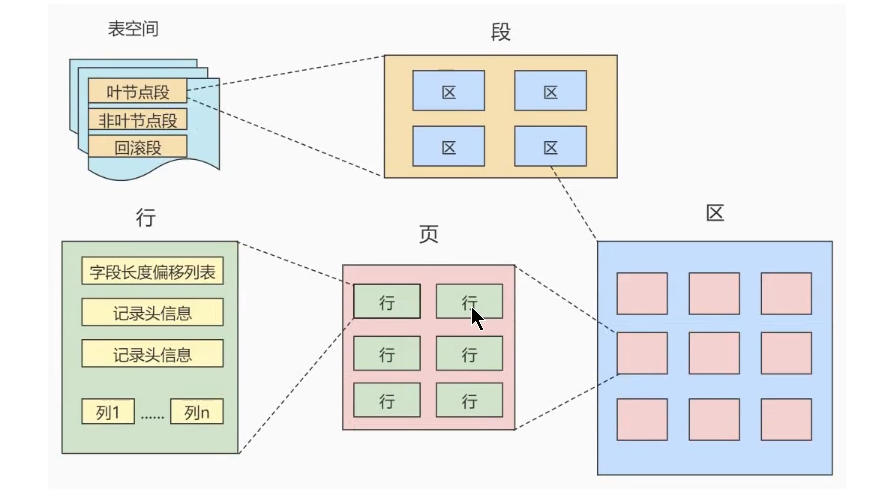
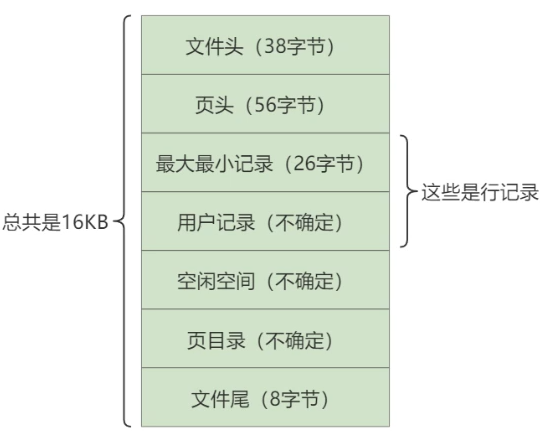
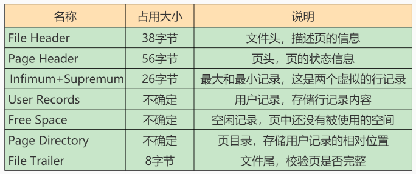
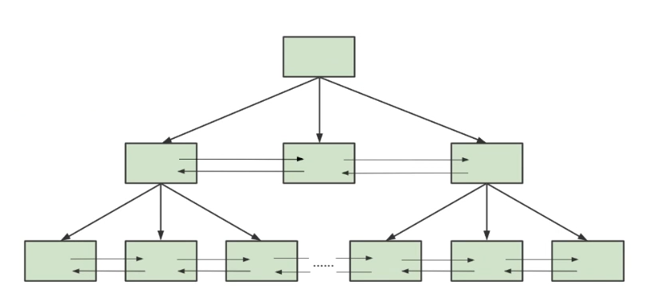
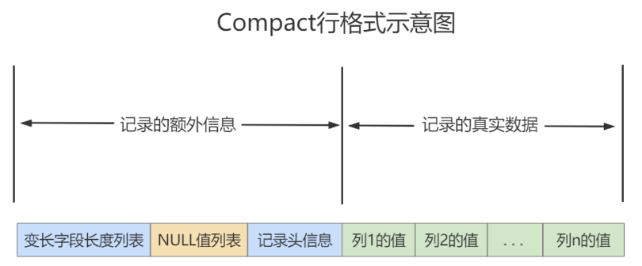
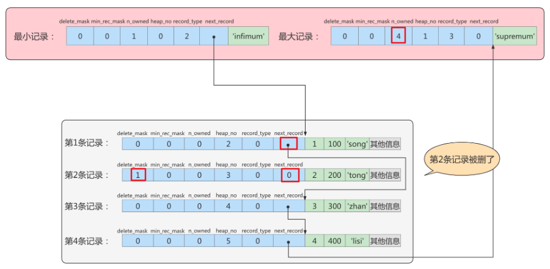
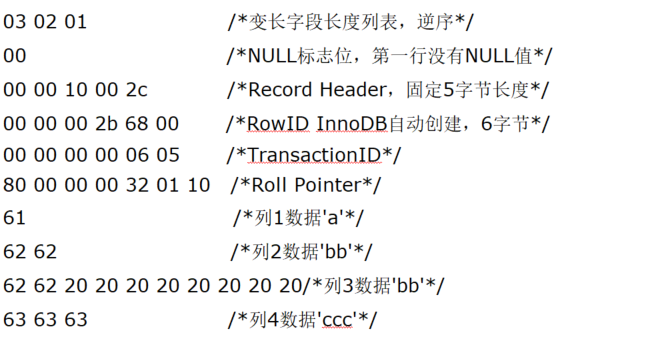
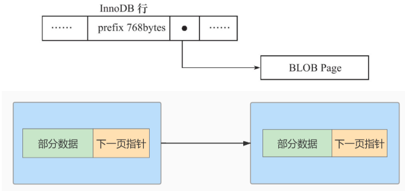
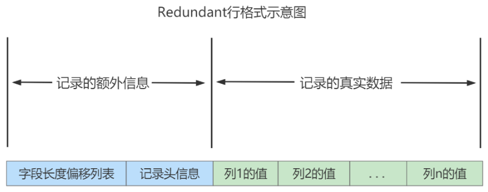
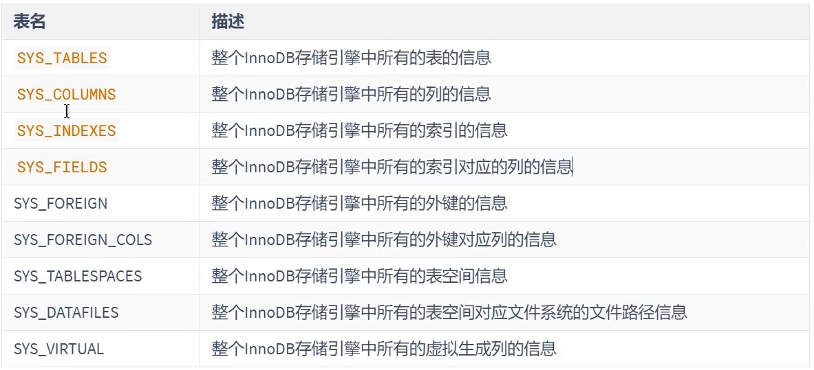

# 第07章_InnoDB数据存储结构

## 1.数据库的存储结构：页

索引结构给我们提供了高效的索引方式，不过索引信息以及数据记录都是保存在文件上的，确切说是存储在页结构中。另一方面，索引是在存储引擎中实现的，MySQL服务器上的`存储引擎`负责对表中数据的读取和写入工作。不同存储引擎中`存放的格式`一般是不同的，甚至有的存储引擎比如Memory都不用磁盘来存储数据。

由于`InnoDB`是MySQL的`默认存储引擎`，所以本章剖析InnoDB存储引擎的数据存储结构。

### 1.1 磁盘与内存交互基本单位：页

InnoDB将数据划分为若干个页，InnoDB中页的大小默认为**16KB**。

以`页`作为磁盘和内存之间交互的`基本单位`，也就是一次最少从磁盘中读取16KB的内容到内存中，一次最少把内存中的16KB内容刷新到磁盘中。也就是说，**在数据库中，不论读一行，还是读多行，都是将这些行所在的页进行加载。也就是说，数据库管理存储空间的基本单位是页（Page），数据库I/0操作的最小单位是页**。一个页中可以存储多个行记录。

> 记录是按照行来存储的，但是数据库的读取并不以行为单位，否则一次读取（也就是一次I/0操作）只能处理一行数据，效率会非常低。


### 1.2 页结构概述

页a、页b、页c.…页n这些页可以`不在物理结构上相连`，只要通过`双向链表`相关联即可。每个数据页中的记录会按照主键值从小到大的顺序组成一个`单向链表`，每个数据页都会为存储在它里边的记录生成一个`页目录`，在通过主键查找某条记录的时候可以在页目录中`使用二分法`快速定位到对应的槽，然后再遍历该槽对应分组中的记录即可快速找到指定的记录。

### 1.3 页的大小

不同的数据库管理系统（简称DBMS）的页大小不同。比如在MySQL的InnoDB存储引擎中，默认页的大小是`16KB`，我们可以通过下面的命令来进行查看：

```mysql
mysq1>show variables like '%innodb_page_size%';
```


SQL Server中页的大小为`8KB`，而在Oracle中我们用术语“`块`”（Block）来代表“页”，Oralce支持的块大小为2KB，4KB，8KB，16KB，32KB和64KB。

### 1.4 页的上层结构

另外在数据库中，还存在着区（Extent）、段（Segment）和表空间（Tablespace）的概念。行、页、区、段、表空间的关系如下图所示：



区（Extent）是比页大一级的存储结构，在InnoDB存储引擎中，一个区会分配`64个连续的页`。因为lnnoDB中的页大小默认是16KB，所以一个区的大小是64*16KB=`1MB`。

段（Segment）由一个或多个区组成，区在文件系统是一个连续分配的空间（在InnoDB中是连续的64个页），不过在段中不要求区与区之间是相邻的。`段是数据库中的分配单位，不同类型的数据库对象以不同的段形式存在`。当我们创建数据表、索引的时候，就会相应创建对应的段，比如创建一张表时会创建一个表段，创建一个索引时会创建一个索引段。

表空间（Tablespace）是一个逻辑容器，表空间存储的对象是段，在一个表空间中可以有一个或多个段，但是一个段只能属于一个表空间。数据库由一个或多个表空间组成，表空间从管理上可以划分为`系统表空间`、用户表空间、`撤销表空间`、`临时表空间`等。

## 2.数据页的内部结构

页如果按类型划分的话，常见的有`数据页（保存B+树节点）`、`系统页`、Undo页和`事务数据页`等。数据页是我们最常使用的页。

数据页的`16KB`大小的存储空间被划分为七个部分，分别是文件头（File Header）、页头（Page Header）、最大最小记录（Infimum+supremum）、用户记录（User Records）、空闲空间（Free Space）、页目录（Page Directory）和文件尾（File Tailer）。

页结构的示意图如下所示：



这7个部分作用分别如下，我们简单梳理如下表所示：



### 第1部分：File Header（文件头部）和 File Trailer（文件尾部）

首先是`文件通用部分`，也就是`文件头`和`文件尾`。

**① File Header（文件头部）（38字节）**

作用：
描述各种页的通用信息。（比如页的编号、其上一页、下一页是谁等）

大小：38字节

构成：


- **FIL_PAGE_OFFSET（4字节）**

  每一个页都有一个单独的页号，就跟你的身份证号码一样，InnoDB通过页号可以**唯一定位**一个页。

- **FIL_PAGE_TYPE（2字节）**

  这个代表当前页的类型。


- **FIL_PAGE_PREV（4字节）和FIL_PAGE_NEXT（4字节）**

  InnoDB都是以页为单位存放数据的，如果数据分散到多个不连续的页中存储的话需要把这些页关联起来，FIL_PAGE_PREV和FIL_PAGE_NEXT就分别代表本页的上一个和下一个页的页号。这样通过建立一个双向链表把许许多多的页就都串联起来了，保证这些页之间**不需要是物理上的连续，而是逻辑上的连续**。


- **FIL_PAGE_SPACE_OR_CHKSUM（4字节）**

  代表当前页面的校验和（checksum）。

  **什么是校验和？**

  就是对于一个很长的字节串来说，我们会通过某种算法来计算一个比较短的值来代表这个很长的字节串，这个比较短的值就称为校验和。
  在比较两个很长的字节串之前，先比较这两个长字节串的校验和，如果校验和都不一样，则两个长字节串肯定是不同的，所以省去了直接比较两个比较长的字节串的时间损耗。


  文件头部和文件尾部都有属性：FIL_PAGE_SPACE_OR_CHKSUM

  **作用：**

  InnoDB存储引擎以页为单位把数据加载到内存中处理，如果该页中的数据在内存中被修改了，那么**在修改后的某个时间需要把数据同步到磁盘中**。但是在同步了一半的时候断电了，造成了该页传输的不完整。

  为了检测一个页是否完整（也就是在同步的时候有没有发生只同步一半的尴尬情况），这时可以通过文件尾的校验和（checksum 值）与文件头的校验和做比对，如果两个值不相等则证明页的传输有问题，需要重新进行传输，否则认为页的传输已经完成。

  **具体的：**

  每当一个页面在内存中修改了，在同步之前就要把它的校验和算出来，因为File Header在页面的前边，所以校验和会被首先同步到磁盘，当完全写完时，校验和也会被写到页的尾部，如果完全同步成功，则页的首部和尾部的校验和应该是一致的。如果写了一半儿断电了，那么在File Header中的校验和就代表着已经修改过的页，而在File Trailer中的校验和代表着原先的页，二者不同则意味着同步中间出了错。这里，校验方式就是采用 Hash 算法进行校验。

- **FIL_PAGE_LSN（8字节）**

  页面被最后修改时对应的日志序列位置（英文名是：Log Sequence Number）

**② File Trailer（文件尾部）（8字节）**

- 前4个字节代表页的校验和：
  这个部分是和File Header中的校验和相对应的。

- 后4个字节代表页面被最后修改时对应的日志序列位置（LSN）：
  这个部分也是为了校验页的完整性的，如果首部和尾部的LSN值校验不成功的话，就说明同步过程出现了问题。

### 第2部分：User Records (用户记录)、最小最大记录、Free Space (空闲空间)

第二个部分是记录部分，页的主要作用是存储记录，所以“最大和最小记录”和“用户记录”部分占了页结构的主要空间。


**① Free Space (空闲空间)**

我们自己存储的记录会按照指定的**行格式**存储到**User Records**部分。但是在一开始生成页的时候，其实并没有User Records这个部分，**每当我们插入一条记录，都会从Free Space部分，也就是尚未使用的存储空间中申请一个记录大小的空间划分到User Records部分**，当Free Space部分的空间全部被User Records部分替代掉之后，也就意味着这个页使用完了，如果还有新的记录插入的话，就需要去**申请新的页**了。


**② User Records (用户记录)**

User Records中的这些记录按照**指定的行格式**一条一条摆在User Records部分，相互之间形成**单链表**。

用户记录里的一条条数据如何记录？
这里需要讲讲记录行格式的[**记录头信息**](https://github.com/ekko1994/doc/blob/master/mysql/%E9%AB%98%E7%BA%A7%E7%AF%87/%E7%AC%AC07%E7%AB%A0_InnoDB%E6%95%B0%E6%8D%AE%E5%AD%98%E5%82%A8%E7%BB%93%E6%9E%84.md#3%E8%AE%B0%E5%BD%95%E5%A4%B4%E4%BF%A1%E6%81%AF5%E5%AD%97%E8%8A%82)。

**③ Infimum + Supremum（最小最大记录）**

**记录可以比较大小吗？**
是的，记录可以比大小，对于一条完整的记录来说，比较记录的大小就是**比较主键**的大小。比方说我们插入的4行记录的主键值分别是：1、2、3、4，这也就意味着这4条记录是从小到大依次递增。

InnoDB规定的最小记录与最大记录这两条记录的构造十分简单，都是由5字节大小的记录头信息和8字节大小的一个固定的部分组成的，如图所示：


这两条记录**不是我们自己定义的记录**，所以它们并不存放在页的User Records部分，他们被单独放在一个称为Infimum + Supremum的部分，如图所示：


### 第3部分：Page Directory（页目录）、Page Header（页面头部）

**Page Directory（页目录）**

为什么需要页目录？
在页中，记录是以**单向链表**的形式进行存储的。单向链表的特点就是插入、删除非常方便，但是**检索效率不高**，最差的情况下需要遍历链表上的所有节点才能完成检索。因此在页结构中专门设计了页目录这个模块，**专门给记录做一个目录**，通过**二分查找法**的方式进行检索，提升效率。

需求：根据主键值查找页中的某条记录，如何实现快速查找呢？

```mysql
SELECT * FROM page_demo WHERE c1 = 3;
```

**方式1：顺序查找**

从Infimum记录（最小记录）开始，沿着链表一直往后找，总有一天会找到（或者找不到），在找的时候还能投机取巧，因为链表中各个记录的值是按照从小到大顺序排列的，所以当链表的某个节点代表的记录的主键值大于你想要查找的主键值时，你就可以停止查找了，因为该节点后边的节点的主键值依次递增。

如果一个页中存储了非常多的记录，这么查找性能很差。

**方式2：使用页目录，二分法查找**

1. 将所有的记录**分成几个组**，这些记录包括最小记录和最大记录，但不包括标记为“已删除”的记录。
2. 第 1 组，也就是最小记录所在的分组只有 1 个记录；
    最后一组，就是最大记录所在的分组，会有 1-8 条记录；
    其余的组记录数量在 4-8 条之间。
这样做的好处是，除了第 1 组（最小记录所在组）以外，其余组的记录数会**尽量平分**。
3. 在每个组中最后一条记录的头信息中会存储该组一共有多少条记录，作为 n_owned 字段。
4. **页目录用来存储每组最后一条记录的地址偏移量**，这些地址偏移量会按照**先后顺序存储**起来，每组的地址偏移量也被称之为**槽（slot**），每个槽相当于指针指向了不同组的最后一个记录。

举例1：


举例2：
现在的page_demo表中正常的记录共有6条，InnoDB会把它们分成两组，第一组中只有一个最小记录，第二组中是剩余的5条记录。如下图：


从这个图中我们需要注意这么几点：

- 现在页目录部分中有两个槽，也就意味着我们的记录被分成了两个组，槽1中的值是112，代表最大记录的地址偏移量（就是从页面的0字节开始数，数112个字节）；槽0中的值是99，代表最小记录的地址偏移量。
- 注意最小和最大记录的头信息中的n_owned属性
  - 最小记录的n_owned值为1，这就代表着以最小记录结尾的这个分组中只有1条记录，也就是最小记录本身。
  - 最大记录的n_owned值为5，这就代表着以最大记录结尾的这个分组中只有5条记录，包括最大记录本身还有我们自己插入的4条记录。

用箭头指向的方式替代数字，这样更易于我们理解，修改后如下：


再换个角度看一下：（单纯从逻辑上看一下这些记录和页目录的关系）


**页目录分组的个数如何确定？**

为什么最小记录的n_owned值为1，而最大记录的n_owned值为5呢？

InnoDB规定：对于最小记录所在的分组只能有1条记录，最大记录所在的分组拥有的记录条数只能在1~8条之间，剩下的分组中记录的条数范围只能在是 4~8 条之间。

分组是按照下边的步骤进行的：

- 初始情况下一个数据页里只有最小记录和最大记录两条记录，它们分属于两个分组。
- 之后每插入一条记录，都会从页目录中找到主键值比本记录的主键值大并且差值最小的槽，然后把该槽对应的记录的n_owned值加1，表示本组内又添加了一条记录，直到该组中的记录数等于8个。
- 在一个组中的记录数等于8个后再插入一条记录时，会将组中的记录拆分成两个组，一个组中4条记录，另一个5条记录。这个过程会在页目录中新增一个槽来记录这个新增分组中最大的那条记录的偏移量。

**页目录结构下如何快速查找记录？**

现在向page_demo表中添加更多的数据。如下：

```mysql
INSERT INTO page_demo 
VALUES
(5, 500, 'zhou'), 
(6, 600, 'chen'), 
(7, 700, 'deng'), 
(8, 800, 'yang'), 
(9, 900, 'wang'), 
(10, 1000, 'zhao'), 
(11, 1100, 'qian'), 
(12, 1200, 'feng'), 
(13, 1300, 'tang'), 
(14, 1400, 'ding'), 
(15, 1500, 'jing'), 
(16, 1600, 'quan');
```

添加了12条记录，现在页里一共有18条记录了（包括最小和最大记录），这些记录被分成了5个组，如图所示：

添加了12条记录，现在页里一共有18条记录了（包括最小和最大记录），这些记录被分成了5个组，如图所示：


这里只保留了16条记录的记录头信息中的n_owned和next_record属性，省略了各个记录之间的箭头。
现在看怎么从这个页目录中查找记录。因为各个槽代表的记录的主键值都是从小到大排序的，所以我们可以使用二分法来进行快速查找。5个槽的编号分别是：0、1、2、3、4，所以初始情况下最低的槽就是low=0，最高的槽就是high=4。比方说我们想**找主键值为6的记录**，过程是这样的：

1. 计算中间槽的位置：(0+4)/2=2，所以查看槽2对应记录的主键值为8，又因为8 > 6，所以设置high=2，low保持不变。
2. 重新计算中间槽的位置：(0+2)/2=1，所以查看槽1对应的主键值为4，又因为4 < 6，所以设置low=1，high保持不变。
3. 因为high - low的值为1，所以确定主键值为6的记录在槽2对应的组中。此刻我们需要找到槽2中主键值最小的那条记录，然后沿着单向链表遍历槽2中的记录。
但是我们前边又说过，每个槽对应的记录都是该组中主键值最大的记录，这里槽2对应的记录是主键值为8的记录，怎么定位一个组中最小的记录呢？别忘了各个槽都是挨着的，我们可以很轻易的拿到槽1对应的记录（主键值为4），该条记录的下一条记录就是槽2中主键值最小的记录，该记录的主键值为5。所以我们可以从这条主键值为5的记录出发，遍历槽2中的各条记录，直到找到主键值为6的那条记录即可。
由于一个组中包含的记录条数只能是1~8条，所以遍历一个组中的记录的代价是很小的。

小结：
在一个数据页中查找指定主键值的记录的过程分为两步：
1. 通过二分法确定该记录所在的槽，并找到该槽所在分组中主键值最小的那条记录。
2. 通过记录的next_record属性遍历该槽所在的组中的各个记录。

**Page Header（页面头部）**

为了能得到一个数据页中存储的记录的状态信息，比如本页中已经存储了多少条记录，第一条记录的地址是什么，页目录中存储了多少个槽等等，特意在页中定义了一个叫Page Header的部分，这个部分占用固定的56个字节，专门存储各种状态信息。


**PAGE_DIRECTION**

假如新插入的一条记录的主键值比上一条记录的主键值大，我们说这条记录的插入方向是右边，反之则是左边。用来表示最后一条记录插入方向的状态就是PAGE_DIRECTION。

**PAGE_N_DIRECTION**

假设连续几次插入新记录的方向都是一致的，InnoDB会把沿着同一个方向插入记录的条数记下来，这个条数就用PAGE_N_DIRECTION这个状态表示。当然，如果最后一条记录的插入方向改变了的话，这个状态的值会被清零重新统计。

### 从数据页的角度看B+树如何查询

一棵B+树按照节点类型可以分成两部分：

1.叶子节点，B+树最底层的节点，节点的高度为0，存储行记录。

2.非叶子节点，节点的高度大于0，存储索引键和页面指针，并不存储行记录本身。



当我们从页结构来理解B+树的结构的时候，可以帮我们理解一些通过索引进行检索的原理：

**1.B+树是如何进行记录检索的？**

如果通过B+树的索引查询行记录，首先是从B+树的根开始，逐层检索，直到找到叶子节点，也就是找到对应的数据页为止，将数据页加载到内存中，页目录中的槽（slot）采用`二分查找`的方式先找到一个粗略的记录分组，然后再在分组中通过`链表遍历`的方式查找记录。

**2.普通索引和唯一索引在查询效率上有什么不同？**

我们创建索引的时候可以是普通索引，也可以是唯一索引，那么这两个索引在查询效率上有什么不同呢？

唯一索引就是在普通索引上增加了约束性，也就是关键字唯一，找到了关键字就停止检索。而普通索引，可能会存在用户记录中的关键字相同的情况，根据页结构的原理，当我们读取一条记录的时候，不是单独将这条记录从磁盘中读出去，而是将这个记录所在的页加载到内存中进行读取。InnoDB存储引擎的页大小为16KB，在一个页中可能存储着上干个记录，因此在普通索引的字段上进行查找也就是在内存中多几次“判断下一条记录”的操作，对于CPU来说，这些操作所消耗的时间是可以忽略不计的。所以对一个索引字段进行检索，采用普通索引还是唯一索引在检索效率上基本上没有差别。

## 3.InnoDB行格式（或记录格式）

我们平时的数据以行为单位来向表中插入数据，这些记录在磁盘上的存放方式也被称为`行格式`或者`记录格式`。InnoDB存储引擎设计了4种不同类型的`行格式`，分别是`Compact`、`Redundant`、`Dynamic`和`Compressed`行格式。

查看MySQL8的默认行格式：

```mysql
mysql> SELECT @@innodb_default_row_format;
+-------------------------------------+
| @@innodb_default_row_format |
+-------------------------------------+
| dynamic                                   |
+-------------------------------------+
1 row in set (0.00 sec)
```

也可以使用如下语法查看具体表使用的行格式：

```mysql
SHOW TABLE STATUS like '表名'\G
```

 

### 3.1 指定行格式的语法

在创建或修改表的语句中指定行格式：

```mysql
CREATE TABLE 表名 (列的信息) ROW_FORMAT=行格式名称

ALTER TABLE 表名 ROW_FORMAT=行格式名称
```

举例：

```mysql
mysql> CREATE TABLE record_test_table (
    ->     col1 VARCHAR(8),
    ->     col2 VARCHAR(8) NOT NULL,
    ->     col3 CHAR(8),
    ->     col4 VARCHAR(8)
    -> ) CHARSET=ascii ROW_FORMAT=COMPACT;
Query OK, 0 rows affected (0.03 sec)
```

向表中插入两条记录：

```mysql
INSERT INTO record_test_table(col1, col2, col3, col4) 
VALUES
('zhangsan', 'lisi', 'wangwu', 'songhk'), 
('tong', 'chen', NULL, NULL);
```


### 3.2 COMPACT行格式

在MySQL 5.1版本中，默认设置为Compact行格式。一条完整的记录其实可以被分为记录的额外信息和记录的真实数据两大部分。



#### 1.变长字段长度列表

MySQL支持一些变长的数据类型，比如VARCHAR(M)、VARBINARY(M)、TEXT类型，BLOB类型，这些数据类型修饰列称为**变长字段**，变长字段中存储多少字节的数据不是固定的，所以我们在存储真实数据的时候需要顺便把这些数据占用的字节数也存起来。**在Compact行格式中，把所有变长字段的真实数据占用的字节长度都存放在记录的开头部位，从而形成一个变长字段长度列表**。

注意：这里面存储的变长长度和字段**顺序是反过来的**。比如两个varchar字段在表结构的顺序是a(10)，b(15)。那么在变长字段长度列表中存储的长度顺序就是15，10，是反过来的。

以record_test_table表中的第一条记录举例：因为record_test_table表的col1、col2、col4列都是VARCHAR(8)类型的，所以这三个列的值的长度都需要保存在记录开头处，注意record_test_table表中的各个列都使用的是ascii字符集（每个字符只需要1个字节来进行编码）。


又因为这些长度值需要按照列的逆序存放，所以最后变长字段长度列表的字节串用十六进制表示的效果就是（各个字节之间实际上没有空格，用空格隔开只是方便理解）：06 04 08 

把这个字节串组成的变长字段长度列表填入上边的示意图中的效果就是：


#### 2.NULL值列表

Compact行格式会把可以为NULL的列统一管理起来，存在一个标记为NULL值列表中。如果表中没有允许存储 NULL 的列，则 NULL值列表也不存在了。

**为什么定义NULL值列表？**

之所以要存储NULL是因为数据都是需要对齐的，如果**没有标注出来NULL值**的位置，就有可能在查询数据的时候**出现混乱**。如果使**用一个特定的符号**放到相应的数据位表示空置的话，虽然能达到效果，但是这样很**浪费空间**，所以直接就在行数据得头部开辟出一块空间专门用来记录该行数据哪些是非空数据，哪些是空数据，格式如下：

1. 二进制位的值为1时，代表该列的值为NULL。
2. 二进制位的值为0时，代表该列的值不为NULL。

例如：字段 a、b、c，其中a是主键，在某一行中存储的数依次是 a=1、b=null、c=2。那么Compact行格式中的NULL值列表中存储：01。第一个0表示c不为null，第二个1表示b是null。这里之所以没有a是因为数据库会自动跳过主键，因为主键肯定是非NULL且唯一的，在NULL值列表的数据中就会自动跳过主键。

record_test_table的两条记录的NULL值列表就如下：

第一条记录：

****

第二条记录：


#### 3.记录头信息（5字节）

```mysql
mysql> CREATE TABLE page_demo(
    ->     c1 INT,
    ->     c2 INT,
    ->     c3 VARCHAR(10000),
    ->     PRIMARY KEY (c1)
    -> ) CHARSET=ascii ROW_FORMAT=Compact;
Query OK, 0 rows affected (0.03 sec)
```

这个表中记录的行格式示意图：


这些记录头信息中各个属性如下：


简化后的行格式示意图：


插入数据：

```mysql
INSERT INTO page_demo 
VALUES
(1, 100, 'song'), 
(2, 200, 'tong'), 
(3, 300, 'zhan'), 
(4, 400, 'lisi');
```

图示如下：


- **delete_mask**

  这个属性标记着当前记录是否被删除，占用1个二进制位。

  - 值为0：代表记录并没有被删除
  - 值为1：代表记录被删除掉了

  **被删除的记录为什么还在页中存储呢？**

  你以为它删除了，可它还在真实的磁盘上。这些被删除的记录之所以不立即从磁盘上移除，是因为移除它们之后其他的记录在磁盘上需要**重新排列，导致性能消耗**。所以只是打一个删除标记而已，所有被删除掉的记录都会组成一个所谓的**垃圾链表**，在这个链表中的记录占用的空间称之为**可重用空间**，之后如果有新记录插入到表中的话，可能把这些被删除的记录占用的存储空间覆盖掉。

- **min_rec_mask**

  B+树的每层非叶子节点中的最小记录都会添加该标记，min_rec_mask值为1。

  我们自己插入的四条记录的min_rec_mask值都是0，意味着它们都不是B+树的非叶子节点中的最小记录。

- **record_type**

  这个属性表示当前记录的类型，一共有4种类型的记录：
     0：表示普通记录
     1：表示B+树非叶节点记录
     2：表示最小记录
     3：表示最大记录

  从图中我们也可以看出来，我们自己插入的记录就是普通记录，它们的record_type值都是0，而最小记录和最大记录的record_type值分别为2和3。至于record_type为1的情况，我们在索引的数据结构章节讲过。

- **heap_no**

  这个属性表示当前记录在本页中的位置。

  从图中可以看出来，我们插入的4条记录在本页中的位置分别是：2、3、4、5。

  **怎么不见heap_no值为0和1的记录呢？**

  MySQL会自动给每个页里加了两个记录，由于这两个记录并不是我们自己插入的，所以有时候也称为**伪记录**或者**虚拟记录**。这两个伪记录一个代表**最小记录**，一个代表**最大记录**。最小记录和最大记录的heap_no值分别是0和1，也就是说它们的位置最靠前。

- **n_owned**

  页目录中每个组中最后一条记录的头信息中会存储该组一共有多少条记录，作为 n_owned 字段。

  详情见page directory。

- **next_record**

  记录头信息里该属性非常重要，它表示从当前记录的真实数据到下一条记录的真实数据的**地址偏移量**。

  比如：第一条记录的next_record值为32，意味着从第一条记录的真实数据的地址处向后找32个字节便是下一条记录的真实数据。

  注意，下一条记录指得并不是按照我们插入顺序的下一条记录，而是按照主键值由小到大的顺序的下一条记录。而且规定Infimum记录（也就是最小记录）的下一条记录就是本页中主键值最小的用户记录，而本页中主键值最大的用户记录的下一条记录就是 Supremum记录（也就是最大记录）。下图用箭头代替偏移量表示next_record。


**演示：删除操作**

删除操作：
从表中删除掉一条记录，这个链表也是会跟着变化：

```mysql
mysql> DELETE FROM page_demo WHERE c1 = 2;
Query OK, 1 row affected (0.02 sec)
```

删掉第2条记录后的示意图就是：



从图中可以看出来，删除第2条记录前后主要发生了这些变化：
- 第2条记录并没有从存储空间中移除，而是把该条记录的delete_mask值设置为1。
- 第2条记录的next_record值变为了0，意味着该记录没有下一条记录了。
- 第1条记录的next_record指向了第3条记录。
- 最大记录的n_owned值从 5 变成了 4 。

**所以，不论我们怎么对页中的记录做增删改操作，InnoDB始终会维护一条记录的单链表，链表中的各个节点是按照主键值由小到大的顺序连接起来的。**

***

**演示：添加操作**

添加操作：
主键值为2的记录被我们删掉了，但是存储空间却没有回收，如果我们再次把这条记录插入到表中，会发生什么事呢？

```mysql
mysql> INSERT INTO page_demo VALUES(2, 200, 'tong');
Query OK, 1 row affected (0.00 sec)
```

我们看一下记录的存储情况：


直接复用了原来被删除记录的存储空间。

说明：
当数据页中存在多条被删除掉的记录时，这些记录的next_record属性将会把这些被删除掉的记录组成一个垃圾链表，以备之后重用这部分存储空间。

#### 4.记录的真实数据

记录的真实数据除了我们自己定义的列的数据以外，还会有三个隐藏列：


实际上这几个列的真正名称其实是：DB_ROW_ID、DB_TRX_ID、DB_ROLL_PTR。

- 一个表没有手动定义主键，则会选取一个Unique键作为主键，如果连Unique键都没有定义的话，则会为表默认添加一个名为row_id的隐藏列作为主键。所以row_id是在没有自定义主键以及Unique键的情况下才会存在的。
- 事务ID和回滚指针在后面的《第14章_MySQL事务日志》章节中讲解。

举例：分析Compact行记录的内部结构：

```mysql
CREATE TABLE mytest(
col1 VARCHAR(10),
col2 VARCHAR(10),
col3 CHAR(10),
col4 VARCHAR(10)
)ENGINE=INNODB CHARSET=LATIN1 ROW_FORMAT=COMPACT;


INSERT INTO mytest
VALUES('a','bb','bb','ccc');

INSERT INTO mytest
VALUES('d','ee','ee','fff');

INSERT INTO mytest
VALUES('d',NULL,NULL,'fff');
```

在Windows操作系统下，可以选择通过程序UltraEdit打开表空间文件mytest.ibd这个二进制文件。内容如下：


该行记录从0000c078开始，若整理一下，相信大家会有更好的理解：



注意1：InnoDB每行有隐藏列TransactionID和Roll Pointer。:
注意2：固定长度CHAR字段在未能完全占用其长度空间时，会用0x20来进行填充。

接着再来分析下Record Header的最后两个字节，这两个字节代表next_recorder，0x2c代表下一个记录的偏移量，即当前记录的位置加上偏移量0x2c就是下条记录的起始位置。

第二行将不做整理，除了RowID不同外，它和第一行大同小异，现在来分析有NULL值的第三行：


第三行有NULL值，因此NULL标志位不再是00而是06，转换成二进制为00000110，为1的值代表第2列和第3列的数据为NULL。在其后存储列数据的部分，用户会发现没有存储NULL列，而只存储了第1列和第4列非NULL的值。

因此这个例子很好地说明了：不管是CHAR类型还是VARCHAR类型，在compact格式下NULL值都不占用任何存储空间。


### 3.3 Dynamic和Compressed行格式

#### 1. 行溢出

**InnoDB存储引擎可以将一条记录中的某些数据存储在真正的数据页面之外。**

很多DBA喜欢MySQL数据库提供的VARCHAR(M)类型，认为可以存放65535字节。这是真的吗？如果我们使用 ascii字符集的话，一个字符就代表一个字节，我们看看VARCHAR(65535)是否可用。

```mysql
CREATE  TABLE  varchar_size_demo(
 c  VARCHAR(65535)
 )  CHARSET=ascii  ROW_FORMAT=Compact;
结果如下：
ERROR 1118 (42000): Row size too large. The maximum row size for the used table type, not counting BLOBs, is 65535. This includes storage overhead, check the manual. You have  to  change  some  columns  to  TEXT or  BLOBs
```

报错信息表达的意思是：MySQL对一条记录占用的最大存储空间是有限制的，除BLOB或者TEXT类型的列之外， 其他所有的列（不包括隐藏列和记录头信息）占用的字节长度加起来不能超过65535个字节。

这个65535个字节除了列本身的数据之外，还包括一些其他的数据，以Compact行格式为例，比如说我们为了存储一个VARCHAR(M)类型的列，除了真实数据占有空间以外，还需要记录的额外信息。

如果该VARCHAR类型的列没有NOT NULL属性，那最多只能存储65532个字节的数据，因为变长字段的长度占用 2个字节，NULL值标识需要占用1个字节。

```mysql
CREATE  TABLE  varchar_size_demo(
    c  VARCHAR(65532)
)  CHARSET=ascii  ROW_FORMAT=Compact;


#如果有not null属性，那么就不需要NULL值标识，也就可以多存储一个字节，即65533个字节
CREATE  TABLE  varchar_size_demo( 
  c  VARCHAR(65533)  not  null
)  CHARSET=ascii  ROW_FORMAT=Compact; 
```

通过上面的案例，我们可以知道一个页的大小一般是16KB，也就是16384字节，而一个VARCHAR(M)类型的列就最多可以存储65533个字节，这样就可能出现一个页存放不了一条记录，这种现象称为**行溢出**。 

在`Compact`和`Reduntant`行格式中，对于占用存储空间非常大的列，在记录的真实数据处只会存储该列的一部分数据，把剩余的数据分散存储在几个其他的页中进行**分页存储**，然后记录的真实数据处用20个字节存储指向这些页的地址（当然这20个字节中还包括这些分散在其他页面中的数据的占用的字节数），从而可以找到剩余数据所在的页。

这称为页的扩展，举例如下：



#### 2. Dynamic和Compressed行格式

在MySQL 8.0中，默认行格式就是Dynamic，Dynamic、Compressed行格式和Compact行格式挺像，只不过在处理行溢出数据时有分歧：

- Compressed和Dynamic两种记录格式对于存放在BLOB中的数据采用了完全的行溢出的方式。如图，在数据页中只存放20个字节的指针（溢出页的地址），实际的数据都存放在Off Page（溢出页）中。
- Compact和Redundant两种格式会在记录的真实数据处存储一部分数据（存放768个前缀字节）。

Compressed行记录格式的另一个功能就是，存储在其中的行数据会以zlib的算法进行压缩，因此对于BLOB、TEXT、VARCHAR这类大长度类型的数据能够进行非常有效的存储。


### 3.4 Redundant行格式

Redundant是MySQL 5.0版本之前InnoDB的行记录存储方式，MySQL 5.0支持Redundant是为了兼容之前版本的页格式。

现在我们把表record_test_table的行格式修改为Redundant：

```mysql
ALTER TABLE record_test_table ROW_FORMAT=Redundant;
Query OK, 0 rows affected (0.05 sec)
Records: 0  Duplicates: 0  Warnings: 0
```




从上图可以看到，不同于Compact行记录格式，Redundant行格式的首部是一个字段长度偏移列表，同样是按照列的顺序**逆序放置**的。

下边我们从各个方面看一下Redundant行格式有什么不同的地方。

#### 1. 字段长度偏移列表

注意Compact行格式的开头是变长字段长度列表，而Redundant行格式的开头是字段长度偏移列表，与变长字段长度列表有两处不同：

- 少了“变长”两个字：Redundant行格式会把该条记录中所有列（包括隐藏列）的长度信息都按照逆序存储到字段长度偏移列表。
- 多了“偏移”两个字：这意味着计算列值长度的方式不像Compact行格式那么直观，它是采用两个相邻数值的差值来计算各个列值的长度。

举例：比如第一条记录的字段长度偏移列表就是：
2B 25 1F 1B 13 0C 06

因为它是逆序排放的，所以按照列的顺序排列就是：
06 0C 13 17 1A 24 25
按照两个相邻数值的差值来计算各个列值的长度的意思就是：

第一列(row_id)的长度就是 0x06个字节，也就是6个字节。
第二列(transaction_id)的长度就是 (0x0C - 0x06)个字节，也就是6个字节。
第三列(roll_pointer)的长度就是 (0x13 - 0x0C)个字节，也就是7个字节。
第四列(col1)的长度就是 (0x1B - 0x13)个字节，也就是8个字节。
第五列(col2)的长度就是 (0x1F - 0x1B)个字节，也就是4个字节。
第六列(col3)的长度就是 (0x25 - 0x1F)个字节，也就是6个字节。
第七列(col4)的长度就是 (0x2B - 0x25)个字节，也就是6个字节。

#### 2. 记录头信息（record header）

不同于Compact行格式，Redundant行格式中的记录头信息固定占用6个字节（48位），每位的含义见下表。


- 与Compact行格式的记录头信息对比来看，有两处不同：
  - Redundant行格式多了n_field和1byte_offs_flag这两个属性。
  - Redundant行格式没有record_type这个属性。

其中，n_fields：代表一行中列的数量，占用10位，这也很好地解释了为什么MySQL一个行支持最多的列为1023。另一个值为1byte_offs_flags，该值定义了偏移列表占用1个字节还是2个字节。当它的值为1时，表明使用1个字节存储。当它的值为0时，表明使用2个字节存储。

- 1byte_offs_flag的值是怎么选择的

  我们前边说过每个列对应的偏移量可以占用1个字节或者2个字节来存储，那到底什么时候用1个字节，什么时候用2个字节呢？其实是根据该条Redundant行格式记录的真实数据占用的总大小来判断的：

  - 当记录的真实数据占用的字节数值不大于127（十六进制0x7F，二进制01111111）时，每个列对应的偏移量占用1个字节。
  - 当记录的真实数据占用的字节数大于127，但不大于32767（十六进制0x7FFF，二进制0111111111111111）时，每个列对应的偏移量占用2个字节。

- 有没有记录的真实数据大于32767的情况呢？有，不过此时的记录已经存放到了溢出页中，在本页中只保留前768个字节和20个字节的溢出页面地址。因为字段长度偏移列表处只需要记录每个列在本页面中的偏移就好了，所以每个列使用2个字节来存储偏移量就够了。
  大家可以看出来，Redundant行格式还是比较简单粗暴的，直接使用整个记录的真实数据长度来决定使用1个字节还是2个字节存储列对应的偏移量。只要整条记录的真实数据占用的存储空间大小大于127，即使第一个列的值占用存储空间小于127，那对不起，也需要使用2个字节来表示该列对应的偏移量。简单粗暴，就是这么简单粗暴（所以这种行格式有些过时了）。为了在解析记录时知道每个列的偏移量是使用1个字节还是2个字节表示的，Redundant行格式特意在`记录头信息`里放置了一个称之为1byte_offs_flag的属性：

- Redundant行格式中NULL值的处理

  因为Redundant行格式并没有NULL值列表，所以Redundant行格式在字段长度偏移列表中的各个列对应的偏移量处做了一些特殊处理 —— 将列对应的偏移量值的第一个比特位作为是否为NULL的依据，该比特位也可以被称之为NULL比特位。也就是说在解析一条记录的某个列时，首先**看一下该列对应的偏移量的NULL比特位是不是为1**。如果为1，那么该列的值就是NULL，否则不是NULL。
  这也就解释了上边介绍为什么只要记录的真实数据大于127（十六进制0x7F，二进制01111111）时，就采用2个字节来表示一个列对应的偏移量，主要是第一个比特位是所谓的NULL比特位，用来标记该列的值是否为NULL。
  但是还有一点要注意，对于值为NULL的列来说，该列的类型是否为定长类型决定了NULL值的实际存储方式，我们接下来分析一下record_test_table表的第二条记录，它对应的字段长度偏移列表如下：
       A4 A4 1A 17 13 0C 06
  按照列的顺序排放就是：
  06 0C 13 17 1A A4 A4

  我们分情况看一下：

  - 如果存储NULL值的字段是定长类型的，比方说`CHAR(M)`数据类型的，则NULL值也将占用记录的真实数据部分，并把该字段对应的数据使用0x00字节填充。
    如图第二条记录的c3列的值是NULL，而c3列的类型是`CHAR(10)`，占用记录的真实数据部分10字节，所以我们看到在Redundant行格式中使用0x00000000000000000000来表示NULL值。

  另外，c3列对应的偏移量为0xA4，它对应的二进制实际是：10100100，可以看到最高位为1，意味着该列的值是NULL。将最高位去掉后的值变成了0100100，对应的十进制值为36，而c2列对应的偏移量为0x1A，也就是十进制的26。36 - 26 = 10，也就是说最终c3列占用的存储空间为10个字节。

  - 如果该存储NULL值的字段是变长数据类型的，则不在记录的真实数据处占用任何存储空间。
    比如record_test_table表的c4列是VARCHAR(10)类型的，VARCHAR(10)是一个变长数据类型，c4列对应的偏移量为0xA4，与c3列对应的偏移量相同，这也就意味着它的值也为NULL，将0xA4的最高位去掉后对应的十进制值也是36，36 - 36 = 0，也就意味着c4列本身不占用任何记录的实际数据处的空间。

除了以上的几点之外，Redundant行格式和Compact行格式还是大致相同的。


## 4.区、段与表空间

### 4.1为什么要有区？

`B+`树的每一层中的页都会形成一个双向链表，如果是以`页为单位`来分配存储空间的话，双向链表相邻的两个页之间的`物理位置可能离得非常远`。我们介绍B+树索引的适用场景的时候特别提到范围查询只需要定位到最左边的记录和最右边的记录，然后沿着双向链表一直扫描就可以了，而如果链表中相邻的两个页物理位置离得非常远，就是所谓的`随机I/O`。再一次强调，磁盘的速度和内存的速度差了好几个数量级，`随机I/O是非常慢的`，所以我们应该尽量让链表中相邻的页的物理位置也相邻，这样进行范围查询的时候才可以使用所谓的`顺序I/O`。

引入`区`的概念，一个区就是在物理位置上连续的`64个页`。因为lnnoDB中的页大小默认是16KB，所以一个区的大小是64*16KB=`1MB`。在表中`数据量大`的时候，为某个索引分配空间的时候就不再按照页为单位分配了，而是按照`区为单位分配`，甚至在表中的数据特别多的时候，可以一次性分配多个连续的区。虽然可能造成`一点点空间的浪费`（数据不足以填充满整个区），但是从性能角度看，可以消除很多的随机/0，`功大于过`！

### 4.2为什么要有段？

对于范围查询，其实是对B+树叶子节点中的记录进行顺序扫描，而如果不区分叶子节点和非叶子节点，统统把节点代表的页面放到申请到的区中的话，进行范围扫描的效果就大打折扣了。所以lnnoDB对B+树的`叶子节点`和`非叶子节点`进行了区别对待，也就是说叶子节点有自己独有的区，非叶子节点也有自己独有的区。存放叶子节点的区的集合就算是一个`段`（`segment`），存放非叶子节点的区的集合也算是一个段。也就是说一个索引会生成2个段，一个`叶子节点段`，一个`非叶子节点段`。

除了索引的叶子节点段和非叶子节点段之外，InnoDB中还有为存储一些特殊的数据而定义的段，比如回滚段。所以，常见的段有`数据段`、`索引段`、`回滚段`。数据段即为B+树的叶子节点，索引段即为B+树的非叶子节点。

在InnoDB存储引擎中，对段的管理都是由引擎自身所完成，DBA不能也没有必要对其进行控制。这从一定程度上简化了DBA对于段的管理。

段其实不对应表空间中某一个连续的物理区域，而是一个逻辑上的概念，由若干个零散的页面以及一些完整的区组成。

### 4.3为什么要有碎片区？

默认情况下，一个使用InnoDB存储引擎的表只有一个聚簇索引，一个索引会生成2个段，而段是以区为单位申请存储空间的，一个区默认占用1M（64*16Kb=1024Kb）存储空间，所以**默认情况下一个只存了几条记录的小表也需要2M的存储空间么**？以后每次添加一个索引都要多申请2M的存储空间么？这对于存储记录比较少的表简直是天大的浪费。这个问题的症结在于到现在为止我们介绍的区都是非常`纯粹`的，也就是一个区被整个分配给某一个段，或者说区中的所有页面都是为了存储同一个段的数据而存在的，即使段的数据填不满区中所有的页面，那余下的页面也不能挪作他用。

为了考虑以完整的区为单位分配给某个段对于`数据量较小`的表太浪费存储空间的这种情况，InnoDB提出了一个`碎片（fragment）区`的概念。在一个碎片区中，并不是所有的页都是为了存储同一个段的数据而存在的，而是碎片区中的页可以用于不同的目的，比如有些页用于段A，有些页用于段B，有些页甚至哪个段都不属于。`碎片区直属于表空间`，并不属于任何一个段。

所以此后为某个段分配存储空间的策略是这样的：

- 在刚开始向表中插入数据的时候，段是从某个碎片区以单个页面为单位来分配存储空间的。
- 当某个段已经占用了`32个碎片区`页面之后，就会申请以完整的区为单位来分配存储空间。

所以现在段不能仅定义为是某些区的集合，更精确的应该是`某些零散的页面`以及`一些完整的区`的集合。

### 4.4区的分类

区大体上可以分为4种类型：

- `空闲的区（FREE）`：现在还没有用到这个区中的任何页面。
- `有剩余空间的碎片区（FREE_FRAG）`：表示碎片区中还有可用的页面。

- `没有剩余空间的碎片区（FULL_FRAG）`：表示碎片区中的所有页面都被使用，没有空闲页面。
- `附属于某个段的区（FSEG）`：每一个索引都可以分为叶子节点段和非叶子节点段。

处于`FREE`、`FREE_FRAG`以及`FULL_FRAG`这三种状态的区都是独立的，直属于表空间。而处于`FSEG`状态的区是附属于某个段的。

> 如果把表空间比作是一个集团军，段就相当于师，区就相当于团。一般的团都是隶属于某个师的，就像是处于FSEG的区全都隶属于某个段，而处于FREE、FREE_FRAG以及FULL_FRAG这三种状态的区却直接隶属于表空间，就像独立团直接听命于军部一样。


## 5.表空间

表空间可以看做是InnoDB存储引擎逻辑结构的最高层，所有的数据都存放在表空间中。

表空间是一个`逻辑容器`，表空间存储的对象是段，在一个表空间中可以有一个或多个段，但是一个段只能属于一个表空间。表空间数据库由一个或多个表空间组成，表空间从管理上可以划分为`系统表空间`（System tablespace）、`独立表空间`（File-per-table tablespace）、`撤销表空间`（Undo Tablespace）和`临时表空间`（Temporary Tablespace）等。

### 5.1独立表空间

独立表空间，即每张表有一个独立的表空间，也就是数据和索引信息都会保存在自己的表空间中。独立的表空间（即：单表）可以在不同的数据库之间进行`迁移`。

空间可以回收（DROP TABLE操作可自动回收表空间；其他情况，表空间不能自己回收）。如果对于统计分析或是日志表，删除大量数据后可以通过：`alter table TableName engine=innodb；`回收不用的空间。对于使用独立表空间的表，不管怎么删除，表空间的碎片不会太严重的影响性能，而且还有机会处理。

**独立表空间结构**

独立表空间由段、区、页组成。前面已经讲解过了。

**真实表空间对应的文件大小**

我们到数据目录里看，会发现一个新建的表对应的`.ibd`文件只占用了`96K`，才6个页面大小（MySQL5.7中），这是因为一开始表空间占用的空间很小，因为表里边都没有数据。不过别忘了这些ibd文件是`自扩展的`，随着表中数据的增多，表空间对应的文件也逐渐增大。

**查看InnoDB的表空间类型：**

```mysql
mysq1>show variables like 'innodb_file_per_table';
```

你能看到`innodb_file_per_table=ON`，这就意味着每张表都会单独保存为一个`.ibd`文件。

### 5.2系统表空间

系统表空间的结构和独立表空间基本类似，只不过由于整个MySQL进程只有一个系统表空向，在系统表空间中会额外记录一些有关整个系统信息的页面，这部分是独立表空间中没有的。

**InnoDB数据字典**

每当我们向一个表中插入一条记录的时候，`MySQL校验过程`如下：

先要校验一下插入语句对应的表存不存在，插入的列和表中的列是否符合，如果语法没有问题的话，还需要知道该表的聚簇索引和所有二级索对应的根页面是哪个表空间的哪个页面，然后把记录插入对应索引的B+树中。所以说，MySQL除了保存着我们插入的用户数据之外，还需要保存许多额外的信息，比方说：

```
- 某个表属于哪个表空间，表里边有多少列
- 表对应的每一个列的类型是什么
- 该表有多少索引，每个索引对应哪几个字段，该索引对应的根页面在哪个表空间的哪个页面
- 该表有哪些外键，外键对应哪个表的哪些列
- 某个表空间对应文件系统上文件路径是什么
- ...
```

上述这些数据并不是我们使用`INSERT`语句插入的用户数据，实际上是为了更好的管理我们这些用户数据而不得已引入的一些额外数据，这些数据也称为`元数据`。InnoDB存储引擎特意定义了一些列的`内部系统表`（internal system table）来记录这些这些元数据：



这些系统表也被称为`数据字典`，它们都是以`B+`树的形式保存在系统表空间的某些页面中，其中`SYS_TABLES`、`SYS_COLUMNS`、`SYS_INDEXES`、`SYS_FIELDS` 这四个表尤其重要，称之为基本系统表（basic system tables）


注意：用户是`不能直接访问`InnoDB的这些内部系统表，除非你直接去解析系统表空间对应文件系统上的文件。不过考虑到查看这些表的内容可能有助于大家分析问题，所以在系统数据库`information_schema`中提供了一些以`innodb_sys`开头的表：


在`information_schema`数据库中的这些以`INNODB_SYS`开头的表并不是真正的内部系统（内部系统表就是我们上边以SYs开头的那些表），而是在存储引擎启动时读取这些以`SYS`开头的系统表，然后填充到这些以`INNODB_SYS`开头的表中。以`INNODB_SYS`开头的表和以`SYS`开头的表中的字段并不完全一样，但供大家参考已经足矣。


## 附录：数据页加载的三种方式

InnoDB从磁盘中读取数据的`最小单位`是数据页。而你想得到的id=xxx的数据，就是这个数据页众多行中的一行。

对于MySQL存放的数据，逻辑概念上我们称之为表，在磁盘等物理层面而言是按`数据页`形式进行存放的，当其加载到MySQL中我们称之为`缓存页`。

如果缓冲池中没有该页数据，那么缓冲池有以下三种读取数据的方式，每种方式的读取效率都是不同的：

**1.内存读取**

如果该数据存在于内存中，基本上执行时间在1ms左右，效率还是很高的。


**2.随机读取**

如果数据没有在内存中，就需要在磁盘上对该页进行查找，整体时间颐估在`10ms`左右，这10ms中有6ms是磁盘的实际繁忙时间（包括了`寻道和半圈旋转时间`），有3ms是对可能发生的排队时间的估计值，另外还有1ms的传输时间，将页从磁盘服务器缓冲区传输到数据库缓冲区中。这10ms看起来很快，但实际上对于数据库来说消耗的时间已经非常长了，因为这还只是一个页的读取时间。


**3.顺序存储**

顺序读取其实是一种批量读取的方式，因为我们请求的`数据在磁盘上往往都是相邻存储的`，顺序读取可以帮我们批量读取页面，这样的话，一次性加载到缓冲池中就不需要再对其他页面单独进行磁盘I/O操作了。如果一个磁盘的吞吐量是40MB/S，那么对于一个16KB大小的页来说，一次可以顺序读取2560（40MB/16KB）个页，相当于一个页的读取时间为0.4ms。采用批量读取的方式，即使是从磁盘上进行读取，效率也比从内存中只单独读取一个页的效率要高。


